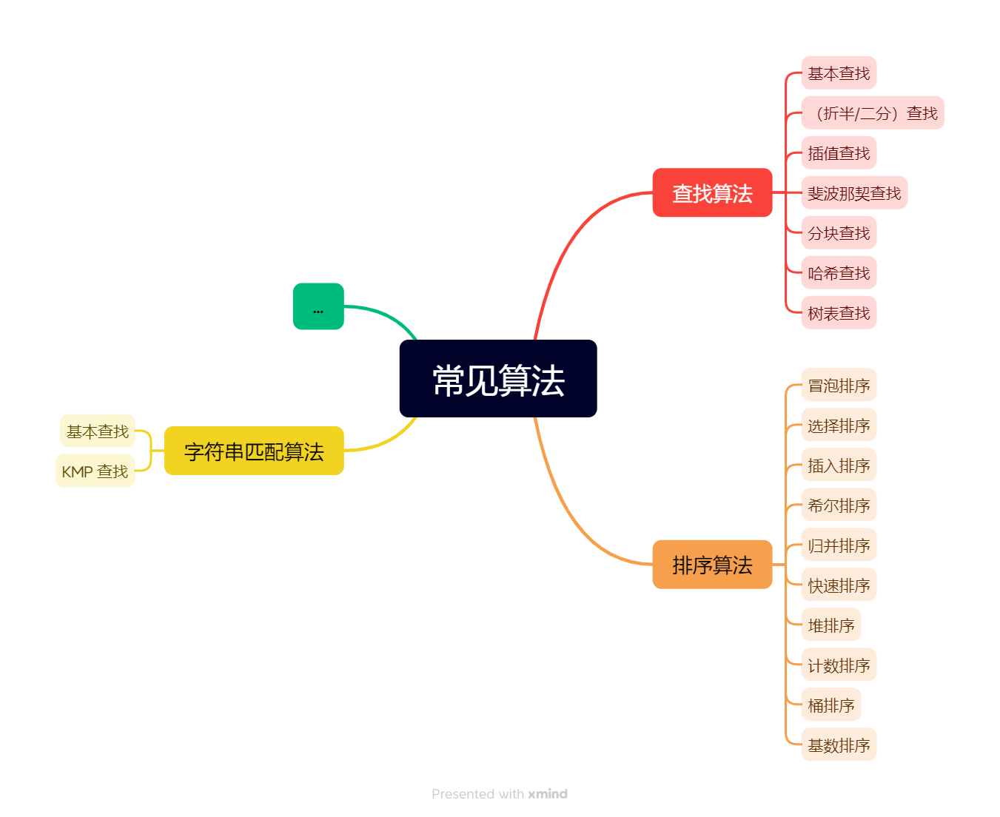
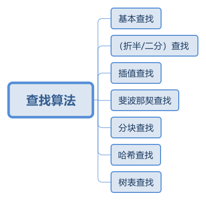
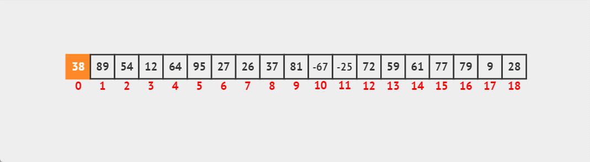
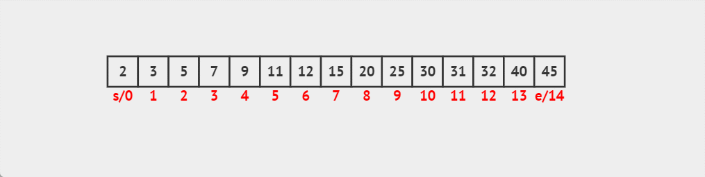
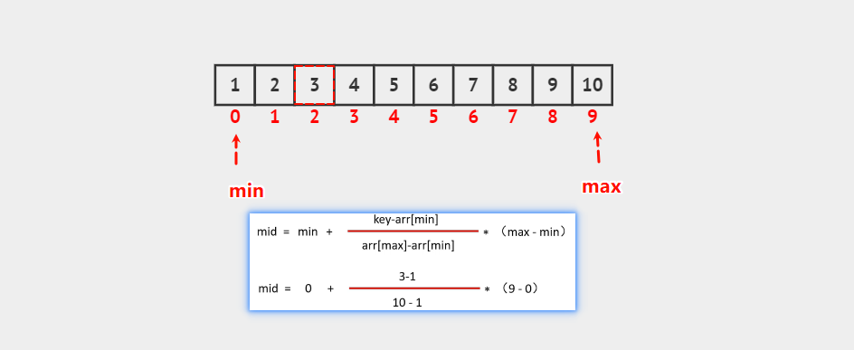
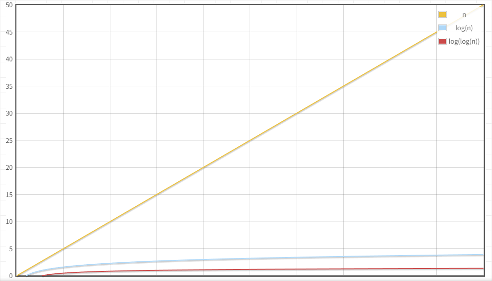
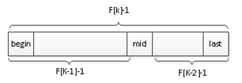

# 第一章：前言

## 1.1 概述

* 很多人认为：将一堆打乱的数据进行`排序`或在一堆数据中`查找`到想要的数据，这就是`算法`。


> [!NOTE]
>
> 其实，上述仅仅是基础操作（基操）而已！！！

* 在企业中，算法都是用来解决一个又一个真实的需求。


## 1.2 常见的算法

* 常见的算法有`查找算法`、`排序算法`以及`字符串匹配算法`等，如下所示：



# 第二章：查找算法

## 2.1 概述

* `查找算法`有`基本查找`、`二分查找`、`插值查找`、`斐波那契查找`、`分块查找`、`哈希查找`以及`树表查找`，如下所示：



## 2.2 基本查找（顺序查找）

* `基本查找（顺序查找）`是最简单的一种查找方法，它通过逐一检查列表中的每个元素，直到找到目标元素为止。如果找到目标元素，则返回其位置，否则返回“未找到”。



* `算法的步骤`：
  * ① 从列表的第一个元素开始，逐个比较每个元素和目标元素是否相等。
  * ② 如果相等，则返回元素的索引。
  * ③ 如果遍历完整个列表都没有找到目标元素，则返回一个表示未找到的值，如：`-1` 。

* `时间复杂度`：**O(n)**，n 表示列表中元素的数量。


* `适用场景`：当数据量较小或数据无序时，顺序查找非常高效。


* 示例：

```java
package com.github.algorithm.search;

public class BasicSearchTest {
    public static void main(String[] args) {
        int[] arr = {2, -6, 4, 6, 2, 5, 88, 4, 5, 7, 0, 7, 5, 2, 1, 64, 98};
        
        int index = indexOf(arr, 98);
        System.out.println(index); // 16
        
        index = indexOf(arr, -100);
        System.out.println(index); // -1
    }

    /**
     * 基本查找
     * @param arr 数组
     * @param num 查找元素
     * @return 元素在数组上的索引，如果元素不在数组中，将返回 -1
     */
    public static int indexOf(int[] arr, int num) {
        for (int i = 0; i < arr.length; i++) {
            if (num == arr[i]) {
                return i;
            }
        }
        return -1;
    }
}
```

## 2.3 二分查找（折半查找）

* `二分查找（折半查找）`是针对已排序的数据结构的一种查找方法。它通过将数据集分成两半来不断缩小查找范围，从而提高查找效率。



* `算法步骤`：
  - ① 将数据集分为两部分，检查中间元素是否为目标元素。
  - ② 如果目标元素小于中间元素，则继续在左半部分查找；如果大于，则在右半部分查找。
  - ③ 重复以上步骤直到找到目标元素，或者查找范围为空。
* `时间复杂度`： **O(log n)**，其中 n 是数据集中的元素数量。


* `适用场景`：仅适用于`已排序`的数据集。


* 示例：

```java
package com.github.algorithm.search;

public class BinarySearchTest {
    public static void main(String[] args) {
        int[] arr = {2, 3, 5, 7, 9, 11, 12, 15, 20, 25, 30, 31, 32, 40, 45};

        int index = indexOf(arr, 20);
        System.out.println(index); // 8

        index = indexOf(arr, -100);
        System.out.println(index); // -1
    }

    /**
     * 二分查找
     * @param arr 数组
     * @param num 查找元素
     * @return 元素在数组上的索引，如果元素不在数组中，将返回 -1
     */
    public static int indexOf(int[] arr, int num) {
        // 定义起始元素索引
        int min = 0;
        // 定义最后元素索引
        int max = arr.length - 1;
        // 循环条件
        while (min <= max) {
            // 计算中间元素索引
            int mid = (min + max) / 2;
            // 如果中间元素就是要查找的元素，直接返回索引
            if (num == arr[mid]) {
                return mid;
            }
            // 如果需要查找的元素比中间的元素小
            // 那么 max 就是此时的 mid+1，然后再计算 mid
            if (num < arr[mid]) {
                max = mid - 1;
            }
            // 如果需要查找的元素比中间的元素大
            // 那么 min 就是此时的 mid-1，然后再计算 mid
            if (num > arr[mid]) {
                min = mid + 1;
            }
        }
        return -1;
    }
}
```

## 2.4 插值查找

* `插值查找`是一种改进的二分查找算法，适用于在`均匀分布的有序数据`中查找元素。它通过估算目标元素在数据中的位置来优化查找过程，从而提高查找效率。



* `算法步骤`：
  - ① 给定一个有序数组 `arr` 和目标元素 `num`，确定查找区间的左右边界 `min` 和 `max`。
  - ② 使用插值公式计算中间位置 `mid`： $[ mid = min+ \frac{(num- arr[min]) \times (max- min)}{arr[max] - arr[min]} ]$ ，这里的 `mid` 位置是根据目标值与当前区间的最小值、最大值的差值来动态估算的。
  - ③ 如果 `arr[mid] == num`，则找到目标元素，返回该位置。
  - ④ 如果 `arr[mid] < num`，则目标元素在右半部分，将 `min = mid + 1`。
  - ⑤ 如果 `arr[mid] > num`，则目标元素在左半部分，将 `max = mid - 1`。
  - ⑥ 重复`步骤②` ~ `步骤⑤`，直到找到目标元素或区间无效，即：`min > max`。

* `时间复杂度`：
  * 最优时间复杂度：**O(log log n)**，当数据均匀分布时，插值查找的效率接近 O(log log n)。
  * 最坏时间复杂度： **O(n)**，当数据分布非常不均匀时，插值查找退化为线性查找，性能最差。



  * `适用场景`：

      - 插值查找适用于`已排序且数据分布比较均匀`的数组。

      - 如果数据不均匀分布或分布不规律，插值查找的性能可能非常差，甚至退化为线性查找，因此不适用于所有有序数据。


* 示例：

```java
package com.github.algorithm.search;

public class InsertBinarySearchTest {
    public static void main(String[] args) {
        int[] arr = {1, 2, 3, 4, 5, 6, 7, 8, 9, 10};

        int index = indexOf(arr, 3);
        System.out.println(index); // 2

        index = indexOf(arr, -1);
        System.out.println(index); // -1
    }

    /**
     * 插值查找
     * @param arr 数组
     * @param num 查找元素
     * @return 元素在数组上的索引，如果元素不在数组中，将返回 -1
     */
    public static int indexOf(int[] arr, int num) {
        // 定义起始元素索引
        int min = 0;
        // 定义最后元素索引
        int max = arr.length - 1;
        // 循环条件
        while (min <= max) {
            // 计算中间元素索引
            int mid = min + (num - arr[min]) / (arr[max] - arr[min]) * (max - min);
            // 如果中间元素就是要查找的元素，直接返回索引
            if (num == arr[mid]) {
                return mid;
            }
            // 如果需要查找的元素比中间的元素小
            // 那么 max 就是此时的 mid+1，然后再计算 mid
            if (num < arr[mid]) {
                max = mid - 1;
            }
            // 如果需要查找的元素比中间的元素大
            // 那么 min 就是此时的 mid-1，然后再计算 mid
            if (num > arr[mid]) {
                min = mid + 1;
            }
        }
        return -1;
    }
}
```

## 2.5 斐波那契查找

### 2.5.1 黄金分割点

* 黄金分割是指将整体一分为二，`较大部分`与`整体部分`的比值等于`较小部分`与`较大部分`的比值，其比值约为 0.618。


### 2.5.2 斐波那契数列

* 在数学中有一个著名的数学规律（斐波那契数列）：0, 1, 1, 2, 3, 5, 8, 13, 21, 34, 55, 89…….

> [!NOTE]
>
> * ① 斐波那契数列存储到数组中，如下所示：
>
> 
>
> * ② 斐波那契数列：对于任意下标k（k>=2），F[k] = F[k-1] + F[k-2]，即：后边每一个数都是前面两个数的和。


* 示例：

```java
package com.github.algorithm.search;

public class Test {
    public static void main(String[] args) {
        int fib = fib(0);
        System.out.println("fib = " + fib);
    }

    /**
     * 获取指定位置上的斐波那契数列
     * @param n 位置
     * @return 数
     */
    public static int fib(int n) {
        if (n == 0) {
            return 0;
        }
        if (n == 1 || n == 2) {
            return 1;
        }
        return fib(n - 1) + fib(n - 2);
    }
}
```


* 示例：

```java
package com.github.algorithm.search;

import java.util.Arrays;

public class Test {
    public static void main(String[] args) {
        int[] fib = fib(3);
        System.out.println("fib = " + Arrays.toString(fib));
    }

    /**
     * 获取斐波那契数列组成的数组
     * @param n 索引
     * @return 数组
     */
    public static int[] fib(int n) {
        int[] arr = new int[n + 1];
        arr[0] = 0;
        if (n >= 1) {
            arr[1] = 1;
        }
        for (int i = 2; i <= n; i++) {
            arr[i] = arr[i - 1] + arr[i - 2];
        }
        return arr;
    }
}
```

### 2.5.3 斐波那契查找的前提

* 如果一个有序表的元素个数为 n，并且 n 正好是某个斐波那契数减 1，即满足 `n = F[k]-1` 时，才能使用斐波那契查找。

> [!NOTE]
>
> * ① 斐波那契查找图示，如下所示：
>
> 
>
> * ② 斐波那契查找公式推导：$[ n = {\color{red}(F_{k-1}-1)} + {\color{blue}(F_{k-2}-1)} + {\color{green}1} = (F_{k-1} + F_{k-2}) - 1 = F_k - 1 ]$

* 如果元素个数 n 不满足这个关系，那么需要将查找表扩展（用最后一个元素扩展），直到 n 满足这个关系 。


* 示例：假设 n = F[k]-1，并且数组长度 n = 7（可以正确的递归执行）


* 示例：假设 n = F[k]，并且数组长度 n = 8（没有保留中间位置，下一次递归，无法继续分割）


### 2.5.4 斐波那契查找（TODO）

* `斐波那契查找`利用斐波那契数列的性质来确定查找区间的大小，并逐步缩小查找范围。

* `算法步骤`：
  * ① 初始化斐波那契数列：首先，确定斐波那契数列中比数组长度大的最小数 ( F(k) )，并设置两个索引 `min = 0` 和 `max = n - 1`，其中 `n` 是数组的长度。
  * ② 计算分割点：使用公式计算当前分割点： [ mid = min + F(k-1) - 1 ] 这里的 `mid` 是通过斐波那契数列来确定的分割点。
  * ③ 比较目标值：
    - 如果 `arr[mid] == num`，则找到了目标元素，返回索引 `mid`。
    - 如果 `arr[mid] > num`，则目标元素在 `mid` 左侧，更新 `max = mid - 1`，并调整斐波那契数列的大小。
    - 如果 `arr[mid] < num`，则目标元素在 `mid` 右侧，更新 `min= mid + 1`，并调整斐波那契数列的大小。
  * ④ 调整斐波那契数列：根据查找结果更新 `k`，即更新斐波那契数列中的位置，直到 `min` 超过 `max`。


* 示例：

```java

```

## 2.6 分块查找


## 2.7 哈希查找


# 第三章：排序算法

## 3.1 概述


# 第四章：Arrays（⭐）

## 4.1 概述

* Arrays 是用来操作数组的工具类，如：对数组中的元素进行排序、搜索数组中指定的元素等。

## 4.2 常用 API

### 4.2.1 将数组内容拼接为字符串

* 返回指定数组内容的字符串表示形式，如：`[元素1，元素2，元素3...]`：

```java
public static String toString(boolean[] a) { ... }
```

```java
public static String toString(char[] a) { ... }
```

```java
public static String toString(double[] a) { ... }
```

```java
public static String toString(long[] a) { ... }
```

```java
public static String toString(Object[] a) { ... }
```

* 返回多维数组内容的字符串表示形式：

```java
public static String deepToString(Object[] a) { ... }
```


* 示例：

::: code-group

```java [Test.java]
package com.github.algorithm.arrays;

import java.util.Arrays;

public class Test {
    public static void main(String[] args) {

        int[] arr = {1, 2, 3, 4, 5, 6};

        System.out.println(Arrays.toString(arr));
    }
}
```

```txt [cmd 控制台]
[1, 2, 3, 4, 5, 6]
```

:::


* 示例：

::: code-group

```java [Student.java]
package com.github.algorithm.arrays;

import java.util.Objects;

public class Student {
    private String name;

    private Integer age;

    public Student() {}

    public Student(String name, Integer age) {
        this.name = name;
        this.age = age;
    }

    @Override
    public boolean equals(Object o) {
        if (o == null || getClass() != o.getClass()) return false;
        Student student = (Student) o;
        return Objects.equals(name, student.name) 
            && Objects.equals(age, student.age);
    }

    @Override
    public int hashCode() {
        return Objects.hash(name, age);
    }

    public Integer getAge() {
        return age;
    }

    public void setAge(Integer age) {
        this.age = age;
    }

    public String getName() {
        return name;
    }

    public void setName(String name) {
        this.name = name;
    }

    @Override
    public String toString() {
        return "Student{" + "name='" + name + '\'' + ", age=" + age + '}';
    }
}

```

```java [Test.java]
package com.github.algorithm.arrays;

import java.util.Arrays;

public class Test {
    public static void main(String[] args) {

        Student[] stuArr = {
            new Student("张三", 18), 
            new Student("李四", 19), 
            new Student("王五", 20),
        };

        System.out.println(Arrays.toString(stuArr));
    }
}
```

```txt [cmd 控制台]
[Student{name='张三', age=18}, Student{name='李四', age=19}, Student{name='王五', age=20}]
```

:::


* 示例：

::: code-group

```java [Test.java]
package com.github.algorithm.arrays;

import java.util.Arrays;

public class Test {
    public static void main(String[] args) {

        int[][] arr = {{11, 12, 13}, {21, 22, 23}, {31, 32, 33, 34}};

        System.out.println(Arrays.deepToString(arr));
    }
}
```

```txt [cmd 控制台]
[[11, 12, 13], [21, 22, 23], [31, 32, 33, 34]]
```

:::

### 4.2.2 二分查找法

* 通过二分查找法，査找指定的元素：

```java
public static int binarySearch(char[] a, char key) { ... }
```

```java
public static int binarySearch(char[] a, int fromIndex, int toIndex,
                                   char key) { ... }
```

```java
public static int binarySearch(double[] a, double key) { ... }
```

```java
public static int binarySearch(double[] a, int fromIndex, int toIndex,
                                   double key) { ... }
```

```java
public static int binarySearch(Object[] a, Object key) { ... }
```

```java
public static int binarySearch(Object[] a, int fromIndex, int toIndex,
                                   Object key) { ... }
```

```java
public static <T> int binarySearch(T[] a, T key, Comparator<? super T> c) { ... }
```

```java
 public static <T> int binarySearch(T[] a, int fromIndex, int toIndex,
                                       T key, Comparator<? super T> c) { ... }
```

```java
public static int binarySearch(long[] a, long key) { ... }
```

```java
public static int binarySearch(long[] a, int fromIndex, int toIndex,
                                   long key) { ... }
```


* 示例：

```java
package com.github.algorithm.arrays;

import java.util.Arrays;

public class Test {
    public static void main(String[] args) {
        int[] arr = {1, 2, 3, 4, 5, 6, 7};

        int index = Arrays.binarySearch(arr, 8);
        System.out.println(index); // -8

        index = Arrays.binarySearch(arr, 6);
        System.out.println(index); // 5
    }
}
```

### 4.2.3 拷贝数组

* 拷贝数组：

```java
/**
* 会根据第二个参数创建新的数组
* 如果新数组的长度 < 旧数组的长度，会部分拷贝
* 如果新数组的长度 = 旧数组的长度，会完全拷贝
* 如果新数组的长度 > 就数组的长度，在完全拷贝的同时，补上默认初始值
*/
public static boolean[] copyOf(boolean[] original, int newLength) { ... }
```

```java
public static <T> T[] copyOf(T[] original, int newLength) { ... }        
```

```java
public static long[] copyOf(long[] original, int newLength) { ... }
```

```java
public static char[] copyOf(char[] original, int newLength) { ... }
```

```java
public static double[] copyOf(double[] original, int newLength) { ... }
```

```java
public static <T,U> T[] copyOf(U[] original, int newLength, Class<? extends T[]> newType) { ... }
```

* 拷贝数组（指定范围）：

```java
/**
* 将老数组指定索引范围的元素拷贝到新数组中。
* [from,to) 包头不包尾，包左不包右
*/
public static boolean[] copyOfRange(boolean[] original, int from, int to) { ... }
```

```java
public static <T> T[] copyOfRange(T[] original, int from, int to) { ... }
```

```java
public static long[] copyOfRange(long[] original, int from, int to) { ... }
```

```java
public static char[] copyOfRange(char[] original, int from, int to) { ... }
```

```java
public static double[] copyOfRange(double[] original, int from, int to) { ... }
```

```java
public static <T,U> T[] copyOfRange(U[] original, int from, int to, Class<? extends T[]> newType) { ... }
```


* 示例：

```java
package com.github.algorithm.arrays;

import java.util.Arrays;

public class Test {
    public static void main(String[] args) {

        int[] arr = {1, 2, 3, 4, 5};

        int[] newArr = Arrays.copyOf(arr, 2);
        System.out.println(Arrays.toString(newArr)); // [1, 2]

        newArr = Arrays.copyOf(arr, arr.length);
        System.out.println(Arrays.toString(newArr)); // [1, 2, 3, 4, 5]

        newArr = Arrays.copyOf(arr, arr.length + 2);
        System.out.println(Arrays.toString(newArr)); // [1, 2, 3, 4, 5, 0, 0]
    }
}
```


* 示例：

```java
package com.github.algorithm.arrays;

import java.util.Arrays;

public class Test {
    public static void main(String[] args) {

        int[] arr = {1, 2, 3, 4, 5};

        int[] newArr = Arrays.copyOfRange(arr, 1, arr.length);
        System.out.println(Arrays.toString(newArr)); // [2, 3, 4, 5]
    }
}
```

### 4.2.4 填充数组

* 将指定元素填充到数组中：

```java
public static void fill(long[] a, long val) { ... }
```

```java
public static void fill(char[] a, char val) { ... }
```

```java
public static void fill(double[] a, double val) { ... }
```

```java
public static void fill(Object[] a, Object val) { ... }
```

* 将指定元素填充到数组中（指定范围）：

```java
public static void fill(long[] a, int fromIndex, int toIndex, long val) { ... }
```

```java
public static void fill(char[] a, int fromIndex, int toIndex, char val) { ... }
```

```java
public static void fill(double[] a, int fromIndex, int toIndex,double val) { ... }
```

```java
public static void fill(Object[] a, int fromIndex, int toIndex, Object val) { ... }
```


* 示例：

```java
package com.github.arrays;

import java.util.Arrays;

public class Test {
    public static void main(String[] args) {
        int[] arr = {1, 2, 3, 4, 5};

        // 填充数组
        Arrays.fill(arr, 10);
        System.out.println(Arrays.toString(arr)); // [10, 10, 10, 10, 10]

        // 重新赋值
        arr = new int[] {1, 2, 3, 4, 5};

        // 填充数组（指定范围）
        Arrays.fill(arr, 1, 3, 100);
        System.out.println(Arrays.toString(arr)); // [1, 100, 100, 4, 5]
    }
}
```

### 4.2.5 数组排序

* 按照默认方式进行数组排序：

```java
public static void sort(long[] a) { ... }
public static void sort(short[] a, int fromIndex, int toIndex) { ... }
```

```java
public static void sort(char[] a) { ... }
public static void sort(char[] a, int fromIndex, int toIndex) { ... }
```

```java
public static void sort(double[] a) { ... }
public static void sort(double[] a, int fromIndex, int toIndex) { ... }
```

```java
public static void sort(Object[] a) { ... }
public static void sort(Object[] a, int fromIndex, int toIndex) { ... }
```

* 按照指定规则进行数组排序：

```java
public static <T> void sort(T[] a, Comparator<? super T> c) { ... }
```

```java
public static <T> void parallelSort(T[] a, int fromIndex, int toIndex,
                                        Comparator<? super T> cmp) { ... }
```


* 示例：按照默认方式进行数组排序（自然排序）

```java
package com.github.arrays;

import java.util.Arrays;

public class Test {
    public static void main(String[] args) {
        int[] arr = {2, 3, 5, 7, 9, 25, 30, 31, 32, 40, 11, 12, 15, 20, 45};

        Arrays.sort(arr);

        // [2, 3, 5, 7, 9, 11, 12, 15, 20, 25, 30, 31, 32, 40, 45]
        System.out.println(Arrays.toString(arr));
    }
}
```


* 示例：按照指定规则进行数组排序（自定义排序）

```java 
package com.github.arrays;

import java.util.Arrays;
import java.util.Comparator;

public class Test {
    public static void main(String[] args) {

        // 包装类型数组，才可以使用自定义排序
        Integer[] arr = {2, 3, 5, 7, 9, 25, 30, 31, 32, 40, 11, 12, 15, 20, 45};

        Arrays.sort(arr, new Comparator<Integer>() {
            @Override
            public int compare(Integer o1, Integer o2) {
                return Integer.compare(o2, o1);
            }
        });

        // [45, 40, 32, 31, 30, 25, 20, 15, 12, 11, 9, 7, 5, 3, 2]
        System.out.println(Arrays.toString(arr));
    }
}
```


* 示例：按照默认方式进行数组排序（自然排序）

::: code-group

```java [Student.java]
package com.github.arrays;

import java.util.Objects;

public class Student implements Comparable<Student> { // [!code highlight]
    private String name;

    private Integer age;

    public Student() {}

    public Student(String name, Integer age) {
        this.name = name;
        this.age = age;
    }

    @Override
    public boolean equals(Object o) {
        if (o == null || getClass() != o.getClass()) return false;
        Student student = (Student) o;
        return Objects.equals(name, student.name) 
            && Objects.equals(age, student.age);
    }

    @Override
    public int hashCode() {
        return Objects.hash(name, age);
    }

    public Integer getAge() {
        return age;
    }

    public void setAge(Integer age) {
        this.age = age;
    }

    public String getName() {
        return name;
    }

    public void setName(String name) {
        this.name = name;
    }

    @Override
    public String toString() {
        return "Student{" + "name='" + name + '\'' + ", age=" + age + '}';
    }

    @Override
    public int compareTo(Student o) { // [!code highlight:5]
        // 先比较年龄，如果年龄不相等，则比较年龄；否则，就比较姓名
        return this.age - o.age != 0
            ? (this.age - o.age) : this.name.compareTo(o.name);
    }
}

```

```java [Test.java]
package com.github.arrays;

import java.util.Arrays;
import java.util.Comparator;

public class Test {
    public static void main(String[] args) {
        // 定义数组
        Student[] stuArr = {
            new Student("张三", 50),
            new Student("李四", 25),
            new Student("王五", 9),
            new Student("赵六", 18),
            new Student("田七", 35),
            new Student("王八", 46),
            new Student("呵呵", 18),
        };

        // 自然排序
        Arrays.sort(stuArr);

        // 打印数组内容
        Arrays.stream(stuArr).forEach(System.out::println);
    }
}
```

```txt [cmd 控制台]
Student{name='王五', age=9}
Student{name='呵呵', age=18}
Student{name='赵六', age=18}
Student{name='李四', age=25}
Student{name='田七', age=35}
Student{name='王八', age=46}
Student{name='张三', age=50}
```

:::


* 示例：按照指定规则进行数组排序（自定义排序）

::: code-group

```java [Student.java]
package com.github.arrays;

import java.util.Objects;

public class Student implements Comparable<Student> { // [!code highlight]
    private String name;

    private Integer age;

    public Student() {}

    public Student(String name, Integer age) {
        this.name = name;
        this.age = age;
    }

    @Override
    public boolean equals(Object o) {
        if (o == null || getClass() != o.getClass()) return false;
        Student student = (Student) o;
        return Objects.equals(name, student.name) 
            && Objects.equals(age, student.age);
    }

    @Override
    public int hashCode() {
        return Objects.hash(name, age);
    }

    public Integer getAge() {
        return age;
    }

    public void setAge(Integer age) {
        this.age = age;
    }

    public String getName() {
        return name;
    }

    public void setName(String name) {
        this.name = name;
    }

    @Override
    public String toString() {
        return "Student{" + "name='" + name + '\'' + ", age=" + age + '}';
    }

    @Override
    public int compareTo(Student o) { // [!code highlight:5]
        // 先比较年龄，如果年龄不相等，则比较年龄；否则，就比较姓名
        return this.age - o.age != 0
            ? (this.age - o.age) : this.name.compareTo(o.name);
    }
}

```

```java [Test.java]
package com.github.arrays;

import java.util.Arrays;
import java.util.Comparator;

public class Test {
    public static void main(String[] args) {
        // 定义数组
        Student[] stuArr = {
            new Student("张三", 50),
            new Student("李四", 25),
            new Student("王五", 9),
            new Student("赵六", 18),
            new Student("田七", 35),
            new Student("王八", 46),
            new Student("呵呵", 18),
        };

        // 自定义排序
        Arrays.sort(stuArr, new Comparator<>() {
            @Override
            public int compare(Student o1, Student o2) {
                return Integer.compare(o2.getAge(), o1.getAge());
            }
        });

        // 打印数组内容
        Arrays.stream(stuArr).forEach(System.out::println);
    }
}
```

```txt [cmd 控制台]
Student{name='张三', age=50}
Student{name='王八', age=46}
Student{name='田七', age=35}
Student{name='李四', age=25}
Student{name='赵六', age=18}
Student{name='呵呵', age=18}
Student{name='王五', age=9}
```

:::


# 第五章：综合练习

## 5.1 练习一

* 需求：定义数组并存储一些女朋友对象，请利用 Arrays 中的 sort 方法进行排序。

> [!NOTE]
>
> 要求：
>
> * ① 属性有姓名、年龄和身高。
> * ② 按照年龄的大小进行排序，如果年龄一样，按照身高排序；如果身高一样，则按照姓名进行排序。


* 示例：

::: code-group

```java [GirFriend.java]
package com.github.test;

import java.util.Objects;

public class GirFriend {

    private String name;

    private Integer age;

    private double height;

    public GirFriend() {}

    public GirFriend(String name, Integer age, double height) {
        this.name = name;
        this.age = age;
        this.height = height;
    }

    public String getName() {
        return name;
    }

    public void setName(String name) {
        this.name = name;
    }

    public Integer getAge() {
        return age;
    }

    public void setAge(Integer age) {
        this.age = age;
    }

    public double getHeight() {
        return height;
    }

    public void setHeight(double height) {
        this.height = height;
    }

    @Override
    public boolean equals(Object o) {
        if (o == null || getClass() != o.getClass()) return false;
        GirFriend girFriend = (GirFriend) o;
        return Double.compare(getHeight(), girFriend.getHeight()) == 0
                && Objects.equals(getName(), girFriend.getName())
                && Objects.equals(getAge(), girFriend.getAge());
    }

    @Override
    public int hashCode() {
        return Objects.hash(getName(), getAge(), getHeight());
    }

    @Override
    public String toString() {
        return "{" + "name='" + name + '\'' 
            + ", age=" + age + ", height=" + height + '}';
    }
}
```

```java [Test.java]
package com.github.test;

import java.util.Arrays;

public class Test {
    public static void main(String[] args) {
        // 创建女朋友对象
        GirFriend gf1 = new GirFriend("泷巧蕊", 18, 1.65);
        GirFriend gf2 = new GirFriend("杨不悔", 19, 1.72);
        GirFriend gf3 = new GirFriend("周芷若", 19, 1.78);
        GirFriend gf4 = new GirFriend("公羊茜", 19, 1.63);
        GirFriend gf5 = new GirFriend("咸含秀", 20, 1.55);
        GirFriend gf6 = new GirFriend("桐合美", 20, 1.55);

        // 创建数组
        GirFriend[] arr = {gf1, gf2, gf3, gf4, gf5, gf6};

        // 对数组中的元素进行排序
        Arrays.sort(arr, (o1, o2) -> {
            if (!o1.getAge().equals(o2.getAge())) {
                return Integer.compare(o1.getAge(), o2.getAge());
            }
            if (Double.compare(o1.getHeight(), o2.getHeight()) != 0) {
                return Double.compare(o1.getHeight(), o2.getHeight());
            }
            return o1.getName().compareTo(o2.getName());
        });

        // 打印数组
        Arrays.stream(arr).forEach(System.out::println);
    }
}
```

```txt[cmd 控制台]
{name='泷巧蕊', age=18, height=1.65}
{name='公羊茜', age=19, height=1.63}
{name='杨不悔', age=19, height=1.72}
{name='周芷若', age=19, height=1.78}
{name='咸含秀', age=20, height=1.55}
{name='桐合美', age=20, height=1.55}
```

:::

## 5.2 练习二

* 需求：有一对兔子，从出生后第 3 个月开始起每个月能生一对兔子，小兔子长到第 3 个月后每个月又能生一对兔子，假设兔子都不死，问第 12 个月兔子的对数是多少？


> [!NOTE]
>
> * 我们可以试图对应的数学模型，如下所示：
>   * ① f(1) = 1。
>   * ② f(2) = 1。
>   * ③ f(3) = 2 = f(2) + f(1)。
>   * ④ f(4) = 3 = f(3) + f(2)。
>   * ⑤ f(5) = 5 = f(3) + f(2)。
>   * ⑥ f(6) = 8 = f(5) + f(4)。
>   * ⑦ ....
> * 综上所述，f(n) = f(n-1) + f(n-2)，如果 n == 1 || n ==2，f(n) = 1 。


* 示例：

```java
package com.github.test;

public class Test {
    public static void main(String[] args) {
        System.out.println(rabbit(1)); // ·
        System.out.println(rabbit(2)); // 2
        System.out.println(rabbit(3)); // 3
        System.out.println(rabbit(4)); // 4
        System.out.println(rabbit(5)); // 5
        System.out.println(rabbit(6)); // 8
        System.out.println(rabbit(7)); // 11
    }

    /**
     * 不死神兔
     *
     * @param num 次数
     * @return 数量
     */
    public static int rabbit(int num) {
        if (num == 1 || num == 2) {
            return 1;
        }
        return rabbit(num - 1) + rabbit(num - 2);
    }
}
```

