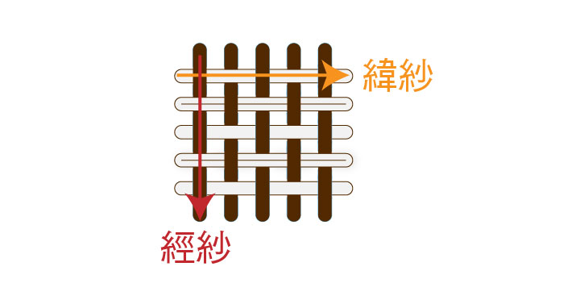
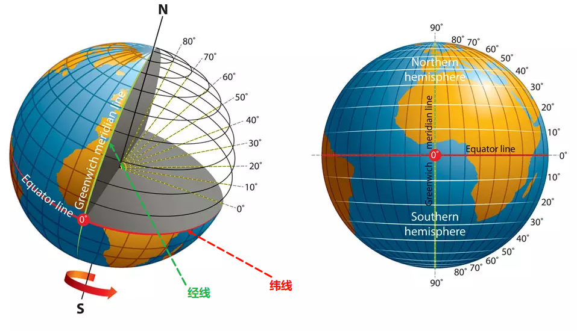
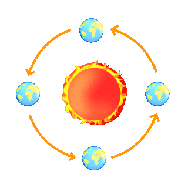
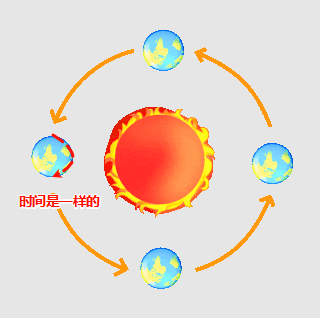
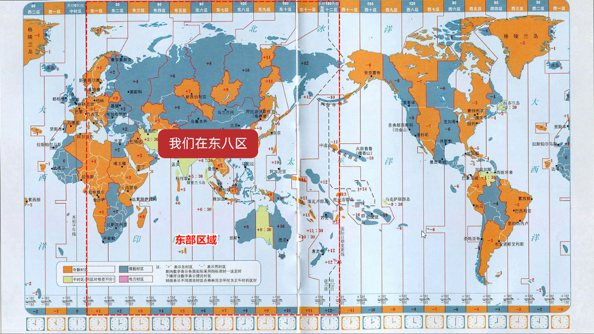
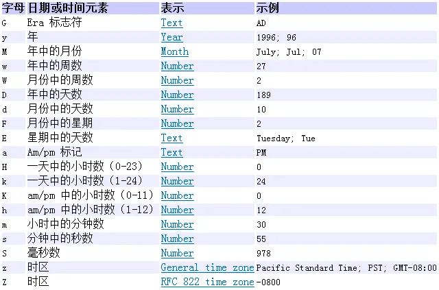
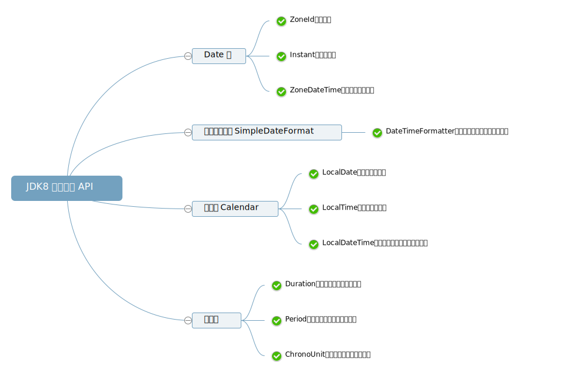
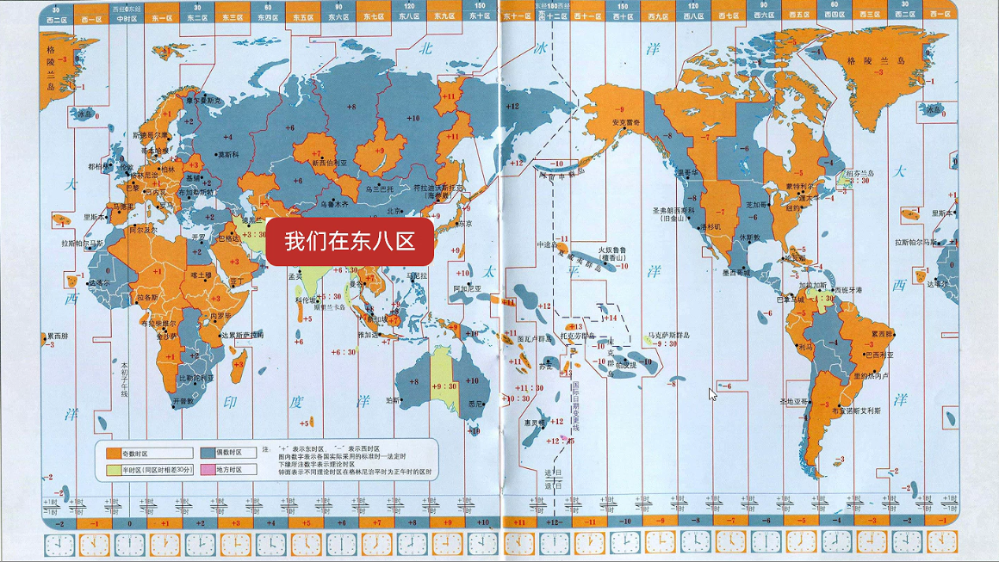
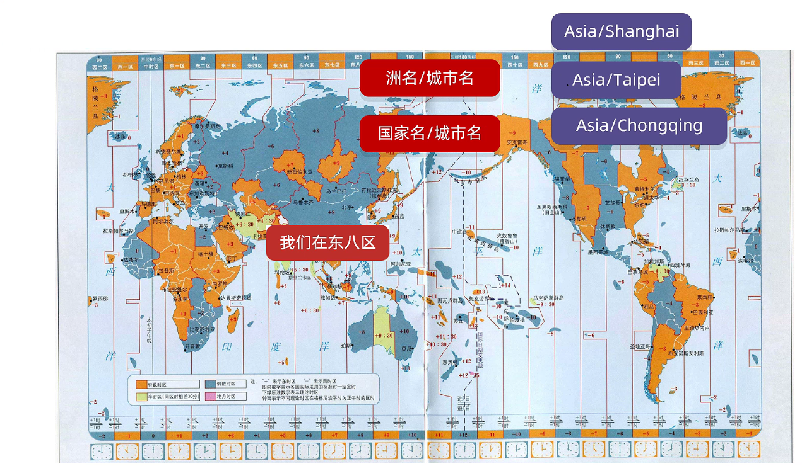

# 第一章：JDK 8 之前时间相关类

## 1.1 概述

* 地球是有`经纬线`的，`经线`（子午线）是连接南北两极竖着的线，而`纬线`（平行线）是与地球赤道平行的环绕地球的假想线，如下所示：

> [!NOTE]
>
> * ① `经线`指示南北方向的位置，并用于测量**经度**，即：地球上某一点相对于本初子午线（0 度经线，通常通过英国格林威治天文台）的东西方向上的角度。所有的经线长度都**相等**，并在南北两极**汇聚**。经度分为**东经 (E)** 和 **西经 (W)**，各有 0° 到 180°。
>
> ::: details 点我查看 具体细节
>
> * `经`是`纵向`、`直的`、`贯穿`的意思，如：“经脉”指身体里纵向的主要通道。
>
> 
>
> * `经线`是连接地球南北两极的，呈现纵向的形态，就像一根根“经”线贯穿地球的南北。因此，用“经”来形容这种纵向的线非常贴切。
>
> :::
>
> * ② `纬线`指示东西方向的位置，并用于测量**纬度**，即：地球上某一点相对于赤道的南北方向上的角度。所有的纬线都互相**平行**，但长度**不相等**，赤道最长，越靠近两极纬线越短，到两极缩成一个点。赤道是 0 度纬线。纬度分为**北纬 (N)** 和 **南纬 (S)**，各有 0°（赤道）到 90°（两极）。
>
> ::: details 点我查看 具体细节
>
> * `纬`是横向的、水平的、交织的意思，如：纬纱”指的是织布过程中横向的纱线。
>
> 
>
> *  `纬线`是与赤道平行的横向圆圈，环绕地球，与纵向的经线交织成网格。因此，用“纬”来形容这种横向的线非常形象。
>
> :::



* 当地球围绕太阳旋转的时候，围绕太阳转一圈是一年（公转），地球自己转一圈是一天（自转），如下所示：



* 在同一条`经线`上的时间是一样的，如下所示：



* 之前，我们都是以`零度经线`为标准，认为它是标准的世界时间，如下所示：

> [!NOTE]
>
> 零度经线（本初子午线），英国的格林威治正好坐落在零度经线上，所以之前的标准世界时间也被称为`格林威治时间`。


* 全世界一共有 24 个时区，每个时区都是按照`标准世界时间`进行`加`或`减`，即：在本初子午线右侧的 12 个时区，称为`东部区域`；剩余的 12 个时区，称为`西部区域`，如下所示：

> [!NOTE]
>
> 中国在东八区，所以中国的标准时间 = 标准世界时间 + 8 。



> [!NOTE]
>
> 总结：
>
> * ① 全世界的时间，有一个统一的计算标准，在 1884 年，规定`零度经线`上的时间是`标准时间`，又因为英国的`格林威治`坐落在`零度经线`上，所以`世界标准时间`也被称为`格林威治时间`（Greenwich Mean Time），简称 `GMT`，其计算的核心是：地球自转一天是 24 小时，再将时间划分为 24 等份，太阳直射时是正午 12 点。
> * ② 上述的计算方式并没有太大的问题，对于平时生活已经足够的；但是，随着时代的发展，人们发现地球自转的速度是不均匀的，使用`格林威治时间`作为`世界时间标准`和`实际真正的时间`是有误差的，历史统计，最大的误差曾达 16 分钟，现在`格林威治时间`已经不再作为`世界标准时间`去使用了。
> * ③ 后来，人们为了彻底解决定义的时间的流逝不均匀的问题，到了 1972 年，开始使用`原子钟`（利用铯原子的震动频率计算出来的时间）定义`世界标准时间`，即：世界协调时间（法语：**T**emps **U**niversel **C**oordonné，简称为`UTC`），所以目前的`世界标准时间`是`世界协调时间`（UTC）。
> * ④ 中国位于东八区，中国标准时间 = 世界标准时间（UTC）+ 8 。

## 1.2 Date

### 1.2.1 概述

* `Date`类用来描述时间，精确到毫秒，这个类的对象表示某个时间点的对象。

### 1.2.2 构造方法

* 使用空参构造方法创建的对象，表示系统当前时间：

```java
public Date() { // [!code focus]
    this(System.currentTimeMillis());
} // [!code focus]
```

* 使用有参构造方法创建的对象，表示指定的时间：

```java
public Date(long date) { // [!code focus]
    fastTime = date;
} // [!code focus]
```


* 示例：

```java
package com.github.date;

import java.util.Date;

public class Test {
    public static void main(String[] args) {
        // 当前系统时间
        Date date = new Date();
        // date = Tue Apr 22 11:03:51 CST 2025
        System.out.println("date = " + date); 
    }
}
```


* 示例：

```java
package com.github.date;

import java.util.Date;

public class Test {
    public static void main(String[] args) {
        // 指定时间
        Date date = new Date(System.currentTimeMillis() + 10);
        // date = Tue Apr 22 11:05:19 CST 2025
        System.out.println("date = " + date);
    }
}
```

### 1.2.3 常用 API

#### 1.2.3.1 将 Date 对象转换为时间戳

* 获取时间对象的毫秒值：

```java
public long getTime() { // [!code focus]
    return getTimeImpl();
} // [!code focus]

private final long getTimeImpl() {
    if (cdate != null && !cdate.isNormalized()) {
        normalize();
    }
    return fastTime;
}
```


* 示例：

```java
package com.github.date;

import java.util.Date;

public class Test {
    public static void main(String[] args) {
        // 当前系统时间
        Date date = new Date();
        // date = Tue Apr 22 11:03:51 CST 2025
        System.out.println("date = " + date);

        long time = date.getTime(); // [!code highlight]
        // time = 1745291495789
        System.out.println("time = " + time);
    }
}
```

#### 1.2.3.2 将毫秒值转换为 Date 对象

* 设置或修改毫秒值：

```java
public void setTime(long time) { // [!code focus]
    fastTime = time;
    cdate = null;
} // [!code focus]
```


* 示例：

```java
package com.github.date;

import java.util.Date;

public class Test {
    public static void main(String[] args) {
        // 指定时间
        Date date = new Date(System.currentTimeMillis() + 1000);
        // date = Tue Apr 22 11:13:44 CST 2025
        System.out.println("date = " + date);
        // 设置或修改毫秒值
        date.setTime(System.currentTimeMillis()); // [!code highlight]
        // date = Tue Apr 22 11:13:43 CST 2025
        System.out.println("date = " + date);
    }
}
```

#### 1.2.3.3 判断当前时间是否晚于指定时间

* 判断当前时间是否晚于指定时间：

```java
public boolean after(Date when) { // [!code focus]
    return getMillisOf(this) > getMillisOf(when);
} // [!code focus]
```


* 示例：

```java
package com.github.date;

import java.util.Date;

public class Test {
    public static void main(String[] args) {
        Date d1 = new Date();

        Date d2 = new Date(d1.getTime() + 100000);

        System.out.println(d1.after(d2)); // false
    }
}
```

#### 1.2.3.4 判断当前时间是否早于指定时间

* 判断当前时间是否早于指定时间：

```java
public boolean before(Date when) { // [!code focus]
    return getMillisOf(this) < getMillisOf(when);
} // [!code focus]
```


* 示例：

```java
package com.github.date;

import java.util.Date;

public class Test {
    public static void main(String[] args) {
        Date d1 = new Date();

        Date d2 = new Date(d1.getTime() + 100000);

        System.out.println(d1.before(d2)); // true
    }
}
```

## 1.3 SimpleDateFormat

### 1.3.1 概述

* `SimpleDateFormat`是格式化时间的类，有如下的作用：
  * ① `格式化`：可以将`Date 对象`格式化我们喜欢的格式，如：`2025-04-22`、`2025/04/22`、`2025年04月22日`等。
  * ② `解析`：可以将`字符串表示的时间`变为`Date 对象`。

### 1.3.2 构造方法

* 使用默认格式，创建一个 SimpleDateFormat 对象：

```java
public SimpleDateFormat() { // [!code focus]
    this("", Locale.getDefault(Locale.Category.FORMAT));
    applyPatternImpl(LocaleProviderAdapter.getResourceBundleBased().getLocaleResources(locale)
                     .getDateTimePattern(SHORT, SHORT, calendar));
} // [!code focus]
```

* 使用指定格式，创建一个 SimpleDateFormat 对象（推荐）：

```java
public SimpleDateFormat(String pattern) { // [!code focus]
    this(pattern, Locale.getDefault(Locale.Category.FORMAT));
} // [!code focus]
```

> [!NOTE]
>
> ::: details 点我查看 pattern 的具体含义
>
> 
>
> :::


* 示例：

```java
package com.github.simple;

import java.text.SimpleDateFormat;
import java.util.Date;

public class Test {
    public static void main(String[] args) {
        SimpleDateFormat format = new SimpleDateFormat();

        String str = format.format(new Date());

        // str = 2025/4/22 下午1:33
        System.out.println("str = " + str);
    }
}
```


* 示例：

```java
package com.github.simple;

import java.text.SimpleDateFormat;
import java.util.Date;

public class Test {
    public static void main(String[] args) {
        SimpleDateFormat format = new SimpleDateFormat("yyyy-MM-dd HH:mm:ss");

        String str = format.format(new Date());

        // str = 2025-04-22 13:33:55
        System.out.println("str = " + str);
    }
}
```

### 1.3.3 常用 API

#### 1.3.3.1 将日期对象格式化为字符串

* 格式化（日期对象 --> 字符串）：

```java
public final String format(Date date){ // [!code focus]
    return format(date, new StringBuffer(),
                  DontCareFieldPosition.INSTANCE).toString();
} // [!code focus]
```


* 示例：

```java
package com.github.simple;

import java.text.SimpleDateFormat;
import java.util.Date;

public class Test {
    public static void main(String[] args) {
        SimpleDateFormat format = new SimpleDateFormat("yyyy-MM-dd HH:mm:ss");

        String str = format.format(new Date()); // [!code highlight]

        // str = 2025-04-22 13:33:55
        System.out.println("str = " + str);
    }
}
```

#### 1.3.3.2 将字符串解析为日期对象

* 解析（字符串 --> 日期对象）：

```java
public Date parse(String source) throws ParseException {  // [!code focus]
    ParsePosition pos = new ParsePosition(0);
    Date result = parse(source, pos);
    if (pos.index == 0)
        throw new ParseException("Unparseable date: \"" + source + "\"" ,
            pos.errorIndex);
    return result;
}  // [!code focus]
```

> [!CAUTION]
>
> 如果给定的字符串内容和 SimpleDateFormat 对象中传递的 pattern 参数不匹配，将会报错！！！


* 示例：

```java
package com.github.simple;

import java.text.ParseException;
import java.text.SimpleDateFormat;
import java.util.Date;

public class Test {
    public static void main(String[] args) throws ParseException {
        SimpleDateFormat format = new SimpleDateFormat("yyyy-MM-dd HH:mm:ss");

        Date parse = format.parse("2012-12-12 12:12:12"); // [!code highlight]

        // parse = Wed Dec 12 12:12:12 CST 2012
        System.out.println("parse = " + parse);
    }
}
```

### 1.3.4 应用示例

* 需求：假设初恋的出生日期是`2000-11-11`，请用字符串表示这个数据，并将其转换为`2000年11月11日`。


* 示例：

```java
package com.github.simple;

import java.text.ParseException;
import java.text.SimpleDateFormat;
import java.util.Date;

public class Test {
    public static void main(String[] args) throws ParseException {
        String str = "2000-11-11";
        // 解析
        SimpleDateFormat sdf1 = new SimpleDateFormat("yyyy-MM-dd");
        Date date = sdf1.parse(str);
        // 格式化
        SimpleDateFormat sdf2 = new SimpleDateFormat("yyyy年MM月dd日");
        String str2 = sdf2.format(date);
        System.out.println(str2); // 2000年11月11日
    }
}
```

### 1.3.5 应用示例

* 需求：秒杀活动。

> [!NOTE]
>
> 用代码判断下面两位同学能否参与这次秒杀活动？
>
> * ① 小贾下单并付款的时间是：`2023年11月11日 0:01:00`。
> * ② 小皮下单并付款的时间是：`2023年11月11日 0:11:00`。


* 示例：

::: code-group

```java [Test.java]
package com.github.simple;

import java.text.ParseException;
import java.text.SimpleDateFormat;
import java.util.Date;

public class Test {
    public static void main(String[] args) throws ParseException {
        SimpleDateFormat sdf = new SimpleDateFormat("yyyy年MM月dd日 HH:mm:ss");
        Date skillStartDate = sdf.parse("2023年11月11日 00:00:00");
        Date skillEndDate = sdf.parse("2023年11月11日 00:10:00");

        Date xiaoJiaDate = sdf.parse("2023年11月11日 00:01:00");
        Date xiaoPiDate = sdf.parse("2023年11月11日 00:11:00");

        if (xiaoJiaDate.after(skillStartDate) 
            && xiaoJiaDate.before(skillEndDate)) {
            System.out.println("小贾可以参与此次秒杀活动");
        } else {
            System.out.println("小贾不能参与此次秒杀活动");
        }

        if (xiaoPiDate.after(skillStartDate) 
            && xiaoPiDate.before(skillEndDate)) {
            System.out.println("小皮可以参与此次秒杀活动");
        } else {
            System.out.println("小皮不能参与此次秒杀活动");
        }
    }
}
```

```txt [cmd 控制台]
小贾可以参与此次秒杀活动
小皮不能参与此次秒杀活动
```

:::

## 1.4 Calendar

### 1.4.1 概述

* Calendar 代表了系统当前时间的日历对象，可以单独修改、获取时间中的年、月、日等。

> [!CAUTION]
>
> Calendar 是一个抽象类，不能直接创建对象；但是，其提供一个静态方法返回 Calendar 实例。

### 1.4.2 构造方法

* 静态方法获取 Calendar 实例：

```java
public static Calendar getInstance(){ // [!code focus]
    Locale aLocale = Locale.getDefault(Locale.Category.FORMAT);
    return createCalendar(defaultTimeZone(aLocale), aLocale);
} // [!code focus]
```


* 示例：

```java
package com.github.calendar;

import java.util.Calendar;

public class Test {
    public static void main(String[] args){
        Calendar calendar = Calendar.getInstance();
        System.out.println("calendar = " + calendar);
    }
}
```

### 1.4.3 常用 API

#### 1.4.3.1 获取日期对象

* 将 Calendar 实例转换为日期对象：

```java
public final Date getTime() { // [!code focus]
    return new Date(getTimeInMillis());
} // [!code focus]
```


* 示例：

```java
package com.github.calendar;

import java.util.Calendar;
import java.util.Date;

public class Test {
    public static void main(String[] args) {
        Calendar calendar = Calendar.getInstance();
        Date date = calendar.getTime();
        // date = Tue Apr 22 14:58:13 CST 2025
        System.out.println("date = " + date);
    }
}
```

#### 1.4.3.2 给日历设置日期对象

* 将日期对象转换为 Calendar 实例：

```java
public final void setTime(Date date) { // [!code focus]
    Objects.requireNonNull(date, "date must not be null");
    setTimeInMillis(date.getTime());
} // [!code focus]
```


* 示例：

```java
package com.github.calendar;

import java.util.Calendar;
import java.util.Date;

public class CalendarTest3 {
    public static void main(String[] args) {
        Calendar calendar = Calendar.getInstance();
        calendar.setTime(new Date());
        System.out.println("calendar = " + calendar);
    }
}
```

#### 1.4.3.3 获取毫秒值

* 将 Calendar 实例转换为毫秒值：

```java
public long getTimeInMillis() { // [!code focus]
    if (!isTimeSet) {
        updateTime();
    }
    return time;
} // [!code focus]
```


* 示例：

```java
package com.github.calendar;

import java.util.Calendar;

public class Test {
    public static void main(String[] args) {
        Calendar calendar = Calendar.getInstance();
        long time = calendar.getTimeInMillis();
        // time = 1745305350908
        System.out.println("time = " + time);
    }
}
```

#### 1.4.3.4 给日历设置毫秒值

* 将毫秒值转换为 Calendar 实例：

```java
public void setTimeInMillis(long millis) { // [!code focus]
    // If we don't need to recalculate the calendar field values,
    // do nothing.
    if (time == millis && isTimeSet && areFieldsSet && areAllFieldsSet
        && (zone instanceof ZoneInfo) && !((ZoneInfo)zone).isDirty()) {
        return;
    }
    time = millis;
    isTimeSet = true;
    areFieldsSet = false;
    computeFields();
    areAllFieldsSet = areFieldsSet = true;
} // [!code focus]
```


* 示例：

```java
package com.github.calendar;

import java.util.Calendar;

public class Test {
    public static void main(String[] args) {
        Calendar calendar = Calendar.getInstance();
        calendar.setTimeInMillis(System.currentTimeMillis());
        System.out.println("calendar = " + calendar);
    }
}
```

#### 1.4.3.5 获取日历中某个字段信息

* 获取日历中某个字段信息：

```java
public int get(int field) { // [!code focus]
    complete();
    return internalGet(field);
} // [!code focus]
```


* 示例：

```java
package com.github.calendar;

import java.util.Calendar;

public class Test {
    public static void main(String[] args) {
        Calendar calendar = Calendar.getInstance();
        int year = calendar.get(Calendar.YEAR);
        System.out.println("year = " + year); // year = 2025
        int month = calendar.get(Calendar.MONTH) + 1;
        System.out.println("month = " + month); // month = 4
        int day = calendar.get(Calendar.DAY_OF_MONTH);
        System.out.println("day = " + day); // day = 22
        int hour = calendar.get(Calendar.HOUR_OF_DAY);
        System.out.println("hour = " + hour); // hour = 14
        int minute = calendar.get(Calendar.MINUTE);
        System.out.println("minute = " + minute); // minute = 53
        int second = calendar.get(Calendar.SECOND);
        System.out.println("second = " + second); // second = 48
        int milliSecond = calendar.get(Calendar.MILLISECOND);
        System.out.println("milliSecond = " + milliSecond); // milliSecond = 658

    }
}
```

#### 1.4.3.6 修改日历中某个字段信息

* 修改日历中某个字段信息：

```java
public void set(int field, int value) { // [!code focus]
    // If the fields are partially normalized, calculate all the
    // fields before changing any fields.
    if (areFieldsSet && !areAllFieldsSet) {
        computeFields();
    }
    internalSet(field, value);
    isTimeSet = false;
    areFieldsSet = false;
    isSet[field] = true;
    stamp[field] = nextStamp++;
    if (nextStamp == Integer.MAX_VALUE) {
        adjustStamp();
    }
} // [!code focus]
```


* 示例：

```java
package com.github.calendar;

import java.util.Calendar;

public class Test {
    public static void main(String[] args) {
        Calendar calendar = Calendar.getInstance();
        calendar.set(Calendar.YEAR,2005);
        // calendar = 2005
        System.out.println("calendar = " + calendar.get(Calendar.YEAR));
    }
}
```

#### 1.4.3.7 为某个字段增加或减少指定的值

* 设置日历字段的偏移量：

```java
public abstract void add(int field, int amount);
```

> [!NOTE]
>
> 如果是增加，amount 是正数；如果是减少，amount 是负数。


* 示例：

```java
package com.github.calendar;

import java.util.Calendar;

public class Test {
    public static void main(String[] args) {
        Calendar calendar = Calendar.getInstance();
        // 日历向后移动 180 天
        calendar.add(Calendar.DAY_OF_MONTH, 180);
        int year = calendar.get(Calendar.YEAR);
        System.out.println("year = " + year); // year = 2025
        int month = calendar.get(Calendar.MONTH) + 1;
        System.out.println("month = " + month); // month = 10
        int day = calendar.get(Calendar.DAY_OF_MONTH);
        System.out.println("day = " + day); // day = 19
        int hour = calendar.get(Calendar.HOUR_OF_DAY);
        System.out.println("hour = " + hour); // hour = 15
        int minute = calendar.get(Calendar.MINUTE);
        System.out.println("minute = " + minute); // minute = 8
        int second = calendar.get(Calendar.SECOND);
        System.out.println("second = " + second); // second = 55
        int milliSecond = calendar.get(Calendar.MILLISECOND);
        System.out.println("milliSecond = " + milliSecond); // milliSecond = 136
    }
}
```


# 第二章：JDK 8 新增时间相关类（⭐）

## 2.1 概述

* Java 1.0 中包含了一个 Date 类，但是它的大多数方法已经在 Java 1.1 中引入 Calendar 类的时候被废弃了。
* 但是，Calendar 并不比 Date 类好多少，它们有如下的问题：
  * ① 可变性：像日期和时间这样的类对象应该是不可变的。Calendar 类可以使用三种方法更改日历字段：`set()` 、`add()` 和 `roll()` 。
  - ② 偏移性：Date 和 Calendar 中的月份是从 0 开始的。
  - ③ 格式化：格式化只对 Date 有效，Calendar 则不行。
  - ④ 它们不是线程安全的，不能处理闰秒等。
* 在 JDK8 之前，对日期和时间的操作一直是 Java 程序员最为痛苦的地方，没有之一。第三方库 joda-time 在 JDK8 出现之前的很长时间备受 Java 程序员欢迎。JDK8 吸收了 joda-time 的精华，以一个新的开始，为 Java 程序员提供优秀的时间日期 API 。
  * ① `java.time` – 包含值对象的基础包。
  - ② `java.time.chrono` – 提供对不同的日历系统的访问。
  - ③ `java.time.format` – 格式化和解析时间和日期。
  - ④ `java.time.temporal` – 包括底层框架和扩展特性。
  - ⑤ `java.time.zone` – 包含时区支持的类。
  
* JDK7 和 JDK8 的对比，如下所示：

| 代码层面                                                | 安全层面                                                     |
| ------------------------------------------------------- | ------------------------------------------------------------ |
| JDK7 编码麻烦，日期对象 <--> 毫秒值。                   | JDK7 在多线程环境下会导致数据安全问题。                      |
| JDK8 编码简单，提供了判断的方法以及计算时间间隔的方法。 | JDK8 的时间日期对象都是不可变对象，一举解决了之前在多线程下导致数据安全的问题。 |

## 2.2 JDK8 新增的时间相关类

* JDK8 新增的时间相关类非常多，如下所示：

| JDK8 新增的时间相关类 | 描述                   |
| --------------------- | ---------------------- |
| ZoneId                | 时区                   |
| Instant               | 时间戳                 |
| ZoneDateTime          | 带时区的时间           |
| DateTimeFormatter     | 用于时间的格式化和解析 |
| LocalDate             | 年、月、日             |
| LocalTime             | 时、分、秒             |
| LocalDateTime         | 年、月、日、时、分、秒 |
| Duration              | 时间间隔（秒，纳秒）   |
| Period                | 时间间隔（年、月、日） |
| ChronoUnit            | 时间间隔（所有单位）   |

* 我们可以对比 JDK7 之前的 API 来学习，如下所示：



## 2.2 时区（ZoneId）

### 2.2.1 概述

* 全世界一共分为 24 个时区，每个时区都是按照`标准世界时间`进行`加`或`减`，中国处于东八区，如下所示：



* Java 在定义时区的时候，并不是采取`东一区`、`东二区`、... ，而是采取`洲名/城市名`或`国家名/城市名`，如下所示：

> [!CAUTION]
>
> * ① Java 在定义时区的时候是没有北京的，如：`Asia/Beijing`。
> * ② 在实际开发中，我们通常会使用`Asia/Shanghai`来表示中国的时区。



### 2.2.2 常用 API

* 获取 Java 中支持的所有时区：

```java
public static Set<String> getAvailableZoneIds() { // [!code focus]
    return new HashSet<String>(ZoneRulesProvider.getAvailableZoneIds());
} // [!code focus]
```

* 获取系统默认的时区：

```java
public static ZoneId systemDefault() { // [!code focus]
    return TimeZone.getDefault().toZoneId();
} // [!code focus]
```

* 获取指定的时区：

```java
public static ZoneId of(String zoneId) { // [!code focus]
    return of(zoneId, true);
} // [!code focus]
```

> [!CAUTION]
>
> Java 提供的时区太多了，我们并不需要记住，只需要使用上面的 API 就可以获取对应的时区！！！


* 示例：

```java
package com.github.jdk8;

import java.time.ZoneId;
import java.util.Set;

public class Test {

    public static void main(String[] args) throws InterruptedException {
        Set<String> availableZoneIds = ZoneId.getAvailableZoneIds();
        System.out.println("availableZoneIds = " + availableZoneIds);
        ZoneId zoneId = ZoneId.systemDefault();
        System.out.println("zoneId = " + zoneId);
        ZoneId zoneId2 = ZoneId.of("Asia/Chongqing");
        System.out.println("zoneId2 = " + zoneId2);
    }
}
```

## 2.3 时间戳（Instant）

### 2.3.1 概述

* Instant 类在 Java 中表示的是时间线上的一个瞬时点（时间戳），它并不直接关联任何特定的时区。 
* Instant 对象本质上是以 UTC（世界协调时间）为基准的时间戳，记录自 1970 年 1 月 1 日 00:00:00（UTC）以来的秒数和纳秒数。 

### 2.3.2 常用 API

#### 2.3.2.1 获取 Instant 对象

* 获取当前时间的 Instant 对象（标准时间 UTC）：

```java
public static Instant now() { // [!code focus]
    return Clock.currentInstant();
} // [!code focus]
```

* 根据秒、毫秒、纳秒获取 Instant 对象（标准时间 UTC）：

```java
// 根据秒获取 Instant 对象
public static Instant ofEpochSecond(long epochSecond) { // [!code focus]
    return create(epochSecond, 0);
} // [!code focus]
```

```java
// 根据毫秒获取 Instant 对象
public static Instant ofEpochMilli(long epochMilli) { // [!code focus]
    long secs = Math.floorDiv(epochMilli, 1000);
    int mos = Math.floorMod(epochMilli, 1000);
    return create(secs, mos * 1000_000);
} // [!code focus]
```

```java
// 根据秒和纳秒获取 Instant 对象
public static Instant ofEpochSecond(long epochSecond, long nanoAdjustment) { // [!code focus]
    long secs = Math.addExact(epochSecond, Math.floorDiv(nanoAdjustment, NANOS_PER_SECOND));
    int nos = (int)Math.floorMod(nanoAdjustment, NANOS_PER_SECOND);
    return create(secs, nos);
} // [!code focus]
```


* 示例：

```java
package com.github.jdk8.instant;

import java.time.Instant;

public class Test {
    public static void main(String[] args) {
        Instant now = Instant.now();
        // now = 2025-04-23T01:02:02.398288Z
        System.out.println("now = " + now);
    }
}
```


* 示例：

```java
package com.github.jdk8.instant;

import java.time.Instant;

public class Test {
    public static void main(String[] args) {

        Instant instant1 = Instant.ofEpochSecond(1);
        // instant1 = 1970-01-01T00:00:01Z
        System.out.println("instant1 = " + instant1);

        Instant instant2 = Instant.ofEpochMilli(1000);
        // instant2 = 1970-01-01T00:00:01Z
        System.out.println("instant2 = " + instant2);

        Instant instant3 = Instant.ofEpochSecond(0, (long) Math.pow(10, 9));
        // instant3 = 1970-01-01T00:00:01Z
        System.out.println("instant3 = " + instant3);
    }
}
```

#### 2.3.2.2 转换时区

* 将 UTC 表示的时间戳转换为指定时区的时间：

```java
public ZonedDateTime atZone(ZoneId zone) { // [!code focus]
    return ZonedDateTime.ofInstant(this, zone);
} // [!code focus]
```


* 示例：

```java
package com.github.jdk8.instant;

import java.time.Instant;
import java.time.ZoneId;
import java.time.ZonedDateTime;

public class Test {
    public static void main(String[] args) {
        Instant now = Instant.now();

        // UTC = 2025-04-23T01:09:18.513139200Z
        System.out.println("UTC = " + now);

        ZonedDateTime zonedDateTime = now.atZone(ZoneId.of("Asia/Shanghai"));

        // 2025-04-23T09:09:18.513139200+08:00[Asia/Shanghai]
        System.out.println("zonedDateTime = " + zonedDateTime);
    }
}
```

#### 2.3.2.3 判断系列方法

* 判断`当前时间戳（时刻）`是否在`指定时间戳（时刻）`之前：

```java
public boolean isBefore(Instant otherInstant) { // [!code focus]
    return compareTo(otherInstant) < 0;
} // [!code focus]
```

* 判断`当前时间戳（时刻）`是否在`指定时间戳（时刻）`之后：

```java
public boolean isAfter(Instant otherInstant) { // [!code focus]
    return compareTo(otherInstant) > 0;
} // [!code focus]
```


* 示例：

```java
package com.github.jdk8.instant;

import java.time.Instant;

public class Test {
    public static void main(String[] args) {
        Instant instant = Instant.ofEpochSecond(0);
        Instant now = Instant.now();

        System.out.println(instant.isBefore(now)); // true
        System.out.println(instant.isAfter(now)); // false
    }
}
```

#### 2.3.2.4 增加时间系列方法

* 在`当前时间戳（时刻）`基础上增加`秒`：

```java
public Instant plusSeconds(long secondsToAdd) { // [!code focus]
    return plus(secondsToAdd, 0);
} // [!code focus]
```

* 在`当前时间戳（时刻）`基础上增加`毫秒`：

```java
public Instant plusMillis(long millisToAdd) { // [!code focus]
    return plus(millisToAdd / 1000, (millisToAdd % 1000) * 1000_000);
} // [!code focus]
```

* 在`当前时间戳（时刻）`基础上增加`纳秒`：

```java
public Instant plusNanos(long nanosToAdd) { // [!code focus]
    return plus(0, nanosToAdd);
} // [!code focus]
```


* 示例：

```java
package com.github.jdk8.instant;

import java.time.Instant;

public class Test {
    public static void main(String[] args) {
        Instant instant = Instant.ofEpochSecond(0);
        // instant = 1970-01-01T00:00:00Z
        System.out.println("instant = " + instant);
        Instant instant2 = instant.plusSeconds(7);
        // instant2 = 1970-01-01T00:00:07Z
        System.out.println("instant2 = " + instant2);
        Instant instant3 = instant.plusMillis(1000);
        // instant3 = 1970-01-01T00:00:01Z
        System.out.println("instant3 = " + instant3);
        Instant instant4 = instant.plusNanos((long) Math.pow(10, 9));
        // instant4 = 1970-01-01T00:00:01Z
        System.out.println("instant4 = " + instant4);
    }
}
```

#### 2.3.2.5 减少时间系列方法

* 在`当前时间戳（时刻）`基础上减少`秒`：

```java
public Instant minusSeconds(long secondsToSubtract) { // [!code focus]
    if (secondsToSubtract == Long.MIN_VALUE) {
        return plusSeconds(Long.MAX_VALUE).plusSeconds(1);
    }
    return plusSeconds(-secondsToSubtract);
} // [!code focus]
```

* 在`当前时间戳（时刻）`基础上减少`毫秒`：

```java
public Instant minusMillis(long millisToSubtract) { // [!code focus]
    if (millisToSubtract == Long.MIN_VALUE) {
        return plusMillis(Long.MAX_VALUE).plusMillis(1);
    }
    return plusMillis(-millisToSubtract);
} // [!code focus]
```

* 在`当前时间戳（时刻）`基础上减少`纳秒`：

```java
public Instant minusNanos(long nanosToSubtract) { // [!code focus]
    if (nanosToSubtract == Long.MIN_VALUE) {
        return plusNanos(Long.MAX_VALUE).plusNanos(1);
    }
    return plusNanos(-nanosToSubtract);
} // [!code focus]
```


* 示例：

```java
package com.github.jdk8.instant;

import java.time.Instant;

public class Test {
    public static void main(String[] args) {
        Instant instant = Instant.now();
        // instant = 2025-04-23T01:37:22.990790600Z
        System.out.println("instant = " + instant);
        Instant instant2 = instant.minusSeconds(7);
        // instant2 = 2025-04-23T01:37:15.990790600Z
        System.out.println("instant2 = " + instant2);
        Instant instant3 = instant.minusMillis(1000);
        // instant3 = 2025-04-23T01:37:21.990790600Z
        System.out.println("instant3 = " + instant3);
        Instant instant4 = instant.minusNanos((long) Math.pow(10, 9));
        // instant4 = 2025-04-23T01:37:21.990790600Z
        System.out.println("instant4 = " + instant4);
    }
}
```

## 2.4 带时区的时间（ZoneDateTime）

### 2.4.1 概述

* ZoneDateTime 用于表示带有时区信息的日期和时间。

### 2.4.2 常用 API

#### 2.4.2.1 获取 ZoneDateTime 对象

* 获取当前时间的 ZoneDateTime 对象（带有时区）：

```java
public static ZonedDateTime now() { // [!code focus]
    return now(Clock.systemDefaultZone());
} // [!code focus]
```

* 年、月、日、时、分、秒、纳秒方式获取 ZoneDateTime 对象（带有时区）：

```java
public static ZonedDateTime of( // [!code focus]
        int year, int month, int dayOfMonth,  // [!code focus]
        int hour, int minute, int second, int nanoOfSecond, ZoneId zone) { // [!code focus]
    LocalDateTime dt = LocalDateTime.of(year, month, dayOfMonth, 
                                        hour, minute, second, nanoOfSecond);
    return ofLocal(dt, zone, null);
} // [!code focus]
```

* Instant + 时区方式获取 ZoneDateTime 对象（带有时区）：

```java
public static ZonedDateTime ofInstant(Instant instant, ZoneId zone) { // [!code focus]
    Objects.requireNonNull(instant, "instant");
    Objects.requireNonNull(zone, "zone");
    return create(instant.getEpochSecond(), instant.getNano(), zone);
} // [!code focus]
```


* 示例：

```java
package com.github.jdk8.zonedatetime;

import java.time.ZonedDateTime;

public class Test {
    public static void main(String[] args) {
        ZonedDateTime now = ZonedDateTime.now();
        // now = 2025-04-23T09:50:51.743019300+08:00[Asia/Shanghai]
        System.out.println("now = " + now);
    }
}
```


* 示例：

```java
package com.github.jdk8.zonedatetime;

import java.time.ZoneId;
import java.time.ZonedDateTime;

public class Test {
    public static void main(String[] args) {

        ZonedDateTime zonedDateTime = ZonedDateTime.of(2025, 4, 3,
                11, 11, 11,
                11, ZoneId.of("Asia/Shanghai"));
        // zonedDateTime = 2025-04-03T11:11:11.000000011+08:00[Asia/Shanghai]
        System.out.println("zonedDateTime = " + zonedDateTime);
    }
}
```


* 示例：

```java
package com.github.jdk8.zonedatetime;

import java.time.Instant;
import java.time.ZoneId;
import java.time.ZonedDateTime;

public class Test {
    public static void main(String[] args) {

        ZonedDateTime zonedDateTime = ZonedDateTime.ofInstant(
            Instant.now(), ZoneId.of("Asia/Shanghai"));
        // zonedDateTime = 2025-04-23T09:57:52.336562200+08:00[Asia/Shanghai]
        System.out.println("zonedDateTime = " + zonedDateTime);
    }
}
```

#### 2.4.2.2 修改时间系列方法

* 修改年：

```java
public ZonedDateTime withYear(int year) { // [!code focus]
    return resolveLocal(dateTime.withYear(year));
} // [!code focus]
```

* 修改秒：

```java
public ZonedDateTime withSecond(int second) { // [!code focus]
    return resolveLocal(dateTime.withSecond(second));
} // [!code focus]
```

* 修改纳秒：

```java
public ZonedDateTime withNano(int nanoOfSecond) { // [!code focus]
    return resolveLocal(dateTime.withNano(nanoOfSecond));
} // [!code focus]
```

* 修改任意时间（年、月、日、时、分、秒、毫秒、纳秒）：

```java
public ZonedDateTime with(TemporalField field, long newValue) { // [!code focus]
    if (field instanceof ChronoField chronoField) {
        switch (chronoField) {
            case INSTANT_SECONDS:
                return create(newValue, getNano(), zone);
            case OFFSET_SECONDS:
                ZoneOffset offset = 
                    ZoneOffset.ofTotalSeconds(
                    chronoField.checkValidIntValue(newValue));
                return resolveOffset(offset);
        }
        return resolveLocal(dateTime.with(field, newValue));
    }
    return field.adjustInto(this, newValue);
} // [!code focus]
```


* 示例：

```java
package com.github.jdk8.zonedatetime;

import java.time.ZonedDateTime;
import java.time.temporal.ChronoField;

public class Test {
    public static void main(String[] args) {

        ZonedDateTime zonedDateTime = ZonedDateTime.now();
        System.out.println("zonedDateTime = " + zonedDateTime);
        // 修改年
        ZonedDateTime zonedDateTime1 = zonedDateTime.withYear(2024);
        System.out.println("zonedDateTime1 = " + zonedDateTime1);
        // 修改月
        ZonedDateTime zonedDateTime2 = zonedDateTime.withMonth(1);
        System.out.println("zonedDateTime2 = " + zonedDateTime2);
        // 修改日
        ZonedDateTime zonedDateTime3 = zonedDateTime.withDayOfMonth(20);
        System.out.println("zonedDateTime3 = " + zonedDateTime3);
        // 修改小时
        ZonedDateTime zonedDateTime4 = zonedDateTime.withHour(1);
        System.out.println("zonedDateTime4 = " + zonedDateTime4);
        // 修改分钟
        ZonedDateTime zonedDateTime5 = zonedDateTime.withMinute(1);
        System.out.println("zonedDateTime5 = " + zonedDateTime5);
        // 修改秒
        ZonedDateTime zonedDateTime6 = zonedDateTime.withSecond(1);
        System.out.println("zonedDateTime6 = " + zonedDateTime6);
        // 修改毫秒
        ZonedDateTime zonedDateTime7 = zonedDateTime.with(ChronoField.MILLI_OF_SECOND, 1);
        System.out.println("zonedDateTime7 = " + zonedDateTime7);
        // 修改纳秒
        ZonedDateTime zonedDateTime8 = zonedDateTime.withNano(1);
        System.out.println("zonedDateTime8 = " + zonedDateTime8);
    }
}
```

#### 2.4.2.3 增加时间系列方法

* 在`当前时间戳（时刻）`基础上增加`年`：

```java
public ZonedDateTime plusYears(long years) { // [!code focus]
    return resolveLocal(dateTime.plusYears(years));
} // [!code focus]
```

* 在`当前时间戳（时刻）`基础上增加`秒`：

```java
public ZonedDateTime plusSeconds(long seconds) { // [!code focus]
    return resolveInstant(dateTime.plusSeconds(seconds));
} // [!code focus]
```

* 在`当前时间戳（时刻）`基础上增加`纳秒`：

```java
public ZonedDateTime plusNanos(long nanos) { // [!code focus]
    return resolveInstant(dateTime.plusNanos(nanos));
} // [!code focus]
```

* 在`当前时间戳（时刻）`基础上增加`任意时间（年、月、日、时、分、秒、毫秒、纳秒）`：

```java
public ZonedDateTime plus(long amountToAdd, TemporalUnit unit) { // [!code focus]
    if (unit instanceof ChronoUnit) {
        if (unit.isDateBased()) {
            return resolveLocal(dateTime.plus(amountToAdd, unit));
        } else {
            return resolveInstant(dateTime.plus(amountToAdd, unit));
        }
    }
    return unit.addTo(this, amountToAdd);
} // [!code focus]
```


* 示例：

```java
package com.github.jdk8.zonedatetime;

import java.time.ZonedDateTime;
import java.time.temporal.ChronoUnit;

public class Test {
    public static void main(String[] args) {
        ZonedDateTime zonedDateTime = ZonedDateTime.now();
        System.out.println("zonedDateTime = " + zonedDateTime);
        // 增加年
        ZonedDateTime zonedDateTime1 = zonedDateTime.plusYears(2024);
        System.out.println("zonedDateTime1 = " + zonedDateTime1);
        // 增加月
        ZonedDateTime zonedDateTime2 = zonedDateTime.plusMonths(1);
        System.out.println("zonedDateTime2 = " + zonedDateTime2);
        // 增加日
        ZonedDateTime zonedDateTime3 = zonedDateTime.plusDays(20);
        System.out.println("zonedDateTime3 = " + zonedDateTime3);
        // 增加小时
        ZonedDateTime zonedDateTime4 = zonedDateTime.plusHours(1);
        System.out.println("zonedDateTime4 = " + zonedDateTime4);
        // 增加分钟
        ZonedDateTime zonedDateTime5 = zonedDateTime.plusMinutes(1);
        System.out.println("zonedDateTime5 = " + zonedDateTime5);
        // 增加秒
        ZonedDateTime zonedDateTime6 = zonedDateTime.plusSeconds(1);
        System.out.println("zonedDateTime6 = " + zonedDateTime6);
        // 增加毫秒
        ZonedDateTime zonedDateTime7 = zonedDateTime.plus(1L, ChronoUnit.MILLIS);
        System.out.println("zonedDateTime7 = " + zonedDateTime7);
        // 增加纳秒
        ZonedDateTime zonedDateTime8 = zonedDateTime.plusNanos(1);
        System.out.println("zonedDateTime8 = " + zonedDateTime8);
    }
}
```

#### 2.4.2.4 减少时间系列方法

* 在`当前时间戳（时刻）`基础上减少`年`：

```java
public ZonedDateTime minusYears(long years) { // [!code focus]
    return (years == Long.MIN_VALUE ? 
            plusYears(Long.MAX_VALUE).plusYears(1) : plusYears(-years));
} // [!code focus]
```

* 在`当前时间戳（时刻）`基础上减少`秒`：

```java
public ZonedDateTime minusSeconds(long seconds) { // [!code focus]
    return (seconds == Long.MIN_VALUE ? 
            plusSeconds(Long.MAX_VALUE).plusSeconds(1) : 
            plusSeconds(-seconds));
} // [!code focus]
```

* 在`当前时间戳（时刻）`基础上减少`纳秒`：

```java
public ZonedDateTime minusNanos(long nanos) { // [!code focus]
    return (nanos == Long.MIN_VALUE ? 
            plusNanos(Long.MAX_VALUE).plusNanos(1) : 
            plusNanos(-nanos));
} // [!code focus]
```

* 在`当前时间戳（时刻）`基础上减少`任意时间（年、月、日、时、分、秒、毫秒、纳秒）`：

```java
public ZonedDateTime minus(long amountToSubtract, TemporalUnit unit) { // [!code focus]
    return (amountToSubtract == Long.MIN_VALUE ? 
            plus(Long.MAX_VALUE, unit).plus(1, unit) : 
            plus(-amountToSubtract, unit));
} // [!code focus]
```


* 示例：

```java
package com.github.jdk8.zonedatetime;

import java.time.ZonedDateTime;
import java.time.temporal.ChronoUnit;

public class Test {
    public static void main(String[] args) {
        ZonedDateTime zonedDateTime = ZonedDateTime.now();
        System.out.println("zonedDateTime = " + zonedDateTime);
        // 减少年
        ZonedDateTime zonedDateTime1 = zonedDateTime.minusYears(2024);
        System.out.println("zonedDateTime1 = " + zonedDateTime1);
        // 减少月
        ZonedDateTime zonedDateTime2 = zonedDateTime.minusMonths(1);
        System.out.println("zonedDateTime2 = " + zonedDateTime2);
        // 减少日
        ZonedDateTime zonedDateTime3 = zonedDateTime.minusDays(20);
        System.out.println("zonedDateTime3 = " + zonedDateTime3);
        // 减少小时
        ZonedDateTime zonedDateTime4 = zonedDateTime.minusHours(1);
        System.out.println("zonedDateTime4 = " + zonedDateTime4);
        // 减少分钟
        ZonedDateTime zonedDateTime5 = zonedDateTime.minusMinutes(1);
        System.out.println("zonedDateTime5 = " + zonedDateTime5);
        // 减少秒
        ZonedDateTime zonedDateTime6 = zonedDateTime.minusSeconds(1);
        System.out.println("zonedDateTime6 = " + zonedDateTime6);
        // 减少毫秒
        ZonedDateTime zonedDateTime7 = zonedDateTime.minus(1L, ChronoUnit.MILLIS);
        System.out.println("zonedDateTime7 = " + zonedDateTime7);
        // 减少纳秒
        ZonedDateTime zonedDateTime8 = zonedDateTime.minusNanos(1);
        System.out.println("zonedDateTime8 = " + zonedDateTime8);
    }
}
```

## 2.5 格式化（DateTimeFormatter）

### 2.5.1 概述

* `DateTimeFormatter` 和 `SimpleDateFormat` 类似，是 JDK8 新增的用于格式化时间的类。

### 2.5.2 静态方法

* 使用静态方法，获取一个 DateTimeFormatter 对象：

```java
public static DateTimeFormatter ofPattern(String pattern) { // [!code focus]
    return new DateTimeFormatterBuilder().appendPattern(pattern).toFormatter();
} // [!code focus]
```

> [!NOTE]
>
> ::: details 点我查看 pattern 的具体含义
>
> 
>
> :::


* 示例：

```java
package com.github.jdk8.format;

import java.time.format.DateTimeFormatter;

public class Test {
    public static void main(String[] args) {
        DateTimeFormatter df = DateTimeFormatter.ofPattern("yyyy-MM-dd HH:mm:ss");

        System.out.println("df = " + df);
    }
}
```

### 2.5.3 常用 API

#### 2.5.3.1 将日期对象格式化为字符串

* 格式化（日期对象 --> 字符串）：

```java
public String format(TemporalAccessor temporal) { // [!code focus]
    StringBuilder buf = new StringBuilder(32);
    formatTo(temporal, buf);
    return buf.toString();
} // [!code focus]
```


* 示例：

```java
package com.github.jdk8.format;

import java.time.ZonedDateTime;
import java.time.format.DateTimeFormatter;

public class Test {
    public static void main(String[] args) {
        DateTimeFormatter df = DateTimeFormatter.ofPattern("yyyy-MM-dd HH:mm:ss");
        // 格式化
        String format = df.format(ZonedDateTime.now());
        // format = 2025-04-23 10:36:35
        System.out.println("format = " + format);
    }
}
```

#### 2.5.3.2 将字符串解析为日期对象

* 解析（字符串 --> 日期对象）：

```java
public TemporalAccessor parse(CharSequence text) { // [!code focus]
    Objects.requireNonNull(text, "text");
    try {
        return parseResolved0(text, null);
    } catch (DateTimeParseException ex) {
        throw ex;
    } catch (RuntimeException ex) {
        throw createError(text, ex);
    }
} // [!code focus]
```

> [!CAUTION]
>
> 如果给定的字符串内容和 DateTimeFormatter 对象中传递的 pattern 参数不匹配，将会报错！！！


* 示例：

```java
package com.github.jdk8.format;

import java.time.LocalDateTime;
import java.time.ZonedDateTime;
import java.time.format.DateTimeFormatter;
import java.time.temporal.TemporalAccessor;

public class Test {
    public static void main(String[] args) {
        DateTimeFormatter df = DateTimeFormatter.ofPattern("yyyy-MM-dd HH:mm:ss");
        // 格式化
        String format = df.format(ZonedDateTime.now());
        // format = 2025-04-23 10:36:35
        System.out.println("format = " + format);
        // 解析
        TemporalAccessor parse = df.parse("2025-05-05 11:11:11");
        LocalDateTime localDateTime = LocalDateTime.from(parse);
        // localDateTime = 2025-05-05T11:11:11
        System.out.println("localDateTime = " + localDateTime);
    }
}
```

## 2.5 日历


## 2.6 工具类


# 第三章：包装类（⭐）

## 3.1 概述


# 第四章：综合练习

## 4.1 练习一

* 需求：键盘录入一些 1~10 日之间的整数，并添加到集合中。直到集合中所有数据和超过 200 为止。


## 4.2 练习二

* 需求：手动实现 parseInt 方法的效果，将字符串形式的数据转成整数。

> [!NOTE]
>
> 字符串中只能是数字不能有其他字符最少一位，最多 10 位日不能开头。


## 4.3 练习三

* 需求：定义一个方法自己实现 toBinaryString 方法的效果，将一个十进制整数转成字符串表示的二进制。


## 4.4 练习四

* 需求：请使用代码实现计算你活了多少天。

> [!NOTE]
>
> 用 JDK7 和 JDK8 两种方式完成。


## 4.5 练习五

* 需求：判断任意的一个年份是闰年还是平年？

> [!NOTE]
>
> * ① 用 JDK7 和 JDK8 两种方式判断。
> * ② 二月有 29 天是闰年，一年有 366 天是闰年。

