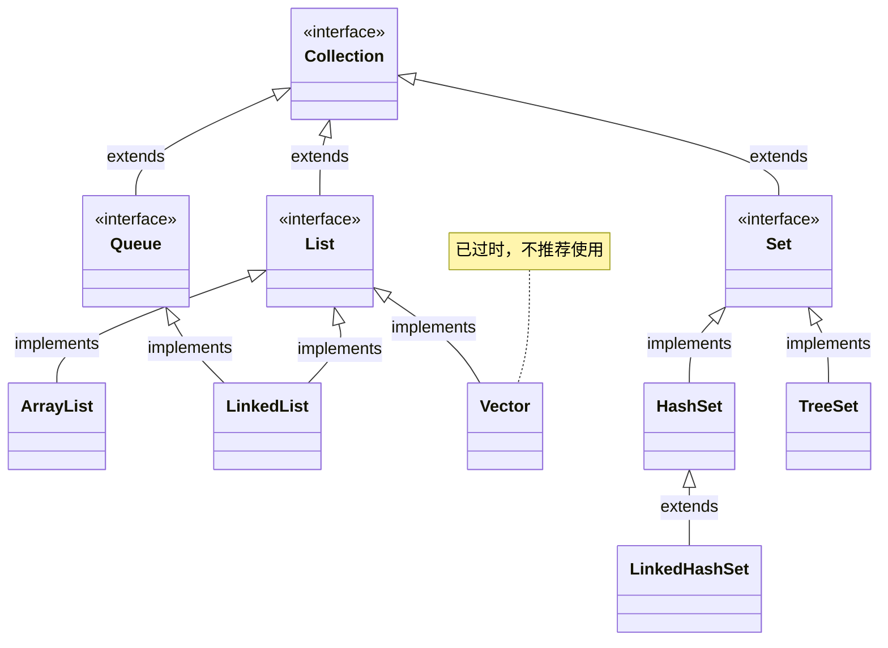
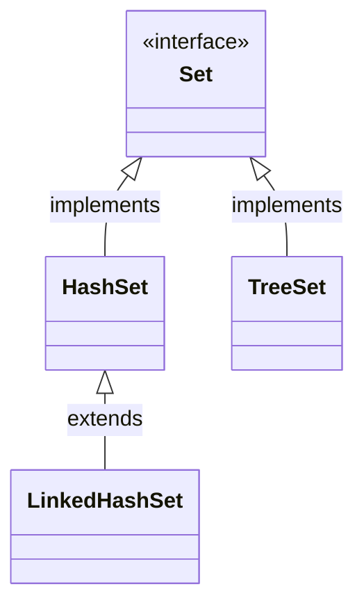
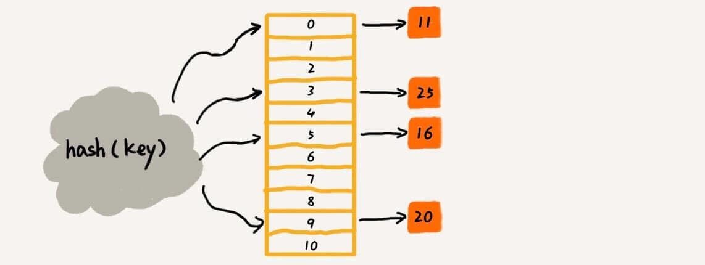
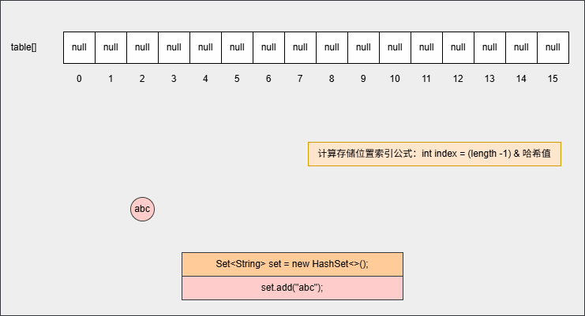
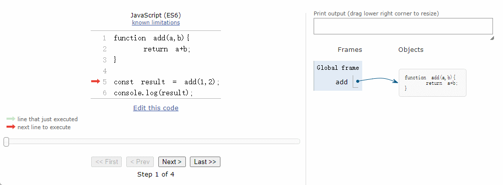
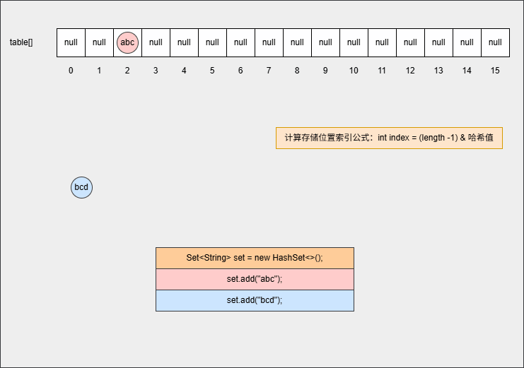
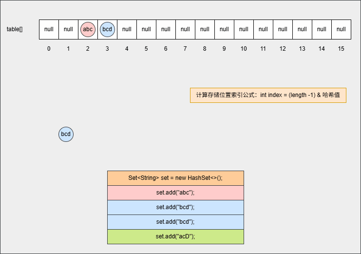
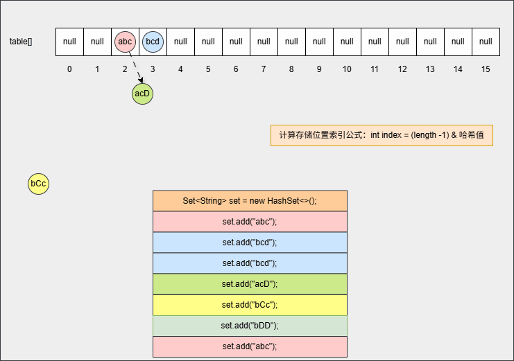
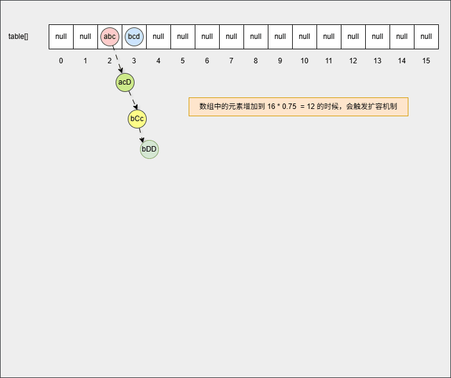

# 第一章：Set 接口（⭐）

## 1.1 概述

* Collection 接口是 List、Set 接口的父接口，该接口中定义的方法既可以用于操作 List 集合，也可以用于操作 Set 集合。

> [!NOTE]
>
> JDK 不提供此接口的任何直接实现，而是提供更具体的子接口（如：List 、Set 等）实现。


```mermaid
classDiagram
    Collection <|-- List :extends
    Collection <|-- Queue :extends
    Collection <|-- Set :extends
    List <|-- ArrayList :implements
    List <|-- LinkedList :implements
    List <|-- Vector :implements
    note for Vector "已过时，不推荐使用"
    Queue <|-- LinkedList :implements
    Set <|-- HashSet :implements
    Set <|-- TreeSet :implements
    HashSet <|-- LinkedHashSet :extends
    class Collection{
        <<interface>>
    }
    class Queue{
        <<interface>>
    }
    class List{
        <<interface>>
    }
    class Set{
        <<interface>>
    }

```

> [!NOTE]
>
> * List 系列集合的特点：添加的元素是有序、可重复、有索引。
>   * `有序`，即：存取元素的顺序一致。
>   * `重复`，即：集合中的元素可以重复。
>   * `有索引`，即：提供获取索引的方法（可以使用普通的 for 循环遍历，也可以通过索引来获取元素）。
> * Set 系列集合的特点：添加的元素是无序、不重复、无索引。
>   * `无序`，即：存取元素的顺序不一致。
>   * `不重复`，即：集合中的元素不能重复（可以利用这个特性去除重复元素）。
>   * `无索引`，即：没有提供获取索引的方法（不能使用普通的 for 循环遍历，也不能通过索引来获取元素）。

## 1.2 Set 系列集合的实现类

* Set 系列集合的类继承体系，如下所示：


```mermaid
classDiagram
    Set <|-- HashSet :implements
    Set <|-- TreeSet :implements
    HashSet <|-- LinkedHashSet :extends
    class Set{
        <<interface>>
    }
```

* Set 系列集合的实现类的特点：
  * ① HashSet：无序、不重复、无索引。
  * ② LinkedHashSet：`有序`、不重复、无索引。
  * ③ TreeSet：`可排序`、不重复、无索引。

## 1.3 常用 API

* 由于`Set`接口继承`Collection`接口，`Set`系列集合的`API`和`Collection`接口保持一致。

| Set 接口常用 API 功能描述 | API 方法签名                                                 |
| ------------------------- | ------------------------------------------------------------ |
| 添加元素                  | `boolean add(E e);`<br>`boolean addAll(Collection<? extends E> c);` |
| 删除元素                  | `boolean remove(Object o);`<br/>`boolean removeAll(Collection<?> c);`<br/>`default boolean removeIf(Predicate<? super E> filter) {}` |
| 清空集合                  | `void clear();`                                              |
| 判断                      | `boolean isEmpty();`<br/>`boolean contains(Object o);`<br/>`boolean containsAll(Collection<?> c);` |
| 获取集合中元素的个数      | `int size();`                                                |
| 交集                      | `boolean retainAll(Collection<?> c);`                        |
| 转数组                    | `Object[] toArray();`<br/>`<T> T[] toArray(T[] a);`<br/>`default <T> T[] toArray(IntFunction<T[]> generator) {}` |
| 遍历方式                  | `迭代器遍历`<br>`增强 for 遍历`<br/>`Lambda 表达式遍历`      |

> [!NOTE]
>
> * ① 当我们向 Set 系列集合添加元素的时候，如果要添加的元素在集合中不存在，方法返回 true ，表示添加成功。
> * ② 如果要添加的元素在集合中已经存在，方法返回 false，表示添加失败，因为 Set 系列集合是不允许元素重复的。
> * ③  在实际开发中，我们通常不会关心`add()`方法或`addAll()`方法的返回值。


* 示例：迭代器遍历

::: code-group

```java [Test.java]
package com.github.collection3;

import java.util.HashSet;
import java.util.Iterator;
import java.util.Set;

public class Test {
    public static void main(String[] args) {
        // 创建一个 Set 集合对象
        Set<Integer> set = new HashSet<>();
        // 向集合中添加元素
        set.add(1);
        set.add(2);
        set.add(3);
        set.add(1);
        // 遍历集合
        Iterator<Integer> it = set.iterator(); // [!code highlight:5]
        while (it.hasNext()) {
            int num = it.next();
            System.out.println(num);
        }
    }
}
```

```txt [cmd 控制台]
1
2
3
```

:::


* 示例：增强 for 遍历

::: code-group

```java [Test.java]
package com.github.collection3;

import java.util.HashSet;
import java.util.Set;

public class Test {
    public static void main(String[] args) {
        // 创建一个 Set 集合对象
        Set<Integer> set = new HashSet<>();
        // 向集合中添加元素
        set.add(1);
        set.add(2);
        set.add(3);
        set.add(1);
        // 遍历集合
        for (int num : set) { // [!code highlight:3]
            System.out.println(num);
        }
    }
}
```

```txt [cmd 控制台]
1
2
3
```

:::


* 示例：Lambda 表达式遍历

::: code-group

```java [Test.java]
package com.github.collection3;

import java.util.HashSet;
import java.util.Set;

public class Test {
    public static void main(String[] args) {
        // 创建一个 Set 集合对象
        Set<Integer> set = new HashSet<>();
        // 向集合中添加元素
        set.add(1);
        set.add(2);
        set.add(3);
        set.add(1);
        // 遍历集合
        set.forEach(System.out::println); // [!code highlight]
    }
}
```

```txt [cmd 控制台]
1
2
3
```

:::

## 1.4 HashSet

### 1.4.1 概述

* HashSet 是 Set 接口的典型实现，大多数时候使用 Set 集合的时候都使用这个实现类。 
* HashSet 底层原理：
  * ① HashSet 集合底层采取的是`哈希表`来存储数据的。
  * ② 哈希表是一种对于增删改查的性能都非常好的数据结构。



* 哈希表的组成：
  * ① JDK8 之前：`数组+链表`。
  * ② JDK8 之后：`数组+链表+红黑树`。

### 1.4.2 哈希值

#### 1.4.2.1 概述

* 在`哈希表`中有一个非常重要的值叫做`哈希值`，其是哈希表中的灵魂所在。

> [!NOTE]
>
> * ① `哈希值`是数据（对象）的`整数`表现形式！！！
> * ② 在 Java 中，集合存储的数据（元素）都是对象（引用数据类型）。

* 哈希表的底层就是数组，如下所示：


* 当我们要添加一个数据，它不是从 0 索引开始依次往后进行存储的，而是通过公式计算出该数据（对象）在数组中索引：

> [!NOTE]
>
> 计算数据（对象）在数组中存储位置（索引）的公式：int index = (数组长度 -1) & 哈希值。


* 既然是根据下面的公式，计算出数据（对象）在数组中的索引：

```txt
int index = (数组长度 -1) & 哈希值
```

> [!NOTE]
>
> * ① 我们需要将`数据（对象）`变为整数（哈希值），这样上面的等式才能成立！！！

* 在 Java 中，`哈希值`是通过`hashCode()`方法计算出来的 int 类型的数据。而 Java 中的顶级父类 Object 类就有该方法的具体实现，如下所示：

```java
package java.lang;

public class Object {
    
    // 计算对象的 hashCode，返回值是 int 类型
 	public native int hashCode(); // [!code highlight]
    
    ...
}    
```

> [!NOTE]
>
> * ① 默认情况下，hashCode() 方法返回的是对象的地址值。
> * ② 在实际开发中，我们经常需要重写 hashCode() 方法，利用对象内部的属性来计算哈希值。

#### 1.4.2.2 特点

* ① 如果没有重写 hashCode() 方法，不同的对象计算出来的`哈希值`是不同的。

::: code-group

```java [Student.java]
package com.github.collection3;

public class Student {
    private Integer id;
    private String name;
    private Integer age;

    public Student(Integer id, String name, Integer age) {
        this.id = id;
        this.name = name;
        this.age = age;
    }

    public Integer getId() {
        return id;
    }

    public void setId(Integer id) {
        this.id = id;
    }

    public String getName() {
        return name;
    }

    public void setName(String name) {
        this.name = name;
    }

    public Integer getAge() {
        return age;
    }

    public void setAge(Integer age) {
        this.age = age;
    }

    @Override
    public String toString() {
        return "Student{" +
                "id=" + id +
                ", name='" + name + '\'' +
                ", age=" + age +
                '}';
    }
}
```

```java [Test.java]
package com.github.collection3;

public class Test {
    public static void main(String[] args) {
        Student s1 = new Student(1, "张三", 18);
        Student s2 = new Student(1, "张三", 18);

        System.out.println(s1.hashCode()); // 990368553
        System.out.println(s2.hashCode()); // 1096979270
        System.out.println(s1.hashCode() == s2.hashCode()); // false
    }
}
```

:::

* ② 如果已经重写 hashCode() 方法，不同的对象，只要属性值相同，计算出来的`哈希值`就应该是一样的。

::: code-group

```java [Student.java]
package com.github.collection3;

import java.util.Objects;

public class Student {
    private Integer id;
    private String name;
    private Integer age;

    public Student(Integer id, String name, Integer age) {
        this.id = id;
        this.name = name;
        this.age = age;
    }

    public Integer getId() {
        return id;
    }

    public void setId(Integer id) {
        this.id = id;
    }

    public String getName() {
        return name;
    }

    public void setName(String name) {
        this.name = name;
    }

    public Integer getAge() {
        return age;
    }

    public void setAge(Integer age) {
        this.age = age;
    }

    @Override
    public boolean equals(Object o) { // [!code highlight:7]
        if (o == null || getClass() != o.getClass()) return false;
        Student student = (Student) o;
        return Objects.equals(getId(), student.getId())
                && Objects.equals(getName(), student.getName())
                && Objects.equals(getAge(), student.getAge());
    }

    @Override
    public int hashCode() { // [!code highlight:3]
        return Objects.hash(getId(), getName(), getAge());
    }

    @Override
    public String toString() {
        return "Student{" +
                "id=" + id +
                ", name='" + name + '\'' +
                ", age=" + age +
                '}';
    }
}
```

```java [Test.java]
package com.github.collection3;

public class Test {
    public static void main(String[] args) {
        Student s1 = new Student(1, "张三", 18);
        Student s2 = new Student(1, "张三", 18);

        System.out.println(s1.hashCode()); // 24052329
        System.out.println(s2.hashCode()); // 24052329
        System.out.println(s1.hashCode() == s2.hashCode()); // true
    }
}
```

:::

* ③ 在小概率情况下，不同属性值或者不同地址值计算出来的哈希值可能一样（哈希碰撞）。

> [!NOTE]
>
> * ① 在 Java 中，int 的取值范围是`[-2³¹,2³¹ - 1]`，即：`-21亿 ~ +21亿`。
> * ② 如果我在 Java 中创建 50 亿个对象，那么至少有 8 亿对象的哈希值是一样的，即：`50-(21-(-21))=8`亿。
> * ③ 哈希碰撞有可能发生，但是几率不高！！！

```java
package com.github.collection3;

public class Test {
    public static void main(String[] args) {
        // String 在 Java 中也是对象
        // "abc" 和 "acD" 虽然是不同的对象，但是它们的哈希值是相同的
        System.out.println("abc".hashCode()); // 96354
        System.out.println("acD".hashCode()); // 96354
        System.out.println("abc".hashCode() == "acD".hashCode()); // true
    }
}
```

### 1.4.3 HashSet 的底层原理

* ① 当我们创建一个 HashSet 集合对象的时候，如下所示：

```java
Set<String> set = new HashSet<>();
```

* 其背后会创建一个默认长度`16`，默认加载因子`0.75`的数组，数组名是`table`，如下所示：


* ② 当我们向 HashSet 集合中添加元素的时候，

```java
set.add("abc");
```

* 其背后会根据`元素`的`哈希值`和`数组的长度`，计算出`元素`在数组中要存储的`位置`（索引）：



* ③ 为什么计算索引的公式是 `int index = (length -1) & 哈希值`？

```txt
假设数组的长度是 16，那么 length - 1 = 15，其二进制是 0000 0000 0000 1111 
如果对象的哈希值是 123456，其二进制就是 0011 0000 0011 1001 

   0000 0000 0000 1111
&  0011 0000 0011 1001
---------------------
   0000 0000 0000 1001

而 0000 0000 0000 1001 对应的十进制是 9 ，正好在 0 - 15 之间，即：数组的索引范围
任意数据的二进制和 0000 0000 0000 1111 与的结果，都是保留低 4 位，恰好在数组索引范围 
```

* ④ 判断当前位置是否为 null ，如果是 null 直接存入。



* ⑤ 此时，继续添加元素，如下所示：

```java
set.add("bcd");
```

* 其背后会重复 ②、③ 、④ 步骤，如下所示：



* ⑥ 此时，继续添加元素，如下所示：

```java
set.add("bcd");
set.add("acD");
```

* 其背后会重复 ②、③ 步骤，但是如果位置不是 null ，则表明该位置有元素，就需要调用 equals() 方法比较属性值。

> [!NOTE]
>
> * ① equals() 方法的结果：如果一样，直接丢弃。如果不一样，就存入到数组中，形成链表。
> * ② 为什么还需要调用 equals() 方法来判断？因为有小概率情况会出现哈希碰撞，即：两个不同的对象其哈希值是相同的，如：`"abc"` 和 `"aCD"`，在这种情况下，就需要调用 equals() 方法比较其内部属性值。



* ⑦ 如果位置不为 null，并且调用 equals() 方法比较属性值，其结果是 false ，JDK 各个版本的操作是不一样的：

> [!NOTE]
>
> * ① 调用 equals() 方法比较属性值，其结果是 false，表示要添加的元素和指定位置上的元素不一样。
> * ② JDK8 之前：新元素添加到数组中，老元素挂在新元素的下面。


* ⑧ 如果位置不为 null，并且调用 equals() 方法比较属性值，其结果是 false ，JDK 各个版本的操作是不一样的：

> [!NOTE]
>
> * ① 调用 equals() 方法比较属性值，其结果是 false，表示要添加的元素和指定位置上的元素不一样。
> * ② JDK8 之后：新元素直接挂到老元素下面。


* ⑨ 此时，继续添加元素，如下所示：

```java
set.add("bCc");
set.add("bDD");
set.add("abc");
```

* 其背后会重复 ②、③ 步骤，但是如果位置不是 null ，则表明该位置有元素，就需要调用 equals() 方法比较属性值。

> [!NOTE]
>
> * ① equals() 方法的结果：如果一样，直接丢弃。如果不一样，就存入到数组中，形成链表。
> * ② 为什么还需要调用 equals() 方法来判断？因为有小概率情况会出现哈希碰撞，即：两个不同的对象其哈希值是相同的，如：`"abc"` 和 `"aCD"`，在这种情况下，就需要调用 equals() 方法比较其内部属性值。



* ⑩ 此时，继续添加元素，如下所示：

```java
set.add("???");
...
set.add("???");
```

* 当数组中的元素的个数增加到 `16 * 0.75 = 12` ，此时数组会扩容为原来的 2 倍，如下所示：

> [!NOTE]
>
> 新数组的长度就是 16 * 2 = 32 。



* ⑪ 但是，如果链表长度 > 8 并且数组长度 >= 64 时，链表就会自动转成红黑树，以便提高查找的效率。

