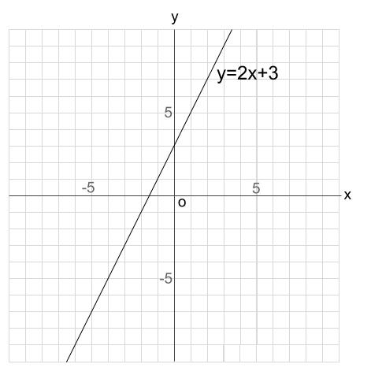
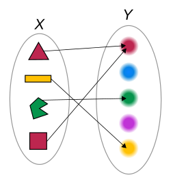

# 第一章：函数式编程

## 1.1 概述

* 2014 年 3 月，Oracle 推出了 JDK8 ，为我们带来了如下的特性：
  * ① `Lambda 表达式`：使得 Java 能够支持函数式编程。它允许我们以简洁的方式表达匿名函数，从而可以更灵活地处理集合、流等操作。
  * ② `Stream API` ：提供了一种通过声明性方式处理集合的手段。它支持函数式编程中的流式操作，可以通过流水线式的方式进行数据转换、过滤、聚合等操作。Stream API 让我们能够在不改变原数据的情况下，以更高效、更清晰的方式进行数据处理。
  * ③ `接口中新增默认方法和静态方法`：这样接口可以拥有实现，而不影响其实现类，即：避免了为接口添加新方法时破坏现有实现类的兼容性。
  * ④ `Optional 类`：容器类，其目的是更优雅地防止空指针异常（NullPointerException）。
  * ⑤ `新的日期时间 API`：ZoneId、Instant、DateTimeFormatter、LocalDateTime 等。
  * ⑥ `方法引用`：是 Lambda 表达式的一种简化形式，它可以引用已有的方法，而不需要显式地写出 Lambda 表达式。
* 其中，最为重要的特性就是`Lambda 表达式`和`Stream API`，极大地增强了 Java 对函数式编程范式的支持。

> [!NOTE]
>
> 函数式编程强调：
>
> - **不可变性**：避免使用可变的对象，通过值传递数据而不是通过引用传递。
> - **高阶函数**：函数可以作为参数传递，或者返回值。
> - **纯函数**：没有副作用，输出仅仅依赖于输入。

* 通过`Lambda 表达式`，Java 程序员可以编写更加简洁且具有表达力的代码。
* 与此同时，`Stream API`提供的流水线式数据处理，符合函数式编程的思想，强调通过组合小的函数来实现复杂的操作。
* `Optional`类的引入也是函数式编程中对`空指针异常`的优雅处理方式之一。

## 1.2 函数

### 1.2.1 什么是函数？

* 在初中，`函数`是这么定义的：在一个变化过程中有两个变量 x 和 y，对于 x 的每一个值，都有唯一的一个 y 值与之对应，我们称 y 是 x 的函数，其中 x 是自变量，y 是因变量。




* 在高中，`函数`是这么定义的：X、Y 是两个非空的数集，如果按照某种确定的对应关系 f，对于集合 X 的任意一个数 x ，在集合 Y 中都有唯一确定的 f(x) 和它对应，那么就称：X→Y 为从集合 X 到集合 Y 的一个函数，记作：y=f(x)，x∈X 。



* 其实，`函数`就是`规则`（类似于机器或黑箱），给予输入值 x 便产生唯一的输出值 y 。

> [!NOTE]
>
> * 假设有这样的一组数据，如下所示：
>
> | 输入 x | 函数（规则，f） | 输出 y |
> | ------ | --------------- | ------ |
> | 1      | ?               | 3      |
> | 2      | ?               | 6      |
> | 3      | ?               | 9      |
> | ...    | ...             | ...    |
>
> * 那么，这组数据对应的规则就是 `y = f(x) = 3 * x` ，如下所示：
>
> | 输入 x | 函数（规则，f） | 输出 y |
> | ------ | --------------- | ------ |
> | 1      | 3 * 1           | 3      |
> | 2      | 3 * 2           | 6      |
> | 3      | 3 * 3           | 9      |
> | ...    | ...             | ...    |


### 1.2.2 合格的函数

* 合格的函数：只要输入相同，无论多少次调用，无论什么时候调用，输出都相同（无副作用）。

> [!NOTE]
>
> * ① `相同的输入总是返回相同的输出`：无论什么时候调用这个函数，只要给定相同的输入，函数的输出一定的相同的，即：合格的函数（纯函数）不依赖于外部的状态或者可变的数据，即：可以依赖外部不可变的数据，函数的行为仅仅取决于其输入输出，如：`y = x * x`，只要 x = 2 ，y 就是 4 。
> * ② `没有副作用`： 副作用是指在函数执行过程中对外部世界的任何影响，如：修改全局变量、改变输入参数的值、进行输入输出操作（打印或文件写入）、修改文件或数据库状态等。合格的函数（纯函数）不能有这些副作用，它只能依赖输入并计算出结果，而不改变外部状态。

> [!CAUTION]
>
>  Java 中的`成员方法`也是合格的函数（纯函数）！！！


* 示例：合格的函数（纯函数）

```java
package com.github.lambda;

public class Test {
    public static void main(String[] args) {
        System.out.println(square(4)); // 16
        System.out.println(square(4)); // 16
        System.out.println(square(4)); // 16
        System.out.println(square(4)); // 16
        System.out.println(square(4)); // 16
        System.out.println(square(4)); // 16
        System.out.println(square(4)); // 16
        System.out.println(square(4)); // 16
        System.out.println(square(4)); // 16
    }

    /**
     * 合格的函数（纯函数）
     * @param x 输入
     * @return 输出
     */
    public static int square(int x) { // [!code highlight:3]
        return x * x;
    }
}
```


* 示例：不合格的函数

::: code-group

```java [Test.java]
package com.github.lambda;

public class Test {
    public static final Buddha buddha = new Buddha("满天神佛");

    public static void main(String[] args) {
        System.out.println(pray("张三"));
        System.out.println(pray("张三"));
        System.out.println(pray("张三"));
        buddha.name = "魔王"; // [!code highlight]
        System.out.println(pray("张三"));
    }

    /**
     * 不合格的函数（有副作用），依赖于外部可变的数据
     * @param person 输入
     * @return 输出
     */
    public static String pray(String person) { // [!code highlight:3]
        return person + "向【" + buddha.name + "】祈祷";
    }

    public static class Buddha {

        String name; // [!code highlight]

        public Buddha(String name) {
            this.name = name;
        }
    }
}
```

```txt [cmd 控制台]
张三向【满天神佛】祈祷
张三向【满天神佛】祈祷
张三向【满天神佛】祈祷
张三向【魔王】祈祷
```

:::


* 示例：合格的函数（纯函数）

::: code-group

```java {10} [Test.java]
package com.github.lambda;

public class Test {
    public static final Buddha buddha = new Buddha("满天神佛");

    public static void main(String[] args) {
        System.out.println(pray("张三"));
        System.out.println(pray("张三"));
        System.out.println(pray("张三"));
        // buddha.name = "魔王"; 
        System.out.println(pray("张三"));
    }

    /**
     * 合格的函数（没有副作用），不依赖于外部的状态或者可变的数据
     * 换言之，合格的函数（没有副作用）可以依赖于不可变的数据
     * @param person 输入
     * @return 输出
     */
    public static String pray(String person) { // [!code highlight:3]
        return person + "向【" + buddha.name + "】祈祷";
    }

    public static class Buddha {

        final String name; // [!code highlight]

        public Buddha(String name) {
            this.name = name;
        }
    }
}
```

```txt [cmd 控制台]
张三向【满天神佛】祈祷
张三向【满天神佛】祈祷
张三向【满天神佛】祈祷
张三向【满天神佛】祈祷
```

:::


* 示例：合格的函数（成员方法）

::: code-group

```java [Student.java]	
package com.github.lambda.demo1;

public class Student {
    String name;

    public Student() {
    }

    public Student(String name) {
        this.name = name;
    }

    /**
     * 合格的函数（纯函数）
     */
    public String getName(Student this) { // [!code highlight:3]
        return name;
    }

    public void setName(String name) {
        this.name = name;
    }
}
```

```java [Test.java]
package com.github.lambda.demo1;

public class Test {
    public static void main(String[] args) {
        Student s1 = new Student("张三");
        System.out.println(s1.getName()); // 底层会这么执行 getName(s1)
        System.out.println(s1.getName()); // 底层会这么执行 getName(s1)

        Student s2 = new Student("张三");
        System.out.println(s2.getName()); // 底层会这么执行 getName(s2)
        System.out.println(s2.getName()); // 底层会这么执行 getName(s2)
    }
    
}
```

:::

### 1.2.3 有形的函数

#### 1.2.3.1 其它语言中有形的函数

* 在函数式编程中，`函数`是`头等公民`，即：`函数可以写到任意位置`，可以作为函数的形参、函数的返回值、赋值给某个变量甚至存储到数据结构（数组、Set、Map）中。

> [!NOTE]
>
> JavaScript 是一门支持函数式编程的计算机语言，即：在 JavaScript 中，函数是头等公民！！！

* ① 函数可以被赋值给变量（函数表达式）

```js
let foo = function(){ // [!code highlight]
    console.log('foo 函数被执行了');
}

foo();
```

* ② 函数可以在变量之间来回传递：

```js
let foo = function(){ 
    console.log('foo 函数被执行了');
}

let bar = foo // [!code highlight]

bar();
```

* ③ 函数可以作为其它函数的形参：

```js
let foo = function(){ 
    console.log('foo 函数被执行了');
}

function biz(fn){ // [!code highlight]
    fn();
}

biz(foo);
```

* ④ 函数可以作为其它函数的返回值：

```js
let foo = function(){
    console.log('foo 函数被执行了');
}

function biz(){ 
    return foo; // [!code highlight]
}

const bar = biz()
bar();
```

* ⑤ 函数可以存储在其它数据结构中：

```js
let foo = function(){
    console.log('foo 函数被执行了');
}

let bar = function(){
    console.log('bar 函数被执行了');
}

let arr = [foo,bar] // [!code highlight]

arr[0]();
arr[1]();
```

* 其实，在 JavaScript 中，`函数`是一种特殊的`对象`，如下所示：


* 其内存图，如下所示：


> [!NOTE]
>
> 总结：函数的有形，就是让函数变为对象（持有对象的引用），这样函数就可以写到任意位置（让函数的规则传播）。

#### 1.2.3.2 Java 语言中有形的函数

* 在 JDK8 之前，Java 是一个纯粹的面向对象的编程语言。

> [!NOTE]
>
> 所谓的面向对象，就是先找对象，然后让对象帮我们做事情。

* 当调用一个方法的时候，如果方法的形参是一个接口，由于 Java 语法的限制，我们必须给这个方法传递该接口的实现类对象或者匿名内部类（匿名内部类的对象）。
* ① 没有使用匿名内部类：

::: code-group

```java [Swim.java]
public interface Swim {

    void swimming();
}
```

```java [Student.java]
public class Student implements Swim {

    @Override
    public void swimming() {
        System.out.println("重写了 swimming 方法");
    }
}
```

```java [Test.java]
public class Test {
    public static void main(String[] args) {
        goSwimming(new Student());
    }
    
    // 定义一个方法,模拟请一些人去游泳
    public static void goSwimming(Swim s) {
        s.swimming();
    }
}
```

:::

* ② 使用匿名内部类：

::: code-group

```java [Swim.java]
public interface Swim {

    void swimming();
}
```

```java [Test.java]
public class Test {
    public static void main(String[] args) {
        Swim swim = new Swim() {
            @Override
            public void swimming() {
                System.out.println("重写了 swimming 方法");
            }
        }
        
        goSwimming(swim);
    }
    
    // 定义一个方法,模拟请一些人去游泳
    public static void goSwimming(Swim s) {
        s.swimming();
    }
}
```

:::

* 在 JDK8 之后，Java 引入了函数式编程的思想。

> [!NOTE]
>
> 所谓的函数式编程，忽略面向对象的复杂语法，强调做什么（对行为的抽象），而不是谁去做。

* 当调用一个方法的时候，如果方法的形参是一个接口，我们不再需要给这个方法传递该接口的实现类对象或者匿名内部类（匿名内部类的对象），只需要传递`函数化对象`。

::: code-group

```java [Swim.java]
@FunctionalInterface 
public interface Swim {

    void swimming();
}
```

```java [Test.java]
public class Test {

    public static void main(String[] args) {

        // 函数化对象
        Swim swim = () -> System.out.println("重写了 swimming 方法");

        goSwimming(swim);
    }

    // 定义一个方法,模拟请一些人去游泳
    public static void goSwimming(Swim s) {
        s.swimming();
    }
}
```

:::

> [!NOTE]
>
> * ① 对于 JavaScript 而言，有形的函数，就是让函数变为对象（持有对象的引用），这样函数就可以写到任意位置（让函数的规则传播），即：JavaScript 从语法上就原生支持函数式编程。
> * ② 对于 Java 而言，有形的函数，也是让函数变为对象；但是，本质上是`实现了函数式接口（只有一个抽象方法的接口）的对象`，即：Java 从语法上只能有限支持函数式编程（必须依托于函数式接口）。

## 1.3 函数对象

### 1.3.1 概述

* 函数对象有如下的好处：
  * 行为参数化。
  * 延迟执行。

### 1.3.2 行为参数化

* 所谓的行为参数化，就是允许将不同的行为作为参数传入，提高方法的通用性和可重用性。

> [!NOTE]
>
> 假设现在有多个学生，需要筛选出男性或 18 岁以下的学生：
>
> * ① 按照之前面向对象的思维，我们可能需要编写两个方法，即：一个方法用于筛选出男性学生，另一个方法用于筛选出 18 岁以下的学生。
>
> * ② 按照函数式编程的思想，我们可以将行为作为参数传递给方法，使得方法的行为可以在运行时动态决定。


* 示例：传统写法

::: code-group

```java [Student.java]
package com.github.lambda.demo2;

public class Student {

    private String name;

    private Integer age;

    private String gender;

    public Student(String name, Integer age, String gender) {
        this.name = name;
        this.age = age;
        this.gender = gender;
    }

    public String getName() {
        return name;
    }

    public void setName(String name) {
        this.name = name;
    }

    public Integer getAge() {
        return age;
    }

    public void setAge(Integer age) {
        this.age = age;
    }

    public String getGender() {
        return gender;
    }

    public void setGender(String gender) {
        this.gender = gender;
    }

    @Override
    public String toString() {
        return "Student{" +
                "name='" + name + '\'' +
                ", age=" + age +
                ", gender='" + gender + '\'' +
                '}';
    }
}
```

```java [Test.java]
package com.github.lambda.demo2;

import java.util.ArrayList;
import java.util.List;
import java.util.Objects;

public class Test {
    public static void main(String[] args) {
        // 构建集合
        List<Student> studentList = List.of(
                new Student("张无忌", 18, "男"),
                new Student("杨不悔", 16, "女"),
                new Student("周芷若", 19, "女"),
                new Student("宋青书", 20, "男")
        );

        // 条件1：筛选出男性学生
        List<Student> resultList = filter(studentList);
        // 遍历集合
        resultList.forEach(System.out::println);


        System.out.println("-----------------------------------------");

        // 条件2：筛选出 18 岁以下的学生
        resultList = filter2(studentList);
        // 遍历集合
        resultList.forEach(System.out::println);
    }

    /**
     * 筛选出男性学生
     *
     * @param studentList 集合
     * @return 符合条件的集合
     */
    public static List<Student> filter(List<Student> studentList) { // [!code highlight]
        // 确保 studentList 非空
        studentList = Objects.requireNonNullElseGet(studentList, ArrayList::new);
        // 筛选逻辑
        List<Student> resultList = new ArrayList<>();
        for (Student student : studentList) {
            if ("男".equals(student.getGender())) { // [!code highlight]
                resultList.add(student);
            }
        }
        return resultList;
    }

    /**
     * 筛选出 18 岁以下的学生
     *
     * @param studentList 集合
     * @return 符合条件的集合
     */
    public static List<Student> filter2(List<Student> studentList) { // [!code highlight]
        // 确保 studentList 非空
        studentList = Objects.requireNonNullElseGet(studentList, ArrayList::new);
        // 筛选逻辑
        List<Student> resultList = new ArrayList<>();
        for (Student student : studentList) {
            if (student.getAge() < 18) { // [!code highlight]
                resultList.add(student);
            }
        }
        return resultList;
    }
}
```

```txt [cmd 控制台]
Student{name='张无忌', age=18, gender='男'}
Student{name='宋青书', age=20, gender='男'}
-----------------------------------------
Student{name='杨不悔', age=16, gender='女'}
```

:::


* 示例：函数式写法

::: code-group

```java [Student.java]
package com.github.lambda.demo2;

public class Student {

    private String name;

    private Integer age;

    private String gender;

    public Student(String name, Integer age, String gender) {
        this.name = name;
        this.age = age;
        this.gender = gender;
    }

    public String getName() {
        return name;
    }

    public void setName(String name) {
        this.name = name;
    }

    public Integer getAge() {
        return age;
    }

    public void setAge(Integer age) {
        this.age = age;
    }

    public String getGender() {
        return gender;
    }

    public void setGender(String gender) {
        this.gender = gender;
    }

    @Override
    public String toString() {
        return "Student{" +
                "name='" + name + '\'' +
                ", age=" + age +
                ", gender='" + gender + '\'' +
                '}';
    }
}
```

```java {19,27,38,44} [Test.java]
package com.github.lambda.demo2;

import java.util.ArrayList;
import java.util.List;
import java.util.Objects;
import java.util.function.Predicate;

public class Test {
    public static void main(String[] args) {
        // 构建集合
        List<Student> studentList = List.of(
                new Student("张无忌", 18, "男"), 
                new Student("杨不悔", 16, "女"), 
                new Student("周芷若", 19, "女"), 
                new Student("宋青书", 20, "男")
        );

        // 条件1：筛选出男性学生
        List<Student> resultList = filter(studentList, student -> "男".equals(student.getGender()));
        // 遍历集合
        resultList.forEach(System.out::println);


        System.out.println("-----------------------------------------");

        // 条件2：筛选出 18 岁以下的学生
        resultList = filter(studentList, student -> student.getAge() <= 18);
        // 遍历集合
        resultList.forEach(System.out::println);
    }

    /**
     * 筛选出学生
     *
     * @param studentList 集合
     * @return 符合条件的集合
     */
    public static List<Student> filter(List<Student> studentList, Predicate<Student> predicate) {
        // 确保 studentList 非空
        studentList = Objects.requireNonNullElseGet(studentList, ArrayList::new);
        // 筛选逻辑
        List<Student> resultList = new ArrayList<>();
        for (Student student : studentList) {
            if (predicate.test(student)) {
                resultList.add(student);
            }
        }
        return resultList;
    }

}
```

```txt [cmd 控制台]
Student{name='张无忌', age=18, gender='男'}
Student{name='宋青书', age=20, gender='男'}
-----------------------------------------
Student{name='杨不悔', age=16, gender='女'}
```

:::

### 1.3.3 延迟执行

#### 1.3.3.1 概述

* 所谓的延迟执行，就是代码在定义的时候不会立即执行，而是等到真正需要结果的时候才执行，可以提升性能，避免不必要的计算，适合处理大型数据流、懒加载等场景。

> [!NOTE]
>
> * ① 通过日志来模拟延迟执行，需要使用 slf4j+ log4j2 日志组件，如果使用 Gradle 构建工具，需要配置如下的依赖：
>
> ```groovy
> // SLF4J API
> implementation 'org.slf4j:slf4j-api:2.0.12'
> 
> // Log4j2 核心库
> implementation 'org.apache.logging.log4j:log4j-core:2.20.0'
> 
> // Log4j2 配置支持
> implementation 'org.apache.logging.log4j:log4j-api:2.20.0'
> 
> // 将 SLF4J 绑定到 Log4j2
> implementation 'org.apache.logging.log4j:log4j-slf4j2-impl:2.20.0'
> ```
> *  ② 日志级别由低到高是：TRACE < DEBUG < INFO < WARN < ERROR < FATAL ，即：当设置日志级别为 INFO ，只会输出 WARN 、ERROR  以及 FATAL 级别的日志信息。

#### 1.3.3.2 现象

* 全局日志级别是 DEBUG，主方法中的日志级别为 DEBUG，expensive() 方法会执行。


* 示例：

::: code-group

```java [Test.java]
package com.github.lambda.demo3;

import org.apache.logging.log4j.Level;
import org.apache.logging.log4j.LogManager;
import org.apache.logging.log4j.Logger;
import org.apache.logging.log4j.core.appender.ConsoleAppender;
import org.apache.logging.log4j.core.config.builder.api.AppenderComponentBuilder;
import org.apache.logging.log4j.core.config.builder.api.ConfigurationBuilder;
import org.apache.logging.log4j.core.config.builder.api.ConfigurationBuilderFactory;
import org.apache.logging.log4j.core.config.builder.impl.BuiltConfiguration;

import static org.apache.logging.log4j.core.config.Configurator.initialize;

public class Test {

    // 全局日志级别
    public static Logger logger = init(Level.DEBUG); // [!code highlight]

    public static Logger init(Level level) {
        ConfigurationBuilder<BuiltConfiguration> builder = ConfigurationBuilderFactory
                .newConfigurationBuilder()
                .setStatusLevel(Level.ERROR)
                .setConfigurationName("BuilderTest");
        AppenderComponentBuilder appender =
                builder
                        .newAppender("Stdout", "CONSOLE")
                        .addAttribute("target", ConsoleAppender.Target.SYSTEM_OUT)
                        .add(builder
                                .newLayout("PatternLayout")
                                .addAttribute("pattern", "%d [%t] %-5level: %msg%n%throwable"));
        builder
                .add(appender)
                .add(builder
                        .newRootLogger(level)
                        .add(builder.newAppenderRef("Stdout")));
        initialize(builder.build());
        return LogManager.getLogger();

    }

    public static String expensive() {
        System.out.println("执行耗时操作...");
        return "日志";
    }


    public static void main(String[] args) {
        // 当前日志级别
        logger.debug("{}", expensive()); // [!code highlight]
    }
}
```

```txt [cmd 控制台]
执行耗时操作...
2025-05-10 21:31:29,212 [main] DEBUG: 日志
```

:::

#### 1.3.3.3 问题

* 全局日志级别是 INFO ，主方法中的日志级别为 DEBUG，expensive() 方法依然会执行。

> [!NOTE]
>
> 其实这种情况下，我们想要的是 expensive() 不应该执行，如果执行的话，性能就很差。


* 示例：

::: code-group

```java [Test.java]
package com.github.lambda.demo3;

import org.apache.logging.log4j.Level;
import org.apache.logging.log4j.LogManager;
import org.apache.logging.log4j.Logger;
import org.apache.logging.log4j.core.appender.ConsoleAppender;
import org.apache.logging.log4j.core.config.builder.api.AppenderComponentBuilder;
import org.apache.logging.log4j.core.config.builder.api.ConfigurationBuilder;
import org.apache.logging.log4j.core.config.builder.api.ConfigurationBuilderFactory;
import org.apache.logging.log4j.core.config.builder.impl.BuiltConfiguration;

import static org.apache.logging.log4j.core.config.Configurator.initialize;

public class Test {

    // 全局日志级别
    public static Logger logger = init(Level.INFO); // [!code highlight]

    public static Logger init(Level level) {
        ConfigurationBuilder<BuiltConfiguration> builder = ConfigurationBuilderFactory
                .newConfigurationBuilder()
                .setStatusLevel(Level.ERROR)
                .setConfigurationName("BuilderTest");
        AppenderComponentBuilder appender =
                builder
                        .newAppender("Stdout", "CONSOLE")
                        .addAttribute("target", ConsoleAppender.Target.SYSTEM_OUT)
                        .add(builder
                                .newLayout("PatternLayout")
                                .addAttribute("pattern", "%d [%t] %-5level: %msg%n%throwable"));
        builder
                .add(appender)
                .add(builder
                        .newRootLogger(level)
                        .add(builder.newAppenderRef("Stdout")));
        initialize(builder.build());
        return LogManager.getLogger();

    }

    public static String expensive() {
        System.out.println("执行耗时操作...");
        return "日志";
    }


    public static void main(String[] args) {
        // 当前日志级别
        logger.debug("{}", expensive()); // [!code highlight]
    }
}
```

```txt [cmd 控制台]
执行耗时操作...
```

:::

#### 1.3.3.4 解决方案

* Log4j2 提供了如下的方法，可以判断当前的日志级别是否是 DEBUG：

```java
boolean isDebugEnabled();
```

> [!NOTE]
>
> 我们可以利用该方法来解决：全局日志级别是 INFO ，主方法中的日志级别为 DEBUG，expensive() 方法会执行。


* 示例：

::: code-group

```java [Test.java]
package com.github.lambda.demo3;

import org.apache.logging.log4j.Level;
import org.apache.logging.log4j.LogManager;
import org.apache.logging.log4j.Logger;
import org.apache.logging.log4j.core.appender.ConsoleAppender;
import org.apache.logging.log4j.core.config.builder.api.AppenderComponentBuilder;
import org.apache.logging.log4j.core.config.builder.api.ConfigurationBuilder;
import org.apache.logging.log4j.core.config.builder.api.ConfigurationBuilderFactory;
import org.apache.logging.log4j.core.config.builder.impl.BuiltConfiguration;

import static org.apache.logging.log4j.core.config.Configurator.initialize;

public class Test {

    // 全局日志级别
    public static Logger logger = init(Level.INFO); // [!code highlight]

    public static Logger init(Level level) {
        ConfigurationBuilder<BuiltConfiguration> builder = ConfigurationBuilderFactory
                .newConfigurationBuilder()
                .setStatusLevel(Level.ERROR)
                .setConfigurationName("BuilderTest");
        AppenderComponentBuilder appender =
                builder
                        .newAppender("Stdout", "CONSOLE")
                        .addAttribute("target", ConsoleAppender.Target.SYSTEM_OUT)
                        .add(builder
                                .newLayout("PatternLayout")
                                .addAttribute("pattern", "%d [%t] %-5level: %msg%n%throwable"));
        builder
                .add(appender)
                .add(builder
                        .newRootLogger(level)
                        .add(builder.newAppenderRef("Stdout")));
        initialize(builder.build());
        return LogManager.getLogger();

    }

    public static String expensive() {
        System.out.println("执行耗时操作...");
        return "日志";
    }


    public static void main(String[] args) {
        // 当前日志级别
        if (logger.isDebugEnabled()) { // [!code highlight]
            logger.debug("{}", expensive()); // [!code highlight]
        }
    }
}
```

```txt [cmd 控制台]

```

:::

#### 1.3.3.5 解决方案

* 其实，Log4j2 提供了 debug 重载的方法，就可以用来解决上述问题：

```java
void debug(String message, Supplier<?>... paramSuppliers)
```

> [!NOTE]
>
> * ① `logger.debug("{}",expensive());` 会立即执行  expensive() 方法。
> * ② `logger.debug("{}", () -> expensive());`会延迟执行 expensive() 方法。


* 示例：

::: code-group

```java [Test.java]
package com.github.lambda.demo3;

import org.apache.logging.log4j.Level;
import org.apache.logging.log4j.LogManager;
import org.apache.logging.log4j.Logger;
import org.apache.logging.log4j.core.appender.ConsoleAppender;
import org.apache.logging.log4j.core.config.builder.api.AppenderComponentBuilder;
import org.apache.logging.log4j.core.config.builder.api.ConfigurationBuilder;
import org.apache.logging.log4j.core.config.builder.api.ConfigurationBuilderFactory;
import org.apache.logging.log4j.core.config.builder.impl.BuiltConfiguration;

import static org.apache.logging.log4j.core.config.Configurator.initialize;

public class Test {

    // 全局日志级别
    public static Logger logger = init(Level.INFO); // [!code highlight]

    public static Logger init(Level level) {
        ConfigurationBuilder<BuiltConfiguration> builder = ConfigurationBuilderFactory
                .newConfigurationBuilder()
                .setStatusLevel(Level.ERROR)
                .setConfigurationName("BuilderTest");
        AppenderComponentBuilder appender =
                builder
                        .newAppender("Stdout", "CONSOLE")
                        .addAttribute("target", ConsoleAppender.Target.SYSTEM_OUT)
                        .add(builder
                                .newLayout("PatternLayout")
                                .addAttribute("pattern", "%d [%t] %-5level: %msg%n%throwable"));
        builder
                .add(appender)
                .add(builder
                        .newRootLogger(level)
                        .add(builder.newAppenderRef("Stdout")));
        initialize(builder.build());
        return LogManager.getLogger();

    }

    public static String expensive() {
        System.out.println("执行耗时操作...");
        return "日志";
    }


    public static void main(String[] args) {
        // 当前日志级别
        logger.debug("{}", () -> expensive()); // [!code highlight]
    }
}
```

```txt [cmd 控制台]

```

:::


# 第二章：函数编程语法

## 2.1 概述

* 本章将学习函数编程的语法，如下所示：
  * ① 函数对象的表现形式。
  * ② 函数接口。
  * ③ 闭包和柯里化。
  * ④ 高阶函数。

* 其中，函数对象的表现形式：`Lambda 表达式`和`方法引用`。

## 2.2 函数对象的表现形式

### 2.2.1 概述

* 在 Java 中，函数对象有两种表现形式：`Lambda 表达式`和`方法引用`。
* 其中，Lambda 表达式的特点是：功能更全面。
* 其中，方法引用的特点是：写法更简洁。

### 2.2.2 Lambda 表达式

* 语法：

```java
(形参列表) -> {Lambda体}
```

> [!NOTE]
>
> * ① Lambda 表达式是用来给 `函数式接口` 的变量或形参赋值使用的。 
>
> * ② 本质上，Lambda 表达式是用于实现 `函数式接口` 的 `抽象方法` 。
>
> * ③ 语法说明：
>
>   * `(形参列表)`：就是要赋值的函数式接口的抽象方法的 `(形参列表)` 。
>   * `{Lambda体}`：就是实现这个抽象方法的方法体。
>   * `->`：Lambda 操作符。
>
> * ④ 优化：
>
>   * 当 `{Lambda体}` 只有一条语句的时候，可以省略 `{}` 和 `{;}` 。
>
>   - 当 `{Lambda体}` 只有一条语句的时候，并且这个语句有 return 语句，return 也可以省略，但是如果 `{;}` 没有省略，那么 return 是不可以省略的。
>
>   - `(形参列表)` 的类型可以省略。
>
>   - 当 `(形参列表)` 的形参个数只有一个，那么可以将数据类型和 `()` 一起省略，但是形参名不能省略。
>
>   - 当 `(形参列表)` 是空参的时候，`()` 不能省略。


* 示例：无参 Lambda 表达式

```java
package com.github.lambda.demo4;

public class Test {
    public static void main(String[] args) {
        // 无参 Lambda 表达式：() -> {}
        Runnable runnable = () -> System.out.println(Thread
                .currentThread()
                .getName());

        new Thread(runnable).start();
    }
}
```


* 示例：单个参数的 Lambda 表达式

```java
package com.github.lambda.demo4;

import java.util.List;

public class Test {
    public static void main(String[] args) {
        List<Integer> list = List.of(1, 2, 3, 4);
        
        // 单个参数 Lambda 表达式：(x) -> {...}
        list.forEach( x -> {
            System.out.println(x);
        });
    }
}
```


* 示例：多个参数的 Lambda 表达式

```java
package com.github.lambda.demo4;

import java.util.List;
import java.util.function.BiFunction;

public class Test {
    public static void main(String[] args) {
        // 多个参数 Lambda 表达式：(x1,x2) -> {...}
        int result = calculate(1, 2, (a, b) -> a + b);
        System.out.println(result);
    }

    /**
     * 计算 a 和 b 的运算
     *
     * @param a          整数
     * @param b          整数
     * @param biFunction 函数式接口
     * @return a 和 b 运算的结果
     */
    public static int calculate(int a, int b, BiFunction<Integer, Integer, Integer> biFunction) {
        return biFunction.apply(a, b);
    }
}
```


* 示例：带方法体的 Lambda 表达式

```java
package com.github.lambda.demo4;

import java.util.function.Function;

public class Test {
    public static void main(String[] args) {
        // 带方法体的 Lambda 表达式：(x1,x2) -> { ... }
        Function<Integer, Integer> square = (x) -> {
            int result = x * x;
            return result;
        };
        System.out.println(square.apply(4));  // 输出 16
    }

}
```


# 第三章：Stream API


# 第四章：实际应用

## 4.1 概述

* 统计（分析）、异步（处理）、框架（设计）、并行（计算）、（UI ）事件。


# 第五章：实现原理

## 5.1 概述

* Lambda、方法引用、闭包、可切分迭代器。


