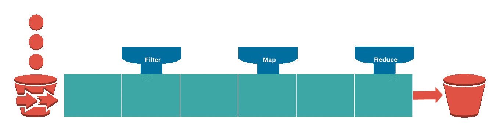
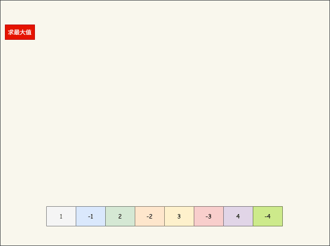

# 第一章：Optional（⭐）

## 1.1 概述

* 在实际开发中，我们经常会遇到 NullPointerException，如下所示：

```java
package com.github.lambda.optinal;

public class Test {
    public static void main(String[] args) {
        String str = null;

        // ❌ 运行错误：会报 java.lang.NullPointerException
        System.out.println(str.toLowerCase()); // [!code error]
    }
}
```

* 之前，我们都是这么处理 null 的，如下所示：

```java
package com.github.lambda.optinal;

public class Test {
    public static void main(String[] args) {
        String str = null;

        if (null != str) { // [!code highlight]
            System.out.println(str.toLowerCase());
        }
    }
}
```

* 但是，如果这样的模板代码充斥整个项目，就会感觉很不优雅：不这样写，不行；写了，都是重复、枯燥的动作。

> [!NOTE]
>
> * ① Java 中的 NullPointerException 本身没什么，Java 中的开箱即用的特性，可以让程序员快速定位到错误。
> * ② C/C++ 中经常遇到内存泄露（野指针、悬空指针），可是令很多程序员头疼的地方，需要配合很多工具来定位错误。

* Google 公司著名的 Guava 项目引入了 Optional 类，通过检查 null 值的方式来防止代码污染，鼓励程序员写出干净的代码。

```java
package com.github.lambda.optinal;

import com.google.common.base.Optional;

public class Test {
    public static void main(String[] args) {
        String str = null;

        Optional<String> optional = Optional.fromNullable(str); // [!code highlight]

        if (optional.isPresent()) { // [!code highlight]
            String s = optional.get(); // [!code highlight]
            System.out.println("s = " + s);
        }
    }
}
```

* 受到 Google 公司 Guava 项目的启发，Optional 类已经成为了 JDK8+ 类库的一部分。

```java
package com.github.lambda.optinal;

import java.util.Optional;

public class Test {
    public static void main(String[] args) {
        String str = null;

        Optional<String> optional = Optional.ofNullable(str); // [!code highlight]

        if (optional.isPresent()) { // [!code highlight]
            String s = optional.get(); // [!code highlight]
            System.out.println("s = " + s);
        }
    }
}
```

> [!NOTE]
>
> * ① `Optional<T>`和`ArrayList<T>`类似，都是容器；只不过，Optional 是一个可以包含`非null`或`null`的容器对象 。
> * ② `Optional<T>`提供了很多有用的方法，这样我们就不用显示地进行 null 值处理。 

## 4.2 创建 Optional 对象

* 创建一个空的 Optional 对象（没有任何元素，即：内部元素是 null）：

```java
public static<T> Optional<T> empty() { // [!code focus]
    @SuppressWarnings("unchecked")
    Optional<T> t = (Optional<T>) EMPTY;
    return t;
} // [!code focus]
```

* 创建一个非空的 Optional 对象（必须有元素，即：不允许传递 null）：

```java
public static <T> Optional<T> of(T value) { // [!code focus]
    return new Optional<>(Objects.requireNonNull(value));
} // [!code focus]
```

* 创建一个可能为空的 Optional 对象（可以传递`null`或`非null`，推荐）：

```java
public static <T> Optional<T> ofNullable(T value) { // [!code focus]
    return value == null ? (Optional<T>) EMPTY
                         : new Optional<>(value);
} // [!code focus]
```


* 示例：

```java
package com.github.lambda.optinal;

import java.util.Optional;

public class Test {
    public static void main(String[] args) {
        // 创建空的 Optional 对象
        Optional<String> optional = Optional.empty(); // [!code highlight]
        System.out.println(optional); // Optional.empty
    }
}
```


* 示例：

```java
package com.github.lambda.optinal;

import java.util.Optional;

public class Test {
    public static void main(String[] args) {
        // 创建 Optional 对象，但是不能传递 null
        Optional<String> optional = Optional.of("abc"); // [!code highlight]
        System.out.println(optional); // Optional[abc]

        // ❌ 运行错误：会报 java.lang.NullPointerException
        optional = Optional.of(null); // [!code error]
        System.out.println(optional); 
    }
}
```


* 示例：

```java
package com.github.lambda.optinal;

import java.util.Optional;

public class Test {
    public static void main(String[] args) {
        // 创建 Optional 对象，可以传递 null
        Optional<String> optional = Optional.ofNullable("abc"); // [!code highlight]
        System.out.println(optional); // Optional[abc]

        optional = Optional.ofNullable(null);  // [!code highlight]
        System.out.println(optional); // Optional.empty
    }
}
```

## 4.3 判断方法

* 判断 Optional 容器中是否有元素：

```java
public boolean isPresent() { // [!code focus]
    return value != null;
} // [!code focus]
```

* 判断 Optional 容器中是否有元素，如果有元素，则对其执行 Consumer 指定的操作：

```java
public void ifPresent(Consumer<? super T> action) { // [!code focus]
    if (value != null) {
        action.accept(value);
    }
} // [!code focus]
```

* 判断 Optional 容器中是否有元素，如果有元素，则对其执行 Consumer 指定的操作，否则，执行给定的空操作：

```java
public void ifPresentOrElse(Consumer<? super T> action, Runnable emptyAction) {
    if (value != null) {
        action.accept(value);
    } else {
        emptyAction.run();
    }
}
```


* 示例：

```java
package com.github.lambda.optinal;

import java.util.Optional;

public class Test {
    public static void main(String[] args) {
        Optional<String> optional = Optional.ofNullable("abc");
        System.out.println(optional.isPresent()); // true

        optional = Optional.ofNullable(null);
        System.out.println(optional.isPresent()); // false
    }
}
```


* 示例：

::: code-group

```java [Test.java]
package com.github.lambda.optinal;

import java.util.Optional;

public class Test {
    public static void main(String[] args) {
        Optional<String> optional = Optional.ofNullable("abc");
        optional.ifPresent((s) -> {
            System.out.println(s);
        });

        System.out.println("-------------------");

        optional = Optional.ofNullable(null);
        optional.ifPresent((s) -> {
            System.out.println(s);
        });
    }
}
```

```txt [cmd 控制台]
abc
-------------------
```

:::


* 示例：

::: code-group

```java [Test.java]
package com.github.lambda.optinal;

import java.util.Optional;

public class Test {
    public static void main(String[] args) {
        Optional<String> optional = Optional.ofNullable("abc");
        optional.ifPresentOrElse((s) -> {
            System.out.println(s);
        }, () -> {
            System.out.println("元素是 null ");
        });

        System.out.println("-------------------");

        optional = Optional.ofNullable(null);
        optional.ifPresentOrElse((s) -> {
            System.out.println(s);
        }, () -> {
            System.out.println("元素是 null ");
        });
    }
}
```

```txt [cmd 控制台]
abc
-------------------
元素是 null 
```

:::

## 4.4 获取元素方法

* 获取元素（要求 Optional 容器必须非空，即：如果是非空，会抛出异常）：

```java
public T get() { // [!code focus]
    if (value == null) {
        throw new NoSuchElementException("No value present");
    }
    return value;
} // [!code focus]
```

* 如果容器中有元素，则返回容器中的元素；否则，将返回给定的默认值：

```java
public T orElse(T other) { // [!code focus]
    return value != null ? value : other;
} // [!code focus]
```

* 如果容器中有元素，则返回容器中的元素；否则，将返回给定的符合 Supplier 函数式接口的 Lambda 表达式：

```java
public T orElseGet(Supplier<? extends T> supplier) { // [!code focus] 
    return value != null ? value : supplier.get();
} // [!code focus]
```

* 如果容器中有元素，则返回容器中的元素；否则，就抛出固定的异常：

```java
public T orElseThrow() { // [!code focus]
    if (value == null) {
        throw new NoSuchElementException("No value present");
    }
    return value;
} // [!code focus]
```

* 如果容器中有元素，则返回容器中的元素；否则，就抛出指定的异常：

```java
public <X extends Throwable> T orElseThrow(Supplier<? extends X> exceptionSupplier) throws X { // [!code focus]
    if (value != null) {
        return value;
    } else {
        throw exceptionSupplier.get();
    }
} // [!code focus]
```


* 示例：

```java
package com.github.lambda.optinal;

import java.util.Optional;

public class Test {
    public static void main(String[] args) {
        Optional<String> optional = Optional.ofNullable("abc");
        String str = optional.get();
        System.out.println("str = " + str); // str = abc
        
        optional = Optional.ofNullable(null); 
        // ❌ 运行错误：会报 java.lang.NullPointerException
        str = optional.get(); // [!code error]
        System.out.println("str = " + str);
    }
}
```


* 示例：

::: code-group

```java [Test.java]
package com.github.lambda.optinal;

import java.util.ArrayList;
import java.util.List;
import java.util.Optional;

public class Test {
    public static void main(String[] args) {
        List<String> strList = List.of("a", "b", "c");
        Optional<List<String>> optional = Optional.ofNullable(strList);
        List<String> list = optional.orElse(new ArrayList<>());
        System.out.println("list = " + list);

        System.out.println("--------------");

        optional = Optional.ofNullable(null);
        list = optional.orElse(new ArrayList<>());
        System.out.println("list = " + list);
    }
}
```

```txt [cmd 控制台]
list = [a, b, c]
--------------
list = []
```

:::


* 示例：

::: code-group

```java [Test.java]
package com.github.lambda.optinal;

import java.util.ArrayList;
import java.util.List;
import java.util.Optional;

public class Test {
    public static void main(String[] args) {
        List<String> strList = List.of("a", "b", "c");
        Optional<List<String>> optional = Optional.ofNullable(strList);
        List<String> list = optional.orElseGet(ArrayList::new);
        System.out.println("list = " + list);

        System.out.println("--------------");

        optional = Optional.ofNullable(null);
        list = optional.orElseGet(ArrayList::new);
        System.out.println("list = " + list);
    }
}
```

```txt [cmd 控制台]
list = [a, b, c]
--------------
list = []
```

:::


* 示例：

```java
package com.github.lambda.optinal;

import java.util.List;
import java.util.Optional;

public class Test {
    public static void main(String[] args) {
        List<String> strList = List.of("a", "b", "c");
        Optional<List<String>> optional = Optional.ofNullable(strList);
        List<String> list = optional.orElseThrow();
        System.out.println("list = " + list); // list = [a, b, c]

        System.out.println("--------------");

        optional = Optional.ofNullable(null);
        // ❌ 运行错误：会报 java.lang.NoSuchElementException
        list = optional.orElseThrow(); // [!code error]
        System.out.println("list = " + list);
    }
}
```


* 示例：

```java
package com.github.lambda.optinal;

import java.util.List;
import java.util.NoSuchElementException;
import java.util.Optional;

public class Test {
    public static void main(String[] args) {
        List<String> strList = List.of("a", "b", "c");
        Optional<List<String>> optional = Optional.ofNullable(strList);
        List<String> list = optional.orElseThrow(() -> new NoSuchElementException("没有元素"));
        System.out.println("list = " + list); // list = [a, b, c]

        System.out.println("--------------");

        optional = Optional.ofNullable(null);
        // ❌ 运行错误：会报 java.lang.NullPointerException
        list = optional.orElseThrow(() -> new NoSuchElementException("没有元素")); // [!code error]
        System.out.println("list = " + list);
    }
}
```

## 4.5 映射（或转换）

* 如果容器中有元素，则对容器中的元素进行映射（转换）操作；否则，啥也不做：

```java
public <U> Optional<U> map(Function<? super T, ? extends U> mapper) { // [!code focus]
    Objects.requireNonNull(mapper);
    if (!isPresent()) {
        return empty();
    } else {
        return Optional.ofNullable(mapper.apply(value));
    }
} // [!code focus]
```

* 如果容器中有元素，则对容器中的元素进行降维映射（转换）操作；否则，啥也不做：

```java
public <U> Optional<U> flatMap(Function<? super T, ? extends Optional<? extends U>> mapper) { // [!code focus]
    Objects.requireNonNull(mapper);
    if (!isPresent()) {
        return empty();
    } else {
        @SuppressWarnings("unchecked")
        Optional<U> r = (Optional<U>) mapper.apply(value);
        return Objects.requireNonNull(r);
    }
} // [!code focus]
```


* 示例：

```java
package com.github.lambda.optinal;

import java.util.Optional;

public class Test {
    public static void main(String[] args) {
        Optional<String> optional = Optional.ofNullable("abc");
        Optional<String> stringOptional = optional.map(String::toUpperCase);
        System.out.println(stringOptional.orElse("")); // ABC
    }
}
```


* 示例：

```java
package com.github.lambda.optinal;

import java.util.ArrayList;
import java.util.List;
import java.util.Optional;

public class Test {
    public static void main(String[] args) {
        Optional<List<String>> optional = Optional.ofNullable(List.of("abc", "bcd"));

        Optional<List<String>> upperCaseListOptional = optional.map(list ->
                list
                        .stream()
                        .map(String::toUpperCase)
                        .toList()
        );
        System.out.println(upperCaseListOptional.orElse(new ArrayList<>())); // [ABC, BCD]

    }
}
```


* 示例：

::: code-group

```java [Student.java]
package com.github.lambda.optinal;

public class Student {

    private Integer id;
    private String name;
    private Double salary;
    private String department;
    private String gender;

    public Student() {
    }

    public Student(Integer id, String name, String gender, String department, Double salary) {
        this.id = id;
        this.name = name;
        this.salary = salary;
        this.department = department;
        this.gender = gender;
    }

    public Integer getId() {
        return id;
    }

    public void setId(Integer id) {
        this.id = id;
    }

    public String getName() {
        return name;
    }

    public void setName(String name) {
        this.name = name;
    }

    public Double getSalary() {
        return salary;
    }

    public void setSalary(Double salary) {
        this.salary = salary;
    }

    public String getGender() {
        return gender;
    }

    public void setGender(String gender) {
        this.gender = gender;
    }

    public String getDepartment() {
        return department;
    }

    public void setDepartment(String department) {
        this.department = department;
    }

    @Override
    public String toString() {
        return "Student{" +
                "id=" + id +
                ", name='" + name + '\'' +
                ", salary=" + salary +
                ", department='" + department + '\'' +
                ", gender='" + gender + '\'' +
                '}';
    }
}

```

```java [Test.java]
package com.github.lambda.optinal;

import java.util.List;
import java.util.Optional;

public class Test {
    public static void main(String[] args) {
        Student student = new Student(1, "张三", "男", "开发部", 5000.00);
        Optional<Student> optional = Optional.ofNullable(student);
        Optional<String> stringOptional = optional.map(Student::getName);
        System.out.println(stringOptional.orElse(""));  // 张三
    }
}
```

:::


* 示例：

::: code-group

```java [Student.java]
package com.github.lambda.optinal;

public class Student {

    private Integer id;
    private String name;
    private Double salary;
    private String department;
    private String gender;

    public Student() {
    }

    public Student(Integer id, String name, String gender, String department, Double salary) {
        this.id = id;
        this.name = name;
        this.salary = salary;
        this.department = department;
        this.gender = gender;
    }

    public Integer getId() {
        return id;
    }

    public void setId(Integer id) {
        this.id = id;
    }

    public String getName() {
        return name;
    }

    public void setName(String name) {
        this.name = name;
    }

    public Double getSalary() {
        return salary;
    }

    public void setSalary(Double salary) {
        this.salary = salary;
    }

    public String getGender() {
        return gender;
    }

    public void setGender(String gender) {
        this.gender = gender;
    }

    public String getDepartment() {
        return department;
    }

    public void setDepartment(String department) {
        this.department = department;
    }

    @Override
    public String toString() {
        return "Student{" +
                "id=" + id +
                ", name='" + name + '\'' +
                ", salary=" + salary +
                ", department='" + department + '\'' +
                ", gender='" + gender + '\'' +
                '}';
    }
}

```

```java [Test.java]
package com.github.lambda.optinal;


import java.util.ArrayList;
import java.util.List;
import java.util.Optional;

public class Test {
    public static void main(String[] args) {
        List<Student> students = List.of(
                new Student(1, "张三", "男", "开发部", 5000.00),
                new Student(2, "李四", "女", "测试部", 15000.00),
                new Student(3, "王五", "女", "测试部", 75000.00),
                new Student(4, "赵六", "女", "开发部", 7000.00),
                new Student(5, "田七", "男", "测试部", 6000.00),
                new Student(5, "王八", "男", "运营部", 4000.00)
        );
        Optional<List<Student>> optional = Optional.ofNullable(students);

        Optional<List<String>> stringListOptional = optional.flatMap(list -> Optional.ofNullable(list
                .stream()
                .map(Student::getName)
                .toList()));

        System.out.println(stringListOptional.orElse(new ArrayList<>())); // [张三, 李四, 王五, 赵六, 田七, 王八]
    }

}
```

:::

## 4.6 转换为 Stream

* 如果容器中有元素，则返回包含此元素的 Stream；否则，将返回一个空的 Stream：

```java
public Stream<T> stream() { // [!code focus] 
    if (!isPresent()) {
        return Stream.empty();
    } else {
        return Stream.of(value);
    }
} // [!code focus] 
```


* 示例：

```java
package com.github.lambda.optinal;

import java.util.Optional;

public class Test {
    public static void main(String[] args) {
        String str = "abc";
        Optional<String> optional = Optional.ofNullable(str);
        Stream<String> stream = optional.stream();
        System.out.println("stream.count() = " + stream.count()); // stream.count() = 1

        str = null;
        optional = Optional.ofNullable(str);
        stream = optional.stream();
        System.out.println("stream.count() = " + stream.count()); // stream.count() = 0
    }

}
```

## 4.7 过滤

* 根据指定的条件，过滤 Optional 中的元素：

```java
public Optional<T> filter(Predicate<? super T> predicate) { // [!code focus] 
    Objects.requireNonNull(predicate);
    if (!isPresent()) {
        return this;
    } else {
        return predicate.test(value) ? this : empty();
    }
} // [!code focus] 
```


* 示例：

```java
package com.github.lambda.optinal;

import java.util.List;
import java.util.Optional;

public class Test {
    public static void main(String[] args) {
        List<Integer> list = List.of(1, 2, 3, 4, 5, 6, 7, 8, 9);
        Optional<List<Integer>> listOptional = Optional
                .ofNullable(list)
                .filter(x -> x.contains(5));
        // [1, 2, 3, 4, 5, 6, 7, 8, 9]
        listOptional.ifPresent(System.out::println); 
    }

}
```


* 示例：

```java
package com.github.lambda.optinal;

import java.util.Optional;

public class Test {
    public static void main(String[] args) {
        Optional<String> optional = Optional.of("abc123");

        optional
                .filter(s -> s.contains("abc"))
                .map(String::toUpperCase)
                .ifPresent(System.out::println); // ABC123
    }
}
```


# 第二章：Stream API（⭐）

## 2.1 概述

* Stream 是 JDK8 中处理集合的关键抽象概念，它可以指定你希望对集合进行的操作，可以执行非常复杂的查找、过滤和映射数据等操作。

> [!NOTE]
>
> * ① 使用 Stream API 对集合数据进行操作，就类似于使用 SQL 执行的数据库查询。
> * ② 可以使用 Stream API 来并行执行操作。
> * ③ Stream API 提供了一种高效且易于使用的处理数据的方式。



* Stream 是数据渠道，用于操作数据源（集合、数组等）所生成的元素序列。换言之，“集合讲的是数据，负责存储数据；Stream 流讲的是计算，负责处理数据！”。

> [!CAUTION]
>
> - ① Stream 自己不会存储元素。
>
> - ② Stream 不会改变源对象，每次处理读会返回一个持有结果的新的 Stream 。
>
> - ③ Stream 操作是延迟执行的，意味着会等到需要结果的时候才执行。

## 2.2 Stream 流操作的步骤

* Stream 流操作的步骤是：`创建 Stream 流`、`中间操作`以及`终结操作`，如下所示：

> [!NOTE]
>
> * ① 创建 Stream ：通过一个数据源（集合、数组等），获取一个流。
> * ② 中间操作：中间操作是个操作链，对数据源的数据进行 n 次处理，但是在终结操作前，并不会真正的执行。
> * ③ 终结操作（终止操作）：一旦执行终止操作，就执行中间操作链，最终产生结果并结束 Stream 。


> [!NOTE]
>
> 如何区分创建 Stream、中间操作以及终结操作？
>
> * ① 创建 Stream：就是各种方式获取 Stream 对象，如：`Stream stream = Stream.of(对象,...);`。
> * ② 中间操作：通过 Stream 对象调用其方法，并且返回值也是 Stream 对象，支持链式调用，如：`Stream stream = stream.filter(x -> x>=2).map(x -> x+2)`。
> * ③ 终结操作：通过 Stream 对象调用其方法，但是返回值不是 Stream 对象，而是一个具体的值，包括 void ，如：`List<String> list = stream.collection(Collectors.toList());`。

## 2.3 创建 Stream

### 2.3.1 构建流

* 根据已有数据构建 Stream 对象有三种：
  * ① 根据数组构建 Stream 流对象。
  * ② 根据对象构建 Stream 流对象。
  * ③ 根据集合构建 Stream 流对象。

* 其中，根据数组构建 Stream 流对象：

```java
Stream<T> stream = Arrays.stream(T[] array);
```

* 其中，根据对象构建 Stream 流对象：

```java
Stream<T> stream = Stream.of(T... values);
```

* 其中，根据集合构建 Stream 流对象：

```java
Stream<E> stream = collection.stream();
```


* 示例：

::: code-group

```java [Test.java]
package com.github.lambda.optinal;

import java.util.Arrays;
import java.util.stream.IntStream;

public class Test {
    public static void main(String[] args) {
        IntStream stream = Arrays.stream(new int[]{1, 2, 3}); 

        stream.forEach(System.out::println);
    }
}
```

```txt [cmd 控制台]
1
2
3
```

:::


* 示例：

::: code-group

```java [Test.java]
package com.github.lambda.optinal;

import java.util.Arrays;
import java.util.stream.IntStream;

public class Test {
    public static void main(String[] args) {
        Stream<Integer> stream = Stream.of(1, 2, 3);
        
        stream.forEach(System.out::println);
    }
}
```

```txt [cmd 控制台]
1
2
3
```

:::


* 示例：

::: code-group

```java [Test.java]
package com.github.lambda.optinal;

import java.util.List;
import java.util.stream.Stream;

public class Test {
    public static void main(String[] args) {
        List<Integer> list = List.of(1, 2, 3);

        Stream<Integer> stream = list.stream();

        stream.forEach(System.out::println);
    }
}
```

```txt [cmd 控制台]
1
2
3
```

:::


* 示例：

::: code-group

```java [Student.java]
package com.github.lambda.optinal;

public class Student {

    private Integer id;
    private String name;
    private Double salary;
    private String department;
    private String gender;

    public Student() {
    }

    public Student(Integer id, String name, 
                   String gender, String department, 
                   Double salary) {
        this.id = id;
        this.name = name;
        this.salary = salary;
        this.department = department;
        this.gender = gender;
    }

    public Integer getId() {
        return id;
    }

    public void setId(Integer id) {
        this.id = id;
    }

    public String getName() {
        return name;
    }

    public void setName(String name) {
        this.name = name;
    }

    public Double getSalary() {
        return salary;
    }

    public void setSalary(Double salary) {
        this.salary = salary;
    }

    public String getGender() {
        return gender;
    }

    public void setGender(String gender) {
        this.gender = gender;
    }

    public String getDepartment() {
        return department;
    }

    public void setDepartment(String department) {
        this.department = department;
    }

    @Override
    public String toString() {
        return "{" +
                "id=" + id +
                ", name='" + name + '\'' +
                ", salary=" + salary +
                ", department='" + department + '\'' +
                ", gender='" + gender + '\'' +
                '}';
    }
}
```

```java [Test.java]
package com.github.lambda.optinal;

import java.util.stream.Stream;

public class Test {
    public static void main(String[] args) {
        List<Student> list = List.of(
                new Student(1, "张三", "男", "开发部", 5000.00),
                new Student(2, "李四", "女", "测试部", 15000.00),
                new Student(3, "王五", "女", "测试部", 75000.00),
                new Student(4, "赵六", "女", "开发部", 7000.00),
                new Student(5, "田七", "男", "测试部", 6000.00),
                new Student(6, "王八", "男", "运营部", 4000.00));

        Stream<Student> stream = list.stream();

        stream.forEach(System.out::println);
    }

}
```

```txt [cmd 控制台]
{id=1, name='张三', salary=5000.0, department='开发部', gender='男'}
{id=2, name='李四', salary=15000.0, department='测试部', gender='女'}
{id=3, name='王五', salary=75000.0, department='测试部', gender='女'}
{id=4, name='赵六', salary=7000.0, department='开发部', gender='女'}
{id=5, name='田七', salary=6000.0, department='测试部', gender='男'}
{id=6, name='王八', salary=4000.0, department='运营部', gender='男'}
```

:::

### 2.3.2 合并流

* 将两个流合并为一个流：

```java
Stream<T> stream = Stream.concat(stream1,stream2);
```


* 示例：

::: code-group

```java [Test.java]
package com.github.lambda.optinal;

import java.util.stream.Stream;

public class Test {
    public static void main(String[] args) {
        Stream<Integer> stream1 = Stream.of(1, 2, 3);
        Stream<Integer> stream2 = Stream.of(4, 5, 6, 7);

        Stream<Integer> stream = Stream.concat(stream1, stream2);

        stream.forEach(System.out::println);
    }

}
```

```txt [cmd 控制台]
1
2
3
4
5
6
7
```

:::

### 2.3.3 生成流

* 根据范围生成流（不依赖现有数据生成流，仅限 IntStream、LongStream 以及 DoubleStream）：

```java
IntStream intStream = IntStream.range(int startInclusive, int endExclusive);
```

```java
IntStream intStream = IntStream.rangeClosed(int startInclusive, int endInclusive);
```

* 迭代流（不依赖现有数据生成流，但是依赖种子值（上一个数据））：

```java
Stream<T> stream = Stream.iterate(final T seed, final UnaryOperator<T> f);
```

```java
Stream<T> stream = Stream.iterate(T seed, Predicate<? super T> hasNext, UnaryOperator<T> next)
```

* 生成流（不依赖现有数据生成流，也不依赖种子值（上一个数据））：

```java
Stream<T> stream = Stream.generate(Supplier<? extends T> s)
```


* 示例：

::: code-group

```java [Test.java]
package com.github.lambda.optinal;

import java.util.stream.IntStream;

public class Test {
    public static void main(String[] args) {
        IntStream intStream = IntStream.range(1, 10);

        intStream.forEach(System.out::println);
    }

}
```

```txt [cmd 控制台]
1
2
3
4
5
6
7
8
9
```

:::


* 示例：

::: code-group

```java [Test.java]
package com.github.lambda.optinal;

import java.util.stream.IntStream;

public class Test {
    public static void main(String[] args) {
        IntStream intStream = IntStream.rangeClosed(1, 10);

        intStream.forEach(System.out::println);
    }

}
```

```txt [cmd 控制台]
1
2
3
4
5
6
7
8
9
10
```

:::


* 示例：

::: code-group

```java [Test.java]
package com.github.optinal;

import java.util.stream.Stream;

public class Test {
    public static void main(String[] args) {
        // 生成 1 3 5 7 ... 的奇数序列，根据上一个元素来生成
        Stream<Integer> stream = Stream
                .iterate(1, x -> x + 2)
                .limit(10);

        // 打印流中的数据
        stream.forEach(System.out::println);
    }
}
```

```txt [cmd 控制台]
1
3
5
7
9
11
13
15
17
19
```

:::


* 示例：

::: code-group

```java [Test.java]
package com.github.optinal;

import java.util.stream.Stream;

public class Test {
    public static void main(String[] args) {
        // 生成 1 3 5 7 ... 的奇数序列，根据上一个元素来生成
        Stream<Integer> stream = Stream
                .iterate(1, (x) -> x <= 10, x -> x + 2);

        // 打印流中的数据
        stream.forEach(System.out::println);
    }
}
```

```txt [cmd 控制台]
1
3
5
7
9
```

:::


* 示例：

::: code-group

```java [Test.java]
package com.github.optinal;

import java.util.concurrent.ThreadLocalRandom;
import java.util.stream.Stream;

public class Test {
    public static void main(String[] args) {
        // 随机生成 10 个 [0，100）之间的序列
        Stream<Integer> stream = Stream
                .generate(() -> ThreadLocalRandom
                        .current()
                        .nextInt(100))
                .limit(10);

        // 打印流中的数据
        stream.forEach(System.out::println);
    }
}
```

```txt [cmd 控制台]
96
27
28
75
93
66
55
3
83
0
```

:::

## 2.4 中间操作

### 2.4.1 过滤

* 根据 Predicate 的结果，过滤 Stream 中的元素：

```java
Stream<T> stream2 = stream.filter(Predicate<? super T> predicate);
```


* 示例：

::: code-group

```java [Test.java]
package com.github.optinal;

import java.util.stream.Stream;

public class Test {
    public static void main(String[] args) {
        // 创建 Stream 对象
        Stream<Integer> stream = Stream.of(1, 2, 3, 4, 5, 6, 7, 8, 9);

        // 中间操作：过滤，找到所有的偶数
        stream = stream.filter(x -> x % 2 == 0);

        // 终结操作
        stream.forEach(System.out::println);
    }
}
```

```txt [cmd 控制台]
2
4
6
8
```

:::


* 示例：

::: code-group

```java [Student.java]
package com.github.optinal;

public class Student {

    private Integer id;
    private String name;
    private Double salary;
    private String department;
    private String gender;

    public Student() {
    }

    public Student(Integer id, String name,
                   String gender, String department,
                   Double salary) {
        this.id = id;
        this.name = name;
        this.salary = salary;
        this.department = department;
        this.gender = gender;
    }

    public Integer getId() {
        return id;
    }

    public void setId(Integer id) {
        this.id = id;
    }

    public String getName() {
        return name;
    }

    public void setName(String name) {
        this.name = name;
    }

    public Double getSalary() {
        return salary;
    }

    public void setSalary(Double salary) {
        this.salary = salary;
    }

    public String getGender() {
        return gender;
    }

    public void setGender(String gender) {
        this.gender = gender;
    }

    public String getDepartment() {
        return department;
    }

    public void setDepartment(String department) {
        this.department = department;
    }

    @Override
    public String toString() {
        return "{" +
                "id=" + id +
                ", name='" + name + '\'' +
                ", salary=" + salary +
                ", department='" + department + '\'' +
                ", gender='" + gender + '\'' +
                '}';
    }
}
```

```java [Test.java]
package com.github.optinal;

import java.util.List;
import java.util.stream.Stream;

public class Test {
    public static void main(String[] args) {
        // 创建 Stream 对象
        List<Student> list = List.of(
                new Student(1, "张三", "男", "开发部", 5000.00),
                new Student(2, "李四", "女", "测试部", 15000.00),
                new Student(3, "王五", "女", "测试部", 75000.00),
                new Student(4, "赵六", "女", "开发部", 7000.00),
                new Student(5, "田七", "男", "测试部", 6000.00),
                new Student(6, "王八", "男", "运营部", 4000.00));

        Stream<Student> stream = list.stream();

        // 中间操作：过滤，找到所有工资 > 10000 的员工
        stream = stream.filter(s -> s.getSalary() > 10000);

        // 终结操作
        stream.forEach(System.out::println);
    }
}
```

```txt [cmd 控制台]
{id=2, name='李四', salary=15000.0, department='测试部', gender='女'}
{id=3, name='王五', salary=75000.0, department='测试部', gender='女'}
```

:::


* 示例：

::: code-group

```java [Student.java]
package com.github.optinal;

public class Student {

    private Integer id;
    private String name;
    private Double salary;
    private String department;
    private String gender;

    public Student() {
    }

    public Student(Integer id, String name,
                   String gender, String department,
                   Double salary) {
        this.id = id;
        this.name = name;
        this.salary = salary;
        this.department = department;
        this.gender = gender;
    }

    public Integer getId() {
        return id;
    }

    public void setId(Integer id) {
        this.id = id;
    }

    public String getName() {
        return name;
    }

    public void setName(String name) {
        this.name = name;
    }

    public Double getSalary() {
        return salary;
    }

    public void setSalary(Double salary) {
        this.salary = salary;
    }

    public String getGender() {
        return gender;
    }

    public void setGender(String gender) {
        this.gender = gender;
    }

    public String getDepartment() {
        return department;
    }

    public void setDepartment(String department) {
        this.department = department;
    }

    @Override
    public String toString() {
        return "{" +
                "id=" + id +
                ", name='" + name + '\'' +
                ", salary=" + salary +
                ", department='" + department + '\'' +
                ", gender='" + gender + '\'' +
                '}';
    }
}
```

```java [Test.java]
package com.github.optinal;

import java.util.List;
import java.util.stream.Stream;

public class Test {
    public static void main(String[] args) {
        // 创建 Stream 对象
        List<Student> list = List.of(
                new Student(1, "张三", "男", "开发部", 5000.00),
                new Student(2, "李四", "女", "测试部", 15000.00),
                new Student(3, "王五", "女", "测试部", 75000.00),
                new Student(4, "赵六", "女", "开发部", 7000.00),
                new Student(5, "田七", "男", "测试部", 6000.00),
                new Student(6, "王八", "男", "运营部", 4000.00));

        Stream<Student> stream = list.stream();

        // 中间操作：过滤，找到所有工资 >= 5000 并且姓名是男的员工
        stream = stream.filter(s ->
                (s.getSalary() >= 5000) && (s.getGender().equals("男")));

        // 终结操作
        stream.forEach(System.out::println);
    }
}
```

```txt [cmd 控制台]
{id=1, name='张三', salary=5000.0, department='开发部', gender='男'}
{id=5, name='田七', salary=6000.0, department='测试部', gender='男'}
```

:::


* 示例：

::: code-group

```java [Student.java]
package com.github.optinal;

public class Student {

    private Integer id;
    private String name;
    private Double salary;
    private String department;
    private String gender;

    public Student() {
    }

    public Student(Integer id, String name,
                   String gender, String department,
                   Double salary) {
        this.id = id;
        this.name = name;
        this.salary = salary;
        this.department = department;
        this.gender = gender;
    }

    public Integer getId() {
        return id;
    }

    public void setId(Integer id) {
        this.id = id;
    }

    public String getName() {
        return name;
    }

    public void setName(String name) {
        this.name = name;
    }

    public Double getSalary() {
        return salary;
    }

    public void setSalary(Double salary) {
        this.salary = salary;
    }

    public String getGender() {
        return gender;
    }

    public void setGender(String gender) {
        this.gender = gender;
    }

    public String getDepartment() {
        return department;
    }

    public void setDepartment(String department) {
        this.department = department;
    }

    @Override
    public String toString() {
        return "{" +
                "id=" + id +
                ", name='" + name + '\'' +
                ", salary=" + salary +
                ", department='" + department + '\'' +
                ", gender='" + gender + '\'' +
                '}';
    }
}
```

```java [Test.java]
package com.github.optinal;

import java.util.List;
import java.util.function.Predicate;
import java.util.stream.Stream;

public class Test {
    public static void main(String[] args) {
        // 创建 Stream 对象
        List<Student> list = List.of(
                new Student(1, "张三", "男", "开发部", 5000.00),
                new Student(2, "李四", "女", "测试部", 15000.00),
                new Student(3, "王五", "女", "测试部", 75000.00),
                new Student(4, "赵六", "女", "开发部", 7000.00),
                new Student(5, "田七", "男", "测试部", 6000.00),
                new Student(6, "王八", "男", "运营部", 4000.00));

        Stream<Student> stream = list.stream();

        // 中间操作：过滤，找到所有工资 >= 5000 并且姓名是男的员工
        Predicate<Student> salaryPredicate = s -> s.getSalary() >= 5000;
        Predicate<Student> manPredicate = s -> s
                .getGender()
                .equals("男");
        stream = stream.filter(salaryPredicate.and(manPredicate));

        // 终结操作
        stream.forEach(System.out::println);
    }
}
```

```txt [cmd 控制台]
{id=1, name='张三', salary=5000.0, department='开发部', gender='男'}
{id=5, name='田七', salary=6000.0, department='测试部', gender='男'}
```

:::


* 示例：

::: code-group

```java [Student.java]
package com.github.optinal;

public class Student {

    private Integer id;
    private String name;
    private Double salary;
    private String department;
    private String gender;

    public Student() {
    }

    public Student(Integer id, String name,
                   String gender, String department,
                   Double salary) {
        this.id = id;
        this.name = name;
        this.salary = salary;
        this.department = department;
        this.gender = gender;
    }

    public Integer getId() {
        return id;
    }

    public void setId(Integer id) {
        this.id = id;
    }

    public String getName() {
        return name;
    }

    public void setName(String name) {
        this.name = name;
    }

    public Double getSalary() {
        return salary;
    }

    public void setSalary(Double salary) {
        this.salary = salary;
    }

    public String getGender() {
        return gender;
    }

    public void setGender(String gender) {
        this.gender = gender;
    }

    public String getDepartment() {
        return department;
    }

    public void setDepartment(String department) {
        this.department = department;
    }

    @Override
    public String toString() {
        return "{" +
                "id=" + id +
                ", name='" + name + '\'' +
                ", salary=" + salary +
                ", department='" + department + '\'' +
                ", gender='" + gender + '\'' +
                '}';
    }
}
```

```java [Test.java]
package com.github.optinal;

import java.util.List;
import java.util.stream.Stream;

public class Test {
    public static void main(String[] args) {
        // 创建 Stream 对象
        List<Student> list = List.of(
                new Student(1, "张三", "男", "开发部", 5000.00),
                new Student(2, "李四", "女", "测试部", 15000.00),
                new Student(3, "王五", "女", "测试部", 75000.00),
                new Student(4, "赵六", "女", "开发部", 7000.00),
                new Student(5, "田七", "男", "测试部", 6000.00),
                new Student(6, "王八", "男", "运营部", 4000.00));

        Stream<Student> stream = list.stream();

        // 中间操作：过滤，找到所有工资 >= 5000 并且姓名是男的员工
        stream = stream
                .filter(s -> s.getSalary() >= 5000)
                .filter(s -> s
                        .getGender()
                        .equals("男"));

        // 终结操作
        stream.forEach(System.out::println);
    }
}
```

```txt [cmd 控制台]
{id=1, name='张三', salary=5000.0, department='开发部', gender='男'}
{id=5, name='田七', salary=6000.0, department='测试部', gender='男'}
```

:::

### 2.4.2 去重

* 去重（去除相同的元素，如果元素是对象，将调用对象的 equals 方法进行比较）：

```java
Stream<T> stream2 = stream.distinct();
```

* 排序：

```java
Stream<T> stream2 = stream.sorted(); // 自然排序
```

```java
Stream<T> stream2 = stream.sorted(Comparator<? super T> comparator); // 指定的比较器
```


* 示例：

::: code-group

```java [Test.java]
package com.github.optinal;

import java.util.stream.Stream;

public class Test {
    public static void main(String[] args) {
        // 创建 Stream 对象
        Stream<Integer> stream = Stream.of(1, 2, 1, 3, 4, 4, 2, 4, 3);

        // 中间操作：去重
        stream = stream.distinct();

        // 终结操作
        stream.forEach(System.out::println);
    }
}
```

```txt [cmd 控制台]
2
4
6
8
```

:::


* 示例：

::: code-group

```java [Student.java]
package com.github.optinal;

import java.util.Objects;

public class Student {

    private Integer id;
    private String name;
    private Double salary;
    private String department;
    private String gender;

    public Student() {
    }

    public Student(Integer id, String name,
                   String gender, String department,
                   Double salary) {
        this.id = id;
        this.name = name;
        this.salary = salary;
        this.department = department;
        this.gender = gender;
    }

    public Integer getId() {
        return id;
    }

    public void setId(Integer id) {
        this.id = id;
    }

    public String getName() {
        return name;
    }

    public void setName(String name) {
        this.name = name;
    }

    public Double getSalary() {
        return salary;
    }

    public void setSalary(Double salary) {
        this.salary = salary;
    }

    public String getGender() {
        return gender;
    }

    public void setGender(String gender) {
        this.gender = gender;
    }

    public String getDepartment() {
        return department;
    }

    public void setDepartment(String department) {
        this.department = department;
    }

    @Override
    public boolean equals(Object o) {
        if (o == null || getClass() != o.getClass()) return false;
        Student student = (Student) o;
        return Objects.equals(getId(), student.getId()) 
            && Objects.equals(getName(), student.getName()) 
            && Objects.equals(getSalary(), student.getSalary()) 
            && Objects.equals(getDepartment(), student.getDepartment()) 
            && Objects.equals(getGender(), student.getGender());
    }

    @Override
    public int hashCode() {
        return Objects.hash(getId(), getName(), 
                            getSalary(), getDepartment(), getGender());
    }

    @Override
    public String toString() {
        return "{" +
                "id=" + id +
                ", name='" + name + '\'' +
                ", salary=" + salary +
                ", department='" + department + '\'' +
                ", gender='" + gender + '\'' +
                '}';
    }
}
```

```java [Test.java]
package com.github.optinal;

import java.util.List;
import java.util.stream.Stream;

public class Test {
    public static void main(String[] args) {
        // 创建 Stream 对象
        List<Student> list = List.of(
                new Student(1, "张三", "男", "开发部", 5000.00),
                new Student(2, "李四", "女", "测试部", 15000.00),
                new Student(2, "李四", "女", "测试部", 15000.00),
                new Student(3, "王五", "女", "测试部", 75000.00),
                new Student(4, "赵六", "女", "开发部", 7000.00),
                new Student(4, "赵六", "女", "开发部", 7000.00),
                new Student(5, "田七", "男", "测试部", 6000.00),
                new Student(5, "田七", "男", "测试部", 6000.00),
                new Student(6, "王八", "男", "运营部", 4000.00),
                new Student(6, "王八", "男", "运营部", 4000.00),
                new Student(6, "王八", "男", "运营部", 4000.00)
        );

        Stream<Student> stream = list.stream();

        // 中间操作：去重，如果是对象，会调用对象的 equals 方法进行比较
        stream = stream.distinct();

        // 终结操作
        stream.forEach(System.out::println);
    }
}
```

```txt [cmd 控制台]
{id=1, name='张三', salary=5000.0, department='开发部', gender='男'}
{id=2, name='李四', salary=15000.0, department='测试部', gender='女'}
{id=3, name='王五', salary=75000.0, department='测试部', gender='女'}
{id=4, name='赵六', salary=7000.0, department='开发部', gender='女'}
{id=5, name='田七', salary=6000.0, department='测试部', gender='男'}
{id=6, name='王八', salary=4000.0, department='运营部', gender='男'}
```

:::

### 2.4.3 排序

* 根据默认的比较器对元素进行排序，即：自然排序：

```java
Stream<T> stream2 = stream.sorted(); 
```

* 根据指定的比较器对元素进行排序，即：自定义排序：

```java
Stream<T> stream2 = stream.sorted(Comparator<? super T> comparator); 
```


* 示例：

::: code-group

```java [Test.java]
package com.github.optinal;

import java.util.stream.Stream;

public class Test {
    public static void main(String[] args) {
        // 创建 Stream 对象
        Stream<Integer> stream = Stream.of(1, 2, -1, -3, -4, 4, 2, 4, 3);

        // 中间操作：从小到大排序
        // stream = stream.sorted((a, b) -> a.compareTo(b));
        stream = stream.sorted(Integer::compareTo);

        // 终结操作
        stream.forEach(System.out::println);
    }
}
```

```txt [cmd 控制台]
-4
-3
-1
1
2
2
3
4
4
```

:::


* 示例：

::: code-group

```java [Test.java]
package com.github.optinal;

import java.util.Comparator;
import java.util.stream.Stream;

public class Test {
    public static void main(String[] args) {
        // 创建 Stream 对象
        Stream<Integer> stream = Stream.of(1, 2, -1, -3, -4, 4, 2, 4, 3);

        // 中间操作：从大到小排序
        // stream = stream.sorted((a, b) -> b.compareTo(a));
        stream = stream.sorted(Comparator.reverseOrder());

        // 终结操作
        stream.forEach(System.out::println);
    }
}
```

```txt [cmd 控制台]
4
4
3
2
2
1
-1
-3
-4
```

:::


* 示例：

::: code-group

```java [Student.java]
package com.github.optinal;

import java.util.Objects;

public class Student implements Comparable<Student> {

    private Integer id;
    private String name;
    private Double salary;
    private String department;
    private String gender;

    public Student() {
    }

    public Student(Integer id, String name,
                   String gender, String department,
                   Double salary) {
        this.id = id;
        this.name = name;
        this.salary = salary;
        this.department = department;
        this.gender = gender;
    }

    public Integer getId() {
        return id;
    }

    public void setId(Integer id) {
        this.id = id;
    }

    public String getName() {
        return name;
    }

    public void setName(String name) {
        this.name = name;
    }

    public Double getSalary() {
        return salary;
    }

    public void setSalary(Double salary) {
        this.salary = salary;
    }

    public String getGender() {
        return gender;
    }

    public void setGender(String gender) {
        this.gender = gender;
    }

    public String getDepartment() {
        return department;
    }

    public void setDepartment(String department) {
        this.department = department;
    }

    @Override
    public boolean equals(Object o) {
        if (o == null || getClass() != o.getClass()) return false;
        Student student = (Student) o;
        return Objects.equals(getId(), student.getId()) 
            && Objects.equals(getName(), student.getName()) 
            && Objects.equals(getSalary(), student.getSalary()) 
            && Objects.equals(getDepartment(), student.getDepartment()) 
            && Objects.equals(getGender(), student.getGender());
    }

    @Override
    public int hashCode() {
        return Objects.hash(getId(), getName(), 
                            getSalary(), getDepartment(), getGender());
    }

    @Override
    public String toString() {
        return "{" +
                "id=" + id +
                ", name='" + name + '\'' +
                ", salary=" + salary +
                ", department='" + department + '\'' +
                ", gender='" + gender + '\'' +
                '}';
    }

    @Override
    public int compareTo(Student o) {
        return this
                .getSalary()
                .compareTo(o.getSalary());
    }
}
```

```java [Test.java]
package com.github.optinal;

import java.util.List;
import java.util.stream.Stream;

public class Test {
    public static void main(String[] args) {
        // 创建 Stream 对象
        List<Student> list = List.of(
                new Student(1, "张三", "男", "开发部", 5000.00),
                new Student(2, "李四", "女", "测试部", 15000.00),
                new Student(3, "王五", "女", "测试部", 75000.00),
                new Student(4, "赵六", "女", "开发部", 7000.00),
                new Student(5, "田七", "男", "测试部", 6000.00),
                new Student(6, "王八", "男", "运营部", 4000.00)
        );

        Stream<Student> stream = list.stream();

        // 中间操作：根据工资，从小到大进行排序
        stream = stream.sorted();

        // 终结操作
        stream.forEach(System.out::println);
    }
}
```

```txt [cmd 控制台]
{id=6, name='王八', salary=4000.0, department='运营部', gender='男'}
{id=1, name='张三', salary=5000.0, department='开发部', gender='男'}
{id=5, name='田七', salary=6000.0, department='测试部', gender='男'}
{id=4, name='赵六', salary=7000.0, department='开发部', gender='女'}
{id=2, name='李四', salary=15000.0, department='测试部', gender='女'}
{id=3, name='王五', salary=75000.0, department='测试部', gender='女'}
```

:::


* 示例：

::: code-group

```java [Student.java]
package com.github.optinal;

import java.util.Objects;

public class Student implements Comparable<Student> {

    private Integer id;
    private String name;
    private Double salary;
    private String department;
    private String gender;

    public Student() {
    }

    public Student(Integer id, String name,
                   String gender, String department,
                   Double salary) {
        this.id = id;
        this.name = name;
        this.salary = salary;
        this.department = department;
        this.gender = gender;
    }

    public Integer getId() {
        return id;
    }

    public void setId(Integer id) {
        this.id = id;
    }

    public String getName() {
        return name;
    }

    public void setName(String name) {
        this.name = name;
    }

    public Double getSalary() {
        return salary;
    }

    public void setSalary(Double salary) {
        this.salary = salary;
    }

    public String getGender() {
        return gender;
    }

    public void setGender(String gender) {
        this.gender = gender;
    }

    public String getDepartment() {
        return department;
    }

    public void setDepartment(String department) {
        this.department = department;
    }

    @Override
    public boolean equals(Object o) {
        if (o == null || getClass() != o.getClass()) return false;
        Student student = (Student) o;
        return Objects.equals(getId(), student.getId()) 
            && Objects.equals(getName(), student.getName()) 
            && Objects.equals(getSalary(), student.getSalary()) 
            && Objects.equals(getDepartment(), student.getDepartment()) 
            && Objects.equals(getGender(), student.getGender());
    }

    @Override
    public int hashCode() {
        return Objects.hash(getId(), getName(), 
                            getSalary(), getDepartment(), getGender());
    }

    @Override
    public String toString() {
        return "{" +
                "id=" + id +
                ", name='" + name + '\'' +
                ", salary=" + salary +
                ", department='" + department + '\'' +
                ", gender='" + gender + '\'' +
                '}';
    }

    @Override
    public int compareTo(Student o) {
        return this
                .getSalary()
                .compareTo(o.getSalary());
    }
}
```

```java [Test.java]
package com.github.optinal;

import java.util.Comparator;
import java.util.List;
import java.util.stream.Stream;

public class Test {
    public static void main(String[] args) {
        // 创建 Stream 对象
        List<Student> list = List.of(
                new Student(1, "张三", "男", "开发部", 5000.00),
                new Student(2, "李四", "女", "测试部", 15000.00),
                new Student(3, "王五", "女", "测试部", 75000.00),
                new Student(4, "赵六", "女", "开发部", 7000.00),
                new Student(5, "田七", "男", "测试部", 6000.00),
                new Student(6, "王八", "男", "运营部", 4000.00)
        );

        Stream<Student> stream = list.stream();

        // 中间操作：根据工资，从大到小进行排序
        // stream = stream.sorted((a, b) -> Double.compare(b.getSalary(), a.getSalary()));
        stream = stream.sorted(Comparator
                .comparingDouble(Student::getSalary)
                .reversed());

        // 终结操作
        stream.forEach(System.out::println);
    }
}
```

```txt [cmd 控制台]
{id=3, name='王五', salary=75000.0, department='测试部', gender='女'}
{id=2, name='李四', salary=15000.0, department='测试部', gender='女'}
{id=4, name='赵六', salary=7000.0, department='开发部', gender='女'}
{id=5, name='田七', salary=6000.0, department='测试部', gender='男'}
{id=1, name='张三', salary=5000.0, department='开发部', gender='男'}
{id=6, name='王八', salary=4000.0, department='运营部', gender='男'}
```

:::


* 示例：

::: code-group

```java [Student.java]
package com.github.optinal;

import java.util.Objects;

public class Student implements Comparable<Student> {

    private Integer id;
    private String name;
    private Double salary;
    private String department;
    private String gender;

    public Student() {
    }

    public Student(Integer id, String name,
                   String gender, String department,
                   Double salary) {
        this.id = id;
        this.name = name;
        this.salary = salary;
        this.department = department;
        this.gender = gender;
    }

    public Integer getId() {
        return id;
    }

    public void setId(Integer id) {
        this.id = id;
    }

    public String getName() {
        return name;
    }

    public void setName(String name) {
        this.name = name;
    }

    public Double getSalary() {
        return salary;
    }

    public void setSalary(Double salary) {
        this.salary = salary;
    }

    public String getGender() {
        return gender;
    }

    public void setGender(String gender) {
        this.gender = gender;
    }

    public String getDepartment() {
        return department;
    }

    public void setDepartment(String department) {
        this.department = department;
    }

    @Override
    public boolean equals(Object o) {
        if (o == null || getClass() != o.getClass()) return false;
        Student student = (Student) o;
        return Objects.equals(getId(), student.getId()) 
            && Objects.equals(getName(), student.getName()) 
            && Objects.equals(getSalary(), student.getSalary()) 
            && Objects.equals(getDepartment(), student.getDepartment()) 
            && Objects.equals(getGender(), student.getGender());
    }

    @Override
    public int hashCode() {
        return Objects.hash(getId(), getName(), 
                            getSalary(), getDepartment(), getGender());
    }

    @Override
    public String toString() {
        return "{" +
                "id=" + id +
                ", name='" + name + '\'' +
                ", salary=" + salary +
                ", department='" + department + '\'' +
                ", gender='" + gender + '\'' +
                '}';
    }

    @Override
    public int compareTo(Student o) {
        return this
                .getSalary()
                .compareTo(o.getSalary());
    }
}
```

```java [Test.java]
package com.github.optinal;

import java.util.Comparator;
import java.util.List;
import java.util.stream.Stream;

public class Test {
    public static void main(String[] args) {
        // 创建 Stream 对象
        List<Student> list = List.of(
                new Student(1, "张三", "男", "开发部", 5000.00),
                new Student(2, "李四", "女", "测试部", 15000.00),
                new Student(3, "王五", "女", "测试部", 75000.00),
                new Student(7, "哈哈哈", "女", "测试部", 75000.00),
                new Student(4, "赵六", "女", "开发部", 7000.00),
                new Student(5, "田七", "男", "测试部", 6000.00),
                new Student(8, "呵呵呵", "男", "测试部", 6000.00),
                new Student(6, "王八", "男", "运营部", 4000.00)
        );

        Stream<Student> stream = list.stream();

        // 中间操作：根据工资进行从大到小排序，如果工资相同，按照姓名的长度排序
        stream = stream.sorted(Comparator
                .comparingDouble(Student::getSalary)
                .reversed()
                .thenComparingInt(s -> s
                        .getName()
                        .length()));

        // 终结操作
        stream.forEach(System.out::println);
    }
}
```

```txt [cmd 控制台]
{id=3, name='王五', salary=75000.0, department='测试部', gender='女'}
{id=7, name='哈哈哈', salary=75000.0, department='测试部', gender='女'}
{id=2, name='李四', salary=15000.0, department='测试部', gender='女'}
{id=4, name='赵六', salary=7000.0, department='开发部', gender='女'}
{id=5, name='田七', salary=6000.0, department='测试部', gender='男'}
{id=8, name='呵呵呵', salary=6000.0, department='测试部', gender='男'}
{id=1, name='张三', salary=5000.0, department='开发部', gender='男'}
{id=6, name='王八', salary=4000.0, department='运营部', gender='男'}
```

:::

### 2.4.4 调试（了解）

* 对流进行调试：

```java
Stream<T> stream2 = stream.peek(Consumer<? super T> action);
```

> [!NOTE]
>
> * ① 在观察流在不同阶段的状态或进行日志追踪流的过程中使用 peek()，其余场景不要使用 peek()。
> * ② peek() 是一个中间操作，不会单独执行，除非调用终结操作，如：forEach 等。


* 示例：

::: code-group

```java [Test.java]
package com.github.lambda.optinal;

import java.util.Arrays;
import java.util.List;
import java.util.stream.Stream;

public class Test {
    public static void main(String[] args) {
        // 创建 Stream 对象
        List<String> names = Arrays.asList("Alice", "Bob", "Charlie");
        Stream<String> stream = names.stream();

        // 中间操作
        stream = stream
                .filter(name -> name.length() > 3)
                .peek(name -> System.out.println("After filter: " + name))
                .map(String::toUpperCase)
                .peek(name -> System.out.println("After map: " + name));

        // 终结操作
        List<String> list = stream.toList();
        System.out.println(list);
    }

}
```

```txt [cmd 控制台]
After filter: Alice
After map: ALICE
After filter: Charlie
After map: CHARLIE
[ALICE, CHARLIE]
```

:::

### 2.4.5 截取

* 直接给出截取位置（跳过前 n 个，保留剩余）：

```java
Stream<T> stream2 = stream.skip(long n);
```

* 直接给出截取位置（保留前 n 个，其余舍弃）：

```java
Stream<T> stream2 = stream.limit(long maxSize);
```

* 根据条件确定截取位置（条件成立保留，一旦条件不成立，其余舍弃）：

```java
Stream<T> stream2 = stream.takeWhile(Predicate<? super T> predicate) {
```

* 根据条件确定截取位置（条件成立舍弃，一旦条件不成立，其余保留）：

```java
Stream<T> stream2 = stream.dropWhile(Predicate<? super T> predicate) 
```

* 示例：

```java
package com.github.lambda.optinal;

import java.util.List;
import java.util.stream.Stream;

public class Test {
    public static void main(String[] args) {
        // 创建 Stream 对象
        Stream<Integer> stream = Stream.of(1, 2, 3, 4, 5, 6, 7, 8, 9, 10);

        // 中间操作
        stream = stream.skip(2);

        // 终结操作
        List<Integer> list = stream.toList();
        System.out.println(list); // [3, 4, 5, 6, 7, 8, 9, 10]
    }

}
```


* 示例：

```java
package com.github.lambda.optinal;

import java.util.List;
import java.util.stream.Stream;

public class Test {
    public static void main(String[] args) {
        // 创建 Stream 对象
        Stream<Integer> stream = Stream.of(1, 2, 3, 4, 5, 6, 7, 8, 9, 10);

        // 中间操作
        stream = stream.limit(2);

        // 终结操作
        List<Integer> list = stream.toList();
        System.out.println(list); // [1, 2]
    }

}
```


* 示例：

```java
package com.github.lambda.optinal;

import java.util.List;
import java.util.stream.Stream;

public class Test {
    public static void main(String[] args) {
        // 创建 Stream 对象
        Stream<Integer> stream = Stream.of(1, 2, 3, 4, 5, 6, 7, 8, 9, 10);

        // 中间操作
        stream = stream.takeWhile(i -> i <= 5); 

        // 终结操作
        List<Integer> list = stream.toList();
        System.out.println(list); // [1, 2, 3, 4, 5]
    }

}
```


* 示例：

```java
package com.github.lambda.optinal;

import java.util.List;
import java.util.stream.Stream;

public class Test {
    public static void main(String[] args) {
        // 创建 Stream 对象
        Stream<Integer> stream = Stream.of(1, 2, 3, 4, 5, 6, 7, 8, 9, 10);

        // 中间操作
        stream = stream.dropWhile(i -> i <= 5);

        // 终结操作
        List<Integer> list = stream.toList();
        System.out.println(list); // [6, 7, 8, 9, 10]
    }

}
```

### 2.4.6 映射（转换）

* 将流中的元素进行映射（转换）：

```java
Stream<R> stream2 = stream.map(Function<? super T, ? extends R> mapper);
```

* 将流中的元素进行扁平化映射（转换），即：降维（二维变为一维）：

```java
Stream<R> stream2 = stream.flatMap(Function<? super T, ? extends Stream<? extends R>> mapper);
```

> [!NOTE]
>
> * ① map 和 flatMap 的理解：
>   * map：一对一，将一个元素映射（转换）为另一个元素。
>   * flatMap：一对多+扁平化，将一个元素转换为一个流，然后“拍扁”合成一个新流。
> * ② map 和 flatMap 的区别：
>
> | 特性     | map                                       | flatMap                                                     |
> | -------- | ----------------------------------------- | ----------------------------------------------------------- |
> | 转换关系 | 一对一（`T --> R`）                       | 一对多（`T --> Stream<R>`），然后“拍扁”                     |
> | 返回类型 | `Stream<R>`                               | `Stream<R>`                                                 |
> | 函数参数 | `Function<? super T, ? extends R> mapper` | `Function<? super T, ? extends Stream<? extends R>> mapper` |
> | 应用场景 | 类型转换、字段提取等                      | 嵌套结构（`List<List<?>>`）“拍扁”(`List<?>`)                |
>
> * ③ 如果 `f` 返回 `Stream<R>`，map 和 flatMap 的结果，如下所示：
>
> ```java
> stream.map(f) -> Stream<Stream<R>> // f --> Stream<R>
> ```
>
> ```java
> stream.flatMap (f) -> Stream<R> // f --> Stream<R>
> ```

* 将流转换为基础流，如：IntStream、LongStream 以及 DoubleStream：

```java
IntStream stream2 = stream.mapToInt(ToIntFunction<? super T> mapper);
```

```java
LongStream stream2 = stream.mapToLong(ToLongFunction<? super T> mapper);
```

```java
DoubleStream stream2 = stream.mapToDouble(ToDoubleFunction<? super T> mapper);
```

* 将流进行扁平化映射为基础流，如：IntStream、LongStream 以及 DoubleStream：

```java
IntStream stream2 = stream.flatMapToInt(Function<? super T, ? extends IntStream> mapper);
```

```java
LongStream stream2 = stream.flatMapToLong(Function<? super T, ? extends LongStream> mapper);
```

```java
DoubleStream stream2 = stream.flatMapToDouble(Function<? super T, ? extends DoubleStream> mapper);
```


* 示例：

```java
package com.github.lambda.optinal;

import java.util.List;
import java.util.stream.Stream;

public class Test {
    public static void main(String[] args) {
        // 创建 Stream 对象
        Stream<Integer> stream = Stream.of(1, 2, 3, 4, 5, 6, 7, 8, 9, 10);

        // 中间操作
        stream = stream.map(i -> i * 2);

        // 终结操作
        List<Integer> list = stream.toList();
        System.out.println(list); // [2, 4, 6, 8, 10, 12, 14, 16, 18, 20]
    }

}
```


* 示例：

::: code-group

```java [Student.java]
package com.github.optinal;

import java.util.Objects;

public class Student implements Comparable<Student> {

    private Integer id;
    private String name;
    private Double salary;
    private String department;
    private String gender;

    public Student() {
    }

    public Student(Integer id, String name,
                   String gender, String department,
                   Double salary) {
        this.id = id;
        this.name = name;
        this.salary = salary;
        this.department = department;
        this.gender = gender;
    }

    public Integer getId() {
        return id;
    }

    public void setId(Integer id) {
        this.id = id;
    }

    public String getName() {
        return name;
    }

    public void setName(String name) {
        this.name = name;
    }

    public Double getSalary() {
        return salary;
    }

    public void setSalary(Double salary) {
        this.salary = salary;
    }

    public String getGender() {
        return gender;
    }

    public void setGender(String gender) {
        this.gender = gender;
    }

    public String getDepartment() {
        return department;
    }

    public void setDepartment(String department) {
        this.department = department;
    }

    @Override
    public boolean equals(Object o) {
        if (o == null || getClass() != o.getClass()) return false;
        Student student = (Student) o;
        return Objects.equals(getId(), student.getId()) 
            && Objects.equals(getName(), student.getName()) 
            && Objects.equals(getSalary(), student.getSalary()) 
            && Objects.equals(getDepartment(), student.getDepartment()) 
            && Objects.equals(getGender(), student.getGender());
    }

    @Override
    public int hashCode() {
        return Objects.hash(getId(), getName(), 
                            getSalary(), getDepartment(), getGender());
    }

    @Override
    public String toString() {
        return "{" +
                "id=" + id +
                ", name='" + name + '\'' +
                ", salary=" + salary +
                ", department='" + department + '\'' +
                ", gender='" + gender + '\'' +
                '}';
    }

    @Override
    public int compareTo(Student o) {
        return this
                .getSalary()
                .compareTo(o.getSalary());
    }
}
```

```java [Test.java]
package com.github.lambda.optinal;

import java.util.List;
import java.util.stream.Stream;

public class Test {
    public static void main(String[] args) {
        // 创建 Stream 对象
        List<Student> students = List.of(
                new Student(1, "张三", "男", "开发部", 5000.00),
                new Student(2, "李四", "女", "测试部", 15000.00),
                new Student(3, "王五", "女", "测试部", 75000.00),
                new Student(4, "赵六", "女", "开发部", 7000.00),
                new Student(5, "田七", "男", "测试部", 6000.00),
                new Student(5, "王八", "男", "运营部", 4000.00)
        );
        Stream<Student> stream = students
                .stream();

        // 中间操作
        // Stream<String> stringStream = stream
        //         .map(s -> s.getName());
        Stream<String> stringStream = stream
                .map(Student::getName);

        // 终结操作
        List<String> list = stringStream.toList();
        System.out.println(list); // [张三, 李四, 王五, 赵六, 田七, 王八]

    }

}
```

:::


* 示例：

```java
package com.github.lambda.optinal;

import java.util.List;
import java.util.stream.Stream;

public class Test {
    public static void main(String[] args) {
        // 创建 Stream 对象
        Stream<String> stream = Stream.of("Hello", "World");

        // 中间操作
        stream = stream.flatMap(s -> Stream.of(s.split("")));

        // 终结操作
        List<String> list = stream.toList();
        System.out.println(list); // [H, e, l, l, o, W, o, r, l, d]

    }

}
```


* 示例：

::: code-group

```java [Student.java]
package com.github.optinal;

import java.util.Objects;

public class Student implements Comparable<Student> {

    private Integer id;
    private String name;
    private Double salary;
    private String department;
    private String gender;

    public Student() {
    }

    public Student(Integer id, String name,
                   String gender, String department,
                   Double salary) {
        this.id = id;
        this.name = name;
        this.salary = salary;
        this.department = department;
        this.gender = gender;
    }

    public Integer getId() {
        return id;
    }

    public void setId(Integer id) {
        this.id = id;
    }

    public String getName() {
        return name;
    }

    public void setName(String name) {
        this.name = name;
    }

    public Double getSalary() {
        return salary;
    }

    public void setSalary(Double salary) {
        this.salary = salary;
    }

    public String getGender() {
        return gender;
    }

    public void setGender(String gender) {
        this.gender = gender;
    }

    public String getDepartment() {
        return department;
    }

    public void setDepartment(String department) {
        this.department = department;
    }

    @Override
    public boolean equals(Object o) {
        if (o == null || getClass() != o.getClass()) return false;
        Student student = (Student) o;
        return Objects.equals(getId(), student.getId()) 
            && Objects.equals(getName(), student.getName()) 
            && Objects.equals(getSalary(), student.getSalary()) 
            && Objects.equals(getDepartment(), student.getDepartment()) 
            && Objects.equals(getGender(), student.getGender());
    }

    @Override
    public int hashCode() {
        return Objects.hash(getId(), getName(), 
                            getSalary(), getDepartment(), getGender());
    }

    @Override
    public String toString() {
        return "{" +
                "id=" + id +
                ", name='" + name + '\'' +
                ", salary=" + salary +
                ", department='" + department + '\'' +
                ", gender='" + gender + '\'' +
                '}';
    }

    @Override
    public int compareTo(Student o) {
        return this
                .getSalary()
                .compareTo(o.getSalary());
    }
}
```

```java [Test.java]
package com.github.lambda.optinal;

import java.util.Collection;
import java.util.List;
import java.util.stream.Stream;

public class Test {
    public static void main(String[] args) {
        // 创建 Stream 对象
        Stream<List<Student>> stream = Stream.of(
                List.of(
                        new Student(1, "张三", "男", "开发部", 5000.00),
                        new Student(2, "李四", "女", "测试部", 15000.00)
                ),
                List.of(
                        new Student(3, "王五", "女", "测试部", 75000.00),
                        new Student(4, "赵六", "女", "开发部", 7000.00),
                        new Student(5, "田七", "男", "测试部", 6000.00),
                        new Student(5, "王八", "男", "运营部", 4000.00))
        );

        // 中间操作
        // Stream<Student> studentStream = stream.flatMap(s -> s.stream());
        Stream<Student> studentStream = stream.flatMap(Collection::stream);

        // 终结操作
        Stream<String> stringStream = studentStream.map(Student::getName);
        System.out.println(stringStream.toList()); // [张三, 李四, 王五, 赵六, 田七, 王八]

    }

}
```

:::


* 示例：

::: code-group

```java [Student.java]
package com.github.lambda.optinal;

public class Student {

    private Integer id;
    private String name;
    private Double salary;
    private String department;
    private String gender;
    private Integer age;

    public Student() {
    }

    public Student(Integer id, String name, String gender, String department, Double salary) {
        this.id = id;
        this.name = name;
        this.salary = salary;
        this.department = department;
        this.gender = gender;
    }

    public Student(Integer id, String name, String gender, String department, Double salary, Integer age) {
        this.id = id;
        this.name = name;
        this.salary = salary;
        this.department = department;
        this.gender = gender;
        this.age = age;
    }

    public Integer getId() {
        return id;
    }

    public void setId(Integer id) {
        this.id = id;
    }

    public String getName() {
        return name;
    }

    public void setName(String name) {
        this.name = name;
    }

    public Double getSalary() {
        return salary;
    }

    public void setSalary(Double salary) {
        this.salary = salary;
    }

    public String getGender() {
        return gender;
    }

    public void setGender(String gender) {
        this.gender = gender;
    }

    public String getDepartment() {
        return department;
    }

    public void setDepartment(String department) {
        this.department = department;
    }

    public Integer getAge() {
        return age;
    }

    public void setAge(Integer age) {
        this.age = age;
    }

    @Override
    public String toString() {
        return "{" +
                "id=" + id +
                ", name='" + name + '\'' +
                ", salary=" + salary +
                ", department='" + department + '\'' +
                ", gender='" + gender + '\'' +
                ", age=" + age +
                '}';
    }
}
```

```java [Test.java]
package com.github.lambda.optinal;

import java.math.BigDecimal;
import java.math.RoundingMode;
import java.util.IntSummaryStatistics;
import java.util.stream.IntStream;
import java.util.stream.Stream;

public class Test {
    public static void main(String[] args) {
        // 创建 Stream 对象
        Stream<Student> stream = Stream.of(
                new Student(1, "张三", "男", "开发部", 5000.00, 16),
                new Student(2, "李四", "女", "测试部", 15000.00, 45),
                new Student(3, "王五", "女", "测试部", 75000.00, 35),
                new Student(4, "赵六", "女", "开发部", 7000.00, 40),
                new Student(5, "田七", "男", "测试部", 6000.00, 25),
                new Student(5, "王八", "男", "运营部", 4000.00, 20)
        );

        // 中间操作
        IntStream intStream = stream.mapToInt(Student::getAge);

        // 终结操作
        IntSummaryStatistics intSummaryStatistics = intStream.summaryStatistics();
        double average = intSummaryStatistics.getAverage();
        System.out.println("average = " + BigDecimal
                .valueOf(average)
                .setScale(2, RoundingMode.HALF_UP)
                .doubleValue()); // average = 30.17
        long count = intSummaryStatistics.getCount();
        System.out.println("count = " + count); // count = 6
        int max = intSummaryStatistics.getMax();
        System.out.println("max = " + max); // max = 45
        int min = intSummaryStatistics.getMin(); 
        System.out.println("min = " + min); // min = 16
        long sum = intSummaryStatistics.getSum();
        System.out.println("sum = " + sum); // sum = 181
    }
}
```

:::

## 2.5 终结操作

### 2.5.1 查找

* 返回流中第一个元素：

```java
Optional<T> optional = stream.findFirst();
```

* 返回流中任意元素：

```java
Optional<T> optional = stream.findAny();
```


* 示例：

```java
package com.github.lambda.optinal;

import java.util.Optional;
import java.util.stream.Stream;

public class Test {
    public static void main(String[] args) {
        // 创建 Stream 对象
        Stream<Integer> stream = Stream.of(1, 2, 3, 4, 5, 6, 7, 8, 9);

        // 中间操作
        stream = stream.filter(x -> x > 5);

        // 终结操作
        Optional<Integer> optional = stream.findFirst();
        optional.ifPresent(System.out::println); // 6

    }

}
```


* 示例：

```java
package com.github.lambda.optinal;

import java.util.stream.IntStream;

public class Test {
    public static void main(String[] args) {
        IntStream
                .range(0, 1_000_000)
                .parallel()
                .peek(x -> {
                    try {
                        Thread.sleep(10);  // 模拟耗时操作
                    } catch (InterruptedException e) {
                        Thread
                                .currentThread()
                                .interrupt();
                    }
                })
                .findAny()
                .ifPresent(i -> System.out.println("找到的元素是: " + i));
    }

}
```

### 2.5.2 判断

* 判断流中的元素是否有一个元素匹配规则：

```java
boolean b = stream.anyMatch(IntPredicate predicate);
```

* 判断流中的元素是否都匹配规则：

```java
boolean b = stream.allMatch(IntPredicate predicate);
```

* 判断流中的元素是否都不匹配规则：

```java
boolean b = stream.noneMatch(IntPredicate predicate);
```


* 示例：

```java
package com.github.lambda.optinal;

import java.util.stream.IntStream;

public class Test {
    public static void main(String[] args) {
        // 创建 Stream 对象
        IntStream intStream = IntStream.range(1, 100);

        // 终结操作：判断流中元素是否有一个是偶数
        boolean b = intStream.anyMatch(x -> x % 2 == 0);
        System.out.println(b); // true
    }

}
```


* 示例：

```java
package com.github.lambda.optinal;

import java.util.stream.IntStream;

public class Test {
    public static void main(String[] args) {
        // 创建 Stream 对象
        IntStream intStream = IntStream.range(1, 100);

        // 终结操作：判断流中元素是否都是偶数
        boolean b = intStream.allMatch(x -> x % 2 == 0);
        System.out.println(b); // false
    }

}
```


* 示例：

```java
package com.github.lambda.optinal;

import java.util.stream.IntStream;

public class Test {
    public static void main(String[] args) {
        // 创建 Stream 对象
        IntStream intStream = IntStream.range(1, 100);

        // 终结操作：判断流中元素是否都不是偶数
        boolean b = intStream.noneMatch(x -> x % 2 == 0);
        System.out.println(b); // false
    }

}
```

### 2.5.3 化简（归约）

#### 2.5.3.1 概述

* 所谓的化简（归约）就是两两合并，最后得到一个值。



* 化简（归约）非常适合用于求最值（最大值、最小值）、求和、求总数等场景。

> [!NOTE]
>
> Java 中的 Map-Reduce 参考了 Google 的 Map-Reduce 模型，其开源实现框架就是 Hadoop。
>
> ::: details 点我查看  具体细节
>
> * ① 假设有这样的文本内容，如下所示：
>
> ```txt
> apple banana apple orange
> banana apple orange
> orange apple banana
> ```
>
> * ② **Map 阶段**：就是将每个单词映射为 `(单词, 1)` 的键值对。 
>
> ```txt
> ("apple", 1)
> ("banana", 1)
> ("apple", 1)
> ("orange", 1)
> ("banana", 1)
> ("apple", 1)
> ("orange", 1)
> ("apple", 1)
> ("banana", 1)
> ```
>
> * ③ **Shuffle 阶段**：根据键（单词）将相同键的值聚集在一起。
>
> ```txt
> ("apple", [1, 1, 1, 1])
> ("banana", [1, 1, 1])
> ("orange", [1, 1])
> ```
>
> * ④ **Reduce 阶段**：对相同键的所有值求和。
>
> ```java
> ("apple", 4)
> ("banana", 3)
> ("orange", 2)
> ```
> :::

#### 2.5.3.2 化简（归约）

* 将流中的元素两两进行合并（第一个元素作为初始化值）：

```java
Optional<T> optional = stream.reduce(BinaryOperator<T> accumulator);
```

* 将流中的元素两两进行合并（需要传入初始化值）：

```java
T t = stream.reduce(T identity, BinaryOperator<T> accumulator);
```

* 将流中的元素两两进行合并（需要传入初始化值，用于并发流）：

```java
U u = stream.reduce(U identity,
                 BiFunction<U, ? super T, U> accumulator,
                 BinaryOperator<U> combiner)
```

> [!NOTE]
>
> * ① 化简（归约）非常适合用于求最值（最大值、最小值）、求和、求总数的场景。
> * ② 三个参数的 reduce 方法用于并发流，后文讲解。


* 示例：求和

```java
package com.github.lambda.optinal;

import java.util.OptionalInt;
import java.util.stream.IntStream;

public class Test {
    public static void main(String[] args) {
        // 创建 Stream 对象
        IntStream intStream = IntStream.rangeClosed(1, 100);

        // 终结操作：reduce
        // OptionalInt optional = intStream.reduce((prev, next) -> prev + next);
        OptionalInt optional = intStream.reduce(Integer::sum);
        optional.ifPresent(System.out::println); // 5050
    }

}
```


* 示例：求和

```java
package com.github.lambda.optinal;

import java.util.stream.IntStream;

public class Test {
    public static void main(String[] args) {
        // 创建 Stream 对象
        IntStream intStream = IntStream.rangeClosed(1, 100);

        // 终结操作：reduce
        // int sum = intStream.reduce(0,(prev, next) -> prev + next);
        int sum = intStream.reduce(0, Integer::sum);
        System.out.println(sum); // 5050
    }

}
```


* 示例：求最值

::: code-group

```java [Student.java]
package com.github.lambda.optinal;

public class Student {

    private Integer id;
    private String name;
    private Double salary;
    private String department;
    private String gender;
    private Integer age;

    public Student() {
    }

    public Student(Integer id, String name, String gender, String department, Double salary) {
        this.id = id;
        this.name = name;
        this.salary = salary;
        this.department = department;
        this.gender = gender;
    }

    public Student(Integer id, String name, String gender, String department, Double salary, Integer age) {
        this.id = id;
        this.name = name;
        this.salary = salary;
        this.department = department;
        this.gender = gender;
        this.age = age;
    }

    public Integer getId() {
        return id;
    }

    public void setId(Integer id) {
        this.id = id;
    }

    public String getName() {
        return name;
    }

    public void setName(String name) {
        this.name = name;
    }

    public Double getSalary() {
        return salary;
    }

    public void setSalary(Double salary) {
        this.salary = salary;
    }

    public String getGender() {
        return gender;
    }

    public void setGender(String gender) {
        this.gender = gender;
    }

    public String getDepartment() {
        return department;
    }

    public void setDepartment(String department) {
        this.department = department;
    }

    public Integer getAge() {
        return age;
    }

    public void setAge(Integer age) {
        this.age = age;
    }

    @Override
    public String toString() {
        return "{" +
                "id=" + id +
                ", name='" + name + '\'' +
                ", salary=" + salary +
                ", department='" + department + '\'' +
                ", gender='" + gender + '\'' +
                ", age=" + age +
                '}';
    }
}
```

```java [Test.java]
package com.github.lambda.optinal;

import java.util.Optional;
import java.util.stream.Stream;

public class Test {
    public static void main(String[] args) {
        // 创建 Stream 对象
        Stream<Student> stream = Stream.of(
                new Student(1, "张三", "男", "开发部", 5000.00, 16),
                new Student(2, "李四", "女", "测试部", 15000.00, 45),
                new Student(3, "王五", "女", "测试部", 75000.00, 35),
                new Student(4, "赵六", "女", "开发部", 7000.00, 40),
                new Student(5, "田七", "男", "测试部", 6000.00, 25),
                new Student(5, "王八", "男", "运营部", 4000.00, 20)
        );

        // 终结操作，求年纪最大的学生
        Optional<Student> optional = stream.reduce((prev, next) -> prev.getAge() > next.getAge() ? prev : next);
        optional.ifPresent(System.out::println);
    }
}
```

```txt [cmd 控制台]
{id=2, name='李四', salary=15000.0, department='测试部', gender='女', age=45}
```

:::


* 示例：求最值

::: code-group

```java [Student.java]
package com.github.lambda.optinal;

public class Student {

    private Integer id;
    private String name;
    private Double salary;
    private String department;
    private String gender;
    private Integer age;

    public Student() {
    }

    public Student(Integer id, String name, String gender, String department, Double salary) {
        this.id = id;
        this.name = name;
        this.salary = salary;
        this.department = department;
        this.gender = gender;
    }

    public Student(Integer id, String name, String gender, String department, Double salary, Integer age) {
        this.id = id;
        this.name = name;
        this.salary = salary;
        this.department = department;
        this.gender = gender;
        this.age = age;
    }

    public Integer getId() {
        return id;
    }

    public void setId(Integer id) {
        this.id = id;
    }

    public String getName() {
        return name;
    }

    public void setName(String name) {
        this.name = name;
    }

    public Double getSalary() {
        return salary;
    }

    public void setSalary(Double salary) {
        this.salary = salary;
    }

    public String getGender() {
        return gender;
    }

    public void setGender(String gender) {
        this.gender = gender;
    }

    public String getDepartment() {
        return department;
    }

    public void setDepartment(String department) {
        this.department = department;
    }

    public Integer getAge() {
        return age;
    }

    public void setAge(Integer age) {
        this.age = age;
    }

    @Override
    public String toString() {
        return "{" +
                "id=" + id +
                ", name='" + name + '\'' +
                ", salary=" + salary +
                ", department='" + department + '\'' +
                ", gender='" + gender + '\'' +
                ", age=" + age +
                '}';
    }
}
```

```java [Test.java]
package com.github.lambda.optinal;

import java.util.stream.Stream;

public class Test {
    public static void main(String[] args) {
        // 创建 Stream 对象
        Stream<Student> stream = Stream.of(
                new Student(1, "张三", "男", "开发部", 5000.00, 16),
                new Student(2, "李四", "女", "测试部", 15000.00, 45),
                new Student(3, "王五", "女", "测试部", 75000.00, 35),
                new Student(4, "赵六", "女", "开发部", 7000.00, 40),
                new Student(5, "田七", "男", "测试部", 6000.00, 25),
                new Student(5, "王八", "男", "运营部", 4000.00, 20)
        );

        // 终结操作，求年纪最大的学生
        Student student = stream.reduce(new Student(-1, "-", "-", "-", 0.00, 0),
                (prev, next) -> prev.getAge() > next.getAge() ? prev : next);
        System.out.println(student);
    }
}
```

```txt [cmd 控制台]
{id=2, name='李四', salary=15000.0, department='测试部', gender='女', age=45}
```

:::


* 示例：求最值

::: code-group

```java [Student.java]
package com.github.lambda.optinal;

public class Student {

    private Integer id;
    private String name;
    private Double salary;
    private String department;
    private String gender;
    private Integer age;

    public Student() {
    }

    public Student(Integer id, String name, String gender, String department, Double salary) {
        this.id = id;
        this.name = name;
        this.salary = salary;
        this.department = department;
        this.gender = gender;
    }

    public Student(Integer id, String name, String gender, String department, Double salary, Integer age) {
        this.id = id;
        this.name = name;
        this.salary = salary;
        this.department = department;
        this.gender = gender;
        this.age = age;
    }

    public Integer getId() {
        return id;
    }

    public void setId(Integer id) {
        this.id = id;
    }

    public String getName() {
        return name;
    }

    public void setName(String name) {
        this.name = name;
    }

    public Double getSalary() {
        return salary;
    }

    public void setSalary(Double salary) {
        this.salary = salary;
    }

    public String getGender() {
        return gender;
    }

    public void setGender(String gender) {
        this.gender = gender;
    }

    public String getDepartment() {
        return department;
    }

    public void setDepartment(String department) {
        this.department = department;
    }

    public Integer getAge() {
        return age;
    }

    public void setAge(Integer age) {
        this.age = age;
    }

    @Override
    public String toString() {
        return "{" +
                "id=" + id +
                ", name='" + name + '\'' +
                ", salary=" + salary +
                ", department='" + department + '\'' +
                ", gender='" + gender + '\'' +
                ", age=" + age +
                '}';
    }
}
```

```java [Test.java]
package com.github.lambda.optinal;

import java.util.Comparator;
import java.util.Optional;
import java.util.function.BinaryOperator;
import java.util.stream.Stream;

public class Test {
    public static void main(String[] args) {
        // 创建 Stream 对象
        Stream<Student> stream = Stream.of(
                new Student(1, "张三", "男", "开发部", 5000.00, 16),
                new Student(2, "李四", "女", "测试部", 15000.00, 45),
                new Student(3, "王五", "女", "测试部", 75000.00, 35),
                new Student(4, "赵六", "女", "开发部", 7000.00, 40),
                new Student(5, "田七", "男", "测试部", 6000.00, 25),
                new Student(5, "王八", "男", "运营部", 4000.00, 20)
        );

        // 终结操作，求年纪最大的学生
        Optional<Student> optional = stream.reduce(BinaryOperator.maxBy(Comparator
                .comparingInt(Student::getAge)));
        optional.ifPresent(System.out::println);
    }
}
```

```txt [cmd 控制台]
{id=2, name='李四', salary=15000.0, department='测试部', gender='女', age=45}
```

:::


* 示例：求总数

::: code-group

```java [Student.java]
package com.github.lambda.optinal;

public class Student {

    private Integer id;
    private String name;
    private Double salary;
    private String department;
    private String gender;
    private Integer age;

    public Student() {
    }

    public Student(Integer id, String name, String gender, String department, Double salary) {
        this.id = id;
        this.name = name;
        this.salary = salary;
        this.department = department;
        this.gender = gender;
    }

    public Student(Integer id, String name, String gender, String department, Double salary, Integer age) {
        this.id = id;
        this.name = name;
        this.salary = salary;
        this.department = department;
        this.gender = gender;
        this.age = age;
    }

    public Integer getId() {
        return id;
    }

    public void setId(Integer id) {
        this.id = id;
    }

    public String getName() {
        return name;
    }

    public void setName(String name) {
        this.name = name;
    }

    public Double getSalary() {
        return salary;
    }

    public void setSalary(Double salary) {
        this.salary = salary;
    }

    public String getGender() {
        return gender;
    }

    public void setGender(String gender) {
        this.gender = gender;
    }

    public String getDepartment() {
        return department;
    }

    public void setDepartment(String department) {
        this.department = department;
    }

    public Integer getAge() {
        return age;
    }

    public void setAge(Integer age) {
        this.age = age;
    }

    @Override
    public String toString() {
        return "{" +
                "id=" + id +
                ", name='" + name + '\'' +
                ", salary=" + salary +
                ", department='" + department + '\'' +
                ", gender='" + gender + '\'' +
                ", age=" + age +
                '}';
    }
}
```

```java [Test.java]
package com.github.lambda.optinal;

import java.util.Optional;
import java.util.stream.Stream;

public class Test {
    public static void main(String[] args) {
        // 创建 Stream 对象
        Stream<Student> stream = Stream.of(
                new Student(1, "张三", "男", "开发部", 5000.00, 16),
                new Student(2, "李四", "女", "测试部", 15000.00, 45),
                new Student(3, "王五", "女", "测试部", 75000.00, 35),
                new Student(4, "赵六", "女", "开发部", 7000.00, 40),
                new Student(5, "田七", "男", "测试部", 6000.00, 25),
                new Student(5, "王八", "男", "运营部", 4000.00, 20)
        );

        // 终结操作，求学生的个数
        Optional<Integer> optional = stream
                .map(s -> 1)
                .reduce(Integer::sum);
        optional.ifPresent(System.out::println); // 6
    }
}
```

:::

#### 2.5.3.3 化简（归约）

* 求最大值：

```java
Optional<T> max(Comparator<? super T> comparator);
```

* 求最小值：

```java
Optional<T> min(Comparator<? super T> comparator);
```

* 求总数：

```java
long count();
```

> [!NOTE]
>
> * ① 由于`求最值`（最大值、最小值）以及`求总数`，在实际开发中非常常见，Java 就提供了 max、min、count 等方法，其底层是对 reduce 的封装。
> * ② 在实际开发中，我们可能还需要`求和`以及`求平均值`，可以将流通过 mapToInt 等方法转换为基本流，再进行对应的`求最值`（最大值、最小值）、`求总数`、`求和`以及`求平均值`。


* 示例：求最大值

```java
package com.github.lambda.optinal;

import java.util.Comparator;
import java.util.Optional;
import java.util.stream.Stream;

public class Test {
    public static void main(String[] args) {
        // 创建 Stream 对象
        Stream<Integer> stream = Stream.of(1, 2, 3, 4, 5, 6);

        // 终结操作
        Optional<Integer> optional = stream.max(Comparator.comparingInt(Integer::intValue));
        optional.ifPresent(System.out::println); // 6
    }

}
```


* 示例：求最小值

::: code-group

```java [Student.java]
package com.github.lambda.optinal;

public class Student {

    private Integer id;
    private String name;
    private Double salary;
    private String department;
    private String gender;
    private Integer age;

    public Student() {
    }

    public Student(Integer id, String name, String gender, String department, Double salary) {
        this.id = id;
        this.name = name;
        this.salary = salary;
        this.department = department;
        this.gender = gender;
    }

    public Student(Integer id, String name, String gender, String department, Double salary, Integer age) {
        this.id = id;
        this.name = name;
        this.salary = salary;
        this.department = department;
        this.gender = gender;
        this.age = age;
    }

    public Integer getId() {
        return id;
    }

    public void setId(Integer id) {
        this.id = id;
    }

    public String getName() {
        return name;
    }

    public void setName(String name) {
        this.name = name;
    }

    public Double getSalary() {
        return salary;
    }

    public void setSalary(Double salary) {
        this.salary = salary;
    }

    public String getGender() {
        return gender;
    }

    public void setGender(String gender) {
        this.gender = gender;
    }

    public String getDepartment() {
        return department;
    }

    public void setDepartment(String department) {
        this.department = department;
    }

    public Integer getAge() {
        return age;
    }

    public void setAge(Integer age) {
        this.age = age;
    }

    @Override
    public String toString() {
        return "{" +
                "id=" + id +
                ", name='" + name + '\'' +
                ", salary=" + salary +
                ", department='" + department + '\'' +
                ", gender='" + gender + '\'' +
                ", age=" + age +
                '}';
    }
}
```

```java [Test.java]
package com.github.lambda.optinal;

import java.util.Comparator;
import java.util.Optional;
import java.util.stream.Stream;

public class Test {
    public static void main(String[] args) {
        // 创建 Stream 对象
        Stream<Student> stream = Stream.of(
                new Student(1, "张三", "男", "开发部", 5000.00, 16),
                new Student(2, "李四", "女", "测试部", 15000.00, 45),
                new Student(3, "王五", "女", "测试部", 75000.00, 35),
                new Student(4, "赵六", "女", "开发部", 7000.00, 40),
                new Student(5, "田七", "男", "测试部", 6000.00, 25),
                new Student(5, "王八", "男", "运营部", 4000.00, 20)
        );

        // 终结操作
        Optional<Student> optional = stream.min(Comparator.comparingInt(Student::getAge));
        optional.ifPresent(System.out::println);
    }
}
```

```txt [cmd 控制台]
{id=1, name='张三', salary=5000.0, department='开发部', gender='男', age=16}
```

:::


* 示例：求总数

```java
package com.github.lambda.optinal;

import java.util.stream.Stream;

public class Test {
    public static void main(String[] args) {
        // 创建 Stream 对象
        Stream<Integer> stream = Stream.of(1, 2, 3, 4, 5, 6);

        // 终结操作
        long count = stream.count();
        System.out.println(count); // 6
    }

}
```


### 2.5.4 收集

#### 2.5.4.1 收集到数组中

* 将 Stream 中的元素收集到 Object 对象数组中：

```java
Object[] arr = stream.toArray();
```

* 将 Stream 中的元素收集到对应的对象数组中：

```java
A[] arr = stream.toArray(IntFunction<A[]> generator);
```


* 示例：

```java
package com.github.lambda.optinal;

import java.util.Arrays;
import java.util.stream.Stream;

public class Test {
    public static void main(String[] args) {
        // 创建 Stream 对象
        Stream<Integer> stream = Stream.of(1, 2, 3, 4, 5, 6);

        // 终结操作
        Object[] array = stream.toArray();
        System.out.println(Arrays.toString(array)); // [1, 2, 3, 4, 5, 6]
    }

}
```


* 示例：

```java
package com.github.lambda.optinal;

import java.util.Arrays;
import java.util.stream.Stream;

public class Test {
    public static void main(String[] args) {
        // 创建 Stream 对象
        Stream<Integer> stream = Stream.of(1, 2, 3, 4, 5, 6);

        // 终结操作
        Integer[] array = stream.toArray(Integer[]::new);
        System.out.println(Arrays.toString(array)); // [1, 2, 3, 4, 5, 6]
    }

}
```

#### 2.5.4.2 收集到容器中

* 将 Stream 中的元素收集到指定的容器中，如：ArrayList、HashSet：

```java
/**
* @param supplier ()-> c 用于提供创建容器，即：将集合中的元素添加到哪个容器
* @param accumulator (c,e)-> c 累加器，即：将元素 e 添加到容器中，每种容器添加的
*/
R r = stream.collect(Supplier<R> supplier,
                  BiConsumer<R, ? super T> accumulator,
                  BiConsumer<R, R> combiner);
```

> [!NOTE]
>
> * ① supplier：`()-> c`，用于创建容器 c，因为 Java 中的容器很多，如：ArrayList、HashMap、HashSet 等，collect 并不知道程序员需要将流中的元素添加到哪个容器中。
> * ② accumulator： `(c,e)-> void`，累加器，用于将流中的元素添加到容器中，在 Java 中，每种容器添加的方式可能不同，如：Collection 是 add，而 Map 是 put。
> * ③ combiner：`(c1,c2) -> void`，合并器，用于并发流，后文讲解，暂时先传递参数为空实现！！！


* 示例：收集到 List 集合中

```java
package com.github.lambda.optinal;

import java.util.ArrayList;
import java.util.List;
import java.util.stream.Stream;

public class Test {
    public static void main(String[] args) {
        // 创建 Stream 对象
        Stream<String> stream = Stream.of("apple", "banana", "cherry", "apple", "banana", "pear");

        // 终结操作
        List<String> collect = stream.collect(
                () -> new ArrayList<>(),
                (list, e) -> list.add(e),
                (a, b) -> {});

        System.out.println(collect); // [apple, banana, cherry, apple, banana, pear]
    }

}
```


* 示例：收集到 Set 集合

```java
package com.github.lambda.optinal;

import java.util.HashSet;
import java.util.Set;
import java.util.stream.Stream;

public class Test {
    public static void main(String[] args) {
        // 创建 Stream 对象
        Stream<String> stream = Stream.of("apple", "banana", "cherry", "apple", "banana", "pear");

        // 终结操作
        Set<String> collect = stream.collect(
                () -> new HashSet<>(),
                (set, e) -> set.add(e),
                (a, b) -> {});

        System.out.println(collect); // [banana, apple, cherry, pear]
    }

}
```


* 示例：收集到 Map 集合

```java
package com.github.lambda.optinal;

import java.util.HashMap;
import java.util.Map;
import java.util.stream.Stream;

public class Test {
    public static void main(String[] args) {
        // 创建 Stream 对象
        Stream<String> stream = Stream.of("apple", "banana", "cherry", "apple", "banana", "pear");

        // 终结操作
        Map<String, Integer> hashMap = stream.collect(
                () -> new HashMap<>(),
                (map, e) -> map.put(e, e.length()),
                (a, b) -> {});

        System.out.println(hashMap); // {banana=6, apple=5, cherry=6, pear=4}
    }

}
```


* 示例：收集到 StringBuilder 中

```java
package com.github.lambda.optinal;

import java.util.stream.Stream;

public class Test {
    public static void main(String[] args) {
        // 创建 Stream 对象
        Stream<String> stream = Stream.of("apple", "banana", "cherry", "apple", "banana", "pear");

        // 终结操作
        StringBuilder stringBuilder = stream.collect(
                () -> new StringBuilder(),
                (sb, e) -> sb.append(e),
                (a, b) -> {});

        System.out.println(stringBuilder); // applebananacherryapplebananapear
    }

}
```


* 示例：收集到 StringJoiner 中

```java
package com.github.lambda.optinal;

import java.util.StringJoiner;
import java.util.stream.Stream;

public class Test {
    public static void main(String[] args) {
        // 创建 Stream 对象
        Stream<String> stream = Stream.of("apple", "banana", "cherry", "apple", "banana", "pear");

        // 终结操作
        StringJoiner joiner = stream.collect(
                () -> new StringJoiner(","),
                (stringJoiner, e) -> stringJoiner.add(e),
                (a, b) -> {});

        System.out.println(joiner); // apple,banana,cherry,apple,banana,pear
    }

}
```

### 2.5.5 收集器

#### 2.5.5.1 概述

* 之前，我们将 Stream 中的元素添加到各种容器中，如下所示：

::: code-group

```java [ArrayListTest.java]
package com.github.lambda.optinal;

import java.util.ArrayList;
import java.util.List;
import java.util.stream.Stream;

public class ArrayListTest {
    public static void main(String[] args) {
        // 创建 Stream 对象
        Stream<String> stream = Stream.of("apple", "banana", "cherry", "apple", "banana", "pear");

        // 终结操作
        List<String> collect = stream.collect(
                () -> new ArrayList<>(),
                (list, e) -> list.add(e),
                (a, b) -> {});

        System.out.println(collect); // [apple, banana, cherry, apple, banana, pear]
    }

}
```

```java [HashSetTest.java]
package com.github.lambda.optinal;

import java.util.HashSet;
import java.util.Set;
import java.util.stream.Stream;

public class HashSetTest {
    public static void main(String[] args) {
        // 创建 Stream 对象
        Stream<String> stream = Stream.of("apple", "banana", "cherry", "apple", "banana", "pear");

        // 终结操作
        Set<String> collect = stream.collect(
                () -> new HashSet<>(),
                (set, e) -> set.add(e),
                (a, b) -> {});

        System.out.println(collect); // [banana, apple, cherry, pear]
    }

}
```

:::

* 其实，上面的逻辑都很固定和重复，Java 官方也意识到了这个问题，于是提供了如下的方法：

```java
R r = stream.collect(Collector<? super T, A, R> collector);
```

* 我们可以发现需要传递的参数是`Collector<? super T, A, R> collector`，即：收集器。

```java
public interface Collector<T, A, R> {
 	...   
}    
```

> [!NOTE]
>
> * ① Collector 是一个接口，如果我们自己去实现 Collector 内部的逻辑实现是太麻烦了。
> * ② 幸运的是，Java 官方已经写好了相关的逻辑了，即：Collectors 工具类，其可以简化将流中的元素收集到容器中。

#### 2.5.5.2 收集器

* 将 Stream 中的元素收集到指定的容器中：

```java
Collector<T, ?, List<T>> collector = Collectors.toList();
```

```java
Collector<T, ?, Set<T>> collector = Collectors.toSet();
```

```java
// mergeFunction 如果键冲突，选择现有值（即第一个出现的值）还是之后的值
Collector<T, ?, Map<K,U>> collector = Collectors.toMap(Function<? super T, ? extends K> keyMapper,
                                    Function<? super T, ? extends U> valueMapper,
                                    BinaryOperator<U> mergeFunction)
```

```java
Collector<CharSequence, ?, String> collector = Collectors.joining();
```

```java
Collector<CharSequence, ?, String> collector = Collectors.joining(CharSequence delimiter);
```


* 示例：收集到 List 集合中

```java
package com.github.lambda.optinal;

import java.util.List;
import java.util.stream.Collectors;
import java.util.stream.Stream;

public class Test {
    public static void main(String[] args) {
        // 创建 Stream 对象
        Stream<String> stream = Stream.of("apple", "banana", "cherry", "apple", "banana", "pear");

        // 终结操作
        List<String> collect = stream.collect(Collectors.toList());
        System.out.println(collect); // [apple, banana, cherry, apple, banana, pear]
    }

}
```


* 示例：收集到 Set 集合

```java
package com.github.lambda.optinal;

import java.util.Set;
import java.util.stream.Collectors;
import java.util.stream.Stream;

public class Test2 {
    public static void main(String[] args) {
        // 创建 Stream 对象
        Stream<String> stream = Stream.of("apple", "banana", "cherry", "apple", "banana", "pear");

        // 终结操作
        Set<String> collect = stream.collect(Collectors.toSet());
        System.out.println(collect); // [banana, apple, cherry, pear]
    }

}
```


* 示例：收集到 Map 集合

```java
package com.github.lambda.optinal;

import java.util.Map;
import java.util.stream.Collectors;
import java.util.stream.Stream;

public class Test {
    public static void main(String[] args) {
        // 创建 Stream 对象
        Stream<String> stream = Stream.of("apple", "banana", "cherry", "apple", "banana", "pear");

        // 终结操作
        Map<String, Integer> map = stream.collect(
                Collectors.toMap(
                        s -> s, 
                        s -> s.length(), 
                        (existing, replacement) -> existing));
        System.out.println(map); // [banana, apple, cherry, pear]
    }

}
```


* 示例：收集到 StringBuilder 中

```java
package com.github.lambda.optinal;

import java.util.stream.Collectors;
import java.util.stream.Stream;

public class Test2 {
    public static void main(String[] args) {
        // 创建 Stream 对象
        Stream<String> stream = Stream.of("apple", "banana", "cherry", "apple", "banana", "pear");

        // 终结操作
        String str = stream.collect(
                Collectors.joining());
        System.out.println(str); // applebananacherryapplebananapear
    }

}
```


* 示例：收集到 StringJoiner 中

```java
package com.github.lambda.optinal;

import java.util.stream.Collectors;
import java.util.stream.Stream;

public class Test2 {
    public static void main(String[] args) {
        // 创建 Stream 对象
        Stream<String> stream = Stream.of("apple", "banana", "cherry", "apple", "banana", "pear");

        // 终结操作
        String str = stream.collect(
                Collectors.joining(","));
        System.out.println(str); // apple,banana,cherry,apple,banana,pear
    }

}
```

### 2.5.6 下游收集器


