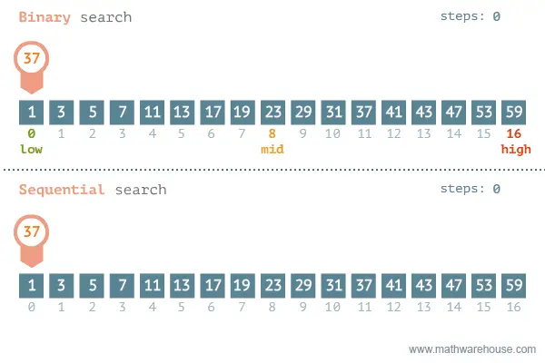
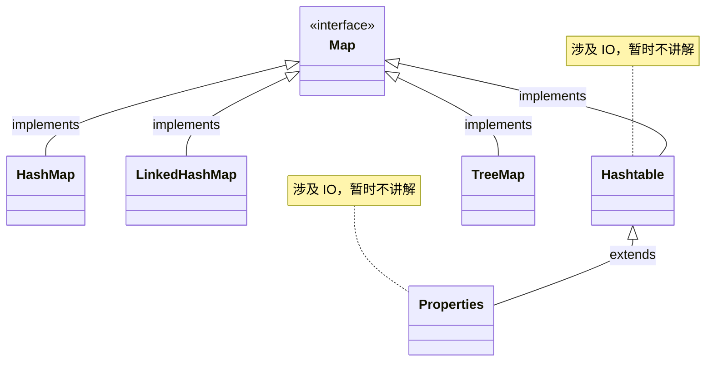
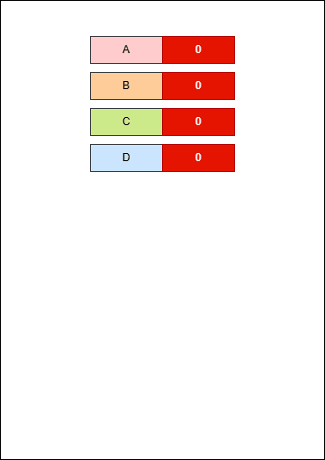

# 第一章：集合体系结构

## 1.1 概述

- 集合是 Java 提供的一种容器，可以用来存储多个数据。集合的本质是用来`存储对象`。

> [!NOTE]
>
> - 【问】：集合只能用来存储对象？为什么也可以存储基本数据类型？
> - 【答】：在 JDK5 的时候，新增了一个特性：自动装箱和自动拆箱。换言之，向集合中添加基本类型数据的时候，会先转换为对应的包装类型对象，然后在进行存储。

- 集合和数组都是容器，它们之间的区别？
  - ① 数组的长度是固定的，集合的长度是可变的。
  - ② 数组中可以存储基本类型的数据，也可以存储对象；但是，集合中只能存储对象。

## 1.2 集合体系结构

* Java 中的集合主要分为两大类：

  * ① Collection（单列集合）：在添加数据的时候，一次只能添加一个数据，如：`脉动`、`康师傅`、`奥利奥`等。

  * ② Map（双列集合）：在添加数据的时候，一次需要添加一对数据，如：`脉动:5元`、`康师傅:12元`、`奥利奥:8.5元`。


* Java 集合框架图，如下所示：



## 1.3 专业名词

* 在 Map 集合中一次可以添加一对数据，如：商品名称 (name) 和商品价格 (price) ：


* 在 Map 集合中，对于商品名称(name），我们称为`key`(键）；对于商品价格(price），我们称为`value`(值）：

> [!NOTE]
>
> * ① 在 Map 中，`key`(键)是`不能`重复的，`value`(值)是`可以`重复的。
> * ② 在 Map 中，`key`(键)和`value`(值)是`一一对应`的关系，即：每个`key`(键)只能对应自己的`value`(值)。


* 在 Map 中，每对`key`(键)和`value`(值)，我们称为`键值对`(键值对对象，Entry 对象)：


## 1.4 双列集合的特点

* ① 双列集合中一次需要存储一对数据，分别是键和值。
* ② 双列集合中，键是不能重复的，而值是可以重复的。
* ③ 双列集合中，键和值是一一对应的关系，每个键只能找到自己对应的值。
* ④ `键+值`这个整体，我们称之为`键值对`（键值对对象，Entry 对象）。


# 第二章：Map 接口（⭐）

## 2.1 概述

* 在双列集合中，Map 接口是它们的顶层接口，如下所示：


```mermaid
classDiagram
    Map <|-- HashMap :implements
    Map <|-- LinkedHashMap :implements
    Map <|-- Hashtable :implements
    Hashtable <|-- Properties :extends
    note for Hashtable "涉及 IO，暂时不讲解"
    note for Properties "涉及 IO，暂时不讲解"
    Map <|-- TreeMap :implements
    class Map{
        <<interface>>
    }


```

* Map 系列集合的实现类的特点：
  * ① HashMap：无序、不重复、无索引。
  * ② LinkedHashMap：`有序`、不重复、无索引。
  * ③ TreeMap：`可排序`、不重复、无索引。

## 2.2 常用 API

### 2.3.1 概述

* 在 Map 接口中定义了所有双列集合中共性的方法，即：我们只需要学习 Map 接口中的 API 。

### 2.3.2 添加元素

* 将指定的 key-value 添加到 Map 集合中：

```java
V put(K key, V value);
```

> [!NOTE]
>
> * ① 如果 Map 中不存在指定的 key，则直接将 key-value 添加到 Map 中，并返回 null。
> * ② 如果 Map 中已经存在指定的 key，会将原先的 key-value 覆盖掉（新值替换旧值），并将原先的 value 返回。
> * ③ 在实际开发中，我们通常并不会关心 put() 方法的返回值。

* 将另一个 Map 集合的元素全部添加到该 Map 集合中：

```java
void putAll(Map<? extends K, ? extends V> m);
```


* 示例：

::: code-group

```java [Test.java]
package com.github.collection3;

import java.util.HashMap;
import java.util.Map;

public class Test {
    public static void main(String[] args) {
        // 创建 Map 集合
        Map<String, String> map = new HashMap<>();
        // 添加元素
        map.put("郭靖", "黄蓉");
        map.put("杨过", "小龙女");
        map.put("杨康", "穆念慈");
        map.put("张无忌", "赵敏");
        map.put("萧峰", "阿朱");
        map.put("令狐冲", "任盈盈");
        map.put("袁承志", "夏青青");
        // 打印 Map 集合中的元素
        map.forEach((key, value) -> System.out.println(key + ":" + value));
    }
}
```

```txt [cmd 控制台]
令狐冲:任盈盈
杨过:小龙女
杨康:穆念慈
袁承志:夏青青
萧峰:阿朱
郭靖:黄蓉
张无忌:赵敏
```

:::


* 示例：

::: code-group

```java [Test.java]
package com.github.collection3;

import java.util.HashMap;
import java.util.Map;

public class Test {
    public static void main(String[] args) {
        // 创建 Map 集合
        Map<String, String> map = new HashMap<>();
        // 添加元素
        map.put("郭靖", "黄蓉");
        map.put("杨过", "小龙女");
        map.put("杨康", "穆念慈");
        map.put("张无忌", "赵敏");
        map.put("萧峰", "阿朱");
        map.put("令狐冲", "任盈盈");
        map.put("袁承志", "夏青青");
        // 创建另一个 Map 集合
        Map<String, String> map2 = new HashMap<>();
        map2.put("陈家洛", "香香公主");
        map2.put("余鱼同", "霍青桐");
        map2.put("袁冠", "冯杏儿");
        map2.put("李文秀", "苏普");
        map2.put("狄云", "水笙");
        // 添加 map2 的元素
        map.putAll(map2);
        // 打印集合中的元素
        map.forEach((key, value) -> System.out.println(key + ":" + value));
    }
}
```

```txt [cmd 控制台]
令狐冲:任盈盈
杨过:小龙女
陈家洛:香香公主
杨康:穆念慈
狄云:水笙
余鱼同:霍青桐
袁承志:夏青青
李文秀:苏普
萧峰:阿朱
郭靖:黄蓉
张无忌:赵敏
袁冠:冯杏儿
```

:::

### 2.3.3 集合中元素的个数

* 返回集合中元素的个数：

```java
int size();
```


* 示例：

```java
package com.github.collection3;

import java.util.HashMap;
import java.util.Map;

public class Test {
    public static void main(String[] args) {
        // 创建 Map 集合
        Map<String, String> map = new HashMap<>();
        // 添加元素
        map.put("郭靖", "黄蓉");
        map.put("杨过", "小龙女");
        map.put("杨康", "穆念慈");
        map.put("张无忌", "赵敏");
        map.put("萧峰", "阿朱");
        map.put("令狐冲", "任盈盈");
        map.put("袁承志", "夏青青");
        // 创建另一个 Map 集合
        Map<String, String> map2 = new HashMap<>();
        map2.put("陈家洛", "香香公主");
        map2.put("余鱼同", "霍青桐");
        map2.put("袁冠", "冯杏儿");
        map2.put("李文秀", "苏普");
        map2.put("狄云", "水笙");
        // 打印集合中的元素的个数
        System.out.println(map.size()); // 7
        System.out.println(map2.size()); // 5
    }
}
```

### 2.3.4 清空集合

* 将集合中的元素清空：

```java
void clear();
```


* 示例：

```java
package com.github.collection3;

import java.util.HashMap;
import java.util.Map;

public class Test {
    public static void main(String[] args) {
        Map<String, String> map = new HashMap<>();

        map.put("郭靖", "黄蓉");
        map.put("杨过", "小龙女");
        map.put("杨康", "穆念慈");
        map.put("张无忌", "赵敏");
        map.put("萧峰", "阿朱");
        map.put("令狐冲", "任盈盈");
        map.put("袁承志", "夏青青");

        System.out.println(map.size()); // 7

        // 清空集合
        map.clear();

        System.out.println(map.size()); // 0

    }
}
```

### 2.3.4 判断方法

* 判断当前集合是否为空（没有元素）：

```java
boolean isEmpty();
```

* 判断当前集合是否包含指定的 key ：

```java
boolean containsKey(Object key);
```

* 判断当前集合是否包含指定的 value ：

```java
boolean containsValue(Object value);
```


* 示例：

```java
package com.github.collection3;

import java.util.HashMap;
import java.util.Map;

public class Test {
    public static void main(String[] args) {
        Map<String, String> map = new HashMap<>();

        map.put("郭靖", "黄蓉");
        map.put("杨过", "小龙女");
        map.put("杨康", "穆念慈");
        map.put("张无忌", "赵敏");
        map.put("萧峰", "阿朱");
        map.put("令狐冲", "任盈盈");
        map.put("袁承志", "夏青青");

        System.out.println(map.isEmpty()); // false

        map.clear();

        System.out.println(map.isEmpty()); // true

    }
}
```


* 示例：

```java
package com.github.collection3;

import java.util.HashMap;
import java.util.Map;

public class Test {
    public static void main(String[] args) {
        Map<String, String> map = new HashMap<>();

        map.put("郭靖", "黄蓉");
        map.put("杨过", "小龙女");
        map.put("杨康", "穆念慈");
        map.put("张无忌", "赵敏");
        map.put("萧峰", "阿朱");
        map.put("令狐冲", "任盈盈");
        map.put("袁承志", "夏青青");

        System.out.println(map.containsKey("郭靖")); // true
        System.out.println(map.containsKey("黄蓉")); // false
    }
}
```


* 示例：

```java
package com.github.collection3;

import java.util.HashMap;
import java.util.Map;

public class Test {
    public static void main(String[] args) {
        Map<String, String> map = new HashMap<>();

        map.put("郭靖", "黄蓉");
        map.put("杨过", "小龙女");
        map.put("杨康", "穆念慈");
        map.put("张无忌", "赵敏");
        map.put("萧峰", "阿朱");
        map.put("令狐冲", "任盈盈");
        map.put("袁承志", "夏青青");

        System.out.println(map.containsValue("郭靖")); // false
        System.out.println(map.containsValue("黄蓉")); // true
    }
}
```

### 2.3.5 根据 key 获取 value

* 根据指定的 key 获取对应的 value ，如果不存在 key，则返回 null ：

```java
V get(Object key);
```

* 根据指定的 key 获取对应的 value ，如果不存在 key，则返回默认值：

```java
default V getOrDefault(Object key, V defaultValue);
```


* 示例：

```java
package com.github.collection3;

import java.util.HashMap;
import java.util.Map;

public class Test {
    public static void main(String[] args) {
        Map<String, String> map = new HashMap<>();

        map.put("郭靖", "黄蓉");
        map.put("杨过", "小龙女");
        map.put("杨康", "穆念慈");
        map.put("张无忌", "赵敏");
        map.put("萧峰", "阿朱");
        map.put("令狐冲", "任盈盈");
        // map.put("袁承志", "夏青青");

        System.out.println(map.get("郭靖")); // 黄蓉
        System.out.println(map.get("袁承志")); // null
    }
}
```


* 示例：

```java
package com.github.collection3;

import java.util.HashMap;
import java.util.Map;

public class Test {
    public static void main(String[] args) {
        Map<String, String> map = new HashMap<>();

        map.put("郭靖", "黄蓉");
        map.put("杨过", "小龙女");
        map.put("杨康", "穆念慈");
        map.put("张无忌", "赵敏");
        map.put("萧峰", "阿朱");
        map.put("令狐冲", "任盈盈");
        // map.put("袁承志", "夏青青");

        System.out.println(map.getOrDefault("郭靖", "")); // 黄蓉
        System.out.println(map.getOrDefault("袁承志", "夏青青")); // 夏青青
    }
}
```

## 2.3 遍历方式

### 2.3.1 键找值

* 返回所有的键：

```java
Set<K> keySet();
```

* 根据键找值：

```java
V get(Object key);
```

```java
/**
* 如果键存在，则返回对应的 value
* 如果键不存在，则返回指定的默认值
*/
default V getOrDefault(Object key, V defaultValue) {
    ...
}
```

> [!NOTE]
>
> ::: details 点我查看 核心思路
>
> 
>
> :::


* 示例：

::: code-group

```java [Test.java]
package com.github.collection3;

import java.util.HashMap;
import java.util.Map;
import java.util.Set;

public class Test {
    public static void main(String[] args) {
        Map<String, String> map = new HashMap<>();

        map.put("郭靖", "黄蓉");
        map.put("杨过", "小龙女");
        map.put("杨康", "穆念慈");
        map.put("张无忌", "赵敏");
        map.put("萧峰", "阿朱");
        map.put("令狐冲", "任盈盈");
        map.put("袁承志", "夏青青");
        
        // 遍历：键 --> 值
        Set<String> set = map.keySet();
        for (String key : set) {
            System.out.println(key + "--->" + map.get(key));
        }
    }
}
```

```txt [cmd 控制台]
令狐冲--->任盈盈
杨过--->小龙女
杨康--->穆念慈
袁承志--->夏青青
萧峰--->阿朱
郭靖--->黄蓉
张无忌--->赵敏
```

:::

### 2.3.2 键值对

* 返回所有的 Entry 对象：

```java
Set<Map.Entry<K, V>> entrySet();
```

> [!NOTE]
>
> ::: details 点我查看 核心思路
>
> 
>
> :::


* 示例：

::: code-group

```java [Test.java]
package com.github.collection3;

import java.util.HashMap;
import java.util.Map;
import java.util.Set;

public class Test {
    public static void main(String[] args) {
        Map<String, String> map = new HashMap<>();

        map.put("郭靖", "黄蓉");
        map.put("杨过", "小龙女");
        map.put("杨康", "穆念慈");
        map.put("张无忌", "赵敏");
        map.put("萧峰", "阿朱");
        map.put("令狐冲", "任盈盈");
        map.put("袁承志", "夏青青");

        // 遍历：键值对
        Set<Map.Entry<String, String>> entries = map.entrySet();
        for (Map.Entry<String, String> entry : entries) {
            System.out.println(entry.getKey() + "-->" + entry.getValue());
        }
    }
}
```

```txt [cmd 控制台]
令狐冲--->任盈盈
杨过--->小龙女
杨康--->穆念慈
袁承志--->夏青青
萧峰--->阿朱
郭靖--->黄蓉
张无忌--->赵敏
```

:::

### 2.3.3 Lambda 表达式

* 直接通过 Lambda 表达式遍历：

```java
default void forEach(BiConsumer<? super K, ? super V> action) { // [!code focus]
    Objects.requireNonNull(action);
    for (Map.Entry<K, V> entry : entrySet()) {
        K k;
        V v;
        try {
            k = entry.getKey();
            v = entry.getValue();
        } catch (IllegalStateException ise) {
            // this usually means the entry is no longer in the map.
            throw new ConcurrentModificationException(ise);
        }
        action.accept(k, v);
    }
} // [!code focus]
```


* 示例：

::: code-group

```java [Test.java]
package com.github.collection3;

import java.util.HashMap;
import java.util.Map;

public class Test {
    public static void main(String[] args) {
        // 创建 Map 集合
        Map<String, String> map = new HashMap<>();
        // 添加元素
        map.put("郭靖", "黄蓉");
        map.put("杨过", "小龙女");
        map.put("杨康", "穆念慈");
        map.put("张无忌", "赵敏");
        map.put("萧峰", "阿朱");
        map.put("令狐冲", "任盈盈");
        map.put("袁承志", "夏青青");
        // 打印 Map 集合中的元素
        map.forEach((key, value) -> System.out.println(key + ":" + value));
    }
}
```

```txt [cmd 控制台]
令狐冲:任盈盈
杨过:小龙女
杨康:穆念慈
袁承志:夏青青
萧峰:阿朱
郭靖:黄蓉
张无忌:赵敏
```

:::

## 2.4 综合练习

* 需求：某个班级 80 个学生，现在需要组成秋游活动，班长提供了四个景点依次是（A、B、C、D），每个学生只能选择一个景点，请统计出最终哪个景点想去的人数最多。

> [!NOTE]
>
> 思路：创建 Map 集合，`每个景点`和`投票次数`组成一个元素，如下所示：
>
> 


* 示例：

::: code-group

```java [Test.java]
package com.github.collection3;

import java.security.SecureRandom;
import java.util.*;

public class Test {
    public static void main(String[] args) {
        /* 生成学生们的投票 */
        String[] arr = new String[]{"A", "B", "C", "D"};
        List<String> voteList = new ArrayList<>();
        Random random = new SecureRandom();
        for (int i = 0; i < 80; i++) {
            // 获取随机索引
            int index = random.nextInt(arr.length);
            // 获取投票
            String vote = arr[index];
            // 保存起来
            voteList.add(vote);
        }
        // 创建集合对象
        Map<String, Integer> map = new HashMap<>();
        // 添加景点以及次数
        for (String str : arr) {
            map.put(str, 0); // [!code highlight]
        }
        // 遍历学生们的投票
        for (String vote : voteList) {
            // 获取投票景点
            Integer count = map.get(vote);
            // 计数器+1
            count++;
            // 保存到 Map 中
            map.put(vote, count);
        }

        // 打印每个景点的投票次数
        map.forEach((k, v) -> System.out.println(k + " : " + v));

        // 获取投票次数最多的景点
        String maxVote = Collections
                .max(map.entrySet(), Comparator.comparingInt(Map.Entry::getValue))
                .getKey();
        System.out.println("投票次数最多的景点：" + maxVote);
    }
}
```

```txt [cmd 控制台]
A : 19
B : 21
C : 24
D : 16
投票次数最多的景点：C
```

:::

## 2.5 综合练习

* 需求：某个班级 80 个学生，现在需要组成秋游活动，班长提供了四个景点依次是（A、B、C、D），每个学生只能选择一个景点，请统计出最终哪个景点想去的人数最多。

> [!NOTE]
>
> * ① 之前在遍历投票结果之前，就已经给每个景点设置了次数为 0 ，虽然可以实现效果；但是，如果某些景点，一个同学都没投票，我们依然需要在 Map 中给其添加，效率有点低。
> * ② 改进方案：遍历同学的投票结果，如果景点在 map 中不存在，则设置为 1 ；否则，就获取该景点的次数，自增，然后再覆盖。


* 示例：

::: code-group

```java [Test.java]
package com.github.collection3;

import java.util.*;

public class Test {
    public static void main(String[] args) {
        /* 生成学生们的投票 */
        String[] arr = new String[]{"A", "B", "C", "D"};
        List<String> voteList = new ArrayList<>();
        Random random = new Random();
        for (int i = 0; i < 80; i++) {
            // 获取随机索引
            int index = random.nextInt(arr.length);
            // 获取投票
            String vote = arr[index];
            // 保存起来
            voteList.add(vote);
        }
        // 创建集合对象
        Map<String, Integer> map = new HashMap<>();

        // 遍历学生们的投票
        for (String vote : voteList) { // [!code highlight:9]
            if (map.containsKey(vote)) { // 如果存在
                Integer count = map.get(vote);
                count++;
                map.put(vote, count);
            } else { // 如果不存在
                map.put(vote, 1);
            }
        }

        // 打印每个景点的投票次数
        map.forEach((k, v) -> System.out.println(k + " : " + v));

        // 获取投票次数最多的景点
        String maxVote = Collections
                .max(map.entrySet(), Comparator.comparingInt(Map.Entry::getValue))
                .getKey();
        System.out.println("投票次数最多的景点：" + maxVote);
    }
}
```

```txt [cmd 控制台]
A : 24
B : 17
C : 18
D : 21
投票次数最多的景点：A
```

:::

## 2.6 综合练习

* 需求：某个班级 80 个学生，现在需要组成秋游活动，班长提供了四个景点依次是（A、B、C、D），每个学生只能选择一个景点，请统计出最终哪个景点想去的人数最多。

> [!NOTE]
>
> * ① 之前的方案：遍历同学的投票结果，如果景点在 map 中不存在，则设置为 1 ；否则，就获取该景点的次数，自增，然后再覆盖。
> * ② 改进方案：遍历同学的投票结果，如果景点在 map 中不存在，返回 0，并设置为 1 ；否则，就获取该景点的次数，自增，然后再覆盖。


* 示例：

::: code-group

```java [Test.java]
package com.github.collection3;

import java.util.*;

public class Test {
    public static void main(String[] args) {
        /* 生成学生们的投票 */
        String[] arr = new String[]{"A", "B", "C", "D"};
        List<String> voteList = new ArrayList<>();
        Random random = new Random();
        for (int i = 0; i < 80; i++) {
            // 获取随机索引
            int index = random.nextInt(arr.length);
            // 获取投票
            String vote = arr[index];
            // 保存起来
            voteList.add(vote);
        }
        // 创建集合对象
        Map<String, Integer> map = new HashMap<>();

        // 遍历学生们的投票
        for (String vote : voteList) { // [!code highlight:3]
            map.put(vote, map.getOrDefault(vote, 0) + 1);
        }

        // 打印每个景点的投票次数
        map.forEach((k, v) -> System.out.println(k + " : " + v));

        // 获取投票次数最多的景点
        String maxVote = Collections
                .max(map.entrySet(), Comparator.comparingInt(Map.Entry::getValue))
                .getKey();
        System.out.println("投票次数最多的景点：" + maxVote);
    }
}
```

```txt [cmd 控制台]
A : 24
B : 17
C : 18
D : 21
投票次数最多的景点：A
```

:::

## 2.7 综合练习

* 需求：某个班级 80 个学生，现在需要组成秋游活动，班长提供了四个景点依次是（A、B、C、D），每个学生只能选择一个景点，请统计出最终哪个景点想去的人数最多。

> [!NOTE]
>
> * ① 之前的方案：遍历同学的投票结果，如果景点在 map 中不存在，返回 0，并设置为 1 ；否则，就获取该景点的次数，自增，然后再覆盖。
> * ② 改进方案：遍历同学的投票结果，如果景点在 map 中不存在，设置为 1 ；否则，就获取该景点的次数，自增，然后再覆盖。


* 示例：

::: code-group

```java [Test.java]
package com.github.collection3;

import java.util.*;

public class Test {
    public static void main(String[] args) {
        /* 生成学生们的投票 */
        String[] arr = new String[]{"A", "B", "C", "D"};
        List<String> voteList = new ArrayList<>();
        Random random = new Random();
        for (int i = 0; i < 80; i++) {
            // 获取随机索引
            int index = random.nextInt(arr.length);
            // 获取投票
            String vote = arr[index];
            // 保存起来
            voteList.add(vote);
        }
        // 创建集合对象
        Map<String, Integer> map = new HashMap<>();

        // 遍历学生们的投票
        for (String vote : voteList) { // [!code highlight:3]
            // 如果 Map 中没有该元素，则设置为 1
            // 如果 Map 中已经有了该元素，则在上一次的基础上累加
            map.merge(vote, 1, Integer::sum);
        }

        // 打印每个景点的投票次数
        map.forEach((k, v) -> System.out.println(k + " : " + v));

        // 获取投票次数最多的景点
        String maxVote = Collections
                .max(map.entrySet(), Comparator.comparingInt(Map.Entry::getValue))
                .getKey();
        System.out.println("投票次数最多的景点：" + maxVote);
    }
}
```

```txt [cmd 控制台]
A : 18
B : 25
C : 18
D : 19
投票次数最多的景点：B
```

:::

