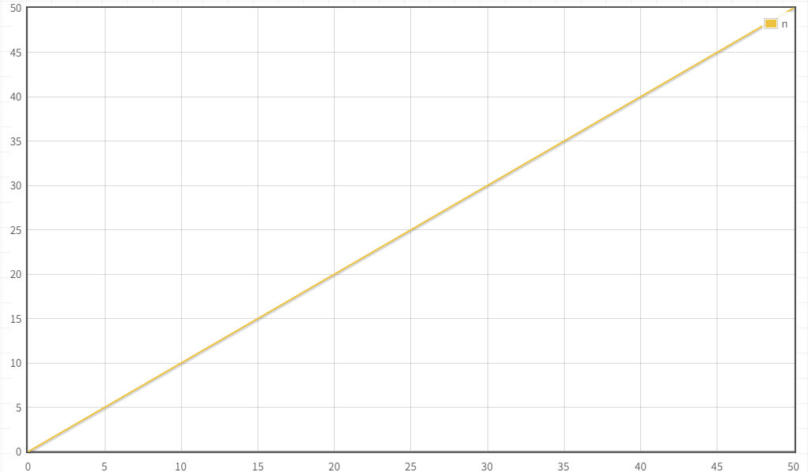
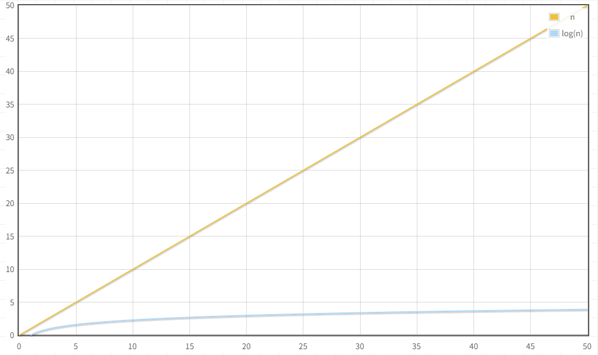

# 第一章：常见算法

## 1.1 概述

* 很多人认为：将一堆打乱的数据进行`排序`或在一堆数据中`查找`到想要的数据，这就是`算法`。


> [!NOTE]
>
> 其实，上述仅仅是基础操作（基操）而已！！！

* 在企业中，算法都是用来解决一个又一个真实的需求。


* 常见的算法有`查找算法`、`排序算法`以及`字符串匹配算法`等，如下所示：


## 1.2 查找算法

### 1.2.1 概述

* `查找算法`有`基本查找`、`二分查找`、`插值查找`、`斐波那契查找`、`分块查找`、`哈希查找`以及`树表查找`，如下所示：


### 1.2.2 基本查找（顺序查找）

* `基本查找（顺序查找）`是最简单的一种查找方法，它通过逐一检查列表中的每个元素，直到找到目标元素为止。如果找到目标元素，则返回其位置，否则返回“未找到”。


* `算法的步骤`：
  * ① 从列表的第一个元素开始，逐个比较每个元素和目标元素是否相等。
  * ② 如果相等，则返回元素的索引。
  * ③ 如果遍历完整个列表都没有找到目标元素，则返回一个表示未找到的值，如：`-1` 。

* `时间复杂度`：**O(n)**，n 表示列表中元素的数量。



* `适用场景`：当数据量较小或数据无序时，顺序查找非常高效。


* 示例：

```java
package com.github.algorithm.search;

public class BasicSearchTest {
    public static void main(String[] args) {
        int[] arr = {2, -6, 4, 6, 2, 5, 88, 4, 5, 7, 0, 7, 5, 2, 1, 64, 98};
        
        int index = indexOf(arr, 98);
        System.out.println(index); // 16
        
        index = indexOf(arr, -100);
        System.out.println(index); // -1
    }

    /**
     * 基本查找
     * @param arr 数组
     * @param num 查找元素
     * @return 元素在数组上的索引，如果元素不在数组中，将返回 -1
     */
    public static int indexOf(int[] arr, int num) {
        for (int i = 0; i < arr.length; i++) {
            if (num == arr[i]) {
                return i;
            }
        }
        return -1;
    }
}
```

### 1.2.3 二分查找（折半查找）

* `二分查找（折半查找）`是针对已排序的数据结构的一种查找方法。它通过将数据集分成两半来不断缩小查找范围，从而提高查找效率。


* `算法步骤`：
  - ① 将数据集分为两部分，检查中间元素是否为目标元素。
  - ② 如果目标元素小于中间元素，则继续在左半部分查找；如果大于，则在右半部分查找。
  - ③ 重复以上步骤直到找到目标元素，或者查找范围为空。
* `时间复杂度`： **O(log n)**，其中 n 是数据集中的元素数量。



* `适用场景`：仅适用于`已排序`的数据集。


* 示例：

```java
package com.github.algorithm.search;

public class BinarySearchTest {
    public static void main(String[] args) {
        int[] arr = {2, 3, 5, 7, 9, 11, 12, 15, 20, 25, 30, 31, 32, 40, 45};

        int index = indexOf(arr, 20);
        System.out.println(index); // 8

        index = indexOf(arr, -100);
        System.out.println(index); // -1
    }

    /**
     * 二分查找
     * @param arr 数组
     * @param num 查找元素
     * @return 元素在数组上的索引，如果元素不在数组中，将返回 -1
     */
    public static int indexOf(int[] arr, int num) {
        // 定义起始元素索引
        int min = 0;
        // 定义最后元素索引
        int max = arr.length - 1;
        // 循环条件
        while (min <= max) {
            // 计算中间元素索引
            int mid = (min + max) / 2;
            // 如果中间元素就是要查找的元素，直接返回索引
            if (num == arr[mid]) {
                return mid;
            }
            // 如果需要查找的元素比中间的元素小
            // 那么 max 就是此时的 mid+1，然后再计算 mid
            if (num < arr[mid]) {
                max = mid - 1;
            }
            // 如果需要查找的元素比中间的元素大
            // 那么 min 就是此时的 mid-1，然后再计算 mid
            if (num > arr[mid]) {
                min = mid + 1;
            }
        }
        return -1;
    }
}
```

### 1.2.4 插值查找

* `插值查找`是一种改进的二分查找算法，适用于在`均匀分布的有序数据`中查找元素。它通过估算目标元素在数据中的位置来优化查找过程，从而提高查找效率。


* `算法步骤`：
  - ① 给定一个有序数组 `arr` 和目标元素 `num`，确定查找区间的左右边界 `min` 和 `max`。
  - ② 使用插值公式计算中间位置 `mid`： $[ mid = min+ \frac{(num- arr[min]) \times (max- min)}{arr[max] - arr[min]} ]$ ，这里的 `mid` 位置是根据目标值与当前区间的最小值、最大值的差值来动态估算的。
  - ③ 如果 `arr[mid] == num`，则找到目标元素，返回该位置。
  - ④ 如果 `arr[mid] < num`，则目标元素在右半部分，将 `min = mid + 1`。
  - ⑤ 如果 `arr[mid] > num`，则目标元素在左半部分，将 `max = mid - 1`。
  - ⑥ 重复`步骤②` ~ `步骤⑤`，直到找到目标元素或区间无效，即：`min > max`。

* `时间复杂度`：
  * 最优时间复杂度：**O(log log n)**，当数据均匀分布时，插值查找的效率接近 O(log log n)。
  * 最坏时间复杂度： **O(n)**，当数据分布非常不均匀时，插值查找退化为线性查找，性能最差。


  * `适用场景`：

      - 插值查找适用于`已排序且数据分布比较均匀`的数组。

      - 如果数据不均匀分布或分布不规律，插值查找的性能可能非常差，甚至退化为线性查找，因此不适用于所有有序数据。


* 示例：

```java
package com.github.algorithm.search;

public class InsertBinarySearchTest {
    public static void main(String[] args) {
        int[] arr = {1, 2, 3, 4, 5, 6, 7, 8, 9, 10};

        int index = indexOf(arr, 3);
        System.out.println(index); // 2

        index = indexOf(arr, -1);
        System.out.println(index); // -1
    }

    /**
     * 插值查找
     * @param arr 数组
     * @param num 查找元素
     * @return 元素在数组上的索引，如果元素不在数组中，将返回 -1
     */
    public static int indexOf(int[] arr, int num) {
        // 定义起始元素索引
        int min = 0;
        // 定义最后元素索引
        int max = arr.length - 1;
        // 循环条件
        while (min <= max) {
            // 计算中间元素索引
            int mid = min + (num - arr[min]) / (arr[max] - arr[min]) * (max - min);
            // 如果中间元素就是要查找的元素，直接返回索引
            if (num == arr[mid]) {
                return mid;
            }
            // 如果需要查找的元素比中间的元素小
            // 那么 max 就是此时的 mid+1，然后再计算 mid
            if (num < arr[mid]) {
                max = mid - 1;
            }
            // 如果需要查找的元素比中间的元素大
            // 那么 min 就是此时的 mid-1，然后再计算 mid
            if (num > arr[mid]) {
                min = mid + 1;
            }
        }
        return -1;
    }
}
```

### 1.2.5 斐波那契查找

#### 1.2.5.1 黄金分割点

* 黄金分割是指将整体一分为二，`较大部分`与`整体部分`的比值等于`较小部分`与`较大部分`的比值，其比值约为 0.618。


#### 1.2.5.2 斐波那契数列

* 在数学中有一个著名的数学规律（斐波那契数列）：0, 1, 1, 2, 3, 5, 8, 13, 21, 34, 55, 89…….

> [!NOTE]
>
> * ① 斐波那契数列存储到数组中，如下所示：
>
> 
>
> * 斐波那契数列：从第三个数（数组下标）开始，后边每一个数都是前面两个数之和。


* 示例：

```java
package com.github.algorithm.search;

public class Test {
    public static void main(String[] args) {
        int fib = fib(0);
        System.out.println("fib = " + fib);
    }

    /**
     * 获取指定位置上的斐波那契数列
     * @param n 位置
     * @return 数
     */
    public static int fib(int n) {
        if (n == 0) {
            return 0;
        }
        if (n == 1 || n == 2) {
            return 1;
        }
        return fib(n - 1) + fib(n - 2);
    }
}
```


* 示例：

```java
package com.github.algorithm.search;

import java.util.Arrays;

public class Test {
    public static void main(String[] args) {
        int[] fib = fib(3);
        System.out.println("fib = " + Arrays.toString(fib));
    }

    /**
     * 获取斐波那契数列组成的数组
     * @param n 索引
     * @return 数组
     */
    public static int[] fib(int n) {
        int[] arr = new int[n + 1];
        arr[0] = 0;
        if (n >= 1) {
            arr[1] = 1;
        }
        for (int i = 2; i <= n; i++) {
            arr[i] = arr[i - 1] + arr[i - 2];
        }
        return arr;
    }
}
```

#### 1.2.5.3 斐波那契查找

* `斐波那契查找`利用斐波那契数列的性质来确定查找区间的大小，并逐步缩小查找范围。

> [!NOTE]
>
> * ① 假设数组的元素是：`[10,22,35,40,45,50,70,80,90,100]`，如下所示：
>
> 
>
> * ② 
>
> 

* `算法步骤`：
  * ① 初始化斐波那契数列：首先，确定斐波那契数列中比数组长度大的最小数 ( F(k) )，并设置两个索引 `min = 0` 和 `max = n - 1`，其中 `n` 是数组的长度。
  * ② 计算分割点：使用公式计算当前分割点： [ mid = min + F(k-1) - 1 ] 这里的 `mid` 是通过斐波那契数列来确定的分割点。
  * ③ 比较目标值：
    - 如果 `arr[mid] == num`，则找到了目标元素，返回索引 `mid`。
    - 如果 `arr[mid] > num`，则目标元素在 `mid` 左侧，更新 `max = mid - 1`，并调整斐波那契数列的大小。
    - 如果 `arr[mid] < num`，则目标元素在 `mid` 右侧，更新 `min= mid + 1`，并调整斐波那契数列的大小。
  * ④ 调整斐波那契数列：根据查找结果更新 `k`，即更新斐波那契数列中的位置，直到 `min` 超过 `max`。


* 示例：

```java
```


## 1.3 排序算法

### 1.3.1 概述


# 第二章：Arrays（⭐）

## 2.1 概述


# 第三章：Lambda 表达式（⭐）

## 3.1 概述


# 第四章：综合练习

## 4.1 练习一


## 4.2 练习二


## 4.3 练习三


## 4.4 练习四


## 4.5 练习五