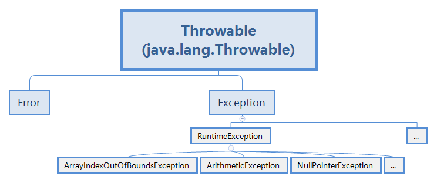
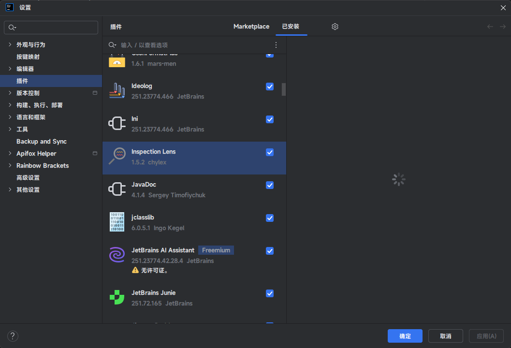
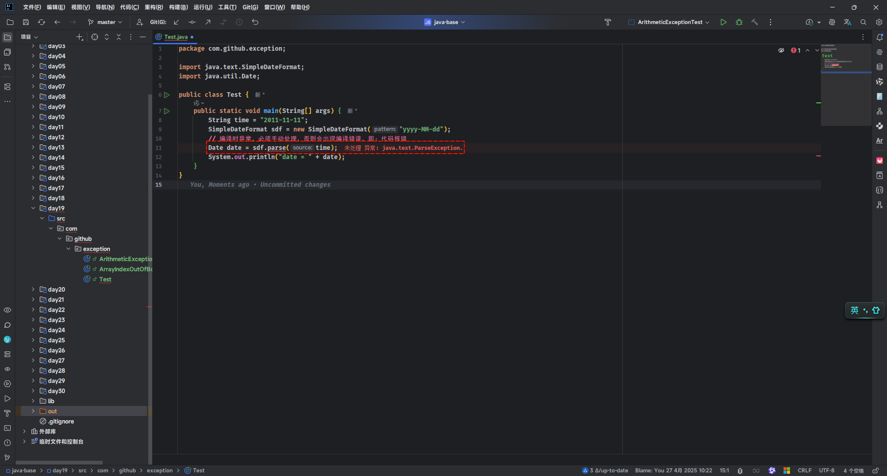
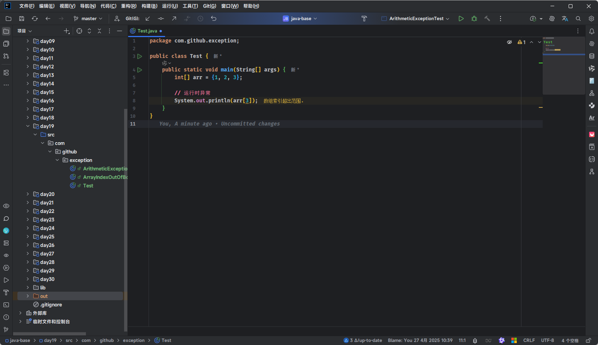
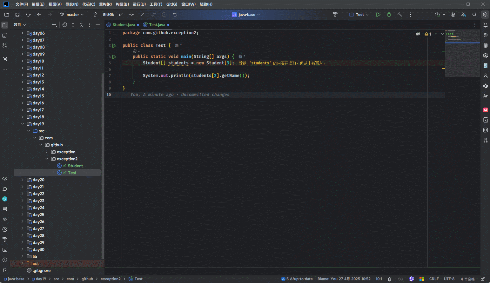
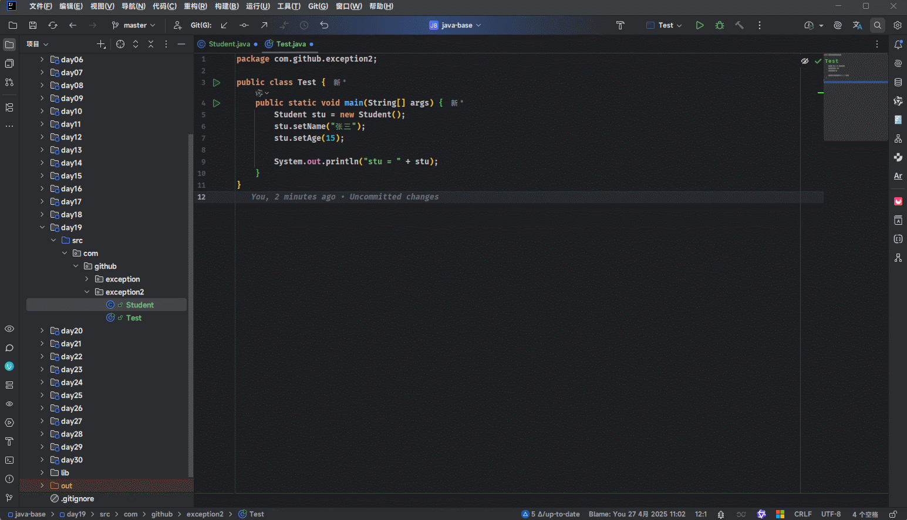
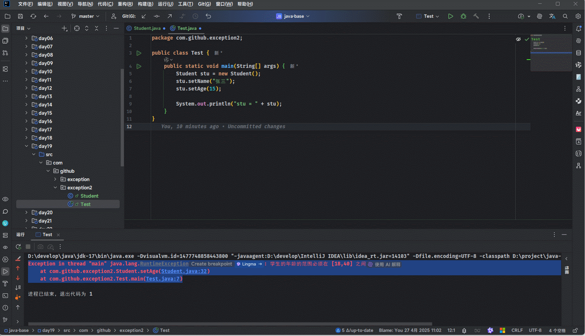
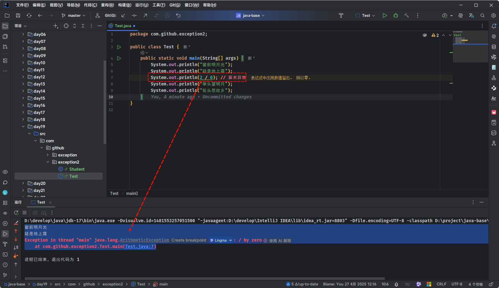
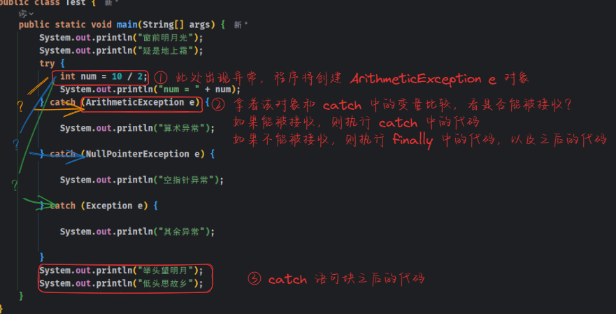
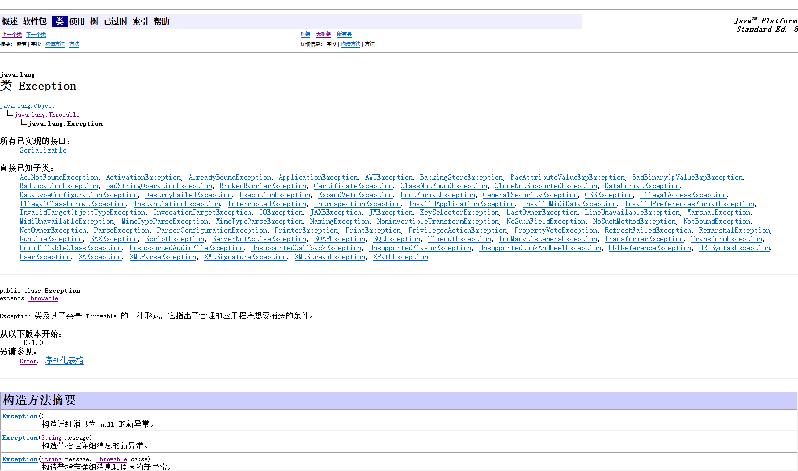

# 第一章：前言

## 1.1 概念

* 在实际开发中，即使程序员将代码写得尽善尽美，在系统的运行过程中依然会遇到很多问题而导致程序停止运行，如：客户数据输入格式问题、读取文件是否存在问题以及网络是否通畅问题等等。

> [!NOTE]
>
> * ① 在 Java 等面向对象的编程语言中，异常本身是一个类，产生异常就是创建异常对象并抛出一个异常对象。
> * ② Java 处理异常的方式是中断处理。

* 在 Java 中，将程序运行过程中，出现的不正常的情况，而导致 JVM 非正常停止的现象，称为`异常`。

## 1.2 纠正概念

* ① `语法错误`和`逻辑错误`通常不是被视为“异常”，它们属于代码执行前的问题：
  * **语法错误**：是指代码在编写时不符合编程语言的语法规则，通常会在编译或解释阶段被捕捉到，并阻止程序运行，如：漏写括号、拼写错误等。
  * **逻辑错误**：是指程序运行时没有达到预期的结果，虽然语法没有问题，但由于逻辑设计有误，程序的行为与预期不符。逻辑错误通常不会被编译器或解释器直接捕捉到，必须通过调试或者测试来发现。
* ② `异常`通常指的是在程序运行过程中，遇到无法预见的情况时产生的错误，如：文件未找到、除零错误、网络连接失败等，这些错误通常会被程序在运行时捕捉，并且可以通过异常处理机制来进行捕捉和处理。


# 第二章：异常体系（⭐）

## 2.1 概述

* 之前我们也遇到过很多异常，如：ArrayIndexOutOfBoundsException（索引越界异常）、ArithmeticException（算术异常） 等。

::: code-group

```java [ArrayIndexOutOfBoundsExceptionTest.java]
public class ArrayIndexOutOfBoundsExceptionTest {
    public static void main(String[] args) {
        int[] arr = {1, 2, 3};

        // ❌ 以下代码是错误的
        // ArrayIndexOutOfBoundsException
        System.out.println(arr[3]); // [!code error]
    }
}
```

```txt [cmd 控制台]
Exception in thread "main" java.lang.ArrayIndexOutOfBoundsException: Index 3 out of bounds for length 3
	at com.github.exception.ArrayIndexOutOfBoundsExceptionTest.main(ArrayIndexOutOfBoundsExceptionTest.java:7)
```

:::

::: code-group

```java [ArithmeticExceptionTest.java]
public class ArithmeticExceptionTest {
    public static void main(String[] args) {
        
        // ❌ 以下代码是错误的
        // ArithmeticException 
        System.out.println(2 / 0); // [!code error]
    }
}
```

```txt [cmd 控制台]
Exception in thread "main" java.lang.ArithmeticException: / by zero
	at com.github.exception.ArithmeticExceptionTest.main(ArithmeticExceptionTest.java:5)
```

:::

* 诸如此类的异常非常多，且异常类之间存在直接或间接的继承关系，组成了`异常继承体系`，如下所示：



> [!NOTE]
>
> * Error：代表的是系统级别的错误（属于严重错误），只能事先避免，而无法直接处理。
>   * StackOverflowError（栈溢出错误）：程序在执行过程中，栈空间被耗尽的情况。栈是用于存储局部变量、函数调用以及其他临时数据的内存区域。当程序调用过多的函数或者递归深度过深时，会导致栈空间不足，最终引发栈溢出错误。
>   * OutOfMemoryError（OOM，内存溢出）：应用程序中存在无法回收的内存或者使用的内存过多，最终使得程序运行用到的内存大于要提供的最大内存。
>   * 系统一旦出现问题，SUN 公司会将这些错误封装成 Error 对象，Error 是给 SUN 公司的开发人员使用的（开发 JDK 的那群人），而不是给我们普通程序员使用的，所以对于 Error 错误，我们通常不需要关心。
> * Exception：代表的是程序可能出现的问题（异常）。我们通常会使用 Exception 及其子类来封装程序出现的问题。
>   * 编译时异常（CheckedException，非 RuntimeException）：编译阶段就会出现异常提醒的，如：日期解析异常。
>   * 运行时异常（RuntimeException 及其子类）：编译阶段不会出现异常提醒，运行的时候出现的异常，如：数组索引越界异常。

## 2.2 编译时异常

* Java 程序需要经过`编译`和`运行`两个阶段，如下所示：


* `编译时异常（CheckedException，非 RuntimeException）`：就是直接继承 Exception 的异常类，在编译阶段就会出现异常提醒，即：必须手动处理，否则将会出现编译错误。

```java
package com.github.exception;

import java.text.SimpleDateFormat;
import java.util.Date;

public class Test {
    public static void main(String[] args) {
        String time = "2011-11-11";
        SimpleDateFormat sdf = new SimpleDateFormat("yyyy-MM-dd");
        // 编译时异常，必须手动处理，否则会出现编译错误
        Date date = sdf.parse(time);
        System.out.println("date = " + date);
    }
}
```

* 在 IDEA 中，感觉更为明显，如下所示：

> [!NOTE]
>
> ::: details 点我查看 具体细节
>
> 本人使用了 IDEA 的错误提醒插件`Inspaction Lens` ，报错信息将在代码旁边显示，非常方便！！！
>
> 
>
> :::



* 编译时异常，其目的就是为了`提醒`程序员检查本地信息。当程序员手动处理了编译时异常，代码将会正常编译。


> [!IMPORTANT]
>
> * ① 编译时异常（CheckedException，非 RuntimeException）：除了 RuntimeException 及其子类，其余的都是编译时异常。
>
> * ② 编译时异常，在编译阶段就会直接报错，需要手动处理（强制），其目的就是为了`提醒`程序员检查本地信息。

## 2.3 运行时异常

* Java 程序需要经过`编译`和`运行`两个阶段，如下所示：


* `运行时异常（RuntimeException）`：RuntimeException 及其子类，在编译阶段不需要处理，是代码运行的时候才会出现的异常。

```java
package com.github.exception;

public class Test {
    public static void main(String[] args) {
        int[] arr = {1, 2, 3};

        // 运行时异常
        System.out.println(arr[3]);
    }
}
```

* 在 IDEA 中，感觉更为明显，如下所示：

> [!NOTE]
>
> * ① 对于运行时异常，程序员可以处理也可以不处理。
> * ② 和编译时异常不一样，对于运行时异常，如果 IDEA 能够检测到，只会给出警告，而不是强制报错。



> [!IMPORTANT]
>
> * ① 运行时异常（RuntimeException）：RuntimeException 及其子类，都是运行时异常。
>
> * ② 运行时异常，在编译阶段不会报错，可以手动处理或者不手动处理，是程序运行的时候才会出现的，通常是由于参数传递错误带来的问题。


# 第三章：异常的作用（⭐）

## 3.1 概述

* 异常有如下的作用：
  * ① 异常是可以用来查询 bug 的关键参考信息。
  * ② 异常可以作为方法内部的一种特殊返回值，以便通知调用者底层的执行情况。

## 3.2 作用一

* 异常的作用：`异常是可以用来查询 bug 的关键参考信息`。

* 假设代码是这样的，如下所示：

::: code-group

```java [Student.java]
package com.github.exception2;

import java.util.Objects;

public class Student {

    private String name;

    private Integer age;

    public Student() {}

    public Student(String name, Integer age) {
        this.name = name;
        this.age = age;
    }

    public String getName() {
        return name;
    }

    public void setName(String name) {
        this.name = name;
    }

    public Integer getAge() {
        return age;
    }

    public void setAge(Integer age) {
        this.age = age;
    }

    @Override
    public boolean equals(Object o) {
        if (o == null || getClass() != o.getClass()) return false;
        Student student = (Student) o;
        return Objects.equals(name, student.name) && Objects.equals(age, student.age);
    }

    @Override
    public int hashCode() {
        return Objects.hash(name, age);
    }

    @Override
    public String toString() {
        return "Student{" + "name='" + name + '\'' + ", age=" + age + '}';
    }
}

```

```java [Test.java]
package com.github.exception2;

public class Test {
    public static void main(String[] args) {
        Student[] students = new Student[3];

        System.out.println(students[2].getName());
    }
}
```

```txt [cmd 控制台]
Exception in thread "main" java.lang.NullPointerException: Cannot invoke "com.github.exception2.Student.getName()" because "students[2]" is null
	at com.github.exception2.Test.main(Test.java:7)
```

:::

* 其在 IDEA 中，效果最为明显，如下所示：



## 3.3 作用二

* 异常的作用：`异常可以作为方法内部的一种特殊返回值，以便通知调用者底层的执行情况`。

* 现有如下需求，希望学生的年龄在 18 - 40 岁，我们之前是这么实现的，如下所示：

::: code-group

```java [Student.java]
package com.github.exception2;

import java.util.Objects;

public class Student {

    private String name;

    private Integer age;

    public Student() {}

    public Student(String name, Integer age) {
        this.name = name;
        this.age = age;
    }

    public String getName() {
        return name;
    }

    public void setName(String name) {
        this.name = name;
    }

    public Integer getAge() {
        return age;
    }

    public void setAge(Integer age) { // [!code highlight:7]
        if (age < 18 || age > 40) {
            System.out.println("学生的年龄的范围必须在 [18,40] 之间");
            return;
        }
        this.age = age;
    }

    @Override
    public boolean equals(Object o) {
        if (o == null || getClass() != o.getClass()) return false;
        Student student = (Student) o;
        return Objects.equals(name, student.name) 
            && Objects.equals(age, student.age);
    }

    @Override
    public int hashCode() {
        return Objects.hash(name, age);
    }

    @Override
    public String toString() {
        return "Student{" + "name='" + name + '\'' + ", age=" + age + '}';
    }
}
```

```java [Test.java]
package com.github.exception2;

public class Test {
    public static void main(String[] args) {
        Student stu = new Student();
        stu.setName("张三");
        stu.setAge(15);

        System.out.println("stu = " + stu);
    }
}
```

```txt [cmd 控制台]
学生的年龄的范围必须在 [18,40] 之间
stu = Student{name='张三', age=null}
```

:::

* 当我们运行代码的时候，其实会很懵逼，因为错误信息只是在控制台上显示。



* 其实，我们最想要的是：`如果由于参数错误，到底是哪一行代码出现问题？`并不是在控制台给出的一堆错误信息中，去猜出现问题的代码到底在哪一行？


* 现在我们修改下代码，将异常抛给调用者，如下所示：

::: code-group

```java [Student.java]
package com.github.exception2;

import java.util.Objects;

public class Student {

    private String name;

    private Integer age;

    public Student() {}

    public Student(String name, Integer age) {
        this.name = name;
        this.age = age;
    }

    public String getName() {
        return name;
    }

    public void setName(String name) {
        this.name = name;
    }

    public Integer getAge() {
        return age;
    }

    public void setAge(Integer age) { // [!code highlight:6]
        if (age < 18 || age > 40) {
            throw new RuntimeException("学生的年龄的范围必须在 [18,40] 之间");
        }
        this.age = age;
    }

    @Override
    public boolean equals(Object o) {
        if (o == null || getClass() != o.getClass()) return false;
        Student student = (Student) o;
        return Objects.equals(name, student.name) 
            && Objects.equals(age, student.age);
    }

    @Override
    public int hashCode() {
        return Objects.hash(name, age);
    }

    @Override
    public String toString() {
        return "Student{" + "name='" + name + '\'' + ", age=" + age + '}';
    }
}
```

```java [Test.java]
package com.github.exception2;

public class Test {
    public static void main(String[] args) {
        Student stu = new Student();
        stu.setName("张三");
        stu.setAge(15);

        System.out.println("stu = " + stu);
    }
}
```

```txt [cmd 控制台]
Exception in thread "main" java.lang.RuntimeException: 学生的年龄的范围必须在 [18,40] 之间
	at com.github.exception2.Student.setAge(Student.java:32)
	at com.github.exception2.Test.main(Test.java:7)
```

:::

* 当我们运行代码的时候，就可以很方便的定位到出错的位置。



* 这正是我们最想要：`如果由于参数错误导致程序出错，请给出代码出错的位置`；至于之后如何处理，是调用者的事情。


# 第三章：异常处理的方式（⭐）

## 3.1 概述

* 在 Java 中，针对异常处理，有如下的三种方式：

- [x] JVM 默认处理方式。
- [x] 自己处理。
- [x] 抛出异常，让调用者决定如何处理。

## 3.2 JVM 默认处理方式

* 针对异常处理，JVM 默认处理方式是：
  * ① 将异常名称、异常原因以及异常出现的位置等信息输出在控制台。
  * ② 程序停止运行，即：出现异常之后的代码不再执行。

> [!NOTE]
>
> ::: details 点我查看 IDEA 报错信息
>
> 
>
> :::


* 示例：

::: code-group

```java [Test.java]
package com.github.exception2;

public class Test {
    public static void main(String[] args) {
        System.out.println("窗前明月光");
        System.out.println("疑是地上霜");
        System.out.println(2 / 0); // 算术异常
        System.out.println("举头望明月");
        System.out.println("低头思故乡");
    }
}
```

```txt [cmd 控制台]
窗前明月光
疑是地上霜
Exception in thread "main" java.lang.ArithmeticException: / by zero
	at com.github.exception2.Test.main(Test.java:7)
```

:::

## 3.3 自已处理（捕获异常）

### 3.3.1 概述

* 语法：

```java
try {
    
} catch(异常类型1 变量名){ // 捕获异常
    // 异常处理的代码
} catch(异常类型2 变量名){
    // 异常处理的代码
} catch(异常类型n 变量名){
    // 异常处理的代码
} finally {
    // 无论是否发生异常，都无条件执行的语句 
}    
```

> [!NOTE]
>
> * ① 当代码出现异常的时候，可以使用 try...catch...finally 语句进行捕获，这样程序就会继续执行下去，而不会停止。
> * ② 如果异常没有被调用者的方法进行处理，它会继续抛给这个调用方法的上层方法。这个过程将一直继续下去，直到异常被处理，这个过程称为 `捕获异常` 。
>
> * ③ 如果一个异常回到 main 方法处，并且 main 方法也不处理，则程序终止运行。

> [!NOTE]
>
> ::: details 点我查看 异常捕获的流程
>
> 
>
> * ① 当出现了异常的时候，程序就会在这里创建一个异常对象。
> * ② 拿这个异常对象和 catch 中的异常变量比较，判断是否是该异常变量是否可以接收这个对象？
>   * 如果能被接收，则表示该异常被捕获，则执行 catch 里面的代码。
>   * 如果不能被接收，则表示该异常不能被捕获，则不会执行 catch 里面的代码。
>
> * ③ 当 catch 里面的所有代码都执行完毕后，将执行 finally 中的代码以及下面的代码。
>
> :::


* 示例：

::: code-group

```java {7-11} [Test.java]
package com.github.exception2;

public class Test {
    public static void main(String[] args) {
        System.out.println("窗前明月光");
        System.out.println("疑是地上霜");
        try { 
            System.out.println(2 / 0);
        } catch (Exception e) {
            System.out.println("算术异常");
        }
        System.out.println("举头望明月");
        System.out.println("低头思故乡");
    }
}
```

```txt {3} [cmd 控制台]
窗前明月光
疑是地上霜
算术异常 
举头望明月
低头思故乡
```

:::

### 3.3.2 捕获异常灵魂一问

* 灵魂一问，如下所示：

> [!NOTE]
>
> * 【问】如果 try 中没有遇到问题，会怎么执行？
> * 【答】会将 try 中的代码全部执行完毕，不会执行 catch 里面的代码。


* 示例：

::: code-group

```java [Test.java]
package com.github.exception2;

public class Test {
    public static void main(String[] args) {
        System.out.println("窗前明月光");
        System.out.println("疑是地上霜");
        try {
            int num = 10 / 3; // [!code highlight]
            System.out.println("num = " + num);
        } catch (ArithmeticException e) {
            System.out.println("算术异常");
        } catch (NullPointerException e) {
            System.out.println("空指针异常");
        } catch (Exception e) {
            System.out.println("其余异常");
        }
        System.out.println("举头望明月");
        System.out.println("低头思故乡");
    }
}

```

```txt {3} [cmd 控制台]
窗前明月光
疑是地上霜
num = 3 
举头望明月
低头思故乡
```

:::

### 3.3.2 捕获异常灵魂二问

* 灵魂二问，如下所示：

> [!NOTE]
>
> * 【问】如果 try 中可能会遇到多个问题，会怎么执行？
> * 【答】我们通常会写多个 catch 与之对应，并且如果要捕获的多个异常存在父子关系，父类一定要写在下面。


* 示例：

::: code-group

```java [Test.java]
package com.github.exception2;

public class Test {
    public static void main(String[] args) {
        System.out.println("窗前明月光");
        System.out.println("疑是地上霜");
        try {
            int num = 10 / 3; // [!code highlight]
            System.out.println("num = " + num);
            int[] arr = {1, 2, 3};
            System.out.println(arr[10]); // [!code highlight]
        } catch (ArithmeticException e) {
            System.out.println("除数不能为0");
        } catch (ArrayIndexOutOfBoundsException e) {
            System.out.println("数组索引越界了");
        } catch (NullPointerException e) {
            System.out.println("空指针异常");
        } catch (Exception e) {
            System.out.println("其余异常");
        }
        System.out.println("举头望明月");
        System.out.println("低头思故乡");
    }
}
```

```txt {3-4} [cmd 控制台]
窗前明月光
疑是地上霜
num = 3
数组索引越界了
举头望明月
低头思故乡
```

:::

### 3.3.2 捕获异常灵魂三问

* 灵魂三问，如下所示：

> [!NOTE]
>
> * 【问】如果 try 中遇到的问题没有被捕获，会怎么执行？
> * 【答】相当于 try..catch...finally 语句块白写了，最终还是会执行 JVM 默认的处理方式。


* 示例：

::: code-group

```java [Test.java]
package com.github.exception2;

public class Test {
    public static void main(String[] args) {
        System.out.println("窗前明月光");
        System.out.println("疑是地上霜");
        try {
            int num = 10 / 3;
            System.out.println("num = " + num);
            int[] arr = {1, 2, 3};
            System.out.println(arr[0]);
            String str = null;
            System.out.println(str.toUpperCase()); // [!code highlight]
        } catch (ArithmeticException e) {
            System.out.println("除数不能为0");
        } catch (ArrayIndexOutOfBoundsException e) {
            System.out.println("数组索引越界了");
        } 
        System.out.println("举头望明月");
        System.out.println("低头思故乡");
    }
}
```

```txt {3-4} [cmd 控制台]
窗前明月光
疑是地上霜
num = 3
1
Exception in thread "main" java.lang.NullPointerException: Cannot invoke "String.toUpperCase()" because "str" is null
	at com.github.exception2.Test.main(Test.java:13)
```

:::

### 3.3.2 捕获异常灵魂四问

* 灵魂四问，如下所示：

> [!NOTE]
>
> * 【问】如果 try 中遇到的问题，问题下面的代码还会执行吗？
> * 【答】问题下面的代码不会执行，直接跳转到匹配的 catch 语句块中，执行 catch 语句块中的代码；如果没有对应的 catch 块与之匹配，则最终会执行 JVM 默认的处理方式。


* 示例：

::: code-group

```java [Test.java]
package com.github.exception2;

public class Test {
    public static void main(String[] args) {
        System.out.println("窗前明月光");
        System.out.println("疑是地上霜");
        try {
            int num = 10 / 0; // [!code highlight]
            System.out.println("num = " + num); // [!code highlight]
        } catch (ArithmeticException e) {
            System.out.println("除数不能为0");
        } catch (ArrayIndexOutOfBoundsException e) {
            System.out.println("数组索引越界了");
        } 
        System.out.println("举头望明月");
        System.out.println("低头思故乡");
    }
}
```

```txt {3} [cmd 控制台]
窗前明月光
疑是地上霜
除数不能为0
举头望明月
低头思故乡
```

:::

## 3.4 Throwable 的成员方法

### 3.4.1 概述

* Throwable 是 Java 异常继承体系的顶级父类，其定义的公共方法都将被所有的异常类继承。

### 3.4.2 常见 API

#### 3.4.2.1 打印堆栈信息（推荐）

* 将堆栈信息打印在控制台上：

```java
public void printStackTrace() { // [!code focus]
    printStackTrace(System.err);
}  // [!code focus]
```

* 将堆栈信息打印到指定的字节打印流：

```java
public void printStackTrace(PrintStream s) {  // [!code focus]
    printStackTrace(new WrappedPrintStream(s));
}  // [!code focus]
```

* 将堆栈信息打印到指定的字符打印流：

```java
public void printStackTrace(PrintWriter s) {  // [!code focus]
    printStackTrace(new WrappedPrintWriter(s));
}  // [!code focus]
```

> [!CAUTION]
>
> 程序会继续执行下去，而不会停止，不要和 JVM 默认处理方式混为一谈！！！


* 示例：

::: code-group

```java [Test.java]
package com.github.exception2;

public class Test {
    public static void main(String[] args) {
        System.out.println("窗前明月光");
        System.out.println("疑是地上霜");
        try {
            int num = 10 / 0; // [!code highlight]
            System.out.println("num = " + num);
        } catch (ArithmeticException e) {
            e.printStackTrace(); // [!code highlight]
        }
        System.out.println("举头望明月");
        System.out.println("低头思故乡");
    }
}
```

```txt [cmd 控制台]
窗前明月光
疑是地上霜
java.lang.ArithmeticException: / by zero
	at com.github.exception2.Test.main(Test.java:8)
举头望明月
低头思故乡
```

:::

#### 3.4.2.2 返回可抛出异常的简单描述

* 将可抛出异常的简短描述返回：

```java
public String toString() { // [!code focus]
    String s = getClass().getName();
    String message = getLocalizedMessage();
    return (message != null) ? (s + ": " + message) : s;
} // [!code focus]
```

> [!CAUTION]
>
> 程序会继续执行下去，而不会停止，不要和 JVM 默认处理方式混为一谈！！！


* 示例：

::: code-group

```java [Test.java]
package com.github.exception2;

public class Test {
    public static void main(String[] args) {
        System.out.println("窗前明月光");
        System.out.println("疑是地上霜");
        try {
            int num = 10 / 0; // [!code highlight]
            System.out.println("num = " + num);
        } catch (ArithmeticException e) {
            System.out.println(e.toString()); // [!code highlight]
        }
        System.out.println("举头望明月");
        System.out.println("低头思故乡");
    }
}
```

```txt {3} [cmd 控制台]
窗前明月光
疑是地上霜
java.lang.ArithmeticException: / by zero
举头望明月
低头思故乡
```

:::

#### 3.4.2.3 返回异常的具体信息

* 将异常的具体信息返回：

```java
public String getMessage() { // [!code focus]
    return detailMessage;
} // [!code focus]
```

> [!CAUTION]
>
> 程序会继续执行下去，而不会停止，不要和 JVM 默认处理方式混为一谈！！！


* 示例：

::: code-group

```java [Test.java]
package com.github.exception2;

public class Test {
    public static void main(String[] args) {
        System.out.println("窗前明月光");
        System.out.println("疑是地上霜");
        try {
            int num = 10 / 0; // [!code highlight]
            System.out.println("num = " + num);
        } catch (ArithmeticException e) {
            System.out.println(e.getMessage()); // [!code highlight]
        }
        System.out.println("举头望明月");
        System.out.println("低头思故乡");
    }
}
```

```txt {3} [cmd 控制台]
窗前明月光
疑是地上霜
/ by zero
举头望明月
低头思故乡
```

:::

## 3.5 抛出异常

### 3.5.1 声明异常 throws

* 语法：

```java
修饰符 返回值类型 方法名(形参列表) throws 异常类名1,异常类名2...{}
```

> [!CAUTION]
>
> * ① 如果是`编译时异常`，必须在方法处写声明异常 thorws 。
> * ② 如果是`运行时异常`，可以不写声明异常 thorws 。
> * ③ 声明异常 throws 必须写在方法定义处，就是为了告诉调用者，使用本方法可能会遇到哪些异常。


* 示例：

```java {15}
package com.github.exception2;

import java.io.File;
import java.io.FileNotFoundException;

public class Test {
    public static void main(String[] args) {
        try {
            readF("java秘籍");
        } catch (FileNotFoundException e) {
            throw new RuntimeException(e);
        }
    }

    public static void readF(String filePath) throws FileNotFoundException { 
        File file = new File(filePath);
        if (!file.exists()) {
            throw new FileNotFoundException(filePath + "文件不存在");
        }
    }
}
```

### 3.5.2 抛出异常

* 语法：

```java
修饰符 返回值类型 方法名(形参列表) {
    thorw new 异常类(xxx);
}
```

> [!CAUTION]
>
> * ① 手动抛出异常对象，即：`thorw new 异常类(xxx);`必须写在方法内，用来结束方法，并将异常对象交给调用者。
> * ② `thorw new 异常类(xxx);` 后面的代码将不再执行。
> * ③ 方法的调用者要么进行异常捕获处理，要么使用 throws 声明处理，当然也可以通过 throw 关键字继续抛出异常。


* 示例：

```java {15,18}
package com.github.exception2;

public class Test {
    public static void main(String[] args) {
        int[] arr = {1, 2, 3};

        int e = getElement(arr, 3);
        System.out.println("e = " + e);

        System.out.println("main方法结束");
    }

    public static int getElement(int[] arr, int index) {
        if (null == arr) {
            throw new NullPointerException("arr 不能为 null");
        }
        if (index < 0 || index > arr.length - 1) {
            throw new ArrayIndexOutOfBoundsException("数组索引越界");
        }
        return arr[index];
    }
}
```


# 第四章：自定义异常（⭐）

## 4.1 概述

* Java 中的不同异常类，分别表示某一种具体的异常情况。在 JDK 中，虽然已经内置了很多异常类，如下所示：



* 但是，在实际开发中，往往有些异常情况是 Java 预先没有想到的；此时，就需要我们根据自己的业务情况去自定义异常类，如：年龄负数问题，考试成绩负数问题等等。

> [!NOTE]
>
> 自定义异常通常有如下的两种方式：
>
> * ① ~~自定义编译时异常类，即：自定义类并继承 `java.lang.Exception`~~。
> * ② 自定义运行时异常类，即：自定义类并继承 `java.lang.RuntimeException`（推荐）。

## 4.2 应用示例

* 需求：键盘输入自己女朋友的姓名和年龄，如果不能满足要求，一直录到正确为止。

> [!NOTE]
>
> * ① 姓名的长度在 3 - 10 之间。
> * ② 年龄的范围在 18 - 40 之间。


* 示例：

::: code-group

```java [NameFormatException.java]
package com.github.exec;

/**
 * 姓名格式化异常
 */
public class NameFormatException extends RuntimeException {
    public NameFormatException(String message) {
        super(message);
    }
}
```

```java [AgeOutOfBoundsException.java]
package com.github.exec;

/**
 * 年龄越界异常
 */
public class AgeOutOfBoundsException extends RuntimeException {
    public AgeOutOfBoundsException(String message) {
        super(message);
    }
}
```

:::


* 示例：

::: code-group

```java [GrilFriend.java]
package com.github.exec;

import java.util.Objects;

public class GrilFriend {
    private String name;

    private Integer age;

    public GrilFriend() {}

    public GrilFriend(String name, Integer age) {
        this.name = name;
        this.age = age;
    }

    public String getName() {
        return name;
    }

    public void setName(String name) {
        if (name.length() < 3 || name.length() > 10) {
            throw new NameFormatException("姓名的长度必须在 [3,10] 之间");
        }
        this.name = name;
    }

    public Integer getAge() {
        return age;
    }

    public void setAge(Integer age) {
        if (age < 18 || age > 40) {
            throw new AgeOutOfBoundsException("年龄的范围必须在 [18,40] 之间");
        }
        this.age = age;
    }

    @Override
    public boolean equals(Object o) {
        if (o == null || getClass() != o.getClass()) return false;
        GrilFriend that = (GrilFriend) o;
        return Objects.equals(name, that.name) 
            && Objects.equals(age, that.age);
    }

    @Override
    public int hashCode() {
        return Objects.hash(name, age);
    }

    @Override
    public String toString() {
        return "Student{" + "name='" + name + '\'' + ", age=" + age + '}';
    }
}

```

```java [Test.java]
package com.github.exec;

import java.util.Scanner;

public class Test {
    public static void main(String[] args) {
        Scanner input = new Scanner(System.in);

        GrilFriend friend = new GrilFriend();

        while (true) {
            System.out.print("请输入女朋友的名字：");
            String name = input.nextLine();
            try {
                friend.setName(name);
            } catch (NameFormatException e) {
                System.out.println(e.getMessage());
                continue;
            }
            break;
        }

        while (true) {
            System.out.print("请输入女朋友的年龄：");
            String str = input.nextLine();
            try {
                friend.setAge(Integer.parseInt(str));
            } catch (AgeOutOfBoundsException e) {
                System.out.println(e.getMessage());
                continue;
            }
            break;
        }

        System.out.println(friend);

        input.close();
    }
}
```

:::
