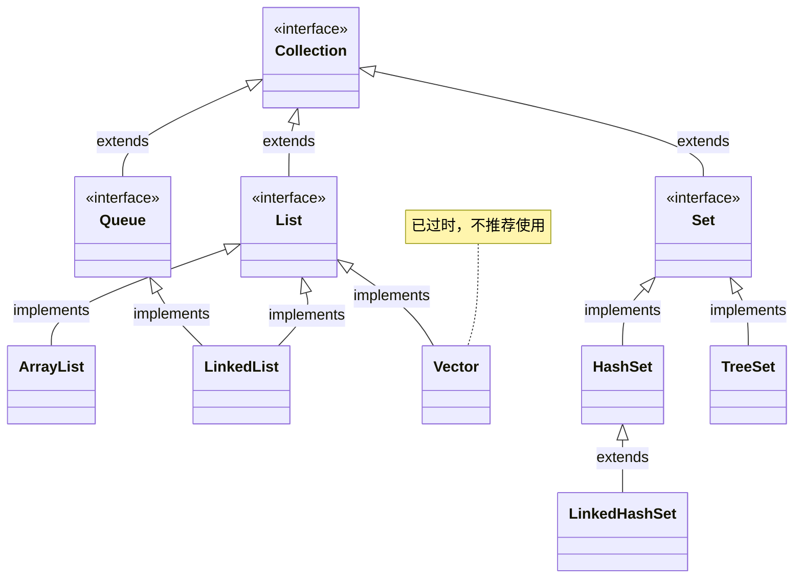
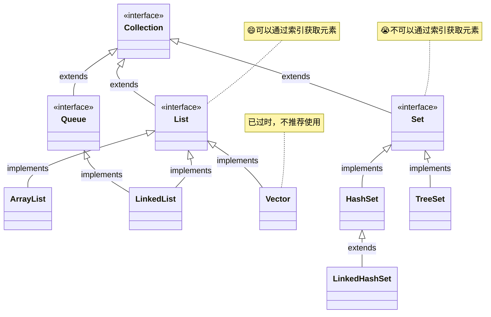
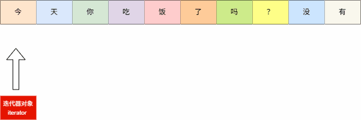

# 第一章：集合体系结构

## 1.1 概述

* 集合是 Java 提供的一种容器，可以用来存储多个数据。集合的本质是用来`存储对象`。

> [!NOTE]
>
> * 【问】：集合只能用来存储对象？为什么也可以存储基本数据类型？
> * 【答】：在 JDK5 的时候，新增了一个特性：自动装箱和自动拆箱。换言之，向集合中添加基本类型数据的时候，会先转换为对应的包装类型对象，然后在进行存储。

* 集合和数组都是容器，它们之间的区别？
  * ① 数组的长度是固定的，集合的长度是可变的。
  * ② 数组中可以存储基本类型的数据，也可以存储对象；但是，集合中只能存储对象。

## 1.2 集合体系结构

* Java 中的集合主要分为两大类：
  * ① Collection（单列集合）：在添加数据的时候，一次只能添加一个数据，如：`脉动`、`康师傅`、`奥利奥`等。
  * ② Map（双列集合）：在添加数据的时候，一次需要添加一对数据，如：`脉动:5元`、`康师傅:12元`、`奥利奥:8.5元`，


* Java 集合框架图，如下所示：

> [!NOTE]
>
> * ① List 系列集合：添加的元素是有序、可重复、有索引。
>   * 有序：`存`和`取`的顺序是一样的，如：存数据是`张三、李四、王五`，那么取数据也是`张三、李四、王五`；和之前学习的`排序`（从小到大或从大到小）没有任何关系。
>   * 可重复：集合存储的元素是可以重复的。
>   * 有索引：可以通过索引去获取集合中的元素。
> * ② Set 系列集合：添加的元素是无序、不重复、无索引。
>   * 无序：`存`和`取`的顺序有可能是不一样，如：存数据是`张三、李四、王五`，那么取数据可能是`张三、王五、李四`。
>   * 不重复：集合存储的元素是不可以重复的。
>   * 无索引：不可以通过索引去获取集合中的元素。


# 第二章：Collection 接口（⭐）

## 2.1 概述

* Collection 接口是 List、Set 接口的父接口，该接口中定义的方法既可以用于操作 List 集合，也可以用于操作 Set 集合。

> [!NOTE]
>
> JDK 不提供此接口的任何直接实现，而是提供更具体的子接口（如：List 、Set 等）实现。



* 由于 JDK 5 增加了 `泛型` 特性，使得 Java 集合可以记住容器中对象的数据类型。

```java
public interface Collection<E> extends Iterable<E> {
    ...
}
```

## 2.2 常用 API

### 2.2.1 添加元素

* 添加元素对象到当前集合中：

```java
boolean add(E e);
```

* 添加另一个集合中的所有元素到当前集合中：

```java
boolean addAll(Collection<? extends E> c);
```

> [!NOTE]
>
> * ① 当我们向 List 系列集合添加元素的时候，方法永远返回 true ，因为 List 系列集合是允许元素重复的。
> * ② 当我们向 Set 系列集合添加元素的时候，如果要添加的元素在集合中不存在，方法返回 true ，表示添加成功；如果要添加的元素在集合中已经存在，方法返回 false，表示添加失败，因为 Set 系列集合是不允许元素重复的。
> * ③ 在实际开发中，我们通常不会关心`add()`方法或`addAll()`方法的返回值。


* 示例：

```java
package com.github.collecton;

import java.util.ArrayList;
import java.util.Collection;

public class Test {
    public static void main(String[] args) {
        // 创建集合
        Collection<Integer> coll = new ArrayList<>();
        // 添加元素
        coll.add(1);
        coll.add(2);
        coll.add(3);
        coll.add(4);
        coll.add(5);
        // 打印集合中的元素
        System.out.println(coll); // [1, 2, 3, 4, 5]
    }
}
```


* 示例：

```java
package com.github.collecton;

import java.util.ArrayList;
import java.util.Collection;
import java.util.List;

public class Test {
    public static void main(String[] args) {
        // 创建另一个集合
        List<Integer> list = List.of(1, 2, 3, 4, 5);
        // 创建集合
        Collection<Integer> coll = new ArrayList<>();
        // 给集合添加元素
        coll.add(11);
        coll.add(22);
        coll.add(33);
        // 添加另一个集合中的所有元素到本集合中
        coll.addAll(list);
        // 打印集合中的元素
        System.out.println(coll); // [11, 22, 33, 1, 2, 3, 4, 5]
    }
}
```

### 2.2.2 删除元素

* 从当前集合中删除第一个和 obj 对象匹配（调用 equals() 方法）的元素：

```java
boolean remove(Object o);
```

* 从当前集合中删除所有与 c 集合中相同的元素，即：求差集：

```java
boolean removeAll(Collection<?> c);
```

* 删除满足指定条件的集合中所有元素：

```java
default boolean removeIf(Predicate<? super E> filter) {
    Objects.requireNonNull(filter);
    boolean removed = false;
    final Iterator<E> each = iterator();
    while (each.hasNext()) {
        if (filter.test(each.next())) {
            each.remove();
            removed = true;
        }
    }
    return removed;
}
```


* 示例：

```java
package com.github.collecton;

import java.util.ArrayList;
import java.util.Collection;

public class Test {
    public static void main(String[] args) {
        Collection<String> c1 = new ArrayList<>();
        c1.add("aa");
        c1.add("bb");
        c1.add("cc");
        System.out.println("c1 = " + c1); // c1 = [aa, bb, cc]
        // 删除
        c1.remove("cc");
        System.out.println("c1 = " + c1); // c1 = [aa, bb]

    }
}
```


* 示例：

```java
package com.github.collecton;

import java.util.ArrayList;
import java.util.Collection;

public class Test {
    public static void main(String[] args) {
        Collection<String> c1 = new ArrayList<>();
        c1.add("aa");
        c1.add("bb");
        c1.add("cc");

        Collection<String> c2 = new ArrayList<>();
        c2.add("ee");
        c2.add("ff");

        c1.addAll(c2);

        System.out.println("c1 = " + c1); // c1 = [aa, bb, cc, ee, ff]

        // 求差集
        c1.removeAll(c2);

        System.out.println("c1 = " + c1); // c1 = [aa, bb, cc]

    }
}
```


* 示例：

```java
package com.github.collecton;

import java.util.ArrayList;
import java.util.Collection;

public class Test {
    public static void main(String[] args) {
        Collection<Integer> c1 = new ArrayList<>();

        c1.add(1);
        c1.add(2);
        c1.add(3);
        c1.add(4);
        c1.add(5);

        System.out.println("c1 = " + c1); // c1 = [1, 2, 3, 4, 5]

        // 从集合中删除所有偶数
        c1.removeIf(x -> x % 2 == 0);

        System.out.println("c1 = " + c1); // c1 = [1, 3, 5]
    }
}
```

### 2.2.3 清空集合

* 清空集合，即：将集合中的所有元素删除：

```java
void clear();
```


* 示例：

```java
package com.github.collecton;

import java.util.ArrayList;
import java.util.Collection;

public class Test {
    public static void main(String[] args) {
        Collection<String> c1 = new ArrayList<>();
        c1.add("aa");
        c1.add("bb");
        c1.add("cc");

        System.out.println("c1 = " + c1); // c1 = [aa, bb, cc]

        // 清空集合
        c1.clear();

        System.out.println("c1 = " + c1); // c1 = []

    }
}
```

### 2.2.4 判断

* 判断当前集合是否是空集合（没有任何元素）：

```java
boolean isEmpty();
```

* 判断当前集合是否包含指定的元素（底层会调用 o 对象的 equals() 方法）：

```java
boolean contains(Object o);
```

* 判断 c 集合中的元素是否都在当前集合中存在，即：c 集合是否是当前集合的子集：

```java
boolean containsAll(Collection<?> c);
```


* 示例：

```java
package com.github.collecton;

import java.util.ArrayList;
import java.util.Collection;

public class Test {
    public static void main(String[] args) {
        Collection<Integer> c1 = new ArrayList<>();

        c1.add(1);
        c1.add(2);
        c1.add(3);
        c1.add(4);
        c1.add(5);

        System.out.println(c1.isEmpty()); // false

        Collection<Integer> c2 = new ArrayList<>();

        System.out.println(c2.isEmpty()); // true
    }
}
```


* 示例：

```java
package com.github.collecton;

import java.util.ArrayList;
import java.util.Collection;

public class Test {
    public static void main(String[] args) {
        Collection<String> c1 = new ArrayList<>();
        c1.add("aa");
        c1.add("bb");
        c1.add("cc");
        c1.add("dd");

        System.out.println("c1 = " + c1.contains("aa")); // c1 = true
        System.out.println("c1 = " + c1.contains("aaa")); // c1 = false
    }
}
```


* 示例：

```java
package com.github.collecton;

import java.util.ArrayList;
import java.util.Collection;

public class Test {
    public static void main(String[] args) {
        Collection<String> c1 = new ArrayList<>();
        c1.add("aa");
        c1.add("bb");
        c1.add("cc");
        c1.add("dd");

        Collection<String> c2 = new ArrayList<>();
        c2.add("aa");
        c2.add("bb");
        c2.add("ee");

        // c1.containsAll(c2) = false
        System.out.println("c1.containsAll(c2) = " + c1.containsAll(c2));

        Collection<String> c3 = new ArrayList<>();
        c3.add("aa");
        c3.add("bb");

        // c1.containsAll(c3) = true
        System.out.println("c1.containsAll(c3) = " + c1.containsAll(c3));
    }
}
```

### 2.2.5 获取集合中元素的个数

* 获取当前集合中实际存储的元素个数：

```java
int size();
```


* 示例：

```java
package com.github.collecton;

import java.util.ArrayList;
import java.util.Collection;

public class Test {
    public static void main(String[] args) {
        Collection<String> c1 = new ArrayList<>();
        c1.add("aa");
        c1.add("bb");
        c1.add("cc");
        c1.add("dd");

        System.out.println("c1.size() = " + c1.size()); // c1.size() = 4

        c1.clear();

        System.out.println("c1.size() = " + c1.size()); // c1.size() = 0
    }
}

```

### 2.2.6 交集

* 当前集合仅保留与 c 集合中的元素相同的元素，即当前集合中仅保留两个集合的交集：

```java
boolean retainAll(Collection<?> c);
```


* 示例：

```java
package com.github.collecton;

import java.util.ArrayList;
import java.util.Collection;

public class Test {
    public static void main(String[] args) {
        Collection<String> c1 = new ArrayList<>();
        c1.add("aa");
        c1.add("bb");
        c1.add("cc");
        c1.add("dd");

        System.out.println("c1 = " + c1); // c1 = [aa, bb, cc, dd]

        Collection<String> c2 = new ArrayList<>();
        c2.add("bb");

        System.out.println("c2 = " + c2); // c2 = [bb]

        c1.retainAll(c2);

        System.out.println("c1 = " + c1); // c1 = [bb]
    }
}
```

### 2.2.7 转数组

* 将当前集合中的所有元素转换为 Object 数组：

```java
Object[] toArray();
```

* 将当前集合中的所有元素转换为对应元素类型的数组（需要自己传递数组的长度）：

```java
<T> T[] toArray(T[] a);
```

* 将当前集合中的所有元素转换为对应元素类型的数组（推荐）：

```java
default <T> T[] toArray(IntFunction<T[]> generator) {
    return toArray(generator.apply(0));
}
```


* 示例：

```java
package com.github.collecton;

import java.util.ArrayList;
import java.util.Arrays;
import java.util.Collection;

public class Test {
    public static void main(String[] args) {
        Collection<String> c1 = new ArrayList<>();
        c1.add("aa");
        c1.add("bb");
        c1.add("cc");
        c1.add("dd");

        // 将集合中的所有元素转换为 Object 数组
        Object[] arr = c1.toArray();

        System.out.println(Arrays.toString(arr)); // [aa, bb, cc, dd]
    }
}
```


* 示例：

```java
package com.github.collecton;

import java.util.ArrayList;
import java.util.Arrays;
import java.util.Collection;

public class Test {
    public static void main(String[] args) {
        Collection<String> c1 = new ArrayList<>();
        c1.add("aa");
        c1.add("bb");
        c1.add("cc");
        c1.add("dd");

        // 将集合中的所有元素转换为 String 数组
        String[] arr = c1.toArray(new String[c1.size()]);

        System.out.println(Arrays.toString(arr)); // [aa, bb, cc, dd]
    }
}
```


* 示例：

```java
package com.github.collecton;

import java.util.ArrayList;
import java.util.Arrays;
import java.util.Collection;

public class Test {
    public static void main(String[] args) {
        Collection<String> c1 = new ArrayList<>();
        c1.add("aa");
        c1.add("bb");
        c1.add("cc");
        c1.add("dd");
        c1.add("ee");

        // 将集合中的所有元素转换为 String 数组
        String[] arr = c1.toArray(String[]::new);

        System.out.println(Arrays.toString(arr)); // [aa, bb, cc, dd, ee]
    }
}
```


# 第三章：Collection 遍历方式（⭐）

## 3.1 概述

* Collection 集合没有普通的 for 循环遍历，是因为 Collection 集合是单列集合的顶层接口，其子接口 Set 是不可以通过索引来获取元素的。



* 为了程序的通用性，Collection 集合提供了三种遍历方式：
  * ① 迭代器遍历。
  * ② 增强 for 遍历。
  * ③ Lambda 表达式遍历。

## 3.2 迭代器遍历

### 3.2.1 概述

* 我们可以通过`迭代器对象`，将集合中的元素依次获取出来，如下所示：



### 3.2.2 Iterator 接口

* Iterator 接口也是 Java 集合中的一员，但是它和 Collection 接口以及 Map 接口有所不同：
  * Collection 接口和 Map 接口主要用来存储元素。
  * Iterator 接口主要用来迭代访问，即：遍历 Collection 集合或 Map 集合中的元素。

> [!CAUTION]
>
> Iterator 接口的对象，即：Iterator 对象称为迭代器。

* Collection 接口获取迭代器：

| 方法                      | 描述                                                  |
| ------------------------- | ----------------------------------------------------- |
| `Iterator<E> iterator();` | 返回迭代器对象（创建指针），默认指向集合索引 0 的位置 |

* Iterator 接口的常用方法：

| 方法                 | 描述                             |
| -------------------- | -------------------------------- |
| `boolean hasNext();` | 判断当前位置是否有元素           |
| `E next();`          | 获取当前位置上的元素，并移动指针 |

* 迭代器的内存示意图，如下所示：


* 示例：

```java
package com.github.collection;

import java.util.ArrayList;
import java.util.Collection;
import java.util.Iterator;

public class Test {
    public static void main(String[] args) {
        // 创建集合对象
        Collection<String> col = new ArrayList<>();
        // 向集合中添加元素
        col.add("aa");
        col.add("bb");
        col.add("cc");
        col.add("dd");
        // 获取迭代器对象，默认指向集合的 0 索引处
        Iterator<String> iterator = col.iterator();
        // 利用循环不断地去获取集合中的每一个元素
        while (iterator.hasNext()) {
            String next = iterator.next();
            System.out.println("next = " + next);
        }
    }
}
```


* 示例：

```java
package com.github.collection;

import java.util.ArrayList;
import java.util.Collection;
import java.util.Iterator;

public class Test {
    public static void main(String[] args) {
        // 创建集合对象
        Collection<String> col = new ArrayList<>();
        // 向集合中添加元素
        col.add("aa");
        col.add("bb");
        col.add("cc");
        col.add("dd");
        // 使用 for 循环来改写 while 循环
        for (Iterator<String> iterator = col.iterator(); iterator.hasNext(); ) {
            String next = iterator.next();
            System.out.println("next = " + next);
        }
    }
}
```

### 3.2.3 迭代器的实现原理

* 在 Collection 接口中提供了获取 Iterator 接口的方法：

```java
public interface Collection<E> extends Iterable<E> {
    
    Iterator<E> iterator();
    
    ...
}
```

* 实现 Collection 接口或子接口的实现类都必须实现该方法，以 ArrayList 为例：

```java
public class ArrayList<E> extends AbstractList<E>
        implements List<E>, RandomAccess, Cloneable, java.io.Serializable {
    
	public Iterator<E> iterator() {
        return new Itr();
    }
    
    private class Itr implements Iterator<E> {
        int cursor;       // index of next element to return
        int lastRet = -1; // index of last element returned; -1 if no such
        int expectedModCount = modCount;

        // prevent creating a synthetic constructor
        Itr() {}

        public boolean hasNext() {
            return cursor != size;
        }

        @SuppressWarnings("unchecked")
        public E next() {
            checkForComodification();
            int i = cursor;
            if (i >= size)
                throw new NoSuchElementException();
            Object[] elementData = ArrayList.this.elementData;
            if (i >= elementData.length)
                throw new ConcurrentModificationException();
            cursor = i + 1;
            return (E) elementData[lastRet = i];
        }

        public void remove() {
            if (lastRet < 0)
                throw new IllegalStateException();
            checkForComodification();

            try {
                ArrayList.this.remove(lastRet);
                cursor = lastRet;
                lastRet = -1;
                expectedModCount = modCount;
            } catch (IndexOutOfBoundsException ex) {
                throw new ConcurrentModificationException();
            }
        }

        @Override
        public void forEachRemaining(Consumer<? super E> action) {
            Objects.requireNonNull(action);
            final int size = ArrayList.this.size;
            int i = cursor;
            if (i < size) {
                final Object[] es = elementData;
                if (i >= es.length)
                    throw new ConcurrentModificationException();
                for (; i < size && modCount == expectedModCount; i++)
                    action.accept(elementAt(es, i));
                // update once at end to reduce heap write traffic
                cursor = i;
                lastRet = i - 1;
                checkForComodification();
            }
        }

        final void checkForComodification() {
            if (modCount != expectedModCount)
                throw new ConcurrentModificationException();
        }
    }
    
    ...
}    
```

### 3.2.4 迭代器的细节

#### 3.2.4.1 NoSuchElementException 异常

* 当迭代器的指针已经指向了最后没有元素的位置，如果还强行调用 next() 方法，方法内部将会抛出 java.util.NoSuchElementException 异常，如下所示：


* 示例：

```java
package com.github.collection;

import java.util.ArrayList;
import java.util.Collection;
import java.util.Iterator;

public class Test {
    public static void main(String[] args) {
        // 创建集合对象
        Collection<String> col = new ArrayList<>();
        // 向集合中添加元素
        col.add("aa");
        col.add("bb");
        col.add("cc");
        col.add("dd");
        // 获取迭代器对象，默认指向集合的 0 索引处
        Iterator<String> iterator = col.iterator();
        // 利用循环不断地去获取集合中的每一个元素
        while (iterator.hasNext()) {
            String next = iterator.next();
            System.out.println("next = " + next);
        }

        // ❌ 错误：会抛出 java.util.NoSuchElementException 异常
        String next = iterator.next(); // [!code error]
        System.out.println("next = " + next);
    }
}
```

#### 3.2.4.2 迭代器指针不会复位

* 当迭代器遍历完毕之后，指针不会复位。换言之，如果还想使用迭代器遍历，需要获取一个新的迭代器。

> [!NOTE]
>
> 推荐使用 for 循环来代替 while 循环，因为 for 循环对于初始化变量有作用域！！！


* 示例：

```java
package com.github.collection;

import java.util.ArrayList;
import java.util.Collection;
import java.util.Iterator;

public class Test {
    public static void main(String[] args) {
        // 创建集合对象
        Collection<String> col = new ArrayList<>();
        // 向集合中添加元素
        col.add("aa");
        col.add("bb");
        col.add("cc");
        col.add("dd");
        // 获取迭代器对象，默认指向集合的 0 索引处
        Iterator<String> iterator = col.iterator();
        // 利用循环不断地去获取集合中的每一个元素
        while (iterator.hasNext()) {
            String next = iterator.next();
            System.out.println("next = " + next);
        }

        // 获取一个新的迭代器对象
        iterator = col.iterator(); // [!code highlight]
        // 利用循环不断地去获取集合中的每一个元素
        while (iterator.hasNext()) {
            String next = iterator.next();
            System.out.println("next = " + next);
        }
    }
}
```


* 示例：

```java {17,22}
package com.github.collection;

import java.util.ArrayList;
import java.util.Collection;
import java.util.Iterator;

public class Test {
    public static void main(String[] args) {
        // 创建集合对象
        Collection<String> col = new ArrayList<>();
        // 向集合中添加元素
        col.add("aa");
        col.add("bb");
        col.add("cc");
        col.add("dd");
        // 使用 for 循环来改写 while 循环
        for (Iterator<String> iterator = col.iterator(); iterator.hasNext(); ) {
            String next = iterator.next();
            System.out.println("next = " + next);
        }
        // 使用 for 循环来改写 while 循环
        for (Iterator<String> iterator = col.iterator(); iterator.hasNext(); ) {
            String next = iterator.next();
            System.out.println("next = " + next);
        }
    }
}
```

#### 3.2.4.3 循环中只能使用一次 next 方法

* next 方法的作用，如下所示：
  * ① 获取元素。
  * ② 移动指针。
* 如果在循环中调用了两次 next 方法，将会使得指针移动两次，可能会导致方法抛出 java.util.NoSuchElementException 异常。


* 示例：

```java
package com.github.collection;

import java.util.ArrayList;
import java.util.Collection;
import java.util.Iterator;

public class Test {
    public static void main(String[] args) {
        // 创建集合对象
        Collection<String> col = new ArrayList<>();
        // 向集合中添加元素
        col.add("aa");
        col.add("bb");
        col.add("cc");
        col.add("dd");
        col.add("ee");
        // 遍历集合中的元素
        Iterator<String> iterator = col.iterator();
        while (iterator.hasNext()) {
            String next = iterator.next();
            System.out.println(next);
            // ❌ 错误：会抛出 java.util.NoSuchElementException 异常
            next = iterator.next(); // [!code error]
            System.out.println(next);
        }
    }
}
```

#### 3.2.4.4 使用 Iterator 接口的删除方法

* Iterator 接口提供了删除的方法：

```java
default void remove() {
    throw new UnsupportedOperationException("remove");
}
```

* 其实现类中实现了该方法，如下所示：

```java {33-46}
public class ArrayList<E> extends AbstractList<E>
        implements List<E>, RandomAccess, Cloneable, java.io.Serializable {
    
	public Iterator<E> iterator() {
        return new Itr();
    }
    
    private class Itr implements Iterator<E> {
        int cursor;       // index of next element to return
        int lastRet = -1; // index of last element returned; -1 if no such
        int expectedModCount = modCount;

        // prevent creating a synthetic constructor
        Itr() {}

        public boolean hasNext() {
            return cursor != size;
        }

        @SuppressWarnings("unchecked")
        public E next() {
            checkForComodification();
            int i = cursor;
            if (i >= size)
                throw new NoSuchElementException();
            Object[] elementData = ArrayList.this.elementData;
            if (i >= elementData.length)
                throw new ConcurrentModificationException();
            cursor = i + 1;
            return (E) elementData[lastRet = i];
        }

        public void remove() { 
            if (lastRet < 0)
                throw new IllegalStateException();
            checkForComodification();

            try {
                ArrayList.this.remove(lastRet);
                cursor = lastRet;
                lastRet = -1;
                expectedModCount = modCount;
            } catch (IndexOutOfBoundsException ex) {
                throw new ConcurrentModificationException();
            }
        }

        @Override
        public void forEachRemaining(Consumer<? super E> action) {
            Objects.requireNonNull(action);
            final int size = ArrayList.this.size;
            int i = cursor;
            if (i < size) {
                final Object[] es = elementData;
                if (i >= es.length)
                    throw new ConcurrentModificationException();
                for (; i < size && modCount == expectedModCount; i++)
                    action.accept(elementAt(es, i));
                // update once at end to reduce heap write traffic
                cursor = i;
                lastRet = i - 1;
                checkForComodification();
            }
        }

        final void checkForComodification() {
            if (modCount != expectedModCount)
                throw new ConcurrentModificationException();
        }
    }
    
    ...
}    
```

> [!CAUTION]
>
> * ① 在使用迭代器遍历集合元素的时候，如果调用 Collection 的 remove() 方法，将会抛出 java.util.ConcurrentModificationException 异常或出现其他不确定的行为。
> * ② 在使用迭代器遍历集合元素的时候，如果要删除元素，使用迭代器的 remove() 方法。


* 示例：

```java
package com.github.collection;

import java.util.ArrayList;
import java.util.Collection;
import java.util.Iterator;

public class Test {
    public static void main(String[] args) {
        // 创建集合对象
        Collection<String> col = new ArrayList<>();
        // 向集合中添加元素
        col.add("aa");
        col.add("bb");
        col.add("cc");
        col.add("dd");
        col.add("ee");
        // 遍历集合中的元素
        Iterator<String> iterator = col.iterator();
        while (iterator.hasNext()) {
            String next = iterator.next();
            if (next.equals("aa")) {
                // ❌ 错误：会抛出 java.util.ConcurrentModificationException  异常
                col.remove("aa"); // [!code error] 
            } else {
                System.out.println(next);
            }
        }
    }
}
```


* 示例：

```java
package com.github.collection;

import java.util.ArrayList;
import java.util.Collection;
import java.util.Iterator;

public class Test {
    public static void main(String[] args) {
        // 创建集合对象
        Collection<String> col = new ArrayList<>();
        // 向集合中添加元素
        col.add("aa");
        col.add("bb");
        col.add("cc");
        col.add("dd");
        col.add("ee");
        // 遍历集合中的元素
        Iterator<String> iterator = col.iterator();
        while (iterator.hasNext()) {
            String next = iterator.next();
            if (next.equals("aa")) {
                // ✅ 使用了 iterator 的 remove 方法
                iterator.remove(); // [!code highlight]
            } else {
                System.out.println(next);
            }
        }
    }
}

```

## 3.3 增强 for 遍历


## 3.4 Lambda 表达式遍历

