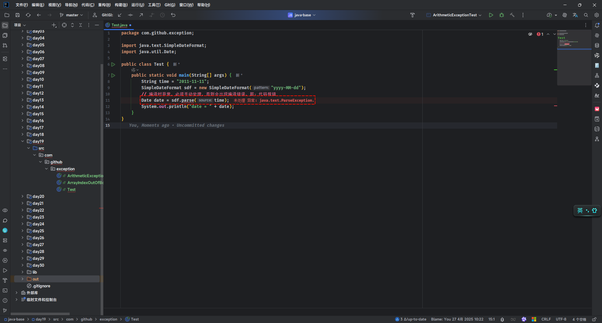
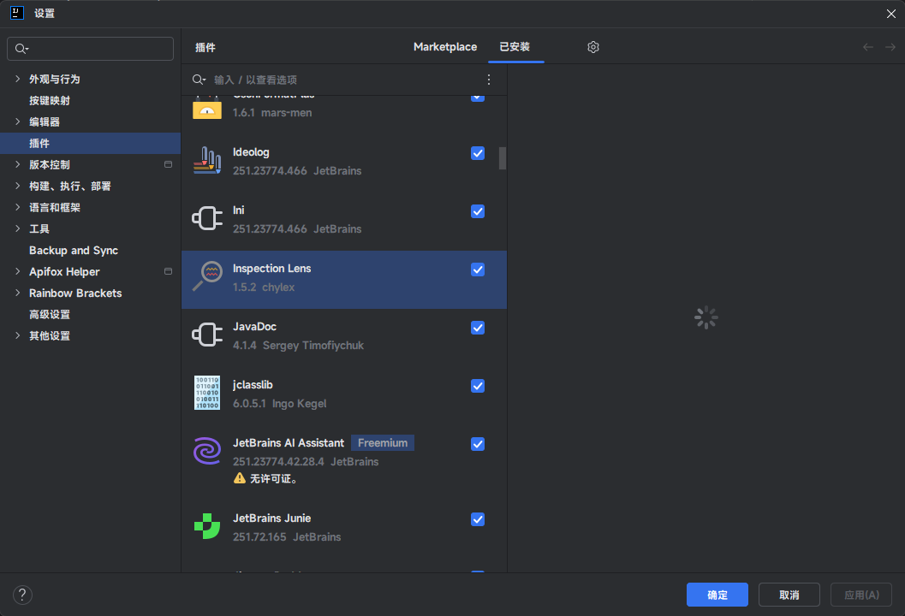
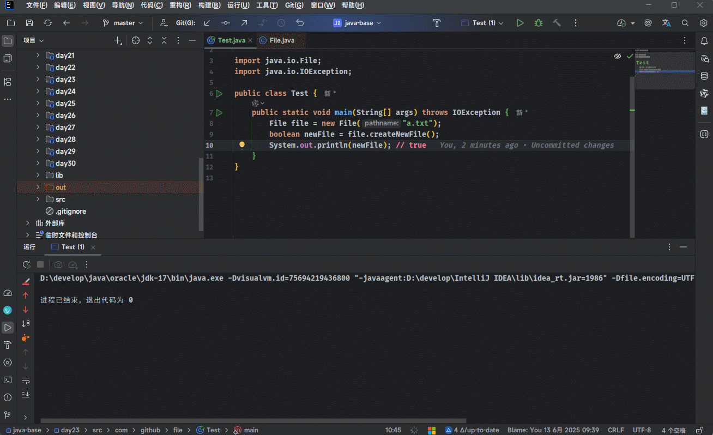

# 第一章：前言

## 1.1 为什么要学习 File 和 IO 流？

* 假设我们现在正在玩《黑悟空》游戏：


* 突然，这个时候，我们需要上厕所（很急）：

> [!NOTE]
>
> 网络烂梗：我知道你很急，但你先别急；我都不急，你急什么？


* 此时，我们非常希望能将当前游戏的进度保存下来，以便下次读档继续玩（不想从头再玩）：



* 这个背后就涉及到了两个知识点：
  * 文件在哪里（文件的位置）？
  * 如何传输数据（如何将数据保存到文件中，如何从文件中读取数据）？

> [!NOTE]
>
> * ① 在 Java 中，如何传输数据，需要使用 IO 流技术（存储和读取数据的解决方案）。
> * ② 在 Java 中，文件的位置（文件的路径），需要使用到 File 类。



## 1.2 学习 File 和 IO 流的意义

* ① `程序与外部数据的交互`：程序的运行往往需要依赖外部数据（用户输入、配置文件、日志文件等），而 IO 操作是程序读取和写入这些数据的唯一途径。
* ② `持久化存储`：程序运行时的数据通常存储在内存中，但断电或程序关闭后会丢失。通过 IO 操作将数据写入文件或数据库，可以实现数据的持久化存储。
* ③ `系统功能的基础`：许多系统级功能（日志记录、文件管理、网络通信）都依赖 IO 操作，如：Web 服务器需要读取静态文件、接收客户端请求并返回响应。
* ④ `提升程序的灵活性和可维护性`：通过读取配置文件或命令行参数，程序可以在不修改代码的情况下调整行为，从而提高灵活性和可维护性。


# 第二章：File（⭐）

## 2.1 概述

* FIle 类的对象就表示一个路径，可以是`文件`的路径，也可以是`目录`的路径。

> [!NOTE]
>
> * ① File 类是用于操作`本地文件系统`的资源（文件或目录），即：只能处理 `file://` 协议的 URI。
> * ② File 类并不能处理网络上的资源，如：`https://xxx`。

* File 类的对象表示的路径，可以是存在的，也可以是不存在的。

## 2.2 创建 File 对象

* File 类提供了一系列的重载构造方法用于创建 File 对象：

| 构造方法                                    | 说明                                               |
| ------------------------------------------- | -------------------------------------------------- |
| `public File(String pathname){}`            | 根据文件路径创建 File 对象                         |
| `public File(File parent,String child){}`   | 根据父路径对应的文件对象和子路径字符串创建文件对象 |
| `public File(String parent,String child){}` | 根据父路径字符串和子路径字符串创建文件对象         |

> [!NOTE]
>
> * ① 之所以创建 File 对象，是因为 File 对象身上有我们想要的方法。
> * ② 对于 Java 而言，字符串路径仅仅只是字符串而已（和 "abc" 没什么区别），不能和本地文件系统上的文件产生联系！！！
> * ③ 对于 Java 而言，只有将字符串路径转换为 File 对象之后，此时的字符串路径才是真实的文件路径。


* 示例：

```java
package com.github.file;

import java.io.File;

public class Test {
    public static void main(String[] args) {

        // 字符串路径
        String pathName = "D:\\develop\\apache-maven-3.9.9\\README.txt";

        // 将字符串表示的路径，变为 File 对象
        File file = new File(pathName);

        System.out.println(file);
    }
}
```


* 示例：

```java
package com.github.file;

import java.io.File;

public class Test {
    public static void main(String[] args) {

        /* 字符串路径 */
        // 父路径
        String parentPath = "D:\\develop\\apache-maven-3.9.9";
        // 子路径
        String child = "README.txt";

        // 将字符串表示的路径，变为 File 对象
        File file = new File(parentPath, child);

        System.out.println(file);
    }
}
```


* 示例：

```java
package com.github.file;

import java.io.File;

public class Test {
    public static void main(String[] args) {

        /* 字符串路径 */
        // 父路径
        String parentPath = "D:\\develop\\apache-maven-3.9.9";
        // 子路径
        String child = "README.txt";

        // 将字符串表示的路径，变为 File 对象
        File file = new File(new File(parentPath), child);

        System.out.println(file);
    }
}
```

## 2.3 常用 API

### 2.3.1 判断系列

* 判断 File 对象表示的文件（目录）是否可读、可写、可执行：

```java
public boolean canRead() {}
```

```java
public boolean canWrite() {}
```

```java
public boolean canExecute() {}
```

* 判断 File 对象表示的文件（目录）是否是文件还是目录：

```java
public boolean isFile() {}
```

```java
public boolean isDirectory() {}
```

* 判断 File 对象表示的文件（目录）是否存在：

```java
public boolean exists() {}
```


* 示例：

```java
package com.github.file;

import java.io.File;

public class Test {
    public static void main(String[] args) {
        /* 字符串路径 */
        String parentPath = "D:\\develop\\apache-maven-3.9.9";
        String child = "README.txt";

        // 将字符串表示的路径，变为 File 对象
        File file = new File(new File(parentPath), child);

        // 判断系列的方法
        System.out.println(file.canRead()); // true
        System.out.println(file.canWrite()); // true
        System.out.println(file.canExecute()); // true
        System.out.println("--------------------------");
        System.out.println(file.isFile()); // true
        System.out.println(file.isDirectory()); // false
        System.out.println("--------------------------");
        System.out.println(file.exists()); // true
    }
}
```

### 2.3.2 获取系列

* 获取文件的大小：

```java
public long length() {}
```

> [!NOTE]
>
> * ① 该方法只能获取单个文件的大小（单位是 B（字节）），不能获取文件夹的大小。
> * ② 如果想要获取文件夹的大小，需要遍历文件夹下的所有文件，并就每个文件的大小累加起来。

* 获取文件或目录的绝对路径：

```java
public String getAbsolutePath() {}
```

* 获取构造方法中的路径（没什么用）：

```java
public String getPath() {}
```

* 获取名称：

```java
public String getName() {}
```

> [!NOTE]
>
> * ① 如果是文件，包含文件名（`README`）和后缀名（`.md`），即：`README.md`。
> * ② 如果是目录，就是目录名。

* 获取文件最后修改时间（毫秒值）：

```java
public long lastModified() {}
```


* 示例：

```java
package com.github.file;

import java.io.File;

public class Test {
    public static void main(String[] args) {
        /* 字符串路径 */
        String parentPath = "D:\\develop\\apache-maven-3.9.9";
        String child = "README.txt";

        // 将字符串表示的路径，变为 File 对象
        File file = new File(new File(parentPath), child);

        // 获取系列方法
        // 只能获取单个文件的大小，单位是 B（字节）
        System.out.println(file.length()); // 1279
        // 不能获取文件夹的大小，不同操作系统上的行为可能不一致
        System.out.println(new File(parentPath).length()); // 4096
    }
}
```


* 示例：

```java
package com.github.file;

import java.io.File;

public class Test {
    public static void main(String[] args) {
        /* 字符串路径 */
        String parentPath = "D:\\develop\\apache-maven-3.9.9";
        String child = "README.txt";

        // 将字符串表示的路径，变为 File 对象
        File file = new File(new File(parentPath), child);

        // 获取系列方法 
        // 可以获取文件的绝对路径  D:\develop\apache-maven-3.9.9\README.txt
        System.out.println(file.getAbsolutePath()); 
        // 可以获取目录的绝对路径 D:\develop\apache-maven-3.9.9
        System.out.println(new File(parentPath).getAbsolutePath());
    }
}
```


* 示例：

```java
package com.github.file;

import java.io.File;

public class Test {
    public static void main(String[] args) {
        /* 字符串路径 */
        String parentPath = "D:\\develop\\apache-maven-3.9.9";
        String child = "README.txt";

        // 将字符串表示的路径，变为 File 对象
        File file = new File(new File(parentPath), child);

        // 获取系列方法
        // 获取构造方法中的路径 D:\develop\apache-maven-3.9.9\README.txt
        System.out.println(file.getPath());
        // 获取构造方法中的路径 D:\develop\apache-maven-3.9.9
        System.out.println(new File(parentPath).getPath()); // apache-maven-3.9.9
    }
}
```


* 示例：

```java
package com.github.file;

import java.io.File;

public class Test {
    public static void main(String[] args) {
        /* 字符串路径 */
        String parentPath = "D:\\develop\\apache-maven-3.9.9";
        String child = "README.txt";

        // 将字符串表示的路径，变为 File 对象
        File file = new File(new File(parentPath), child);

        // 获取系列方法
        // 可以获取名称，如果是文件，就包括文件名和后缀名
        System.out.println(file.getName()); // README.txt
        // 可以获取名称，如果是目录，就是目录名
        System.out.println(new File(parentPath).getName()); // apache-maven-3.9.9
    }
}
```


* 示例：

```java
package com.github.file;

import java.io.File;
import java.time.Instant;
import java.time.LocalDateTime;
import java.time.ZoneId;
import java.time.format.DateTimeFormatter;

public class Test {

    static DateTimeFormatter df = DateTimeFormatter.ofPattern("yyyy-MM-dd HH:mm:ss");

    public static void main(String[] args) {
        /* 字符串路径 */
        String parentPath = "D:\\develop\\apache-maven-3.9.9";
        String child = "README.txt";

        // 将字符串表示的路径，变为 File 对象
        File file = new File(new File(parentPath), child);

        // 获取系列方法
        System.out.println(file.lastModified()); // 1723596528000
        final LocalDateTime localDateTime = LocalDateTime.ofInstant(
            Instant.ofEpochMilli(file.lastModified()), ZoneId.systemDefault());
        System.out.println(df.format(localDateTime)); // 2024-08-14 08:48:48
    }
}
```

### 2.3.3 创建系列

* 创建一个空的文件：

```java
public boolean createNewFile() throws IOException {}
```

> [!NOTE]
>
> * ① 细节 1：
>   * 如果当前路径表示的文件是不存在的，则创建成功，返回 true 。
>   * 如果当前路径表示的文件是存在的，则创建失败，返回 false。
>   * 在实际开发中，我们并不会关心，该方法的返回值！！！
> * ② 细节 2：如果当前路径的父路径是不存在的，方法会抛出 IOException 异常。
> * ③ 细节 3：该方法只能创建文件，不能创建文件夹；如果路径中不包含后缀名，那么创建的就是一个没有后缀名的文件。


* 示例：如果当前路径表示的文件是不存在的，则创建成功，返回 true


::: code-group

```java [Test.java]
package com.github.file;

import java.io.File;
import java.io.IOException;

public class Test {
    public static void main(String[] args) throws IOException {
        File file = new File("a.txt");
        boolean newFile = file.createNewFile();
        System.out.println(newFile); // true
    }
}
```

```md:img [cmd 控制台]

```

:::


### 2.3.4 删除系列


### 2.3.5 获取并遍历系列


## 2.4 综合练习

```java
package com.github.collection3;

import java.io.File;
import java.util.HashMap;
import java.util.Map;
import java.util.Objects;

public class Test {

    public static void main(String[] args) {
        File src = new File("D:\\src");
        long total = getLen(src);
        System.out.println("文件大小为: " + total);

        Map<String, Long> map = analyze(src);
        map.forEach((k, v) -> System.out.println(k + ": " + v));

    }

    public static Long getLen(File src) {
        Long total = 0L;
        File[] files = src.listFiles();
        for (File file : Objects.requireNonNullElse(files, new File[0])) {
            if (file.isFile()) {
                total += file.length();
            } else {
                total += getLen(file);
            }
        }
        return total;
    }

    public static Map<String, Long> analyze(File src) {
        Map<String, Long> map = new HashMap<>();
        File[] files = src.listFiles();
        for (File file : Objects.requireNonNullElse(files, new File[0])) {
            if (file.isFile()) {
                String name = file.getName();
                String suffix = name.substring(name.lastIndexOf(".") + 1);
                map.merge(suffix, 1L, Long::sum);
            } else {
                Map<String, Long> map2 = analyze(file);
                map2.forEach((key, value) -> map.merge(key, value, Long::sum));
            }
        }
        return map;
    }
    
}
```

