# 第一章：集合体系结构

## 1.1 概述

* 集合是 Java 提供的一种容器，可以用来存储多个数据。集合的本质是用来`存储对象`。

> [!NOTE]
>
> * 【问】：集合只能用来存储对象？为什么也可以存储基本数据类型？
> * 【答】：在 JDK5 的时候，新增了一个特性：自动装箱和自动拆箱。换言之，向集合中添加基本类型数据的时候，会先转换为对应的包装类型对象，然后在进行存储。

* 集合和数组都是容器，它们之间的区别？
  * ① 数组的长度是固定的，集合的长度是可变的。
  * ② 数组中可以存储基本类型的数据，也可以存储对象；但是，集合中只能存储对象。

## 1.2 集合体系结构

* Java 中的集合主要分为两大类：
  * ① Collection（单列集合）：在添加数据的时候，一次只能添加一个数据，如：`脉动`、`康师傅`、`奥利奥`等。
  * ② Map（双列集合）：在添加数据的时候，一次需要添加一对数据，如：`脉动:5元`、`康师傅:12元`、`奥利奥:8.5元`，


* Java 集合框架图，如下所示：

> [!NOTE]
>
> * ① List 系列集合：添加的元素是有序、可重复、有索引。
>   * 有序：`存`和`取`的顺序是一样的，如：存数据是`张三、李四、王五`，那么取数据也是`张三、李四、王五`；和之前学习的`排序`（从小到大或从大到小）没有任何关系。
>   * 可重复：集合存储的元素是可以重复的。
>   * 有索引：可以通过索引去获取集合中的元素。
> * ② Set 系列集合：添加的元素是无序、不重复、无索引。
>   * 无序：`存`和`取`的顺序有可能是不一样，如：存数据是`张三、李四、王五`，那么取数据可能是`张三、王五、李四`。
>   * 不重复：集合存储的元素是不可以重复的。
>   * 无索引：不可以通过索引去获取集合中的元素。

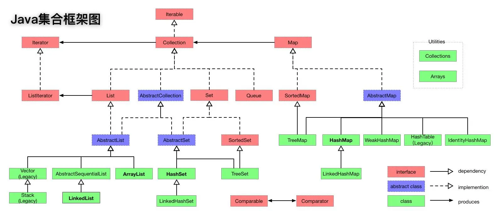


# 第二章：Collection 接口（⭐）

## 2.1 概述

* Collection 接口是 List、Set 接口的父接口，该接口中定义的方法既可以用于操作 List 集合，也可以用于操作 Set 集合。

> [!NOTE]
>
> JDK 不提供此接口的任何直接实现，而是提供更具体的子接口（如：List 、Set 等）实现。

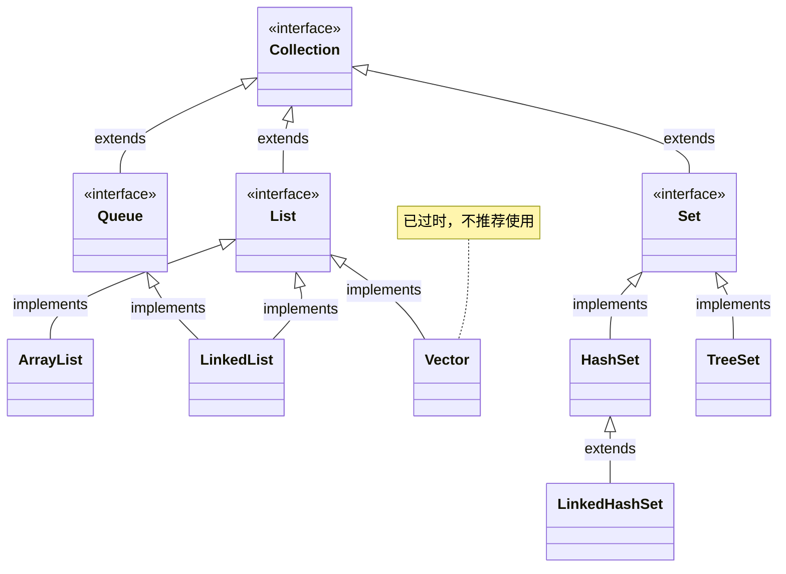
```mermaid
classDiagram
    Collection <|-- List :extends
    Collection <|-- Queue :extends
    Collection <|-- Set :extends
    List <|-- ArrayList :implements
    List <|-- LinkedList :implements
    List <|-- Vector :implements
    note for Vector "已过时，不推荐使用"
    Queue <|-- LinkedList :implements
    Set <|-- HashSet :implements
    Set <|-- TreeSet :implements
    HashSet <|-- LinkedHashSet :extends
    class Collection{
        <<interface>>
    }
    class Queue{
        <<interface>>
    }
    class List{
        <<interface>>
    }
    class Set{
        <<interface>>
    }

```

* 由于 JDK 5 增加了 `泛型` 特性，使得 Java 集合可以记住容器中对象的数据类型。

```java
public interface Collection<E> extends Iterable<E> {
    ...
}
```

## 2.2 常用 API

### 2.2.1 添加元素

* 添加元素对象到当前集合中：

```java
boolean add(E e);
```

* 添加另一个集合中的所有元素到当前集合中：

```java
boolean addAll(Collection<? extends E> c);
```

> [!NOTE]
>
> * ① 当我们向 List 系列集合添加元素的时候，方法永远返回 true ，因为 List 系列集合是允许元素重复的。
> * ② 当我们向 Set 系列集合添加元素的时候，如果要添加的元素在集合中不存在，方法返回 true ，表示添加成功；如果要添加的元素在集合中已经存在，方法返回 false，表示添加失败，因为 Set 系列集合是不允许元素重复的。
> * ③ 在实际开发中，我们通常不会关心`add()`方法或`addAll()`方法的返回值。


* 示例：

```java
package com.github.collecton;

import java.util.ArrayList;
import java.util.Collection;

public class Test {
    public static void main(String[] args) {
        // 创建集合
        Collection<Integer> coll = new ArrayList<>();
        // 添加元素
        coll.add(1);
        coll.add(2);
        coll.add(3);
        coll.add(4);
        coll.add(5);
        // 打印集合中的元素
        System.out.println(coll); // [1, 2, 3, 4, 5]
    }
}
```


* 示例：

```java
package com.github.collecton;

import java.util.ArrayList;
import java.util.Collection;
import java.util.List;

public class Test {
    public static void main(String[] args) {
        // 创建另一个集合
        List<Integer> list = List.of(1, 2, 3, 4, 5);
        // 创建集合
        Collection<Integer> coll = new ArrayList<>();
        // 给集合添加元素
        coll.add(11);
        coll.add(22);
        coll.add(33);
        // 添加另一个集合中的所有元素到本集合中
        coll.addAll(list);
        // 打印集合中的元素
        System.out.println(coll); // [11, 22, 33, 1, 2, 3, 4, 5]
    }
}
```

### 2.2.2 删除元素

* 从当前集合中删除第一个和 obj 对象匹配（调用 equals() 方法）的元素：

```java
boolean remove(Object o);
```

* 从当前集合中删除所有与 c 集合中相同的元素，即：求差集：

```java
boolean removeAll(Collection<?> c);
```

* 删除满足指定条件的集合中所有元素<Badge type="danger" text="jdk8+" />：

```java
default boolean removeIf(Predicate<? super E> filter) {
    Objects.requireNonNull(filter);
    boolean removed = false;
    final Iterator<E> each = iterator();
    while (each.hasNext()) {
        if (filter.test(each.next())) {
            each.remove();
            removed = true;
        }
    }
    return removed;
}
```


* 示例：

```java
package com.github.collecton;

import java.util.ArrayList;
import java.util.Collection;

public class Test {
    public static void main(String[] args) {
        Collection<String> c1 = new ArrayList<>();
        c1.add("aa");
        c1.add("bb");
        c1.add("cc");
        System.out.println("c1 = " + c1); // c1 = [aa, bb, cc]
        // 删除
        c1.remove("cc");
        System.out.println("c1 = " + c1); // c1 = [aa, bb]

    }
}
```


* 示例：

```java
package com.github.collecton;

import java.util.ArrayList;
import java.util.Collection;

public class Test {
    public static void main(String[] args) {
        Collection<String> c1 = new ArrayList<>();
        c1.add("aa");
        c1.add("bb");
        c1.add("cc");

        Collection<String> c2 = new ArrayList<>();
        c2.add("ee");
        c2.add("ff");

        c1.addAll(c2);

        System.out.println("c1 = " + c1); // c1 = [aa, bb, cc, ee, ff]

        // 求差集
        c1.removeAll(c2);

        System.out.println("c1 = " + c1); // c1 = [aa, bb, cc]

    }
}
```


* 示例：

```java
package com.github.collecton;

import java.util.ArrayList;
import java.util.Collection;

public class Test {
    public static void main(String[] args) {
        Collection<Integer> c1 = new ArrayList<>();

        c1.add(1);
        c1.add(2);
        c1.add(3);
        c1.add(4);
        c1.add(5);

        System.out.println("c1 = " + c1); // c1 = [1, 2, 3, 4, 5]

        // 从集合中删除所有偶数
        c1.removeIf(x -> x % 2 == 0);

        System.out.println("c1 = " + c1); // c1 = [1, 3, 5]
    }
}
```

### 2.2.3 清空集合

* 清空集合，即：将集合中的所有元素删除：

```java
void clear();
```


* 示例：

```java
package com.github.collecton;

import java.util.ArrayList;
import java.util.Collection;

public class Test {
    public static void main(String[] args) {
        Collection<String> c1 = new ArrayList<>();
        c1.add("aa");
        c1.add("bb");
        c1.add("cc");

        System.out.println("c1 = " + c1); // c1 = [aa, bb, cc]

        // 清空集合
        c1.clear();

        System.out.println("c1 = " + c1); // c1 = []

    }
}
```

### 2.2.4 判断

* 判断当前集合是否是空集合（没有任何元素）：

```java
boolean isEmpty();
```

* 判断当前集合是否包含指定的元素（底层会调用 o 对象的 equals() 方法）：

```java
boolean contains(Object o);
```

* 判断 c 集合中的元素是否都在当前集合中存在，即：c 集合是否是当前集合的子集：

```java
boolean containsAll(Collection<?> c);
```


* 示例：

```java
package com.github.collecton;

import java.util.ArrayList;
import java.util.Collection;

public class Test {
    public static void main(String[] args) {
        Collection<Integer> c1 = new ArrayList<>();

        c1.add(1);
        c1.add(2);
        c1.add(3);
        c1.add(4);
        c1.add(5);

        System.out.println(c1.isEmpty()); // false

        Collection<Integer> c2 = new ArrayList<>();

        System.out.println(c2.isEmpty()); // true
    }
}
```


* 示例：

```java
package com.github.collecton;

import java.util.ArrayList;
import java.util.Collection;

public class Test {
    public static void main(String[] args) {
        Collection<String> c1 = new ArrayList<>();
        c1.add("aa");
        c1.add("bb");
        c1.add("cc");
        c1.add("dd");

        System.out.println("c1 = " + c1.contains("aa")); // c1 = true
        System.out.println("c1 = " + c1.contains("aaa")); // c1 = false
    }
}
```


* 示例：

```java
package com.github.collecton;

import java.util.ArrayList;
import java.util.Collection;

public class Test {
    public static void main(String[] args) {
        Collection<String> c1 = new ArrayList<>();
        c1.add("aa");
        c1.add("bb");
        c1.add("cc");
        c1.add("dd");

        Collection<String> c2 = new ArrayList<>();
        c2.add("aa");
        c2.add("bb");
        c2.add("ee");

        // c1.containsAll(c2) = false
        System.out.println("c1.containsAll(c2) = " + c1.containsAll(c2));

        Collection<String> c3 = new ArrayList<>();
        c3.add("aa");
        c3.add("bb");

        // c1.containsAll(c3) = true
        System.out.println("c1.containsAll(c3) = " + c1.containsAll(c3));
    }
}
```

### 2.2.5 获取集合中元素的个数

* 获取当前集合中实际存储的元素个数：

```java
int size();
```


* 示例：

```java
package com.github.collecton;

import java.util.ArrayList;
import java.util.Collection;

public class Test {
    public static void main(String[] args) {
        Collection<String> c1 = new ArrayList<>();
        c1.add("aa");
        c1.add("bb");
        c1.add("cc");
        c1.add("dd");

        System.out.println("c1.size() = " + c1.size()); // c1.size() = 4

        c1.clear();

        System.out.println("c1.size() = " + c1.size()); // c1.size() = 0
    }
}

```

### 2.2.6 交集

* 当前集合仅保留与 c 集合中的元素相同的元素，即当前集合中仅保留两个集合的交集：

```java
boolean retainAll(Collection<?> c);
```


* 示例：

```java
package com.github.collecton;

import java.util.ArrayList;
import java.util.Collection;

public class Test {
    public static void main(String[] args) {
        Collection<String> c1 = new ArrayList<>();
        c1.add("aa");
        c1.add("bb");
        c1.add("cc");
        c1.add("dd");

        System.out.println("c1 = " + c1); // c1 = [aa, bb, cc, dd]

        Collection<String> c2 = new ArrayList<>();
        c2.add("bb");

        System.out.println("c2 = " + c2); // c2 = [bb]

        c1.retainAll(c2);

        System.out.println("c1 = " + c1); // c1 = [bb]
    }
}
```

### 2.2.7 转数组

* 将当前集合中的所有元素转换为 Object 数组：

```java
Object[] toArray();
```

* 将当前集合中的所有元素转换为对应元素类型的数组（需要自己传递数组的长度）：

```java
<T> T[] toArray(T[] a);
```

* 将当前集合中的所有元素转换为对应元素类型的数组（推荐，<Badge type="danger" text="jdk8+" />）：

```java
default <T> T[] toArray(IntFunction<T[]> generator) {
    return toArray(generator.apply(0));
}
```


* 示例：

```java
package com.github.collecton;

import java.util.ArrayList;
import java.util.Arrays;
import java.util.Collection;

public class Test {
    public static void main(String[] args) {
        Collection<String> c1 = new ArrayList<>();
        c1.add("aa");
        c1.add("bb");
        c1.add("cc");
        c1.add("dd");

        // 将集合中的所有元素转换为 Object 数组
        Object[] arr = c1.toArray();

        System.out.println(Arrays.toString(arr)); // [aa, bb, cc, dd]
    }
}
```


* 示例：

```java
package com.github.collecton;

import java.util.ArrayList;
import java.util.Arrays;
import java.util.Collection;

public class Test {
    public static void main(String[] args) {
        Collection<String> c1 = new ArrayList<>();
        c1.add("aa");
        c1.add("bb");
        c1.add("cc");
        c1.add("dd");

        // 将集合中的所有元素转换为 String 数组
        String[] arr = c1.toArray(new String[c1.size()]);

        System.out.println(Arrays.toString(arr)); // [aa, bb, cc, dd]
    }
}
```


* 示例：

```java
package com.github.collecton;

import java.util.ArrayList;
import java.util.Arrays;
import java.util.Collection;

public class Test {
    public static void main(String[] args) {
        Collection<String> c1 = new ArrayList<>();
        c1.add("aa");
        c1.add("bb");
        c1.add("cc");
        c1.add("dd");
        c1.add("ee");

        // 将集合中的所有元素转换为 String 数组
        String[] arr = c1.toArray(String[]::new);

        System.out.println(Arrays.toString(arr)); // [aa, bb, cc, dd, ee]
    }
}
```

## 2.3 遍历方式

### 2.3.1 概述

* Collection 集合是没有普通的 for 循环遍历，因为 Collection 集合是单列集合的顶层接口，其子接口 Set 是不可以通过索引来获取元素的。

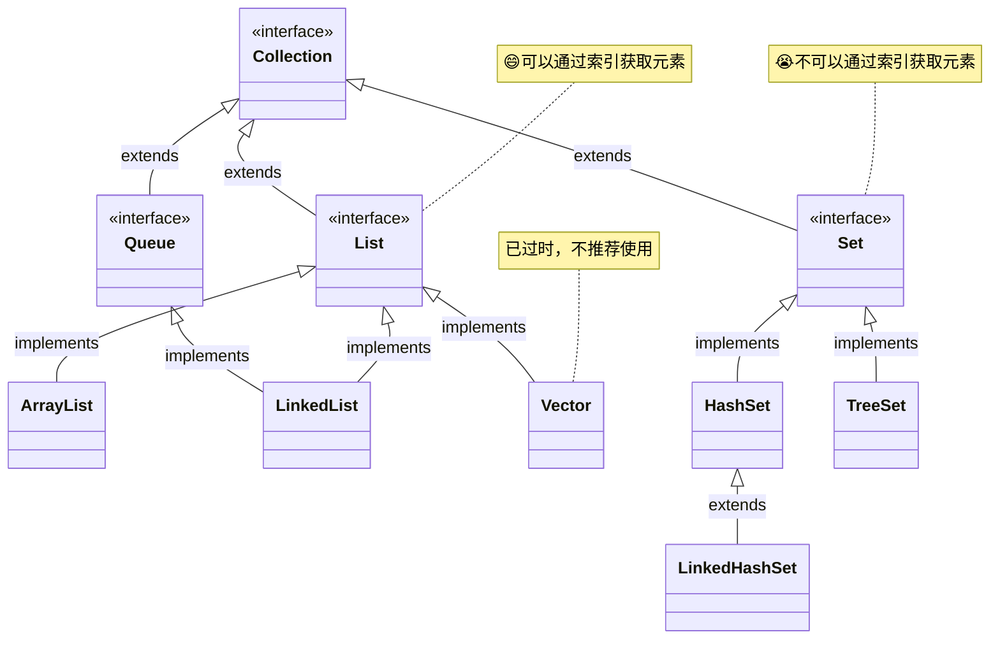
```mermaid
classDiagram
    Collection <|-- List :extends
    note for List "😄可以通过索引获取元素"
    Collection <|-- Queue :extends
    Collection <|-- Set :extends
    note for Set "😭不可以通过索引获取元素"
    List <|-- ArrayList :implements
    List <|-- LinkedList :implements
    List <|-- Vector :implements
    note for Vector "已过时，不推荐使用"
    Queue <|-- LinkedList :implements
    Set <|-- HashSet :implements
    Set <|-- TreeSet :implements
    HashSet <|-- LinkedHashSet :extends
    class Collection{
        <<interface>>
    }
    class Queue{
        <<interface>>
    }
    class List{
        <<interface>>
    }
    class Set{
        <<interface>>
    }
```

* 为了程序的通用性，Collection 集合提供了三种遍历方式：
  * ① 迭代器遍历。
  * ② 增强 for 遍历。
  * ③ Lambda 表达式遍历。

### 2.3.2 迭代器遍历

#### 2.3.2.1 概述

* 我们可以通过`迭代器对象`，将集合中的元素依次获取出来，如下所示：

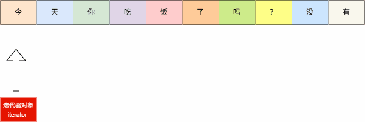

#### 2.3.2.2 Iterator 接口

* Iterator 接口也是 Java 集合中的一员，但是它和 Collection 接口以及 Map 接口有所不同：
  * Collection 接口和 Map 接口主要用来存储元素。
  * Iterator 接口主要用来迭代访问，即：遍历 Collection 集合或 Map 集合中的元素。

> [!CAUTION]
>
> 所谓的迭代器，就是实现 Iterator 接口的对象！！！

* Collection 接口获取迭代器：

| 方法                      | 描述                                                  |
| ------------------------- | ----------------------------------------------------- |
| `Iterator<E> iterator();` | 返回迭代器对象（创建指针），默认指向集合索引 0 的位置 |

* Iterator 接口的常用方法：

| 方法                 | 描述                                                         |
| -------------------- | ------------------------------------------------------------ |
| `boolean hasNext();` | 判断当前位置是否有元素，如果有，返回 true；如果没有，返回 false |
| `E next();`          | 获取当前位置上的元素，并将迭代器对象移动到下一个位置（移动指针） |

* 迭代器的内存示意图，如下所示：

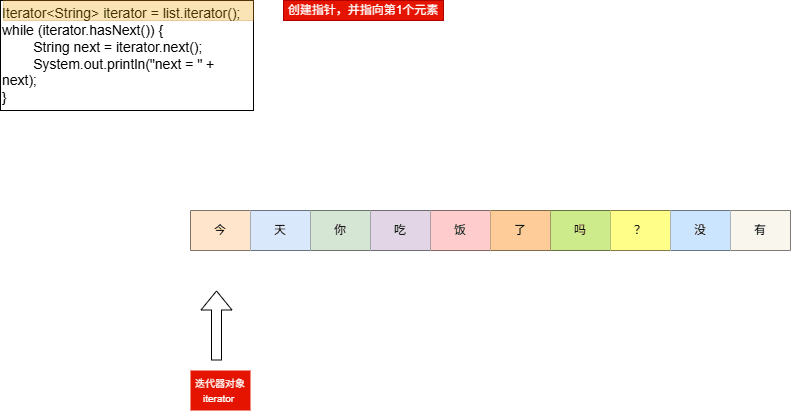


* 示例：

```java
package com.github.collection;

import java.util.ArrayList;
import java.util.Collection;
import java.util.Iterator;

public class Test {
    public static void main(String[] args) {
        // 创建集合对象
        Collection<String> col = new ArrayList<>();
        // 向集合中添加元素
        col.add("aa");
        col.add("bb");
        col.add("cc");
        col.add("dd");
        // 获取迭代器对象，默认指向集合的 0 索引处
        Iterator<String> iterator = col.iterator();
        // 利用循环不断地去获取集合中的每一个元素
        while (iterator.hasNext()) {
            String next = iterator.next();
            System.out.println("next = " + next);
        }
    }
}
```


* 示例：

```java
package com.github.collection;

import java.util.ArrayList;
import java.util.Collection;
import java.util.Iterator;

public class Test {
    public static void main(String[] args) {
        // 创建集合对象
        Collection<String> col = new ArrayList<>();
        // 向集合中添加元素
        col.add("aa");
        col.add("bb");
        col.add("cc");
        col.add("dd");
        // 使用 for 循环来改写 while 循环
        for (Iterator<String> iterator = col.iterator(); iterator.hasNext(); ) {
            String next = iterator.next();
            System.out.println("next = " + next);
        }
    }
}
```


* 示例：

::: code-group

```java [Student.java]
package com.github.collection;

public class Student {

    private final String name;

    private final Integer age;

    public Student(String name, Integer age) {
        this.name = name;
        this.age = age;
    }

    @Override
    public String toString() {
        return "Student{" + "name='" + name + '\'' + ", age=" + age + '}';
    }
}
```

```java [Test.java]
package com.github.collection;

import java.util.ArrayList;
import java.util.Collection;
import java.util.Iterator;

public class Test {
    public static void main(String[] args) {
        // 创建集合
        Collection<Student> collection = new ArrayList<>();
        // 给集合添加元素
        collection.add(new Student("张三", 11));
        collection.add(new Student("李四", 59));
        collection.add(new Student("王五", 19));
        collection.add(new Student("赵六", 42));
        collection.add(new Student("田七", 8));
        collection.add(new Student("王八", 2));
        // 遍历集合
        Iterator<Student> iterator = collection.iterator();
        while (iterator.hasNext()){
            Student next = iterator.next();
            System.out.println(next);
        }
    }
}
```

```txt [cmd 控制台]
Student{name='张三', age=11}
Student{name='李四', age=59}
Student{name='王五', age=19}
Student{name='赵六', age=42}
Student{name='田七', age=8}
Student{name='王八', age=2}
```

:::

#### 2.3.2.3 迭代器的实现原理

* 在 Collection 接口中提供了获取 Iterator 接口的方法：

```java
public interface Collection<E> extends Iterable<E> {
    
    Iterator<E> iterator();
    
    ...
}
```

* 实现 Collection 接口或子接口的实现类都必须实现该方法，以 ArrayList 为例：

```java
public class ArrayList<E> extends AbstractList<E>
        implements List<E>, RandomAccess, Cloneable, java.io.Serializable {
    
	public Iterator<E> iterator() {
        return new Itr();
    }
    
    private class Itr implements Iterator<E> {
        int cursor;       // index of next element to return
        int lastRet = -1; // index of last element returned; -1 if no such
        int expectedModCount = modCount;

        // prevent creating a synthetic constructor
        Itr() {}

        public boolean hasNext() {
            return cursor != size;
        }

        @SuppressWarnings("unchecked")
        public E next() {
            checkForComodification();
            int i = cursor;
            if (i >= size)
                throw new NoSuchElementException();
            Object[] elementData = ArrayList.this.elementData;
            if (i >= elementData.length)
                throw new ConcurrentModificationException();
            cursor = i + 1;
            return (E) elementData[lastRet = i];
        }

        public void remove() {
            if (lastRet < 0)
                throw new IllegalStateException();
            checkForComodification();

            try {
                ArrayList.this.remove(lastRet);
                cursor = lastRet;
                lastRet = -1;
                expectedModCount = modCount;
            } catch (IndexOutOfBoundsException ex) {
                throw new ConcurrentModificationException();
            }
        }

        @Override
        public void forEachRemaining(Consumer<? super E> action) {
            Objects.requireNonNull(action);
            final int size = ArrayList.this.size;
            int i = cursor;
            if (i < size) {
                final Object[] es = elementData;
                if (i >= es.length)
                    throw new ConcurrentModificationException();
                for (; i < size && modCount == expectedModCount; i++)
                    action.accept(elementAt(es, i));
                // update once at end to reduce heap write traffic
                cursor = i;
                lastRet = i - 1;
                checkForComodification();
            }
        }

        final void checkForComodification() {
            if (modCount != expectedModCount)
                throw new ConcurrentModificationException();
        }
    }
    
    ...
}    
```

#### 2.3.2.4 迭代器的细节

##### 2.3.2.4.1 NoSuchElementException 异常

* 当迭代器的指针已经指向了最后没有元素的位置，如果还强行调用 next() 方法，方法内部将会抛出 java.util.NoSuchElementException 异常，如下所示：


* 示例：

```java
package com.github.collection;

import java.util.ArrayList;
import java.util.Collection;
import java.util.Iterator;

public class Test {
    public static void main(String[] args) {
        // 创建集合对象
        Collection<String> col = new ArrayList<>();
        // 向集合中添加元素
        col.add("aa");
        col.add("bb");
        col.add("cc");
        col.add("dd");
        // 获取迭代器对象，默认指向集合的 0 索引处
        Iterator<String> iterator = col.iterator();
        // 利用循环不断地去获取集合中的每一个元素
        while (iterator.hasNext()) {
            String next = iterator.next();
            System.out.println("next = " + next);
        }

        // ❌ 错误：会抛出 java.util.NoSuchElementException 异常
        String next = iterator.next(); // [!code error]
        System.out.println("next = " + next);
    }
}
```

##### 2.3.2.4.2 迭代器指针不会复位

* 当迭代器遍历完毕之后，指针不会复位。换言之，如果还想使用迭代器遍历，需要获取一个新的迭代器。

> [!NOTE]
>
> 推荐使用 for 循环来代替 while 循环，因为 for 循环对于初始化变量有作用域！！！


* 示例：

```java
package com.github.collection;

import java.util.ArrayList;
import java.util.Collection;
import java.util.Iterator;

public class Test {
    public static void main(String[] args) {
        // 创建集合对象
        Collection<String> col = new ArrayList<>();
        // 向集合中添加元素
        col.add("aa");
        col.add("bb");
        col.add("cc");
        col.add("dd");
        // 获取迭代器对象，默认指向集合的 0 索引处
        Iterator<String> iterator = col.iterator();
        // 利用循环不断地去获取集合中的每一个元素
        while (iterator.hasNext()) {
            String next = iterator.next();
            System.out.println("next = " + next);
        }

        // 获取一个新的迭代器对象
        iterator = col.iterator(); // [!code highlight]
        // 利用循环不断地去获取集合中的每一个元素
        while (iterator.hasNext()) {
            String next = iterator.next();
            System.out.println("next = " + next);
        }
    }
}
```


* 示例：

```java {17,22}
package com.github.collection;

import java.util.ArrayList;
import java.util.Collection;
import java.util.Iterator;

public class Test {
    public static void main(String[] args) {
        // 创建集合对象
        Collection<String> col = new ArrayList<>();
        // 向集合中添加元素
        col.add("aa");
        col.add("bb");
        col.add("cc");
        col.add("dd");
        // 使用 for 循环来改写 while 循环
        for (Iterator<String> iterator = col.iterator(); iterator.hasNext(); ) {
            String next = iterator.next();
            System.out.println("next = " + next);
        }
        // 使用 for 循环来改写 while 循环
        for (Iterator<String> iterator = col.iterator(); iterator.hasNext(); ) {
            String next = iterator.next();
            System.out.println("next = " + next);
        }
    }
}
```

##### 2.3.2.4.3 循环中只能使用一次 next 方法

* next 方法的作用，如下所示：
  * ① 获取元素。
  * ② 移动指针。
* 如果在循环中调用了两次 next 方法，将会使得指针移动两次，可能会导致方法抛出 java.util.NoSuchElementException 异常。

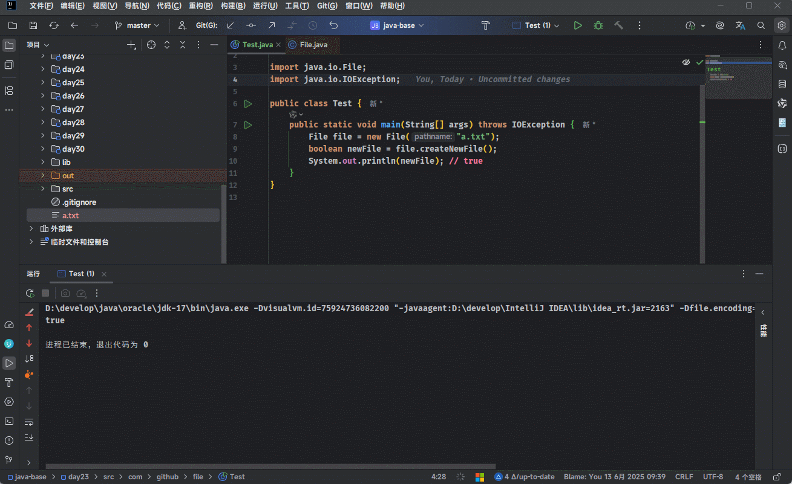


* 示例：

```java
package com.github.collection;

import java.util.ArrayList;
import java.util.Collection;
import java.util.Iterator;

public class Test {
    public static void main(String[] args) {
        // 创建集合对象
        Collection<String> col = new ArrayList<>();
        // 向集合中添加元素
        col.add("aa");
        col.add("bb");
        col.add("cc");
        col.add("dd");
        col.add("ee");
        // 遍历集合中的元素
        Iterator<String> iterator = col.iterator();
        while (iterator.hasNext()) {
            String next = iterator.next();
            System.out.println(next);
            // ❌ 错误：会抛出 java.util.NoSuchElementException 异常
            next = iterator.next(); // [!code error]
            System.out.println(next);
        }
    }
}
```

##### 2.3.2.4.4 使用 Iterator 接口的删除方法

* Iterator 接口提供了删除的方法：

```java
default void remove() {
    throw new UnsupportedOperationException("remove");
}
```

* 其实现类中实现了该方法，如下所示：

```java {33-46}
public class ArrayList<E> extends AbstractList<E>
        implements List<E>, RandomAccess, Cloneable, java.io.Serializable {
    
	public Iterator<E> iterator() {
        return new Itr();
    }
    
    private class Itr implements Iterator<E> {
        int cursor;       // index of next element to return
        int lastRet = -1; // index of last element returned; -1 if no such
        int expectedModCount = modCount;

        // prevent creating a synthetic constructor
        Itr() {}

        public boolean hasNext() {
            return cursor != size;
        }

        @SuppressWarnings("unchecked")
        public E next() {
            checkForComodification();
            int i = cursor;
            if (i >= size)
                throw new NoSuchElementException();
            Object[] elementData = ArrayList.this.elementData;
            if (i >= elementData.length)
                throw new ConcurrentModificationException();
            cursor = i + 1;
            return (E) elementData[lastRet = i];
        }

        public void remove() { 
            if (lastRet < 0)
                throw new IllegalStateException();
            checkForComodification();

            try {
                ArrayList.this.remove(lastRet);
                cursor = lastRet;
                lastRet = -1;
                expectedModCount = modCount;
            } catch (IndexOutOfBoundsException ex) {
                throw new ConcurrentModificationException();
            }
        }

        @Override
        public void forEachRemaining(Consumer<? super E> action) {
            Objects.requireNonNull(action);
            final int size = ArrayList.this.size;
            int i = cursor;
            if (i < size) {
                final Object[] es = elementData;
                if (i >= es.length)
                    throw new ConcurrentModificationException();
                for (; i < size && modCount == expectedModCount; i++)
                    action.accept(elementAt(es, i));
                // update once at end to reduce heap write traffic
                cursor = i;
                lastRet = i - 1;
                checkForComodification();
            }
        }

        final void checkForComodification() {
            if (modCount != expectedModCount)
                throw new ConcurrentModificationException();
        }
    }
    
    ...
}    
```

> [!CAUTION]
>
> * ① 在使用迭代器遍历集合元素的时候，如果调用 Collection 的 remove(xxx) 方法，将会抛出 java.util.ConcurrentModificationException 异常或出现其他不确定的行为。
> * ② 在使用迭代器遍历集合元素的时候，如果要删除元素，使用迭代器的 remove() 方法。


* 示例：

```java
package com.github.collection;

import java.util.ArrayList;
import java.util.Collection;
import java.util.Iterator;

public class Test {
    public static void main(String[] args) {
        // 创建集合对象
        Collection<String> col = new ArrayList<>();
        // 向集合中添加元素
        col.add("aa");
        col.add("bb");
        col.add("cc");
        col.add("dd");
        col.add("ee");
        // 遍历集合中的元素
        Iterator<String> iterator = col.iterator();
        while (iterator.hasNext()) {
            String next = iterator.next();
            if (next.equals("aa")) {
                // ❌ 错误：会抛出 java.util.ConcurrentModificationException  异常
                col.remove("aa"); // [!code error] 
            } else {
                System.out.println(next);
            }
        }
    }
}
```


* 示例：

```java
package com.github.collection;

import java.util.ArrayList;
import java.util.Collection;
import java.util.Iterator;

public class Test {
    public static void main(String[] args) {
        // 创建集合对象
        Collection<String> col = new ArrayList<>();
        // 向集合中添加元素
        col.add("aa");
        col.add("bb");
        col.add("cc");
        col.add("dd");
        col.add("ee");
        // 遍历集合中的元素
        Iterator<String> iterator = col.iterator();
        while (iterator.hasNext()) {
            String next = iterator.next();
            if (next.equals("aa")) {
                // ✅ 使用了 iterator 的 remove 方法
                iterator.remove(); // [!code highlight]
            } else {
                System.out.println(next);
            }
        }
    }
}

```

### 2.3.3 增强 for 遍历

#### 2.3.3.1 概述

* 在 JDK1.4 之前，Collection 接口的源码，如下所示：

```java
package java.util;

public interface Collection { 

	Iterator iterator();
    
    // 其余略

}
```

* 那么，我们遍历集合都需要使用迭代器的方式来遍历。但是，Java 官方认为这种方式太繁琐了，于是在 JDK1.5 之后增加了 Iterable 接口，如下所示：

```java
package java.lang;

public interface Iterable<T> {
  
    Iterator<T> iterator();

    // 其余略

}
```

* 并且，Collection 接口继承了 Iterable 接口，如下所示：

```java
package java.util;

public interface Collection<E> extends Iterable<E> {
    
    Iterator iterator();
    
    // 其余略
    
}
```

* 我们从 Iterable 接口源码的注释中，可以看到这样的信息，如下所示：

```java
package java.lang;

/**
* Implementing this interface allows an object to be the target of the enhanced
* 实现此接口允许对象成为 enhanced for 语句（有时称为“for-each loop”语句）的目标
*/
public interface Iterable<T> {
  
    Iterator<T> iterator();

    // 其余略

}
```

#### 2.3.3.2 增强 for 语法

* 语法：

```java
for(元素的数据类型 变量: 数组|Collection 集合){
    ...
}
```

> [!NOTE]
>
> - ① 增强 for 循环（也称为 for-each 循环）是 JDK 5 之后出来的一个高级的 for 循环，专门用来遍历数组和集合。
> - ② 只要某个类实现了 Iterable 接口，并重写了 iterator() 方法，就可以使用 for-each 循环。
> - ③ 默认情况下，所有的单列集合（Collection 集合的子类）和数组可以使用 for-each 循环遍历。
> - ④ for-each 循环只是语法糖而已，其底层还是会转换为`迭代器`对数组或集合进行遍历。

> [!CAUTION]
>
> 和使用迭代器遍历集合元素一样，在使用 for-each 循环遍历数组或集合中的元素时，不可以对数组或集合中的元素进行增加、删除、替换等操作，否则将会抛出 ConcurrentModificationException 异常。


* 示例：

```java
package com.github.collection;

public class Test {
    public static void main(String[] args) {
        // 创建数组
        int[] arr = {1, 2, 3, 4, 5};
        // 遍历数组
        for (int i : arr) {
            System.out.println("i = " + i);
        }
    }
}
```


* 示例：

```java
package com.github.collection;

import java.util.ArrayList;
import java.util.Collection;

public class Test {
    public static void main(String[] args) {
        // 创建集合对象
        Collection<String> col = new ArrayList<>();
        // 向集合中添加元素
        col.add("aa");
        col.add("bb");
        col.add("cc");
        col.add("dd");
        col.add("ee");
        // 遍历集合中的元素
        for (String str : col) {
            System.out.println(str);
        }
    }
}
```

### 2.3.4 Lambda 表达式遍历

#### 2.3.4.1 概述

* 为了简化单列集合（Collection 集合的子类）或数组的遍历方式，Java 在 Iterable 接口中提供了新的遍历方法：

```java
package java.lang;

public interface Iterable<T> {
   
    Iterator<T> iterator();

    default void forEach(Consumer<? super T> action) { // [!code highlight:6]
        Objects.requireNonNull(action);
        for (T t : this) {
            action.accept(t);
        }
    }

    default Spliterator<T> spliterator() {
        return Spliterators.spliteratorUnknownSize(iterator(), 0);
    }
}
```

#### 2.3.4.2 forEach 方法

* JDK8 新增了遍历单列集合（Collection 集合的子类）或数组的方法：

```java
default void forEach(Consumer<? super T> action) { 
    Objects.requireNonNull(action);
    for (T t : this) {
        action.accept(t);
    }
}
```


* 示例：

```java
package com.github.collection;

import java.util.ArrayList;
import java.util.Collection;

public class Test {
    public static void main(String[] args) {
        // 创建集合对象
        Collection<String> col = new ArrayList<>();
        // 向集合中添加元素
        col.add("aa");
        col.add("bb");
        col.add("cc");
        col.add("dd");
        // forEach 方法
        col.forEach(s -> {
            System.out.println(s);
        });
    }
}
```

## 2.4 总结

* Collection 是单列集合的顶级接口，其所有的方法都被 List 系列集合或 Set 系列集合共享。
* Collection 集合遍历有三种方式：
  * 迭代器：如果在遍历的过程中需要删除元素，请使用迭代器。
  * 增强 for 、Lambda：如果仅仅想遍历，请使用增强 for 或 Lambda 表达式。


# 第四章：List 接口（⭐）

## 4.1 概述

* 在实际开发中，由于数组存储数据的局限性，我们通常会使用 List 来代替。并且，List 接口是 Collection 接口的子接口。

> [!NOTE]
>
> List 系列集合的特点：添加的元素是有序、可重复、有索引。
>
> * 有序：`存`和`取`的顺序是一样的，如：存数据是`张三、李四、王五`，那么取数据也是`张三、李四、王五`；和之前学习的`排序`（从小到大或从大到小）没有任何关系。
> * 可重复：集合存储的元素是可以重复的。
> * 有索引：可以通过索引去获取集合中的元素。


```mermaid
classDiagram
    Collection <|-- List :extends
    Collection <|-- Queue :extends
    Collection <|-- Set :extends
    List <|-- ArrayList :implements
    List <|-- LinkedList :implements
    List <|-- Vector :implements
    note for Vector "已过时，不推荐使用"
    Queue <|-- LinkedList :implements
    Set <|-- HashSet :implements
    Set <|-- TreeSet :implements
    HashSet <|-- LinkedHashSet :extends
    class Collection{
        <<interface>>
    }
    class Queue{
        <<interface>>
    }
    class List{
        <<interface>>
    }
    class Set{
        <<interface>>
    }

```

* List  接口中常用的子类：ArrayList 和 LinkedList。 

## 4.2 常用 API

### 4.2.1 概述

* 由于 List 接口是 Collection 接口的子接口，List 接口将继承 Collection 接口中的所有方法，所以我们可以在 List 接口中使用 Collection 接口中的所有方法。
* 因为 List 系列集合有索引，所以 List 接口增加了许多操作索引的方法。

### 4.2.2 添加元素

* 在指定索引位置上添加元素：

```java
void add(int index, E element);
```

* 在指定的索引位置上添加另一个集合中的所有元素：

```java
boolean addAll(int index, Collection<? extends E> c);
```

> [!NOTE]
>
> 如果要添加的索引位置上有元素，那么该索引以及之后的元素将向后移动！！！


* 示例：

```java
package com.github.collection;

import java.util.ArrayList;
import java.util.List;

public class Test {
    public static void main(String[] args) {
        // 创建集合
        List<Integer> list = new ArrayList<>();

        // 添加元素
        list.add(1);
        list.add(2);
        list.add(3);

        // 打印集合元素
        System.out.println(list); // [1, 2, 3]

        // 在指定位置上添加元素
        list.add(2, 5);
        
        // 打印集合元素
        System.out.println(list); // [1, 2, 5, 3]
    }

}
```


* 示例：

```java
package com.github.collection;

import java.util.ArrayList;
import java.util.List;

public class Test {
    public static void main(String[] args) {
        // 创建集合
        List<Integer> list1 = new ArrayList<>();

        // 添加元素
        list1.add(1);
        list1.add(2);
        list1.add(3);

        // 打印集合元素
        System.out.println(list1); // [1, 2, 3]

        // 创建另一个集合
        List<Integer> list2 = new ArrayList<>();
        list2.add(4);
        list2.add(5);

        // 在指定位置上添加另一个集合的所有元素
        list1.addAll(1, list2);

        // 打印集合元素
        System.out.println(list1); // [1, 4, 5, 2, 3]
    }

}
```

### 4.2.3 删除元素

* 根据索引删除元素，并返回被删除的元素：

```java
E remove(int index);
```

> [!NOTE]
>
> 在调用方法的时候，如果出现了方法重载现象，优先调用`形参和实现类型一致`的那个方法。


* 示例：

```java
package com.github.collection;

import java.util.ArrayList;
import java.util.List;

public class Test {
    public static void main(String[] args) {
        // 创建集合
        List<String> list = new ArrayList<>();

        // 添加元素
        list.add("aa");
        list.add("bb");
        list.add("cc");
        list.add("dd");
        list.add("ee");

        // 打印集合中的元素
        System.out.println(list); // [aa, bb, cc, dd, ee]
        
        // 根据索引删除元素
        String remove = list.remove(1);
        System.out.println(remove); // bb

        // 打印集合中的元素
        System.out.println(list); // [aa, cc, dd, ee]
    }
}
```

### 4.2.4 替换元素

* 替换指定索引上的元素：

```java
E set(int index, E element);
```

* 批量替换集合中的每一个元素<Badge type="danger" text="jdk8+" />：

```java
default void replaceAll(UnaryOperator<E> operator) {
    Objects.requireNonNull(operator);
    final ListIterator<E> li = this.listIterator();
    while (li.hasNext()) {
        li.set(operator.apply(li.next()));
    }
}
```


* 示例：

```java
package com.github.collection;

import java.util.ArrayList;
import java.util.List;

public class Test {
    public static void main(String[] args) {
        // 创建集合
        List<String> list = new ArrayList<>();

        // 添加元素
        list.add("aa");
        list.add("bb");
        list.add("cc");
        list.add("dd");
        list.add("ee");

        // 打印集合中的元素
        System.out.println(list); // [aa, bb, cc, dd, ee]

        // 替换指定索引上的元素
        list.set(4, "java");

        // 打印集合中的元素
        System.out.println(list); // [aa, bb, cc, dd, java]

    }
}
```


* 示例：

```java
package com.github.collection;

import java.util.ArrayList;
import java.util.List;

public class Test {
    public static void main(String[] args) {
        // 创建集合
        List<String> list = new ArrayList<>();

        // 添加元素
        list.add("aa");
        list.add("bb");
        list.add("cc");
        list.add("dd");
        list.add("ee");
        list.add("aa");
        list.add("bb");

        // 打印集合中的元素
        System.out.println(list); // [aa, bb, cc, dd, ee]

        // 批量替换集合中的每一个元素
        list.replaceAll(x -> x.toUpperCase());


        // 打印集合中的元素
        System.out.println(list); // [AA, BB, CC, DD, EE, AA, BB]

    }
}
```

### 4.2.5 获取元素

* 获取指定索引上的元素：

```java
E get(int index);
```

* 根据开始索引和结束索引获取子 List 集合：

```java
List<E> subList(int fromIndex, int toIndex);
```


* 示例：

```java
package com.github.collection;

import java.util.ArrayList;
import java.util.List;

public class Test {
    public static void main(String[] args) {
        // 创建集合
        List<String> list = new ArrayList<>();

        // 添加元素
        list.add("aa");
        list.add("bb");
        list.add("cc");
        list.add("dd");
        list.add("ee");
        list.add("aa");
        list.add("bb");

        // 打印集合中的元素
        System.out.println(list); // [aa, bb, cc, dd, ee]

        // 获取指定索引上的元素
        System.out.println(list.get(0)); // aa
        System.out.println(list.get(1)); // bb
        System.out.println(list.get(2)); // cc
        System.out.println(list.get(3)); // dd
        System.out.println(list.get(4)); // ee
        System.out.println(list.get(5)); // aa
        System.out.println(list.get(6)); // bb

    }
}
```


* 示例：

```java
package com.github.collection;

import java.util.ArrayList;
import java.util.List;

public class Test {
    public static void main(String[] args) {
        // 创建集合
        List<String> list = new ArrayList<>();

        // 添加元素
        list.add("aa");
        list.add("bb");
        list.add("cc");
        list.add("dd");
        list.add("ee");
        list.add("aa");
        list.add("bb");

        // 打印集合中的元素
        System.out.println(list); // [aa, bb, cc, dd, ee]

        // 获取指定索引上的元素
        List<String> list2 = list.subList(1, 3);

        // 打印集合中的元素
        System.out.println(list2); // [bb, cc]
    }
}
```

### 4.2.6 获取元素索引

* 从前往后根据元素查找其索引，如果找到，返回该元素的索引；否则，返回 -1 ：

```java
int indexOf(Object o);
```

* 从后往前根据元素查找其索引，如果找到，返回该元素的索引；否则，返回 -1 ：

```java
int lastIndexOf(Object o);
```


* 示例：

```java
package com.github.collection;

import java.util.ArrayList;
import java.util.List;

public class Test {
    public static void main(String[] args) {
        List<String> list = new ArrayList<>();

        list.add("aa");
        list.add("bb");
        list.add("cc");
        list.add("dd");
        list.add("aa");

        int index = list.indexOf("aa");
        System.out.println("index = " + index); // index = 0

        int index1 = list.indexOf("ee");
        System.out.println("index1 = " + index1); // index1 = -1
    }
}
```


* 示例：

```java
package com.github.collection;

import java.util.ArrayList;
import java.util.List;

public class Test {
    public static void main(String[] args) {
        List<String> list = new ArrayList<>();

        list.add("aa");
        list.add("bb");
        list.add("cc");
        list.add("dd");
        list.add("aa");

        int index = list.lastIndexOf("aa");
        System.out.println("index = " + index); // index = 4

        int index1 = list.lastIndexOf("ff");
        System.out.println("index1 = " + index1); // index1 = -1
    }
}
```

### 4.2.7 排序

* 对列表中的元素进行排序<Badge type="danger" text="jdk8+" />：

```java
default void sort(Comparator<? super E> c) {
    Object[] a = this.toArray();
    Arrays.sort(a, (Comparator) c);
    ListIterator<E> i = this.listIterator();
    for (Object e : a) {
        i.next();
        i.set((E) e);
    }
}
```


* 示例：

```java
package com.github.collection;

import java.util.ArrayList;
import java.util.List;

public class Test {
    public static void main(String[] args) {
        // 创建集合
        List<String> list = new ArrayList<>();

        // 添加元素
        list.add("aa");
        list.add("bb");
        list.add("cc");
        list.add("dd");
        list.add("ee");
        list.add("aa");
        list.add("bb");

        // 打印集合中的元素
        System.out.println(list); // [aa, bb, cc, dd, ee]

        // 对列表中的元素进行排序
        list.sort((x1, x2) -> x2.compareTo(x1));


        // 打印集合中的元素
        System.out.println(list); // [ee, dd, cc, bb, bb, aa, aa]
    }
}
```

## 4.3 遍历方式

### 4.3.1 概述

* 由于 List 系列集合有索引，所以遍历方式在 Collection 集合的基础上增加了 2 种：

| List  系列集合遍历方式                        | 应用场景                                                   |
| --------------------------------------------- | ---------------------------------------------------------- |
| 迭代器遍历                                    | 在遍历的过程中需要删除元素，请使用迭代器遍历               |
| 列表迭代器遍历                                | 在遍历的过程中需要添加元素或修改元素，请使用列表迭代器遍历 |
| 增强 for 遍历                                 | 仅仅想遍历，请使用增强 for 遍历或Lambda 表达式遍历         |
| Lambda 表达式遍历                             | 仅仅想遍历，请使用增强 for 遍历或Lambda 表达式遍历         |
| 普通 for 循环遍历（因为 List 系列集合有索引） | 如果遍历的时候想操作索引，请使用普通 for 循环遍历          |

### 4.3.2 普通 for 循环遍历

* 语法：

```java
for (int i = 0; i < list.size(); i++) {
    Object s = list.get(i);
    System.out.println(s);
}
```

> [!NOTE]
>
> * ① 借助 Collection 的 size() 方法，可以获取集合中元素的个数。
> * ② 借助 List 的 get(x) 方法，可以根据索引获取元素。


* 示例：

```java
package com.github.collection;

import java.util.ArrayList;
import java.util.List;

public class Test {
    public static void main(String[] args) {
        // 创建集合
        List<String> list = new ArrayList<>();

        // 添加元素
        list.add("aa");
        list.add("bb");
        list.add("cc");
        list.add("dd");
        list.add("ee");
        list.add("aa");
        list.add("bb");

        // 打印集合中的元素
        for (int i = 0; i < list.size(); i++) {
            String str = list.get(i);
            System.out.println(str);
        }
    }
}

```

### 4.3.3 列表迭代器遍历（了解）

#### 4.3.3.1 概述

* 之前，通过 Collection 接口的 iterator() 方法可以实现从前向后依次遍历集合中的元素：

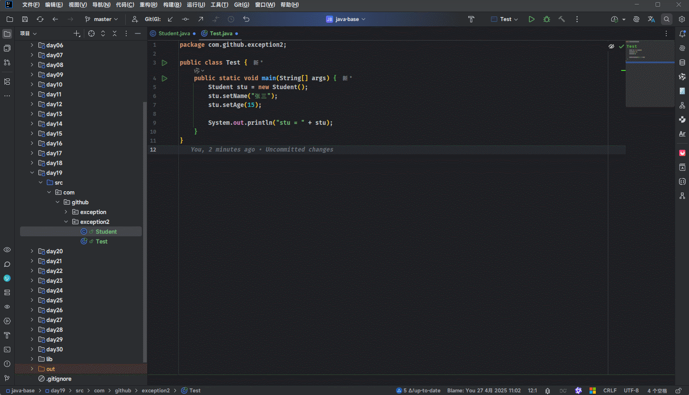

* 但是，List 接口提供了 listIterator() 方法，可以实现从后向前依次遍历集合中的元素：

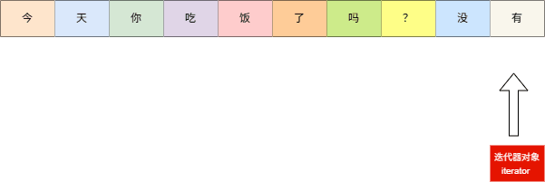

#### 4.3.3.2 常用 API

* List 接口提供的获取 ListIterator 的方法：

| 方法                                       | 描述                                                |
| ------------------------------------------ | --------------------------------------------------- |
| `ListIterator<E> listIterator();`          | 获取列表迭代器对象，需要自己手动移动迭代器          |
| `ListIterator<E> listIterator(int index);` | 根据索引获取列表迭代器对象，即：index = list.size() |

* listIterator 接口的常用方法：

| 方法                     | 描述                                   |
| ------------------------ | -------------------------------------- |
| `boolean hasNext();`     | 判断当前索引位置上是否有元素           |
| `E next();`              | 获取元素，并向后移动迭代器对象（指针） |
| `boolean hasPrevious();` | 判断当前索引位置上是否有元素           |
| `E previous();`          | 获取元素，并向前移动迭代器对象（指针） |
| `void add(E e);`         | 迭代遍历过程中，新增元素               |
| `void set(E e);`         | 迭代遍历过程中，修改元素               |
| `void remove();`         | 迭代遍历过程中，删除元素               |


* 示例：

```java
package com.github.collection;

import java.util.ArrayList;
import java.util.List;
import java.util.ListIterator;

public class Test {
    public static void main(String[] args) {
        // 创建集合
        List<String> list = new ArrayList<>();

        // 添加元素
        list.add("aa");
        list.add("bb");
        list.add("cc");
        list.add("dd");
        list.add("ee");
        list.add("aa");
        list.add("bb");

        // 打印集合中的元素
        ListIterator<String> iterator = list.listIterator();
        while (iterator.hasNext()) {
            iterator.next();
        }
        while (iterator.hasPrevious()) {
            String str = iterator.previous();
            System.out.println(str);
        }

    }
}
```


* 示例：

```java
package com.github.collection;

import java.util.ArrayList;
import java.util.List;
import java.util.ListIterator;

public class Test {
    public static void main(String[] args) {
        // 创建集合
        List<String> list = new ArrayList<>();

        // 添加元素
        list.add("aa");
        list.add("bb");
        list.add("cc");
        list.add("dd");
        list.add("ee");
        list.add("aa");
        list.add("bb");

        // 打印集合中的元素
        ListIterator<String> iterator = list.listIterator(list.size());
        while (iterator.hasPrevious()) {
            String str = iterator.previous();
            System.out.println(str);
        }
    }
}
```


# 第五章：常见的数据结构（⭐）

## 5.1 引入

* `数据结构`是计算机`存储数据`和`组织数据`的方式。

> [!NOTE]
>
> 数据结构在开发中非常常见，不同的场景我们采取不同的数据结构，会让数据的查找和存储更有效率。

* 如果数据比较多，我们可能会选择`哈希查找`算法，如下所示：

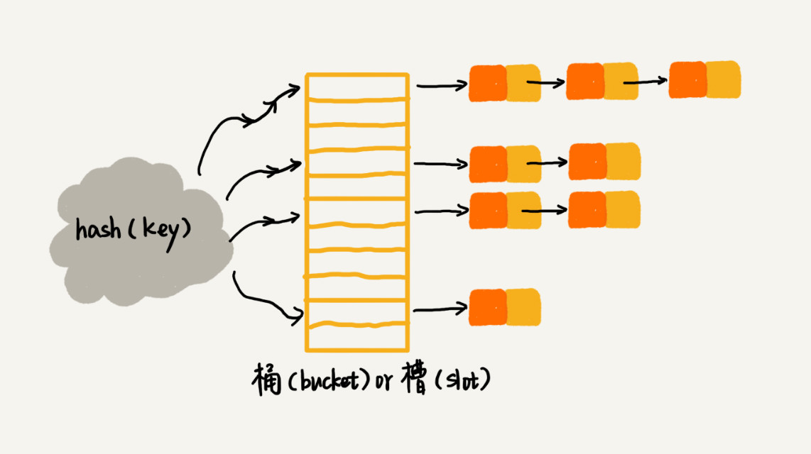

* 如果数据量比较少，我们会直接使用`数组`，如下所示：

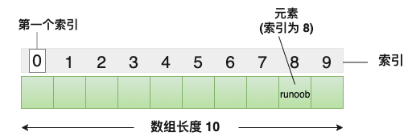

> [!NOTE]
>
> 总结：不同的业务场景下，需要选择不同的数据结构。

* 在 List 接口下有 3 个实现类：ArrayList、LinkedList 以及 Vector，如下所示：


```mermaid
classDiagram
    Collection <|-- List :extends
    Collection <|-- Queue :extends
    Collection <|-- Set :extends
    List <|-- ArrayList :implements
    List <|-- LinkedList :implements
    List <|-- Vector :implements
    note for Vector "已过时，不推荐使用"
    Queue <|-- LinkedList :implements
    Set <|-- HashSet :implements
    Set <|-- TreeSet :implements
    HashSet <|-- LinkedHashSet :extends
    class Collection{
        <<interface>>
    }
    class Queue{
        <<interface>>
    }
    class List{
        <<interface>>
    }
    class Set{
        <<interface>>
    }

```


* 在这三个实现类中，Java 在底层采取了不同的数据结构。换言之，如果我们不会数据结构，我们根本不知道什么时候采用哪种集合。

## 5.2 概述

* `数据结构`是计算机`存储数据`和`组织数据`的方式。
* `数据结构`是指数据相互之间以什么方式排列在一起的。
* `数据结构`是为了更加方便地管理数据和使用数据，需要结合具体的业务场景来选择。

> [!NOTE]
>
> * ① 一般情况下，精心选择的数据结构可以带来更高的运行效率或存储效率。
> * ② 我们`暂时`不需要学习如何手写各种数据结构，只需要把握以下三点即可：
>   * 每种数据结构长什么样子？
>   * 如何添加数据？
>   * 如何删除数据？

* 我们暂时要学习的数据结构有：`栈`、`队列`、`数组`、`链表`、`二叉树`、`二叉查找树`、`平衡二叉树`以及`红黑树`，如下所示：

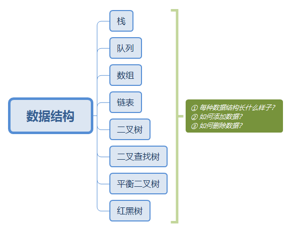

## 5.3 数据结构（栈）

### 5.3.1 概述

* `栈`的特点：`先进后出，后进先出`。

### 5.3.2 演示

* 栈其实是一个容器，它用来存储数据的，这个容器是`一端开头`，我们称之为`栈顶`，还有`一端封闭`，我们称之为`栈底`，如下所示：

 


* 假设现在有 4 个数据，那么它们是怎么存储到栈中，又是怎么从栈中取出的？


* 数据`进入`栈模型的过程，我们称之为`压栈`（进栈、入栈），如下所示：

> [!NOTE]
>
> * ① 栈中最上面的元素，我们称之为栈顶元素。
> * ② 栈中最下面的元素，我们称之为栈底元素。

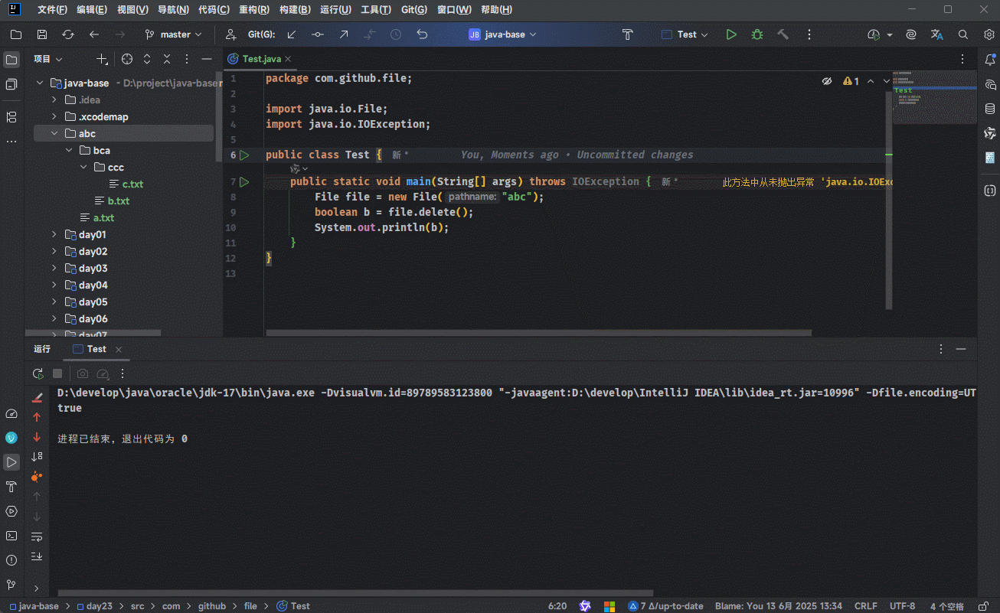

* 数据`离开`栈模型的过程，我们称之为`弹栈`（出栈），如下所示：

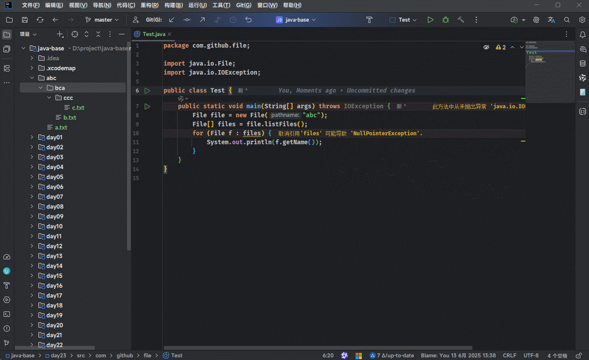

* 栈的完整动画，如下所示：

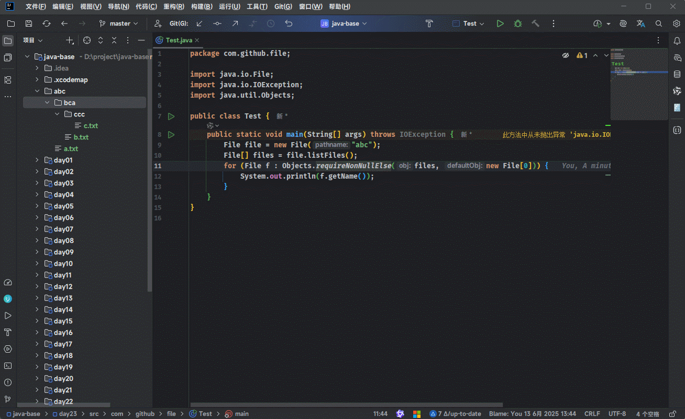

### 5.3.3 应用场景

* 在 Java 语言的内存结构中，有一块区域称为`栈`内存，就是用的`栈`思想，即：方法调用的时候入栈，方法调用完毕出栈，如下所示：

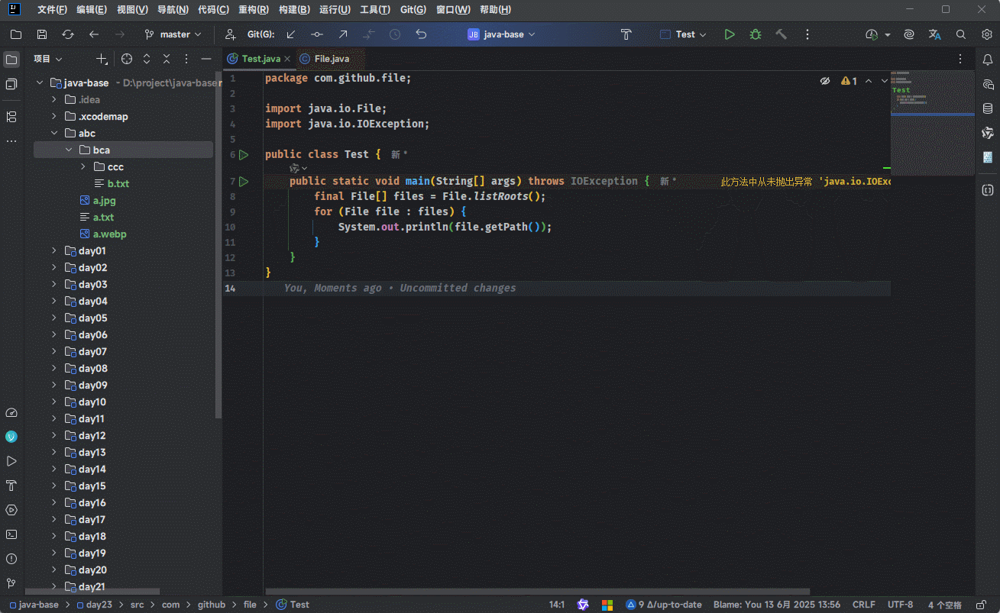


## 5.4 数据结构（队列）

### 5.4.1 概述

* `队列`的特点：`先进先出，后进后出`。

### 5.4.2 演示

* 队列其实是一个容器，它用来存储数据的，这个容器是`两端开头`，其中`一端开头`，我们称之为`后端`，另`一端开头`，我们称之为`前端`，如下所示：


* 假设现在有 4 个数据，那么它们是怎么存储到队列中，又是怎么从队列中取出的？


* 数据从后端`进入`队列模型的过程，我们称之为`入队列`，如下所示：

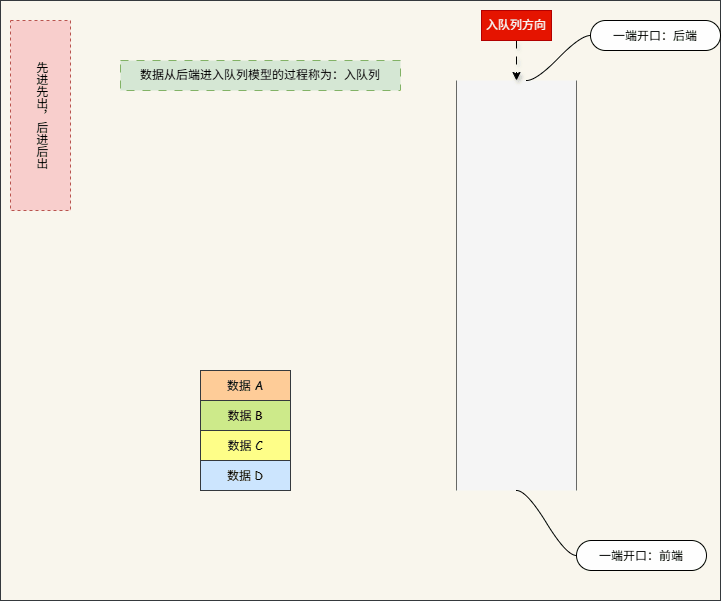

* 数据从前端`离开`队列模型的过程，我们称之为`出队列`，如下所示：

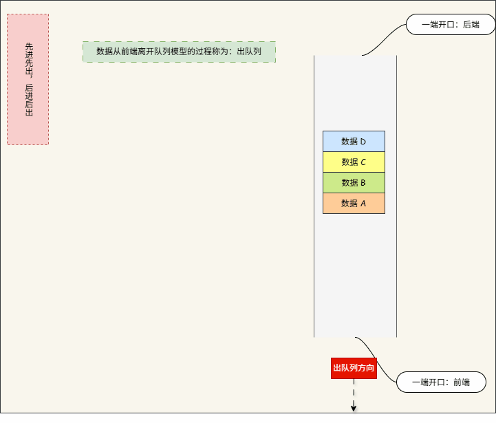

### 5.4.3 应用场景

* 现实生活中的`排队上公交`等场景，应用了`队列`的思想，如下所示：


* 现实生活中的`排队买票`等场景，应用了`队列`的思想，如下所示：

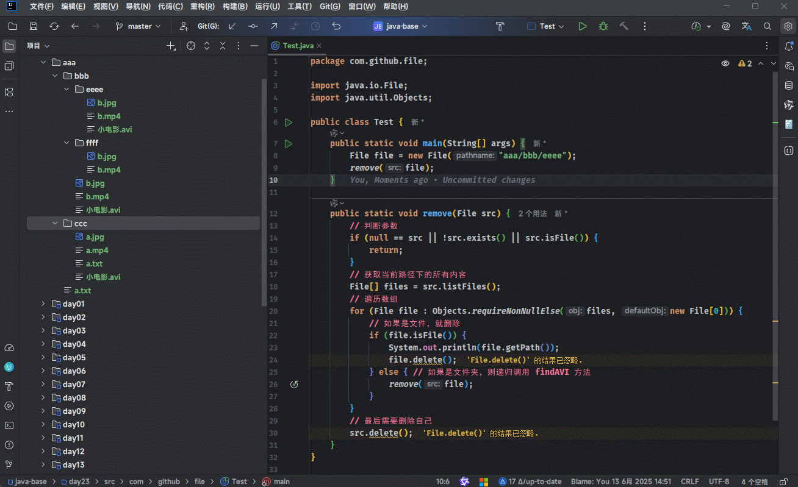

## 5.5 数据结构（数组）

### 5.5.1 概述

* 数组的特点：`查询速度快`、`删除效率低`以及`添加效率低`。

### 5.5.2 演示

* 其中，`查询速度快`指的是在数组中查询数据是通过`地址值`和`索引`进行元素定位的，查询任意数据消耗的时间是相同的。

> [!NOTE]
>
> 数组中的元素在内存中是连续存储的。


* 其中，`删除效率低`指的是如果要将原始数据删除，需要将后面的每个数据前移。

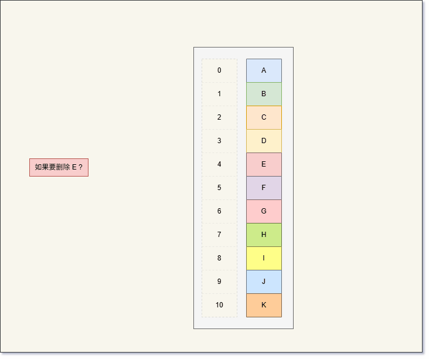

* 其中，`添加效率低`指的是添加位置后的每个元素后移，再添加元素。

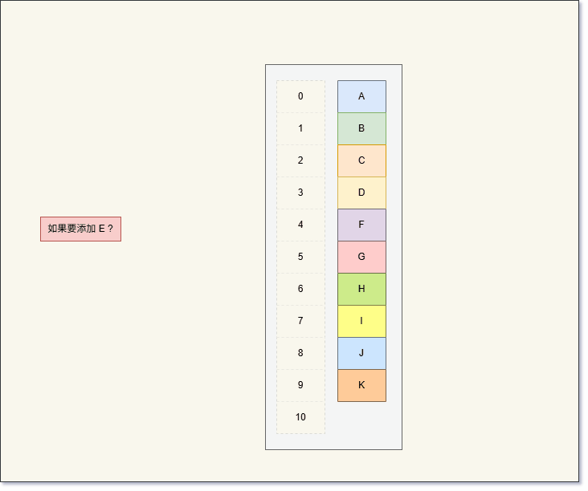

## 5.6 数据结构（链表）

### 5.6.1 概述

* 链表的特点：`查询速度慢`、`删除效率快`以及`添加效率快`。

### 5.6.2 演示

