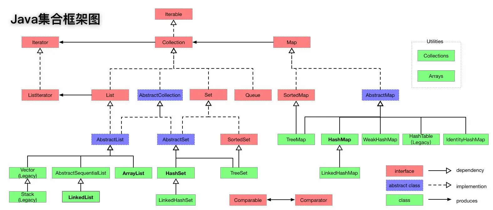

# 第一章：集合体系结构

## 1.1 概述

* 集合是 Java 提供的一种容器，可以用来存储多个数据。集合的本质是用来`存储对象`。

> [!NOTE]
>
> * 【问】：集合只能用来存储对象？为什么也可以存储基本数据类型？
> * 【答】：在 JDK5 的时候，新增了一个特性：自动装箱和自动拆箱。换言之，向集合中添加基本类型数据的时候，会先转换为对应的包装类型对象，然后在进行存储。

* 集合和数组都是容器，它们之间的区别？
  * ① 数组的长度是固定的，集合的长度是可变的。
  * ② 数组中可以存储基本类型的数据，也可以存储对象；但是，集合中只能存储对象。

## 1.2 集合体系结构

* Java 中的集合主要分为两大类：
  * ① Collection（单列集合）：在添加数据的时候，一次只能添加一个数据，如：`脉动`、`康师傅`、`奥利奥`等。
  * ② Map（双列集合）：在添加数据的时候，一次需要添加一对数据，如：`脉动:5元`、`康师傅:12元`、`奥利奥:8.5元`，


* Java 集合框架图，如下所示：

> [!NOTE]
>
> * ① List 系列集合：添加的元素是有序、可重复、有索引。
>   * 有序：`存`和`取`的顺序是一样的，如：存数据是`张三、李四、王五`，那么取数据也是`张三、李四、王五`；和之前学习的`排序`（从小到大或从大到小）没有任何关系。
>   * 可重复：集合存储的元素是可以重复的。
>   * 有索引：可以通过索引去获取集合中的元素。
> * ② Set 系列集合：添加的元素是无序、不重复、无索引。
>   * 无序：`存`和`取`的顺序有可能是不一样，如：存数据是`张三、李四、王五`，那么取数据可能是`张三、王五、李四`。
>   * 不重复：集合存储的元素是不可以重复的。
>   * 无索引：不可以通过索引去获取集合中的元素。




# 第二章：Collection 接口（⭐）

## 2.1 概述

* Collection 接口是 List、Set 接口的父接口，该接口中定义的方法既可以用于操作 List 集合，也可以用于操作 Set 集合。

> [!NOTE]
>
> JDK 不提供此接口的任何直接实现，而是提供更具体的子接口（如：List 、Set 等）实现。


* 由于 JDK 5 增加了 `泛型` 特性，使得 Java 集合可以记住容器中对象的数据类型。

```java
public interface Collection<E> extends Iterable<E> {
    ...
}
```

## 2.2 常用 API

### 2.2.1 添加元素

* 添加元素对象到当前集合中：

```java
boolean add(E e);
```

* 添加另一个集合中的所有元素到当前集合中：

```java
boolean addAll(Collection<? extends E> c);
```


* 示例：

```java
package com.github.collecton;

import java.util.ArrayList;
import java.util.Collection;

public class Test {
    public static void main(String[] args) {
        // 创建集合
        Collection<Integer> coll = new ArrayList<>();
        // 添加元素
        coll.add(1);
        coll.add(2);
        coll.add(3);
        coll.add(4);
        coll.add(5);
        // 打印集合中的元素
        System.out.println(coll); // [1, 2, 3, 4, 5]
    }
}
```


* 示例：

```java
package com.github.collecton;

import java.util.ArrayList;
import java.util.Collection;
import java.util.List;

public class Test {
    public static void main(String[] args) {
        // 创建另一个集合
        List<Integer> list = List.of(1, 2, 3, 4, 5);
        // 创建集合
        Collection<Integer> coll = new ArrayList<>();
        // 给集合添加元素
        coll.add(11);
        coll.add(22);
        coll.add(33);
        // 添加另一个集合中的所有元素到本集合中
        coll.addAll(list);
        // 打印集合中的元素
        System.out.println(coll); // [11, 22, 33, 1, 2, 3, 4, 5]
    }
}
```

### 2.2.2 删除元素

* 从当前集合中删除第一个和 obj 对象匹配（调用 equals() 方法）的元素：

```java
boolean remove(Object o);
```

* 从当前集合中删除所有与 c 集合中相同的元素，即：求差集：

```java
boolean removeAll(Collection<?> c);
```

* 清空集合：

```java
void clear();
```

* 删除满足指定条件的集合中所有元素：

```java
default boolean removeIf(Predicate<? super E> filter) {
    Objects.requireNonNull(filter);
    boolean removed = false;
    final Iterator<E> each = iterator();
    while (each.hasNext()) {
        if (filter.test(each.next())) {
            each.remove();
            removed = true;
        }
    }
    return removed;
}
```


* 示例：

```java
package com.github.collecton;

import java.util.ArrayList;
import java.util.Collection;

public class Test {
    public static void main(String[] args) {
        Collection<String> c1 = new ArrayList<>();
        c1.add("aa");
        c1.add("bb");
        c1.add("cc");
        System.out.println("c1 = " + c1); // c1 = [aa, bb, cc]
        // 删除
        c1.remove("cc");
        System.out.println("c1 = " + c1); // c1 = [aa, bb]

    }
}
```


* 示例：

```java
package com.github.collecton;

import java.util.ArrayList;
import java.util.Collection;

public class Test {
    public static void main(String[] args) {
        Collection<String> c1 = new ArrayList<>();
        c1.add("aa");
        c1.add("bb");
        c1.add("cc");

        Collection<String> c2 = new ArrayList<>();
        c2.add("ee");
        c2.add("ff");

        c1.addAll(c2);

        System.out.println("c1 = " + c1); // c1 = [aa, bb, cc, ee, ff]

        // 求差集
        c1.removeAll(c2);

        System.out.println("c1 = " + c1); // c1 = [aa, bb, cc]

    }
}
```


* 示例：

```java
package com.github.collecton;

import java.util.ArrayList;
import java.util.Collection;

public class Test {
    public static void main(String[] args) {
        Collection<String> c1 = new ArrayList<>();
        c1.add("aa");
        c1.add("bb");
        c1.add("cc");

        System.out.println("c1 = " + c1); // c1 = [aa, bb, cc]

        // 清空集合
        c1.clear();

        System.out.println("c1 = " + c1); // c1 = []

    }
}
```


* 示例：

```java
package com.github.collecton;

import java.util.ArrayList;
import java.util.Collection;

public class Test {
    public static void main(String[] args) {
        Collection<Integer> c1 = new ArrayList<>();

        c1.add(1);
        c1.add(2);
        c1.add(3);
        c1.add(4);
        c1.add(5);

        System.out.println("c1 = " + c1); // c1 = [1, 2, 3, 4, 5]

        // 从集合中删除所有偶数
        c1.removeIf(x -> x % 2 == 0);

        System.out.println("c1 = " + c1); // c1 = [1, 3, 5]
    }
}
```

### 2.2.3 判断

* 判断当前集合是否是空集合（没有任何元素）：

```java
boolean isEmpty();
```

* 判断当前集合是否包含指定的元素：

```java
boolean contains(Object o);
```

* 判断 c 集合中的元素是否都在当前集合中存在，即：c 集合是否是当前集合的子集：

```java
boolean containsAll(Collection<?> c);
```


* 示例：

```java
package com.github.collecton;

import java.util.ArrayList;
import java.util.Collection;

public class Test {
    public static void main(String[] args) {
        Collection<Integer> c1 = new ArrayList<>();

        c1.add(1);
        c1.add(2);
        c1.add(3);
        c1.add(4);
        c1.add(5);

        System.out.println(c1.isEmpty()); // false

        Collection<Integer> c2 = new ArrayList<>();

        System.out.println(c2.isEmpty()); // true
    }
}
```


* 示例：

```java
package com.github.collecton;

import java.util.ArrayList;
import java.util.Collection;

public class Test {
    public static void main(String[] args) {
        Collection<String> c1 = new ArrayList<>();
        c1.add("aa");
        c1.add("bb");
        c1.add("cc");
        c1.add("dd");

        System.out.println("c1 = " + c1.contains("aa")); // c1 = true
        System.out.println("c1 = " + c1.contains("aaa")); // c1 = false
    }
}
```


* 示例：

```java
package com.github.collecton;

import java.util.ArrayList;
import java.util.Collection;

public class Test {
    public static void main(String[] args) {
        Collection<String> c1 = new ArrayList<>();
        c1.add("aa");
        c1.add("bb");
        c1.add("cc");
        c1.add("dd");

        Collection<String> c2 = new ArrayList<>();
        c2.add("aa");
        c2.add("bb");
        c2.add("ee");

        // c1.containsAll(c2) = false
        System.out.println("c1.containsAll(c2) = " + c1.containsAll(c2));

        Collection<String> c3 = new ArrayList<>();
        c3.add("aa");
        c3.add("bb");

        // c1.containsAll(c3) = true
        System.out.println("c1.containsAll(c3) = " + c1.containsAll(c3));
    }
}
```

### 2.2.4 获取集合中元素的个数

* 获取当前集合中实际存储的元素个数：

```java
int size();
```


* 示例：

```java
package com.github.collecton;

import java.util.ArrayList;
import java.util.Collection;

public class Test {
    public static void main(String[] args) {
        Collection<String> c1 = new ArrayList<>();
        c1.add("aa");
        c1.add("bb");
        c1.add("cc");
        c1.add("dd");

        System.out.println("c1.size() = " + c1.size()); // c1.size() = 4

        c1.clear();

        System.out.println("c1.size() = " + c1.size()); // c1.size() = 0
    }
}

```

### 2.2.5 交集

* 当前集合仅保留与 c 集合中的元素相同的元素，即当前集合中仅保留两个集合的交集：

```java
boolean retainAll(Collection<?> c);
```


* 示例：

```java
package com.github.collecton;

import java.util.ArrayList;
import java.util.Collection;

public class Test {
    public static void main(String[] args) {
        Collection<String> c1 = new ArrayList<>();
        c1.add("aa");
        c1.add("bb");
        c1.add("cc");
        c1.add("dd");

        System.out.println("c1 = " + c1); // c1 = [aa, bb, cc, dd]

        Collection<String> c2 = new ArrayList<>();
        c2.add("bb");

        System.out.println("c2 = " + c2); // c2 = [bb]

        c1.retainAll(c2);

        System.out.println("c1 = " + c1); // c1 = [bb]
    }
}
```

### 2.2.6 转数组

* 将当前集合中的所有元素转换为 Object 数组：

```java
Object[] toArray();
```

* 将当前集合中的所有元素转换为对应元素类型的数组（需要自己传递数组的长度）：

```java
<T> T[] toArray(T[] a);
```

* 将当前集合中的所有元素转换为对应元素类型的数组（推荐）：

```java
default <T> T[] toArray(IntFunction<T[]> generator) {
```


* 示例：

```java
package com.github.collecton;

import java.util.ArrayList;
import java.util.Arrays;
import java.util.Collection;

public class Test {
    public static void main(String[] args) {
        Collection<String> c1 = new ArrayList<>();
        c1.add("aa");
        c1.add("bb");
        c1.add("cc");
        c1.add("dd");

        // 将集合中的所有元素转换为 Object 数组
        Object[] arr = c1.toArray();

        System.out.println(Arrays.toString(arr)); // [aa, bb, cc, dd]
    }
}
```


* 示例：

```java
package com.github.collecton;

import java.util.ArrayList;
import java.util.Arrays;
import java.util.Collection;

public class Test {
    public static void main(String[] args) {
        Collection<String> c1 = new ArrayList<>();
        c1.add("aa");
        c1.add("bb");
        c1.add("cc");
        c1.add("dd");

        // 将集合中的所有元素转换为 String 数组
        String[] arr = c1.toArray(new String[c1.size()]);

        System.out.println(Arrays.toString(arr)); // [aa, bb, cc, dd]
    }
}
```


* 示例：

```java
package com.github.collecton;

import java.util.ArrayList;
import java.util.Arrays;
import java.util.Collection;

public class Test {
    public static void main(String[] args) {
        Collection<String> c1 = new ArrayList<>();
        c1.add("aa");
        c1.add("bb");
        c1.add("cc");
        c1.add("dd");
        c1.add("ee");

        // 将集合中的所有元素转换为 String 数组
        String[] arr = c1.toArray(String[]::new);

        System.out.println(Arrays.toString(arr)); // [aa, bb, cc, dd, ee]
    }
}
```

