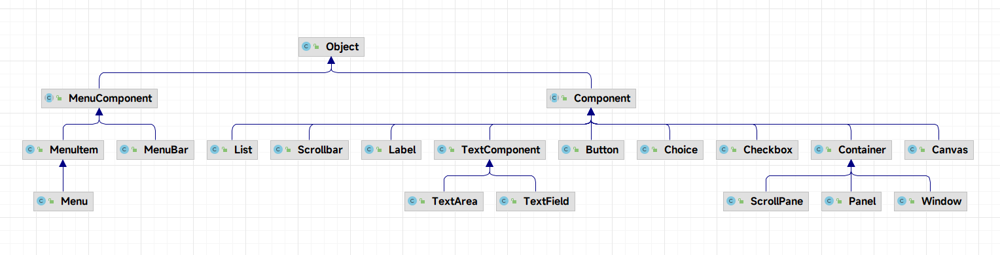
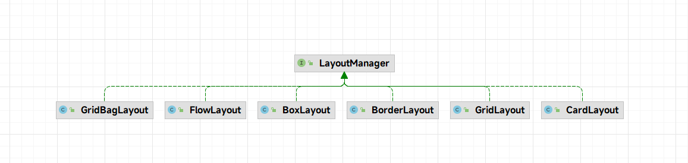
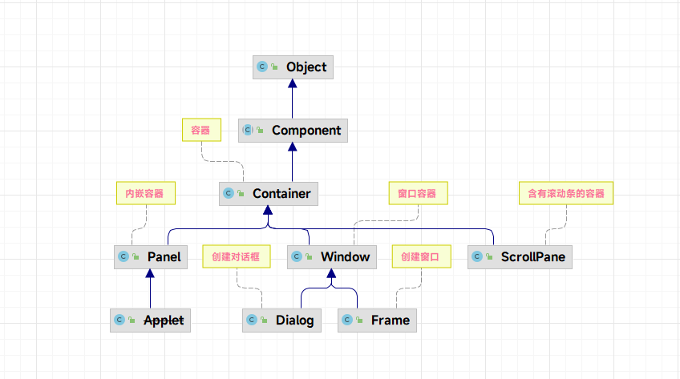
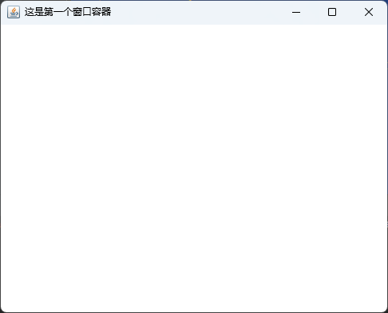
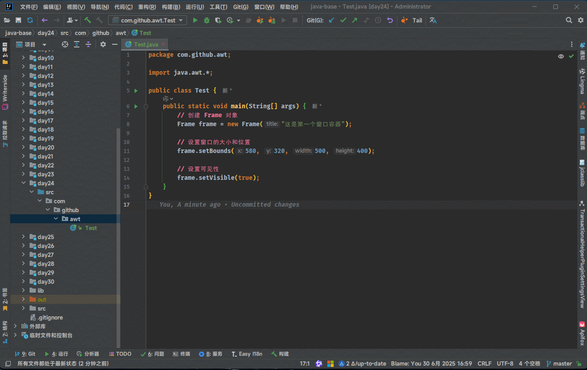
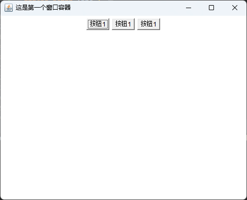
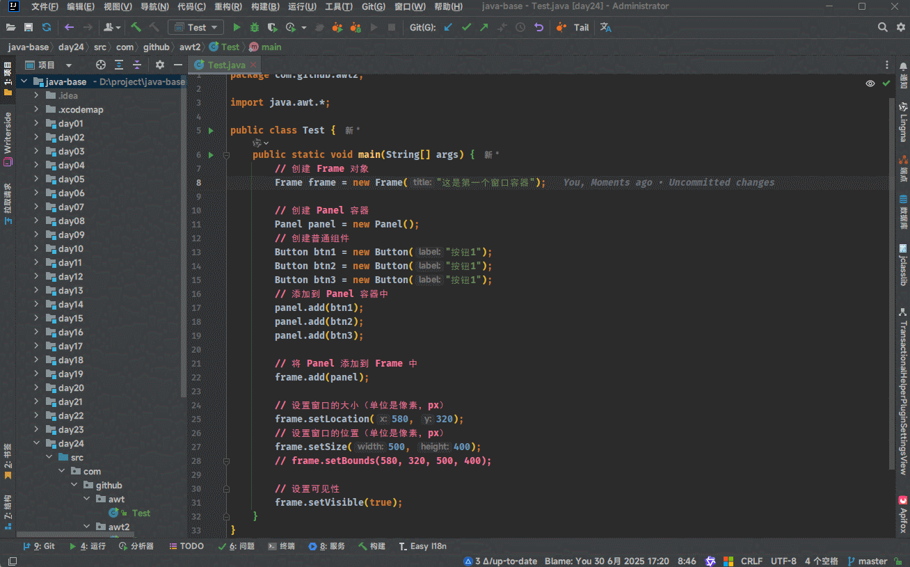

> [!IMPORTANT]
>
> * ① JDK 的版本是 `JDK17` ，IDEA 的版本是 `2024.1+`。
> * ② 前置知识：HTML 、CSS 以及 JavaScript 。

# 第一章：Java 图形化界面

## 1.1 概述

* 如果我们想要使用 Java 来编写富客户端图形用户界面（GUI），则需要使用 GUI 工具包。
* 在 Java 中，常用的 GUI 工具包，如下所示：
  * ① AWT（Abstract Window Toolkit）：抽象窗口工具包。
  * ② Swing。
  * ③ JavaFX。
  * ④ SWT（Standard Widget Toolkit）：标准小部件工具包。

> [!NOTE]
>
> * ① AWT 是第一代 Java GUI 工具包，Swing 是第二代 Java GUI 工具包，JavaFX 是第三代 Java GUI 工具包，这些都是成熟的、得到良好支持的、标准的 Java GUI 工具。
> * ② AWT 和 Swing 是内置在 JavaSE 标准版中，而 JavaFX 已经从标准版中移除，交由社区来独立开发和维护。
> * ③ JDK 有很多版本，如：OpenJDK、Azul Zulu、AdoptOpenJDK、Red Hat OpenJDK 以及 [Liberica JDK](https://bell-sw.com/) ，虽然它们都是基于 Oracle 的 OpenJDK，但是它们的区别在于：
>   * 包含或排除 JFX 和 JFR 等组件。
>   * 所提供支持的类型和速度。
>   * 更新速率和速度。
>   * 安全以及特性。
> * ④ 其中，[Liberica JDK](https://bell-sw.com/) 内置了 JFX 组件。

## 1.2 AWT

* AWT 自 Java 1.0 以来就一直存在，是第一代 GUI 工具包。
* AWT 组件通常被认为是“重量级”组件，因为其是直接在原生的用户界面上提供了一个非常薄的抽象层，如：生成一个 AWT 的复选框会导致 AWT 直接调用操作系统原生程序来生成复选框。这会导致一个问题：GUI 组件的外观由系统系统决定，在 Windows 上运行，按钮看起来像 Windows 按钮；在 Mac 上运行，按钮看起来像 Mac 按钮。
* 这种糟糕的设计选择使得拥护 Java “一次编写，到处运行（write once, run everywhere）” 信条的程序员们感觉并不爽，因为 AWT 并不能保证他们的应用在各种平台上表现一致。一个 AWT 应用可能在 Windows 上表现很好，但是到了 Mac 上几乎不能使用或者正好相反。
* AWT 工具包，包括：GUI 组件、用于在屏幕上调整这些组件大小和位置的布局管理器，以及用于处理来自这些组件的事件的类。AWT 还提供对字体、颜色、图像、数据传输、拖放以及 2D 和 3D 几何图形的支持。
* 较旧的 GUI 应用程序主要使用 AWT 编写。但是，`AWT 已经过时`，因此在开发新应用程序时绝对应避免使用。

## 1.3 Swing

* Swing 是继 AWT 之后下一代 GUI 工具包。它是在 Java 1.2 中引入的。Swing 提供了比 AWT 更丰富的 GUI 组件集。
* Swing 组件被视为“轻量级”组件，因为 Swing 不需要作系统窗口工具包的本机资源。Swing GUI 元素是用 Java 编写的，没有本机代码（Swing GUI 使用 Java 2D API 绘制其组件，而 Java 2D API 又调用低级作系统绘制函数）。
* 由于纯 Java 设计，Swing 具有较少的特定于平台的限制，并且比 AWT 更具可移植性。`大多数现有的 Java GUI 应用程序都基于 Swing，如：IDEA 就是基于 Swing。`

## 1.4 JavaFx

* JavaFX 旨在取代 Swing 成为 Java SE 的标准 GUI 库。`大多数新的 Java GUI 应用程序都基于 JavaFX` 。
* 与 Swing 相比，JavaFX 具有许多优点。它更轻量级，并且具有更复杂的设计控制。它对组件使用 CSS 样式，并且 XML 可用于开发 GUI 布局（使用 FXML 和 Scene Builder）。
* Swing 只能用于创建富客户端桌面应用程序。JavaFX 可用于创建相同的富桌面应用程序，以及可在各种设备上运行的富 Web 应用程序。
* JavaFX 既是基于 Web 的开发的替代方案，也是用于构建 GUI 桌面/移动应用程序的其他工具包的替代方案。
* 从 Java 11 开始，JavaFX 是一个独立的组件，必须单独下载。JavaFX 是 OpenJFX 项目下开源 OpenJDK 的一部分。JavaFX 支持 Linux、Windows、MacOS、Android、iOS 和嵌入式 Raspberry Pi（树莓派）。但是，Swing 仅支持前三个平台。

## 1.5 SWT

* SWT 是 Java 富客户端 GUI 工具包的第三方库，由 Eclipse 基金会维护。其中，最著名的基于 SWT 的应用程序就是 [Eclipse IDE](https://eclipseide.org/)。

> [!NOTE]
>
> * ① Eclipse IDE 拥有强大的插件生态系统，可扩展支持当今多数主流编程语言，是一个通用性极强的开发平台。
> * ② 具体支持的编程语言，如下所示：
>   * Java（原生支持）
>   * C/C++（通过 CDT 插件）
>   * Python（通过 PyDev 插件）
>   * JavaScript、TypeScript（通过 Wild Web Developer 插件） 
>   * PHP（通过 PDT 插件）
>   * Ruby、Perl 等（通过相应插件）
> * ③ 但是，某些语言的支持程度和开发体验可能不如专门为该语言设计的 IDE，如：Python 更适合用 PyCharm，JavaScript/TypeScript 更适合用 VSCode。

* SWT 是一个跨平台的 GUI 库，用于基于 JVM 的桌面应用程序。SWT 是围绕重量级本机代码对象编写的轻量级 Java 包装器。因此，SWT 小部件也被视为重量级组件。
* 如果本机平台 GUI 库不提供所需的 SWT 功能，则 SWT 将实现自己的 Java 代码，类似于 Swing 。SWT 使程序员接触到比 Swing 更多的低级本机 GUI 代码。
* SWT 是 AWT 的低级性能和外观与 Swing 的高级易用性之间的折衷方案。


# 第二章：AWT

## 2.1 AWT 的继承体系

* `AWT`相关的类都在`java.awt`包及其子包中，其中基类是`Component`和`MenuComponent`。

> [!NOTE]
>
> * ① Component：代表一个能以图形化方式出现出来，并且可以和用户交互的对象（组件），如：Button 代表一个按钮，而 TextField 代表一个文本框。
> * ② MenuComponent：代表图形界面的菜单组件，如：MenuBar 代表菜单条，而 MenuItem 代表菜单项。
> * ③ Container 是一种特殊的 Component，它代表一种容器，可以存放普通的 Component。



* `AWT`中还有一个非常重要的接口`LayoutManager`（布局管理器），即：如果一个容器中有多个组件，该容器就需要使用`LayoutManager`来管理这些组件的布局方式。



## 2.2 Container 容器

### 2.2.1 概述

* Container 容器的继承体系，如下所示：



* 其中，Window 是可以独立存在的顶级窗口，默认使用 BorderLayout 管理其内部组件布局。
* 其中，Panel 可以容纳其他组件，但是不能独立存在，必须嵌在其他容器中使用，默认使用 FlowLayout 管理其内部组件布局。
* 其中，ScrollPanel 是一个带滚动条的容器，也不能独立存在，默认使用 BorderLayout 管理其内部组件布局。

### 2.2.2 常用 API

* Component 作为基类，提供如下的方法来设置组件的大小、位置以及可见性：

| 方法签名                                                     | 描述                     |
| ------------------------------------------------------------ | ------------------------ |
| `public void setLocation(int x, int y) {}`                   | 设置组件的位置           |
| `public void setLocation(Point p) {}`                        | 设置组件的位置           |
| `public void setSize(int width, int height) {}`              | 设置组件的大小           |
| `public void setSize(Dimension d) {}`                        | 设置组件的大小           |
| `public void setBounds(int x, int y, int width, int height) {}` | 同时设置组件的位置和大小 |
| `public void setBounds(Rectangle r) {}`                      | 同时设置组件的位置和大小 |
| `public void setVisible(boolean b) {}`                       | 设置组件的可见性         |

* Container 作为容器根类，提供了如下的方法来存储组件以及访问容器中的组件：

| 方法签名                                           | 描述                                                         |
| -------------------------------------------------- | ------------------------------------------------------------ |
| `public Component add(Component comp) {}`          | 向容器中添加其他组件，可以是普通组件，也可以是容器，返回被添加的组件 |
| `public Component getComponentAt(int x, int y) {}` | 返回指定位置处的组件                                         |
| `public Component getComponent(int n) {}`          | 返回指定索引处的组件                                         |
| `public Component[] getComponents() {}`            | 返回容器内的所有组件                                         |
| `public int getComponentCount() {}`                | 返回容器内组件的数量                                         |

### 2.2.3 综合练习

#### 2.2.3.1 综合练习一

* 需求：显示窗口容器。




* 示例：

::: code-group

```java [Test.java]
package com.github.awt;

import java.awt.*;

public class Test {
    public static void main(String[] args) {
        // 创建 Frame 对象
        Frame frame = new Frame("这是第一个窗口容器");

        // 设置窗口的大小（单位是像素，px）
        frame.setLocation(580, 320);
        // 设置窗口的位置（单位是像素，px）
        frame.setSize(500, 400);
        // frame.setBounds(580, 320, 500, 400);

        // 设置可见性
        frame.setVisible(true);
    }
}
```

```md:img [cmd 控制台]

```

:::

#### 2.2.3.2 综合练习二

* 需求：容器中需要包含其它组件。

> [!NOTE]
>
> * ① Panel 等内嵌容器是可以包含其他容器的。
> * ② Panel 等内嵌容器是不能独立存在的，必须依附于 Window 窗口容器。
> * ③ AWT 出现的时候太早了，那个时候并没有过多的考虑中文；我们在 IDEA 中默认使用的编码是 UTF-8，但是 AWT 是运行在 Windows 操作系统上的（简体中文版，默认的编码是 GBK），可能会造成乱码；其解决方案就是增加一个 JVM 参数`-Dfile.encoding=GBK` 。




* 示例：

::: code-group

```java [Test.java]
package com.github.awt2;

import java.awt.*;

public class Test {
    public static void main(String[] args) {
        // 创建 Frame 对象
        Frame frame = new Frame("这是第一个窗口容器");

        // 创建 Panel 容器
        Panel panel = new Panel();
        // 创建普通组件
        Button btn1 = new Button("按钮1");
        Button btn2 = new Button("按钮1");
        Button btn3 = new Button("按钮1");
        // 添加到 Panel 容器中
        panel.add(btn1);
        panel.add(btn2);
        panel.add(btn3);

        // 将 Panel 添加到 Frame 中
        frame.add(panel);

        // 设置窗口的大小（单位是像素，px）
        frame.setLocation(580, 320);
        // 设置窗口的位置（单位是像素，px）
        frame.setSize(500, 400);
        // frame.setBounds(580, 320, 500, 400);

        // 设置可见性
        frame.setVisible(true);
    }
}
```

```md:img [cmd 控制台]

```

:::


