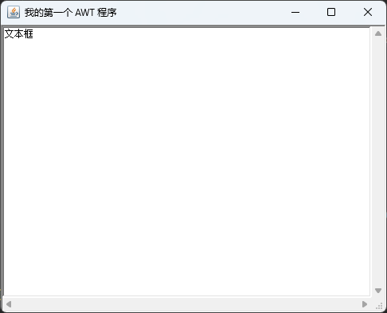
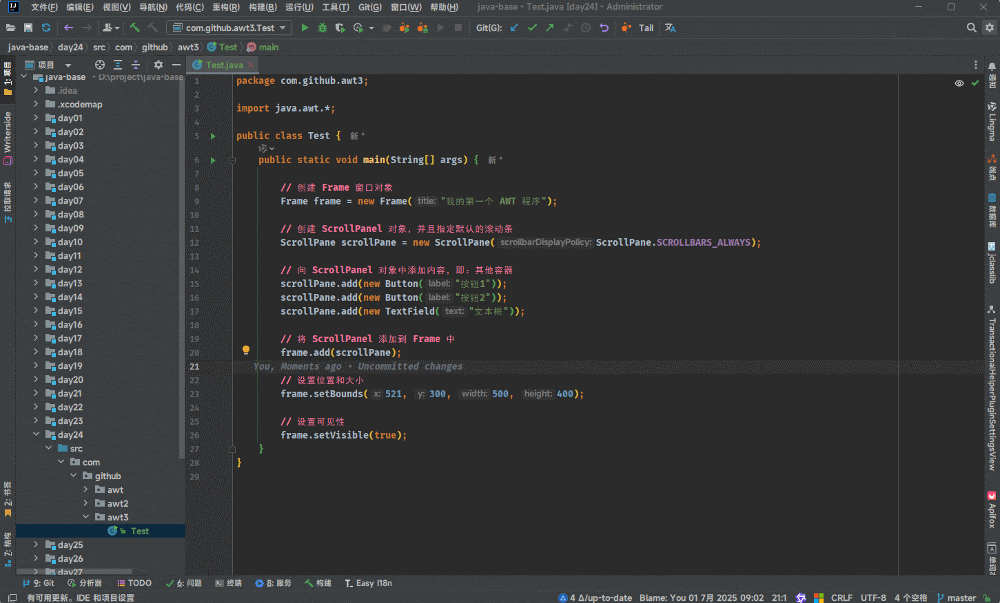
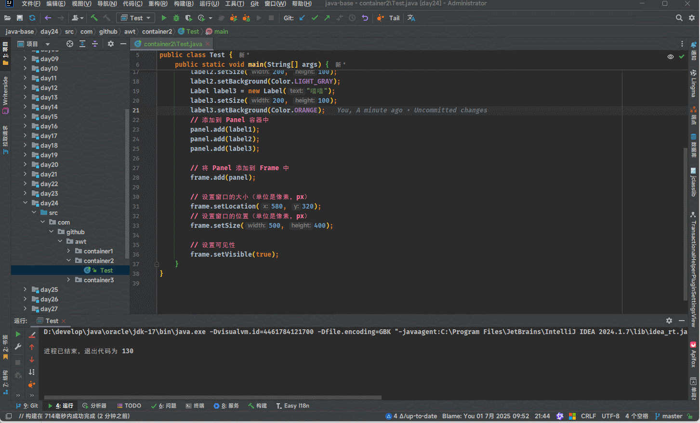
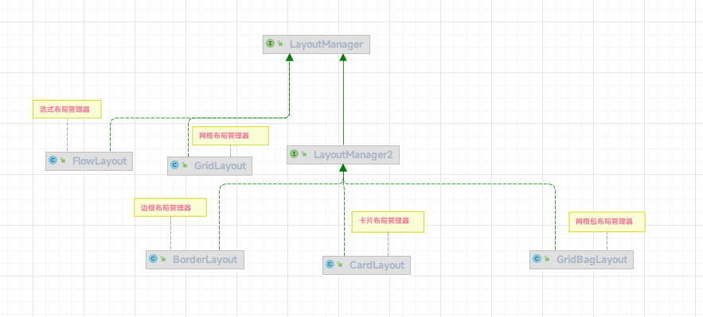
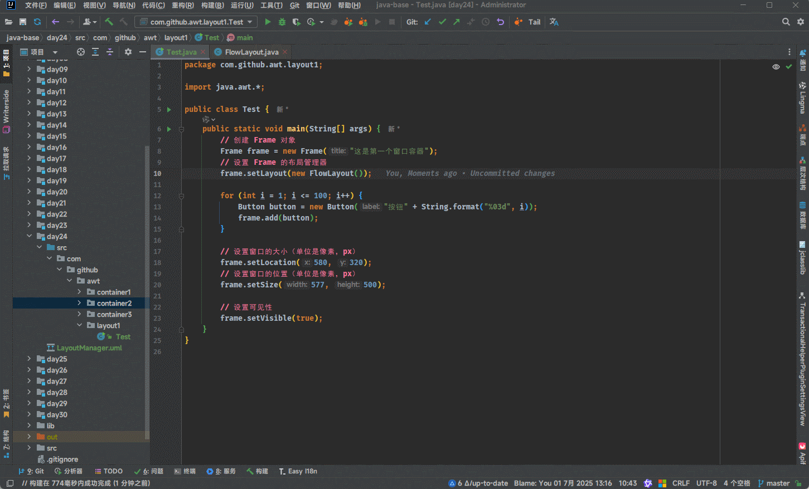
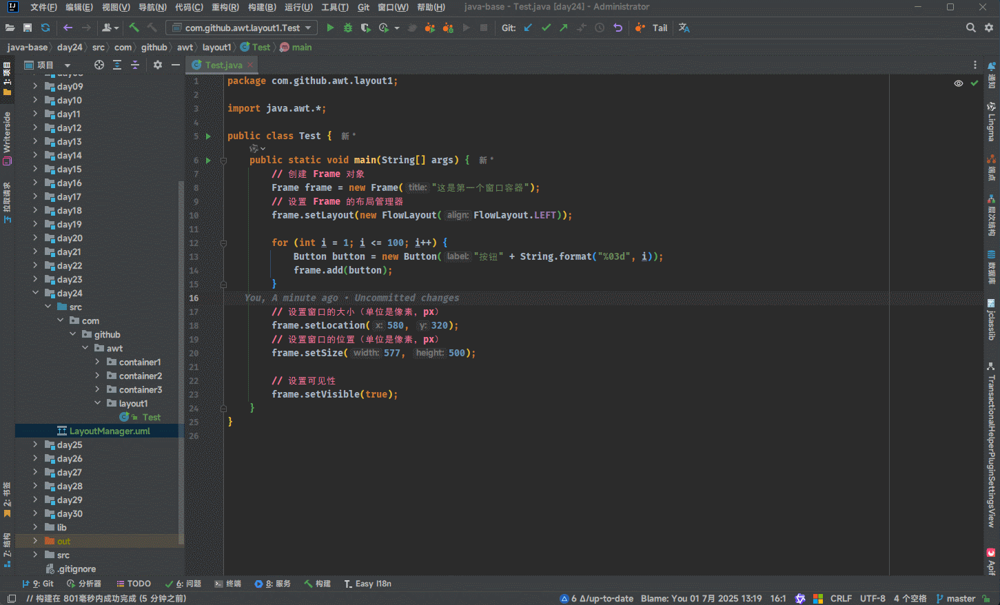
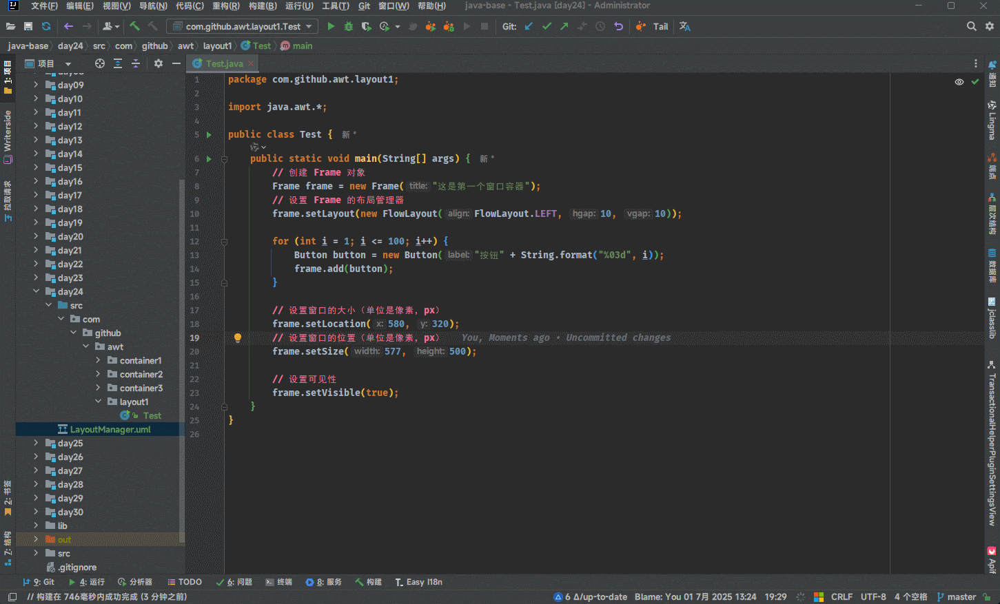
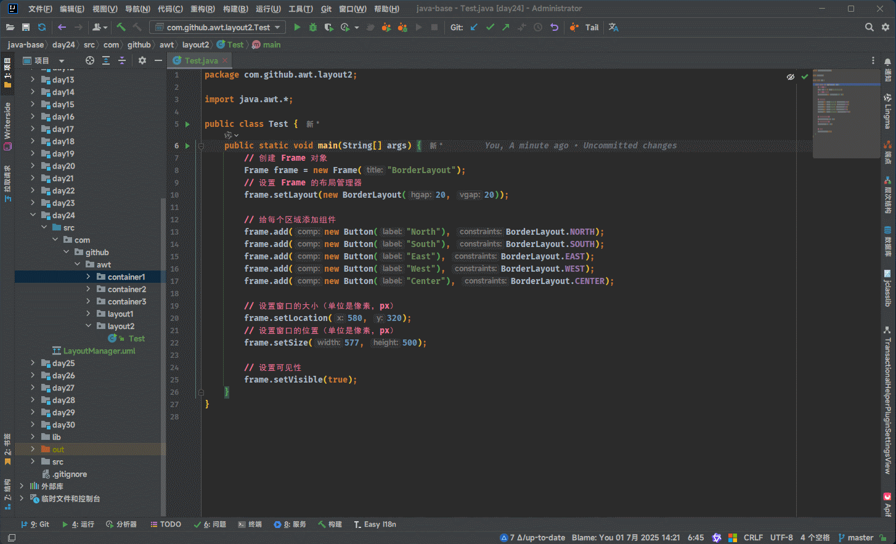
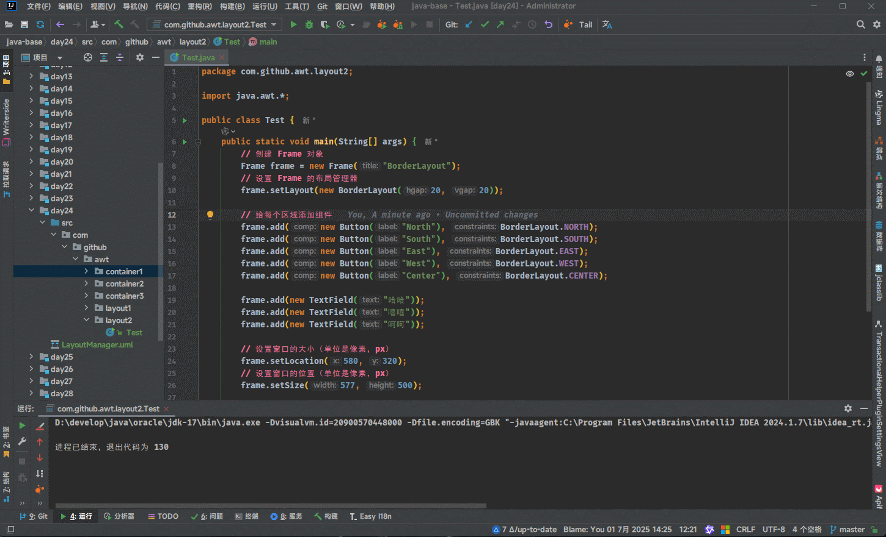
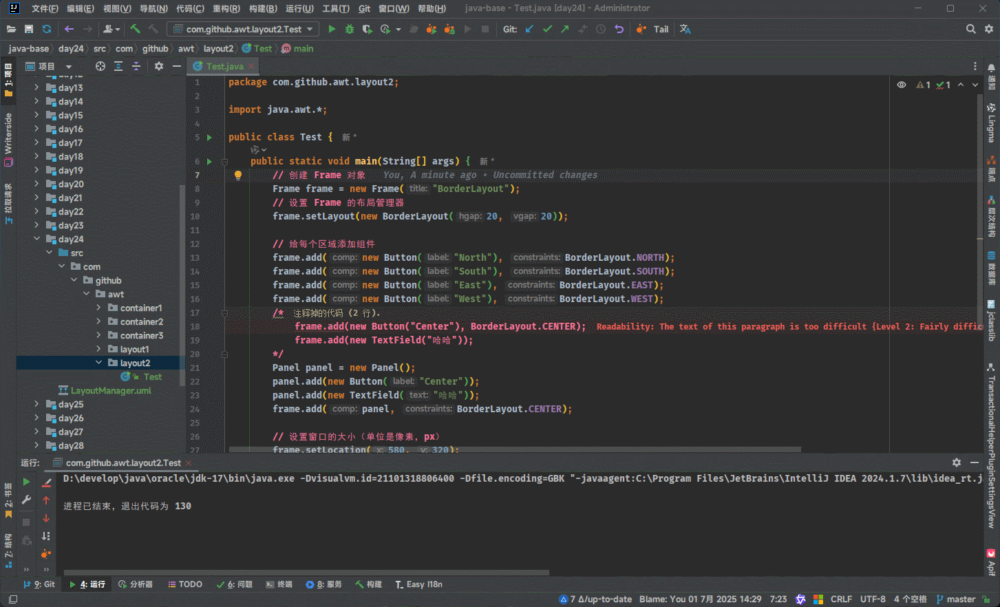

> [!IMPORTANT]
>
> * ① JDK 的版本是 `JDK17` ，IDEA 的版本是 `2024.1+`。
> * ② 前置知识：HTML 、CSS 以及 JavaScript 。

# 第一章：Java 图形化界面

## 1.1 概述

* 如果我们想要使用 Java 来编写富客户端图形用户界面（GUI），则需要使用 GUI 工具包。
* 在 Java 中，常用的 GUI 工具包，如下所示：
  * ① AWT（Abstract Window Toolkit）：抽象窗口工具包。
  * ② Swing。
  * ③ JavaFX。
  * ④ SWT（Standard Widget Toolkit）：标准小部件工具包。

> [!NOTE]
>
> * ① AWT 是第一代 Java GUI 工具包，Swing 是第二代 Java GUI 工具包，JavaFX 是第三代 Java GUI 工具包，这些都是成熟的、得到良好支持的、标准的 Java GUI 工具。
> * ② AWT 和 Swing 是内置在 JavaSE 标准版中，而 JavaFX 已经从标准版中移除，交由社区来独立开发和维护。
> * ③ JDK 有很多版本，如：OpenJDK、Azul Zulu、AdoptOpenJDK、Red Hat OpenJDK 以及 [Liberica JDK](https://bell-sw.com/) ，虽然它们都是基于 Oracle 的 OpenJDK，但是它们的区别在于：
>   * 包含或排除 JFX 和 JFR 等组件。
>   * 所提供支持的类型和速度。
>   * 更新速率和速度。
>   * 安全以及特性。
> * ④ 其中，[Liberica JDK](https://bell-sw.com/) 内置了 JFX 组件。

## 1.2 AWT

* AWT 自 Java 1.0 以来就一直存在，是第一代 GUI 工具包。
* AWT 组件通常被认为是“重量级”组件，因为其是直接在原生的用户界面上提供了一个非常薄的抽象层，如：生成一个 AWT 的复选框会导致 AWT 直接调用操作系统原生程序来生成复选框。这会导致一个问题：GUI 组件的外观由系统系统决定，在 Windows 上运行，按钮看起来像 Windows 按钮；在 Mac 上运行，按钮看起来像 Mac 按钮。
* 这种糟糕的设计选择使得拥护 Java “一次编写，到处运行（write once, run everywhere）” 信条的程序员们感觉并不爽，因为 AWT 并不能保证他们的应用在各种平台上表现一致。一个 AWT 应用可能在 Windows 上表现很好，但是到了 Mac 上几乎不能使用或者正好相反。
* AWT 工具包，包括：GUI 组件、用于在屏幕上调整这些组件大小和位置的布局管理器，以及用于处理来自这些组件的事件的类。AWT 还提供对字体、颜色、图像、数据传输、拖放以及 2D 和 3D 几何图形的支持。
* 较旧的 GUI 应用程序主要使用 AWT 编写。但是，`AWT 已经过时`，因此在开发新应用程序时绝对应避免使用。

## 1.3 Swing

* Swing 是继 AWT 之后下一代 GUI 工具包。它是在 Java 1.2 中引入的。Swing 提供了比 AWT 更丰富的 GUI 组件集。
* Swing 组件被视为“轻量级”组件，因为 Swing 不需要作系统窗口工具包的本机资源。Swing GUI 元素是用 Java 编写的，没有本机代码（Swing GUI 使用 Java 2D API 绘制其组件，而 Java 2D API 又调用低级作系统绘制函数）。
* 由于纯 Java 设计，Swing 具有较少的特定于平台的限制，并且比 AWT 更具可移植性。`大多数现有的 Java GUI 应用程序都基于 Swing，如：IDEA 就是基于 Swing。`

## 1.4 JavaFx

* JavaFX 旨在取代 Swing 成为 Java SE 的标准 GUI 库。`大多数新的 Java GUI 应用程序都基于 JavaFX` 。
* 与 Swing 相比，JavaFX 具有许多优点。它更轻量级，并且具有更复杂的设计控制。它对组件使用 CSS 样式，并且 XML 可用于开发 GUI 布局（使用 FXML 和 Scene Builder）。
* Swing 只能用于创建富客户端桌面应用程序。JavaFX 可用于创建相同的富桌面应用程序，以及可在各种设备上运行的富 Web 应用程序。
* JavaFX 既是基于 Web 的开发的替代方案，也是用于构建 GUI 桌面/移动应用程序的其他工具包的替代方案。
* 从 Java 11 开始，JavaFX 是一个独立的组件，必须单独下载。JavaFX 是 OpenJFX 项目下开源 OpenJDK 的一部分。JavaFX 支持 Linux、Windows、MacOS、Android、iOS 和嵌入式 Raspberry Pi（树莓派）。但是，Swing 仅支持前三个平台。

## 1.5 SWT

* SWT 是 Java 富客户端 GUI 工具包的第三方库，由 Eclipse 基金会维护。其中，最著名的基于 SWT 的应用程序就是 [Eclipse IDE](https://eclipseide.org/)。

> [!NOTE]
>
> * ① Eclipse IDE 拥有强大的插件生态系统，可扩展支持当今多数主流编程语言，是一个通用性极强的开发平台。
> * ② 具体支持的编程语言，如下所示：
>   * Java（原生支持）
>   * C/C++（通过 CDT 插件）
>   * Python（通过 PyDev 插件）
>   * JavaScript、TypeScript（通过 Wild Web Developer 插件） 
>   * PHP（通过 PDT 插件）
>   * Ruby、Perl 等（通过相应插件）
> * ③ 但是，某些语言的支持程度和开发体验可能不如专门为该语言设计的 IDE，如：Python 更适合用 PyCharm，JavaScript/TypeScript 更适合用 VSCode。

* SWT 是一个跨平台的 GUI 库，用于基于 JVM 的桌面应用程序。SWT 是围绕重量级本机代码对象编写的轻量级 Java 包装器。因此，SWT 小部件也被视为重量级组件。
* 如果本机平台 GUI 库不提供所需的 SWT 功能，则 SWT 将实现自己的 Java 代码，类似于 Swing 。SWT 使程序员接触到比 Swing 更多的低级本机 GUI 代码。
* SWT 是 AWT 的低级性能和外观与 Swing 的高级易用性之间的折衷方案。


# 第二章：AWT

## 2.1 AWT 的继承体系

* `AWT`相关的类都在`java.awt`包及其子包中，其中基类是`Component`和`MenuComponent`。

> [!NOTE]
>
> * ① Component：代表一个能以图形化方式出现出来，并且可以和用户交互的对象（组件），如：Button 代表一个按钮，而 TextField 代表一个文本框。
> * ② MenuComponent：代表图形界面的菜单组件，如：MenuBar 代表菜单条，而 MenuItem 代表菜单项。
> * ③ Container 是一种特殊的 Component，它代表一种容器，可以存放普通的 Component。


* `AWT`中还有一个非常重要的接口`LayoutManager`（布局管理器），即：如果一个容器中有多个组件，该容器就需要使用`LayoutManager`来管理这些组件的布局方式。


## 2.2 Container 容器

### 2.2.1 概述

* Container 容器的继承体系，如下所示：


* 其中，Window 是可以独立存在的顶级窗口，默认使用 BorderLayout 管理其内部组件布局。
* 其中，Panel 可以容纳其他组件，但是不能独立存在，必须嵌在其他容器中使用，默认使用 FlowLayout 管理其内部组件布局。
* 其中，ScrollPane 是一个带滚动条的容器，也不能独立存在，默认使用 BorderLayout 管理其内部组件布局。

### 2.2.2 常用 API

* Component 作为基类，提供如下的方法来设置组件的大小、位置以及可见性：

| 方法签名                                                     | 描述                     |
| ------------------------------------------------------------ | ------------------------ |
| `public void setLocation(int x, int y) {}`                   | 设置组件的位置           |
| `public void setLocation(Point p) {}`                        | 设置组件的位置           |
| `public void setSize(int width, int height) {}`              | 设置组件的大小           |
| `public void setSize(Dimension d) {}`                        | 设置组件的大小           |
| `public void setBounds(int x, int y, int width, int height) {}` | 同时设置组件的位置和大小 |
| `public void setBounds(Rectangle r) {}`                      | 同时设置组件的位置和大小 |
| `public void setVisible(boolean b) {}`                       | 设置组件的可见性         |

* Container 作为容器根类，提供了如下的方法来存储组件以及访问容器中的组件：

| 方法签名                                           | 描述                                                         |
| -------------------------------------------------- | ------------------------------------------------------------ |
| `public Component add(Component comp) {}`          | 向容器中添加其他组件，可以是普通组件，也可以是容器，返回被添加的组件 |
| `public Component getComponentAt(int x, int y) {}` | 返回指定位置处的组件                                         |
| `public Component getComponent(int n) {}`          | 返回指定索引处的组件                                         |
| `public Component[] getComponents() {}`            | 返回容器内的所有组件                                         |
| `public int getComponentCount() {}`                | 返回容器内组件的数量                                         |

### 2.2.3 综合练习

#### 2.2.3.1 综合练习一

* 需求：显示窗口容器。


* 示例：

::: code-group

```java [Test.java]
package com.github.awt;

import java.awt.*;

public class Test {
    public static void main(String[] args) {
        // 创建 Frame 对象
        Frame frame = new Frame("这是第一个窗口容器");

        // 设置窗口的大小（单位是像素，px）
        frame.setLocation(580, 320);
        // 设置窗口的位置（单位是像素，px）
        frame.setSize(500, 400);
        // frame.setBounds(580, 320, 500, 400);

        // 设置可见性
        frame.setVisible(true);
    }
}
```

```md:img [cmd 控制台]

```

:::

#### 2.2.3.2 综合练习二

* 需求：容器中需要包含其它组件，即：面板。

> [!NOTE]
>
> * ① Panel 等内嵌容器是可以包含其他容器的。
> * ② Panel 等内嵌容器是不能独立存在的，必须依附于 Window 窗口容器。
> * ③ AWT 出现的时候太早了，那个时候并没有过多的考虑中文；我们在 IDEA 中默认使用的编码是 UTF-8，但是 AWT 是运行在 Windows 操作系统上的（简体中文版，默认的编码是 GBK），可能会造成乱码；其解决方案就是增加一个 JVM 参数`-Dfile.encoding=GBK` 。


* 示例：

::: code-group

```java [Test.java]
package com.github.awt2;

import java.awt.*;

public class Test {
    public static void main(String[] args) {
        // 创建 Frame 对象
        Frame frame = new Frame("这是第一个窗口容器");

        // 创建 Panel 容器
        Panel panel = new Panel();
        // 创建普通组件
        Button btn1 = new Button("按钮1");
        Button btn2 = new Button("按钮1");
        Button btn3 = new Button("按钮1");
        // 添加到 Panel 容器中
        panel.add(btn1);
        panel.add(btn2);
        panel.add(btn3);

        // 将 Panel 添加到 Frame 中
        frame.add(panel);

        // 设置窗口的大小（单位是像素，px）
        frame.setLocation(580, 320);
        // 设置窗口的位置（单位是像素，px）
        frame.setSize(500, 400);
        // frame.setBounds(580, 320, 500, 400);

        // 设置可见性
        frame.setVisible(true);
    }
}
```

```md:img [cmd 控制台]

```

:::

#### 2.2.3.3 综合练习三

* 需求：实现有滚动条的容器，即：滚动窗格。

> [!NOTE]
>
> * ① 虽然向 ScrollPane 容器中添加了多个组件；但是，却只看到最后一个容器，而看不到其它的容器，这就是因为 ScrollPane 默认使用 BorderLayout 布局管理器来管理内部组件的布局方式，即：BorderLayout 导致了该容器中只有一个组件被显示出来。
> * ② 之前说过：如果一个容器中有多个组件，该容器就需要使用`LayoutManager`来管理这些组件的布局方式；而 BorderLayout  就是 ScrollPane  的默认 LayoutManager 。




* 示例：

::: code-group

```java [Test.java]
package com.github.awt.container3;

import java.awt.*;

public class Test {
    public static void main(String[] args) {

        // 创建 Frame 窗口对象
        Frame frame = new Frame("我的第一个 AWT 程序");

        // 创建 ScrollPane 对象，并且指定默认的滚动条
        ScrollPane scrollPane = new ScrollPane(ScrollPane.SCROLLBARS_ALWAYS);

        // 向 ScrollPane 对象中添加内容，即：其他容器
        scrollPane.add(new Button("按钮1"));
        scrollPane.add(new Button("按钮2"));
        scrollPane.add(new TextField("文本框"));

        // 将 ScrollPane 添加到 Frame 中
        frame.add(scrollPane);

        // 设置位置和大小
        frame.setBounds(521, 300, 500, 400);

        // 设置可见性
        frame.setVisible(true);
    }
}
```

```md:img [cmd 控制台]

```

:::

## 2.3 LayoutManager 布局管理器

### 2.3.1 概述

* 假设现在需要在 GUI 上显示 Label 组件，如下所示：

::: code-group

```java [Test.java]
package com.github.awt.container2;

import java.awt.*;

public class Test {
    public static void main(String[] args) {
        // 创建 Frame 对象
        Frame frame = new Frame("这是第一个窗口容器");

        // 创建 Panel 容器
        Panel panel = new Panel();
        // 创建普通组件
        Label label1 = new Label("哈哈"); // [!code highlight:9]
        label1.setSize(200, 100);
        label1.setBackground(Color.pink);
        Label label2 = new Label("呵呵");
        label2.setSize(200, 100);
        label2.setBackground(Color.LIGHT_GRAY);
        Label label3 = new Label("嘻嘻");
        label3.setSize(200, 100);
        label3.setBackground(Color.ORANGE);
        // 添加到 Panel 容器中
        panel.add(label1);
        panel.add(label2);
        panel.add(label3);

        // 将 Panel 添加到 Frame 中
        frame.add(panel);

        // 设置窗口的大小（单位是像素，px）
        frame.setLocation(580, 320);
        // 设置窗口的位置（单位是像素，px）
        frame.setSize(500, 400);

        // 设置可见性
        frame.setVisible(true);
    }
}
```

```md:img [cmd 控制台]

```

:::

* 此时，我们希望`Label 组件的宽、高和其内部的文字自身的宽和高保证一致`，即：`最佳大小`。但是，AWT 仅仅是对操作系统原生程序的一层浅封装而已，不同的操作系统可能会有差异，如：Windows 中可能需要设置 Label 的宽、高为 100px、200px， Mac 中可能需要设置 Label 的宽、高为 120px、240px，才能达到同样的效果。
* 为了让程序在不同的操作系统下，都有相同的使用体验（效果），必须根据不同的操作系统手动设置组件的位置和大小（坐标硬编码），无疑是一种灾难（程序员需要手动根据不同的操作系统，写很多代码，有违 Java 跨平台的特性）。
* 为了解决上述的问题，Java 提供了 LayoutManager（布局管理器），解决了如下的问题：
  * ① `自动排列组件的位置和大小`：不用再写`setBounds(x,y, w, h)`，避免坐标硬编码；当使用布局管理器时，组件会根据规则自动摆放。
  * ② `支持跨平台、跨分辨率 UI` ：使用布局管理器，能够根据系统的默认字体、窗口样式自动调整，在 Windows、Linux、macOS 中都能保持界面相对美观一致。
  * ③ `应对窗口大小变化（自适应）`：使用布局管理器时，组件会随容器缩放自动调整位置和大小。
  * ④ `降低开发复杂度`：和使用像素手动摆位，布局管理器大大简化了 UI 编写，降低了新手入门难度， 让界面构建更快、更可靠。
* Java 内置的 LayoutManager（布局管理器）的继承体系，如下所示：



> [!NOTE]
>
> 如果你学过 CSS ，就知道在 CSS 中先后出现了很多种布局方式，如下所示：
>
> * ① div + css + 盒子模型 + 浮动布局。
> * ② div + css + 盒子模型 + 百分比布局（流失布局）。
> * ③ div + css + 盒子模型 + flex 布局。
> * ④ div + css + 盒子模型 + grid 布局。
> * ⑤ ...
>
> 其实，AWT 中的布局和 CSS 中的布局，本质上是一样的！！！

### 2.3.2 FlowLayout

#### 2.3.2.1 概述
* FlowLayout 是 AWT 中最基本、最常用的布局管理器之一，其特点类似于 CSS 中的正常文档流，即：`元素从左到右自动排列、满则换行、不改变组件大小`，适用于快速简单布局。
* FlowLayout 的主要特点，如下所示：
  * ① `按照顺序从左到右排列组件`：添加的组件会从左向右依次排列。
  * ② `容器宽度不足时自动换行`：如果当前行放不下组件，会自动换到下一行。
  * ③ `组件保持原始大小` ：不会自动拉伸组件大小，默认显示组件的 `preferredSize`。
  * ④ `对齐方式可选`：可以设置为左对齐、居中（默认）、右对齐。
  * ⑤ `组件之间可设置间距`：支持水平间距（`hgap`）和垂直间距（`vgap`）设置。
  * ⑥ `适合简单、快速布局` ：非常适合排一排按钮、标签等控件。

> [!NOTE]
>
> * ① FlowLayout 不适合复杂布局，无法精确控制行和列位置，缺乏灵活性。
> * ② FlowLayout = 从左到右 + 自动换行 + 不改变组件大小，适用于快速布局简单控件。
> * ③ FlowLayout 的`对齐方式`：当一行中的组件没有占满整行空间时，这行组件在水平方向上应该如何摆放。

#### 2.3.2.2 构造方法

* ① 默认中间对齐，水平间距和垂直间距为 5 像素：

```java
public FlowLayout() {
   	this(CENTER, 5, 5);
}
```

* ② 指定对齐方式，水平间距和垂直间距为 5 像素：

```java
public FlowLayout(int align) {     
	this(align, 5, 5); 
}
```

* ③ 指定对齐方式，水平间距和垂直间距：

```java
public FlowLayout(int align, int hgap, int vgap) {
    this.hgap = hgap;
    this.vgap = vgap;
    setAlignment(align);
}
```

> [!NOTE]
>
> * ① 组件对齐方式 align 的值：
>   * FlowLayout.LEFT：从左到右，即：左对齐。
>   * FlowLayout.CENTER：从中间向两边，即：居中对齐（默认）。
>   * FlowLayout.RIGHT：从右向左，即：右对齐。
> * ② 组件的间距是通过整数设置的，单位是像素，默认是 5 像素。


* 示例：默认中间对齐，水平间距和垂直间距为 5 像素

::: code-group

```java [Test.java]
package com.github.awt.layout1;

import java.awt.*;

public class Test {
    public static void main(String[] args) {
        // 创建 Frame 对象
        Frame frame = new Frame("这是第一个窗口容器");
        // 设置 Frame 的布局管理器
        frame.setLayout(new FlowLayout()); // [!code highlight]

        for (int i = 1; i <= 100; i++) {
            Button button = new Button("按钮" + String.format("%03d", i));
            frame.add(button);
        }

        // 设置窗口的大小（单位是像素，px）
        frame.setLocation(580, 320);
        // 设置窗口的位置（单位是像素，px）
        frame.setSize(577, 500);

        // 设置可见性
        frame.setVisible(true);
    }
}

```

```md:img [cmd 控制台]

```

:::


* 示例：指定对齐方式，水平间距和垂直间距为 5 像素（默认）

::: code-group

```java [Test.java]
package com.github.awt.layout1;

import java.awt.*;

public class Test {
    public static void main(String[] args) {
        // 创建 Frame 对象
        Frame frame = new Frame("这是第一个窗口容器");
        // 设置 Frame 的布局管理器
        /*
        * 指定对齐方式，
        * 	FlowLayout.LEFT 左对齐
        *   FlowLayout.CENTER 居中对齐
        *   FlowLayout.RIGHT 右对齐
        */
        frame.setLayout(new FlowLayout(FlowLayout.LEFT)); // [!code highlight]

        for (int i = 1; i <= 100; i++) {
            Button button = new Button("按钮" + String.format("%03d", i));
            frame.add(button);
        }

        // 设置窗口的大小（单位是像素，px）
        frame.setLocation(580, 320);
        // 设置窗口的位置（单位是像素，px）
        frame.setSize(577, 500);

        // 设置可见性
        frame.setVisible(true);
    }
}
```

```md:img [cmd 控制台]

```

:::


* 示例：指定对齐方式，水平间距和垂直间距

::: code-group

```java [Test.java]
package com.github.awt.layout1;

import java.awt.*;

public class Test {
    public static void main(String[] args) {
        // 创建 Frame 对象
        Frame frame = new Frame("这是第一个窗口容器");
        // 设置 Frame 的布局管理器
        frame.setLayout(new FlowLayout(FlowLayout.LEFT, 10, 10)); // [!code highlight]

        for (int i = 1; i <= 100; i++) {
            Button button = new Button("按钮" + String.format("%03d", i));
            frame.add(button);
        }

        // 设置窗口的大小（单位是像素，px）
        frame.setLocation(580, 320);
        // 设置窗口的位置（单位是像素，px）
        frame.setSize(577, 500);

        // 设置可见性
        frame.setVisible(true);
    }
}
```

```md:img [cmd 控制台]

```

:::

### 2.3.3 BorderLayout

#### 2.3.3.1 概述

* BorderLayout 是 AWT 中非常重要的布局管理器之一，类似于 CSS 中的 flex + justify-content ，其特点是将容器分为`东`、`南`、`西`、`北`、`中`五个区域，并根据区域名来放置组件。


* BorderLayout 的主要特点，如下所示：
  * ① `划分为五个区域`：`NORTH`（北）、`SOUTH`（南）、`WEST`（西）、`EAST`（东）、`CENTER`（中间）。
  * ② `每个区域最多放一个组件`：同一区域再次添加组件会覆盖之前的。
  * ③ `中间区域最重要、最灵活`：`CENTER` 区域会自动填满剩余空间。
  * ④ `区域大小随窗口变化自动调整`：窗口变大的时候，`CENTER`区域会横向拉伸和纵向拉伸，`NORTH`区域和`SOUTH`区域会横向拉伸，`WEST`区域和`EAST`区域会纵向拉伸。
  * ⑤ `适合构建经典三栏/五区布局`：类似于网页的头部、侧边栏和内容区结构。

> [!NOTE]
>
> * ① 每个区域只能添加一个组件，如果需要添加多个组件，需要嵌套其他容器，如：Panel 容器。
> * ② 如果只添加了`CENTER`区域的组件，会自动占据整个容器空间。

#### 2.3.3.2 构造方法

* 默认所有区域之间没有空隙：

```java
public BorderLayout() {
    this(0, 0);
}
```

* 设置区域之间的空隙：

```java
public BorderLayout(int hgap, int vgap) {
    this.hgap = hgap;
    this.vgap = vgap;
}
```


* 示例：给每个区域添加组件

::: code-group

```java [Test.java]
package com.github.awt.layout2;

import java.awt.*;

public class Test {
    public static void main(String[] args) {
        // 创建 Frame 对象
        Frame frame = new Frame("BorderLayout");
        // 设置 Frame 的布局管理器
        frame.setLayout(new BorderLayout(20, 20)); // [!code highlight]

        // 给每个区域添加组件
        frame.add(new Button("North"), BorderLayout.NORTH); // [!code highlight:5]
        frame.add(new Button("South"), BorderLayout.SOUTH); 
        frame.add(new Button("East"), BorderLayout.EAST);
        frame.add(new Button("West"), BorderLayout.WEST);
        frame.add(new Button("Center"), BorderLayout.CENTER);

        // 设置窗口的大小（单位是像素，px）
        frame.setLocation(580, 320);
        // 设置窗口的位置（单位是像素，px）
        frame.setSize(577, 500);

        // 设置可见性
        frame.setVisible(true);
    }
}
```

```md:img [cmd 控制台]

```

:::


* 示例：如果不设置区域，默认会给`CENTER`区域添加组件，并且会覆盖之前添加的组件

::: code-group

```java [Test.java]
package com.github.awt.layout2;

import java.awt.*;

public class Test {
    public static void main(String[] args) {
        // 创建 Frame 对象
        Frame frame = new Frame("BorderLayout");
        // 设置 Frame 的布局管理器
        frame.setLayout(new BorderLayout(20, 20)); // [!code highlight]

        // 给每个区域添加组件
        frame.add(new Button("North"), BorderLayout.NORTH); // [!code highlight:5]
        frame.add(new Button("South"), BorderLayout.SOUTH);
        frame.add(new Button("East"), BorderLayout.EAST);
        frame.add(new Button("West"), BorderLayout.WEST);
        frame.add(new Button("Center"), BorderLayout.CENTER);

        frame.add(new TextField("哈哈")); // [!code highlight:3]
        frame.add(new TextField("嘻嘻"));
        frame.add(new TextField("呵呵"));

        // 设置窗口的大小（单位是像素，px）
        frame.setLocation(580, 320);
        // 设置窗口的位置（单位是像素，px）
        frame.setSize(577, 500);

        // 设置可见性
        frame.setVisible(true);
    }
}
```

```md:img [cmd 控制台]

```

:::


* 示例：为了防止同一区域组件被覆盖，可以使用嵌套容器

::: code-group

```java [Test.java]
package com.github.awt.layout2;

import java.awt.*;

public class Test {
    public static void main(String[] args) {
        // 创建 Frame 对象
        Frame frame = new Frame("BorderLayout");
        // 设置 Frame 的布局管理器
        frame.setLayout(new BorderLayout(20, 20)); // [!code highlight]

        // 给每个区域添加组件
        frame.add(new Button("North"), BorderLayout.NORTH); // [!code highlight:4]
        frame.add(new Button("South"), BorderLayout.SOUTH);
        frame.add(new Button("East"), BorderLayout.EAST);
        frame.add(new Button("West"), BorderLayout.WEST);

        Panel panel = new Panel(); // [!code highlight:4]
        panel.add(new Button("Center"));
        panel.add(new TextField("哈哈"));
        frame.add(panel);

        // 设置窗口的大小（单位是像素，px）
        frame.setLocation(580, 320);
        // 设置窗口的位置（单位是像素，px）
        frame.setSize(577, 500);

        // 设置可见性
        frame.setVisible(true);
    }
}

```

```md:img [cmd 控制台]

```

:::

### 2.3.4 GridLayout

#### 2.3.4.1 概述


### 2.3.5 GridBagLayout

#### 2.3.5.1 概述


### 2.3.6 CardLayout

#### 2.3.6.1 概述


### 2.3.7 BoxLayout

#### 2.3.7.1 概述


### 2.3.8 总结

* AWT 中常用布局管理器的对比：

| 布局管理器    | 简介                                   | 布局方式                                       | 典型用法                 | 特点                                                 |
| ------------- | -------------------------------------- | ---------------------------------------------- | ------------------------ | ---------------------------------------------------- |
| FlowLayout    | 流式布局                               | 从左到右排列，排满一行换行                     | Panel 中的简单组件排列   | 简单易用，适合快速排布按钮等组件                     |
| BorderLayout  | 边界布局                               | 分为五个区域：North、South、East、West、Center | Frame 默认布局           | 控件分区明显，Center 自动填充剩余空间                |
| GridLayout    | 网格布局                               | 均匀划分成若干行列的格子，所有格子大小相等     | 表格布局、数字键盘       | 所有组件大小一致，无法控制对齐方式                   |
| GridBagLayout | 网格包布局                             | 类似 GridLayout，但更灵活                      | 复杂界面、表单布局       | 最强大但最复杂，可控制位置、行列跨度、对齐方式等     |
| CardLayout    | 卡片式布局                             | 一次只显示一个组件，通过 show() 切换           | 向导界面、分页切换       | 实现组件之间的切换，适合多页表单、步骤界面           |
| BoxLayout     | 盒式布局，组件按水平或垂直方向顺序排列 | 水平或垂直排列                                 | 垂直按钮组、表单控件排列 | 支持组件间距，排列灵活，适合竖排或横排组件           |
| Null Layout   | 不使用布局管理器                       | 需要 setBounds() 设置组件位置和大小            | 游戏界面、定制化窗口     | 最大自由度，但不适配大小变化，不推荐用于标准界面布局 |

## 2.4 常用组件


## 2.5 事件处理


## 2.6 菜单组件


## 2.7 绘图


