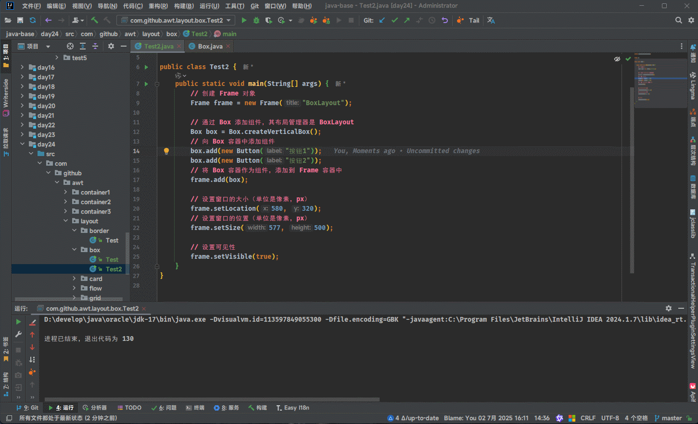
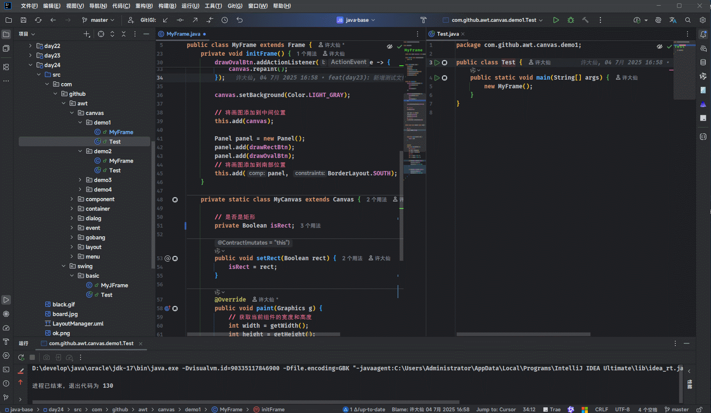

> [!IMPORTANT]
>
> * ① JDK 的版本是 `17` ，IDEA 的版本是 `2024.1+`。
> * ② 前置知识：`HTML`、`CSS`、`JavaScript` 以及 `SpringBoot`。

# 第一章：Java 图形化界面

## 1.1 概述

* 如果我们想要使用 Java 来编写富客户端图形用户界面（GUI），则需要使用 GUI 工具包。
* 在 Java 中，常用的 GUI 工具包，如下所示：
  * ① AWT（Abstract Window Toolkit）：抽象窗口工具包。
  * ② Swing。
  * ③ JavaFX。
  * ④ SWT（Standard Widget Toolkit）：标准小部件工具包。

> [!NOTE]
>
> * ① AWT 是第一代 Java GUI 工具包，Swing 是第二代 Java GUI 工具包，JavaFX 是第三代 Java GUI 工具包，这些都是成熟的、得到良好支持的、标准的 Java GUI 工具。
> * ② AWT 和 Swing 是内置在 JavaSE 标准版中，而 JavaFX 已经从标准版中移除，交由社区来独立开发和维护。
> * ③ JDK 有很多版本，如：OpenJDK、Azul Zulu、AdoptOpenJDK、Red Hat OpenJDK 以及 [Liberica JDK](https://bell-sw.com/) ，虽然它们都是基于 Oracle 的 OpenJDK，但是它们的区别在于：
>   * 包含或排除 JFX 和 JFR 等组件。
>   * 所提供支持的类型和速度。
>   * 更新速率和速度。
>   * 安全以及特性。
> * ④ 其中，[Liberica JDK](https://bell-sw.com/) 内置了 JFX 组件。

## 1.2 AWT

* AWT 自 Java 1.0 以来就一直存在，是第一代 GUI 工具包。
* AWT 组件通常被认为是“重量级”组件，因为其是直接在原生的用户界面上提供了一个非常薄的抽象层，如：生成一个 AWT 的复选框会导致 AWT 直接调用操作系统原生程序来生成复选框。这会导致一个问题：GUI 组件的外观由系统系统决定，在 Windows 上运行，按钮看起来像 Windows 按钮；在 Mac 上运行，按钮看起来像 Mac 按钮。
* 这种糟糕的设计选择使得拥护 Java “一次编写，到处运行（write once, run everywhere）” 信条的程序员们感觉并不爽，因为 AWT 并不能保证他们的应用在各种平台上表现一致。一个 AWT 应用可能在 Windows 上表现很好，但是到了 Mac 上几乎不能使用或者正好相反。
* AWT 工具包，包括：GUI 组件、用于在屏幕上调整这些组件大小和位置的布局管理器，以及用于处理来自这些组件的事件的类。AWT 还提供对字体、颜色、图像、数据传输、拖放以及 2D 和 3D 几何图形的支持。
* 较旧的 GUI 应用程序主要使用 AWT 编写。但是，`AWT 已经过时` ，因此在开发新应用程序时绝对应避免使用。

## 1.3 Swing

* Swing 是继 AWT 之后下一代 GUI 工具包。它是在 Java 1.2 中引入的。Swing 提供了比 AWT 更丰富的 GUI 组件集。
* Swing 组件被视为“轻量级”组件，因为 Swing 不需要作系统窗口工具包的本机资源。Swing GUI 元素是用 Java 编写的，没有本机代码（Swing GUI 使用 Java 2D API 绘制其组件，而 Java 2D API 又调用低级作系统绘制函数）。
* 由于纯 Java 设计，Swing 具有较少的特定于平台的限制，并且比 AWT 更具可移植性。`大多数现有的 Java GUI 应用程序都基于 Swing，如：IDEA 就是基于 Swing 。`

## 1.4 JavaFx

* JavaFX 旨在取代 Swing 成为 Java SE 的标准 GUI 库。`大多数新的 Java GUI 应用程序都基于 JavaFX 。`  
* 与 Swing 相比，JavaFX 具有许多优点。它更轻量级，并且具有更复杂的设计控制。它对组件使用 CSS 样式，并且 XML 可用于开发 GUI 布局（使用 FXML 和 Scene Builder）。
* Swing 只能用于创建富客户端桌面应用程序。JavaFX 可用于创建相同的富桌面应用程序，以及可在各种设备上运行的富 Web 应用程序。
* JavaFX 既是基于 Web 的开发的替代方案，也是用于构建 GUI 桌面/移动应用程序的其他工具包的替代方案。
* 从 Java 11 开始，JavaFX 是一个独立的组件，必须单独下载。JavaFX 是 OpenJFX 项目下开源 OpenJDK 的一部分。JavaFX 支持 Linux、Windows、MacOS、Android、iOS 和嵌入式 Raspberry Pi（树莓派）。但是，Swing 仅支持前三个平台。

## 1.5 SWT

* SWT 是 Java 富客户端 GUI 工具包的第三方库，由 Eclipse 基金会维护。其中，最著名的基于 SWT 的应用程序就是 [Eclipse IDE](https://eclipseide.org/)。

> [!NOTE]
>
> ::: details 点我查看 具体细节
>
> * ① Eclipse IDE 拥有强大的插件生态系统，可扩展支持当今多数主流编程语言，是一个通用性极强的开发平台。
> * ② 具体支持的编程语言，如下所示：
>   * Java（原生支持）
>   * C/C++（通过 CDT 插件）
>   * Python（通过 PyDev 插件）
>   * JavaScript、TypeScript（通过 Wild Web Developer 插件） 
>   * PHP（通过 PDT 插件）
>   * Ruby、Perl 等（通过相应插件）
> * ③ 但是，某些语言的支持程度和开发体验可能不如专门为该语言设计的 IDE，如：Python 更适合用 PyCharm，JavaScript/TypeScript 更适合用 VSCode。
>
> :::

* SWT 是一个跨平台的 GUI 库，用于基于 JVM 的桌面应用程序。SWT 是围绕重量级本机代码对象编写的轻量级 Java 包装器。因此，SWT 小部件也被视为重量级组件。
* 如果本机平台 GUI 库不提供所需的 SWT 功能，则 SWT 将实现自己的 Java 代码，类似于 Swing 。SWT 使程序员接触到比 Swing 更多的低级本机 GUI 代码。
* SWT 是 AWT 的低级性能和外观与 Swing 的高级易用性之间的折衷方案。


# 第二章：AWT

## 2.1 AWT 的继承体系

* `AWT` 相关的类都在 `java.awt` 包及其子包中，其中基类是 `Component` 和 `MenuComponent` 。

> [!NOTE]
>
> * ① Component：代表一个能以图形化方式出现出来，并且可以和用户交互的对象（组件），如：Button 代表一个按钮，而 TextField 代表一个文本框。
> * ② MenuComponent：代表图形界面的菜单组件，如：MenuBar 代表菜单条，而 MenuItem 代表菜单项。
> * ③ Container 是一种特殊的 Component，它代表一种容器，可以存放普通的 Component。


* `AWT` 中还有一个非常重要的接口 `LayoutManager` （布局管理器），即：如果一个容器中有多个组件，该容器就需要使用 `LayoutManager` 来管理这些组件的布局方式。


## 2.2 Container 容器

### 2.2.1 概述

* `Container` 容器的继承体系，如下所示：


* 其中，`Window` 是可以独立存在的顶级窗口，默认使用 `BorderLayout` 管理其内部组件布局。
* 其中，`Panel` 可以容纳其他组件，但是不能独立存在，必须嵌在其他容器中使用，默认使用 `FlowLayout` 管理其内部组件布局。
* 其中，`ScrollPane` 是一个带滚动条的容器，也不能独立存在，默认使用 `BorderLayout` 管理其内部组件布局。

### 2.2.2 常用 API

* `Component` 作为基类，提供如下的方法来设置组件的大小、位置以及可见性：

| 方法签名                                                     | 描述                     |
| ------------------------------------------------------------ | ------------------------ |
| `public void setLocation(int x, int y) {}`                   | 设置组件的位置           |
| `public void setLocation(Point p) {}`                        | 设置组件的位置           |
| `public void setSize(int width, int height) {}`              | 设置组件的大小           |
| `public void setSize(Dimension d) {}`                        | 设置组件的大小           |
| `public void setBounds(int x, int y, int width, int height) {}` | 同时设置组件的位置和大小 |
| `public void setBounds(Rectangle r) {}`                      | 同时设置组件的位置和大小 |
| `public void setVisible(boolean b) {}`                       | 设置组件的可见性         |

* `Container` 作为容器根类，提供了如下的方法来存储组件以及访问容器中的组件：

| 方法签名                                           | 描述                                                         |
| -------------------------------------------------- | ------------------------------------------------------------ |
| `public Component add(Component comp) {}`          | 向容器中添加其他组件，可以是普通组件，也可以是容器，返回被添加的组件 |
| `public Component getComponentAt(int x, int y) {}` | 返回指定位置处的组件                                         |
| `public Component getComponent(int n) {}`          | 返回指定索引处的组件                                         |
| `public Component[] getComponents() {}`            | 返回容器内的所有组件                                         |
| `public int getComponentCount() {}`                | 返回容器内组件的数量                                         |

### 2.2.3 综合练习

#### 2.2.3.1 综合练习一

* 需求：显示窗口容器。


* 示例：

::: code-group

```java [Test.java]
package com.github.awt;

import java.awt.*;

public class Test {
    public static void main(String[] args) {
        // 创建 Frame 对象
        Frame frame = new Frame("这是第一个窗口容器");

        // 设置窗口的大小（单位是像素，px）
        frame.setLocation(580, 320);
        // 设置窗口的位置（单位是像素，px）
        frame.setSize(500, 400);
        // frame.setBounds(580, 320, 500, 400);

        // 设置可见性
        frame.setVisible(true);
    }
}
```

```md:img [cmd 控制台]

```

:::

#### 2.2.3.2 综合练习二

* 需求：容器中需要包含其它组件，即：面板。

> [!NOTE]
>
> * ① Panel 等内嵌容器是可以包含其他容器的。
> * ② Panel 等内嵌容器是不能独立存在的，必须依附于 Window 窗口容器。
> * ③ AWT 出现的时候太早了，那个时候并没有过多的考虑中文；我们在 IDEA 中默认使用的编码是 UTF-8，但是 AWT 是运行在 Windows 操作系统上的（简体中文版，默认的编码是 GBK），可能会造成乱码；其解决方案就是增加一个 JVM 参数 `-Dfile.encoding=GBK`  。


* 示例：

::: code-group

```java [Test.java]
package com.github.awt2;

import java.awt.*;

public class Test {
    public static void main(String[] args) {
        // 创建 Frame 对象
        Frame frame = new Frame("这是第一个窗口容器");

        // 创建 Panel 容器
        Panel panel = new Panel();
        // 创建普通组件
        Button btn1 = new Button("按钮1");
        Button btn2 = new Button("按钮1");
        Button btn3 = new Button("按钮1");
        // 添加到 Panel 容器中
        panel.add(btn1);
        panel.add(btn2);
        panel.add(btn3);

        // 将 Panel 添加到 Frame 中
        frame.add(panel);

        // 设置窗口的大小（单位是像素，px）
        frame.setLocation(580, 320);
        // 设置窗口的位置（单位是像素，px）
        frame.setSize(500, 400);
        // frame.setBounds(580, 320, 500, 400);

        // 设置可见性
        frame.setVisible(true);
    }
}
```

```md:img [cmd 控制台]

```

:::

#### 2.2.3.3 综合练习三

* 需求：实现有滚动条的容器，即：滚动窗格。

> [!NOTE]
>
> * ① 虽然向 ScrollPane 容器中添加了多个组件；但是，却只看到最后一个容器，而看不到其它的容器，这就是因为 ScrollPane 默认使用 BorderLayout 布局管理器来管理内部组件的布局方式，即：BorderLayout 导致了该容器中只有一个组件被显示出来。
> * ② 之前说过：如果一个容器中有多个组件，该容器就需要使用 `LayoutManager` 来管理这些组件的布局方式；而 BorderLayout  就是 ScrollPane 的默认 LayoutManager 。


* 示例：

::: code-group

```java [Test.java]
package com.github.awt.container3;

import java.awt.*;

public class Test {
    public static void main(String[] args) {

        // 创建 Frame 窗口对象
        Frame frame = new Frame("我的第一个 AWT 程序");

        // 创建 ScrollPane 对象，并且指定默认的滚动条
        ScrollPane scrollPane = new ScrollPane(ScrollPane.SCROLLBARS_ALWAYS);

        // 向 ScrollPane 对象中添加内容，即：其他容器
        scrollPane.add(new Button("按钮1"));
        scrollPane.add(new Button("按钮2"));
        scrollPane.add(new TextField("文本框"));

        // 将 ScrollPane 添加到 Frame 中
        frame.add(scrollPane);

        // 设置位置和大小
        frame.setBounds(521, 300, 500, 400);

        // 设置可见性
        frame.setVisible(true);
    }
}
```

```md:img [cmd 控制台]

```

:::

## 2.3 LayoutManager 布局管理器

### 2.3.1 概述

* 假设现在需要在 GUI 上显示 Label 组件，如下所示：

::: code-group

```java [Test.java]
package com.github.awt.container2;

import java.awt.*;

public class Test {
    public static void main(String[] args) {
        // 创建 Frame 对象
        Frame frame = new Frame("这是第一个窗口容器");

        // 创建 Panel 容器
        Panel panel = new Panel();
        // 创建普通组件
        Label label1 = new Label("哈哈"); // [!code highlight:9]
        label1.setSize(200, 100);
        label1.setBackground(Color.pink);
        Label label2 = new Label("呵呵");
        label2.setSize(200, 100);
        label2.setBackground(Color.LIGHT_GRAY);
        Label label3 = new Label("嘻嘻");
        label3.setSize(200, 100);
        label3.setBackground(Color.ORANGE);
        // 添加到 Panel 容器中
        panel.add(label1);
        panel.add(label2);
        panel.add(label3);

        // 将 Panel 添加到 Frame 中
        frame.add(panel);

        // 设置窗口的大小（单位是像素，px）
        frame.setLocation(580, 320);
        // 设置窗口的位置（单位是像素，px）
        frame.setSize(500, 400);

        // 设置可见性
        frame.setVisible(true);
    }
}
```

```md:img [cmd 控制台]

```

:::

* 此时，我们希望 `Label 组件的宽、高和其内部的文字自身的宽和高保证一致` ，即：`最佳大小`。但是，AWT 仅仅是对操作系统原生程序的一层浅封装而已，不同的操作系统可能会有差异，如：Windows 中可能需要设置 Label 的宽、高为 100px、200px， Mac 中可能需要设置 Label 的宽、高为 120px、240px，才能达到同样的效果。

> [!NOTE]
>
> 为了让程序在不同的操作系统下，都有相同的使用体验（效果），必须根据不同的操作系统手动设置组件的位置和大小（坐标硬编码），无疑是一种灾难（程序员需要手动根据不同的操作系统，写很多代码，有违 Java 跨平台的特性）。

* 为了解决上述的问题，Java 提供了 LayoutManager（布局管理器），解决了如下的问题：
  * ① `自动排列组件的位置和大小`：不用再写 `setBounds(x,y, w, h)` ，避免坐标硬编码；当使用布局管理器时，组件会根据规则自动摆放。
  * ② `支持跨平台、跨分辨率 UI` ：使用布局管理器，能够根据系统的默认字体、窗口样式自动调整，在 Windows、Linux、macOS 中都能保持界面相对美观一致。
  * ③ `应对窗口大小变化（自适应）`：使用布局管理器时，组件会随容器缩放自动调整位置和大小。
  * ④ `降低开发复杂度`：和使用像素手动摆位，布局管理器大大简化了 UI 编写，降低了新手入门难度， 让界面构建更快、更可靠。
* Java 内置的 LayoutManager（布局管理器）的继承体系，如下所示：


> [!NOTE]
>
> 如果你学过 CSS ，就知道在 CSS 中先后出现了很多种布局方式，如下所示：
>
> * ① div + css + 盒子模型 + 浮动布局。
> * ② div + css + 盒子模型 + 百分比布局（流失布局）。
> * ③ div + css + 盒子模型 + flex 布局。
> * ④ div + css + 盒子模型 + grid 布局。
> * ⑤ ...
>
> 其实，AWT 中的布局和 CSS 中的布局，本质上是一样的！！！

### 2.3.2 FlowLayout（流式布局）

#### 2.3.2.1 概述
* `FlowLayout` 是 `AWT` 中最基本、最常用的布局管理器之一，其特点类似于 CSS 中的正常文档流，即：`元素从左到右自动排列、满则换行、不改变组件大小`，适用于快速简单布局。
* `FlowLayout` 的主要特点，如下所示：

| 特点                           | 说明                                                   |
| ------------------------------ | ------------------------------------------------------ |
| ✅ **按照顺序从左到右排列组件** | 添加的组件会从左向右依次排列。                         |
| ✅ **容器宽度不足时自动换行**   | 如果当前行放不下组件，会自动换到下一行。               |
| ✅ **组件保持原始大小**         | 不会自动拉伸组件大小，默认显示组件的 `preferredSize`。 |
| ✅ **对齐方式可选**             | 可以设置为左对齐、居中（默认）、右对齐。               |
| ✅ **组件之间可设置间距**       | 支持水平间距（`hgap`）和垂直间距（`vgap`）设置。       |
| ✅ **适合简单、快速布局**       | 非常适合排一排按钮、标签等控件。                       |
| ❌ **不适合复杂布局**           | 无法精确控制行和列位置，缺乏灵活性。                   |

> [!NOTE]
>
> * ① FlowLayout = 从左到右 + 自动换行 + 不改变组件大小，适用于快速布局简单控件。
> * ② FlowLayout 的 `对齐方式` ：当一行中的组件没有占满整行空间时，这行组件在水平方向上应该如何摆放。

#### 2.3.2.2 构造方法

* ① 默认中间对齐，水平间距和垂直间距为 5 像素：

```java
public FlowLayout() {
   	this(CENTER, 5, 5);
}
```

* ② 指定对齐方式，水平间距和垂直间距为 5 像素：

```java
public FlowLayout(int align) {     
	this(align, 5, 5); 
}
```

* ③ 指定对齐方式，水平间距和垂直间距：

```java
public FlowLayout(int align, int hgap, int vgap) {
    this.hgap = hgap;
    this.vgap = vgap;
    setAlignment(align);
}
```

> [!NOTE]
>
> * ① 组件对齐方式 align 的值：
>   * `FlowLayout.LEFT` ：从左到右，即：左对齐。
>   * `FlowLayout.CENTER` ：从中间向两边，即：居中对齐（默认）。
>   * `FlowLayout.RIGHT` ：从右向左，即：右对齐。
> * ② 组件的间距是通过整数设置的，单位是像素，默认是 `5` 像素。


* 示例：默认中间对齐，水平间距和垂直间距为 5 像素

::: code-group

```java [Test.java]
package com.github.awt.layout1;

import java.awt.*;

public class Test {
    public static void main(String[] args) {
        // 创建 Frame 对象
        Frame frame = new Frame("这是第一个窗口容器");
        // 设置 Frame 的布局管理器
        frame.setLayout(new FlowLayout()); // [!code highlight]

        for (int i = 1; i <= 100; i++) {
            Button button = new Button("按钮" + String.format("%03d", i));
            frame.add(button);
        }

        // 设置窗口的大小（单位是像素，px）
        frame.setLocation(580, 320);
        // 设置窗口的位置（单位是像素，px）
        frame.setSize(577, 500);

        // 设置可见性
        frame.setVisible(true);
    }
}

```

```md:img [cmd 控制台]

```

:::


* 示例：指定对齐方式，水平间距和垂直间距为 5 像素（默认）

::: code-group

```java [Test.java]
package com.github.awt.layout1;

import java.awt.*;

public class Test {
    public static void main(String[] args) {
        // 创建 Frame 对象
        Frame frame = new Frame("这是第一个窗口容器");
        // 设置 Frame 的布局管理器
        /*
        * 指定对齐方式，
        * 	FlowLayout.LEFT 左对齐
        *   FlowLayout.CENTER 居中对齐
        *   FlowLayout.RIGHT 右对齐
        */
        frame.setLayout(new FlowLayout(FlowLayout.LEFT)); // [!code highlight]

        for (int i = 1; i <= 100; i++) {
            Button button = new Button("按钮" + String.format("%03d", i));
            frame.add(button);
        }

        // 设置窗口的大小（单位是像素，px）
        frame.setLocation(580, 320);
        // 设置窗口的位置（单位是像素，px）
        frame.setSize(577, 500);

        // 设置可见性
        frame.setVisible(true);
    }
}
```

```md:img [cmd 控制台]

```

:::


* 示例：指定对齐方式，水平间距和垂直间距

::: code-group

```java [Test.java]
package com.github.awt.layout1;

import java.awt.*;

public class Test {
    public static void main(String[] args) {
        // 创建 Frame 对象
        Frame frame = new Frame("这是第一个窗口容器");
        // 设置 Frame 的布局管理器
        frame.setLayout(new FlowLayout(FlowLayout.LEFT, 10, 10)); // [!code highlight]

        for (int i = 1; i <= 100; i++) {
            Button button = new Button("按钮" + String.format("%03d", i));
            frame.add(button);
        }

        // 设置窗口的大小（单位是像素，px）
        frame.setLocation(580, 320);
        // 设置窗口的位置（单位是像素，px）
        frame.setSize(577, 500);

        // 设置可见性
        frame.setVisible(true);
    }
}
```

```md:img [cmd 控制台]

```

:::

### 2.3.3 BorderLayout（边界布局）

#### 2.3.3.1 概述

* `BorderLayout` 是 `AWT` 中非常重要的布局管理器之一，类似于 CSS 中的 flex + justify-content ，其特点是将容器分为`东`、`南`、`西`、`北`、`中`五个区域，并根据区域名来放置组件。


* `BorderLayout` 的主要特点，如下所示：

| 特点                             | 说明                                                         |
| -------------------------------- | ------------------------------------------------------------ |
| ✅ **划分为五个区域**             | `North`（上）、`South`（下）、`West`（左）、`East`（右）、`Center`（中） |
| ✅ **每个区域最多放一个组件**     | 同一区域再次添加组件会覆盖之前的                             |
| ✅**中间区域最重要、最灵活**      | `Center` 会自动扩展填满剩余空间                              |
| ✅ **区域大小随窗口变化自动调整** | 比如窗口变大时 `Center` 区域会变大，`North/South` 会横向拉伸 |
| ✅ **适合构建经典三栏/五区布局**  | 类似网页的头部、侧边栏、内容区结构                           |

> [!NOTE]
>
> * ① 每个区域只能添加一个组件，如果需要添加多个组件，需要嵌套其他容器，如：Panel 容器。
> * ② 如果只添加了`CENTER`区域的组件，会自动占据整个容器空间。

#### 2.3.3.2 构造方法

* 默认所有区域之间没有空隙：

```java
public BorderLayout() {
    this(0, 0);
}
```

* 设置区域之间的空隙：

```java
public BorderLayout(int hgap, int vgap) {
    this.hgap = hgap;
    this.vgap = vgap;
}
```


* 示例：给每个区域添加组件

::: code-group

```java [Test.java]
package com.github.awt.layout2;

import java.awt.*;

public class Test {
    public static void main(String[] args) {
        // 创建 Frame 对象
        Frame frame = new Frame("BorderLayout");
        // 设置 Frame 的布局管理器
        frame.setLayout(new BorderLayout(20, 20)); // [!code highlight]

        // 给每个区域添加组件
        frame.add(new Button("North"), BorderLayout.NORTH); // [!code highlight:5]
        frame.add(new Button("South"), BorderLayout.SOUTH); 
        frame.add(new Button("East"), BorderLayout.EAST);
        frame.add(new Button("West"), BorderLayout.WEST);
        frame.add(new Button("Center"), BorderLayout.CENTER);

        // 设置窗口的大小（单位是像素，px）
        frame.setLocation(580, 320);
        // 设置窗口的位置（单位是像素，px）
        frame.setSize(577, 500);

        // 设置可见性
        frame.setVisible(true);
    }
}
```

```md:img [cmd 控制台]

```

:::


* 示例：如果不设置区域，默认会给`CENTER`区域添加组件，并且会覆盖之前添加的组件

::: code-group

```java [Test.java]
package com.github.awt.layout2;

import java.awt.*;

public class Test {
    public static void main(String[] args) {
        // 创建 Frame 对象
        Frame frame = new Frame("BorderLayout");
        // 设置 Frame 的布局管理器
        frame.setLayout(new BorderLayout(20, 20)); // [!code highlight]

        // 给每个区域添加组件
        frame.add(new Button("North"), BorderLayout.NORTH); // [!code highlight:5]
        frame.add(new Button("South"), BorderLayout.SOUTH);
        frame.add(new Button("East"), BorderLayout.EAST);
        frame.add(new Button("West"), BorderLayout.WEST);
        frame.add(new Button("Center"), BorderLayout.CENTER);

        frame.add(new TextField("哈哈")); // [!code highlight:3]
        frame.add(new TextField("嘻嘻"));
        frame.add(new TextField("呵呵"));

        // 设置窗口的大小（单位是像素，px）
        frame.setLocation(580, 320);
        // 设置窗口的位置（单位是像素，px）
        frame.setSize(577, 500);

        // 设置可见性
        frame.setVisible(true);
    }
}
```

```md:img [cmd 控制台]

```

:::


* 示例：为了防止同一区域组件被覆盖，可以使用嵌套容器

::: code-group

```java [Test.java]
package com.github.awt.layout2;

import java.awt.*;

public class Test {
    public static void main(String[] args) {
        // 创建 Frame 对象
        Frame frame = new Frame("BorderLayout");
        // 设置 Frame 的布局管理器
        frame.setLayout(new BorderLayout(20, 20)); // [!code highlight]

        // 给每个区域添加组件
        frame.add(new Button("North"), BorderLayout.NORTH); // [!code highlight:4]
        frame.add(new Button("South"), BorderLayout.SOUTH);
        frame.add(new Button("East"), BorderLayout.EAST);
        frame.add(new Button("West"), BorderLayout.WEST);

        Panel panel = new Panel(); // [!code highlight:4]
        panel.add(new Button("Center"));
        panel.add(new TextField("哈哈"));
        frame.add(panel);

        // 设置窗口的大小（单位是像素，px）
        frame.setLocation(580, 320);
        // 设置窗口的位置（单位是像素，px）
        frame.setSize(577, 500);

        // 设置可见性
        frame.setVisible(true);
    }
}

```

```md:img [cmd 控制台]

```

:::

### 2.3.4 GridLayout（网格布局）

#### 2.3.4.1 概述

* `GridLayout` 是 `AWT` 中的一种布局管理器，它将容器划分成`规则的网格（行 × 列）`，然后将组件依次填入每一个格子中。
* `GridLayout` 的主要特点：

| 特点                           | 说明                                                 |
| ------------------------------ | ---------------------------------------------------- |
| ✅ **将容器划分成固定的行和列** | 每个单元格大小相同                                   |
| ✅ **组件按顺序填充每个格子**   | 从左到右，从上到下                                   |
| ✅ **组件会自动拉伸填满单元格** | 所有组件尺寸一致（取决于网格）                       |
| ✅ **适合均匀排列组件**         | 布局整齐、均匀，适合排列按钮、表格、数字键盘等结构。 |
| ❌ **不支持合并单元格**         | 没有 rowspan、colspan 的功能                         |
| ❌ **不适合复杂布局**           | 不能自由控制组件大小或位置                           |

> [!NOTE]
>
> * ① GridLayout 类似于 CSS 中的 `display: grid`。
> * ② GridLayout 不适合复杂布局，即：不能自由控制组件大小和位置。

#### 2.3.4.2 构造方法

* 默认构造方法，1 行 0 列 ，横向间距和纵向间距都是 0 （不太常用）。

```java
public GridLayout() {
    this(1, 0, 0, 0);
}
```

* 设置指定的行和列；但是，横向间距和纵向间距默认都是 0 ：

```java
public GridLayout(int rows, int cols) {
    this(rows, cols, 0, 0);
}
```

* 设置指定的行、列、横向间距和纵向间距：

```java
public GridLayout(int rows, int cols, int hgap, int vgap) {
    if ((rows == 0) && (cols == 0)) {
        throw new IllegalArgumentException("rows and cols cannot both be zero");
    }
    this.rows = rows;
    this.cols = cols;
    this.hgap = hgap;
    this.vgap = vgap;
}
```


* 示例：设置 6 行 6 列，横向间距和纵向间距都是 10 的网格

::: code-group

```java [Test.java]
package com.github.awt.layout.grid;

import java.awt.*;

public class Test {
    public static void main(String[] args) {
        // 创建 Frame 对象
        Frame frame = new Frame("GridLayout");
        // 设置 Frame 的布局管理器
        GridLayout gridLayout = new GridLayout(6, 6, 10, 10);
        frame.setLayout(gridLayout);

        for (int i = 0; i < gridLayout.getRows(); i++) {
            for (int j = 0; j < gridLayout.getColumns(); j++) {
                frame.add(new Button("(" + i + "," + j + ")"));
            }
        }

        // 设置窗口的大小（单位是像素，px）
        frame.setLocation(580, 320);
        // 设置窗口的位置（单位是像素，px）
        frame.setSize(577, 500);

        // 设置可见性
        frame.setVisible(true);
    }
}
```

```md:img [cmd 控制台]

```

:::


* 示例：设置计算器

::: code-group

```java [Test.java]
package com.github.awt.layout.grid;

import java.awt.*;

public class Test2 {
    public static void main(String[] args) {
        // 创建 Frame 对象
        Frame frame = new Frame("计算器");
        // 创建 Panel 对象，用来存放 TextField 组件
        Panel panel = new Panel();
        panel.add(new TextField(35));
        frame.add(panel, BorderLayout.NORTH);
        // 创建 Panel 对象，用来存放计算器内容，并设置布局管理器为 GridLayout
        Panel panel2 = new Panel();
        panel2.setLayout(new GridLayout(3, 5, 5, 5));
        for (int i = 0; i < 10; i++) {
            panel2.add(new Button(i + ""));
        }
        panel2.add(new Button("+"));
        panel2.add(new Button("-"));
        panel2.add(new Button("*"));
        panel2.add(new Button("/"));
        panel2.add(new Button("%"));
        frame.add(panel2, BorderLayout.CENTER);
        // 设置窗口的位置（单位是像素，px）
        frame.setLocation(580, 320);
        // 设置窗口的大小（单位是像素，px）
        frame.setSize(305, 223);

        // 设置可见性
        frame.setVisible(true);
    }
}
```

```md:img [cmd 控制台]

```

:::

### 2.3.5 GridBagLayout（网格包布局，了解）

#### 2.3.5.1 概述

* `GridBagLayout` 是 `AWT` 中最强大且最灵活的布局管理器之一。与 `GridLayout` 不同，`GridBagLayout` 允许更精细的控制组件的位置和大小，它可以在一个网格中精确地放置组件，并允许组件跨越多个单元格。
* `GridBagLayout` 的主要特点：

| 特点                     | 说明                                                         |
| ------------------------ | ------------------------------------------------------------ |
| ✅ **精细控制组件的布局** | 可以设置每个组件的起始位置、宽度、高度以及它们在单元格中的分布比例 |
| ✅ **支持跨行跨列**       | 组件可以跨越多个行或列（`gridwidth`, `gridheight`）          |
| ✅ **组件大小可调整**     | 组件可以根据容器的变化自动调整大小，或者固定大小             |
| ✅ **支持组件的对齐方式** | 可以设置组件在单元格中的对齐方式（如：上对齐、居中对齐）     |
| ✅ **灵活的填充方式**     | 允许组件在其单元格内填充或拉伸                               |
| ❌ **使用复杂**           | 配置项多，代码复杂，调试较为困难                             |
| ❌ **性能开销较大**       | 由于灵活性强，性能可能不如简单布局管理器                     |

* 由于在 `GridBagLayout` 布局中，每个组件可以占用多个网格。此时，我们往容器中添加组件的时候，就需要具体的控制每个组件占用多少个网格，Java 提供的 `GridBagConstaints` 类，与特定的组件绑定，可以完成具体大小和跨越性的设置。

* `GridBagConstraints` 类的常用 API，如下所示：

| 字段       | 作用描述                           | 常用取值/示例                                 |
| ---------- | ---------------------------------- | --------------------------------------------- |
| gridx      | 网格中的列索引（位置 x）           | 0, 1, 2, ...                                  |
| gridy      | 网格中的行索引（位置 y）           | 0, 1, 2, ...                                  |
| gridwidth  | 跨越的列数                         | 1（默认），2，GridBagConstraints.REMAINDER 等 |
| gridheight | 跨越的行数                         | 1（默认），2，GridBagConstraints.REMAINDER 等 |
| weightx    | 水平方向额外空间分配权重           | 0.0（默认），0.5，1.0                         |
| weighty    | 垂直方向额外空间分配权重           | 0.0（默认），0.5，1.0                         |
| fill       | 填充方式                           | NONE（默认），HORIZONTAL，VERTICAL，BOTH      |
| anchor     | 对齐方式（组件小于单元格时的定位） | CENTER（默认），NORTH，SOUTH，EAST，WEST，等  |
| insets     | 外边距（单元格内的边距）           | new Insets(top, left, bottom, right)          |
| ipadx      | 组件内部横向填充（增加宽度）       | 0（默认），像素值                             |
| ipady      | 组件内部纵向填充（增加高度）       | 0（默认），像素值                             |

> [!CAUTION]
>
> * ① `GridBagLayout` = 灵活多变、精确控制位置和大小，适用于需要精细布局和复杂界面的场景。它为开发者提供了最大的自由度，能够满足几乎所有布局需求，但也需要更多的配置和代码量。
> * ② 在 `Swing` 中，有更强大的布局管理器来代替 `GridBagLayout` ；所以，了解即可！！！

#### 2.3.5.2 使用步骤

* ① 创建 GridBagLaout 布局管理器对象，并给容器设置该布局管理器对象。
* ② 创建 GridBagConstraints 对象，并设置该对象的控制属性：
  * gridx：用于指定组件在网格中所处的横向索引。
  * gridy：用于执行组件在网格中所处的纵向索引。
  * gridwidth：用于指定组件横向跨越多少个网格。
  * gridheight：用于指定组件纵向跨越多少个网格。
* ③ 调用 GridBagLayout 对象的 `setConstraints(Component c,GridBagConstraints gbc )`方法，把即将要添加到容器中的组件 `c` 和 `GridBagConstraints` 对象关联起来。
* ④ 把组件添加到容器中。

#### 2.3.5.3 综合练习

* 需求：使用 Frame 容器，设置 GridBagLayout 布局管理器。


* 示例：

::: code-group

```java [Test.java]
package com.github.awt.layout.gridbag;

import java.awt.*;

public class Test {
    public static void main(String[] args) {
        Frame frame = new Frame("GridBagLayout");
        frame.setLayout(new GridBagLayout());

        GridBagConstraints gbc = new GridBagConstraints();
        gbc.fill = GridBagConstraints.HORIZONTAL; // 使按钮水平拉伸

        Button btn1 = new Button("按钮 1");
        gbc.gridx = 0; // 第 1 列
        gbc.gridy = 0; // 第 1 行
        frame.add(btn1, gbc);

        Button btn2 = new Button("按钮 2");
        gbc.gridx = 1; // 第 2 列
        gbc.gridy = 0; // 第 1 行
        frame.add(btn2, gbc);

        Button btn3 = new Button("按钮 3");
        gbc.gridx = 0; // 第 1 列
        gbc.gridy = 1; // 第 2 行
        gbc.gridwidth = 2; // 跨越两列
        frame.add(btn3, gbc);

        frame.setSize(400, 300);
        frame.setVisible(true);
    }
}
```

```md:img [cmd 控制台]

```

:::

### 2.3.6 CardLayout（卡片布局）

#### 2.3.6.1 概述

* `CardLayout` 是 `AWT` 中的一种布局管理器，适用于`界面切换`的场景。


* `CardLayout` 的主要特点：

| 特点                  | 说明                                             |
| --------------------- | ------------------------------------------------ |
| ✅ 只显示一个组件      | 每次只显示一个“卡片”，其余组件自动隐藏，视图清晰 |
| ✅ 支持命名切换        | 每个卡片可以通过名称注册，方便精准切换           |
| ✅切换方法灵活         | 提供 `next`、`previous`、`show` 等方法切换视图   |
| ✅ 非常适合多页面场景  | 适用于“向导页”、“步骤流程”、“登录/注册切换”等    |
| ✅ 易于与事件系统结合  | 通常配合按钮、菜单等进行视图跳转                 |
| ❌ 不支持复杂布局嵌套  | 本身布局只控制“卡片层”，卡片内部布局需额外处理   |
| ❌无法同时显示多个视图 | 每次只能显示一个组件，不能并列展示多个卡片       |

#### 2.3.6.2 常用 API

* 构造方法：

| 构造方法                                   | 描述                                                         |
| ------------------------------------------ | ------------------------------------------------------------ |
| `public CardLayout() {}`                   | 创建默认的 CardLayout 布局管理器                             |
| `public CardLayout(int hgap, int vgap) {}` | 创建 CardLayout 布局管理器，并指定卡片和容器之间的间距（左右、上下） |

* 成员方法：

| 成员方法                                             | 描述                             |
| ---------------------------------------------------- | -------------------------------- |
| `public void first(Container target) {}`             | 显示 target 容器中的第一张卡片   |
| `public void last(Container target) {}`              | 显示 target 容器中的最后一张卡片 |
| `public void previous(Container target) {}`          | 显示 target 容器中的前一张卡片   |
| `public void next(Container target) {}`              | 显示 target 容器中的后一张卡片   |
| `public void show(Container target, String name) {}` | 显示 target 容器中指定名字的卡片 |


* 示例：轮播图

::: code-group

```java [Test.java]
package com.github.awt.layout.card;

import java.awt.*;
import java.util.List;

public class Test {
    public static void main(String[] args) {
        Frame frame = new Frame("cardLayout");

        // 创建 Panel 对象，并设置 CardLayout 布局
        CardLayout cardLayout = new CardLayout();
        Panel panel = new Panel(cardLayout);
        List<String> names = List.of(
            "第一张", "第二张", "第三张", "第四张", "第五张");
        for (String name : names) {
            panel.add(name, new Button(name));
        }
        // 将 panel 对象添加到 Frame 对象中
        frame.add(panel, BorderLayout.CENTER);

        // 创建 Panel 对象，用来存放按钮
        Panel panel2 = new Panel();
        panel2.setLayout(new FlowLayout(FlowLayout.CENTER));
        List<String> btnStrList = List.of(
            "上一张", "下一张", "第一张", "最后一张", "第三张");
        List<Button> btnList = btnStrList
                .stream()
                .map(Button::new)
                .toList();
        for (Button btn : btnList) {
            btn.addActionListener(e -> {
                String actionCommand = e.getActionCommand();
                switch (actionCommand) {
                    case "上一张" -> cardLayout.previous(panel);
                    case "下一张" -> cardLayout.next(panel);
                    case "第一张" -> cardLayout.first(panel);
                    case "最后一张" -> cardLayout.last(panel);
                    case "第三张" -> cardLayout.show(panel, "第三张");
                }
            });
            panel2.add(btn);
        }
         // 将 panel2 对象添加到 Frame 对象中
        frame.add(panel2, BorderLayout.SOUTH);

        // 设置窗口的位置（单位是像素，px）
        frame.setLocation(580, 320);
        // 设置窗口的大小（单位是像素，px）
        frame.setSize(400, 300);
        // 设置可见性
        frame.setVisible(true);
    }
}
```

```md:img [cmd 控制台]

```

:::

### 2.3.7 BoxLayout（盒子布局）

#### 2.3.7.1 概述

* 为了简化开发，`Swing` 中引入了 `BoxLayout` 布局管理器。其可以让组件在垂直方向或水平方向摆放。
* `BoxLayout` 的构造方法：

| 构造方法                                          | 描述                                                         |
| ------------------------------------------------- | ------------------------------------------------------------ |
| `public BoxLayout(Container target, int axis) {}` | 创建基于 target 容器的 BoxLayout 布局管理器，该布局管理器里的组件按 axis 方向排列。 |

> [!NOTE]
>
> axis 的取值：
>
> * BoxLayout.X_AXIS：横向排列。
> *  BoxLayout.Y _AXIS：纵向排列。

* `BoxLayout` 的主要特点：

| 特点                     | 说明                                                         |
| ------------------------ | ------------------------------------------------------------ |
| ✅ 支持单一方向排列       | 可设置为水平（X_AXIS）或垂直（Y_AXIS）排列组件               |
| ✅ 排列顺序受控           | 组件按照添加顺序依次排列，排列直观                           |
| ✅ 可与间隔组件结合使用   | 可使用 `Box.createRigidArea`、`Box.createGlue` 等调整间距和对齐 |
| ✅ 适合表单、按钮组等结构 | 适合一列按钮、一行字段、垂直面板等 UI 场景                   |
| ✅支持组件拉伸和对齐      | 可通过 `setAlignmentX/Y` 设置对齐方式                        |
| ❌ 不支持复杂布局         | 无法实现网格、分区、跨列等复杂布局需求                       |
| ❌ 对新手不太直观         | 初学者可能对 `Box`、对齐方式等机制不太熟悉                   |


* 示例：

::: code-group

```java [Test.java]
package com.github.awt.layout.box;

import javax.swing.*;
import java.awt.*;

public class Test {
    public static void main(String[] args) {
        // 创建 Frame 对象
        Frame frame = new Frame("BoxLayout");

        // 创建 BoxLayout 布局管理其，并设置布局管理器的方向
        BoxLayout boxLayout = new BoxLayout(frame, BoxLayout.Y_AXIS);
        frame.setLayout(boxLayout);

        // 向 Frame 对象中添加按钮
        frame.add(new Button("按钮1"));
        frame.add(new Button("按钮2"));

        // 设置窗口的大小（单位是像素，px）
        frame.setLocation(580, 320);
        // 设置窗口的位置（单位是像素，px）
        frame.setSize(577, 500);

        // 设置可见性
        frame.setVisible(true);
    }
}

```

```md:img [cmd 控制台]

```

:::

#### 2.3.7.2 简化

* 在 Swing 中，提供了一个新的容器 Box，该容器的默认布局管理器就是 `BorderLayout` ：

```java
public class Box extends JComponent implements Accessible {
    
	public Box(int axis) {
        super();
        super.setLayout(new BoxLayout(this, axis)); // [!code highlight]
    }

}
```

* 并且，Box 容器提供了静态方法，用来创建水平或垂直方向排列的容器：

| 静态方法                                     | 描述                               |
| -------------------------------------------- | ---------------------------------- |
| `public static Box createHorizontalBox() {}` | 创建一个水平排列组件的 Box 容器 。 |
| `public static Box createVerticalBox() {}`   | 创建一个垂直排列组件的 Box 容器 。 |

> [!NOTE]
>
> 在实际开发中，我们可以使用 Box 容器去容纳很多组件，再将 Box 容器作为一个组件，添加到其他容器中，从而形成整体的窗口布局！！！


* 示例：

::: code-group

```java [Test.java]
package com.github.awt.layout.box;

import javax.swing.*;
import java.awt.*;

public class Test2 {
    public static void main(String[] args) {
        // 创建 Frame 对象
        Frame frame = new Frame("BoxLayout");

        // 通过 Box 添加组件，其布局管理器是 BoxLayout
        Box box = Box.createVerticalBox();
        // 向 Box 容器中添加组件
        box.add(new Button("按钮1"));
        box.add(new Button("按钮2"));
        // 将 Box 容器作为组件，添加到 Frame 容器中
        frame.add(box);

        // 设置窗口的大小（单位是像素，px）
        frame.setLocation(580, 320);
        // 设置窗口的位置（单位是像素，px）
        frame.setSize(577, 500);

        // 设置可见性
        frame.setVisible(true);
    }
}
```

```md:img [cmd 控制台]

```

:::

#### 2.3.7.3 简化二

* 通过 Box 容器管理其它组件，虽然很方便；但是，Box 容器内部的组件是没有间隔的，可以通过如下的方法设置：

| 方法                                                         | 描述                                                 |
| ------------------------------------------------------------ | ---------------------------------------------------- |
| `public static Component createHorizontalGlue() {}`          | 创建一条水平间隔组件（可以在两个方向上同时拉伸间距） |
| `public static Component createHorizontalStrut(int width) {}` | 创建一条水平间隔组件（宽度固定，高度可以拉伸）       |
| `public static Component createVerticalGlue() {}`            | 创建一条垂直间隔组件（可以在两个方向上同时拉伸间距） |
| `public static Component createVerticalStrut(int height) {}` | 创建一条垂直间隔组件（高度固定，宽度可以拉伸）       |


* 示例：

::: code-group

```java [Test.java]
package com.github.awt.layout.box;

import javax.swing.*;
import java.awt.*;

public class Test2 {
    public static void main(String[] args) {
        // 创建 Frame 对象
        Frame frame = new Frame("BoxLayout");

        // 通过 Box 添加组件，其布局管理器是 BoxLayout
        Box vbox = Box.createVerticalBox();
        // 向 Box 容器中添加组件
        vbox.add(new Button("垂直按钮1"));
        vbox.add(Box.createVerticalGlue());
        vbox.add(new Button("垂直按钮2"));
        vbox.add(Box.createVerticalStrut(10));
        vbox.add(new Button("垂直按钮3"));
        // 将 Box 容器作为组件，添加到 Frame 容器中
        frame.add(vbox);

        // 设置窗口的大小（单位是像素，px）
        frame.setLocation(580, 320);
        // 设置窗口的位置（单位是像素，px）
        frame.setSize(577, 500);

        // 设置可见性
        frame.setVisible(true);
    }
}
```

```md:img [cmd 控制台]

```

:::

### 2.3.8 总结

* AWT 中常用布局管理器的对比：

| 布局管理器    | 简介             | 布局方式                                       | 典型用法                 | 特点                                                 |
| ------------- | ---------------- | ---------------------------------------------- | ------------------------ | ---------------------------------------------------- |
| FlowLayout    | 流式布局         | 从左到右排列，排满一行换行                     | Panel 中的简单组件排列   | 简单易用，适合快速排布按钮等组件                     |
| BorderLayout  | 边界布局         | 分为五个区域：North、South、East、West、Center | Frame 默认布局           | 组件分区明显，Center 自动填充剩余空间                |
| GridLayout    | 网格布局         | 均匀划分成若干行列的格子，所有格子大小相等     | 表格布局、数字键盘       | 所有组件大小一致，无法控制对齐方式                   |
| GridBagLayout | 网格包布局       | 类似 GridLayout，但更灵活                      | 复杂界面、表单布局       | 最强大但最复杂，可控制位置、行列跨度、对齐方式等     |
| CardLayout    | 卡片布局         | 一次只显示一个组件，通过 show() 切换           | 向导界面、分页切换       | 实现组件之间的切换，适合多页表单、步骤界面           |
| BoxLayout     | 盒子布局         | 组件按水平或垂直方向顺序排列                   | 垂直按钮组、表单控件排列 | 支持组件间距，排列灵活，适合竖排或横排组件           |
| Null Layout   | 不使用布局管理器 | 需要 setBounds() 设置组件位置和大小            | 游戏界面、定制化窗口     | 最大自由度，但不适配大小变化，不推荐用于标准界面布局 |

## 2.4 常用组件

### 2.4.1 基本组件

* AWT 中的基本组件有很多，如下所示：

| 基本组件      | 描述                                                         |
| ------------- | ------------------------------------------------------------ |
| Button        | 按钮                                                         |
| Canvas        | 用于绘图的画布                                               |
| Checkbox      | 复选框                                                       |
| CheckboxGroup | 用于将多个 Checkbox 组件组合成一组， 一组 Checkbox 组件将只有一个可以被选中，即：单选框 |
| Choice        | 下拉选择框                                                   |
| Frame         | 窗口，在 GUI 程序里通过该类创建窗口                          |
| Label         | 标签，用于存放提示性文本                                     |
| List          | 多选框组件，可以添加多项条目                                 |
| Panel         | 面板，嵌入容器，可以容纳很多组件；但是，必须放到其他容器中   |
| TextArea      | 多行文本框                                                   |
| TextField     | 单行文本框                                                   |


* 示例：

::: code-group

```java [FormFrame.java]
package com.github.awt.component;

import java.awt.*;

public class FormFrame extends Frame {

    public FormFrame() throws HeadlessException {
        this("登录表单");
    }

    public FormFrame(String title) throws HeadlessException {
        super(title);
        initFrame();
        initForm();
        // 让界面显示出来
        this.setVisible(true);
    }

    /**
     * 初始化表单
     */
    private void initForm() {
        setLayout(new GridBagLayout());
        GridBagConstraints gbc = new GridBagConstraints();
        gbc.insets = new Insets(2, 2, 2, 2);

        initUsernamePanel(gbc);
        initPasswordPanel(gbc);
        initGenderPanel(gbc);
        initInterestPanel(gbc);
        initNativePanel(gbc);
        initTourismPanel(gbc);
        initMarkPanel(gbc);
        initSubmitButton(gbc);
    }

    /**
     * 用户名：输入框
     */
    private void initUsernamePanel(GridBagConstraints gbc) {
        gbc.gridx = 0;
        gbc.gridy = 0;
        gbc.anchor = GridBagConstraints.EAST;
        add(new Label("用户名："), gbc);

        gbc.gridx = 1;
        gbc.anchor = GridBagConstraints.WEST;
        add(new TextField(30), gbc);
    }

    /**
     * 密码：输入框
     */
    private void initPasswordPanel(GridBagConstraints gbc) {
        gbc.gridx = 0;
        gbc.gridy = 1;
        gbc.anchor = GridBagConstraints.EAST;
        add(new Label("密码："), gbc);

        gbc.gridx = 1;
        gbc.anchor = GridBagConstraints.WEST;
        add(new TextField(30), gbc);
    }

    /**
     * 性别：单选框
     */
    private void initGenderPanel(GridBagConstraints gbc) {
        gbc.gridx = 0;
        gbc.gridy = 2;
        gbc.anchor = GridBagConstraints.EAST;
        add(new Label("性别："), gbc);

        gbc.gridx = 1;
        gbc.anchor = GridBagConstraints.WEST;
        CheckboxGroup group = new CheckboxGroup();
        Panel p = new Panel(new FlowLayout(FlowLayout.LEFT));
        p.add(new Checkbox("男", group, true));
        p.add(new Checkbox("女", group, false));
        add(p, gbc);
    }

    /**
     * 兴趣：多选框
     */
    private void initInterestPanel(GridBagConstraints gbc) {
        gbc.gridx = 0;
        gbc.gridy = 3;
        gbc.anchor = GridBagConstraints.EAST;
        add(new Label("兴趣："), gbc);

        gbc.gridx = 1;
        gbc.anchor = GridBagConstraints.WEST;
        Panel p = new Panel(new FlowLayout(FlowLayout.LEFT));
        p.add(new Checkbox("打篮球", true));
        p.add(new Checkbox("踢足球", false));
        p.add(new Checkbox("玩游戏", false));
        add(p, gbc);
    }

    /**
     * 籍贯：下拉选择框
     */
    private void initNativePanel(GridBagConstraints gbc) {
        gbc.gridx = 0;
        gbc.gridy = 4;
        gbc.anchor = GridBagConstraints.NORTHEAST;
        add(new Label("籍贯："), gbc);

        gbc.gridx = 1;
        gbc.anchor = GridBagConstraints.WEST;
        Choice choice = new Choice();
        choice.add("河北省");
        choice.add("山西省");
        choice.add("辽宁省");
        choice.add("吉林省");
        choice.add("黑龙江省");
        choice.add("广东省");
        choice.add("江苏省");
        choice.add("安徽省");
        choice.add("...");
        add(choice, gbc);
    }

    /**
     * 城市：多选
     */
    private void initTourismPanel(GridBagConstraints gbc) {
        gbc.gridx = 0;
        gbc.gridy = 6;
        gbc.anchor = GridBagConstraints.NORTHEAST;
        add(new Label("城市："), gbc);

        gbc.gridx = 1;
        gbc.anchor = GridBagConstraints.WEST;
        List list = new List(5, true);
        list.add("北京");
        list.add("上海");
        list.add("广州");
        list.add("深圳");
        list.add("杭州");
        add(list, gbc);
    }

    /**
     * 备注：文本框
     */
    private void initMarkPanel(GridBagConstraints gbc) {
        gbc.gridx = 0;
        gbc.gridy = 7;
        gbc.anchor = GridBagConstraints.NORTHEAST;
        add(new Label("备注："), gbc);

        gbc.gridx = 1;
        gbc.anchor = GridBagConstraints.WEST;
        add(new TextArea(5, 30), gbc);
    }

    /**
     * 提交按钮
     */
    private void initSubmitButton(GridBagConstraints gbc) {
        gbc.gridx = 0;
        gbc.gridy = 8;
        gbc.gridwidth = 2;
        gbc.anchor = GridBagConstraints.CENTER;
        gbc.fill = GridBagConstraints.NONE;

        Button submitButton = new Button("提交");
        add(submitButton, gbc);
    }

    /**
     * 初始化边框
     */
    private void initFrame() {
        // 设置宽高
        this.setSize(500, 500);
        // 设置居中显示
        this.setLocationRelativeTo(null);
        // 设置界面置顶
        this.setAlwaysOnTop(true);
    }
}
```

```java [Test.java]
package com.github.awt.component;

public class Test {
    public static void main(String[] args) {
        new FormFrame();
    }
}

```

```md:img [cmd 控制台]

```

:::

### 2.4.2 对话框

* Dialog 的中文翻译就是`对话框`，如下所示：


* Dialog 和 Frame 一样，都是 Window 的子类，其也是一个容器类，可以用来存放其它的组件。


* Dialog 的构造方法，如下所示：

```java
/**
* @param owner 当前对话框的父窗口
* @param title 对话框的标题
* @param modal 是否是模式对话框
*/
public Dialog(Frame owner, String title, boolean modal) {}

/**
* @param owner 当前对话框的父窗口
* @param title 对话框的标题
* @param modal 是否是模式对话框
*/
public Dialog(Dialog owner, String title, boolean modal) {}
```

> [!NOTE]
>
> * ① 虽然 Dialog 可以独立存在；但是，我们经常让其依赖于其他窗口，即：需要一个父窗口。
> * ② 对话框有非模式（non-modal）和模式（modal）两种，区别如下：
>
> | 对话框       | 描述                                                         |
> | ------------ | ------------------------------------------------------------ |
> | 非模式对话框 | 当某个对话框被打开后，该对话框总是位于它的父窗口之上。<br>如果该对话框是非模式对话框，在该对话框被关闭前，父窗口可以获取焦点。 |
> | 模式对话框   | 当某个对话框被打开后，该对话框总是位于它的父窗口之上。<br/>如果该对话框是模式对话框，在该对话框被关闭前，父窗口无法获取焦点。 |


* 示例：

::: code-group

```java [Test.java]
package com.github.awt.dialog;

import java.awt.*;
import java.awt.event.WindowAdapter;
import java.awt.event.WindowEvent;

public class Test {
    public static void main(String[] args) {
        Frame frame = new Frame("Frame");

        // 创建对话框
        Dialog d1 = new Dialog(frame, "非模式对话框", false);
        d1.setSize(200, 200);
        // 设置居中显示
        d1.setLocationRelativeTo(null);
        // 设置界面置顶
        d1.setAlwaysOnTop(true);

        // 创建对话框
        Dialog d2 = new Dialog(frame, "模式对话框", true);
        d2.setSize(200, 200);
        // 设置居中显示
        d2.setLocationRelativeTo(null);
        // 设置界面置顶
        d2.setAlwaysOnTop(true);

        Panel panel = new Panel(new FlowLayout(FlowLayout.CENTER));
        Button btn1 = new Button("非模式对话框");
        // 给按钮添加点击事件
        btn1.addActionListener(e -> d1.setVisible(true));
        Button btn2 = new Button("模式对话框");
        // 给按钮添加点击事件
        btn2.addActionListener(e -> d2.setVisible(true));
        panel.add(btn1);
        panel.add(btn2);
        Button btn = new Button("按钮");
        btn.addActionListener(e -> System.out.println("点击了按钮"));
        panel.add(btn);

        // 将 Panel 添加到 frame 中
        frame.add(panel, BorderLayout.CENTER);

        // 设置关闭操作
        frame.addWindowListener(new WindowAdapter() {
            @Override
            public void windowClosed(WindowEvent e) {
                // 退出 JVM
                System.exit(0);
            }

            @Override
            public void windowClosing(WindowEvent e) {
                // 关闭窗口
                frame.dispose();
                // 退出 JVM
                System.exit(0);
            }
        });

        // 设置窗口属性
        // 设置宽高
        frame.setSize(500, 500);
        // 设置居中显示
        frame.setLocationRelativeTo(null);
        // 设置界面置顶
        frame.setAlwaysOnTop(true);
        // 显示窗口
        frame.setVisible(true);
    }
}
```

```md:img [cmd 控制台]

```

:::

### 2.4.3 文件对话框

* 在实际开发中，我们经常会需要上传和下载（保存），如下所示：


* 此时，就需要使用到 FileDialog ，即：文件对话框，用来打开（上传）文件或保存（下载）文件。

> [!NOTE]
>
> FileDialog 无法指定模态或非模态，因为其是依赖于平台的实现，即：
>
> * 如果平台的文件对话框是模态的，则 FileDialog 是模态的。
> * 如果平台的文件对话框是非模态的，则 FileDialog 是非模态的。

* FileDialog 常见的 API，如下所示：

| FileDialog 常见 API                                          | 描述                                                         |
| ------------------------------------------------------------ | ------------------------------------------------------------ |
| `public FileDialog(Frame parent, String title, int mode) {}` | 创建文件对话框，指定父窗口，对话框标题和类型<br>mode = FileDialog.LOAD 表示打开文件<br/>mode = FileDialog.SAVE 表示保存文件 |
| `public String getDirectory() {}`                            | 获取被打开文件或保存文件的绝对路径                           |
| `public String getFile() {}`                                 | 获取被打开文件或保存文件的文件名                             |


* 示例：

::: code-group

```java [Test.java]
package com.github.awt.dialog;

import java.awt.*;

public class Test {
    public static void main(String[] args) {
        Frame frame = new Frame("Frame");

        // 创建文件对话框
        FileDialog d1 = new FileDialog(
            frame, "选择需要加载的文件", FileDialog.LOAD);
        d1.setSize(200, 200);
        // 设置居中显示
        d1.setLocationRelativeTo(null);
        // 设置界面置顶
        d1.setAlwaysOnTop(true);

        // 创建文件对话框
        FileDialog d2 = new FileDialog(
            frame, "选择需要保存的文件", FileDialog.SAVE);
        d2.setSize(200, 200);
        // 设置居中显示
        d2.setLocationRelativeTo(null);
        // 设置界面置顶
        d2.setAlwaysOnTop(true);

        Panel panel = new Panel(new FlowLayout(FlowLayout.CENTER));
        Button btn1 = new Button("打开文件");
        // 给按钮添加点击事件
        btn1.addActionListener(e -> {
            // 显示文件对话框
            d1.setVisible(true);
            // 打印文件信息
            String directory = d1.getDirectory();
            System.out.println("用户选择的文件路径" + directory);
            String file = d1.getFile();
            System.out.println("用户选择的文件名称" + file);
        });
        Button btn2 = new Button("保存文件");
        // 给按钮添加点击事件
        btn2.addActionListener(e -> {
            d2.setVisible(true);
            // 打印文件信息
            String directory = d2.getDirectory();
            System.out.println("用户保存的文件路径" + directory);
            String file = d2.getFile();
            System.out.println("用户保存的文件名称" + file);
        });
        panel.add(btn1);
        panel.add(btn2);

        // 将 Panel 添加到 frame 中
        frame.add(panel, BorderLayout.CENTER);

        // 设置窗口属性
        // 设置宽高
        frame.setSize(500, 500);
        // 设置居中显示
        frame.setLocationRelativeTo(null);
        // 设置界面置顶
        // frame.setAlwaysOnTop(true);
        // 显示窗口
        frame.setVisible(true);
    }
}
```

```md:img [cmd 控制台]

```

:::

## 2.5 事件处理

### 2.5.1 概述

* 之前已经学习过了 AWT 中的常用组件，以及如何将这些组件进行布局；但是，之前的 GUI 是无法响应用户的一些操作。

> [!NOTE]
>
> * ① 点击`提交`按钮，没有任何反应！！！
> * ② 点击`关闭`按钮，没有任何反应！！！


> [!NOTE]
>
> 在 GUI 编程中，所有用户操作，都涉及到事件处理机制；Frame 以及 AWT 的各个组件本身并没有事件处理能力！！！

### 2.5.2 事件处理机制

* 事件处理机制：当在`某个组件`上发生`某些操作`的时候，会`自动触发一段代码`的执行。
* 事件处理机制的三大核心要素：

| 组成                         | 说明                                                         | 例子                             |
| ---------------------------- | ------------------------------------------------------------ | -------------------------------- |
| 事件源（Event Source）       | 触发事件的对象，通常指的是某个组件（容器）                   | 按钮、文本框、窗口等             |
| 事件对象（Event Object）     | 在事件源上发生的操作可以叫做事件，GUI 会把事件都封装到一个 Event 对象中，如果需要知道该事件的详细信息，就可以通过 Event 对象来获取，即：描述事件发生的详细信息 | ActionEvent、MouseEvent 等       |
| 事件监听器（Event Listener） | 当在某个事件源上发生了某个事件，事件监听器就可以对这个事件进行处理，即：负责处理事件的接口或类 | ActionListener、MouseListener 等 |

> [!NOTE]
>
> * ① 可以这么理解事件处理机制：用户做了某件事（点击按钮），系统会生成一个“事件对象”，传递给对应的“监听器”，由监听器负责处理这个事件。
> * ② 注册监听：把某个事件监听器 (A) 通过某个事件 (B) 绑定到某个事件源 (C) 上，当在事件源 C 上发生了事件 B 之后，那么事件监听器 A 的代码就会自动执行。

* 事件处理机制的动态图，如下所示：


### 2.5.3 事件处理的步骤

* 事件处理的步骤：


* 示例：传统写法

::: code-group

```java [Test.java]
package com.github.awt.event.event1;

import javax.swing.*;
import java.awt.*;
import java.awt.event.ActionEvent;
import java.awt.event.ActionListener;
import java.util.concurrent.atomic.AtomicLong;

public class Test {

    private static final AtomicLong counter = new AtomicLong();

    public static void main(String[] args) {
        Frame frame = new Frame("事件监听");

        Box vbox = Box.createVerticalBox();

        TextField tf = new TextField();
        tf.setColumns(20);
        vbox.add(tf);

        // ① 创建事件源对象
        Button btn = new Button("点我+1");

        // ③ 创建事件监听器对象
        MyListener myListener = new MyListener(counter, tf);

        // ④ 注册监听
        btn.addActionListener(myListener);

        vbox.add(btn);

        frame.add(vbox);
        // 设置窗口属性
        // 设置宽高
        frame.setSize(500, 120);
        // 设置居中显示
        frame.setLocationRelativeTo(null);
        // 设置界面置顶
        // frame.setAlwaysOnTop(true);
        // 显示窗口
        frame.setVisible(true);
    }
}

// ② 自定义类，实现 ActionListener，并重写方法
class MyListener implements ActionListener {

    private final AtomicLong counter;
    private final TextField tf;

    public MyListener(AtomicLong counter, TextField tf) {
        this.counter = counter;
        this.tf = tf;
    }


    @Override
    public void actionPerformed(ActionEvent e) {
        long count = counter.addAndGet(1);
        tf.setText(String.valueOf(count));
    }
}
```

```md:img [cmd 控制台]

```

:::


* 示例：简化写法

::: code-group

```java [Test.java]
package com.github.awt.event.event1;

import javax.swing.*;
import java.awt.*;
import java.util.concurrent.atomic.AtomicLong;

public class Test {

    private static final AtomicLong counter = new AtomicLong();

    public static void main(String[] args) {
        Frame frame = new Frame("事件监听");

        Box vbox = Box.createVerticalBox();

        TextField tf = new TextField();
        tf.setColumns(20);
        vbox.add(tf);

        // ① 创建事件源对象
        Button btn = new Button("点我+1");

        // ② 注册监听
        btn.addActionListener(e -> tf.setText(
            String.valueOf(counter.getAndAdd(1)))
        );

        vbox.add(btn);

        frame.add(vbox);
        // 设置窗口属性
        // 设置宽高
        frame.setSize(500, 120);
        // 设置居中显示
        frame.setLocationRelativeTo(null);
        // 设置界面置顶
        // frame.setAlwaysOnTop(true);
        // 显示窗口
        frame.setVisible(true);
    }
}
```

```md:img [cmd 控制台]

```

:::

### 2.5.4 常见事件和事件监听器

#### 2.5.4.1 概述

* 事件监听器必须实现事件监听器接口， AWT 提供了大量的事件监听器接口用于实现不同类型的事件监听器，用于监听不同类型的事件。
* AWT 中提供了丰富的事件类，用于封装不同组件上所发生的特定操作， AWT 的事件类都是 AWTEvent 类的子类 ， AWTEvent 是 EventObject 的子类。

#### 2.5.4.2 事件

* AWT 将事件两个大类：
  * 低级事件：这类事件是基于某个特定动作的事件，如：进入、点击、拖放等动作的鼠标事件，得到焦点和失去焦点等焦点事件。
  * 高级事件：这类事件并不会基于某个特定动作，而是根据功能含义定义的事件。
* 其中，低级事件的详细信息，如下所示：

| 事件           | 触发时机                                                     |
| -------------- | ------------------------------------------------------------ |
| ComponentEvent | 组件事件，当组件尺寸发生变化、位置发生移动、显示/隐藏状态发生改变时触发该事件。 |
| ContainerEvent | 容器事件，当容器里发生添加组件、删除组件时触发该事件 。      |
| WindowEvent    | 窗口事件，当窗口状态发生改变 ( 打开、关闭、最大化、最 小化)时触发该事件 。 |
| FocusEvent     | 焦点事件，当组件得到焦点或失去焦点 时触发该事件 。           |
| KeyEvent       | 键盘事件，当按键被按下、松开、单击时触发该事件。             |
| MouseEvent     | 鼠标事件，当进行单击、按下、松开、移动鼠标等动作 时触发该事件。 |
| PaintEvent     | 组件绘制事件，该事件是一个特殊的事件类型，当 GUI 组件调用 update/paint 方法来呈现自身时触发该事件，该事件并非专用于事件处理模型 。 |

* 其中，高级事件的详细信息，如下所示：

| 事件           | 触发时机                                                     |
| -------------- | ------------------------------------------------------------ |
| ActionEvent    | 动作事件，当按钮、菜单项被单击，在 TextField 中按 Enter 键时触发。 |
| AjustmentEvent | 调节事件，在滑动条上移动滑块以调节数值时触发该事件。         |
| ltemEvent      | 选项事件，当用户选中某项， 或取消选中某项时触发该事件 。     |
| TextEvent      | 文本事件，当文本框、文本域里的文本发生改变时触发该事件。     |

#### 2.5.4.3 事件监听器

* 不同的事件需要使用不同的监听器监听，不同的监听器需要实现不同的监听器接口， 当指定事件发生后 ， 事件监听器就会调用所包含的事件处理器(实例方法)来处理事件 。
* 其中，事件监听器的详细信息，如下所示：

| 事件类别        | 描述信息                 | 监听器接口名        |
| --------------- | ------------------------ | ------------------- |
| ActionEvent     | 激活组件                 | ActionListener      |
| ItemEvent       | 选择了某些项目           | ItemListener        |
| MouseEvent      | 鼠标移动                 | MouseMotionListener |
| MouseEvent      | 鼠标点击等               | MouseListener       |
| KeyEvent        | 键盘输入                 | KeyListener         |
| FocusEvent      | 组件收到或失去焦点       | FocusListener       |
| AdjustmentEvent | 移动了滚动条等组件       | AdjustmentListener  |
| ComponentEvent  | 对象移动缩放显示隐藏等   | ComponentListener   |
| WindowEvent     | 窗口收到窗口级事件       | WindowListener      |
| ContainerEvent  | 容器中增加删除了组件     | ContainerListener   |
| TextEvent       | 文本字段或文本区发生改变 | TextListener        |

### 2.5.5 综合练习

#### 2.5.5.1 综合练习一

* 需求：给登录表单关闭按钮 X ，注册事件监听。

> [!NOTE]
>
> * ① 当用户点击了关闭按钮 X，关闭当前窗口！！！
> * ② 需要 WindowEvent 事件以及 WindowListener 监听器！！！


* 示例：

::: code-group

```java [FormFrame.java]
package com.github.awt.component;

import java.awt.*;
import java.awt.event.WindowEvent;
import java.awt.event.WindowListener;

public class FormFrame extends Frame implements WindowListener { // [!code highlight]

    public FormFrame() throws HeadlessException {
        this("登录表单");
    }

    public FormFrame(String title) throws HeadlessException {
        super(title);
        initFrame();
        initForm();
        // 注册事件监听
        this.addWindowListener(this); // [!code highlight]
        // 让界面显示出来
        this.setVisible(true);
    }

    /**
     * 初始化表单
     */
    private void initForm() {
        setLayout(new GridBagLayout());
        GridBagConstraints gbc = new GridBagConstraints();
        gbc.insets = new Insets(2, 2, 2, 2);

        initUsernamePanel(gbc);
        initPasswordPanel(gbc);
        initGenderPanel(gbc);
        initInterestPanel(gbc);
        initNativePanel(gbc);
        initTourismPanel(gbc);
        initMarkPanel(gbc);
        initSubmitButton(gbc);
    }

    /**
     * 用户名：输入框
     */
    private void initUsernamePanel(GridBagConstraints gbc) {
        gbc.gridx = 0;
        gbc.gridy = 0;
        gbc.anchor = GridBagConstraints.EAST;
        add(new Label("用户名："), gbc);

        gbc.gridx = 1;
        gbc.anchor = GridBagConstraints.WEST;
        add(new TextField(30), gbc);
    }

    /**
     * 密码：输入框
     */
    private void initPasswordPanel(GridBagConstraints gbc) {
        gbc.gridx = 0;
        gbc.gridy = 1;
        gbc.anchor = GridBagConstraints.EAST;
        add(new Label("密码："), gbc);

        gbc.gridx = 1;
        gbc.anchor = GridBagConstraints.WEST;
        add(new TextField(30), gbc);
    }

    /**
     * 性别：单选框
     */
    private void initGenderPanel(GridBagConstraints gbc) {
        gbc.gridx = 0;
        gbc.gridy = 2;
        gbc.anchor = GridBagConstraints.EAST;
        add(new Label("性别："), gbc);

        gbc.gridx = 1;
        gbc.anchor = GridBagConstraints.WEST;
        CheckboxGroup group = new CheckboxGroup();
        Panel p = new Panel(new FlowLayout(FlowLayout.LEFT));
        p.add(new Checkbox("男", group, true));
        p.add(new Checkbox("女", group, false));
        add(p, gbc);
    }

    /**
     * 兴趣：多选框
     */
    private void initInterestPanel(GridBagConstraints gbc) {
        gbc.gridx = 0;
        gbc.gridy = 3;
        gbc.anchor = GridBagConstraints.EAST;
        add(new Label("兴趣："), gbc);

        gbc.gridx = 1;
        gbc.anchor = GridBagConstraints.WEST;
        Panel p = new Panel(new FlowLayout(FlowLayout.LEFT));
        p.add(new Checkbox("打篮球", true));
        p.add(new Checkbox("踢足球", false));
        p.add(new Checkbox("玩游戏", false));
        add(p, gbc);
    }

    /**
     * 籍贯：下拉选择框
     */
    private void initNativePanel(GridBagConstraints gbc) {
        gbc.gridx = 0;
        gbc.gridy = 4;
        gbc.anchor = GridBagConstraints.NORTHEAST;
        add(new Label("籍贯："), gbc);

        gbc.gridx = 1;
        gbc.anchor = GridBagConstraints.WEST;
        Choice choice = new Choice();
        choice.add("河北省");
        choice.add("山西省");
        choice.add("辽宁省");
        choice.add("吉林省");
        choice.add("黑龙江省");
        choice.add("广东省");
        choice.add("江苏省");
        choice.add("安徽省");
        choice.add("...");
        add(choice, gbc);
    }

    /**
     * 城市：多选
     */
    private void initTourismPanel(GridBagConstraints gbc) {
        gbc.gridx = 0;
        gbc.gridy = 6;
        gbc.anchor = GridBagConstraints.NORTHEAST;
        add(new Label("城市："), gbc);

        gbc.gridx = 1;
        gbc.anchor = GridBagConstraints.WEST;
        List list = new List(5, true);
        list.add("北京");
        list.add("上海");
        list.add("广州");
        list.add("深圳");
        list.add("杭州");
        add(list, gbc);
    }

    /**
     * 备注：文本框
     */
    private void initMarkPanel(GridBagConstraints gbc) {
        gbc.gridx = 0;
        gbc.gridy = 7;
        gbc.anchor = GridBagConstraints.NORTHEAST;
        add(new Label("备注："), gbc);

        gbc.gridx = 1;
        gbc.anchor = GridBagConstraints.WEST;
        add(new TextArea(5, 30), gbc);
    }

    /**
     * 提交按钮
     */
    private void initSubmitButton(GridBagConstraints gbc) {
        gbc.gridx = 0;
        gbc.gridy = 8;
        gbc.gridwidth = 2;
        gbc.anchor = GridBagConstraints.CENTER;
        gbc.fill = GridBagConstraints.NONE;

        Button submitButton = new Button("提交");
        add(submitButton, gbc);
    }

    /**
     * 初始化边框
     */
    private void initFrame() {
        // 设置宽高
        this.setSize(500, 500);
        // 设置居中显示
        this.setLocationRelativeTo(null);
        // 设置界面置顶
        this.setAlwaysOnTop(true);
    }


    @Override
    public void windowOpened(WindowEvent e) {
        System.out.println("windowOpened");
    }

    @Override
    public void windowClosing(WindowEvent e) {
        System.out.println("windowOpened");
        // 关闭虚拟机
        System.exit(0); // [!code highlight]
    }

    @Override
    public void windowClosed(WindowEvent e) {
        System.out.println("windowClosed");
    }

    @Override
    public void windowIconified(WindowEvent e) {

    }

    @Override
    public void windowDeiconified(WindowEvent e) {

    }

    @Override
    public void windowActivated(WindowEvent e) {

    }

    @Override
    public void windowDeactivated(WindowEvent e) {

    }
}
```

```java [Test.java]
package com.github.awt.component;

public class Test {
    public static void main(String[] args) {
        new FormFrame();
    }
}
```

```md:img [cmd 控制台]

```

:::

#### 2.5.5.2 综合练习二

* 需求：给 Frame 关闭按钮 X ，注册事件监听。

> [!NOTE]
>
> * ① 当用户点击了关闭按钮 X，关闭当前窗口！！！
> * ② 需要 WindowEvent 事件以及 WindowListener 监听器！！！


* 示例：

::: code-group

```java [Test.java]
package com.github.awt.component.component2;


import java.awt.*;
import java.awt.event.WindowAdapter;
import java.awt.event.WindowEvent;

public class Test {
    public static void main(String[] args) {
        Frame frame = new Frame("测试");

        // 注册监听
        frame.addWindowListener(new WindowAdapter() {
            @Override
            public void windowClosing(WindowEvent e) {
                System.exit(0);
            }
        });

        frame.setSize(500, 500);
        frame.setLocationRelativeTo(null);
        frame.setAlwaysOnTop(true);
        frame.setVisible(true);
    }
}
```

```md:img [cmd 控制台]

```

:::

#### 2.5.5.3 综合练习三

* 需求：文本输入框注册监听，以获取用户输入的内容。


* 示例：

::: code-group

```java [Test.java]
package com.github.awt.component.component3;

import java.awt.*;

public class Test {
    public static void main(String[] args) {
        Frame frame = new Frame("测试");

        TextField textField = new TextField(30);

        // 注册监听
        textField.addTextListener(e -> {
            TextField text = (TextField) e.getSource();
            System.out.println(text.getText());
        });

        frame.add(textField);

        frame.setSize(500, 500);
        frame.setLocationRelativeTo(null);
        frame.setAlwaysOnTop(true);
        frame.setVisible(true);
    }
}
```

```md:img [cmd 控制台]

```

:::

## 2.6 菜单组件

### 2.6.1 概述

* 之前，学习的 GUI 组件，可以按照指定的布局方式摆放到`内容区`，如下所示：


* 但是，很多桌面应用程序都会涉及到`菜单栏`，如下所示：


* 当然，有些桌面应用程序还会涉及到`工具栏`（不一定都有），如下所示：


* 甚至，有些桌面应用程序还有`弹出菜单`的功能，如下所示：

> [!NOTE]
>
> 弹出菜单：一种在计算机屏幕上显示的菜单，通常在用户右键单击某个对象或区域时出现，提供与该对象或区域相关的操作选项。


### 2.6.2 菜单栏、菜单和菜单项

* `菜单栏`通常位于窗口的顶部横向显示，是一个容器可以容纳多个`菜单`，是用户访问应用功能的主要入口：


* `菜单`是`菜单栏`中的一个项，是一个容器可以容纳多个`菜单项`，将相关的操作或命令归类，便于用户查找和操作。

> [!NOTE]
>
> `菜单`本身也可以作为`菜单项`，即：`菜单`中包含`菜单`！！！


* `菜单项` 是 `菜单` 中的 `具体选项` ，执行具体的操作或命令，是用户实际点击后产生功能的地方。


### 2.6.3 AWT 中的菜单组件

* 在 AWT 中，除了提供在内容区的组件之外，也提供了菜单相关的组件。


* AWT 中常见的菜单组件，如下所示：

| AWT 中常见的菜单组件 | 描述                                                         |
| -------------------- | ------------------------------------------------------------ |
| MenuBar              | 菜单栏，是菜单的容器                                         |
| Menu                 | 菜单组件，是菜单项的容器，是 MenuItem 的子类（可以作为菜单项使用） |
| MenuItem             | 菜单项组件                                                   |
| PopupMenu            | 弹出菜单（右键菜单组件）                                     |
| CheckboxMenuItem     | 复选框菜单组件                                               |

* AWT 中常见菜单组件的继承体系，如下所示：


### 2.6.4 菜单组件使用步骤

* `菜单组件`的使用步骤：


> [!NOTE]
>
> * ① 如果要在某个菜单的菜单项之间添加分隔线，只需要添加一个带有`-`的菜单项即可：
>
> ```java
> menu.add(new MenuItem("-"));
> ```
>
> * ② 如果要给某个菜单项关联快捷键功能，只需要在创建菜单项对象的时候设置即可：
>
> ```java
> new MenuItem("菜单项名字",new MenuShortcut(KeyEvent.VK_Q,true);
> ```


* 示例：

::: code-group

```java [IdeaFrame.java]
package com.github.awt.menu.menu1;

import java.awt.*;
import java.awt.event.KeyEvent;

public class IdeaFrame extends Frame {

    private final MenuBar menuBar = new MenuBar();

    private final Menu fileMenu = new Menu("文件");

    private final Menu editMenu = new Menu("编辑");

    private final Menu formatMenu = new Menu("格式");

    private final TextArea textArea = new TextArea(6, 40);

    public IdeaFrame() throws HeadlessException {
        this("IDEA");
    }

    public IdeaFrame(String title) throws HeadlessException {
        super(title);
        initFrame();
        this.setSize(480, 400);
        this.setLocationRelativeTo(null);
        this.setAlwaysOnTop(true);
        this.setVisible(true);
    }

    private void initFrame() {
        // 添加文件菜单
        addFileMenu();
        // 添加编辑菜单
        addEditMenu();
        // 添加格式菜单
        addFormatMenu();
        // 添加多行文本域
        addTextArea();
        // 递归遍历菜单项，添加事件监听
        processMenuItems(menuBar);
        // 将菜单栏添加到窗体中
        this.setMenuBar(menuBar);
    }

    private void addTextArea() {
        this.add(textArea);
    }

    /**
     * 添加格式菜单
     */
    private void addFormatMenu() {
        // 添加菜单项
        formatMenu.add(
            new MenuItem("注释", new MenuShortcut(KeyEvent.VK_Q, true)));
        formatMenu.add(new MenuItem("取消注释"));
        // 编辑菜单添加格式菜单，将格式菜单看做菜单项
        editMenu.add(formatMenu);
    }

    /**
     * 添加编辑菜单
     */
    private void addEditMenu() {
        // 添加菜单项
        editMenu.add(new MenuItem("自动换行"));
        editMenu.add(new MenuItem("复制"));
        editMenu.add(new MenuItem("粘贴"));
        editMenu.add(new MenuItem("-"));
        // 添加菜单
        menuBar.add(editMenu);
    }

    /**
     * 添加文件菜单
     */
    private void addFileMenu() {
        // 添加菜单项
        fileMenu.add(new MenuItem("新建"));
        fileMenu.add(new MenuItem("打开"));
        fileMenu.add(new MenuItem("保存"));
        fileMenu.add(new MenuItem("退出"));
        // 添加菜单
        menuBar.add(fileMenu);
    }

    private void processMenuItems(MenuBar menuBar) {
        for (int i = 0; i < menuBar.getMenuCount(); i++) {
            processMenu(menuBar.getMenu(i));
        }
    }

    private void processMenu(Menu menu) {
        for (int j = 0; j < menu.getItemCount(); j++) {
            MenuItem item = menu.getItem(j);
            if (item instanceof Menu) {
                // 如果是子菜单，递归处理
                processMenu((Menu) item);
            } else {
                // 如果是菜单项，添加监听器
                item.addActionListener(e -> 
                  textArea.setText("您点击了【" + e.getActionCommand() + "】功能"));
            }
        }
    }
}
```

```java [Test.java]
package com.github.awt.menu.menu1;

public class Test {
    public static void main(String[] args) {
        new IdeaFrame();
    }
}
```

```md:img [cmd 控制台]

```

:::

### 2.6.5 弹出菜单组件使用步骤

* `弹出菜单组件`的使用步骤：


* 示例：

::: code-group

```java [IdeaFrame.java]
package com.github.awt.menu.menu2;

import java.awt.*;
import java.awt.event.MouseAdapter;
import java.awt.event.MouseEvent;


public class IdeaFrame extends Frame {

    private final Panel panel = new Panel();

    private final PopupMenu popupMenu = new PopupMenu();

    private final TextArea textArea = new TextArea(6, 60);

    public IdeaFrame() throws HeadlessException {
        this("IDEA");
    }

    public IdeaFrame(String title) throws HeadlessException {
        super(title);
        initFrame();
        this.setSize(480, 400);
        this.setLocationRelativeTo(null);
        this.setAlwaysOnTop(true);
        this.setVisible(true);
    }

    private void initFrame() {
        addTextArea();
        addPanel();
    }

    private void addTextArea() {
        this.add(textArea);
    }

    private void addPanel() {
        // 弹出菜单添加菜单项
        popupMenu.add(new MenuItem("复制"));
        popupMenu.add(new MenuItem("保存"));
        popupMenu.add(new MenuItem("注释"));
        popupMenu.add(new MenuItem("取消注释"));
        // 添加到 Panel 中
        panel.add(popupMenu);
        // popupMenu 注册监听
        popupMenu.addActionListener(e -> {
            String actionCommand = e.getActionCommand();
            textArea.setText(actionCommand);
        });
        // 设置 panel 大小
        panel.setPreferredSize(new Dimension(300, 100));
        // panel 注册监听
        panel.addMouseListener(new MouseAdapter() {
            @Override
            public void mouseReleased(MouseEvent e) {
                if (e.isPopupTrigger()) {
                    popupMenu.show(panel, e.getX(), e.getY());
                }
            }
        });
        // 将 Panel 添加到 Frame 中
        this.add(panel, BorderLayout.SOUTH);
    }

}
```

```java [Test.java]
package com.github.awt.menu.menu2;

public class Test {
    public static void main(String[] args) {
        new IdeaFrame();
    }
}
```

```md:img [cmd 控制台]

```

:::

## 2.7 绘图

### 2.7.1 概述

* 早期，很多游戏程序需要在窗口中绘制各种图形，此时就需要使用 AWT 的绘图功能。


### 2.7.2 组件绘制原理

* 之前，我们学习过很多组件，如：Button、Frame 以及 Checkbox 等，这些不同的组件展示出来的图形是不一样的，其实是利用 AWT 的绘图来完成的。
* 在 AWT 中，真正提供绘图功能的是 Graphics 对象；AWT 中的组件（容器）都是 Component 类的子类对象，并且在 Component 类中提供了以下三个方法来完成组件的绘制和刷新：

| 方法                                | 描述                                         |
| ----------------------------------- | -------------------------------------------- |
| `public void paint(Graphics g) {}`  | 绘制组件的外观                               |
| `public void update(Graphics g) {}` | 内部调用组件的 paint() 方法，刷新组件的外观  |
| `public void repaint() {}`          | 内部调用组件的 udpate() 方法，刷新组件的外观 |

* 其原理是这样的，如下所示：

> [!NOTE]
>
> * ① 在实际开发中，paint() 方法和 update() 方法是由 AWT 系统负责调用。
> * ② 在实际开发中，如果希望系统重绘组件，程序员可以手动调用 repaint() 方法来完成对应功能。


### 2.7.3 Graphics 类的使用

#### 2.7.3.1 概述

* 在现实生活中，如果需要画图，我们需要准备一张纸，然后拿一支笔，并配合一些颜料，就可以在纸上画出各种各样的图形，如：圆形、矩形等。


* 在程序中也是如此，也需要画布（纸）、画笔和颜料等。AWT 中提供的 Canvas 类（Component）就可以当做画布，提供的 Graphics 类来充当画笔，通过调用 Graphics 对象的 setColor() 方法可以给画笔设置颜色。

#### 2.7.3.2 画图步骤

* AWT 中的画图步骤，如下所示：
  * ① 自定义类继承 Canvas  类，并重写 `paint(Graphics g)` 方法。
  * ② 在 paint() 方法内部，需要先调用 Graphics 对象的 setColor()、setFont() 等方法设置画笔的颜色以及字体等属性。
  * ② 在 paint() 方法内部，再调用 Graphics 对象 drawXxx() 或 fillXxx() 方法开始画图。
* Graphics 类的常见 API ：

| 方法名称           | 方法功能               |
| ------------------ | ---------------------- |
| setColor(Color c)  | 设置颜色               |
| setFont(Font font) | 设置字体               |
| drawLine()         | 绘制直线               |
| drawRect()         | 绘制矩形               |
| drawRoundRect()    | 绘制圆角矩形           |
| drawOval()         | 绘制椭圆形             |
| drawPolygon()      | 绘制多边形             |
| drawArc()          | 绘制圆弧               |
| drawPolyline()     | 绘制折线               |
| fillRect()         | 填充矩形区域           |
| fillRoundRect()    | 填充圆角矩形区域       |
| fillOval()         | 填充椭圆区域           |
| fillPolygon()      | 填充多边形区域         |
| fillArc()          | 填充圆弧对应的扇形区域 |
| drawImage()        | 绘制位图               |


* 示例：

::: code-group

```java [MyFrame.java]
package com.github.awt.canvas.demo1;

import java.awt.*;

public class MyFrame extends Frame {
    private final MyCanvas canvas = new MyCanvas();
    private final Button drawRectBtn = new Button("绘制矩形");
    private final Button drawOvalBtn = new Button("绘制椭圆");

    public MyFrame() throws HeadlessException {
        this("绘图");
    }

    public MyFrame(String title) {
        super(title);
        initFrame();
        this.setSize(480, 400);
        this.setLocationRelativeTo(null);
        this.setAlwaysOnTop(true);
        this.setVisible(true);
    }

    private void initFrame() {
        drawRectBtn.addActionListener(e -> {
            canvas.setRect(true);
            // 重绘
            canvas.repaint();
        });

        drawOvalBtn.addActionListener(e -> {
            canvas.setRect(false);
            // 重绘
            canvas.repaint();
        });

        canvas.setBackground(Color.LIGHT_GRAY);

        // 将画图添加到中间位置
        this.add(canvas);

        Panel panel = new Panel();
        panel.add(drawRectBtn);
        panel.add(drawOvalBtn);
        // 将画图添加到南部位置
        this.add(panel, BorderLayout.SOUTH);
    }

    private static class MyCanvas extends Canvas {

        // 是否是矩形
        private Boolean isRect = true;

        public void setRect(Boolean rect) {
            isRect = rect;
        }

        @Override
        public void paint(Graphics g) {
            // 获取当前组件的宽度和高度
            int width = getWidth();
            int height = getHeight();
            // 计算中心位置
            int x = (width - 100) / 2;
            int y = (height - 100) / 2;

            if (Boolean.TRUE.equals(isRect)) {
                g.setColor(Color.red);
                g.drawRect(x, y, 100, 100);
            }

            if (Boolean.FALSE.equals(isRect)) {
                g.setColor(Color.PINK);
                g.fillOval(x, y, 100, 100);
            }
        }
    }
}

```

```java [Test.java]
package com.github.awt.canvas.demo1;

public class Test {
    public static void main(String[] args) {
        new MyFrame(new MyCanvas());
    }
}
```

```md:img [cmd 控制台]

```

:::

#### 2.7.3.3 综合练习

* 需求：实现弹球游戏。

> [!NOTE]
>
> * ① AWT 也可以开发一些动画，所谓的动画就是每隔一定的时间（通常小于 0.1s）重新绘制图像，两次绘制的图像之间的差异较小，让人的肉眼感觉不到，就形成了动画。
> * ② 为了实现每隔一定的时间就重新调用 canvas 的 repaint() 方法，可以借助 Swing 提供的 Timer 类，其是一个定时器。


* 示例：

::: code-group

```java [MyFrame.java]
package com.github.awt.canvas.demo2;

import javax.swing.*;
import java.awt.*;
import java.awt.event.KeyAdapter;
import java.awt.event.KeyEvent;
import java.awt.event.KeyListener;

public class MyFrame extends Frame {

    // 面板的宽度和高度
    private final int TABLE_WIDTH = 350;
    private final int TABLE_HEIGHT = 500;
    // 球拍的宽度和高度
    private final int RACKET_WIDTH = 60;
    private final int RACKET_HEIGHT = 20;
    // 小球的大小
    private final int BALL_SIZE = 16;
    // 创建画布
    private final MyCanvas canvas = new MyCanvas();
    // 定义变量，球拍的坐标
    private final int RACKET_Y = 340;
    // 定义变量，记录球拍在 x  方向的速度
    private final int speedRacketX = 10;
    // 添加按键状态标记
    private boolean leftPressed = false;
    private boolean rightPressed = false;
    // 定义变量，记录小球在 x 或 y 方向的速度
    private int speedBallX = 10;
    private int speedBallY = 5;
    // 定义变量，球拍的坐标
    private int racketX = 120;
    // 定义变量，记录小球的坐标
    private int ballX = 120;
    private int ballY = 20;
    // 定义变量，用来标识当前游戏是否继续
    private boolean isOver = false;
    private Timer timer;

    public MyFrame() throws HeadlessException {
        this("弹球游戏");
    }

    public MyFrame(String title) {
        super(title);
        initFrame();
        this.setSize(TABLE_WIDTH, TABLE_HEIGHT);
        this.setLocationRelativeTo(null);
        this.setAlwaysOnTop(true);
        this.setVisible(true);
    }

    private void initFrame() {
        // 注册定时器
        timer = new Timer(100, (e) -> {
            // 如果小球碰到了左右边框
            if (ballX <= 0 || ballX >= TABLE_WIDTH - BALL_SIZE) {
                speedBallX = -speedBallX;
            }
            // 如果小球横向在球拍范围内，且到达球拍位置或者到达顶端位置，则小球反弹
            if (ballY <= 0 || (ballY >= RACKET_Y - BALL_SIZE && (ballX >= racketX && ballX <= racketX + RACKET_WIDTH))) {
                speedBallY = -speedBallY;
            }
            // 小球的高度超出了球拍的位置，且横向不在球拍范围内，则游戏结束
            if (ballY > RACKET_Y && (ballX < racketX || ballX > racketX + RACKET_WIDTH)) {
                // 结束定时器
                timer.stop();
                // 把游戏结束的标记设置为 true
                isOver = true;
                // 重绘界面
                canvas.repaint();
            }
            // 根据按键状态更新球拍位置
            updateRacketPosition();

            // 更新小球的坐标
            ballX += speedBallX;
            ballY += speedBallY;
            // 重绘画布
            canvas.repaint();
        });
        // 启动定时器
        timer.start();

        // 监听球拍坐标的变化
        KeyListener keyListener = new KeyAdapter() {
            @Override
            public void keyPressed(KeyEvent e) {
                // 按键被按下时设置状态为 true
                final int keyCode = e.getKeyCode();
                switch (keyCode) {
                    case KeyEvent.VK_LEFT -> leftPressed = true;
                    case KeyEvent.VK_RIGHT -> rightPressed = true;
                }
            }

            @Override
            public void keyReleased(KeyEvent e) {
                // 按键被释放时设置状态为 false
                final int keyCode = e.getKeyCode();
                switch (keyCode) {
                    case KeyEvent.VK_LEFT -> leftPressed = false;
                    case KeyEvent.VK_RIGHT -> rightPressed = false;
                }
            }
        };

        // 注册监听
        this.canvas.addKeyListener(keyListener);

        // 确保Canvas可以接收焦点
        this.canvas.setFocusable(true);
        this.canvas.requestFocus();

        // 将画图添加到中间位置
        this.add(canvas);
    }

    /**
     * 根据按键状态更新球拍位置
     */
    private void updateRacketPosition() {
        if (leftPressed && racketX > 0) {
            racketX -= speedRacketX;
        }
        if (rightPressed && racketX < TABLE_WIDTH - RACKET_WIDTH) {
            racketX += speedRacketX;
        }
    }

    private class MyCanvas extends Canvas {
        @Override
        public void paint(Graphics g) {
            if (isOver) {
                g.setColor(Color.BLUE);
                g.setFont(new Font("微软雅黑", Font.BOLD, 30));
                // 获取 Canvas 组件的宽度和高度
                int canvasWidth = getWidth();
                int canvasHeight = getHeight();
                // 计算字符串的宽度和高度
                FontMetrics fontMetrics = g.getFontMetrics();
                int stringWidth = fontMetrics.stringWidth("游戏结束");
                int stringHeight = fontMetrics.getHeight();
                // 计算居中位置
                int x = (canvasWidth - stringWidth) / 2;
                int y = (canvasHeight - stringHeight) / 2 + fontMetrics.getAscent();
                g.drawString("游戏结束", x, y);
            } else {
                // 绘制小球
                g.setColor(Color.RED);
                g.fillOval(ballX, ballY, BALL_SIZE, BALL_SIZE);
                // 绘制球拍
                g.setColor(Color.PINK);
                g.fillRect(racketX, RACKET_Y, RACKET_WIDTH, RACKET_HEIGHT);
            }
        }
    }
}
```

```java [Test.java]
package com.github.awt.canvas.demo2;

public class Test {
    public static void main(String[] args) {
        new MyFrame();
    }
}
```

```md:img [cmd 控制台]

```

:::

### 2.7.4 处理位图

#### 2.7.4.1 概述

* 之前是直接在组件上使用 Graphics 对象进行绘制几何图形，这些图形比较固定，如：矩形、圆形等。


* 但是，有的时候，我们希望绘制复杂的图形，就需要使用`位图`技术，即：在内存中绘制图像，然后一次性的渲染到屏幕中。


#### 2.7.4.2 使用步骤

* ① 创建 BufferedImage 对象，即：在内存中生成一张图片。

```java
/**
* @param width 指定位图的宽度
* @param height 指定位图的高度
* @param imageType 指定位图的类型
*/
public BufferedImage(int width,int height,int imageType) {
    ...
}
```

* ② 通过 BufferedImage 对象的 getGraphics() 方法获取画笔，此时就可以在内存中向这个图片上绘图了。

```java
public java.awt.Graphics getGraphics() {
    return createGraphics();
}
```

* ③ 调用组件的 drawImage() 方法，一次性将 BufferedImage 对象绘制到特定的组件上。

```java
private class MyCanvas extends Canvas {

    @Override
    public void paint(Graphics g) {
        g.drawImage(image, 0, 0, this);
    }
}
```

#### 2.7.4.3 综合练习

* 需求：完成一个手写程序。


* 示例：

::: code-group

```java [MyFrame.java]
package com.github.awt.canvas.demo3;

import java.awt.*;
import java.awt.event.ActionListener;
import java.awt.event.MouseAdapter;
import java.awt.event.MouseEvent;
import java.awt.image.BufferedImage;

public class MyFrame extends Frame {

    private final int WIDTH = 500;
    private final int HEIGHT = 400;

    // 弹出菜单
    private final PopupMenu popupMenu = new PopupMenu();
    // 弹出菜单项
    private final MenuItem redItem = new MenuItem("红色");
    private final MenuItem greenItem = new MenuItem("绿色");
    private final MenuItem blueItem = new MenuItem("蓝色");
    private final MenuItem clearItem = new MenuItem("清空");
    // 画图对象
    private final MyCanvas canvas = new MyCanvas();
    // 创建位图对象
    private final BufferedImage image = new BufferedImage(WIDTH, HEIGHT, BufferedImage.TYPE_INT_RGB);
    // 画图对象
    private final Graphics graphics = image.getGraphics();
    // 默认颜色
    private final Color DEFAULT_COLOR = Color.WHITE;
    // 当前颜色
    private Color currentColor = DEFAULT_COLOR;
    // 之前的横坐标
    private int prevX = -1;
    // 之前的纵坐标
    private int prevY = -1;

    public MyFrame() throws HeadlessException {
        this("手绘程序");
    }

    public MyFrame(String title) {
        super(title);
        initFrame();
        this.setSize(500, 400);
        this.setLocationRelativeTo(null);
        this.setAlwaysOnTop(true);
        this.setVisible(true);
    }

    private void initFrame() {
        // 为每个菜单项添加点击事件
        ActionListener actionListener = e -> {
            switch (e.getActionCommand()) {
                case "红色" -> currentColor = Color.RED;
                case "绿色" -> currentColor = Color.GREEN;
                case "蓝色" -> currentColor = Color.BLUE;
            }
        };
        redItem.addActionListener(actionListener);
        greenItem.addActionListener(actionListener);
        blueItem.addActionListener(actionListener);
        clearItem.addActionListener(e -> {
            graphics.setColor(DEFAULT_COLOR);
            graphics.fillRect(0, 0, WIDTH, HEIGHT);
            canvas.repaint();
        });
        // 弹出菜单添加菜单项
        popupMenu.add(redItem);
        popupMenu.add(greenItem);
        popupMenu.add(blueItem);
        popupMenu.add(new MenuItem("-"));
        popupMenu.add(clearItem);
        // 将 image 图片背景设置为白色
        graphics.setColor(DEFAULT_COLOR);
        graphics.fillRect(0, 0, WIDTH, HEIGHT);
        // 画布注册鼠标移动事件
        canvas.addMouseMotionListener(new MouseAdapter() {
            @Override
            public void mouseDragged(MouseEvent e) {
                if (prevX >= 0 && prevY >= 0) {
                    graphics.setColor(currentColor);
                    // 绘制线条
                    graphics.drawLine(prevX, prevY, e.getX(), e.getY());
                }
                prevX = e.getX();
                prevY = e.getY();

                canvas.repaint();
            }
        });

        // 画布注册鼠标点击事件
        canvas.addMouseListener(new MouseAdapter() {
            @Override
            public void mouseReleased(MouseEvent e) {
                // 如果是右键，就弹出菜单
                if (e.isPopupTrigger()) {
                    popupMenu.show(canvas, e.getX(), e.getY());
                }

                prevX = -1;
                prevY = -1;
            }
        });
        // 将弹出菜单添加到画布中
        canvas.add(popupMenu);
        // 将画布添加到 Frame 中
        this.add(canvas);
    }

    private class MyCanvas extends Canvas {

        @Override
        public void paint(Graphics g) {
            g.drawImage(image, 0, 0, this);
        }
    }
}
```

```java [Test.java]
package com.github.awt.canvas.demo3;

public class Test {
    public static void main(String[] args) {
        new MyFrame();
    }
}
```

```md:img [cmd 控制台]

```

:::

### 2.7.5 ImageIO 的使用

* 很多桌面程序都支持打开磁盘中的文件，以及将磁盘中的文件保存到本地，AWT 提供了 ImageIo 类就实现了这样的功能。
* 常用 API ：

| 方法名称                                                     | 描述                     |
| ------------------------------------------------------------ | ------------------------ |
| `public static BufferedImage read(File input) throws IOException {}` | 读取本地磁盘中的文件     |
| `public static BufferedImage read(InputStream input) throws IOException {}` | 读取本地磁盘中的文件     |
| `public static boolean write(RenderedImage im, String formatName, ImageOutputStream output) throws IOException {}` | 往本地磁盘中输出图片文件 |


* 示例：

::: code-group

```java [MyFrame.java]
package com.github.awt.canvas.demo4;

import javax.imageio.ImageIO;
import java.awt.*;
import java.awt.image.BufferedImage;
import java.io.File;
import java.io.IOException;

public class MyFrame extends Frame {

    private final MenuBar menuBar = new MenuBar();
    private final Menu menu = new Menu("文件");
    private final MenuItem openMenuItem = new MenuItem("打开");
    private final MenuItem saveMenuItem = new MenuItem("另存为");
    private final MyCanvas canvas = new MyCanvas();
    private BufferedImage buf;

    public MyFrame() throws HeadlessException {
        this("图片查看器");
    }

    public MyFrame(String title) {
        super(title);
        initFrame();
        this.setSize(500, 400);
        this.setLocationRelativeTo(null);
        this.setVisible(true);
    }

    private void initFrame() {

        openMenuItem.addActionListener(e -> {
            FileDialog dialog = new FileDialog(this, "打开文件", FileDialog.LOAD);
            dialog.setVisible(true);
            String directory = dialog.getDirectory();
            String fileName = dialog.getFile();
            File file = new File(directory, fileName);

            try {
                buf = ImageIO.read(file);
                canvas.repaint();
            } catch (IOException ex) {
                throw new RuntimeException(ex);
            }
        });

        saveMenuItem.addActionListener(e -> {
            FileDialog dialog = new FileDialog(this, "保存文件", FileDialog.SAVE);
            dialog.setVisible(true);
            String directory = dialog.getDirectory();
            String fileName = dialog.getFile();
            if (buf != null) {
                try {
                    String suffix = fileName.contains(".") ? fileName.split("\\.")[1] : "";
                    System.out.println(suffix);
                    ImageIO.write(buf, suffix, new File(directory, fileName));
                } catch (IOException ex) {
                    throw new RuntimeException(ex);
                }
            }
        });

        menu.add(openMenuItem);
        menu.add(saveMenuItem);
        menuBar.add(menu);

        this.setMenuBar(menuBar);

        this.add(canvas);
    }

    private class MyCanvas extends Canvas {

        @Override
        public void paint(Graphics g) {
            if (buf != null) {
                g.drawImage(buf, 0, 0, buf.getWidth(), buf.getHeight(), this);
            }
        }
    }
}
```

```java [Test.java]
package com.github.awt.canvas.demo4;

public class Test {
    public static void main(String[] args) {
        new MyFrame();
    }
}
```

```md:img [cmd 控制台]

```

:::

