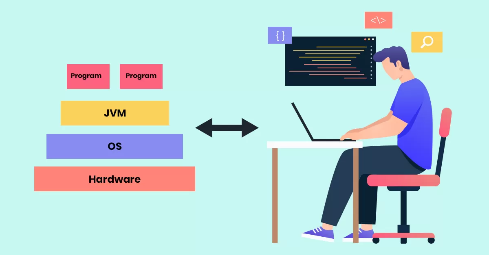
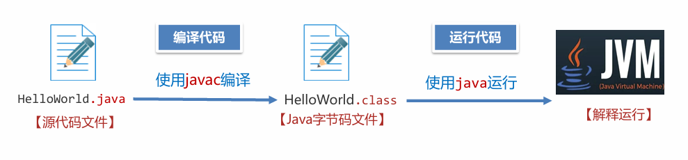
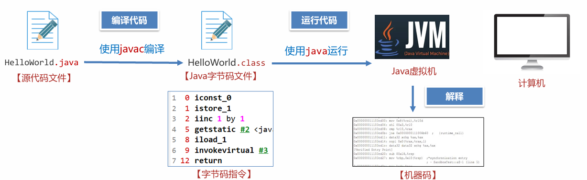
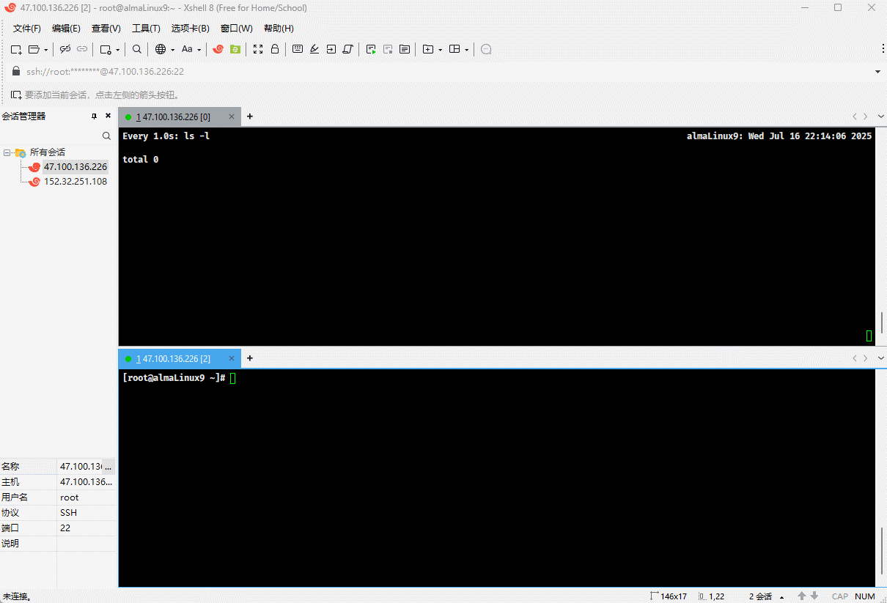

#  第一章：什么是 JVM ？

## 1.1 概述

* `JVM`，全称是 Java Virtual Machine，中文翻译是 `Java 虚拟机`。



* JVM 本质上是一个运行在计算机上的程序，其职责就是将 Java 字节码文件正确地加载并运行。



* 字节码文件中包含了一连串的指令，这些指令被称为`字节码指令`，这些指令是无法在计算机上运行的，因为计算机只能识别一种叫做`机器码`的内容（0 或 1 组成的），如：`00110100...`

> [!NOTE]
>
> * ① JVM 负责将`字节码`转换为`机器码`，这个过程我们称之为`解释`，类似于现实生活中的`翻译`。
> * ② 翻译是将一门语言翻译为另一种语言，如：中 --> 英；而虚拟机是将`字节码`解释成`机器码`。




## 1.2 Java 源代码的执行流程

* Java 源代码的执行，分为以下三个步骤：
  * ① 编写 Java 源代码文件，如：`HelloWorld.java` 。
  * ② 使用 javac 命令将 Java 源文件翻译为字节码文件，如：`HelloWorld.class` 。
  * ③ 使用 Java 命令执行字节码文件，如：`java HelloWorld`，本质上是使用 Java 虚拟机加载并运行 Java 字节码文件，此时会启动一个新的 Java 进程。


* 示例：

::: code-group

```java [Test.java]
public class HelloWorld {
    public static void main(String[] args){
        System.out.println("Hello World!!!");
    }
}
```

```md:img [cmd 控制台]

```

:::


# 第二章：JVM 的功能

## 2.1 概述

* JVM 的功能，如下所示：

| JVM 的功能 | 描述                                                         |
| ---------- | ------------------------------------------------------------ |
| 解释和运行 | 对字节码文件中的指令，实时翻译成机器码，以便计算机执行。     |
| 内存管理   | 自动为对象、方法等分配内存。<br>自动的垃圾回收机制，回收不再使用的对象。 |
| 即时编译   | 针对热点代码进行优化，以提升执行效率。                       |

## 2.2 解释和执行


## 2.3 内存管理


## 2.4 即时编译


# 第三章：常见的 JVM