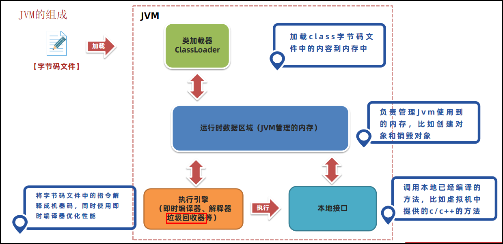

#  第一章：Java 虚拟机的组成

## 1.1 概述

* 需要先了解 Java 虚拟机中的`组成部分`，因为这些`组成部分`中的`重点内容`是后续学习的方向。

## 1.2 Java 虚拟机的组成

* Java 虚拟机主要分为以下几个组成部分：

> [!NOTE]
>
> * ① `类加载子系统`的核心组件是`类加载器`（ClassLoader），负责将字节码文件中的内容，通过磁盘或网络等路径，加载到内存中，以便后续使用。
> * ② `运行时数据区域`是 JVM 管理的内存，创建出来的对象、类的信息等内容都会放到这块区域，如：栈、堆、方法区等。
> * ③ `执行引擎`包含了`即时编译器`、`解释器`以及`垃圾回收器`等：
>   * `执行引擎`使用`解释器`将`字节码指令`解释成`机器码`。
>   * `执行引擎`使用`即时编译器`对热点代码进行优化，以便提高性能。
>   * `执行引擎`使用`垃圾回收器`回收不再使用的对象。
> * ④ `本地接口`就是 Java 调用 C/C++ 中编译好的方法：在 Java 中就是本地方法，使用 native 关键字修饰，没有实现体。

# 第二章：字节码文件的组成

# 第三章：类的生命周期

# 第四章：类加载器

