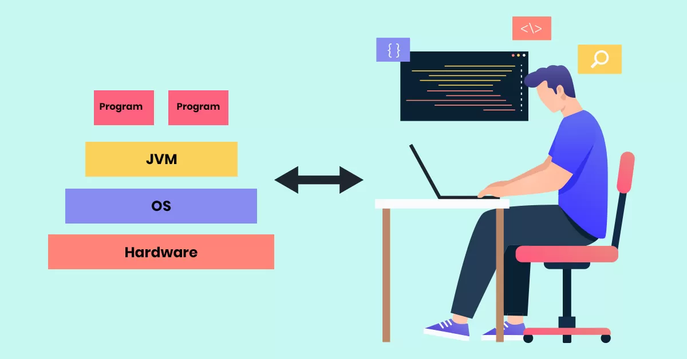
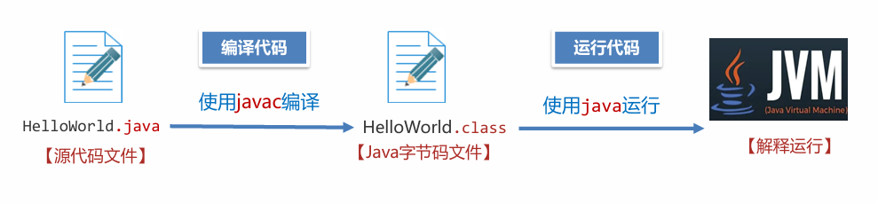
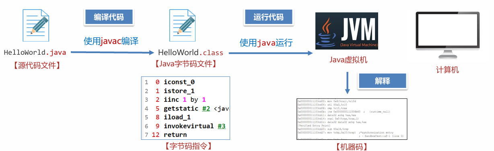
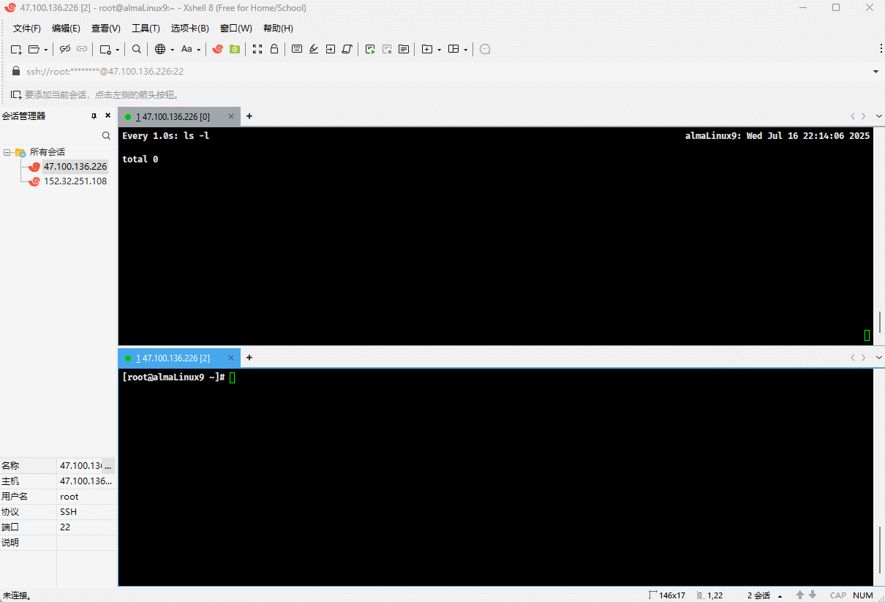
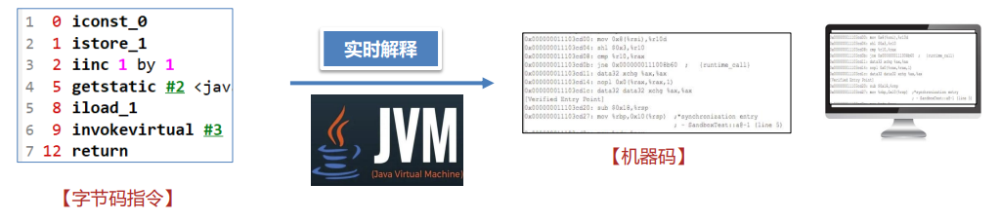
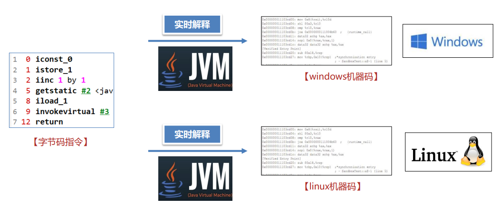
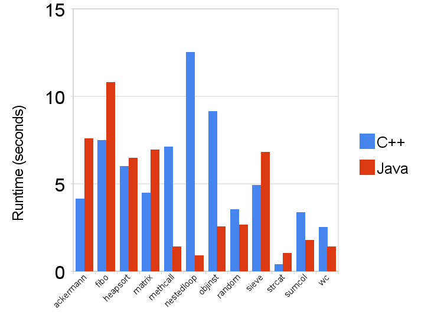
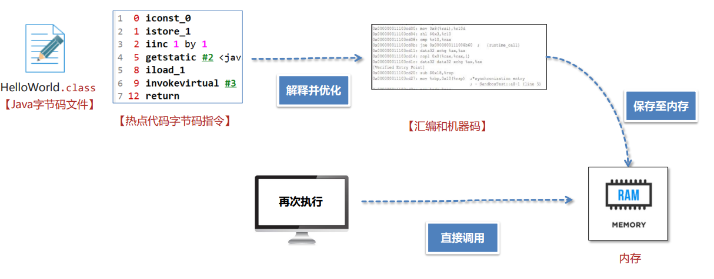
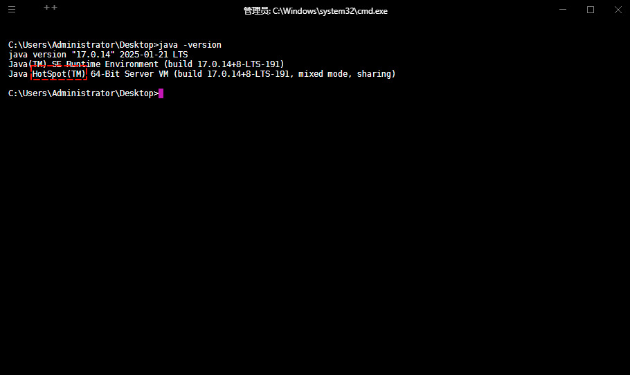
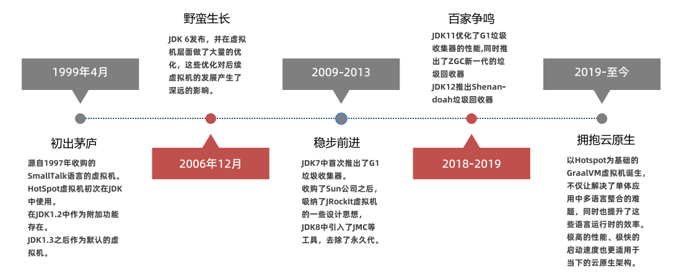

> [!IMPORTANT]
>
> 前置条件：
>
> | 软件       | 版本                                    | 说明            |
> | ---------- | --------------------------------------- | --------------- |
> | JDK        | 8u202 及之前版本 <br>17.0.12 及之前版本 | Java 开发工具包 |
> | IDEA       | 最新                                    | 开发工具        |
> | Linux      | AlmaLinux9                              | 操作系统        |
> | Maven      | 3.9.x                                   | 项目构建工具    |
> | SpringBoot | 3.x                                     | WEB 框架        |

#  第一章：什么是 JVM ？

## 1.1 概述

* `JVM`，全称是 Java Virtual Machine，中文翻译是 `Java 虚拟机`。



* JVM 本质上是一个运行在计算机上的程序，其职责就是将 Java 字节码文件正确地加载并运行。



* 字节码文件中包含了一连串的指令，这些指令被称为`字节码指令`，这些指令是无法在计算机上运行的，因为计算机只能识别一种叫做`机器码`的内容（0 或 1 组成的），如：`00110100...`

> [!NOTE]
>
> * ① JVM 负责将`字节码`转换为`机器码`，这个过程我们称之为`解释`，类似于现实生活中的`翻译`。
> * ② 翻译是将一门语言翻译为另一种语言，如：中 --> 英；而虚拟机是将`字节码`解释成`机器码`。




## 1.2 Java 源代码的执行流程

* Java 源代码的执行，分为以下三个步骤：

| 步骤                                                         | 例子                                       |
| ------------------------------------------------------------ | ------------------------------------------ |
| ① 编写 Java 源代码文件                                       | vim HelloWorld.java                        |
| ② 使用 javac 命令将 Java 源文件翻译为字节码文件              | javac HelloWorld.java --> HelloWorld.class |
| ③ 使用 Java 命令执行字节码文件，本质上是使用 Java 虚拟机加载并运行 Java 字节码文件，此时会启动一个新的 Java 进程。 | java HelloWorld                            |


* 示例：

::: code-group

```java [HelloWorld.java]
public class HelloWorld {
    public static void main(String[] args){
        System.out.println("Hello World!!!");
    }
}
```

```md:img [cmd 控制台]

```

:::


# 第二章：JVM 的功能（⭐）

## 2.1 概述

* JVM 的功能，如下所示：

| JVM 的功能 | 描述                                                         |
| ---------- | ------------------------------------------------------------ |
| 解释和运行 | 对字节码文件中的指令，实时翻译成机器码，以便计算机执行。     |
| 内存管理   | 自动为对象、方法等分配内存。<br>自动的垃圾回收机制，回收不再使用的对象。 |
| 即时编译   | 针对热点代码进行优化，以提升执行效率。                       |

## 2.2 解释和运行

* 所谓的`解释和运行`，就是将字节码文件中的指令实时翻译为机器码，以便计算机中执行。


## 2.3 内存管理

* 所谓的内存管理，指的是如下的两个方面：
  * ① Java 虚拟机可以自动地为对象、方法等分配内存。
  * ② Java 虚拟机内置了垃圾回收机制，可以回收不再使用的对象。

> [!NOTE]
>
> * ① 在 C/C++ 等语言中，对象的回收需要程序员手动编写代码去完成。
> * ② 在 Java 等语言中，对象的回收不需要程序员手动编写代码去完成，降低了开发的难度。

* 手动内存管理 VS 自动内存管理：

| 类型         | 优点                                                         | 缺点                                                         |
| ------------ | ------------------------------------------------------------ | ------------------------------------------------------------ |
| 手动内存管理 | :one: 程序员完全控制内存分配和释放的时机。<br>:two: 没有垃圾回收器的性能开销。<br/>:three: 更适合系统级编程和性能敏感的应用。<br/>:four: 内存使用效率高，可以精确控制内存布局。<br/>:five: 实时性好，没有垃圾回收暂停。<br/>:six: 可以管理各种资源，如：文件、网络连接等。<br>:seven: 运行时性能更高，响应时间一致性好。 | :one: 容易出现内存泄漏，即：忘记释放内存。<br>:two: 可能发生悬空指针，即：使用已释放的内存。<br/>:three: 双重释放错误，即：释放同一块内存两次。<br/>:four: 需要更多的编程经验和仔细的设计。<br/>:five: 开发效率低，需要额外时间处理内存管理。<br/>:six: 调试困难，内存相关 bug 难以定位。<br/>:seven: 学习成本高，需要深入理解内存管理机制。<br/>:eight: 维护成本高，代码重构时容易引入错误。 |
| 自动内存管理 | :one: 编程简单，无需手动管理内存，专注业务逻辑。<br/>:two: 自动避免内存泄漏、悬空指针等问题。<br/>:three: 开发效率高，减少内存管理代码，加快开发速度。<br/>:four: 代码简洁，易于阅读和维护。<br/>:five: 学习成本低，初学者更容易上手。<br/>:six: 类型安全，通常配合类型安全的语言特性。<br/>:seven: 调试相对简单，减少内存相关错误。<br/>:eight: 团队协作效率高，降低对程序员技能要求。 | :one: 性能开销，垃圾回收器消耗 CPU 和内存资源。<br/>:two: 暂停时间，垃圾回收时可能造成程序暂停。<br/>:three: 内存使用多，通常使用更多内存，存在内存开销。<br/>:four: 控制受限，无法精确控制内存分配和释放时机。<br/>:five: 不适合实时系统，垃圾回收的不确定性。<br/>:six: 调优复杂，垃圾回收器的调优需要专业知识。<br/>:seven: 可能存在循环引用问题。<br/>:eight: 启动时间可能较慢（JIT 编译等）。 |


* 示例：

::: code-group

```c [main.c]
#include <stdio.h>

int main(){
    
    int *data = NULL;
    
    // 分配内存
    data = (int*)malloc(5 * sizeof(int));
    if (data == NULL) { // [!code highlight]
        printf("内存分配失败！\n");
        return;
    }
    
    // 使用内存
    for (int i = 0; i < 5; i++) {
        data[i] = i * 2;
    }
    
    printf("数据: ");
    for (int i = 0; i < 5; i++) {
        printf("%d ", data[i]);
    }
    printf("\n");
    
    // 最终释放内存
    free(data); // [!code highlight]
    data = NULL; // [!code highlight]
    
    printf("内存正确释放\n\n");
    
    return 0;
}
```

```java [Test.java]
public class Test {
    public static void main(String[] args){
        int[] arr = new int[5];
        
        for(int i =0;i< arr.length;i++){
            System.out.println(arr[i]);
        }
    }
}
```

:::

## 2.4 即时编译

### 2.4.1 概述

* 即时编译就是针对热点代码进行优化，以提升执行效率。

> [!NOTE]
>
> `即时编译`并不仅仅存在于 Java 虚拟机中，Chrome 的 V8 引擎中也有`即时编译`的思想！！！

* 即时编译这个功能非常强大，甚至可以说是提升 Java 程序性能最核心的手段。

### 2.4.2 Java 性能低的主要原因

* Java 语言如果不做任何优化，其性能是不如 C/C++ 语言的，其主要原因就在于：`在程序运行的过程中，Java 虚拟机需要将字节码指令实时的翻译成计算机能识别的机器码，这个过程在运行的时候可能需要反复地执行，所以性能相对较低`。



* C/C++ 语言性能高的主要原因在于：`只需要将源代码直接编译，生成的可执行文件直接包含了计算机能识别的机器码，即：不需要在运行过程中实时地解释，节省了解释的过程，所以性能相对较高`。


### 2.4.3 Java 的跨平台特性

* Java 之所以需要实时解释，就是为了支持`跨平台`特性。

> [!NOTE]
>
> * ① 将同一份字节码指令，交给 Linux 和 Windows 等不同的平台，这些平台上安装有对应平台的虚拟机，这些虚拟机分别将字节码指令解释为自己平台的机器码，然后就可以交给不同的平台去运行，这样就达到跨平台的特点。
> * ② Java 追求`跨平台`特性，性能相对 C/C++ 差点。



* C/C++ 等语言，如果要想让程序在不同的平台上运行，就需要将一份源代码在不同平台上分别编译，相对比较麻烦。

> [!NOTE]
>
> * ① 如果是纯 C 语言项目，可以使用`预定义宏`来实现跨平台；但是，远不如 Java 内置的简单和方便。
> * ② C/C++ 追求性能；但是，不具备开箱即用的`跨平台`特性。

```c
#include <stdio.h>

#if _WIN32 // 如果是 Windows 平台, 就引入 <windows.h>
#include <windows.h>
#define SLEEP(t) Sleep(t * 1000)
#elif __linux__ // 如果是 Linux 平台， 就引入<unistd.h>
#include <unistd.h>
#define SLEEP sleep
#endif

int main() {

    // 禁用 stdout 缓冲区
    setbuf(stdout, nullptr);

    SLEEP(5);
    printf("hello, 大家好~");

    return 0;
}
```

### 2.4.2 即时编译

* 由于 JVM 需要实时解释`字节码`指令，不做任何优化，性能确实不如直接运行机器码的 C/C++ 等语言。



* 在早期，Java 的性能问题一直被人诟病。JDK 的开发者在 JDK1.1 版本中推出了`即时编译`功能去优化对应的功能。

> [!NOTE]
>
> * ① 虚拟机在运行过程中如果发现某一个方法甚至是循环是热点代码（在很短的时间内被多次调用），即时编译器会优化这段代码（主动将代码进行优化并解释成计算机能够执行的机器码），并将优化后的机器码保存到内存中。
> * ② 如果第二次再去执行这段代码，Java 虚拟机会将机器码从内存中取出来直接进行调用；这样节省了一次解释的步骤，同时执行的是优化后的代码，效率较高。
> * ③ Java 通过`即时编译`（Just In Time，简称 JIT）进行性能的优化，最终能达到接近 C/C++ 语言的性能，在某些特定的场景下甚至可以实现超越。




# 第三章：常见的 JVM（⭐）

## 3.1 概述

* 目前，市场上的 JVM 非常多，如果没有统一的标准（JVM 虚拟机规范），Java 的跨平台特性就无从谈起！！！
* [《Java虚拟机规范》](https://docs.oracle.com/javase/specs/index.html)由 Oracle 制定，内容主要包含了Java虚拟机在设计和实现时需要遵守的规范，主 要包含 class 字节码文件的定义、类和接口的加载和初始化、指令集等内容。
* [《Java虚拟机规范》](https://docs.oracle.com/javase/specs/index.html)是对虚拟机设计的要求，而不是对 Java 设计的要求，也就是说虚拟机可以运行在其他的语言，如：Groovy、Scala生成的 class 字节码文件之上。

## 3.2 Hotspot 虚拟机

* 目前，市场上的 JVM 很多，如下所示：

| 名称                       | 作者    | 支持版本                                  | 社区活跃度  | 特性                                                         | 适用场景                             |
| -------------------------- | ------- | ----------------------------------------- | ----------- | ------------------------------------------------------------ | ------------------------------------ |
| HotSpot (Oracle JDK版)     | Oracle  | 所有版本                                  | 高(闭源)    | 使用最广泛，稳定可靠，社区活跃<br>JIT 支持 Oracle JDK 默认虚拟机 | 默认                                 |
| HotSpot (Open JDK版)       | Oracle  | 所有版本                                  | 中(16.1k)   | 同上开源，Open JDK 默认虚拟机                                | 默认对 JDK 有二次开发需求            |
| GraalVM                    | Oracle  | 11、17、19                                | 高（18.7k） | 多语言支持高性能、JIT、AOT 支持                              | 微服务、云原生架构需要多语言混合编程 |
| Dragonwell JDK             | Alibaba | 标准版： (8、11、17) <br>扩展版：(11、17) | 低(3.9k)    | 基于 OpenJDK 的增强高性能、bug 修复、安全性提升 JWarmup、ElasticHeap、Wisp 特性支持 | 电商、物流、金融领域对性能要求比较高 |
| Eclipse OpenJ9 (原 IBM J9) | IBM     | 8、11、17、19、20                         | 低(3.1k)    | 高性能、可扩展 JIT、AOT 特性支持                             | 微服务、云原生架构                   |

* 但是，平时广泛使用的是 Hotspot 虚拟机：



## 3.3 Hotspot 发展史

* HotSpot 是 Java 生态系统最重要的虚拟机之一，其发展历程反映了Java 性能优化的演进过程。



