#  第一章：Java 虚拟机的组成

## 1.1 概述

* 需要先了解 Java 虚拟机中的`组成部分`，因为这些`组成部分`中的`重点内容`是后续学习的方向。

## 1.2 Java 虚拟机的组成（⭐）

* Java 虚拟机主要分为以下几个组成部分：

> [!NOTE]
>
> * ① `类加载子系统`的核心组件是`类加载器`（ClassLoader），负责将字节码文件中的内容，通过磁盘或网络等路径，加载到内存中，以便后续使用。
> * ② `运行时数据区域`是 JVM 管理的内存，创建出来的对象、类的信息等内容都会放到这块区域，如：栈、堆、方法区等。
> * ③ `执行引擎`包含了`即时编译器`、`解释器`以及`垃圾回收器`等：
>   * `执行引擎`使用`解释器`将`字节码指令`解释成`机器码`。
>   * `执行引擎`使用`即时编译器`（JIT）对热点代码进行优化，以便提高性能。
>   * `执行引擎`使用`垃圾回收器`回收不再使用的对象。
> * ④ `本地接口`就是 Java 调用 C/C++ 中编译好的方法：在 Java 中就是本地方法，使用 native 关键字修饰，没有实现体。


## 1.3 学习内容

* ① 我们将学习`字节码文件`、`类加载器`、`运行时数据区域`、`垃圾回收器`以及`即时编译器`。
* ② 对于`解释器`和`本地接口`只需了解，因为其是 JVM 底层的源码实现，程序员无法进行修改。


# 第二章：字节码文件的组成

## 2.1 为什么要学习字节码文件？

* ① 解决面试难题：

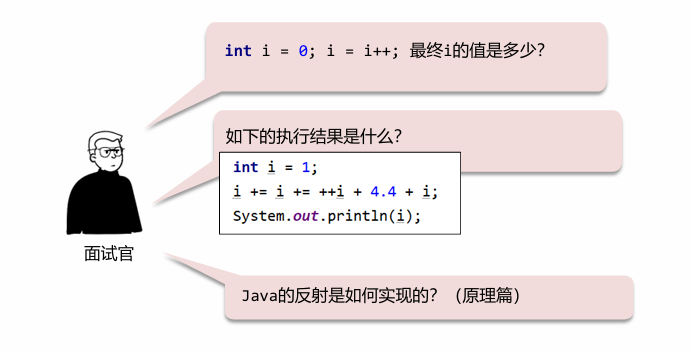

* ② 解决工作中的实际问题 -- 版本冲突：

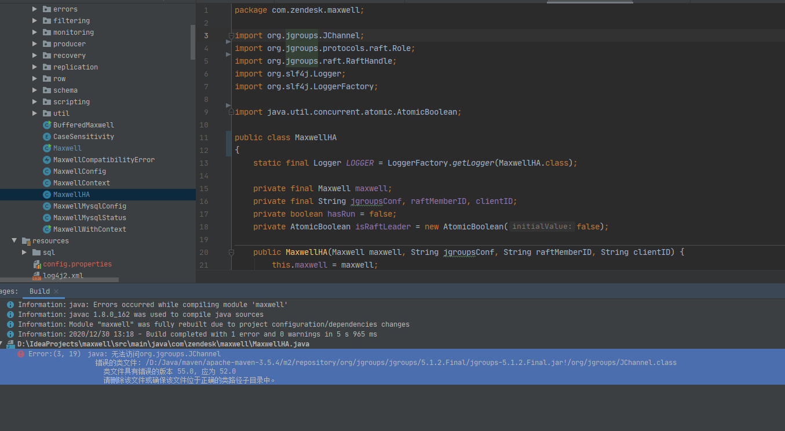

* ③ 解决工作中的实际问题 -- 系统升级：


## 2.2 字节码文件的学习路线

* ① 以正确的姿势打开文件：

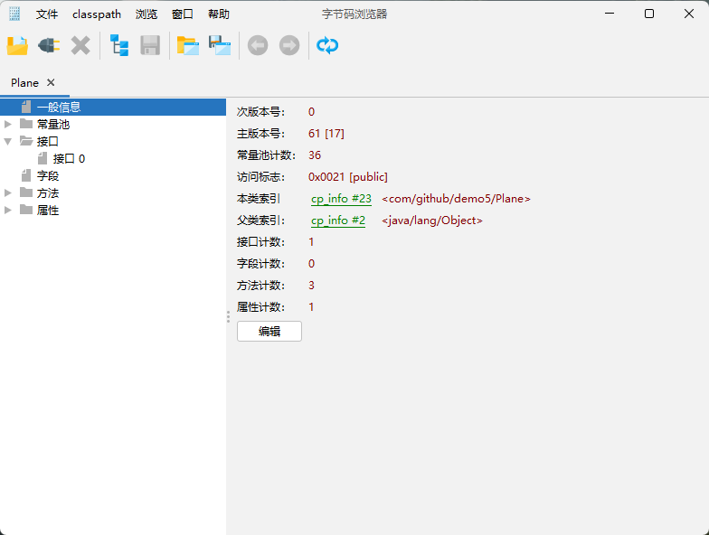

* ② 字节码文件的组成：

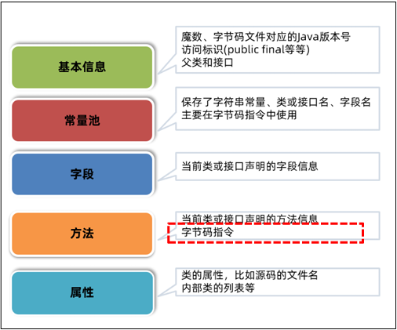

* ③ 玩转字节码常用工具：

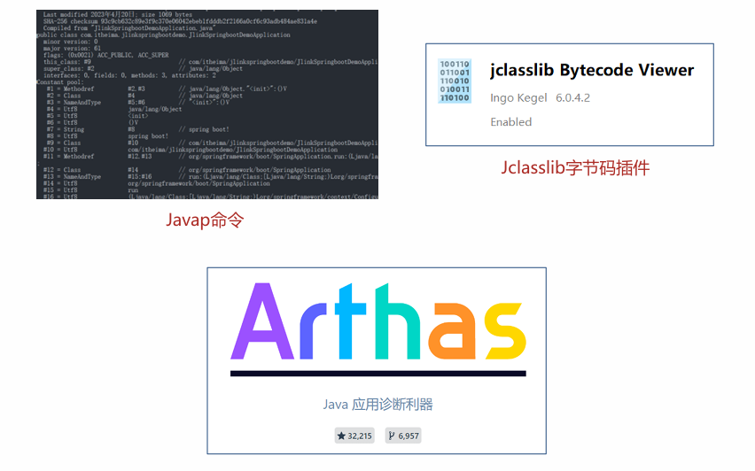

## 2.3 以正确的姿势打开文件（⭐）

* 字节码文件保存了源代码编译后的内容，以二进制的形式存储，并不能使用`记事本`打开阅读。


* 但是，我们可以使用 `NotePad++` 并结合 `Hex-Editor` 插件来查看字节码文件：

> [!NOTE]
>
> * ① 最右边 Dump 是编码之后的结果；但是，虽然有些是英文单词，更多的却是毫无意义的点。
> * ② 如果使用 NotePad++ 在该字节码文件中查找具体的信息，显然是非常不直观的！！！


* 此时，我们就要使用 [jclasslib](https://github.com/ingokegel/jclasslib) 工具来查看字节码文件。

> [!NOTE]
>
> * ① 查找对应操作系统的版本安装即可。
> * ② IDEA 中也有对应的 [jclasslib](https://plugins.jetbrains.com/plugin/9248-jclasslib) 插件。


## 2.4 字节码文件的组成（⭐）

### 2.4.1 概述

* 字节码文件由 5 个部分组成：

> [!NOTE]
>
> * ① 基础信息（一般信息 + 接口）：魔数、字节码文件对应的 Java 版本号、访问标识(public final等等)、父类和接口信息。
> * ② 常量池：保存了字符串常量、类或接口名、字段名，主要在字节码指令中使用。
> * ③ 字段：当前类或接口声明的字段信息。
> * ④ 方法：当前类或接口声明的方法信息，核心内容为方法的字节码指令。
> * ⑤ 属性：类的属性，如：源码的文件名、内部类的列表等。


* 其中，`基础信息`主要包含了魔数、版本号、访问标识（public、final 等等），父类和接口。

> [!NOTE]
>
> 在 jclasslib 中，`基础信息`拆分成`一般信息`和`接口`两个部分。
>
> ::: details 点我查看 具体详情
>
> 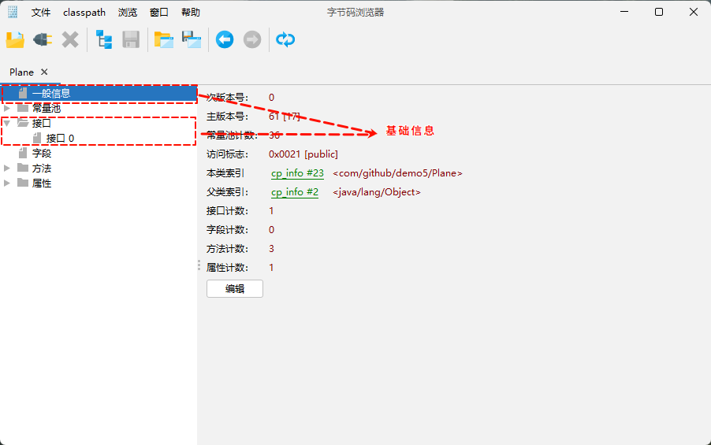
>
> :::

* 其中，`常量池`保存了字符串常量、类或接口名、字段名，主要在字节码指令中使用。

> [!NOTE]
>
> ::: details 点我查看 具体详情
>
> 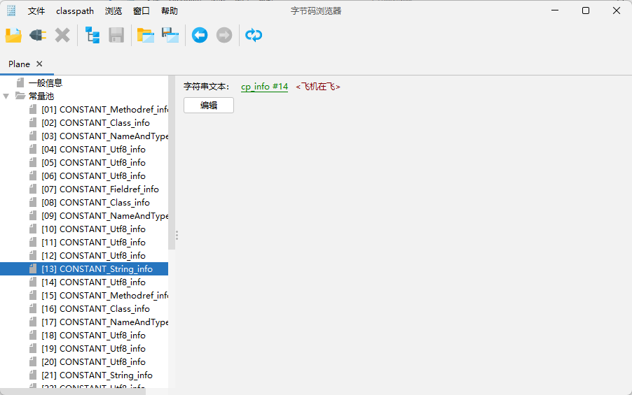
>
> :::

* 其中，`字段`保存了当前类或接口声明的字段信息。

> [!NOTE]
>
> ::: details 点我查看 具体详情
>
> 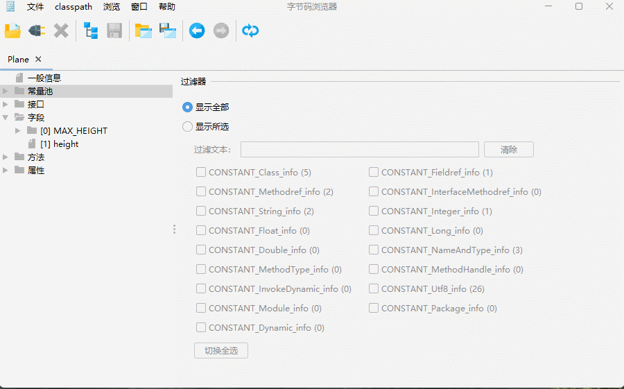
>
> :::

* 其中，`方法`保存了当前类或接口声明的方法信息。

> [!NOTE]
>
> 将源代码中的`方法`信息，即：方法具体的内容，转换为`字节码指令`。
>
> ::: details 点我查看 具体详情
>
> 
>
> :::

* 其中，`属性`保存了类的属性，如：源码的文件名、内部类的列表等。

> [!NOTE]
>
> ::: details 点我查看 具体详情
>
> 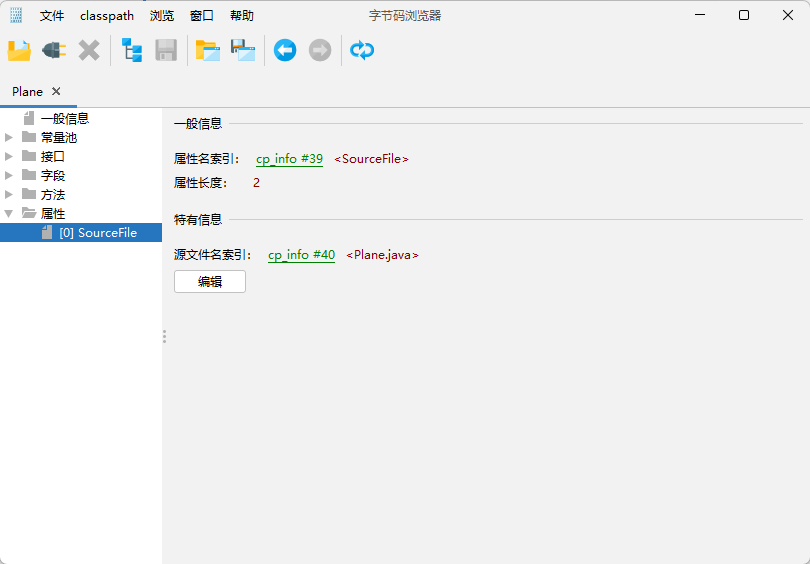
>
> :::

### 2.4.2 友情提醒

* ① 因为`字段`和`属性`非常简单，只需使用 `jclasslib` 看一下就明白，即：不再详细讲解。


* ② 只会对`基本信息`、`常量池`和`方法`，会详细讲解。


### 2.4.3 基本信息

#### 2.4.3.1 概述

* `基本信息`包含了魔数、字节码文件对应的 Java 版本号、访问标识以及父类和接口等。

> [!NOTE]
>
> `基本信息`在 `jclasslib` 中拆分为`一般信息`和`接口`。

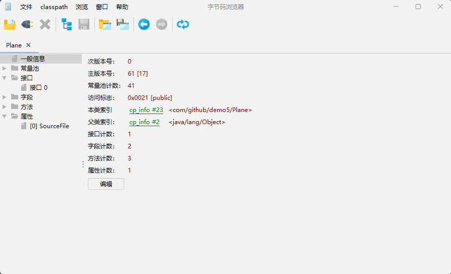

#### 2.4.3.2 魔数（Magic）

* 在 Windows 中，我们平常可能都是通过文件`扩展名`来确定文件的：

| 文件类型   | 扩展名     | 描述                          | 常用程序             |
| ---------- | ---------- | ----------------------------- | -------------------- |
| 文本文档   | .txt       | 纯文本文件                    | 记事本、WordPad      |
| Word 文档  | .docx/.doc | Microsoft Word 文档           | Microsoft Word       |
| Excel 表格 | .xlsx/.xls | Microsoft Excel电子表格       | Microsoft Excel      |
| PowerPoint | .pptx/.ppt | Microsoft PowerPoint 演示文稿 | Microsoft PowerPoint |
| PDF 文档   | .pdf       | 便携式文档格式                | Adobe Reader、浏览器 |

> [!NOTE]
>
> 其实，这只是假象，只是为了方便用户识别对应的文件类型而已！！！

* 程序是无法通过文件扩展名来确定文件，程序会使用文件的头几个字节（文件头）去校验文件的类型。

> [!NOTE]
>
> 如果程序不支持指定的文件类型，却强行使用，将会报错！！！

* 常见的文件格式校验方式，如下所示：

| 文件类型    | 字节数 | 文件头（十六进制）            |
| ----------- | ------ | ----------------------------- |
| jpeg（jpg） | 3      | FF D8 FF                      |
| png         | 4      | 89 50 4E 47（文件尾也有要求） |
| bmp         | 2      | 42 4D                         |
| xml         | 5      | 3C 3F 78 6D 6C                |
| avi         | 4      | 41 56 49 20                   |
| `.class`    | `4`    | `CA FE BA BE`                 |

* 在 Linux 中，我们可以通过 `hexdump` 命令来查看文件的十六进制：

::: code-group

```shell
hexdump -C xxx
```

```md:img [cmd 控制台]
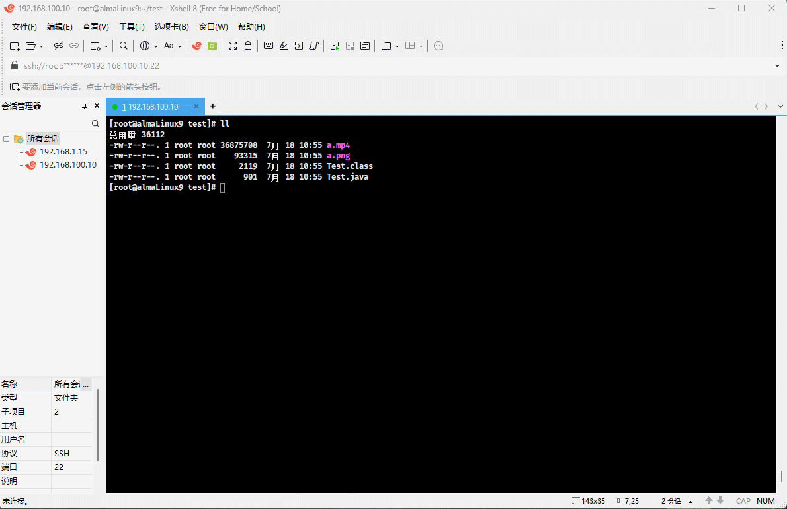
```

:::

* 每个 Java 字节码文件的前四个字节是固定的（ `0xcafebabe`，文件头），称为`魔数`（magic）。

> [!CAUTION]
>
> * ① Java 虚拟机会校验字节码文件的前 4 个字节是否是 `0xcafebabe`。
> * ② 如果不是，该字节码文件就无法正常使用，JVM 就会抛出对应的错误！！！

* Java 字节码文件的`魔数`在 jclasslib 是不显示，原因如下：
  * ① 如果是`非法`的字节码文件，jclasslib 是无法正常读取。
  * ② 如果是`合法`的字节码文件，jclasslib 是可以正常读取，并解析其中的信息。

#### 2.4.3.3 主次版本号

* `主次版本号指的是编译字节码文件时使用的 JDK 版本号`，如下所示：
  * 主版本号用来表示标识大版本号，如：JDK1.0 ~ JDK1.1 使用的是 45.0 ~ 45.3 。
  * 次版本号是当主版本号相同时作为区分不同版本的标识，如：JDK1.0 ~ JDK1.1 使用的是 45.0 ~ 45.3 。

> [!NOTE]
>
> 从 JDK1.2 之后，已经不再使用次版本号了，每升级一个大版本就 +1 。

* JDK 1.2 之后主版本号的计算方法就是：`主版本号 - 44`，如：主版本号是 61 ，JDK 的版本就是 17 。

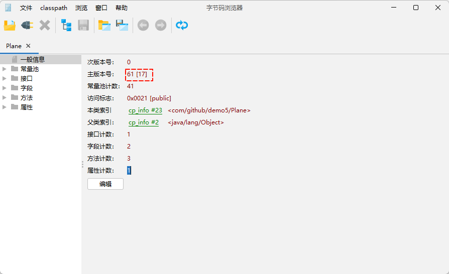

* 版本号用来判断`当前字节码的版本`和`运行时的 JDK` 是否兼容，即：高版本的 JDK 可以运行低版本的字节码文件。

> [!IMPORTANT]
>
> * ① 如果使用低版本的 JDK 去执行较高版本的 JDK 的字节码文件，将会出现如下的错误：
>
> ```txt
> 类文件具有错误的版本 55.0，应为 52.0
> 请删除该文件或确保该文件位于正确的类路径子目录中
> ```
> * ② 有如下的三种解决方案：
>   * :one: 升级 JDK ，​将上面的 JDK 版本由 JDK8 升级到 JDK11 就可以正常运行；但是，可能会引起其他的兼容性问题，需要进行大量的测试。
>   * :two: 将第三方依赖的版本号降低或者更换依赖，以满足 JDK 版本的要求。
>   * :three: 使用 JDK9 提供的 `多版本兼容 jar` 技术，即：创建仅在特定版本的 Java 环境中运行库程序时选择使用的 class 版本。

#### 2.4.3.4 其它信息

* 其它信息：访问标识（标志）、本类索引、接口索引，如下所示：


### 2.4.4 常量池

#### 2.4.4.1 概述

* 字节码文件中常量池的作用：`避免相同的内容重复定义，节省空间`。

#### 2.4.4.2 推演

* 假设，我们在代码中定义相同的字符串，如下所示：

```java
public class Test {
    public static void main(String[] args) {
        String str = "人类无敌"; // [!code highlight]
        String str2 = "人类无敌"; // [!code highlight]
    }
}
```

* 如果在编译之后，在字节码文件中也出现一模一样的两个字符串，将会是一种空间浪费。


* 刚才只出现了两个相同的字符串；但是，如果是三个、四个、...，甚至无数次，如下所示：

```java
public class Test {
    public static void main(String[] args) {
        for(int i = 0;i < 100_100_100;i++) { // [!code highlight:3]
             String str = "人类无敌";
        }
    }
}
```

* 按照刚才的想法，字节码文件的内容将会越来越多，体积也会越来越大，如下所示：

> [!NOTE]
>
> 文件的体积太大，会影响将来文件的读取，使得文件读取的效率变得很低！！！


#### 2.4.4.3 优化措施

* ① 常量池中的数据都有一个编号，编号从 1 开始，这样就可以在`字段`或`字节码指令`中通过编号快速找到对应的数据。

::: code-group

```java [Test.java]
public class Test {

    private static final String str = "人类无敌";
    private static final String str2 = "人类无敌";
    private static final String str3 = "str";

    public static void main(String[] args) {
        System.out.println(str);
        System.out.println(str2);
        System.out.println(str3);
    }
}
```

```md:img [cmd 控制台]

```

:::

* ② `字节码指令`中通过`编号`引用到常量池的过程称之为`符号引用`：


### 2.4.5 方法

#### 2.4.5.1 概述

* 字节码的`方法区域`是`字节码指令`的核心位置，字节码指令的内容存放在方法的 `Code` 属性中。


* 至此，我们就需要关注这些`字节码指令`在每一行执行过程中，到底做了什么？

> [!NOTE]
>
> jclasslib 提供了快捷方式，可以选中`字节码指令`，右键选择`显示JVM规范`，就会自动跳转到 Oracle 官网。

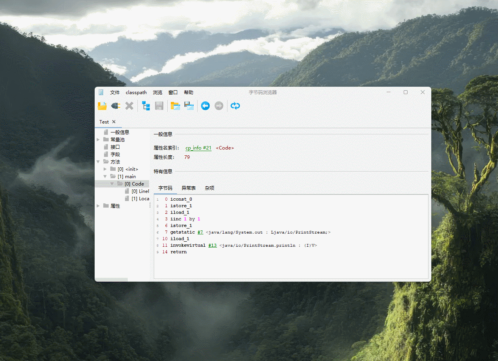

#### 2.4.5.2 操作数栈和局部变量表

* 假设，代码是这样的，如下所示：

```java
public class Test {
    public static void main(String[] args) {
        int i = 0;
        int j = i + 1;
    }
}
```

* 上述代码编译为字节码指令就是这样的，如下所示：

::: code-group

```txt [byte code]
0 iconst_0
1 istore_1
2 iload_1
3 iconst_1
4 iadd
5 istore_2
6 return
```

```md:img [cmd 控制台]
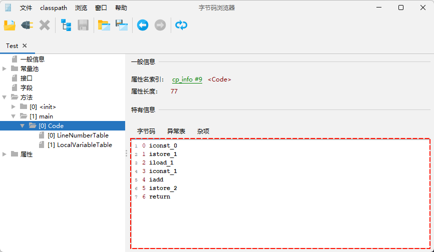
```

:::

> [!NOTE]
>
> 要理解上述字节码指令是如何执行的，我们需要先理解两块内存区域：`操作数栈`和`局部变量表`！！！

* `操作数栈`就是用来存放临时数据的内容，是一个栈式结构，其特点是：先近后出。


* `局部变量表`就是一个数组，用来存放方法中的局部变量（方法的形参、方法中定义的局部变量），在编译期就可以确定方法有多少个局部变量。


* 其实，我们可以从 jclasslib 中获取`局部变量表（本地变量表）`的信息，如下所示：

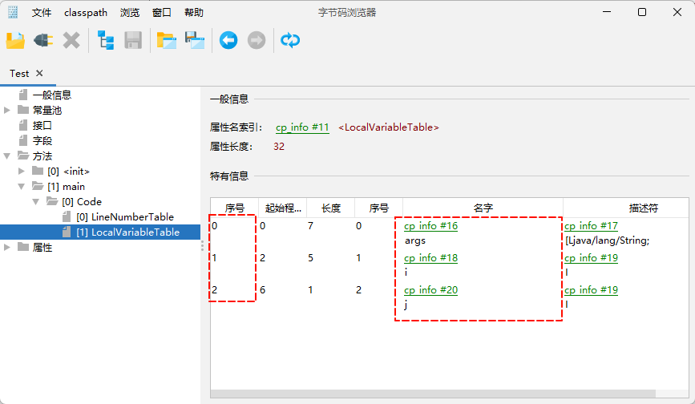

#### 2.4.5.3 字节码指令的学习

* 刚开始，还没有执行任何字节码指令，在内存中是这样的，如下所示：


* 当执行了 `int i = 0` ，其会拆分为 `iconst_0` 指令和 `istore_1` 指令，以便对 `i` 进行赋值：


* 当执行了 `iconst_0` 指令，其对应的指令是 `iconst_<i>`，其中 `<i>` 是常量。

> [!NOTE]
>
> * ① `iconst_<i>` 指令的含义：将常量 `<i>` push（推） 到操作数栈上。
> * ②  `iconst_0` 指令就是将常量 `0` 压入到操作数栈上。

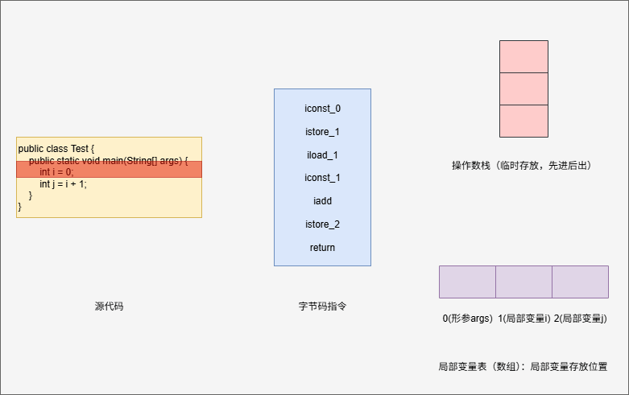

* 当执行了 `istore_1` 指令，其对应的指令是 `istore_<n>`，其中 `<n>` 是常量。

> [!NOTE]
>
> * ① `istore_<n>` 指令的含义：从操作数栈中，将栈顶的元素弹出来，并存放到局部变量表中索引为 `<n>` 的位置。
> * ② `istore_1` 指令就是从操作数栈中，将栈顶的元素 `0` 弹出来，并存放到局部变量表中索引为 `1` 的位置。

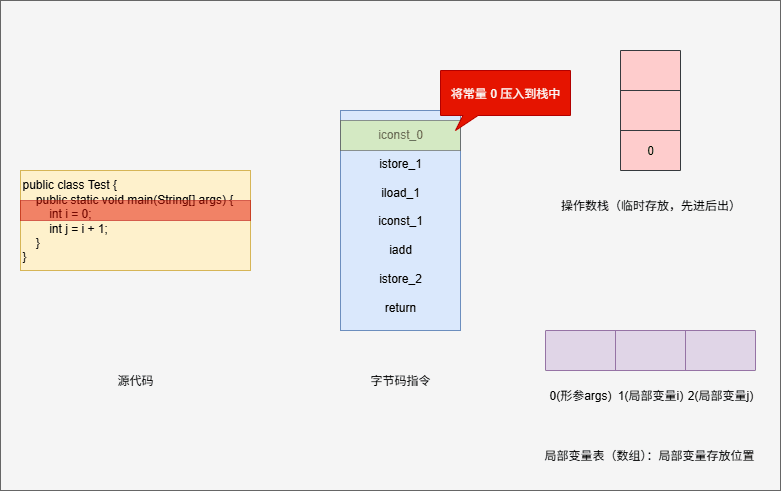

* 当执行到了 `int j = i + 1`，其实分为两个步骤：

> [!NOTE]
>
> * :one: 计算 i + 1 的结果。
> * :two: 将 i + 1 的结果赋值给 j 。


* 换言之，当执行到了 `int j = i + 1` ，就涉及到了 4 个字节码指令：


* 当执行到 `iload_1` 指令的时候，其对应的指令是 `iload_<n>`，其中 `<n>` 是常量。

> [!NOTE]
>
> * ① `iload_<n>` 指令的含义：将局部变量表中索引为 `<n>` 的位置上的值 push（推） 到操作数栈上。
> * ② `iload_1` 指令就是将局部变量表中索引为 `1`的位置上的值 push（推） 到操作数栈上。
> * ③ `iload_<n>` 指令和 `istore_<n>` 指令不同：
>   * :one:`iload_<n>` 指令是加载操作，即：从局部变量表中复制了一份存入到操作数栈中（复制粘贴）。
>   * :two:`istore_<n>` 这里是弹出并存储操作，即：从操作数栈中弹出栈顶圆形，并存储到局部变量表中（剪切粘贴）。

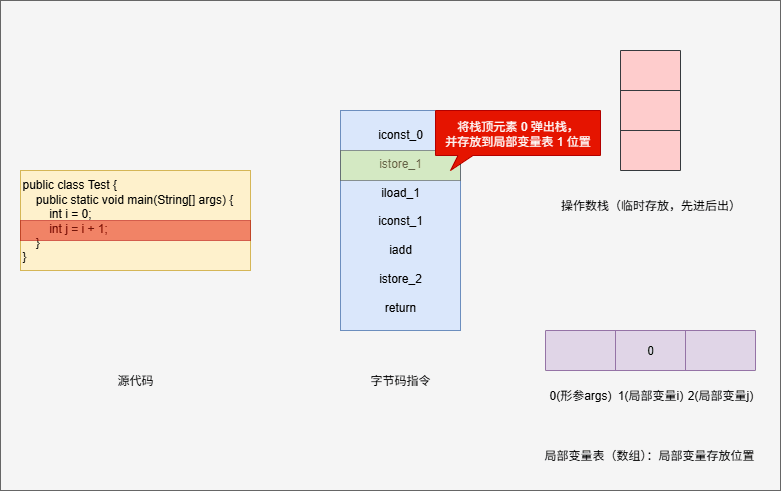

* 当执行了 `iconst_1` 指令，其对应的指令是 `iconst_<i>`，其中 `<i>` 是常量。

> [!NOTE]
>
> * ① `iconst_<i>` 指令的含义：将常量 `<i>` push（推） 到操作数栈上。
> * ②  `iconst_1` 指令就是将常量 `1` 压入到操作数栈上。

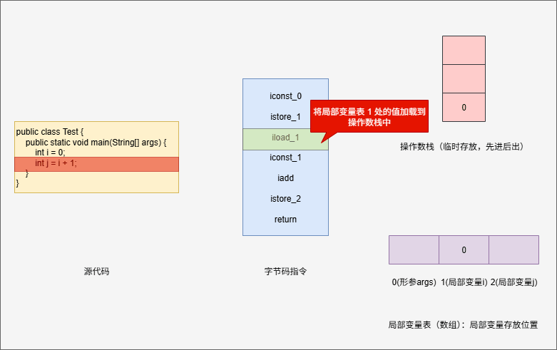

* 当执行了 `iadd` 指令：

> [!NOTE]
>
> `iadd` 指令的含义：将操作数栈上的栈顶两个数据弹出并累加，再压入到操作数栈中。

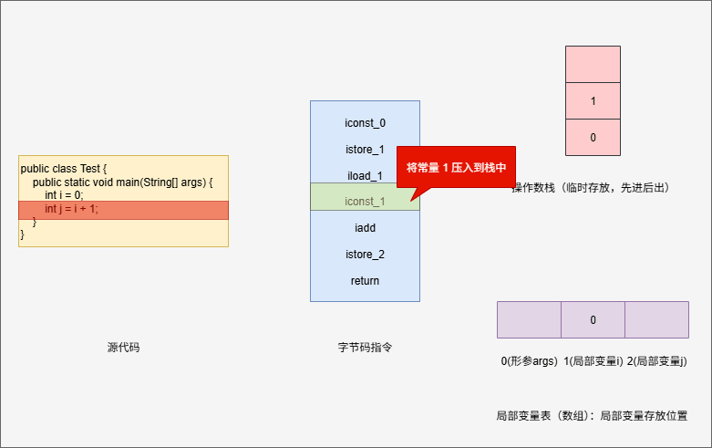

* 当执行了 `istore_2` 指令，其对应的指令是 `istore_<n>`，其中 `<n>` 是常量。

> [!NOTE]
>
> * ① `istore_<n>` 指令的含义：从操作数栈中，将栈顶的元素弹出来，并存放到局部变量表中索引为 `<n>` 的位置。
> * ② `istore_2` 指令就是从操作数栈中，将栈顶的元素 `1` 弹出来，并存放到局部变量表中索引为 `2` 的位置。

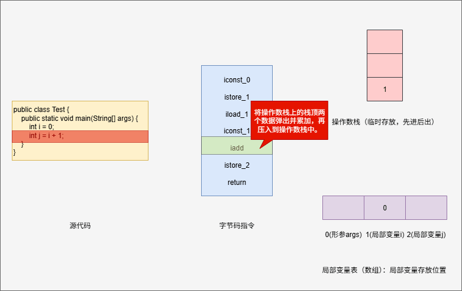

#### 2.4.5.4 面试题

* 如果代码是这样的，如下所示：

```java
public class Test {
    public static void main(String[] args) {
       int i = 0;
       i = i++;
    }
}
```

* 其对应的字节码指令就是这样的，如下所示：

```txt
iconst_0
istore_1
iload_1
iinc 1 by 1
istore_1
return
```

* 当执行了 `iconst_0` 指令，其对应的指令是 `iconst_<i>`，其中 `<i>` 是常量。

> [!NOTE]
>
> * ① `iconst_<i>` 指令的含义：将常量 `<i>` push（推） 到操作数栈上。
> * ②  `iconst_0` 指令就是将常量 `0` 压入到操作数栈上。

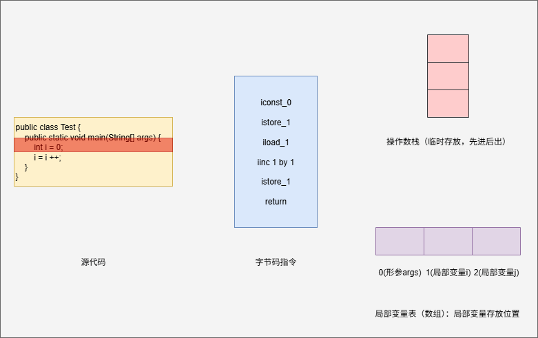

* 当执行了 `istore_1` 指令，其对应的指令是 `istore_<n>`，其中 `<n>` 是常量。

> [!NOTE]
>
> * ① `istore_<n>` 指令的含义：从操作数栈中，将栈顶的元素弹出来，并存放到局部变量表中索引为 `<n>` 的位置。
> * ② `istore_1` 指令就是从操作数栈中，将栈顶的元素 `0` 弹出来，并存放到局部变量表中索引为 `1` 的位置。

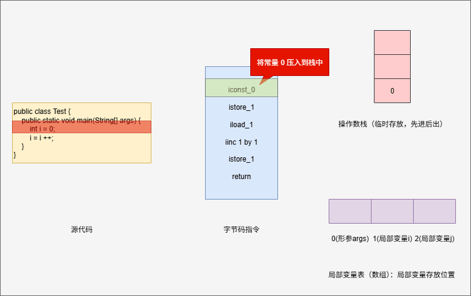

* 当执行到 `iload_1` 指令的时候，其对应的指令是 `iload_<n>`，其中 `<n>` 是常量。

> [!NOTE]
>
> * ① `iload_<n>` 指令的含义：将局部变量表中索引为 `<n>` 的位置上的值 push（推） 到操作数栈上。
> * ② `iload_1` 指令就是将局部变量表中索引为 `1`的位置上的值 push（推） 到操作数栈上。
> * ③ `iload_<n>` 指令和 `istore_<n>` 指令不同：
>   * :one:`iload_<n>` 指令是加载操作，即：从局部变量表中复制了一份存入到操作数栈中（复制粘贴）。
>   * :two:`istore_<n>` 这里是弹出并存储操作，即：从操作数栈中弹出栈顶圆形，并存储到局部变量表中（剪切粘贴）。

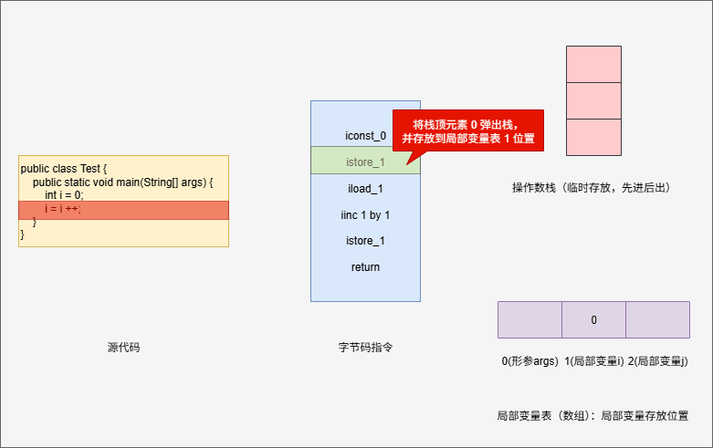

* 当执行到 `iinc 1 by 1` 指令的时候，其对应的指令是 `iinc <n> by ?`，其中 `<n>` 是常量。

> [!NOTE]
>
> `iinc 1 by 1` 指令的含义：直接对局部变量表索引为 `1` 的位置处进行增加 `1` 操作。


* 当执行了 `istore_1` 指令，其对应的指令是 `istore_<n>`，其中 `<n>` 是常量。

> [!NOTE]
>
> * ① `istore_<n>` 指令的含义：从操作数栈中，将栈顶的元素弹出来，并存放到局部变量表中索引为 `<n>` 的位置。
> * ② `istore_1` 指令就是从操作数栈中，将栈顶的元素 `0` 弹出来，并存放到局部变量表中索引为 `1` 的位置。

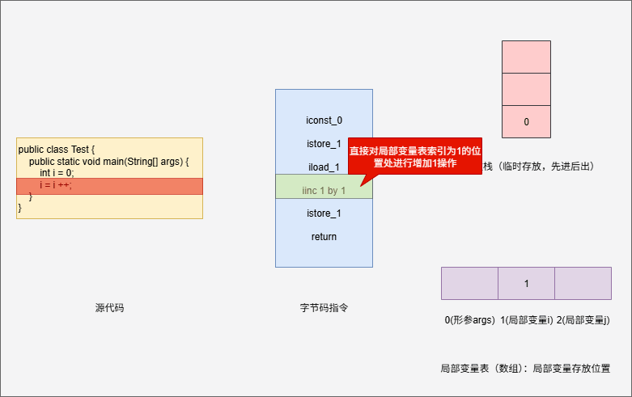

## 2.5 玩转字节码常用工具（⭐）

### 2.5.1 概述

* 在之前，我们都是使用 jclasslib 工具来打开字节码文件并详细查看其中的内容。
* 其实，在实际开发中，我们还会使用其他的工具，这些工具的使用场景是不一样的：

| 工具          | 功能             | 主要使用场景               | 特点                           |
| ------------- | ---------------- | -------------------------- | ------------------------------ |
| **javap**     | 反汇编字节码     | 查看字节码指令、学习JVM    | JDK 自带，轻量级，静态分析     |
| **jclasslib** | 图形化字节码查看 | 可视化学习字节码结构       | 界面友好，IDE 插件，结构化展示 |
| **Arthas**    | 动态诊断         | 生产环境问题排查、性能调优 | 功能强大，支持热更新，动态监控 |
| **dump**      | 导出运行时类     | 获取JVM已加载类信息        | 运行时状态，批量导出           |
| **jad**       | 反编译源码       | 逆向工程、查看第三方库     | 输出Java源码，易于理解         |

### 2.5.2 javap 命令

* `javap` 是 JDK 自带的`反编译`工具，可以通过控制台查看字节码文件的内容。 
* javap 命令的使用：

```shell
javap [-v] [全限定类名|全限定类名.class]
```

> [!NOTE]
>
> * `-v`：表示查看所有附加信息，如：基本信息、常量池、字段、方法和属性。
> * `-cp <path>`：指定查找用户类文件的位置，即：从 jar 包中查看类。
> * `-p`：显示所有类和成员（包含私有）。

> [!CAUTION]
>
> * ① 如果使用`-cp <path>`查看查询 jar 包中的某个类，只能使用`全限定类名`的方式！！！
> * ② 如果什么参数也不加，默认获取的是基本类信息！！！


* 示例：反编译字节码文件，获取所有附件信息（基本信息、常量池、字段、方法和属性）

::: code-group

```shell
javap -v Test.class
```

```md:img [cmd 控制台]
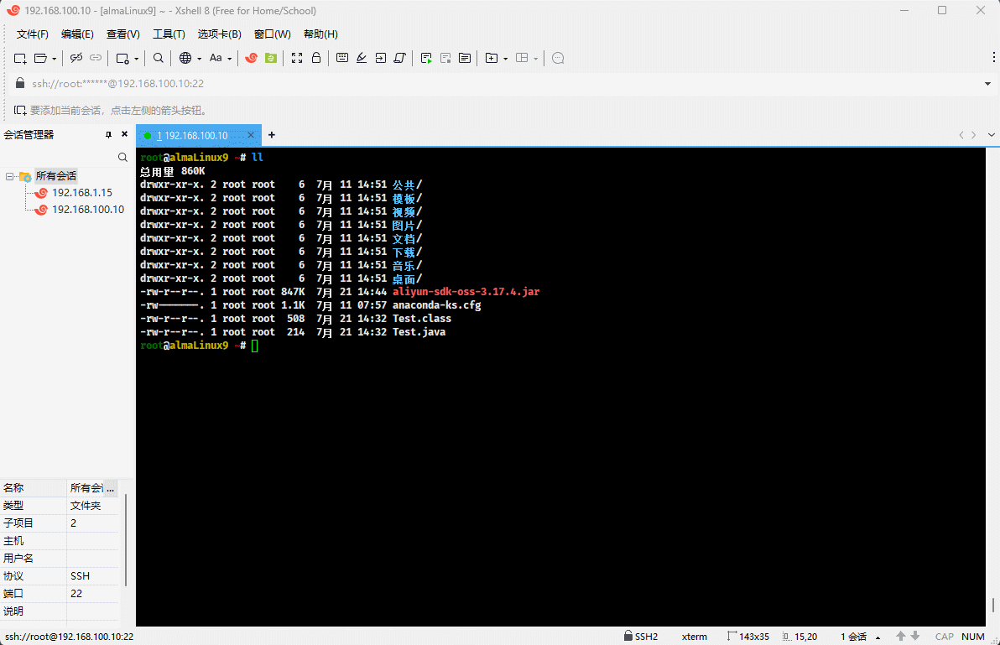
```

```txt [cmd 控制台]
Classfile /root/Test.class
  Last modified 2025-7-21; size 508 bytes
  MD5 checksum 035be7e261a22f028b0c25368572ee47
  Compiled from "Test.java"
public class Test
  minor version: 0
  major version: 52
  flags: ACC_PUBLIC, ACC_SUPER
Constant pool:
   #1 = Methodref          #7.#19         // java/lang/Object."<init>":()V
   #2 = Fieldref           #20.#21        // java/lang/System.out:Ljava/io/PrintStream;
   #3 = Class              #22            // Test
   #4 = String             #23            // 人类无敌
   #5 = Methodref          #24.#25        // java/io/PrintStream.println:(Ljava/lang/String;)V
   #6 = Methodref          #24.#26        // java/io/PrintStream.println:(I)V
   #7 = Class              #27            // java/lang/Object
   #8 = Utf8               str
   #9 = Utf8               Ljava/lang/String;
  #10 = Utf8               ConstantValue
  #11 = Utf8               <init>
  #12 = Utf8               ()V
  #13 = Utf8               Code
  #14 = Utf8               LineNumberTable
  #15 = Utf8               main
  #16 = Utf8               ([Ljava/lang/String;)V
  #17 = Utf8               SourceFile
  #18 = Utf8               Test.java
  #19 = NameAndType        #11:#12        // "<init>":()V
  #20 = Class              #28            // java/lang/System
  #21 = NameAndType        #29:#30        // out:Ljava/io/PrintStream;
  #22 = Utf8               Test
  #23 = Utf8               人类无敌
  #24 = Class              #31            // java/io/PrintStream
  #25 = NameAndType        #32:#33        // println:(Ljava/lang/String;)V
  #26 = NameAndType        #32:#34        // println:(I)V
  #27 = Utf8               java/lang/Object
  #28 = Utf8               java/lang/System
  #29 = Utf8               out
  #30 = Utf8               Ljava/io/PrintStream;
  #31 = Utf8               java/io/PrintStream
  #32 = Utf8               println
  #33 = Utf8               (Ljava/lang/String;)V
  #34 = Utf8               (I)V
{
  public static final java.lang.String str;
    descriptor: Ljava/lang/String;
    flags: ACC_PUBLIC, ACC_STATIC, ACC_FINAL
    ConstantValue: String 人类无敌

  public Test();
    descriptor: ()V
    flags: ACC_PUBLIC
    Code:
      stack=1, locals=1, args_size=1
         0: aload_0
         1: invokespecial #1                  // Method java/lang/Object."<init>":()V
         4: return
      LineNumberTable:
        line 1: 0

  public static void main(java.lang.String[]);
    descriptor: ([Ljava/lang/String;)V
    flags: ACC_PUBLIC, ACC_STATIC
    Code:
      stack=2, locals=2, args_size=1
         0: bipush        10
         2: istore_1
         3: getstatic     #2                  // Field java/lang/System.out:Ljava/io/PrintStream;
         6: ldc           #4                  // String 人类无敌
         8: invokevirtual #5                  // Method java/io/PrintStream.println:(Ljava/lang/String;)V
        11: getstatic     #2                  // Field java/lang/System.out:Ljava/io/PrintStream;
        14: iload_1
        15: invokevirtual #6                  // Method java/io/PrintStream.println:(I)V
        18: return
      LineNumberTable:
        line 4: 0
        line 6: 3
        line 7: 11
        line 8: 18
}
SourceFile: "Test.java"

```

:::


* 示例：反编译指定 jar 包中的指定字节码文件，获取基本类信息

::: code-group

```shell
javap -cp aliyun-sdk-oss-3.17.4.jar com.aliyun.oss.OSS
```

```md:img [cmd 控制台]

```

:::

### 2.5.3 jclasslib 插件

* IDEA 中有对应的 [jclasslib](https://plugins.jetbrains.com/plugin/9248-jclasslib) 插件，建议在开发阶段使用，可以在代码编译之后实时查看字节码文件的内容。
* IDEA 插件安装方式：

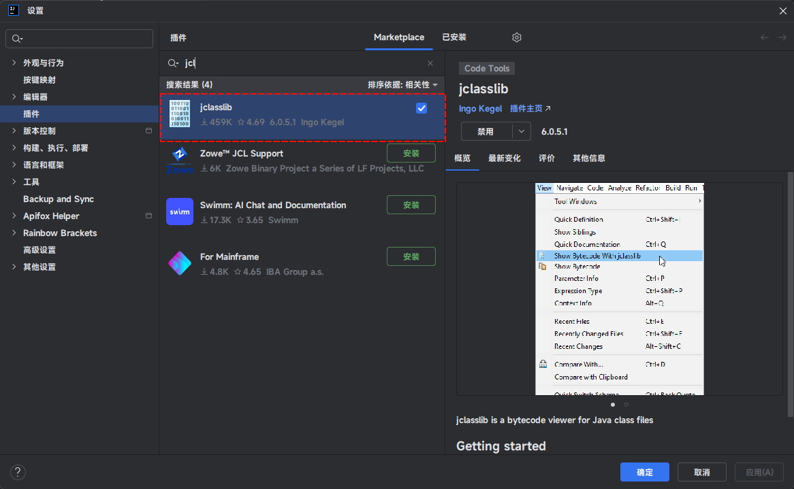

* IDEA 插件使用方式：
  * ① 先选择源代码文件，点击`视图`（view）菜单，并选择 `Show Bytecode With Jclasslib`。
  * ② 如果文件修改之后，需要重新编译，并点击`刷新`按钮。


* 示例：

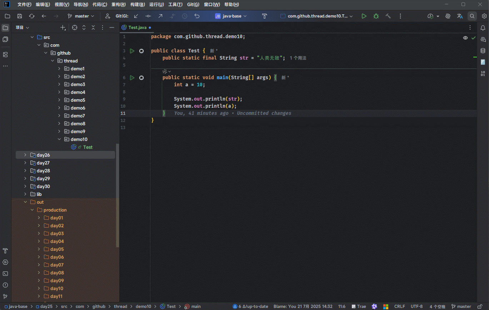

### 2.5.4 Arthas

#### 2.5.4.1 概述

* [Arthas](https://arthas.aliyun.com/) 是一款线上监控诊断产品，通过全局视角实时查看应用 load、内存、gc、线程的状态信息，并能在不修改应用代码的情况下，对业务问题进行诊断，包括查看方法调用的出入参、异常，监测方法执行耗时，类加载信息等，大大提升线上问题排查效率。

> [!NOTE]
>
> ::: details 点我查看 为什么选择？
>
> * ① 通常，本地开发环境无法访问生产环境。如果在生产环境中遇到问题，则无法使用 IDE 远程调试。更糟糕的是，在生产环境中调试是不可接受的，因为它会暂停所有线程，导致服务暂停。
> * ② 开发人员可以尝试在测试环境或者预发环境中复现生产环境中的问题。但是，某些问题无法在不同的环境中轻松复现，甚至在重新启动后就消失了。
> * ③ 如果您正在考虑在代码中添加一些日志以帮助解决问题，您将必须经历以下阶段：测试、预发，然后生产。这种方法效率低下，更糟糕的是，该问题可能无法解决，因为一旦 JVM 重新启动，它可能无法复现，如上文所述。
> * ④ Arthas 旨在解决这些问题。开发人员可以在线解决生产问题。无需 JVM 重启，无需代码更改。 Arthas 作为观察者永远不会暂停正在运行的线程。
>
> :::

* `Arthas` 是 Alibaba 开源的 Java 诊断工具，深受开发者喜爱，可以为您解决如下的问题：
  * :one: 这个类从哪个 jar 包加载的？为什么会报各种类相关的 Exception？
  * :two: 我改的代码为什么没有执行到？难道是我没 commit？分支搞错了？
  * :three: 遇到问题无法在线上 debug，难道只能通过加日志再重新发布吗？
  * :four: 线上遇到某个用户的数据处理有问题，但线上同样无法 debug，线下无法重现！
  * :five: 是否有一个全局视角来查看系统的运行状况？
  * :six: 有什么办法可以监控到 JVM 的实时运行状态？
  * :seven: 怎么快速定位应用的热点，生成火焰图？
  * :eight: 怎样直接从 JVM 内查找某个类的实例？

> [!NOTE]
>
> `Arthas` 支持 JDK 6+（4.x 版本不再支持 JDK 6 和 JDK 7），支持 Linux/Mac/Windows，采用命令行交互模式，同时提供丰富的 `Tab` 自动补全功能，进一步方便进行问题的定位和诊断。

* Arthas 的功能，如下所示：

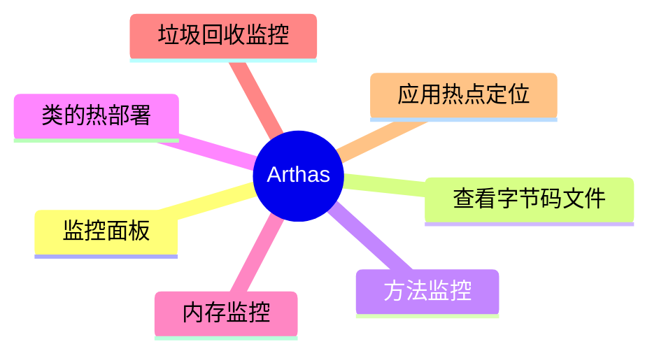
```mermaid
mindmap
  root((Arthas ))
    监控面板
    查看字节码文件
    方法监控
    类的热部署
    内存监控
    垃圾回收监控
    应用热点定位
```


#### 2.5.4.2 安装

##### 2.5.4.2.1 准备工作

* 准备一个无限循环的程序，每隔 500 毫秒休眠一下：

::: code-group

```java
import java.time.LocalDateTime;
import java.time.format.DateTimeFormatter;
import java.util.concurrent.TimeUnit;

public class Test {
    private static final DateTimeFormatter df 
        = DateTimeFormatter.ofPattern("yyyy-MM-dd HH:mm:ss");

    public static void main(String[] args) throws InterruptedException {
        while (true) {
            System.out.println(df.format(LocalDateTime.now()));
            TimeUnit.MILLISECONDS.sleep(500);
        }
    }
}
```

```md:img [cmd 控制台]
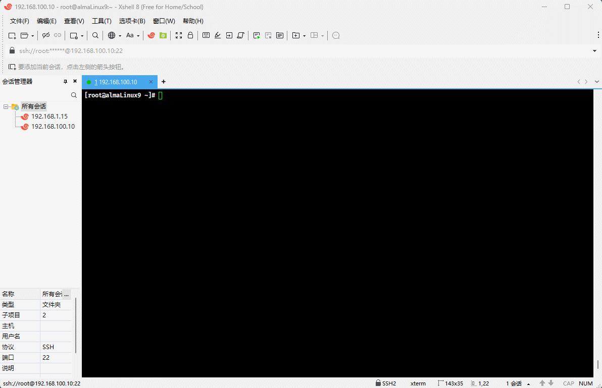
```

:::

##### 2.5.4.2.2 使用 `arthas-boot`

* ① 下载 `arthas-boot.jar` ：

::: code-group

```bash
curl -O https://arthas.aliyun.com/arthas-boot.jar
```

```md:img [cmd 控制台]
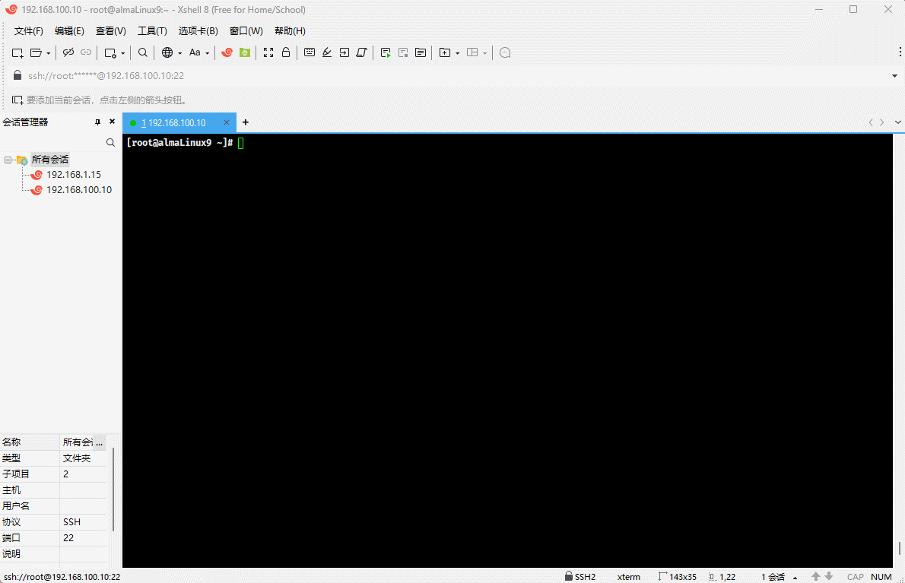
```

:::

* ② 启动并连接到指定的 Java 进程上：

::: code-group

```bash
jar -jar arthas-boot.jar
```

```md:img [cmd 控制台]
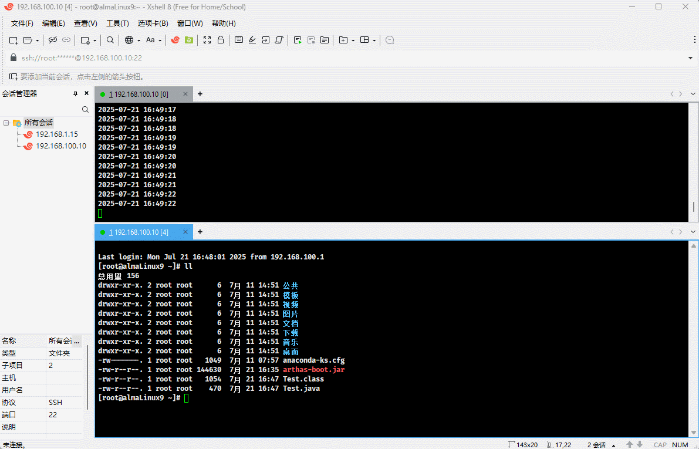
```

:::

#### 2.5.4.3 命令

##### 2.5.4.3.1 dashboard

* 命令：

```shell
dashboard [-i xxx] [-n xxx]
```

> [!NOTE]
>
> * ① 显示当前系统的实时数据面板，按 ctrl + c 退出。
> * ② 参数：
>   * `-i xxx`：刷新实时数据的时间间隔（ms），默认是 5000 ms。
>   * `-n xxx`：刷新实时数据的次数。


* 示例：

::: code-group

```bash
dashboard
```

```md:img [cmd 控制台]
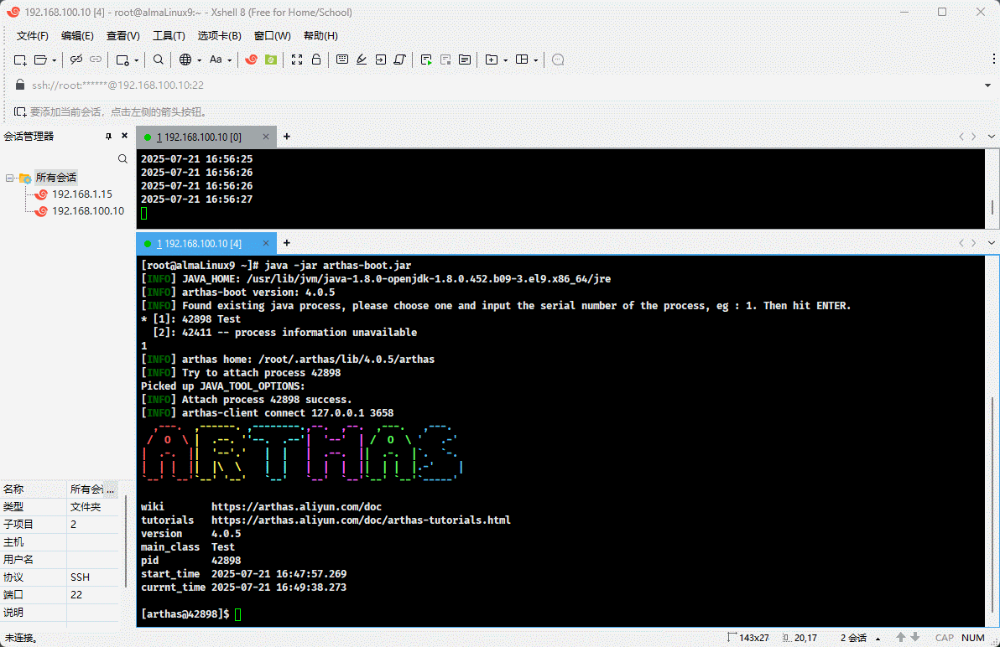
```

:::


* 示例：

::: code-group

```bash
dashboard -i 100
```

```md:img [cmd 控制台]
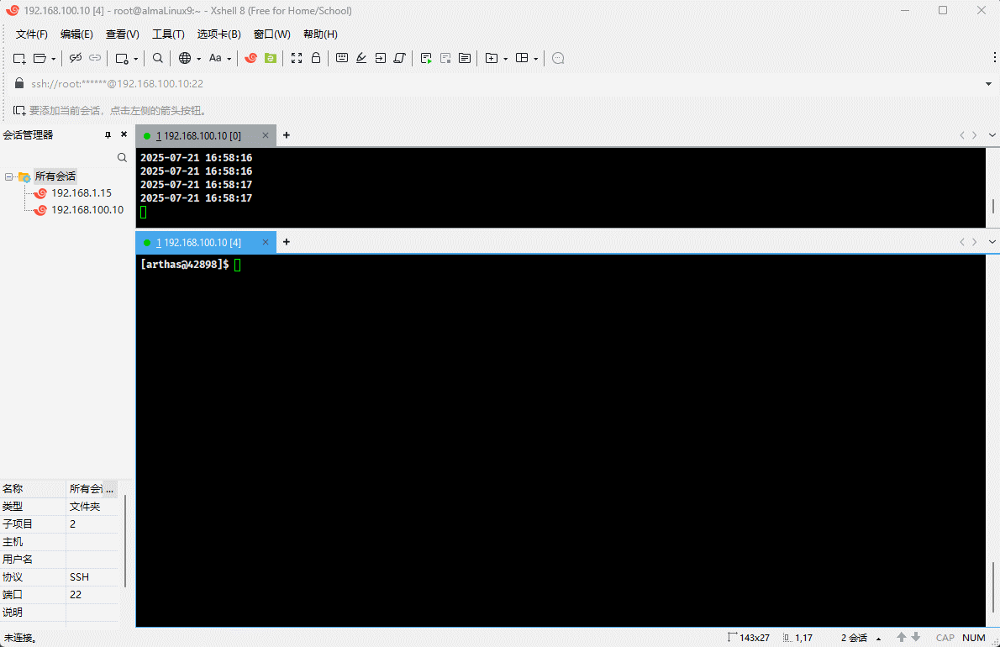
```

:::

##### 2.5.4.3.2 dump 

* 命令：

```shell
dump [-d 绝对路径] 类的全限定名
```

> [!NOTE]
>
> * ① dump命令可以将字节码文件保存到本地或指定的目录。
> * ② 参数：
>   * `-d xxx`：下载到指定的目录。


* 示例：

::: code-group

```bash
dump java.lang.String
```

```md:img [cmd 控制台]
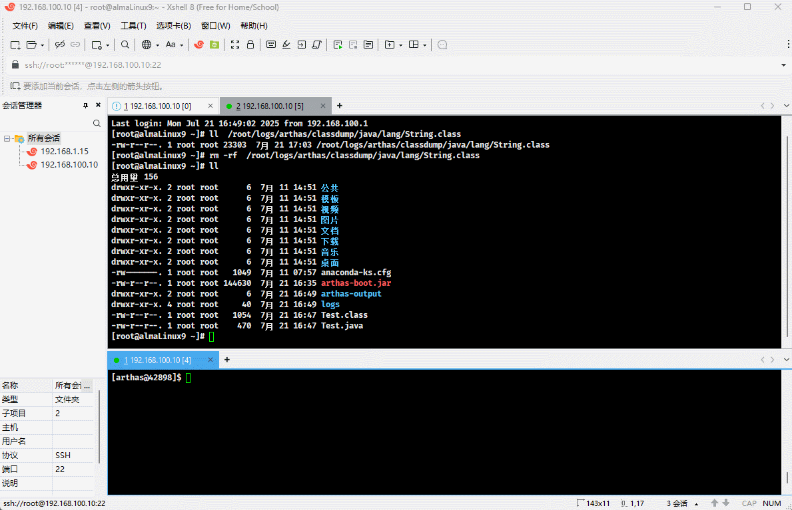
```

:::


* 示例：

::: code-group

```bash
dump -d /tmp/output java.lang.String
```

```md:img [cmd 控制台]
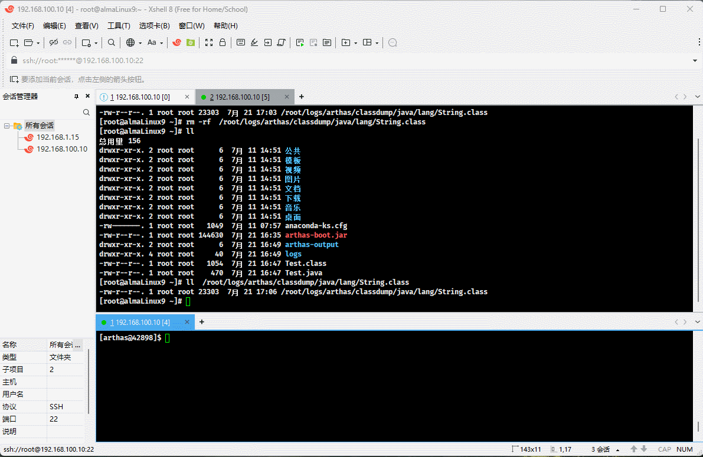
```

:::

##### 2.5.4.3.3 jad

* 命令：

```shell
jad 类的全限定名
```

> [!NOTE]
>
> * ① jad 命令可以将类的字节码文件进行反编译成源代码，用于确认服务器上的字节码文件是否是最新的，并带有语法高亮，阅读更方便。
> * ② 反编译出来的 java 代码可能会存在语法错误，但不影响你进行阅读理解。


* 示例：

::: code-group

```bash
jad java.lang.String
```

```md:img [cmd 控制台]
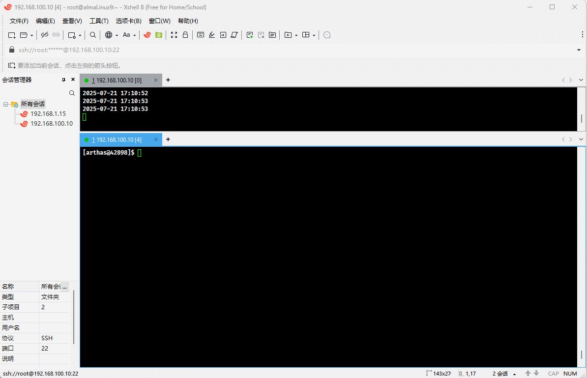
```

:::

### 2.5.5 总结

* 各种字节码常用工具对比，如下所示：

| 工具          | 类型               | 功能简介                      | 主要用途                               | 优点                               | 缺点                                     |
| ------------- | ------------------ | ----------------------------- | -------------------------------------- | ---------------------------------- | ---------------------------------------- |
| **javap**     | JDK 内置命令行工具 | 反汇编 class 文件，查看字节码 | 查看字节码、分析方法、学习 JVM 指令    | 自带 JDK、轻量、支持多种输出格式   | 只能静态分析、输出较简单、无图形界面     |
| **jclasslib** | GUI 工具或IDE 插件 | 图形化展示字节码结构          | 可视化分析字节码、教学用途             | 界面友好、结构清晰、集成 IDE       | 需图形环境、功能较基础                   |
| **Arthas**    | 动态诊断工具       | 在线诊断Java 应用             | 线上问题排查、性能调优、动态修改字节码 | 支持热更新、无需重启、功能强大     | 使用复杂、有风险、需 attach 进程         |
| **dump**      | 多种工具中的子命令 | 导出运行时类信息              | 获取运行时类、分析加载状态、对比差异   | 可获取真实运行时数据、支持批量导出 | 需运行中、输出需处理                     |
| **jad**       | 反编译工具         | 将字节码还原为 Java 源码      | 逆向分析、查看库实现、代码审计         | 接近原始代码、易读、支持批量处理   | 结构可能丢失、泛型不准、不适用于混淆代码 |

* 针对不同应用场景的使用建议：

| 使用场景 | 使用建议                                                     |
| -------- | ------------------------------------------------------------ |
| 开发阶段 | :one: 学习字节码：jclasslib 插件 + javap 命令<br>:two: 编译优化分析：javap 命令查看指令级差异<br/>:three: IDE 集成开发：jclasslib 插件实时查看 |
| 生产环境 | :one: 问题排查：Arthas 动态诊断 <br/>:two: 性能分析：Arthas + dump 命令组合使用 <br/>:three: 应急修复：Arthas 字节码热更新 |
| 逆向分析 | :one: 源码恢复： jad 命令反编译 <br/>:two: 第三方库分析：jad + javap 组合 <br/>:three: 安全审计：多工具配合使用 |


# 第三章：类的生命周期

## 3.1 概述

* `类的生命周期`描述的是一个类被`加载`、`使用`、以及`卸载`的整个过程。

> [!NOTE]
>
> 下文会详细地拆解，在整个生命周期中的每个阶段，虚拟机到底做了什么事情！！！

## 3.2 为什么要学习？

* ① `类的生命周期`本身就是一个`高频面试题`。

```txt
【问】类的生命周期分为哪几个阶段，每个阶段到底有什么作用？
```

```txt
【问】描述一下，这个类是如何被加载到 Java 虚拟机中的？
```

* ② `类的生命周期`中的`初始化阶段`频繁出现在`大厂笔试题`中。

::: code-group

```java [Test1.java]
public class Test1 {

    static  {
        System.out.println("D");
    }

    {
        System.out.println("C");
    }

    public Test1(){
        System.out.println("B");
    }

    public static void main(String[] args){
        System.out.println("A");

        new Test1();
        new Test1();
    }
}
```

```java [Test2.java]
public class Test2 {
    public static void main(String[] args) {
        new B02();
        System.out.println(B02.a);
    }
}

class A02 {
    static int a = 0;

    static {
        a = 1;
    }
}

class B02 extends A02 {
    static {
        a = 2;
    }
}
```

:::

* ③ `类的生命周期`相关知识点是后续大量知识点的`基础知识`。

> [!NOTE]
>
> * :one:运行时常量池。​ 
> * :two: 类加载器的作用。
> * :three: 多态的原理。
> * :four: 类的加密和解密。

## 3.3 类的生命周期的主要阶段

* `类的生命周期`的主要阶段，如下所示：

> [!NOTE]
>
> * ① 使用阶段：是我们最熟悉的阶段，因为平常经常使用的。
>
> ```java
> Test test = new Test();
> 
> Class<Test> clazz = test.class;
> Test test2 = clazz.newInstance();
> ```
>
> * ② 卸载阶段：暂时不会涉及，将会在垃圾回收篇中讲解。

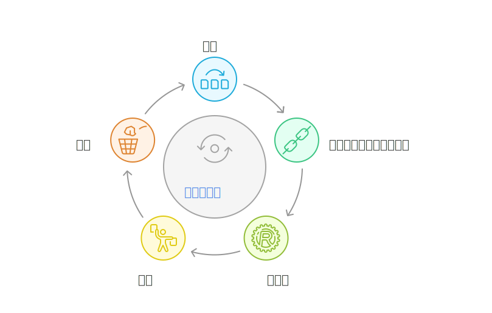

* `类的生命周期`主要阶段的详细内容，如下所示：

| 类的生命周期主要阶段       | 描述                                                         |
| -------------------------- | ------------------------------------------------------------ |
| ① 加载（Loading）          | 类的字节码或定义被读入内存，但还未进行初始化。<br>这通常发生在程序首次引用该类时。 |
| ② 链接（Linking）          | 验证、准备和解析。<br>包括验证类的结构完整性、为静态变量分配内存空间，以及解析类中的符号引用。 |
| ③ 初始化（Initialization） | 执行类的静态初始化代码，如：静态变量赋值、静态代码块等。<br/>这个阶段确保类在首次使用前处于正确状态。 |
| ④ 使用（Using）            | 类被实例化创建对象，或者直接访问静态成员。<br/>这是类发挥实际作用的阶段。 |
| ⑤ 卸载（Unloading）        | 当类不再被引用且满足特定条件时，垃圾回收器可能会卸载该类，释放相关内存。 |

* 在下文中，我们暂时只会聚焦`类的生命周期`的前三个阶段：`加载`、`链接`以及`初始化`。

> [!NOTE]
>
> * ① `加载`、`链接`以及`初始化`中最重要的是`初始化`阶段。
> * ② 之所以`初始化`阶段最重要，是因为程序员可以干涉，并且在笔试题中会大量涉及到。

## 3.4 加载阶段

### 3.4.1 步骤

* ① `类加载器`根据类的`全限定名`通过`不同的渠道`以二进制流的方式将字节码文件加载到内存中。

> [!NOTE]
>
> ::: details 点我查看 不同的渠道
>
> * ① 从本地磁盘上获取文件：这是最常见的方式。
>
> ```java
> package com.example;
> // 传统的 .class 文件加载
> // 类加载器会在 classpath 中查找 com/example/MyClass.class
> public class MyClass {
>     // 类定义
> }
> ```
>
> * ② 运行时动态代理生成：Spring 框架中就大量使用该技术。
>
> ```java
> // Spring AOP 代理示例
> // Spring 会为这个类生成代理
> @Service
> public class UserService {
> 
>     @Transactional
>     public void saveUser(User user) {
>         // 业务逻辑
>     }
> }
> ```
>
> ```java
> // Spring 内部会动态生成类似这样的代理类字节码
> public class UserService$$EnhancerBySpringCGLIB extends UserService {
> 	// 增强后的方法实现
> }
> ```
>
> * ③ 通过网络获取字节码文件，如：Applet 技术（已淘汰）。
>
> ```html
> <!-- HTML 中的 applet 标签 -->
> <applet code="MyApplet.class" 
>         codebase="http://example.com/applets/"
>         width="300" height="200">
> </applet>
> ```
>
> * ④ 程序员可以自定义扩展方式：我们可以继承 classLoader 实现自定义加载。
>
> ```java
> public class CustomClassLoader extends ClassLoader {
>     
>     @Override
>     protected Class<?> findClass(String name) throws ClassNotFoundException {
>         try {
>             // 可以从任何地方获取字节码
>             byte[] classData = getClassDataFromCustomSource(name);
> 
>             // 将字节数组转换为 Class 对象
>             return defineClass(name, classData, 0, classData.length);
>         } catch (Exception e) {
>             throw new ClassNotFoundException(name);
>         }
>     }
> 
>     private byte[] getClassDataFromCustomSource(String className) {
>         // 这里可以实现各种获取字节码的方式：
>         // 1. 从数据库读取
>         // 2. 从加密文件解密获取
>         // 3. 通过 HTTP 请求获取
>         // 4. 从内存中的字节数组获取
>         return new byte[0]; 
>     }
> }
> ```
>
> :::

* ② 类加载器在加载完类之后，JVM 会将字节码中的信息保存到方法区中，`并在方法区中会生成一个 InstanceKlass 对象，保存了类的所有信息，里面还包含了特定功能，如：多态的信息`。换言之，如果 JVM 需要创建这个类对应的对象，就会使用到这些信息。

> [!NOTE]
>
> ::: details 点我查看 方法区
>
> * ① 方法区只是 Java 虚拟机规范中设计出来的一个虚拟概念。
> * ② 不同种类的 Java 虚拟机，甚至不同版本的 Hotspot 虚拟机，在设计方法区的时候，都用到了不同的内存空间，如：JDK7 之前使用到的是永久代，而 JDK8 之后使用的是元空间。
> * ③ 方法区只是一个虚拟的概念，真正的实现，在后续的文章中会有详细讲解！！！
>
> :::


* ③ JVM 还会在堆中生成一份和方法区中数据类似的 `java.lang.Class` 对象，其作用是`可以在 Java 代码中获取类的信息以及存储的静态字段的数据`（JDK8+）。


### 3.4.2 疑问？

* 在加载阶段，是通过类加载器将字节码文件的信息加载到内存中，JVM 会在方法区和堆区中分别创建一份对象，以便后面使用。


* 那么，能否只在方法区中创建一个对象，以便节省内存空间？


* `不可以`，其中一点原因是 InstanceKlass 对象是通过 C++ 语言来创建的，而 Java 语言一般是不能直接去操作 C++ 语言编写的对象（除非采用 JNI 或 JNA 等，但是非常麻烦）；所以，JVM 就在堆上创建了 java.lang.Class 对象，以便 Java 语言访问。

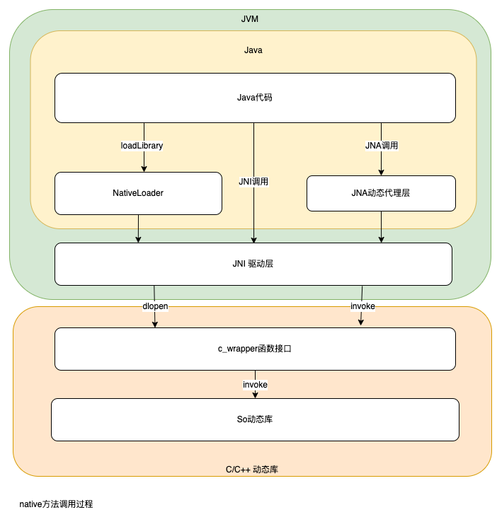

* `不可以`，另外一点原因是对于开发者而言，只需要访问堆中的 class 对象而不需要访问方法区中的所有信息，即：`JVM 就可以很好地控制开发者访问数据的范围`。


### 3.4.3 查看内存中的对象

* 可以使用 JDK 自带的 `hsdb` （HotSpot Debugger）工具来查看 JVM 内存的详细信息。

> [!NOTE]
>
> * ① hsdb 是 HotSpot 虚拟机的调试器，可以查看正在运行的 JVM 进程或 core dump 文件的内存状态。
> * ② JDK8 之前启动 hsdb （目前使用的版本）：
>
> ```shell
> java -cp $JAVA_HOME/lib/sa-jdi.jar sun.jvm.hotspot.HSDB
> ```
>
> * ② JDK9 之后启动 hsdb：
>
> ```shell
> jhsdb hsdb
> ```

* :one: 准备代码，并编译和启动：

::: code-group

```java [HsdbDemo.java]
import java.io.IOException;

public class HsdbDemo {
    public static final int i = 10;
    public static void main(String[] args) throws IOException {
        new HsdbDemo();
        System.in.read();
    }
}
```

```bash
javac HsdbDemo.java
java HsdbDemo
```

```md:img [cmd 控制台]

```

:::

* :two: 查看当前运行的 Java 进程的 pid ：

::: code-group

```bash
jps
```

```md:img [cmd 控制台]
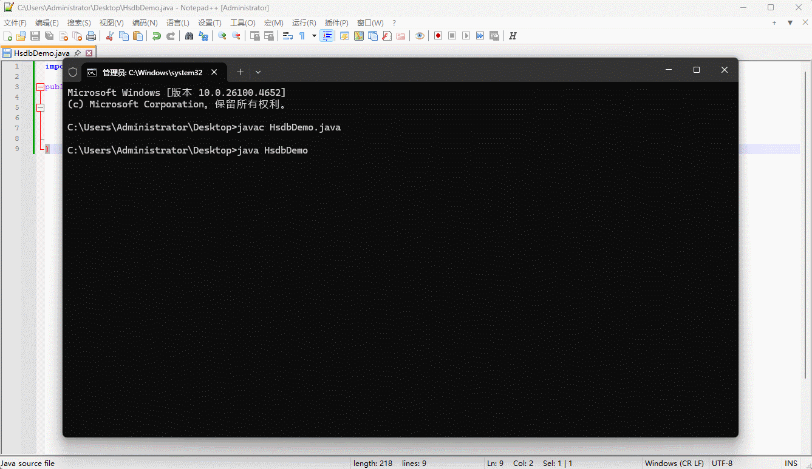
```

:::

* :three: 启动 hsdb 的图形化界面：

::: code-group

```bash
java -cp $JAVA_HOME/lib/sa-jdi.jar sun.jvm.hotspot.HSDB
```

```md:img [cmd 控制台]
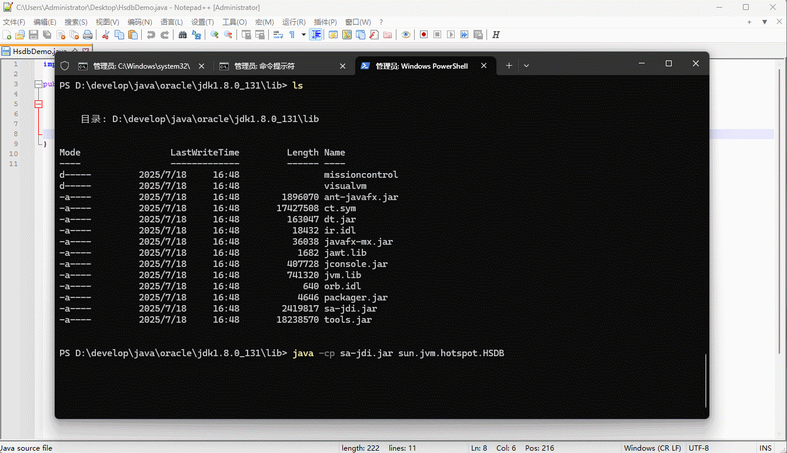
```

:::

* :four: 选择 `File` --> `Attach to Hotspot process`，并输入指定的 Java 进程 pid ：

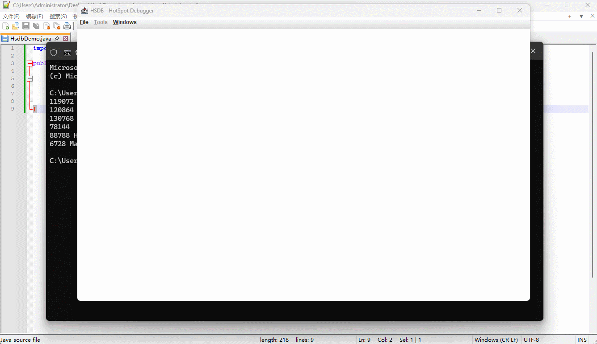

* :five: 选择 `Tools` --> `Object Histogram`，并输入 `HsdbDemo`，以便找到对应的 Java 对象：

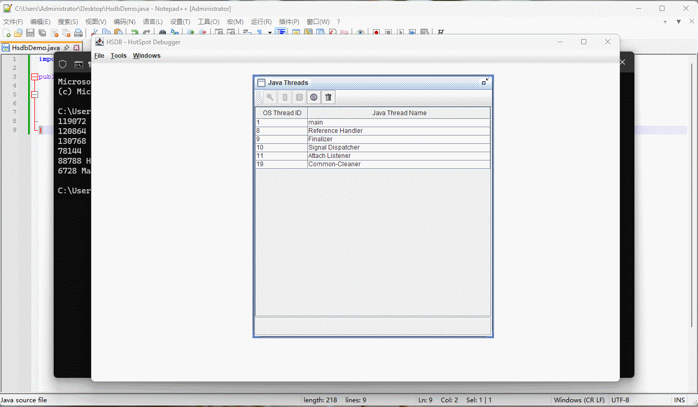

* :six: 鼠标双击进去，并点击 `Inspect` 按钮：

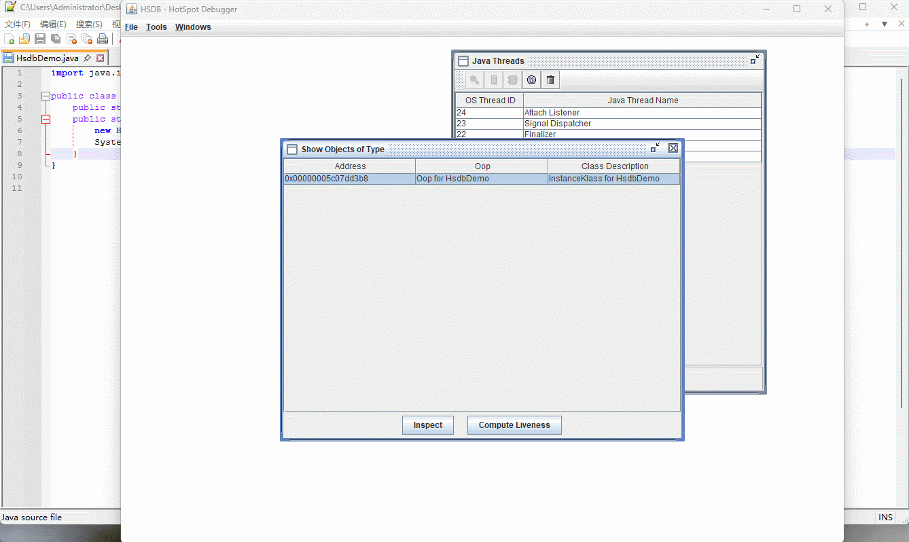

## 3.5 链接阶段

### 3.5.1 概述

* `链接`（Linking）阶段分为三个小阶段：

| 链接阶段的子阶段         | 描述                                                         |
| ------------------------ | ------------------------------------------------------------ |
| ① `验证`（Verification） | 验证内容是否满足《Java虚拟机规范》，确保不会危害虚拟机安全。 |
| ② ` 准备`（Preparation） | 给静态变量分配内存，并赋初始化值。                           |
| ③ `解析`（Resolution）   | 将常量池中的`符号引用`替换成执行内存的`直接引用`。           |

> [!NOTE]
>
> 上述链接的三个子阶段，就是做了一些校验和前期的准备工作，并不会执行程序员写的代码。

### 3.5.2 验证

#### 3.5.2.1 概述

* `验证`的主要目的是`检测 Java 字节码文件是否满足《Java虚拟机规范》中的约束`。

> [!NOTE]
>
> 这个阶段不需要程序员的参与！！！

* 主要包含四个方面的内容：

| 验证的主要内容           | 描述                                                         |
| ------------------------ | ------------------------------------------------------------ |
| ① 文件格式验证           | 文件是否以 0xCAFEBABE 开头。<br>主次版本号是否满足当前 JVM 版本要求。 |
| ② 元数据验证             | 检查类的结构信息是否符合 Java 语言规范，确保类的定义是合法的。 |
| ③ 程序执行指令的语义验证 | 确保字节码指令的语义是合法的、符合逻辑。                     |
| ④ 符号引用验证           | 对类自身以外（常量池中的各种符号引用）的信息进行匹配性校验。 |

#### 3.5.2.2 文件格式验证

* `文件格式验证`主要确保输入的字节流能被当前版本的虚拟机处理。

| 验证阶段     | 描述                                  |
| ------------ | ------------------------------------- |
| 文件格式校验 | 文件是否以 0xCAFEBABE 开头。          |
| ^^           | 主次版本号是否满足当前 JVM 版本要求。 |
| ^^           | ...                                   |


* 示例：修改魔数，看是否能启动

::: code-group

```java [Test.java]
import java.io.IOException;

public class Test {
    public static final int i = 10;

    public static void main(String[] args) throws IOException {
        System.out.println("Hello World!!!");
    }
}
```

```md:img [IDEA编译和运行]

```

```md:img [cmd 控制台(修改魔数)]

```

```md:img [IDEA运行]

```

:::


* 示例：主次版本号是否满足当前 JVM 版本要求

```cpp
bool ClassFileParser::is_supported_version(u2 major, u2 minor) {
  u2 max_version =
    JDK_Version::is_gte_jdk17x_version() ? JAVA_MAX_SUPPORTED_VERSION :
    (JDK_Version::is_gte_jdk16x_version() ? JAVA_6_VERSION : JAVA_1_5_VERSION);
  // 编译文件的主版本号不能高于运行环境的主版本号
  // 如果主版本号相等，次版本号也不能超过  
  return (major >= JAVA_MIN_SUPPORTED_VERSION) &&
         (major <= max_version) &&
         ((major != max_version) ||
          (minor <= JAVA_MAX_SUPPORTED_MINOR_VERSION));
}
```

#### 3.5.2.3 元数据验证

* `元数据验证`主要检查类的结构信息是否符合 Java 语言规范，确保类的定义是合法的。

| 验证阶段   | 描述                               |
| ---------- | ---------------------------------- |
| 元数据验证 | 类必须有父类，即：super 不能为空。 |
| ^^         | ...                                |


* 示例：

::: code-group

```java [Test.java]
import java.io.IOException;

public class Test {
    public static final int i = 10;

    public static void main(String[] args) throws IOException {
        System.out.println("Hello World!!!");
    }
}
```

```md:img [cmd 控制台]

```

:::


#### 3.5.2.4 程序执行指令的语义验证

* `程序执行指令的语义验证`必须确保确保字节码指令的语义是合法的、符合逻辑的。

| 验证阶段               | 描述                                   |
| ---------------------- | -------------------------------------- |
| 程序执行指令的语义验证 | 方法内的指令执行中跳转到不正确的位置。 |
| ^^                     | ...                                    |


* 示例：

::: code-group

```java [Test.java]
import java.io.IOException;

public class Test {
    public static final int i = 10;

    public static void main(String[] args) throws IOException {
        for (int i1 = 0; i1 < 10; i1++) {
            System.out.println("HelloWorld" + i1);
        }
    }
}
```

```md:img [cmd 控制台]

```

:::

#### 3.5.2.5 符号引用验证

* `符号引用验证`是验证阶段的最后一步，发生在虚拟机将符号引用转换为直接引用的时候。
* 这个验证可以看作是对类自身以外（常量池中的各种符号引用）的信息进行匹配性校验。

| 验证阶段     | 描述                                |
| ------------ | ----------------------------------- |
| 符号引用验证 | 是否访问了其他类中 private 的方法。 |
| ^^           | ...                                 |


* 示例：

::: code-group

```java [Test.java]
package com.github.thread.demo10;

import java.io.IOException;

public class Test {
    public static final int i = 10;

    public static void main(String[] args) throws IOException {
        // 符号引用验证：将符号引用转换为直接引用的时候
        String str = "hello";

        // 阻塞，防止运行结束
        System.in.read();
    }
}
```

```md:img [cmd 控制台]

```

:::

### 3.5.3 准备

#### 3.5.3.1 概述

* `准备`阶段就是为`静态变量`（static）`分配内存`并`设置初始值`。


* 每一种基本数据类型和引用数据类型都有其对应的初始化值，如下所示：

| **数据类型**   | **初始值** |
| -------------- | ---------- |
| `int`          | `0`        |
| `long`         | `0L`       |
| `short`        | `0`        |
| `char`         | `'\u0000'` |
| `byte`         | `0`        |
| `boolean`      | `false`    |
| `double`       | `0.0`      |
| `引用数据类型` | `null`     |

#### 3.5.3.2 原因

* 在`准备阶段`为静态变量赋值初始化值，就是为了保证`内存安全`以及`程序的确定性`。

> [!NOTE]
>
> ::: details 点我查看 具体原因
>
> * ① `避免未定义行为`：如果静态变量在内存中包含随机的垃圾数据，程序在首次访问这些变量时可能会产生不可预测的结果，导致程序行为不确定。
> * ② `提供默认的安全状态`：通过赋予零值（对于数值类型为 0，对于引用类型为 null），确保变量有一个明确的初始状态，即使开发者没有显式初始化。
> * ③ `保证线程安全`：在多线程环境下，如果变量没有初始化就被访问，可能会出现竞态条件。统一的零值初始化避免了这种情况。
> * ④ `简化 JVM 实现`：JVM 可以批量将整块内存区域清零，这比逐个检查每个变量是否需要初始化更高效。
> * ⑤ `符合 Java 语言规范`：Java 规范要求所有字段都必须有确定的初始值，这样可以保证程序的可移植性和一致性。
>
> :::

* 这种设计让程序员可以依赖变量的默认初始状态，减少了因忘记初始化而导致的 bug ，同时也让 JVM 的行为更加可预测和安全。


* 示例：

::: code-group

```java [Test.java]
package com.github.thread.demo10;

public class Test {
    /**
     * 静态变量会在准备阶段赋初始化值
     */
    public static int count;

    public static void main(String[] args) {

        System.out.println("count = " + count);
    }
}
```

```md:img [cmd 控制台]

```

:::

#### 3.5.3.3 注意事项

* 如果使用 final 修饰基本数据类型的变量，JVM 在准备阶段为这类变量进行赋值，跳过了初始化阶段。

> [!NOTE]
>
> ::: details 点我查看 具体原因
>
> * ① `编译时常量`：对于 static final 修饰的静态变量，其实在编译时就确定了值（在字节码文件中就持有一个常量池的引用），编译器在编译时会将其当做常量来处理。
> * ② `避免重复赋值`：由于值在编译时已知且不可变，JVM 可以跳过初始化阶段的赋值操作，提高效率。
>
> :::


* 示例：

::: code-group

```java [Test.java]
package com.github.thread.demo10;

public class Test {
    /**
     * static final 修饰的静态变量会当做编译时常量，在初始化阶段直接复制
     */
    public static final int count = 2;

    public static void main(String[] args) {

        System.out.println("count = " + count);
    }
}
```

```md:img [cmd 控制台]

```

:::

### 3.5.4 解析

* `符号引用`就是在字节码文件中使用`编号`来访问常量池中的内容。

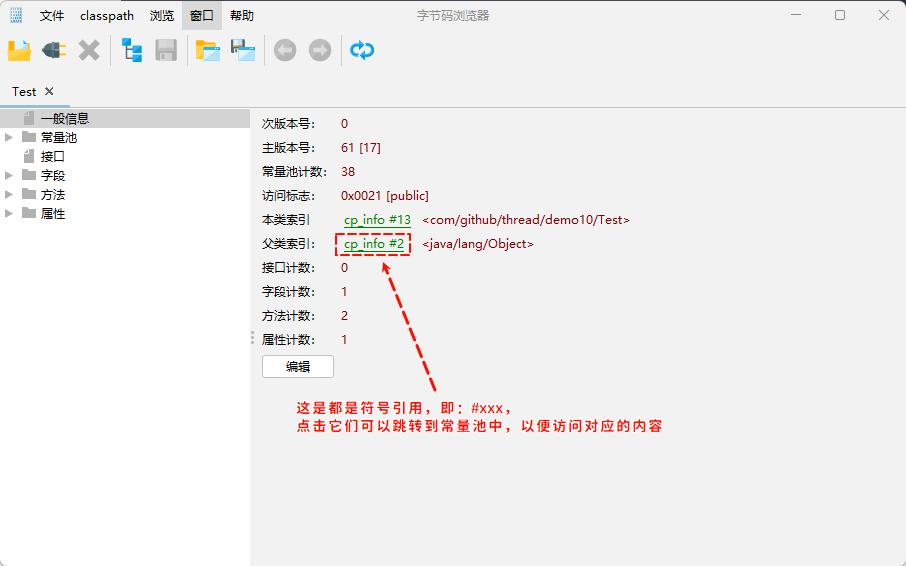

* `解析`阶段主要是将常量池中的`符号引用`替换为`直接引用`。

> [!NOTE]
>
> 不使用编号，而是使用内存地址来进行具体数据的访问，就是为了性能（后续可以直接通过内存地址从内存中获取数据）。


## 3.6 初始化阶段（⭐）

### 3.6.1 概述

* 之前说过，在`准备阶段`会为静态变量分配内存，设置初始化值，并不会赋最终值。


* `初始化阶段`会执行字节码文件中`clinit`方法的字节码指令，并`执行静态代码块中的代码`以及`为静态变量赋值`。

> [!NOTE]
>
> clinit 是 class init 的缩写，即：类初始化（类只会初始化一次）。


### 3.6.2 推演

* 假设代码是这样的，如下所示：

```java
public class Test {

    public static int count = 1;

    static {
        count = 2;
    }

    public static void main(String[] args) {

        System.out.println("count = " + count);
    }
}
```

* 其编译之后，对应的字节码文件就是这样的，如下所示：

> [!NOTE]
>
> 在字节文件中的方法中会出现三个方法：
>
> * ① `main` ：主方法，程序的入口。
> * ② `<init>` ：构造方法（构造器，构造函数）会在对象初始化的时候执行，即：`使用`阶段。
> * ③ `<clinit>`：会在`初始化`阶段执行。

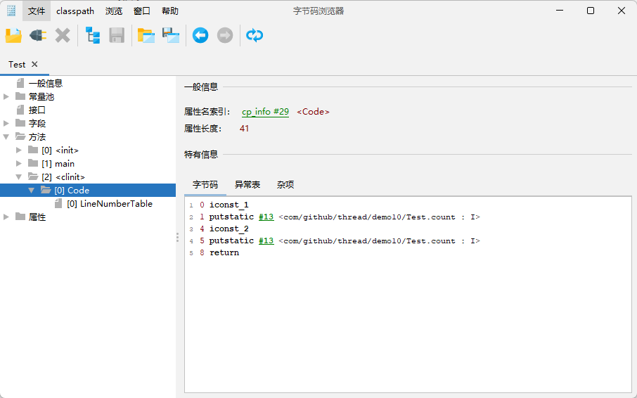

* 那么`源码`、`字节码指令`以及对应的`内存`就是这样的，如下所示：


### 3.6.3 字节码指令讲解

* 当执行了 `iconst_1` 指令，其对应的指令是 `iconst_<i>`，其中 `<i>` 是常量。

> [!NOTE]
>
> - ① `iconst_<i>` 指令的含义：将常量 `<i>` push（推） 到操作数栈上。
> - ② `iconst_1` 指令就是将常量 `1` 压入到操作数栈上。


* 当执行了 `putstatic` 指令，就是给类中的静态变量赋值。

> [!NOTE]
>
> `putstatic` 指令的含义：从操作数栈顶中弹出值，并设置给静态变量。


* 当执行了 `iconst_2` 指令，其对应的指令是 `iconst_<i>`，其中 `<i>` 是常量。

> [!NOTE]
>
> - ① `iconst_<i>` 指令的含义：将常量 `<i>` push（推） 到操作数栈上。
> - ② `iconst_2` 指令就是将常量 `2` 压入到操作数栈上。


* 当执行了 `putstatic` 指令，就是给类中的静态变量赋值。

> [!NOTE]
>
> `putstatic` 指令的含义：从操作数栈顶中弹出值，并设置给静态变量。

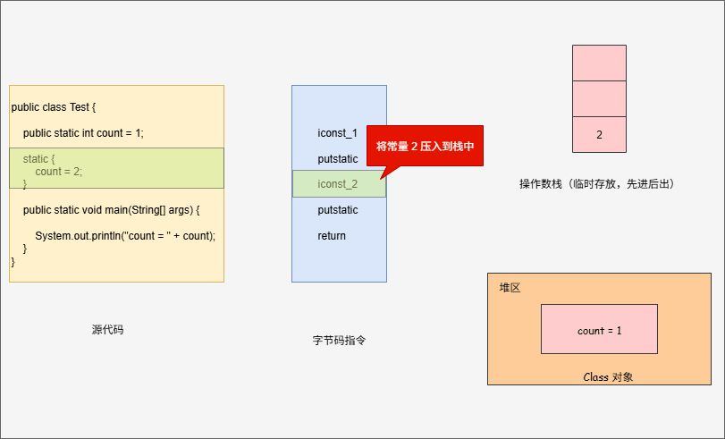

### 3.6.4 注意事项

* 如果我们将`静态变量`和`静态代码块`的顺序颠倒一下，如下所示：

```java
public class Test {

    static {
        count = 2;
    }
    
    public static int count = 1;

    public static void main(String[] args) {

        System.out.println("count = " + count);
    }
}
```

* 其对应的字节码指令就是这样的，如下所示：


* 对比一下，如下所示：


### 3.6.5 类生命周期相关 JVM 参数

* JDK9 之前：

| 类生命周期阶段 | 对应日志参数                | 输出时机           | 信息内容                 |
| -------------- | --------------------------- | ------------------ | ------------------------ |
| 加载           | `-XX:+TraceClassLoading`    | 字节码读入内存时   | 类名、来源路径、加载器   |
| 链接-验证      | `-XX:+TraceClassResolution` | 符号引用解析时     | 被解析的类和引用关系     |
| 链接-准备      | 无专门参数                  | -                  | 需要通过内存监控工具观察 |
| 链接-解析      | `-XX:+TraceClassResolution` | 符号引用转直接引用 | 解析的符号引用详情       |
| 初始化         | 无专门参数                  | 执行`<clinit>()`时 | 初始化开始和完成         |
| 使用           | 无专门参数                  | -                  | 通过其他运行时日志观察   |
| 卸载           | `-XX:+TraceClassUnloading`  | GC 回收类时        | 被卸载的类和加载器       |

* JDK9 之后：

| 类生命周期阶段 | 对应日志标签          | 输出时机           | 信息内容                 |
| -------------- | --------------------- | ------------------ | ------------------------ |
| 加载           | `-Xlog:class+load`    | 字节码读入内存时   | 类名、来源路径、加载器   |
| 链接-验证      | `-Xlog:class+resolve` | 符号引用解析时     | 被解析的类和引用关系     |
| 链接-准备      | 无专门标签            | -                  | 需要通过内存监控工具观察 |
| 链接-解析      | `-Xlog:class+resolve` | 符号引用转直接引用 | 解析的符号引用详情       |
| 初始化         | `-Xlog:class+init`    | 执行`<clinit>()`时 | 初始化开始和完成         |
| 使用           | 无专门标签            | -                  | 通过其他运行时日志观察   |
| 卸载           | `-Xlog:class+unload`  | GC 回收类时        | 被卸载的类和加载器       |

### 3.6.6 触发类初始化的方式

* 主动触发类初始化的方式：

| 方式                             | 描述                                                         |
| -------------------------------- | ------------------------------------------------------------ |
| ① 访问一个类的静态变量或静态方法 | :one: 访问非 final 静态变量。<br>:two: 给静态变量赋值。<br>:three: 调用类的静态方法。<br> |
| ② 反射调用或反射创建实例。       | :one: 调用 Class.forName(String className) 方法，即：使用反射加载类。<br>:two: 通过反射创建实例对象。 |
| ③ 使用 new 关键字创建该类的对象  | 创建了类的对象，必然需要先对类进行初始化，并且只会初始化一次。 |
| ④ 执行 main 方法的当前类         | 包含 main 方法的启动类。                                     |
| ⑤ 初始化子类                     | 初始化子类时会先初始化父类。                                 |

> [!NOTE]
>
> ::: details 点我查看 具体细节
>
> * ① `static final`修饰的静态常量，不会触发初始化，其在`链接`阶段中的`准备`阶段就直接赋值。
> * ② `Class.forName()` 有重载方法可以不主动触发初始化。
>
> ```java
> /*
> * @param initialize 如果是 false 就不主动触发初始化
> */
> public static Class<?> forName(String name,boolean initialize,ClassLoader loader) {
>     ...
> }
> ```
> * ③ 类的初始化执行顺序：
>
> | 执行顺序 | 内容                     | 说明                     |
> | -------- | ------------------------ | ------------------------ |
> | 1        | 父类静态变量和静态代码块 | 按在代码中出现的顺序执行 |
> | 2        | 子类静态变量和静态代码块 | 按在代码中出现的顺序执行 |
> | 3        | 父类实例变量和实例代码块 | 创建实例时执行           |
> | 4        | 父类构造方法             | 父类构造器执行           |
> | 5        | 子类实例变量和实例代码块 | 创建实例时执行           |
> | 6        | 子类构造方法             | 子类构造器执行           |
>
> * ④ 类初始化的重要特性：
>
> | 特性     | 描述                               |
> | -------- | ---------------------------------- |
> | 线程安全 | JVM 保证类初始化过程是线程安全的   |
> | 单次执行 | 每个类在 JVM 中只会被初始化一次    |
> | 懒加载   | 类只有在首次主动使用时才会被初始化 |
> | 父类优先 | 子类初始化前必须先完成父类初始化   |
> 
> :::


* 示例：访问一个类的静态变量或静态方法，会触发类的初始化

::: code-group

```java [Test.java]
package com.github.thread.demo10;

import java.io.IOException;

public class Test {

    public static void main(String[] args) throws IOException {

        // 访问静态变量
        System.out.println(Demo.count);

        // 访问静态方法
        System.out.println(Demo.getCount());

        // 修改静态变量
        Demo.count = 3;
    }
}

class Demo {
    public static int count = 1;

    static {
        
        count = 2;
    }

    public static int getCount() {
        return count;
    }
}
```

```md:img [cmd 控制台]

```

:::


* 示例：反射调用或反射创建实例，会触发类的初始化

::: code-group

```java [Test.java]
package com.github.thread.demo10;

public class Test {

    public static void main(String[] args) throws Exception {

        // 反射调用
        Class.forName("com.github.thread.demo10.Demo");

        // 反射创建实例
        Demo.class.getDeclaredConstructor().newInstance();
    }
}

class Demo {
    public static int count = 1;

    static {
        System.out.println("Demo 初始化了");
        count = 2;
    }

    public static int getCount() {
        return count;
    }
}
```

```md:img [cmd 控制台]

```

:::


* 示例：使用 new 关键字创建该类的对象，会触发类的初始化

::: code-group

```java [Test.java]
package com.github.thread.demo10;

public class Test {

    public static void main(String[] args) throws Exception {

        // 使用 new 关键字创建该类的对象
        new Demo();
    }
}

class Demo {
    public static int count = 1;

    static {
        System.out.println("Demo 初始化了");
        count = 2;
    }

    public static int getCount() {
        return count;
    }
}
```

```md:img [cmd 控制台]
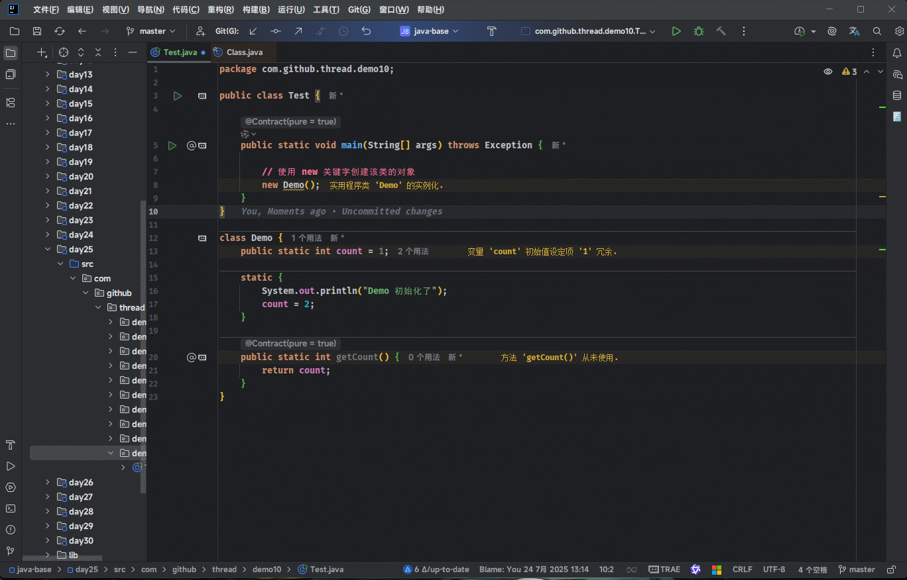
```

:::


* 示例：执行 main 方法的当前类，会触发类的初始化

::: code-group

```java [Test.java]
package com.github.thread.demo10;

public class Test {

    static {
        System.out.println("Test 初始化了");
    }
    public static void main(String[] args) throws Exception {

        System.out.println("Test");

    }
}

class Demo {
    public static int count = 1;

    static {
        System.out.println("Demo 初始化了");
        count = 2;
    }

    public static int getCount() {
        return count;
    }
}
```

```md:img [cmd 控制台]

```

:::


* 示例：初始化子类，会先初始化父类，并触发类的初始化

::: code-group

```java [Test.java]
package com.github.thread.demo10;

public class Test {

    static {
        System.out.println("Test 初始化了");
    }
    public static void main(String[] args) throws Exception {

        System.out.println("Test");

    }
}

class Demo {
    public static int count = 1;

    static {
        System.out.println("Demo 初始化了");
        count = 2;
    }

    public static int getCount() {
        return count;
    }
}
```

```md:img [cmd 控制台]

```

:::

### 3.6.7 面试题解析

* 【问】请给出下面代码的结果。

```java
public class Test {

    static { // 会合并到 <cinit> 字节码指令中
        System.out.println("D");
    }

    { // 会合并到 <init> 字节码指令中
        System.out.println("C");
    }

    public Test() { // 会合并到 <init> 字节码指令中
        System.out.println("B");
    }

    public static void main(String[] args) throws Exception {
        System.out.println("A");
        new Test();
        new Test();
    }
}
```

> [!NOTE]
>
> static 静态方法块的字节码指令，如下所示：
>
> ```txt
> // 将 [System.out] 压入操作数栈
> 0 getstatic #7 <java/lang/System.out : Ljava/io/PrintStream;> 
> // 将 [D] 压入操作数栈；此时，操作数栈就是 [System.out,"D"]
> 3 ldc #28 <D> 
> // 弹出操作数栈的栈顶元素，并执行 println 方法，打印 "D"
> 5 invokevirtual #15 <java/io/PrintStream.println : (Ljava/lang/String;)V>
> // 方法执行完毕
> 8 return


* 【答】D --> A --> C --> B --> C --> B

### 3.6.8 不会触发类初始化的方式

* 不会触发类初始化的方式：

| 方式                               | 描述                                                         |
| ---------------------------------- | ------------------------------------------------------------ |
| ① 创建数组                         | 创建数组对象不会初始化数组元素的类型。                       |
| ② 直接访问父类的静态变量。         | 只有父类被初始化，子类不会被初始化。                         |
| ③ 访问编译时常量                   | final static 的基本类型和字符串常量在编译时就确定了值，不需要初始化类。 |
| ④ Class.forName 的 initialize 参数 | 当 initialize 参数为false时，只加载类但不初始化。            |
| ⑤ 获取 Class 对象                  | 使用`.class`语法只是获取类的元数据，不会触发初始化。         |


* 示例：创建数组对象不会初始化数组元素的类型

::: code-group

```java [Test.java]
package com.github.thread.demo10;

import java.util.Arrays;

public class Test {

    public static void main(String[] args) throws Exception {
        Demo[] arr = new Demo[10];
        System.out.println("数组的长度: " + arr.length);
        System.out.println("数组元素都是: " + Arrays.toString(arr));
    }
}

class Demo {
    static {
        System.out.println("Demo 初始化了");
    }
}
```

```md:img [cmd 控制台]

```

:::


* 示例：直接访问父类的静态变量，只有父类被初始化，子类不会被初始化

::: code-group

```java [Test.java]
public class Test {

    public static void main(String[] args) throws Exception {
        System.out.println(Father.a);
        System.out.println(Zi.a);
    }
}

class Father {
    public static int a = 1;

    static {
        a = 2;
        System.out.println("Father 初始化了");
    }
}

class Zi extends Father {
    static {
        System.out.println("Zi 初始化了");
    }
}
```

```md:img [cmd 控制台]
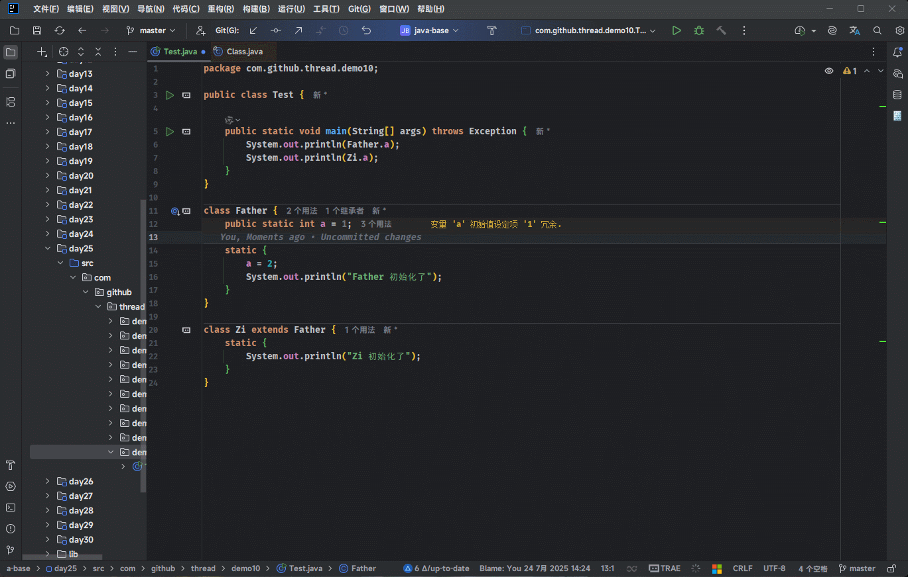
```

:::


* 示例：访问编译时常量，不会触发初始化

::: code-group

```java [Test.java]
package com.github.thread.demo10;

public class Test {

    public static void main(String[] args) throws Exception {
        System.out.println(Demo.a);
    }
}

class Demo {
    public static final int a = 1;

    static {
        System.out.println("Demo 初始化了");
    }
}
```

```md:img [cmd 控制台]
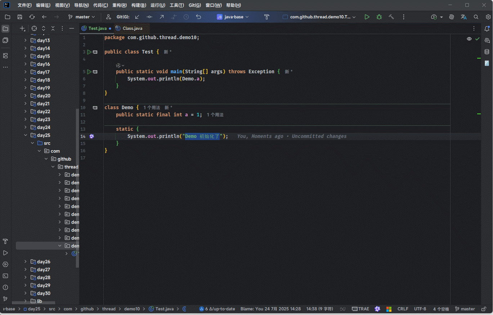
```

:::


* 示例：Class.forName 的 `initialize` 参数，如果是 false ，不会触发初始化

::: code-group

```java [Test.java]
package com.github.thread.demo10;

public class Test {

    public static void main(String[] args) throws Exception {
        Class.forName("com.github.thread.demo10.Demo", 
                      false,  // [!code highlight]
                      Test.class.getClassLoader());
    }
}

class Demo {
    public static final int a = 1;

    static {
        System.out.println("Demo 初始化了");
    }
}

```

```md:img [cmd 控制台]
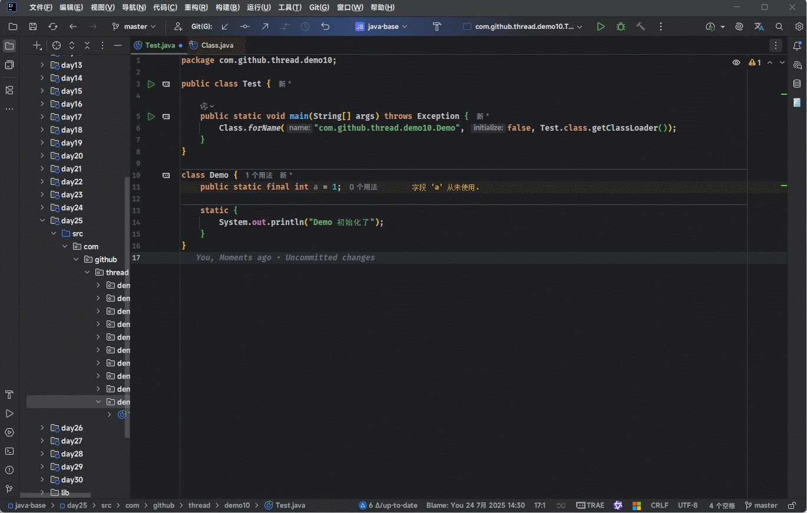
```

:::


* 示例：使用`.class`语法只是获取类的元数据，不会触发初始化

::: code-group

```java [Test.java]
package com.github.thread.demo10;

public class Test {

    public static void main(String[] args) throws Exception {
        Class.forName("com.github.thread.demo10.Demo", 
                      false,  // [!code highlight]
                      Test.class.getClassLoader());
    }
}

class Demo {
    public static final int a = 1;

    static {
        System.out.println("Demo 初始化了");
    }
}

```

```md:img [cmd 控制台]
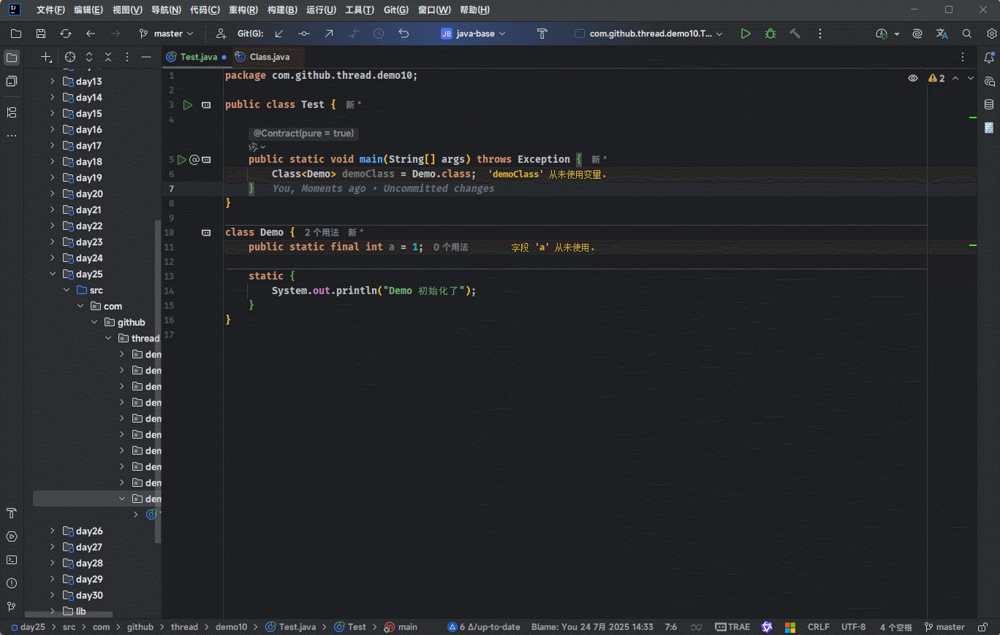
```

:::


# 第四章：类加载器

## 4.1 概述


## 4.2 类加载器的分类


## 4.3 启动类加载器


## 4.4 扩展类加载和应用程序类加载器


## 4.5 双亲委派机制


## 4.6 打破双亲委派机制


## 4.7 JDK9 之后的类加载器


