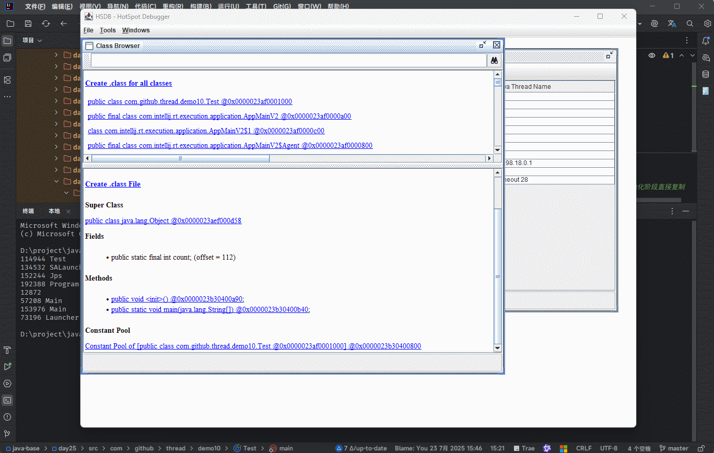
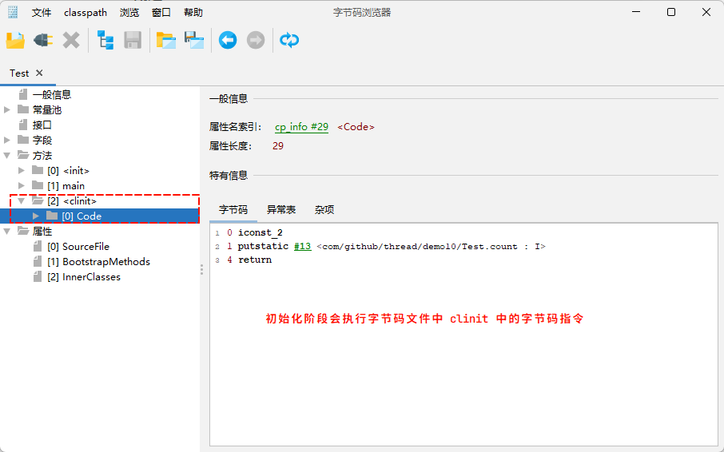

# 第一章：类的生命周期

## 1.1 概述

* `类的生命周期`描述的是一个类被`加载`、`使用`、以及`卸载`的整个过程。

> [!NOTE]
>
> 下文会详细地拆解，在整个生命周期中的每个阶段，虚拟机到底做了什么事情！！！

## 1.2 为什么要学习？

* ① `类的生命周期`本身就是一个`高频面试题`。

```txt
【问】类的生命周期分为哪几个阶段，每个阶段到底有什么作用？
```

```txt
【问】描述一下，这个类是如何被加载到 Java 虚拟机中的？
```

* ② `类的生命周期`中的`初始化阶段`频繁出现在`大厂笔试题`中。

::: code-group

```java [Test1.java]
public class Test1 {

    static  {
        System.out.println("D");
    }

    {
        System.out.println("C");
    }

    public Test1(){
        System.out.println("B");
    }

    public static void main(String[] args){
        System.out.println("A");

        new Test1();
        new Test1();
    }
}
```

```java [Test2.java]
public class Test2 {
    public static void main(String[] args) {
        new B02();
        System.out.println(B02.a);
    }
}

class A02 {
    static int a = 0;

    static {
        a = 1;
    }
}

class B02 extends A02 {
    static {
        a = 2;
    }
}
```

:::

* ③ `类的生命周期`相关知识点是后续大量知识点的`基础知识`。

> [!NOTE]
>
> * :one:运行时常量池。​ 
> * :two: 类加载器的作用。
> * :three: 多态的原理。
> * :four: 类的加密和解密。

## 1.3 类的生命周期的主要阶段

* `类的生命周期`的主要阶段，如下所示：

> [!NOTE]
>
> * ① 使用阶段：是我们最熟悉的阶段，因为平常经常使用的。
>
> ```java
> Test test = new Test();
> 
> Class<Test> clazz = test.class;
> Test test2 = clazz.newInstance();
> ```
>
> * ② 卸载阶段：暂时不会涉及，将会在垃圾回收篇中讲解。


* `类的生命周期`主要阶段的详细内容，如下所示：

| 类的生命周期主要阶段       | 描述                                                         |
| -------------------------- | ------------------------------------------------------------ |
| ① 加载（Loading）          | 类的字节码或定义被读入内存，但还未进行初始化。<br>这通常发生在程序首次引用该类时。 |
| ② 链接（Linking）          | 验证（Verification）、准备（Preparation）和解析（Resolution）。<br>包括验证类的结构完整性、为静态变量分配内存空间，以及解析类中的符号引用。 |
| ③ 初始化（Initialization） | 执行类的静态初始化代码，如：静态变量赋值、静态代码块等。<br/>这个阶段确保类在首次使用前处于正确状态。 |
| ④ 使用（Using）            | 类被实例化创建对象，或者直接访问静态成员。<br/>这是类发挥实际作用的阶段。 |
| ⑤ 卸载（Unloading）        | 当类不再被引用且满足特定条件时，垃圾回收器可能会卸载该类，释放相关内存。 |

* 在下文中，我们暂时只会聚焦`类的生命周期`的前三个阶段：`加载`、`链接`以及`初始化`。

> [!NOTE]
>
> * ① `加载`、`链接`以及`初始化`中最重要的是`初始化`阶段。
> * ② 之所以`初始化`阶段最重要，是因为程序员可以干涉，并且在笔试题中会大量涉及到。

## 1.4 加载阶段

### 1.4.1 步骤

* ① `类加载器`根据类的`全限定名`通过`不同的渠道`以二进制流的方式将字节码文件加载到内存中。

> [!NOTE]
>
> ::: details 点我查看 不同的渠道
>
> * ① 从本地磁盘上获取文件：这是最常见的方式。
>
> ```java
> package com.example;
> // 传统的 .class 文件加载
> // 类加载器会在 classpath 中查找 com/example/MyClass.class
> public class MyClass {
>     // 类定义
> }
> ```
>
> * ② 运行时动态代理生成：Spring 框架中就大量使用该技术。
>
> ```java
> // Spring AOP 代理示例
> // Spring 会为这个类生成代理
> @Service
> public class UserService {
> 
>     @Transactional
>     public void saveUser(User user) {
>         // 业务逻辑
>     }
> }
> ```
>
> ```java
> // Spring 内部会动态生成类似这样的代理类字节码
> public class UserService$$EnhancerBySpringCGLIB extends UserService {
> 	// 增强后的方法实现
> }
> ```
>
> * ③ 通过网络获取字节码文件，如：Applet 技术（已淘汰）。
>
> ```html
> <!-- HTML 中的 applet 标签 -->
> <applet code="MyApplet.class" 
>         codebase="http://example.com/applets/"
>         width="300" height="200">
> </applet>
> ```
>
> * ④ 程序员可以自定义扩展方式：我们可以继承 classLoader 实现自定义加载。
>
> ```java
> public class CustomClassLoader extends ClassLoader {
>     
>     @Override
>     protected Class<?> findClass(String name) throws ClassNotFoundException {
>         try {
>             // 可以从任何地方获取字节码
>             byte[] classData = getClassDataFromCustomSource(name);
> 
>             // 将字节数组转换为 Class 对象
>             return defineClass(name, classData, 0, classData.length);
>         } catch (Exception e) {
>             throw new ClassNotFoundException(name);
>         }
>     }
> 
>     private byte[] getClassDataFromCustomSource(String className) {
>         // 这里可以实现各种获取字节码的方式：
>         // 1. 从数据库读取
>         // 2. 从加密文件解密获取
>         // 3. 通过 HTTP 请求获取
>         // 4. 从内存中的字节数组获取
>         return new byte[0]; 
>     }
> }
> ```
>
> :::

* ② 类加载器在加载完类之后，JVM 会将字节码中的信息保存到方法区中，`并在方法区中会生成一个 InstanceKlass 对象，保存了类的所有信息，里面还包含了特定功能，如：多态的信息`。换言之，如果 JVM 需要创建这个类对应的对象，就会使用到这些信息。

> [!NOTE]
>
> ::: details 点我查看 方法区
>
> * ① 方法区只是 Java 虚拟机规范中设计出来的一个虚拟概念。
> * ② 不同种类的 Java 虚拟机，甚至不同版本的 Hotspot 虚拟机，在设计方法区的时候，都用到了不同的内存空间，如：JDK7 之前使用到的是永久代，而 JDK8 之后使用的是元空间。
> * ③ 方法区只是一个虚拟的概念，真正的实现，在后续的文章中会有详细讲解！！！
>
> :::


* ③ JVM 还会在堆中生成一份和方法区中数据类似的 `java.lang.Class` 对象，其作用是`可以在 Java 代码中获取类的信息以及存储的静态字段的数据`（JDK8+）。


### 1.4.2 疑问？

* 在加载阶段，是通过类加载器将字节码文件的信息加载到内存中，JVM 会在方法区和堆区中分别创建一份对象，以便后面使用。


* 那么，能否只在方法区中创建一个对象，以便节省内存空间？


* `不可以`，其中一点原因是 InstanceKlass 对象是通过 C++ 语言来创建的，而 Java 语言一般是不能直接去操作 C++ 语言编写的对象（除非采用 JNI 或 JNA 等，但是非常麻烦）；所以，JVM 就在堆上创建了 java.lang.Class 对象，以便 Java 语言访问。


* `不可以`，另外一点原因是对于开发者而言，只需要访问堆中的 class 对象而不需要访问方法区中的所有信息，即：`JVM 就可以很好地控制开发者访问数据的范围`。


### 1.4.3 查看内存中的对象

* 可以使用 JDK 自带的 `hsdb` （HotSpot Debugger）工具来查看 JVM 内存的详细信息。

> [!NOTE]
>
> * ① hsdb 是 HotSpot 虚拟机的调试器，可以查看正在运行的 JVM 进程或 core dump 文件的内存状态。
> * ② JDK8 之前启动 hsdb （目前使用的版本）：
>
> ```shell
> java -cp $JAVA_HOME/lib/sa-jdi.jar sun.jvm.hotspot.HSDB
> ```
>
> * ② JDK9 之后启动 hsdb：
>
> ```shell
> jhsdb hsdb
> ```

* :one: 准备代码，并编译和启动：

::: code-group

```java [HsdbDemo.java]
import java.io.IOException;

public class HsdbDemo {
    public static final int i = 10;
    public static void main(String[] args) throws IOException {
        new HsdbDemo();
        System.in.read();
    }
}
```

```bash
javac HsdbDemo.java
java HsdbDemo
```

```md:img [cmd 控制台]

```

:::

* :two: 查看当前运行的 Java 进程的 pid ：

::: code-group

```bash
jps
```

```md:img [cmd 控制台]

```

:::

* :three: 启动 hsdb 的图形化界面：

::: code-group

```bash
java -cp $JAVA_HOME/lib/sa-jdi.jar sun.jvm.hotspot.HSDB
```

```md:img [cmd 控制台]

```

:::

* :four: 选择 `File` --> `Attach to Hotspot process`，并输入指定的 Java 进程 pid ：


* :five: 选择 `Tools` --> `Object Histogram`，并输入 `HsdbDemo`，以便找到对应的 Java 对象：


* :six: 鼠标双击进去，并点击 `Inspect` 按钮：


## 1.5 链接阶段

### 1.5.1 概述

* `链接`（Linking）阶段分为三个小阶段：

| 链接阶段的子阶段         | 描述                                                         |
| ------------------------ | ------------------------------------------------------------ |
| ① `验证`（Verification） | 验证内容是否满足《Java虚拟机规范》，确保不会危害虚拟机安全。 |
| ② ` 准备`（Preparation） | 给静态变量分配内存，并赋初始化值。                           |
| ③ `解析`（Resolution）   | 将常量池中的`符号引用`替换成执行内存的`直接引用`。           |

> [!NOTE]
>
> 上述链接的三个子阶段，就是做了一些校验和前期的准备工作，并不会执行程序员写的代码。

### 1.5.2 验证

#### 1.5.2.1 概述

* `验证`的主要目的是`检测 Java 字节码文件是否满足《Java虚拟机规范》中的约束`。

> [!NOTE]
>
> 这个阶段不需要程序员的参与！！！

* 主要包含四个方面的内容：

| 验证的主要内容           | 描述                                                         |
| ------------------------ | ------------------------------------------------------------ |
| ① 文件格式验证           | 文件是否以 0xCAFEBABE 开头。<br>主次版本号是否满足当前 JVM 版本要求。 |
| ② 元数据验证             | 检查类的结构信息是否符合 Java 语言规范，确保类的定义是合法的。 |
| ③ 程序执行指令的语义验证 | 确保字节码指令的语义是合法的、符合逻辑。                     |
| ④ 符号引用验证           | 对类自身以外（常量池中的各种符号引用）的信息进行匹配性校验。 |

#### 1.5.2.2 文件格式验证

* `文件格式验证`主要确保输入的字节流能被当前版本的虚拟机处理。

| 验证阶段     | 描述                                  |
| ------------ | ------------------------------------- |
| 文件格式校验 | 文件是否以 0xCAFEBABE 开头。          |
| ^^           | 主次版本号是否满足当前 JVM 版本要求。 |
| ^^           | ...                                   |


* 示例：修改魔数，看是否能启动

::: code-group

```java [Test.java]
import java.io.IOException;

public class Test {
    public static final int i = 10;

    public static void main(String[] args) throws IOException {
        System.out.println("Hello World!!!");
    }
}
```

```md:img [IDEA编译和运行]

```

```md:img [cmd 控制台(修改魔数)]

```

```md:img [IDEA运行]

```

:::


* 示例：主次版本号是否满足当前 JVM 版本要求

```cpp
bool ClassFileParser::is_supported_version(u2 major, u2 minor) {
  u2 max_version =
    JDK_Version::is_gte_jdk17x_version() ? JAVA_MAX_SUPPORTED_VERSION :
    (JDK_Version::is_gte_jdk16x_version() ? JAVA_6_VERSION : JAVA_1_5_VERSION);
  // 编译文件的主版本号不能高于运行环境的主版本号
  // 如果主版本号相等，次版本号也不能超过  
  return (major >= JAVA_MIN_SUPPORTED_VERSION) &&
         (major <= max_version) &&
         ((major != max_version) ||
          (minor <= JAVA_MAX_SUPPORTED_MINOR_VERSION));
}
```

#### 1.5.2.3 元数据验证

* `元数据验证`主要检查类的结构信息是否符合 Java 语言规范，确保类的定义是合法的。

| 验证阶段   | 描述                               |
| ---------- | ---------------------------------- |
| 元数据验证 | 类必须有父类，即：super 不能为空。 |
| ^^         | ...                                |


* 示例：

::: code-group

```java [Test.java]
import java.io.IOException;

public class Test {
    public static final int i = 10;

    public static void main(String[] args) throws IOException {
        System.out.println("Hello World!!!");
    }
}
```

```md:img [cmd 控制台]

```

:::


#### 1.5.2.4 程序执行指令的语义验证

* `程序执行指令的语义验证`必须确保确保字节码指令的语义是合法的、符合逻辑的。

| 验证阶段               | 描述                                   |
| ---------------------- | -------------------------------------- |
| 程序执行指令的语义验证 | 方法内的指令执行中跳转到不正确的位置。 |
| ^^                     | ...                                    |


* 示例：

::: code-group

```java [Test.java]
import java.io.IOException;

public class Test {
    public static final int i = 10;

    public static void main(String[] args) throws IOException {
        for (int i1 = 0; i1 < 10; i1++) {
            System.out.println("HelloWorld" + i1);
        }
    }
}
```

```md:img [cmd 控制台]

```

:::

#### 1.5.2.5 符号引用验证

* `符号引用验证`是验证阶段的最后一步，发生在虚拟机将符号引用转换为直接引用的时候。
* 这个验证可以看作是对类自身以外（常量池中的各种符号引用）的信息进行匹配性校验。

| 验证阶段     | 描述                                |
| ------------ | ----------------------------------- |
| 符号引用验证 | 是否访问了其他类中 private 的方法。 |
| ^^           | ...                                 |


* 示例：

::: code-group

```java [Test.java]
package com.github.thread.demo10;

import java.io.IOException;

public class Test {
    public static final int i = 10;

    public static void main(String[] args) throws IOException {
        // 符号引用验证：将符号引用转换为直接引用的时候
        String str = "hello";

        // 阻塞，防止运行结束
        System.in.read();
    }
}
```

```md:img [cmd 控制台]

```

:::

### 1.5.3 准备

#### 1.5.3.1 概述

* `准备`阶段就是为`静态变量`（static）`分配内存`并`设置初始值`。


* 每一种基本数据类型和引用数据类型都有其对应的初始化值，如下所示：

| **数据类型**   | **初始值** |
| -------------- | ---------- |
| `int`          | `0`        |
| `long`         | `0L`       |
| `short`        | `0`        |
| `char`         | `'\u0000'` |
| `byte`         | `0`        |
| `boolean`      | `false`    |
| `double`       | `0.0`      |
| `引用数据类型` | `null`     |

#### 1.5.3.2 原因

* 在`准备阶段`为静态变量赋值初始化值，就是为了保证`内存安全`以及`程序的确定性`。

> [!NOTE]
>
> ::: details 点我查看 具体原因
>
> * ① `避免未定义行为`：如果静态变量在内存中包含随机的垃圾数据，程序在首次访问这些变量时可能会产生不可预测的结果，导致程序行为不确定。
> * ② `提供默认的安全状态`：通过赋予零值（对于数值类型为 0，对于引用类型为 null），确保变量有一个明确的初始状态，即使开发者没有显式初始化。
> * ③ `保证线程安全`：在多线程环境下，如果变量没有初始化就被访问，可能会出现竞态条件。统一的零值初始化避免了这种情况。
> * ④ `简化 JVM 实现`：JVM 可以批量将整块内存区域清零，这比逐个检查每个变量是否需要初始化更高效。
> * ⑤ `符合 Java 语言规范`：Java 规范要求所有字段都必须有确定的初始值，这样可以保证程序的可移植性和一致性。
>
> :::

* 这种设计让程序员可以依赖变量的默认初始状态，减少了因忘记初始化而导致的 bug ，同时也让 JVM 的行为更加可预测和安全。


* 示例：

::: code-group

```java [Test.java]
package com.github.thread.demo10;

public class Test {
    /**
     * 静态变量会在准备阶段赋初始化值
     */
    public static int count;

    public static void main(String[] args) {

        System.out.println("count = " + count);
    }
}
```

```md:img [cmd 控制台]

```

:::

#### 1.5.3.3 注意事项

* 如果使用 final 修饰基本数据类型的变量，JVM 在准备阶段为这类变量进行赋值，跳过了初始化阶段。

> [!NOTE]
>
> ::: details 点我查看 具体原因
>
> * ① `编译时常量`：对于 static final 修饰的静态变量，其实在编译时就确定了值（在字节码文件中就持有一个常量池的引用），编译器在编译时会将其当做常量来处理。
> * ② `避免重复赋值`：由于值在编译时已知且不可变，JVM 可以跳过初始化阶段的赋值操作，提高效率。
>
> :::


* 示例：

::: code-group

```java [Test.java]
package com.github.thread.demo10;

public class Test {
    /**
     * static final 修饰的静态变量会当做编译时常量，在初始化阶段直接复制
     */
    public static final int count = 2;

    public static void main(String[] args) {

        System.out.println("count = " + count);
    }
}
```

```md:img [cmd 控制台]

```

:::

### 1.5.4 解析

* `符号引用`就是在字节码文件中使用`编号`来访问常量池中的内容。


* `解析`阶段主要是将常量池中的`符号引用`替换为`直接引用`。

> [!NOTE]
>
> 不使用编号，而是使用内存地址来进行具体数据的访问，就是为了性能（后续可以直接通过内存地址从内存中获取数据）。



## 1.6 初始化阶段（⭐）

### 1.6.1 概述

* 之前说过，在`准备阶段`会为静态变量分配内存，设置初始化值，并不会赋最终值。


* `初始化阶段`会执行字节码文件中`clinit`方法的字节码指令，并`执行静态代码块中的代码`以及`为静态变量赋值`。

> [!NOTE]
>
> clinit 是 class init 的缩写，即：类初始化（类只会初始化一次）。



### 1.6.2 推演

* 假设代码是这样的，如下所示：

```java
public class Test {

    public static int count = 1;

    static {
        count = 2;
    }

    public static void main(String[] args) {

        System.out.println("count = " + count);
    }
}
```

* 其编译之后，对应的字节码文件就是这样的，如下所示：

> [!NOTE]
>
> 在字节文件中的方法中会出现三个方法：
>
> * ① `main` ：主方法，程序的入口。
> * ② `<init>` ：构造方法（构造器，构造函数）会在对象初始化的时候执行，即：`使用`阶段。
> * ③ `<clinit>`：会在`初始化`阶段执行。


* 那么`源码`、`字节码指令`以及对应的`内存`就是这样的，如下所示：


### 1.6.3 字节码指令讲解

* 当执行了 `iconst_1` 指令，其对应的指令是 `iconst_<i>`，其中 `<i>` 是常量。

> [!NOTE]
>
> - ① `iconst_<i>` 指令的含义：将常量 `<i>` push（推） 到操作数栈上。
> - ② `iconst_1` 指令就是将常量 `1` 压入到操作数栈上。


* 当执行了 `putstatic` 指令，就是给类中的静态变量赋值。

> [!NOTE]
>
> `putstatic` 指令的含义：从操作数栈顶中弹出值，并设置给静态变量。


* 当执行了 `iconst_2` 指令，其对应的指令是 `iconst_<i>`，其中 `<i>` 是常量。

> [!NOTE]
>
> - ① `iconst_<i>` 指令的含义：将常量 `<i>` push（推） 到操作数栈上。
> - ② `iconst_2` 指令就是将常量 `2` 压入到操作数栈上。


* 当执行了 `putstatic` 指令，就是给类中的静态变量赋值。

> [!NOTE]
>
> `putstatic` 指令的含义：从操作数栈顶中弹出值，并设置给静态变量。


### 1.6.4 注意事项

* 如果我们将`静态变量`和`静态代码块`的顺序颠倒一下，如下所示：

```java
public class Test {

    static {
        count = 2;
    }
    
    public static int count = 1;

    public static void main(String[] args) {

        System.out.println("count = " + count);
    }
}
```

* 其对应的字节码指令就是这样的，如下所示：


* 对比一下，如下所示：


### 1.6.5 类生命周期相关 JVM 参数

* JDK9 之前：

| 类生命周期阶段 | 对应日志参数                | 输出时机           | 信息内容                 |
| -------------- | --------------------------- | ------------------ | ------------------------ |
| 加载           | `-XX:+TraceClassLoading`    | 字节码读入内存时   | 类名、来源路径、加载器   |
| 链接-验证      | `-XX:+TraceClassResolution` | 符号引用解析时     | 被解析的类和引用关系     |
| 链接-准备      | 无专门参数                  | -                  | 需要通过内存监控工具观察 |
| 链接-解析      | `-XX:+TraceClassResolution` | 符号引用转直接引用 | 解析的符号引用详情       |
| 初始化         | 无专门参数                  | 执行`<clinit>()`时 | 初始化开始和完成         |
| 使用           | 无专门参数                  | -                  | 通过其他运行时日志观察   |
| 卸载           | `-XX:+TraceClassUnloading`  | GC 回收类时        | 被卸载的类和加载器       |

* JDK9 之后：

| 类生命周期阶段 | 对应日志标签          | 输出时机           | 信息内容                 |
| -------------- | --------------------- | ------------------ | ------------------------ |
| 加载           | `-Xlog:class+load`    | 字节码读入内存时   | 类名、来源路径、加载器   |
| 链接-验证      | `-Xlog:class+resolve` | 符号引用解析时     | 被解析的类和引用关系     |
| 链接-准备      | 无专门标签            | -                  | 需要通过内存监控工具观察 |
| 链接-解析      | `-Xlog:class+resolve` | 符号引用转直接引用 | 解析的符号引用详情       |
| 初始化         | `-Xlog:class+init`    | 执行`<clinit>()`时 | 初始化开始和完成         |
| 使用           | 无专门标签            | -                  | 通过其他运行时日志观察   |
| 卸载           | `-Xlog:class+unload`  | GC 回收类时        | 被卸载的类和加载器       |

### 1.6.6 触发类初始化的方式

* 主动触发类初始化的方式：

| 方式                             | 描述                                                         |
| -------------------------------- | ------------------------------------------------------------ |
| ① 访问一个类的静态变量或静态方法 | :one: 访问非 final 静态变量。<br>:two: 给静态变量赋值。<br>:three: 调用类的静态方法。<br> |
| ② 反射调用或反射创建实例。       | :one: 调用 Class.forName(String className) 方法，即：使用反射加载类。<br>:two: 通过反射创建实例对象。 |
| ③ 使用 new 关键字创建该类的对象  | 创建了类的对象，必然需要先对类进行初始化，并且只会初始化一次。 |
| ④ 执行 main 方法的当前类         | 包含 main 方法的启动类。                                     |
| ⑤ 初始化子类                     | 初始化子类时会先初始化父类。                                 |

> [!NOTE]
>
> ::: details 点我查看 具体细节
>
> * ① `static final`修饰的静态常量，不会触发初始化，其在`链接`阶段中的`准备`阶段就直接赋值。
> * ② `Class.forName()` 有重载方法可以不主动触发初始化。
>
> ```java
> /*
> * @param initialize 如果是 false 就不主动触发初始化
> */
> public static Class<?> forName(String name,boolean initialize,ClassLoader loader) {
>     ...
> }
> ```
> * ③ 类的初始化执行顺序：
>
> | 执行顺序 | 内容                     | 说明                     |
> | -------- | ------------------------ | ------------------------ |
> | 1        | 父类静态变量和静态代码块 | 按在代码中出现的顺序执行 |
> | 2        | 子类静态变量和静态代码块 | 按在代码中出现的顺序执行 |
> | 3        | 父类实例变量和实例代码块 | 创建实例时执行           |
> | 4        | 父类构造方法             | 父类构造器执行           |
> | 5        | 子类实例变量和实例代码块 | 创建实例时执行           |
> | 6        | 子类构造方法             | 子类构造器执行           |
>
> * ④ 类初始化的重要特性：
>
> | 特性     | 描述                               |
> | -------- | ---------------------------------- |
> | 线程安全 | JVM 保证类初始化过程是线程安全的   |
> | 单次执行 | 每个类在 JVM 中只会被初始化一次    |
> | 懒加载   | 类只有在首次主动使用时才会被初始化 |
> | 父类优先 | 子类初始化前必须先完成父类初始化   |
> 
> :::


* 示例：访问一个类的静态变量或静态方法，会触发类的初始化

::: code-group

```java [Test.java]
package com.github.thread.demo10;

import java.io.IOException;

public class Test {

    public static void main(String[] args) throws IOException {

        // 访问静态变量
        System.out.println(Demo.count);

        // 访问静态方法
        System.out.println(Demo.getCount());

        // 修改静态变量
        Demo.count = 3;
    }
}

class Demo {
    public static int count = 1;

    static {
        
        count = 2;
    }

    public static int getCount() {
        return count;
    }
}
```

```md:img [cmd 控制台]

```

:::


* 示例：反射调用或反射创建实例，会触发类的初始化

::: code-group

```java [Test.java]
package com.github.thread.demo10;

public class Test {

    public static void main(String[] args) throws Exception {

        // 反射调用
        Class.forName("com.github.thread.demo10.Demo");

        // 反射创建实例
        Demo.class.getDeclaredConstructor().newInstance();
    }
}

class Demo {
    public static int count = 1;

    static {
        System.out.println("Demo 初始化了");
        count = 2;
    }

    public static int getCount() {
        return count;
    }
}
```

```md:img [cmd 控制台]

```

:::


* 示例：使用 new 关键字创建该类的对象，会触发类的初始化

::: code-group

```java [Test.java]
package com.github.thread.demo10;

public class Test {

    public static void main(String[] args) throws Exception {

        // 使用 new 关键字创建该类的对象
        new Demo();
    }
}

class Demo {
    public static int count = 1;

    static {
        System.out.println("Demo 初始化了");
        count = 2;
    }

    public static int getCount() {
        return count;
    }
}
```

```md:img [cmd 控制台]

```

:::


* 示例：执行 main 方法的当前类，会触发类的初始化

::: code-group

```java [Test.java]
package com.github.thread.demo10;

public class Test {

    static {
        System.out.println("Test 初始化了");
    }
    public static void main(String[] args) throws Exception {

        System.out.println("Test");

    }
}

class Demo {
    public static int count = 1;

    static {
        System.out.println("Demo 初始化了");
        count = 2;
    }

    public static int getCount() {
        return count;
    }
}
```

```md:img [cmd 控制台]

```

:::


* 示例：初始化子类，会先初始化父类，并触发类的初始化

::: code-group

```java [Test.java]
package com.github.thread.demo10;

public class Test {

    static {
        System.out.println("Test 初始化了");
    }
    public static void main(String[] args) throws Exception {

        System.out.println("Test");

    }
}

class Demo {
    public static int count = 1;

    static {
        System.out.println("Demo 初始化了");
        count = 2;
    }

    public static int getCount() {
        return count;
    }
}
```

```md:img [cmd 控制台]

```

:::

### 1.6.7 面试题解析

* 【问】请给出下面代码的结果。

```java
public class Test {

    static { // 会合并到 <cinit> 字节码指令中
        System.out.println("D");
    }

    { // 会合并到 <init> 字节码指令中
        System.out.println("C");
    }

    public Test() { // 会合并到 <init> 字节码指令中
        System.out.println("B");
    }

    public static void main(String[] args) throws Exception {
        System.out.println("A");
        new Test();
        new Test();
    }
}
```

> [!NOTE]
>
> static 静态方法块的字节码指令，如下所示：
>
> ```txt
> // 将 [System.out] 压入操作数栈
> 0 getstatic #7 <java/lang/System.out : Ljava/io/PrintStream;> 
> // 将 [D] 压入操作数栈；此时，操作数栈就是 [System.out,"D"]
> 3 ldc #28 <D> 
> // 弹出操作数栈的栈顶元素，并执行 println 方法，打印 "D"
> 5 invokevirtual #15 <java/io/PrintStream.println : (Ljava/lang/String;)V>
> // 方法执行完毕
> 8 return


* 【答】D --> A --> C --> B --> C --> B

### 1.6.8 不会触发类初始化的方式

* 不会触发类初始化的方式：

| 方式                               | 描述                                                         |
| ---------------------------------- | ------------------------------------------------------------ |
| ① 创建数组                         | 创建数组对象不会初始化数组元素的类型。                       |
| ② 直接访问父类的静态变量。         | 只有父类被初始化，子类不会被初始化。                         |
| ③ 访问编译时常量                   | final static 的基本类型和字符串常量在编译时就确定了值，不需要初始化类。 |
| ④ Class.forName 的 initialize 参数 | 当 initialize 参数为 false 时，只加载类但不初始化。          |
| ⑤ 获取 Class 对象                  | 使用`.class`语法只是获取类的元数据，不会触发初始化。         |


* 示例：创建数组对象不会初始化数组元素的类型

::: code-group

```java [Test.java]
package com.github.thread.demo10;

import java.util.Arrays;

public class Test {

    public static void main(String[] args) throws Exception {
        Demo[] arr = new Demo[10];
        System.out.println("数组的长度: " + arr.length);
        System.out.println("数组元素都是: " + Arrays.toString(arr));
    }
}

class Demo {
    static {
        System.out.println("Demo 初始化了");
    }
}
```

```md:img [cmd 控制台]

```

:::


* 示例：直接访问父类的静态变量，只有父类被初始化，子类不会被初始化

::: code-group

```java [Test.java]
public class Test {

    public static void main(String[] args) throws Exception {
        System.out.println(Father.a);
        System.out.println(Zi.a);
    }
}

class Father {
    public static int a = 1;

    static {
        a = 2;
        System.out.println("Father 初始化了");
    }
}

class Zi extends Father {
    static {
        System.out.println("Zi 初始化了");
    }
}
```

```md:img [cmd 控制台]

```

:::


* 示例：访问编译时常量，不会触发初始化

::: code-group

```java [Test.java]
package com.github.thread.demo10;

public class Test {

    public static void main(String[] args) throws Exception {
        System.out.println(Demo.a);
    }
}

class Demo {
    public static final int a = 1;

    static {
        System.out.println("Demo 初始化了");
    }
}
```

```md:img [cmd 控制台]

```

:::


* 示例：Class.forName 的 `initialize` 参数，如果是 false ，不会触发初始化

::: code-group

```java [Test.java]
package com.github.thread.demo10;

public class Test {

    public static void main(String[] args) throws Exception {
        Class.forName("com.github.thread.demo10.Demo", 
                      false,  // [!code highlight]
                      Test.class.getClassLoader());
    }
}

class Demo {
    public static final int a = 1;

    static {
        System.out.println("Demo 初始化了");
    }
}

```

```md:img [cmd 控制台]

```

:::


* 示例：使用`.class`语法只是获取类的元数据，不会触发初始化

::: code-group

```java [Test.java]
package com.github.thread.demo10;

public class Test {

    public static void main(String[] args) throws Exception {
        Class.forName("com.github.thread.demo10.Demo", 
                      false,  // [!code highlight]
                      Test.class.getClassLoader());
    }
}

class Demo {
    public static final int a = 1;

    static {
        System.out.println("Demo 初始化了");
    }
}

```

```md:img [cmd 控制台]

```

:::

## 1.7 总结

* 类的生命周期的主要阶段，如下所示：

| 类的生命周期主要阶段       | 描述                                                         |
| -------------------------- | ------------------------------------------------------------ |
| ① 加载（Loading）          | 类的字节码或定义被读入内存，但还未进行初始化。<br>这通常发生在程序首次引用该类时。 |
| ② 链接（Linking）          | 验证、准备和解析。<br>包括验证类的结构完整性、为静态变量分配内存空间，以及解析类中的符号引用。 |
| ③ 初始化（Initialization） | 执行类的静态初始化代码，如：静态变量赋值、静态代码块等。<br/>这个阶段确保类在首次使用前处于正确状态。 |
| ④ 使用（Using）            | 类被实例化创建对象，或者直接访问静态成员。<br/>这是类发挥实际作用的阶段。 |
| ⑤ 卸载（Unloading）        | 当类不再被引用且满足特定条件时，垃圾回收器可能会卸载该类，释放相关内存。 |

* 其对应的流程图，如下所示：

```mermaid
flowchart TD
    A[程序启动] --> B{首次引用类?}
    B -->|是| C[① 加载 Loading]
    B -->|否| H[继续执行]
    
    C --> D[② 链接 Linking]
    D --> E[③ 初始化 Initialization]
    E --> F[④ 使用 Using]
    F --> G{类还被引用?}
    G -->|是| F
    G -->|否| I[⑤ 卸载 Unloading]
    I --> J[内存释放]
    
    subgraph 加载阶段["① 加载 Loading"]
        C1[读入字节码到内存<br/>未进行初始化]
    end
    
    subgraph 链接阶段["② 链接 Linking"]
        D1[验证类结构完整性]
        D2[为静态变量分配内存]
        D3[解析符号引用]
        D1 --> D2 --> D3
    end
    
    subgraph 初始化阶段["③ 初始化 Initialization"]
        E1[执行静态变量赋值]
        E2[执行静态代码块]
        E1 --> E2
    end
    
    subgraph 使用阶段["④ 使用 Using"]
        F1[创建对象实例]
        F2[访问静态成员]
        F1 -.-> F2
    end
    
    subgraph 卸载阶段["⑤ 卸载 Unloading"]
        I1[满足卸载条件]
        I2[垃圾回收器清理]
        I1 --> I2
    end
    
    C --> C1
    D --> D1
    E --> E1
    F --> F1
    I --> I1
    
    style 加载阶段 fill:#e1f5fe,stroke:#01579b
    style 链接阶段 fill:#f3e5f5,stroke:#4a148c
    style 初始化阶段 fill:#e8f5e8,stroke:#1b5e20
    style 使用阶段 fill:#fff3e0,stroke:#e65100
    style 卸载阶段 fill:#ffebee,stroke:#b71c1c
    
    style C fill:#b3e5fc
    style D fill:#e1bee7
    style E fill:#c8e6c9
    style F fill:#ffe0b2
    style I fill:#ffcdd2

```


# 第二章：类加载器（⭐）

## 2.1 概述

* 类生命周期的第一个阶段是`加载`，其是通过`类加载器`将字节码文件加载到内存中的。


* 类加载器（ClassLoader）是 JVM 提供给应用程序去获取`字节码数据`的技术。

> [!NOTE]
>
> * ① 类加载器会通过二进制流的方式将字节码文件的内容加载到内存中，之后将数据交给 JVM，JVM 会在方法区和堆上生成对应的对象去保存字节码信息，以便后续使用。
> * ② 类加载器只参与`加载`过程中的字节码获取并加载到内存中这一部分。


## 2.2 类加载器的实际应用场景

* 在实际开发中，项目中的`字节码文件`都依赖于类加载器，并且这些类加载器是 JDK 开箱提供的，对程序员来说是透明的，好像可以不用单独学习这部分内容？


* 其实，类加载器在企业中应用得非常广泛。

| 应用场景     | 描述                                                         |
| ------------ | ------------------------------------------------------------ |
| 企业级应用   | :one: SPI 机制，如：JDBC、Spring 框架以及 Dubbo 框架等。<br>:two: 类的热部署。<br>:three: Tomcat 类的隔离。<br> |
| 大量的面试题 | :one: 什么是类的双亲委派机制？<br>:two: 如何打破类的双亲委派机制？<br>:three: 自定义类加载器。 |
| 解决线上问题 | :star: 使用 Arthas 在程序不停机的情况下直接修复线上故障。    |

## 2.3 类加载器的分类

### 2.3.1 概述

* 类加载器，主要分为两类：

| 类加载的分类                   | 描述                                                         |
| ------------------------------ | ------------------------------------------------------------ |
| ① JVM 底层源码中实现的类加载器 | :one: 类加载器源代码位于Java 虚拟机的源码中，实现语言与虚拟机底层语言一致，如：Hotspot 使用 C++。<br>:two: 主要目的是保证 Java 程序运行中基础类被正确地加载，如：java.lang.String，Java 虚拟机需要确保其可靠性。 |
| ② Java 代码中实现的类加载器    | :one: JDK 中默认提供了多种处理不同渠道的类加载器，程序员也可以自己根据需求定制。<br>:two: 所有 Java 中实现的类加载器都需要继承 `ClassLoader` 这个抽象类。 |

* 类加载器的设计在 JDK8 和 JDK8+ 版本的差别较大，暂时以 JDK8 作为基准来探讨：


* 类加载器的详细信息在 Arthas 通过命令进行查看：

> [!NOTE]
>
> * ① BootstrapClassLoader 是启动类加载器，numberOfInstances 表示类加载的数量，而 loadedCountTotal 表示加载类的数量。
> * ② ExtClassLoader 是扩展类加载器，而 AppClassLoader 是应用程序类加载器。

::: code-group

```bash
classloader -t
```

```md:img [cmd 控制台]

```

:::

### 2.3.2 启动类加载器

#### 2.3.2.1 概述

* 启动类加载器（Bootstrap ClassLoader）是由 Hotspot 虚拟机提供的，是使用 C++ 编写的类加载器。

> [!NOTE]
>
> 作为 Java 程序员很难去修改或扩展`启动类加载器`的源码，只需要了解其作用即可。

* 启动类加载器默认会加载 `$JAVA_HOME/jre/lib/` 目录下的类文件，如：rt.jar 、tools.jar 以及 resources.jar 等。

> [!NOTE]
>
> ::: details 点我查看 jar 包是什么？
>
> * ① jar 包的本质：就是一个压缩文件，使用 ZIP 格式进行压缩，但扩展名为`.jar`。它将多个Java 类文件、资源文件、元数据等打包到一个单独的文件中。
>
> * ② jar 的主要作用：
>
>   * :one: `代码打包和分发`：将编译后的 .class 文件、配置文件、图片等资源统一打包，便于分发和部署。一个复杂的 Java 应用可能包含数百个类文件，JAR 包将它们整合为一个文件。
>
>   * :two: `依赖管理`：可以将第三方库打包成 JAR 文件，其他项目通过引用这些 JAR 包来使用相应功能，避免重复开发。
>
>   * :three: `简化部署`：特别是可执行 JAR 包，可以通过`java -jar xxx.jar`命令直接运行，无需手动指定类路径。
>
>   * :four: `版本控制`：通过不同版本的 JAR 包来管理软件的不同版本，便于维护和升级。
>
> * ③ jar 包的结构：
>   * :one: `编译后的 Java 类文件`（.class）。
>   * :two: `META-INF 目录`：包含 MANIFEST.MF 清单文件等元数据。
>   * :three: `资源文件`，如：配置文件、图片、文本等。
>   * :four: `可选的数字签名信息`。
>
> :::

 


> [!IMPORTANT]
>
> * ① 在启动类加载器加载的 jar 包中最重要的就是 rt.jar ，因为我们平常经常使用的 String、Integer 等都位于该 jar 包中。
> * ② 当 JVM 启动的时候，启动类加载器就会将上述 jar 包中的类都加载进来，为程序提供一个基础的运行环境。

#### 2.3.2.2 验证启动类加载器

* 可以通过 String 的 Class 对象的 getClassLoader() 方法来获取启动类加载器：

::: code-group

```java [Test.java]
package com.github.thread.demo10;

public class Test {

    public static void main(String[] args) throws Exception {
        ClassLoader classLoader = String.class.getClassLoader();
        // 结果是 null ，是因为启动类加载器在 JDK8 中是由 C++ 编写的
        // 在 Java 代码中去获取既不合适，也不安全
        // 如果返回的类加载器是 null，就证明是启动类加载器
        System.out.println("classLoader = " + classLoader);
    }
}
```

```md:img [cmd 控制台]

```

:::

* 也可以在 Arthas 中通过 `sc -d 类名` 命令去查看加载该类的类加载器的详细信息：

::: code-group

```bash
sc -d java.lang.String
```

```md:img [cmd 控制台]

```

:::

#### 2.3.2.3 用户扩展基础 jar 包

* 有时，用户希望扩展一些比较基础的 jar 包，以便让启动类加载器去加载，有下面两种方式：

| 方式                                               | 描述                                                         |
| -------------------------------------------------- | ------------------------------------------------------------ |
| ① ~~`将 jar 包放入 jar/lib 下进行扩展`~~（不推荐） | 尽量不要去更改 JDK 安装目录中的内容，可能会出现即使放进去也会由于文件名不匹配等问题而不会正常的加载。 |
| ② `使用参数进行扩展`（推荐）                       | 使用 `-Xbootclasspath/a:jar包目录/jar包名`进行扩展，`/a`表示新增。 |


* 示例：搭建 Maven 多模块项目

::: code-group

```txt [项目结构]
├─📁 .idea
├─📁 .mvn
├─📁 jvm-extend-------------------- # 扩展项目
│ ├─📁 src
│ │ ├─📁 main
│ │ │ └─📁 java
│ │ │   └─📁 com
│ │ │     └─📁 github
│ │ │       └─📁 domain
│ │ │         └─📄 Student.java---- # 扩展类
│ │ └─📁 test
│ └─📄 pom.xml--------------------- # 子项目的 pom.xml
├─📁 jvm-test---------------------- # 测试项目
│ ├─📁 src
│ │ ├─📁 main
│ │ │ └─📁 java
│ │ │   └─📁 com
│ │ │     └─📁 github
│ │ │       └─📄 App.java---------- # 测试类
│ │ └─📁 test
│ └─📄 pom.xml--------------------- # 子项目的 pom.xml
├─📄 .gitignore
└─📄 pom.xml----------------------- # 父项目 pom.xml
```

```md:img [cmd 控制台]

```

```java [jvm-extend/Student.java]
package com.github.domain;

public class Student {

    static {
        System.out.println("Student 加载了...");
    }
}
```

```java [jvm-test/App.java]
package com.github;

public class App {
    public static void main( String[] args ) throws ClassNotFoundException {

        Class<?> aClass = Class.forName("com.github.domain.Student");

        System.out.println(aClass);

        System.out.println( "Hello World!" );
    }
}

```

:::


* 示例：IDEA 配置 JVM 参数

::: code-group

```txt [IDEA 配置 JVM 参数]
-Xbootclasspath/a:D:/project/jvm/jvm-extend/target/jvm-extend-1.0.jar
```

```md:img [cmd 控制台]

```

:::

### 2.3.3 扩展类加载器

#### 2.3.3.1 概述

* `扩展类加载器`和`应用程序类加载器`都是 JDK 中提供的，并且使用 Java 编写的类加载器。
* 其源码都位于 `sun.misc.Launcher` 中，并且都是静态内部类，也是 `URLClassLoader`的子类。

> [!NOTE]
>
> URLClassLoader 可以从指定 URL 位置（JAR 包、目录路径、网络地址）动态加载 Java 类文件到内存中。

```java
package sun.misc;

...

public class Launcher {
    
    static class ExtClassLoader extends URLClassLoader {}
    
    static class AppClassLoader extends URLClassLoader {}
    
}
```

* 其类继承关系，如下所示：


* 扩展类加载器（Extension ClassLoader）默认加载的是 `$JAVA_HOME/jre/lib/ext`目录下的类文件。


* 可以通过 `Arthas` 来查看`扩展类加载器`加载的路径（目录）：

::: code-group

```bash
# 查看类加载器的列表，包括 hash
classloader -l 
# 查看指定类加载器加载的内容
classloader -c <hash>
```

```md:img [cmd 控制台]

```

:::

#### 2.3.3.2 验证扩展类加载器

* 可以通过 ScriptEnvironment 的 Class 对象的 getClassLoader() 方法来获取启动类加载器：

::: code-group

```java [Test.java]
package com.github.thread.demo10;

import jdk.nashorn.internal.runtime.ScriptEnvironment;

public class Test {

    public static void main(String[] args) throws Exception {
        ClassLoader classLoader = ScriptEnvironment.class.getClassLoader();
        System.out.println("classLoader = " + classLoader);
    }
}
```

```md:img [cmd 控制台]

```

:::

* 也可以在 Arthas 中通过 `sc -d 类名` 命令去查看加载该类的类加载器的详细信息：

::: code-group

```bash
sc -d jdk.nashorn.internal.runtime.ScriptEnvironment
```

```md:img [cmd 控制台]

```

:::

#### 2.3.3.3 加载用户 jar 包

* 有时，用户希望扩展类加载器能加载自定义的 jar 包，有如下两种方式：

| 方式                                                   | 描述                                                         |
| ------------------------------------------------------ | ------------------------------------------------------------ |
| ① ~~`将 jar 包放入 jar/lib/ext 下进行扩展`~~（不推荐） | 尽量不要去更改 JDK 安装目录中的内容，可能会出现即使放进去也会由于文件名不匹配等问题而不会正常的加载。 |
| ② `使用参数进行扩展`（推荐）                           | 使用`-Djava.ext.dirs=jar包目录`参数进行扩展，会覆盖原始目录。<br>可以使用 `;`（Windows） 或 `:`（Linux）追加原始目录。 |


* 示例：搭建 Maven 多模块项目

::: code-group

```txt [项目结构]
├─📁 .idea
├─📁 .mvn
├─📁 jvm-extend-------------------- # 扩展项目
│ ├─📁 src
│ │ ├─📁 main
│ │ │ └─📁 java
│ │ │   └─📁 com
│ │ │     └─📁 github
│ │ │       └─📁 domain
│ │ │         └─📄 Student.java---- # 扩展类
│ │ └─📁 test
│ └─📄 pom.xml--------------------- # 子项目的 pom.xml
├─📁 jvm-test---------------------- # 测试项目
│ ├─📁 src
│ │ ├─📁 main
│ │ │ └─📁 java
│ │ │   └─📁 com
│ │ │     └─📁 github
│ │ │       └─📄 App.java---------- # 测试类
│ │ └─📁 test
│ └─📄 pom.xml--------------------- # 子项目的 pom.xml
├─📄 .gitignore
└─📄 pom.xml----------------------- # 父项目 pom.xml
```

```md:img [cmd 控制台]

```

```java [jvm-extend/Student.java]
package com.github.domain;

public class Student {

    static {
        System.out.println("Student 加载了...");
    }
}
```

```java [jvm-test/App.java]
package com.github;

public class App {
    public static void main( String[] args ) throws ClassNotFoundException {

        Class<?> aClass = Class.forName("com.github.domain.Student");

        System.out.println(aClass);

        System.out.println( "Hello World!" );
    }
}

```

:::


* 示例：IDEA 配置 JVM 参数

::: code-group

```txt [IDEA 配置 JVM 参数]
-Djava.ext.dirs="D:/develop/java/oracle/jdk1.8.0_131/jre/lib/ext;D:/project/jvm/jvm-extend/target"
```

```md:img [cmd 控制台]

```

:::

### 2.3.4 应用程序类加载器

#### 2.3.4.1 概述

* `扩展类加载器`和`应用程序类加载器`都是 JDK 中提供的，并且使用 Java 编写的类加载器。
* 其源码都位于 `sun.misc.Launcher` 中，并且都是静态内部类，也是 `URLClassLoader`的子类。

> [!NOTE]
>
> URLClassLoader 可以从指定 URL 位置（JAR 包、目录路径、网络地址）动态加载 Java 类文件到内存中。

```java
package sun.misc;

...

public class Launcher {
    
    static class ExtClassLoader extends URLClassLoader {}
    
    static class AppClassLoader extends URLClassLoader {}
    
}
```

* 其类继承关系，如下所示：


* 应用程序类加载器（Application ClassLoader）默认会加载 classpath 下的类文件。

> [!NOTE]
>
> 默认加载的是项目中的类文件以及 Maven 等构建工具导入的第三方 jar 包中的类文件。

* 可以通过 `Arthas` 来查看`应用程序类加载器`加载的路径（目录）：

::: code-group

```bash
# 查看类加载器的列表，包括 hash
classloader -l 
# 查看指定类加载器加载的内容
classloader -c <hash>
```

```md:img [cmd 控制台]

```

::: 

#### 2.3.4.2 验证应用程序类加载器

* 可以通过 Student 的 Class 对象的 getClassLoader() 方法来获取启动类加载器：

::: code-group

```java [Student.java]
package com.github;

public class Student {

  static {
    System.out.println("Student 加载了...");
  }
}
```

```java [Test.java]
package com.github;

import org.apache.commons.io.FileUtils;

import java.io.IOException;

public class Test {
    public static void main(String[] args) throws IOException {
        ClassLoader classLoader = Student.class.getClassLoader();
        System.out.println(classLoader);
        classLoader = FileUtils.class.getClassLoader();
        System.out.println(classLoader);
    }
}
```

```md:img [cmd 控制台]

```

:::

* 也可以在 Arthas 中通过 `sc -d 类名` 命令去查看加载该类的类加载器的详细信息：

::: code-group

```bash
sc -d org.apache.commons.io.FileUtils
```

```md:img [cmd 控制台]

```

:::

### 2.3.5 总结

* 类加载器的层次结构，如下所示：

```mermaid
graph TD
    A[启动类加载器<br/>Bootstrap ClassLoader<br/>虚拟机底层实现] --> B[扩展类加载器<br/>Extension ClassLoader<br/>Java语言实现]
    B --> C[应用程序类加载器<br/>Application ClassLoader<br/>系统类加载器<br/>Java语言实现]
    C --> D[自定义类加载器1<br/>Custom ClassLoader 1<br/>Java语言实现]
    C --> E[自定义类加载器2<br/>Custom ClassLoader 2<br/>Java语言实现]
    C --> F[自定义类加载器N<br/>Custom ClassLoader N<br/>Java语言实现]
    
    %% 加载内容说明
    A1[核心类库<br/>java.lang.*<br/>java.util.*<br/>$JAVA_HOME/jre/lib] -.-> A
    B1[扩展类库<br/>$JAVA_HOME/jre/lib/ext<br/>java.ext.dirs路径] -.-> B
    C1[应用程序类<br/>classpath路径<br/>用户自定义类] -.-> C
    D1[网络加载<br/>数据库加载<br/>加密解密<br/>热部署] -.-> D
    
    %% 样式定义
    classDef bootstrap fill:#e1f5fe,stroke:#01579b,stroke-width:2px
    classDef extension fill:#f3e5f5,stroke:#4a148c,stroke-width:2px
    classDef application fill:#e8f5e8,stroke:#1b5e20,stroke-width:2px
    classDef custom fill:#fff3e0,stroke:#e65100,stroke-width:2px
    classDef content fill:#f5f5f5,stroke:#616161,stroke-width:1px,stroke-dasharray: 5 5
    
    class A bootstrap
    class B extension
    class C application
    class D,E,F custom
    class A1,B1,C1,D1 content
```



## 2.4 双亲委派机制

### 2.4.1 概述

* 由于 JVM 中存在多个`类加载器`，如果需要加载一个类，到底应该由那个`类加载`来完成？


* 有人可能认为上述`类加载器`加载目录不同，可以根据目录来确定该类由那个`类加载器`来加载？

> [!NOTE]
>
> 如果我将`该类所在的目录`配置到上述`类加载器`加载的目录中，那么该类又该由那个`类加载`完成？


* 如果要解决上述的问题，我们就需要学习`双亲委派机制`（父类委派模型）。

> [!IMPORTANT]
>
> 双亲委派机制的核心就是`解决在多个类加载器存在的情况下，一个类到底由那个加载器来加载的问题`。

### 2.4.2 双亲委派机制的作用

* ① `保证类加载的安全性`：通过双亲委派机制避免恶意代码替换 JDK 中的核心类库，如：java.lang.String，确保核心类库的完整性和安全性。
* ② `避免重复加载`：双亲委派机制可以避免同一个类被多次加载，减少加载过程中的性能开销。

### 2.4.3 双亲委派机制

#### 2.4.3.1 概述

* 双亲委派机制：`当一个类加载器接收到加载类的任务的时候，会向上委派、最后自救`。

> [!NOTE]
>
> * ① `向上委派`：类加载器收到请求之后，会向上委托，直到递归到启动类加载器；如果中间有任意一个类加载器已经加载了，就直接返回。
> * ② `最后自救`：当所有的父类加载器都无法完成加载请求时，应用程序类加载器才会尝试自己加载，如果加载失败，就报错 ClassNotFoundException 。

* 每个`类加载器`都有一个 `parent` 属性，指向上一级的类加载器（父加载器），形成层次关系。


* 双亲委派机制的流程，如下所示：

| 流程                       | 描述                                                         |
| -------------------------- | ------------------------------------------------------------ |
| ① 先查缓存（避免重复加载） | 收到加载请求时，首先检查 JVM 是否已存在该类的 Class 对象，如果有，则直接返回。 |
| ② 向上委派（递归加载）     | 类加载器不会自行加载，而是向上委托（递归加载），直到到达启动类加载器。<br>如果任意层次类加载器成功加载，立即返回 Class 对象，不再向上委派。<br> |
| ③ 最后自救                 | 只有当父加载器明确无法加载时，子加载器才尝试自己加载。       |

* 其实，双亲委派机制的源码非常简单，如下所示：

```java
protected Class<?> loadClass(String name, boolean resolve)
    throws ClassNotFoundException {
    // 加锁，目的是为了只让一个线程去执行加载任务
    synchronized (getClassLoadingLock(name)) {
        // 判断是否加载过，如果加载过，直接返回
        Class<?> c = findLoadedClass(name);
        if (c == null) {
            // 如果没有加载过，就委托给父类加载或启动类加载器进行加载
            long t0 = System.nanoTime();
            try {
                // 如果有父类加载，就委托给父类加载器进行加载，并返回（递归）
                if (parent != null) {
                    c = parent.loadClass(name, false);
                } else {
                    // 如果不存在父类加载器，就委托给启动类加载器进行加载，并返回
                    c = findBootstrapClassOrNull(name);
                }
            } catch (ClassNotFoundException e) {
                // ClassNotFoundException thrown if class not found
                // from the non-null parent class loader
            }

            // 如果到这里还是 null ，就说明没有类加载器进行加载，就尝试自身加载
            if (c == null) {
                // If still not found, then invoke findClass in order
                // to find the class.
                long t1 = System.nanoTime();
                // 调用自己的加载功能，并返回
                c = findClass(name);

                // this is the defining class loader; record the stats
                sun.misc.PerfCounter.getParentDelegationTime().addTime(t1 - t0);
                sun.misc.PerfCounter.getFindClassTime().addElapsedTimeFrom(t1);
                sun.misc.PerfCounter.getFindClasses().increment();
            }
        }
        if (resolve) {
            resolveClass(c);
        }
        return c;
    }
}
```

* 双亲委派机制对应的流程图，如下所示：




#### 2.4.3.2 向上委托

* 每个类加载器都有父类加载器，在加载的过程中，每个类加载器会检查自己是否已经加载了该类？

- [x] 如果加载了，则直接返回，加载过程结束。
- [x] 如果没有加载，就将加载任务委托给父类加载器。

> [!NOTE]
>
> 只要有一个类加载器加载过该类，就可以找到该类，并直接返回，避免重复加载！！！


* 示例：


* 示例：


#### 2.4.3.3 最后自救

* 如果所有的父类加载器都没有加载该类，则由当前类加载器自己尝试加载，即：最后自救。


* 示例：


#### 2.4.3.4 小问题

* 常见的面试小问题，如下所示：

| 问题                                                         | 答案                                                         | 关键知识点                     |
| ------------------------------------------------------------ | ------------------------------------------------------------ | ------------------------------ |
| :one: 如果一个类重复出现在三个类加载器加载的路径上，应该由谁来进行加载？ | 启动类加载器进行加载，根据双亲委派机制，它的优先级是最高的。 | 双亲委派机制、类加载器优先级   |
| :two: 在自己的项目中创建 java.lang.String 类，会被加载吗？   | 不会，会返回启动类加载器加载 rt.jar 包中的 String 类。       | 启动类加载器、核心类库保护机制 |

#### 2.4.3.5 如何在代码中主动加载一个类

* ① 使用 `Class.forName("类的全限定名")`方法，即：使用当前类的类加载器去加载指定的类。

::: code-group

```java [Class.java]
public final class Class<T> implements java.io.Serializable,
                              GenericDeclaration,Type,AnnotatedElement {
    ...                              
    public static Class<?> forName(String className)
                throws ClassNotFoundException {
        Class<?> caller = Reflection.getCallerClass();
        return forName0(className, true, 
                        ClassLoader.getClassLoader(caller), caller);
    }
     
    ...
}
```

```java [Test.java]
public class Test {
    public static void main( String[] args ) throws ClassNotFoundException {
        Class.forName("com.github.domain.Student");
    }
}
```

:::

* ② 通过`类加载`对象的 `loadClass("")` 方法去加载指定的类。

::: code-group

```java [ClassLoader.java]
public abstract class ClassLoader {
    ...
    public Class<?> loadClass(String name) throws ClassNotFoundException {
        return loadClass(name, false);
    }
    ...
}
```

```java [Test.java]
public class Test {
    public static void main( String[] args ) throws ClassNotFoundException {

        ClassLoader classLoader = Test.class.getClassLoader();
        System.out.println("classLoader = " + classLoader);

        Class<?> aClass = classLoader.loadClass("com.github.domain.Student");
        System.out.println("aClass = " + aClass);

    }
}
```

:::

### 2.4.4 父类加载器细节

* 每个 Java 实现的`类加载`中都保存了一个 parent 的成员变量，这样就形成了上下级关系。

> [!NOTE]
>
> 类加载器之间是组合关系，不是继承关系！！！

```java
public abstract class ClassLoader {

    ...
        
    private final ClassLoader parent; // 父
	
    ...
}    
```

* 虽然扩展类加载器的`parent`是`null`；但是，从逻辑上依然认为`启动类加载器`是`扩展类加载器`的`父类加载器`。

> [!NOTE]
>
> 启动类加载器是使用 C++ 实现的，没有父类加载器！！！


* 可以在`Arthas`中查看类加载器上下级关系：

::: code-group

```bash
classloader -t
```

```md:img [cmd 控制台]

```

:::

### 2.4.5 总结

* 双亲委派机制：`当一个类加载器接收到加载类的任务的时候，会向上委派、最后自救`。

> [!NOTE]
>
> * ① `向上委派`：类加载器收到请求之后，会向上委托，直到递归到启动类加载器；如果中间有任意一个类加载器已经加载了，就直接返回。
> * ② `最后自救`：当所有的父类加载器都无法完成加载请求时，应用程序类加载器才会尝试自己加载，如果加载失败，就报错 ClassNotFoundException 。
> * ③ `应用程序类加载器`的`父类加载器`是`扩展类加载器`，`扩展类加载器`的`父类加载器`是`启动类加载器`。

* 双亲委派机制的好处（作用）：

| 好处（作用）          | 描述                                                         |
| --------------------- | ------------------------------------------------------------ |
| ①  保证类加载的安全性 | 避免恶意代码替换 JDK 中的核心类库，如：java.lang.String，确保核心类库的完整性和安全性。 |
| ② 避免重复加载        | 双亲委派机制可以避免同一个类被多次加载，减少加载过程中的性能开销。 |

## 2.5 打破双亲委派机制

### 2.5.1 概述

* `双亲委派机制`主要是为了保证`类加载过程中核心类库的安全`以及`防止一个类被重复加载`。

```mermaid
graph TD
    A[应用代码] --> B[AppClassLoader]
    B --> C[ExtClassLoader]
    C --> D[Bootstrap]
    
    D -->|① 优先尝试| E[rt.jar 核心类]
    C -->|② 扩展尝试| F[jre/lib/ext]
    B -->|③ 最后尝试| G[classpath 应用类]
    
    style D fill:#ffe58f,stroke:#faad14
    style C fill:#ffd777,stroke:#fa8c16
    style B fill:#ffccc7,stroke:#f5222d
```


* 但是，在某些特殊的情况下，我们需要`打破双亲委派机制`以实现我们想要的功能。

### 2.5.2 打破双亲委派机制的方式

* 打破双亲委派机制的防止，主要有 3 种，如下所示：

| 方式                      | 描述                                                         |
| ------------------------- | ------------------------------------------------------------ |
| ① 自定义类加载器          | 自定义类加载器并重写 loadClass() 方法，就可以将双亲委派的机制中的代码去除。<br>Tomcat 就是通过这种方式实现应用之间类的隔离。 |
| ② 线程上下文类加载器      | 利用线程上下文类加载器加载指定的类，如：JDBC 和 JNDI 等。    |
| ~~③ OSGI 框架的类加载器~~ | 历史上 OSGI 框架实现了一套新的类加载器机制，允许同级之间委托进行类的加载。 |

### 2.5.3 自定义类加载器

#### 2.5.3.1 概述

* Tomcat 程序是可以运行多个 WEB 应用的，如果这两个应用中出现了相同限定名的类，如：`com.github.HelloServlet` ，Tomcat 需要保证这两个类都能被加载。


* 如果不打破双亲委派机制，当应用类加载器加载`应用1`中的`Servlet`之后，`应用2`中`相同限定名`的`Servlet`就无法被加载。


* Tomcat 使用了`自定义类加载器`来解决应用之间类的隔离，即：每个应用都会有一个独立的类加载器来加载对应的类。


#### 2.5.3.2 自定义类加载器相关方法

* 自定义类加载的核心逻辑在 ClasssLoader 类中的 loadClass 方法中，如下所示：

```java
public Class<?> loadClass(String name) throws ClassNotFoundException {
    return loadClass(name, false);
}

protected Class<?> loadClass(String name, boolean resolve)
    throws ClassNotFoundException {
    // 加锁，目的是为了只让一个线程去执行加载任务
    synchronized (getClassLoadingLock(name)) {
        // 判断是否加载过，如果加载过，直接返回
        Class<?> c = findLoadedClass(name);
        if (c == null) {
            // 如果没有加载过，就委托给父类加载或启动类加载器进行加载
            long t0 = System.nanoTime();
            try {
                // 如果有父类加载，就委托给父类加载器进行加载，并返回（递归）
                if (parent != null) {
                    c = parent.loadClass(name, false);
                } else {
                    // 如果不存在父类加载器，就委托给启动类加载器进行加载，并返回
                    c = findBootstrapClassOrNull(name);
                }
            } catch (ClassNotFoundException e) {
                // ClassNotFoundException thrown if class not found
                // from the non-null parent class loader
            }

            // 如果到这里还是 null ，就说明没有类加载器进行加载，就尝试自身加载
            if (c == null) {
                // If still not found, then invoke findClass in order
                // to find the class.
                long t1 = System.nanoTime();
                // 调用自己的加载功能，并返回
                c = findClass(name);

                // this is the defining class loader; record the stats
                sun.misc.PerfCounter.getParentDelegationTime().addTime(t1 - t0);
                sun.misc.PerfCounter.getFindClassTime().addElapsedTimeFrom(t1);
                sun.misc.PerfCounter.getFindClasses().increment();
            }
        }
        if (resolve) {
            // 链接功能
            resolveClass(c);
        }
        return c;
    }
}
```

* 其实会涉及到以下的四个方法，如下所示：

```java
// 类加载器的入口，内部实现了双亲委派机制。
// 如果父类加载器没有加载，就会自救，即：调用了findClass()方法，加载classpath上的类
public Class<?> loadClass(String name) throws ClassNotFoundException {
    return loadClass(name, false);
}
```

```java
// 是一个空方法，由类加载器的子类实现
// 因为扩展类加载器和应用程序类加载器都是 URLClassLoader 的子类，
// 所以 URLClassader 就实现了该逻辑，即：根据文件路径去获取类文件中的二进制数据
// 内部会调用 defineClass() 方法
protected Class<?> findClass(String name) throws ClassNotFoundException {
    throw new ClassNotFoundException(name);
}
```

```java
// 其目的是在做一些类的校验功能，并在堆和方法区创建对应的包含类信息的对象
// 堆上创建的就是 Class 对象。
// 方法区创建的是 KlassInstance 对象，以便实现多态等功能。
private Class<?> defineClass(String name, Resource res) throws IOException {
    long t0 = System.nanoTime();
    int i = name.lastIndexOf('.');
    URL url = res.getCodeSourceURL();
    if (i != -1) {
        String pkgname = name.substring(0, i);
        // Check if package already loaded.
        Manifest man = res.getManifest();
        definePackageInternal(pkgname, man, url);
    }
    // Now read the class bytes and define the class
    java.nio.ByteBuffer bb = res.getByteBuffer();
    if (bb != null) {
        // Use (direct) ByteBuffer:
        CodeSigner[] signers = res.getCodeSigners();
        CodeSource cs = new CodeSource(url, signers);
        sun.misc.PerfCounter.getReadClassBytesTime().addElapsedTimeFrom(t0);
        return defineClass(name, bb, cs);
    } else {
        byte[] b = res.getBytes();
        // must read certificates AFTER reading bytes.
        CodeSigner[] signers = res.getCodeSigners();
        CodeSource cs = new CodeSource(url, signers);
        sun.misc.PerfCounter.getReadClassBytesTime().addElapsedTimeFrom(t0);
        return defineClass(name, b, 0, b.length, cs);
    }
}
```

```java
// 执行类生命周期的链接功能
protected final void resolveClass(Class<?> c) {
    resolveClass0(c);
}
```

#### 2.5.3.3 自定义类加载器

* 自定义类加载器很简单，只需要重写 loadClass() 方法或 findClass() 方法。

> [!NOTE]
>
> 在实际开发中，更推荐重写 findClass() 方法，因为这样不会打破双亲委派机制。


* 示例：

::: code-group

```java [Student.java]
package com.github.domain;

public class Student {

    static {
        System.out.println("Student 加载了...");
    }

    public Student() {
        System.out.println("Student 创建了...");
    }
}
```

```java [BreakClassLoader.java]
package com.github.loader;

import java.io.ByteArrayOutputStream;
import java.io.InputStream;

public class BreakClassLoader extends ClassLoader {

    @Override
    public Class<?> loadClass(String name) throws ClassNotFoundException {
        if (name.startsWith("java")) {
            return super.loadClass(name);
        }
        try {
            // 检查是否已经加载过该类
            Class<?> clazz = findLoadedClass(name);

            if (clazz != null) {
                return clazz;
            }
            
            // 读取类文件的字节码
            String classPath = name.replace(".", "/") + ".class";
            try (InputStream is = getResourceAsStream(classPath)) {
                if (is == null) {
                    return super.loadClass(name);
                }

                // 手动读取字节流
                ByteArrayOutputStream bos = new ByteArrayOutputStream();
                byte[] buffer = new byte[1024];
                int len;
                while ((len = is.read(buffer)) != -1) {
                    bos.write(buffer, 0, len);
                }
                byte[] classBytes = bos.toByteArray();

                // 定义并返回类
                return defineClass(name, classBytes, 0, classBytes.length);
            }
        } catch (Exception e) {
            throw new ClassNotFoundException("Failed to load class: " + name, e);
        }
    }
}
```

```java [Test.java]
package com.github;

import com.github.loader.BreakClassLoader;

public class Test {
    public static void main( String[] args ) throws Exception {

        BreakClassLoader breakClassLoader = new BreakClassLoader();

        Class<?> aClass = breakClassLoader.loadClass("com.github.domain.Student");
        System.out.println("aClass = " + aClass.getClassLoader());

        Object o = aClass.newInstance();
        System.out.println("o = " + o);

    }
}
```

```md:img [cmd 控制台]

```

:::

#### 2.5.3.4 自定义类加载器的父类加载器是什么？

* 默认情况下，`自定义类加载器`的`父类加载器`是`应用程序类加载器`。


* 以 JDK8 为例，ClassLoader 中提供了默认的无参构造方法，内部就设置了 parent 的值：

```java
protected ClassLoader() {
    // getSystemClassLoader() 默认就是 ApplicationClassLoader
    this(checkCreateClassLoader(), getSystemClassLoader());
}

private ClassLoader(Void unused, ClassLoader parent) {
    this.parent = parent;
    if (ParallelLoaders.isRegistered(this.getClass())) {
        parallelLockMap = new ConcurrentHashMap<>();
        package2certs = new ConcurrentHashMap<>();
        domains =
            Collections.synchronizedSet(new HashSet<ProtectionDomain>());
        assertionLock = new Object();
    } else {
        // no finer-grained lock; lock on the classloader instance
        parallelLockMap = null;
        package2certs = new Hashtable<>();
        domains = new HashSet<>();
        assertionLock = this;
    }
}
```

* 如果想要自己设置`自定义类加载器`的`父类加载器`，只需要自己重写有参构造方法即可：

```java
package com.github.loader;

import java.io.ByteArrayOutputStream;
import java.io.InputStream;

public class BreakClassLoader extends ClassLoader {

    public BreakClassLoader(ClassLoader parent) { // [!code highlight:3]
        super(parent); 
    }

    public BreakClassLoader() { // [!code highlight:3]
        // 设置父类加载器为扩展类加载器
        super(ClassLoader.getSystemClassLoader().getParent());
    }

    ...

}
```

#### 2.5.3.5 细节

* 【问】两个`自定义类加载器`加载`相同限定名`的类，会冲突？

> [!NOTE]
>
> 不会冲突，在同一个 JVM 中，只有`相同类加载器+相同限定名的类`才会被认定为一个同一个类。


* 示例：

::: code-group

```java [Student.java]
package com.github.domain;

public class Student {

    static {
        System.out.println("Student 加载了...");
    }

    public Student() {
        System.out.println("Student 创建了...");
    }
}
```

```java [BreakClassLoader.java]
package com.github.loader;

import java.io.ByteArrayOutputStream;
import java.io.InputStream;

public class BreakClassLoader extends ClassLoader {

    @Override
    public Class<?> loadClass(String name) throws ClassNotFoundException {
        // 对于系统类，仍然使用双亲委派
        if (name.startsWith("java.") || name.startsWith("javax.") || name.startsWith("sun.")) {
            return super.loadClass(name);
        }

        // 检查是否已经加载
        Class<?> clazz = findLoadedClass(name);
        if (clazz != null) {
            return clazz;
        }

        // 直接调用自己的findClass，打破双亲委派
        return findClass(name);
    }

    @Override
    public Class<?> findClass(String name) throws ClassNotFoundException {
        try {
            // 读取类文件的字节码
            String classPath = name.replace(".", "/") + ".class";
            try (InputStream is = getResourceAsStream(classPath)) {
                if (is == null) {
                    return super.loadClass(name);
                }

                // 手动读取字节流
                ByteArrayOutputStream bos = new ByteArrayOutputStream();
                byte[] buffer = new byte[1024];
                int len;
                while ((len = is.read(buffer)) != -1) {
                    bos.write(buffer, 0, len);
                }
                byte[] classBytes = bos.toByteArray();

                // 定义并返回类
                return defineClass(name, classBytes, 0, classBytes.length);
            }
        } catch (Exception e) {
            throw new ClassNotFoundException("Failed to load class: " + name, e);
        }
    }
}
```

```java [Test.java]
package com.github;

import com.github.loader.BreakClassLoader;


public class Test {
    public static void main( String[] args ) throws Exception {

        BreakClassLoader breakClassLoader = new BreakClassLoader();

        Class<?> aClass = breakClassLoader.loadClass("com.github.domain.Student");
        System.out.println("aClass = " + aClass.getClassLoader());

        BreakClassLoader breakClassLoader2 = new BreakClassLoader();

        Class<?> aClass2 = breakClassLoader2.loadClass("com.github.domain.Student");
        System.out.println("aClass2 = " + aClass2.getClassLoader());

        System.out.println(aClass == aClass2); // false

    }
}
```

```md:img [cmd 控制台]

```

:::


* 示例：

::: code-group

```bash
sc -d com.github.domain.Student
```

```md:img [cmd 控制台]

```

:::

#### 2.5.3.6 细节

* 自定义类加载器应该重写 `findClass` 方法而不是 `loadClass` 方法，有如下的好处：

| 重写 `findClass` 方法的好处 | 描述                                                         |
| --------------------------- | ------------------------------------------------------------ |
| ① 保持双亲委派机制          | `loadClass` 方法会先委托给父类加载器                         |
| ② 实现自定义加载逻辑        | 在 `findClass` 中实现从不同渠道（网络、数据库、加密文件等）加载字节码 |
| ③ 避免破坏类加载顺序        | 确保系统类和应用类的加载优先级                               |


* 示例：

```java
public class CustomClassLoader extends ClassLoader {

    @Override
    protected Class<?> findClass(String name) throws ClassNotFoundException {
        try {
            // 可以从任何地方获取字节码
            byte[] classData = getClassDataFromCustomSource(name);

            // 将字节数组转换为 Class 对象
            return defineClass(name, classData, 0, classData.length);
        } catch (Exception e) {
            throw new ClassNotFoundException(name);
        }
    }

    private byte[] getClassDataFromCustomSource(String className) {
        // 这里可以实现各种获取字节码的方式：
        // 1. 从数据库读取
        // 2. 从加密文件解密获取
        // 3. 通过 HTTP 请求获取
        // 4. 从内存中的字节数组获取
        return new byte[0]; 
    }
}
```

### 2.5.4 SPI 机制

#### 2.5.4.1 概述

* SPI（Service Provider Interface）是 JDK 内置的服务发现机制，主要用于可插拔的组件架构。
* SPI 机制允许第三方为某个接口提供实现，其核心思想是面向接口编程，即：将接口的`定义`和`具体实现`分离。

#### 2.5.4.2 API（应用程序接口） 

* API（Application Programming Interface）是一种应用程序接口，它定义了软件组件之间如何相互交互，它规定了调用方式、数据格式、返回结果等。
* API 主要用于提供一种与特定软件组件或服务进行交互的抽象层，如：JDK 中提供的各种 API 以及各种 SDK 中的 API 。
* API 的特点，如下所示：

| 特点             | 描述                                                         |
| ---------------- | ------------------------------------------------------------ |
| :one: 设计目标   | API 提供者将功能实现好，API 调用者只需要导入 API，调用 API 即可完成功能。 |
| :two: 依赖关系   | 调用者依赖提供者。                                           |
| :three: 使用方式 | 主动调用。                                                   |
| :four: 典型场景  | REST API、JDK API 、SDK API 。                               |

* API 的具体流程，如下所示：


#### 2.5.4.3 SPI（服务提供者接口）

* SPI 是服务提供者接口，是一种服务发现机制，允许第三方为某个接口提供具体实现。

* SPI 的特点，如下所示：

| 特点             | 描述                                                         |
| ---------------- | ------------------------------------------------------------ |
| :one: 设计目标   | 框架调用 SPI ，以便可以调用实现者实现的方法，即：实现者可以对框架进行扩展。 |
| :two: 依赖关系   | 框架依赖实现者。                                             |
| :three: 使用方式 | 被动发现。                                                   |
| :four: 典型场景  | 插件系统、驱动加载，如：JDBC 、日志框架等。                  |

* SPI 的具体流程，如下所示：


#### 2.5.4.4  SPI 演示

* SPI 的原理就是`将接口的实现类放在配置文件中，在程序运行过程中读取配置文件，通过反射加载实现类`。
* 其具体的流程，如下所示：

| 流程                 | 描述                                                         |
| -------------------- | ------------------------------------------------------------ |
| :one: 定义服务接口   | 创建一个服务接口。                                           |
| :two: 提供具体实现   | 不同的厂商或开发者提供该接口的具体实现。                     |
| :three: 配置文件声明 | 在 `META-INF/services/` 目录下创建以`接口全限定名`命名的文件，文件内容是实现类的全限定名。 |
| :four: 运行时发现    | 使用 `ServiceLoader` 在运行时动态加载实现类。                |


* 示例：项目结构以及环境搭建

::: code-group

```md:img [项目结构]

```

```xml [Maven(spi-demo 中的 pom.xml)]
<?xml version="1.0" encoding="UTF-8"?>
<project xmlns="http://maven.apache.org/POM/4.0.0"
         xmlns:xsi="http://www.w3.org/2001/XMLSchema-instance"
         xsi:schemaLocation="http://maven.apache.org/POM/4.0.0 http://maven.apache.org/xsd/maven-4.0.0.xsd">
    <modelVersion>4.0.0</modelVersion>

    <groupId>com.github</groupId>
    <artifactId>spi-demo</artifactId>
    <version>1.0</version>
    <packaging>pom</packaging>

    <modules>
        <module>spi-api</module>
        <module>spi-test</module>
        <module>spi-provider</module>
    </modules>

    <properties>
        <maven.compiler.source>8</maven.compiler.source>
        <maven.compiler.target>8</maven.compiler.target>
        <project.build.sourceEncoding>UTF-8</project.build.sourceEncoding>
        <project.build.targetEncoding>UTF-8</project.build.targetEncoding>
    </properties>

    <dependencyManagement>
        <dependencies>
            <dependency>
                <groupId>com.github</groupId>
                <artifactId>spi-api</artifactId>
                <version>${project.version}</version>
            </dependency>
            <dependency>
                <groupId>com.github</groupId>
                <artifactId>spi-provider-email</artifactId>
                <version>${project.version}</version>
            </dependency>
            <dependency>
                <groupId>com.github</groupId>
                <artifactId>spi-provider-sms</artifactId>
                <version>${project.version}</version>
            </dependency>
            <dependency>
                <groupId>com.github</groupId>
                <artifactId>spi-provider-wechat</artifactId>
                <version>${project.version}</version>
            </dependency>
            <!-- 自动生成 SPI 配置文件 -->
            <dependency>
                <groupId>com.google.auto.service</groupId>
                <artifactId>auto-service</artifactId>
                <version>1.1.1</version>
            </dependency>
        </dependencies>
    </dependencyManagement>

    <build>
        <plugins>
            <!--编译插件-->
            <plugin>
                <groupId>org.apache.maven.plugins</groupId>
                <!--插件名称-->
                <artifactId>maven-compiler-plugin</artifactId>
                <!--插件版本-->
                <version>3.14.0</version>
                <!--插件配置信息-->
                <configuration>
                    <!--编译环境 JDK 版本-->
                    <source>${maven.compiler.source}</source>
                    <!--运行环境 JDK 版本-->
                    <target>${maven.compiler.target}</target>
                    <!--编码格式-->
                    <encoding>${project.build.sourceEncoding}</encoding>
                </configuration>
            </plugin>
        </plugins>
    </build>

</project>
```

:::


* 示例：SPI 接口以及管理器（使用服务发现，完成通用功能）

::: code-group

```xml [Maven(spi-api 中的 pom.xml)]
<?xml version="1.0" encoding="UTF-8"?>
<project xmlns="http://maven.apache.org/POM/4.0.0"
         xmlns:xsi="http://www.w3.org/2001/XMLSchema-instance"
         xsi:schemaLocation="http://maven.apache.org/POM/4.0.0 http://maven.apache.org/xsd/maven-4.0.0.xsd">
    <modelVersion>4.0.0</modelVersion>

    <parent>
        <groupId>com.github</groupId>
        <artifactId>spi-demo</artifactId>
        <version>1.0</version>
    </parent>

    <artifactId>spi-api</artifactId>

    <properties>
        <maven.compiler.source>8</maven.compiler.source>
        <maven.compiler.target>8</maven.compiler.target>
        <project.build.sourceEncoding>UTF-8</project.build.sourceEncoding>
    </properties>

</project>
```

```java [MessageProvider.java]
package com.github.message;

/**
 * SPI 接口：消息提供者，提供者实现类需要实现此接口
 */
public interface MessageProvider {

    /**
     * 发送消息
     *
     * @param to      接收者
     * @param message 消息内容
     */
    void sendMessage(String to, String message);

    /**
     * 检查是否支持指定的消息
     *
     * @param to 接收者（邮箱、手机号、微信号）
     * @return 是否支持
     */
    Boolean supports(String to);

}
```

```java [MessageManager.java]
package com.github.message;

import java.util.ArrayList;
import java.util.List;
import java.util.ServiceLoader;

/**
 * 消息管理器，获取所有消息提供者，并调用提供者的方法
 */
public class MessageManager {

    private static final List<MessageProvider> messageProviderList = new ArrayList<>();

    static {
        ServiceLoader<MessageProvider> loader = ServiceLoader.load(MessageProvider.class);
        loader.forEach(messageProviderList::add);
    }

    /**
     * 根据接收者智能发送消息
     *
     * @param to      接收者
     * @param message 消息内容
     */
    public static void sendSmartMessage(String to, String message) {
        for (MessageProvider messageProvider : messageProviderList) {
            if (messageProvider.supports(to)) {
                messageProvider.sendMessage(to, message);
            }
        }
    }

}
```

:::


* 示例：SPI 提供商（SPI 接口的实现者）总配置

::: code-group

```xml [Maven(spi-provider 中的 pom.xml)]
<?xml version="1.0" encoding="UTF-8"?>
<project xmlns="http://maven.apache.org/POM/4.0.0"
         xmlns:xsi="http://www.w3.org/2001/XMLSchema-instance"
         xsi:schemaLocation="http://maven.apache.org/POM/4.0.0 http://maven.apache.org/xsd/maven-4.0.0.xsd">
    <modelVersion>4.0.0</modelVersion>

    <parent>
        <groupId>com.github</groupId>
        <artifactId>spi-demo</artifactId>
        <version>1.0</version>
    </parent>

    <artifactId>spi-provider</artifactId>
    <packaging>pom</packaging>

    <modules>
        <module>spi-provider-email</module>
        <module>spi-provider-sms</module>
        <module>spi-provider-wechat</module>
    </modules>

</project>
```

:::


* 示例：SPI 提供商之邮件

::: code-group

```xml [Maven(spi-provider-email 中的 pom.xml)]
<?xml version="1.0" encoding="UTF-8"?>
<project xmlns="http://maven.apache.org/POM/4.0.0"
         xmlns:xsi="http://www.w3.org/2001/XMLSchema-instance"
         xsi:schemaLocation="http://maven.apache.org/POM/4.0.0 http://maven.apache.org/xsd/maven-4.0.0.xsd">
    <modelVersion>4.0.0</modelVersion>

    <parent>
        <groupId>com.github</groupId>
        <artifactId>spi-provider</artifactId>
        <version>1.0</version>
    </parent>

    <artifactId>spi-provider-email</artifactId>

    <properties>
        <maven.compiler.source>8</maven.compiler.source>
        <maven.compiler.target>8</maven.compiler.target>
        <project.build.sourceEncoding>UTF-8</project.build.sourceEncoding>
    </properties>

    <dependencies>
        <dependency>
            <groupId>com.github</groupId>
            <artifactId>spi-api</artifactId>
        </dependency>
        <!-- 自动生成 SPI 配置文件 -->
        <dependency>
            <groupId>com.google.auto.service</groupId>
            <artifactId>auto-service</artifactId>
        </dependency>
    </dependencies>

</project>
```

```java [EmailMessageProvider.java]
package com.github.message;

public class EmailMessageProvider implements MessageProvider {
    @Override
    public void sendMessage(String to, String message) {
        System.out.println();
        System.out.println("====== 发送邮件开始 ======");
        System.out.println("接收者：" + to);
        System.out.println("消息内容：" + message);
        System.out.println("====== 发送邮件结束 ======");
    }

    @Override
    public Boolean supports(String to) {
        // 判断消息是否支持邮箱
        return to.matches("^[a-zA-Z0-9._%+-]+@[a-zA-Z0-9.-]+\\.[a-zA-Z]{2,}$");
    }
}
```

```txt [META-INF/services/com.github.mesage.MesageProvider]
com.github.message.EmailMessageProvider
```

:::


* 示例：SPI 提供商之短信

::: code-group

```xml [Maven(spi-provider-sms 中的 pom.xml)]
<?xml version="1.0" encoding="UTF-8"?>
<project xmlns="http://maven.apache.org/POM/4.0.0"
         xmlns:xsi="http://www.w3.org/2001/XMLSchema-instance"
         xsi:schemaLocation="http://maven.apache.org/POM/4.0.0 http://maven.apache.org/xsd/maven-4.0.0.xsd">
    <modelVersion>4.0.0</modelVersion>

    <parent>
        <groupId>com.github</groupId>
        <artifactId>spi-provider</artifactId>
        <version>1.0</version>
    </parent>

    <artifactId>spi-provider-sms</artifactId>

    <properties>
        <maven.compiler.source>8</maven.compiler.source>
        <maven.compiler.target>8</maven.compiler.target>
        <project.build.sourceEncoding>UTF-8</project.build.sourceEncoding>
    </properties>

    <dependencies>
        <dependency>
            <groupId>com.github</groupId>
            <artifactId>spi-api</artifactId>
        </dependency>
        <dependency>
            <groupId>com.google.auto.service</groupId>
            <artifactId>auto-service</artifactId>
        </dependency>
    </dependencies>

</project>
```

```java [SmsMessageProvider.java]
package com.github.message;

public class SmsMessageProvider implements MessageProvider {
    @Override
    public void sendMessage(String to, String message) {
        System.out.println();
        System.out.println("====== 发送短信开始 ======");
        System.out.println("接收者：" + to);
        System.out.println("消息内容：" + message);
        System.out.println("====== 发送短信结束 ======");
    }

    @Override
    public Boolean supports(String to) {
        return to.matches("^1(3\\d|4[5-9]|5[0-35-9]|6[2567]|7[0-8]|8\\d|9[0-35-9])\\d{8}$");
    }
}
```

```txt [META-INF/services/com.github.mesage.MesageProvider]
com.github.message.SmsMessageProvider
```

:::


* 示例：SPI 提供商之微信

::: code-group

```xml [Maven(spi-provider-wechat 中的 pom.xml)]
<?xml version="1.0" encoding="UTF-8"?>
<project xmlns="http://maven.apache.org/POM/4.0.0"
         xmlns:xsi="http://www.w3.org/2001/XMLSchema-instance"
         xsi:schemaLocation="http://maven.apache.org/POM/4.0.0 http://maven.apache.org/xsd/maven-4.0.0.xsd">
    <modelVersion>4.0.0</modelVersion>

    <parent>
        <groupId>com.github</groupId>
        <artifactId>spi-provider</artifactId>
        <version>1.0</version>
    </parent>

    <artifactId>spi-provider-wechat</artifactId>

    <properties>
        <maven.compiler.source>8</maven.compiler.source>
        <maven.compiler.target>8</maven.compiler.target>
        <project.build.sourceEncoding>UTF-8</project.build.sourceEncoding>
    </properties>

    <dependencies>
        <dependency>
            <groupId>com.github</groupId>
            <artifactId>spi-api</artifactId>
        </dependency>
        <dependency>
            <groupId>com.google.auto.service</groupId>
            <artifactId>auto-service</artifactId>
        </dependency>
    </dependencies>

</project>
```

```java [WeChatMessageProvider.java]
package com.github.message;

public class WeChatMessageProvider implements MessageProvider {
    @Override
    public void sendMessage(String to, String message) {
        System.out.println();
        System.out.println("====== 发送微信消息开始 ======");
        System.out.println("接收者：" + to);
        System.out.println("消息内容：" + message);
        System.out.println("====== 发送微信消息结束 ======");
    }

    @Override
    public Boolean supports(String to) {
        return to.matches("^[a-zA-Z][a-zA-Z0-9_-]{5,19}$");
    }
}
```

```txt [META-INF/services/com.github.mesage.MesageProvider]
com.github.message.WeChatMessageProvider
```

:::


* 示例：客户端（用户）

::: code-group

```xml [Maven(spi-test 中的 pom.xml)]
<?xml version="1.0" encoding="UTF-8"?>
<project xmlns="http://maven.apache.org/POM/4.0.0"
         xmlns:xsi="http://www.w3.org/2001/XMLSchema-instance"
         xsi:schemaLocation="http://maven.apache.org/POM/4.0.0 http://maven.apache.org/xsd/maven-4.0.0.xsd">
    <modelVersion>4.0.0</modelVersion>
    <parent>
        <groupId>com.github</groupId>
        <artifactId>spi-demo</artifactId>
        <version>1.0</version>
    </parent>

    <artifactId>spi-test</artifactId>

    <properties>
        <maven.compiler.source>8</maven.compiler.source>
        <maven.compiler.target>8</maven.compiler.target>
        <project.build.sourceEncoding>UTF-8</project.build.sourceEncoding>
    </properties>

    <dependencies>
        <dependency>
            <groupId>com.github</groupId>
            <artifactId>spi-api</artifactId>
        </dependency>
        <dependency>
            <groupId>com.github</groupId>
            <artifactId>spi-provider-email</artifactId>
        </dependency>
        <dependency>
            <groupId>com.github</groupId>
            <artifactId>spi-provider-sms</artifactId>
        </dependency>
        <dependency>
            <groupId>com.github</groupId>
            <artifactId>spi-provider-wechat</artifactId>
        </dependency>
    </dependencies>

</project>
```

```java [Application.java]
package com.github.mesage;

import com.github.message.MessageManager;

public class Application {
    public static void main(String[] args) {
        MessageManager.sendSmartMessage("123@qq.com", "你好");

        MessageManager.sendSmartMessage("13479814595", "你好");

        MessageManager.sendSmartMessage("zhangsan", "你好");
    }
}
```

:::

#### 2.5.4.5 简化 SPI

* 之前，每次都需要手动新建`META-INF/services/xxx`文件很麻烦，可以使用 Google 提供的`AutoService`来简化代码。

```xml
<dependency>
    <groupId>com.google.auto.service</groupId>
    <artifactId>auto-service</artifactId>
    <version>1.1.1</version>
</dependency>
```

* `AutoService` 一个自动生成 SPI 清单文件的框架，其原理很简单，如下所示：
  * ① 遍历找到所有带有 AutoService 注解的类。
  * ② 验证 AutoService 注解的值是否正确。
  * ③ 遍历所有的下沉接口。
  * ④ 在 META-INF/services/ 路径下创建文件，文件名以类的接口类全路径命名。
  * ⑤ 在文件里写入内容，实现类（当前注解类）的全路径。


* 示例：

::: code-group

```java [EmailMessageProvider.java]
package com.github.message;

import com.google.auto.service.AutoService;

@AutoService(MessageProvider.class)
public class EmailMessageProvider implements MessageProvider {
    @Override
    public void sendMessage(String to, String message) {
        System.out.println();
        System.out.println("====== 发送邮件开始 ======");
        System.out.println("接收者：" + to);
        System.out.println("消息内容：" + message);
        System.out.println("====== 发送邮件结束 ======");
    }

    @Override
    public Boolean supports(String to) {
        // 判断消息是否支持邮箱
        return to.matches("^[a-zA-Z0-9._%+-]+@[a-zA-Z0-9.-]+\\.[a-zA-Z]{2,}$");
    }
}

```

```md:img [cmd 控制台]

```

:::

### 2.5.5 线程上下文类加载器

#### 2.5.5.1 概述

* 利用`线程上下文加载器`也可以实现打破双亲委派机制，该技术大量用在 Java 自己的技术中，如：JDBC、JNDI 等。

#### 2.5.5.2 回顾 JDBC 的使用步骤

* ① 准备工作：

::: code-group

```shell
# Docker 启动 MySQL 
docker run --name mysql8.0 \
  -e MYSQL_ROOT_PASSWORD=123456 \
  -e MYSQL_DATABASE=test \
  -e TZ=Asia/Shanghai \
  -p 3306:3306 \
  -v /var/mysql8.0/conf:/etc/mysql/conf.d \
  -v /var/mysql8.0/logs:/var/log/mysql \
  -v /var/mysql8.0/data:/var/lib/mysql \
  --restart=always \
  -d mysql:8.0 \
  --character-set-server=utf8mb4 \
  --collation-server=utf8mb4_general_ci \
  --lower_case_table_names=1
```

```sql [user.sql]
-- 选择数据库
use test;
-- 创建 users 表（如果不存在）
CREATE TABLE IF NOT EXISTS users (
  id INT AUTO_INCREMENT PRIMARY KEY,
  name VARCHAR(255) NOT NULL
) ENGINE=InnoDB DEFAULT CHARSET=utf8mb4 COLLATE=utf8mb4_unicode_ci;

-- 插入模拟数据
INSERT INTO users (id, name) VALUES (1, 'Alice');
INSERT INTO users (id, name) VALUES (2, 'Bob');
INSERT INTO users (id, name) VALUES (3, 'Charlie');
INSERT INTO users (id, name) VALUES (4, 'David');
INSERT INTO users (id, name) VALUES (5, 'Eve');
```

```xml [Maven]
<dependency>
    <groupId>mysql</groupId>
    <artifactId>mysql-connector-java</artifactId>
    <version>8.0.33</version>
</dependency>
```

:::

* ② JDBC 步骤：

| 步骤                     | 描述                               |
| ------------------------ | ---------------------------------- |
| :one: 加载驱动（非必须） | `Class.forName(...)`               |
| :two: 建立连接           | `DriverManager.getConnection(...)` |
| :three: 预编译 SQL       | `connection.prepareStatement(...)` |
| :four: 执行查询          | `preparedStatement.executeQuery()` |
| :five: 处理结果          | `while (resultSet.next()) { ... }` |
| :six: 关闭资源           | `try-with-resources` 自动关闭      |


* 示例：

```java
package com.github;

import java.sql.*;

public class Test {
    public static void main(String[] args) {

        String url = "jdbc:mysql://localhost:3306/test?serverTimezone=UTC";
        String user = "root";
        String password = "123456";

        String sql = "SELECT * FROM users WHERE id = ?";

        try {
            // 1. 加载驱动
            // JDBC 4.0+ 支持自动加载（通过 SPI 机制），
            // 但显式加载更安全，避免兼容性问题。
            Class.forName("com.mysql.cj.jdbc.Driver");

            // 2. 建立连接
            try (Connection conn = 
                 DriverManager.getConnection(url, user, password);
                 // 3. 预编译 SQL，防止 SQL 注入
                 PreparedStatement pstmt = conn.prepareStatement(sql)) {

                pstmt.setInt(1, 1); // 4. 设置参数

                // 5. 执行查询
                try (ResultSet rs = pstmt.executeQuery()) {
                    // 6. 处理结果集
                    while (rs.next()) {
                        int id = rs.getInt("id");
                        String name = rs.getString("name");
                        System.out.println("ID: " + id + ", Name: " + name);
                    }
                }
            }
        } catch (ClassNotFoundException e) {
            System.err.println("驱动类未找到: " + e.getMessage());
        } catch (SQLException e) {
            System.err.println("数据库错误: " + e.getMessage());
            e.printStackTrace();
        }

    }
}

```

#### 2.5.5.3 线程上下文加载器

##### 2.5.5.3.1 概述

* JDBC 中使用了 DriverManager 来管理项目中引入的不同数据库驱动，如：mysql 驱动等。


* 在 JDK8 中，DriverManager 类位于 rt.jar 包中，由`启动类加载器`进行加载。


* 但是，对于依赖中的 mysql 驱动对应的类，则由`应用类加载器`来加载。


* 这就违背了双亲委派机制，原因是：DriverManager 属于 rt.jar 是由`启动类加载器`进行加载的；而 mysql 等驱动则需要由`应用程序类加载器`进行加载。

> [!NOTE]
>
> * ① 启动类加载器加载完 DriverManager 后，需要委托应用程序类加载器，去加载 jar 包中的 MySQL 驱动。
> * ② 在双亲委派机制中，启动类加载器的级别要比应用程序类加载器高很多，即：向上委派，最后自救。
> * ③ 但是，现在的流程却是和`双亲委派机制`相反，即：启动类加载器加载完 DriverManager 后，需要委托应用程序类加载器，去加载 jar 包中的 MySQL 驱动。


##### 2.5.5.3.2 细节一

* DriverManager 之所以知道 jar 包中要加载的驱动在哪里，使用了就是上文提及到的 SPI 机制。
* 其原理，如下所示：

| SPI 工作原理         | 米猫叔                                                       |
| -------------------- | ------------------------------------------------------------ |
| :one: 定义服务接口   | 创建一个服务接口。                                           |
| :two: 提供具体实现   | 不同的厂商或开发者提供该接口的具体实现。                     |
| :three: 配置文件声明 | 在 `META-INF/services/` 目录下创建以`接口全限定名`命名的文件，文件内容是实现类的全限定名。 |
| :four: 运行时发现    | 使用 `ServiceLoader` 在运行时动态加载实现类。                |

* JDBC 的原理，就是这样的：


* 示例：DriverManager 的源码分析

```java
public class DriverManager {

    static {
        // 初始化阶段，会加载驱动
        loadInitialDrivers();
        println("JDBC DriverManager initialized");
    }
    
    // 加载驱动的具体实现
    private static void loadInitialDrivers() {
        String drivers;
        try {
            drivers = AccessController.doPrivileged(new PrivilegedAction<String>() {
                public String run() {
                    return System.getProperty("jdbc.drivers");
                }
            });
        } catch (Exception ex) {
            drivers = null;
        }
       

        AccessController.doPrivileged(new PrivilegedAction<Void>() {
            public Void run() {
				// 通过 ServiceLoader 加载 META-INF/Services/java.sql.Driver 文件
                // 并将所有的驱动，即：java.sql.Driver 的实现类加载进来
                ServiceLoader<Driver> loadedDrivers = ServiceLoader.load(Driver.class);
                Iterator<Driver> driversIterator = loadedDrivers.iterator();

               
                try{
                    // 循环遍历所有驱动，拿到类名，如：com.mysql.cj.jdbc.Driver
                    while(driversIterator.hasNext()) {
                        driversIterator.next();
                    }
                } catch(Throwable t) {
                // Do nothing
                }
                return null;
            }
        });

        println("DriverManager.initialize: jdbc.drivers = " + drivers);

        if (drivers == null || drivers.equals("")) {
            return;
        }
        String[] driversList = drivers.split(":");
        println("number of Drivers:" + driversList.length);
        for (String aDriver : driversList) {
            try {
                println("DriverManager.Initialize: loading " + aDriver);
                Class.forName(aDriver, true,
                        ClassLoader.getSystemClassLoader());
            } catch (Exception ex) {
                println("DriverManager.Initialize: load failed: " + ex);
            }
        }
    }
    
    ...
}   
```


* 示例：MySQL 驱动源码分析以及 Debug 分析

::: code-group

```java [Driver.java]
package com.mysql.cj.jdbc;

import java.sql.DriverManager;
import java.sql.SQLException;
// 实现了 java.sql.Driver  接口
public class Driver extends NonRegisteringDriver implements java.sql.Driver {
    public Driver() throws SQLException {
    }

    static {
        try {
            // 将当前类注册进去
            DriverManager.registerDriver(new Driver());
        } catch (SQLException var1) {
            throw new RuntimeException("Can't register driver!");
        }
    }
}
```

```txt [META-INF/services/java.sql.Driver]
com.mysql.cj.jdbc.Driver
```

```md:img [cmd 控制台]

```

:::

##### 2.5.5.3.3 细节二

* SPI 使用了线程上下文中保存的类加载器进行类的加载，并且该类加载器通常是应用程序类加载器。


* 示例：ServiceLoader 源码分析

```java
public final class ServiceLoader<S>
    implements Iterable<S> {

    public static <S> ServiceLoader<S> load(Class<S> service) {
        // 通过线程上下文加载器来进行类的加载 
        ClassLoader cl = Thread.currentThread().getContextClassLoader();
        return ServiceLoader.load(service, cl);
    }
    
    ...
}   
```


* 示例：Thread 源码分析

```java
public class Thread implements Runnable {    
	
    @CallerSensitive
    public ClassLoader getContextClassLoader() {
        if (contextClassLoader == null)
            return null;
        SecurityManager sm = System.getSecurityManager();
        if (sm != null) {
            ClassLoader.checkClassLoaderPermission(contextClassLoader,
                                                   Reflection.getCallerClass());
        }
        return contextClassLoader;
    }
    
    ... 
}
```

##### 2.5.5.3.4 总结

* 使用`线程上下文加载器`打破双亲委派机制的步骤，如下所示：
  * :one: 启动类加载器加载 DriverManager。
  * :two: 在初始化 DriverManager 的时候，通过 SPI 机制加载 jar 包中的 MySQL 驱动。
  * :three: 在 SPI 中利用了线程上下文加载器（应用程序类加载器）去加载类并创建对象。
* 其动图，如下所示：

> [!NOTE]
>
> 这种由启动类加载器加载的类，委托给应用程序类加载器去加载类的方式，打破了双亲委派机制。


### 2.5.6 OSGI 框架的类加载器

* 历史上，OSGI 模块化框架通过`模块化`设计实现了 Java 应用程序的动态加载和隔离。

> [!NOTE]
>
> * ① JDK9 之后，Java 并没有采用 OSGI 这种模块化思想，而是采用了 `Java Platform Module System（JPMS）`，即：Jigsaw 项目。
> * ② 其实，很好理解，在 JavaScript 模块化系统出来之前，出现了 CommonJS 等模块化思想；但是，最终 ES Module 统一天下。


* 在 OSGI 中，允许同级之间的类加载进行委托加载，其中的层次结构，如下所示：

| OSGI 类加载器        | 描述                                                         |
| -------------------- | ------------------------------------------------------------ |
| :one: 父类加载器     | 由 Java平台直接提供，包括：启动类加载器（Bootstrap ClassLoader）、扩展类加载器（Extension ClassLoader）和应用程序类加载器（Application ClassLoader）。<br>它们负责加载以 `java.*` 开头的类以及在父类委派清单中声明为要委派给父类加载器加载的类。 |
| :two: Bundle类加载器 | 每个 Bundle 都有自己独立的类加载器，用于加载本 Bundle 中的类和资源。<br/>当一个 Bundle 去请求加载另一个 Bundle 导出的 Package 中的类时，要把加载请求委派给导出类的那个 Bundle 的加载器处理 |
| :three: 其它加载器   | 线程上下文类加载器、框架类加载器等。<br>框架类加载器是各个 OSGi 实现框架自己定义的，用于加载框架自身的代码。<br>线程上下文类加载器则用于解决一些特定的加载问题，如：直接加载没有经过导入和导出的类。 |


* OSGi 的类加载器支持动态加载，这意味着 Bundle 可以在运行时被安装、启动、停止和卸载。这种动态特性使得 OSGi 框架能够灵活地管理应用程序的模块化结构，支持热部署和热更新。如：当一个 Bundle 被卸载时，其类加载器也会被销毁，从而释放相关的资源。

### 2.5.7 热部署

#### 2.5.7.1 概述

* 热部署指的就是在服务不停止的情况下，动态地更新字节码文件到内存中。

#### 2.5.7.2 使用 arthas 不停机解决线上问题

* 需求：小李的团队将代码上线之后，发现存在一个小 bug ；但是，用户着急使用。如果重新打包再发布需要 1 个多小时，希望能使用 arthas 尽快将该问题修复。

> [!NOTE]
>
> 解决思路：
>
> * :one: 在出问题的服务器上部署 Arthas ，并启动。
> * :two: `jad --source-only 类的全限定名 > 目录/文件名.java`，目的是使用 jad 命令反编译之后将源码保存到服务器某个目录中，再使用 vim 等修改源码。
> * :three: `mc -c 类加载的hashcode 目录名/文件名.java -d 输出目录`。 mc 是 Memory Compiler 的意思，即：内存编译器。
> * :four: `retransform class文件所在目录/xxx.class`，即：使用 retransform  命令将磁盘上的 .class 文件加载到内存中。

> [!CAUTION]
>
> * ① 程序重启之后，字节码文件会恢复，除非将 class 文件放入到 jar 包中进行更新，即：上述方案是临时方案。
> * ② 使用 retransform 不能添加方法或字段，也不能更新正在执行中的方法。


* 示例：搭建环境

::: code-group

```txt[项目结构]
├─📁 gradle/
│ └─📁 wrapper/
│   ├─📄 gradle-wrapper.jar
│   └─📄 gradle-wrapper.properties
├─📁 src/
│ ├─📁 main/
│ │ ├─📁 java/
│ │ │ └─📁 com/
│ │ │   └─📁 github/
│ │ │     └─📁 lamesphinx/
│ │ │       ├─📁 utils/
│ │ │       │ └─📄 UserType.java
│ │ │       ├─📁 web/
│ │ │       │ └─📄 UserController.java
│ │ │       └─📄 LameSphinxApplication.java
│ │ └─📁 resources/
│ │   ├─📁 static/
│ │   ├─📁 templates/
│ │   └─📄 application.properties
│ └─📁 test/
│   └─📁 java/
│     └─📁 com/
│       └─📁 github/
│         └─📁 lamesphinx/
│           └─📄 LameSphinxApplicationTests.java
├─📄 .gitattributes
├─📄 .gitignore
├─📄 build.gradle
├─📄 gradlew
├─📄 gradlew.bat
└─📄 settings.gradle
```

```md:img [cmd 控制台]

```

```groovy [build.gradle]
plugins {
	id 'java'
	id 'org.springframework.boot' version '3.5.4'
	id 'io.spring.dependency-management' version '1.1.7'
}

group = 'com.github'
version = '0.0.1'

java {
	toolchain {
		languageVersion = JavaLanguageVersion.of(17)
	}
}

configurations {
	compileOnly {
		extendsFrom annotationProcessor
	}
}

repositories {
	mavenCentral()
}

dependencies {
	implementation 'org.springframework.boot:spring-boot-starter-web'
	compileOnly 'org.projectlombok:lombok'
	developmentOnly 'org.springframework.boot:spring-boot-devtools'
	annotationProcessor 'org.springframework.boot:spring-boot-configuration-processor'
	annotationProcessor 'org.projectlombok:lombok'
	testImplementation 'org.springframework.boot:spring-boot-starter-test'
	testRuntimeOnly 'org.junit.platform:junit-platform-launcher'
}

tasks.named('test') {
	useJUnitPlatform()
}
```

:::


* 示例：有 bug 的代码

::: code-group

```java [UserType.java]
package com.github.lamesphinx.utils;

public enum UserType {
    NORMAL(1001,"普通用户"),
    VIP(1002,"VIP 用户");

    private final Integer type;

    private final String desc;

    UserType(Integer type, String desc) {
        this.type = type;
        this.desc = desc;
    }

    public Integer getType() {
        return type;
    }

    public String getDesc() {
        return desc;
    }
}
```

``` java [UserController.java]
package com.github.lamesphinx.web;

import com.github.lamesphinx.utils.UserType;
import org.springframework.http.ResponseEntity;
import org.springframework.web.bind.annotation.GetMapping;
import org.springframework.web.bind.annotation.PathVariable;
import org.springframework.web.bind.annotation.RequestMapping;
import org.springframework.web.bind.annotation.RestController;

@RestController
@RequestMapping("/user")
public class UserController {

    @GetMapping("/{type}/{id}")
    public ResponseEntity<String> user(
            @PathVariable("type") Integer type,
            @PathVariable("id") Integer id) {
        // 这边有 bug
        if (type == UserType.NORMAL.getType()) {
            return ResponseEntity
                    .ok()
                    .body(String.format("普通用户无权限查看 ==> %s", id));
        }
        return ResponseEntity
                .ok()
                .body((String.format("只有尊贵的 VIP 用户才能查看 ==> %s", id)));
    }

}
```

```java [LameSphinxApplication.java]
package com.github.lamesphinx;

import org.springframework.boot.SpringApplication;
import org.springframework.boot.autoconfigure.SpringBootApplication;

@SpringBootApplication
public class LameSphinxApplication {

	public static void main(String[] args) {
		SpringApplication.run(LameSphinxApplication.class, args);
	}

}
```

```md:img [cmd 控制台]

```

:::


* 示例：启动 Arthas 、反编译源码以及修改逻辑

::: code-group

```bash
# 启动 Arthas 
java -jar arthas-boot.jar
```

```md:img [cmd 控制台]

```

```bash
# 反编译源码到指定文件
jad --source-only com.github.lamesphinx.web.UserController > /tmp/UserController.java
```

```md:img [cmd 控制台]

```

```bash
# 修改逻辑
vim /tmp/UserController.java
```

```md:img [cmd控制台]

```

:::


* 示例：编译 Java 源代码、将字节码文件加载到内存

::: code-group

```bash
# 查询加载类的类加载器的 hash
sc -d com.github.lamesphinx.web.UserController
```

```md:img [cmd控制台]

```

```bash
# 使用专门的类加载器内存编译 Java 源代码
mc -c 65b3120a /tmp/UserController.java -d /tmp
```

```md:img [cmd控制台]

```

```bash
# 将字节码文件加载到内存中
retransform /tmp/com/github/lamesphinx/web/UserController.class
```

```md:img [cmd 控制台]

```

:::


* 示例：测试

::: code-group

```bash
curl http://localhost:8080/user/1001/1
```

```md:img [cmd 控制台]

```

:::

## 2.6 JDK9 之后的类加载器

### 2.6.1 JDK8 之前的类加载器

* JDK8 以及之前的版本中，`扩展类加载器`和`应用程序类加载器`的源码位于`rt.jar`包中的`sun.misc.Launcher.java`中。


### 2.6.2 JDK9 之后的类加载器

* JDK9 引入了 module 的概念，不再使用 jar 包来管理类，而是使用 jmods 来管理类。


* 类加载器在设计上也发生了很多变化：启动类加载器使用 Java 编写。

> [!NOTE]
>
> * ① `启动类加载器`位于 jdk.internal.loader.ClassLoaders 类中
> * ② Java 中的 BootClassLoader 继承自 BuiltinClassLoader ，实现从模块中找到要加载的字节码资源文件。
> * ③ `启动类加载器依然无法通过 Java 代码获取到，返回的依然是 null，保持了统一`。


* 类加载器在设计上也发生了很多变化：扩展类加载器变成了平台类加载器。

> [!NOTE]
>
> * ① `平台类加载器`位于 jdk.internal.loader.ClassLoaders 类中
> * ② Java 中的 PlatformClassLoader 继承自 BuiltinClassLoader ，实现从模块中找到要加载的字节码资源文件。
> * ③ `平台类加载器的存放更多的是为了和老版本的设计兼容，自身没有特殊的逻辑`。


* 类加载器在设计上也发生了很多变化：应用程序类加载器逻辑还是一样，继承发生了变化。

> [!NOTE]
>
> * ① `应用程序类加载器`位于 jdk.internal.loader.ClassLoaders 类中
> * ② Java 中的 AppClassLoader 继承自 BuiltinClassLoader ，实现从模块中找到要加载的字节码资源文件。


