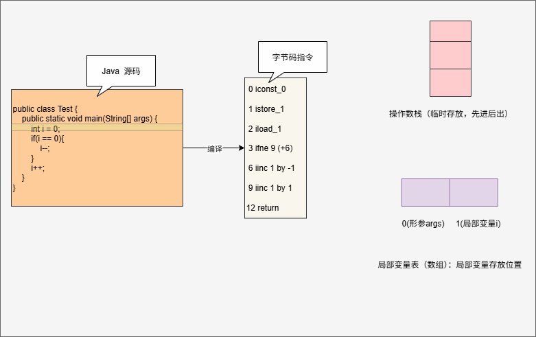
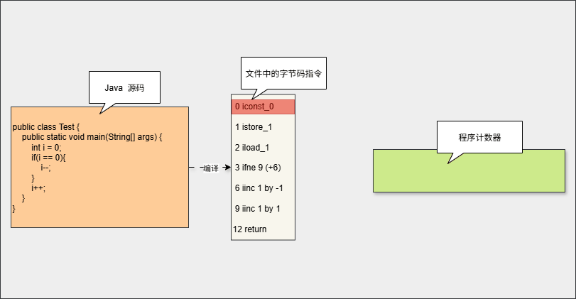

#  第一章：运行时数据区

## 1.1 概述

* 之前，我们就知道了，JVM 是通过`类加载器`将`字节码文件`加载到内存中，以便后续使用。在进行加载的时候，JVM 会使用到两块内存区域 --- `方法区`和`堆`。


* `方法区`和`堆`都属于 JVM 管理的内存区域；由于是 JVM 在运行过程中使用到的内存区域，我们也称之为`运行时数据区域`。

> [!NOTE]
>
> 作用：负责保存字节码信息、程序实例化的对象、方法的参数、返回值、局部变量和计算的中间结果。

## 1.2 运行时数据区域

* JVM 在运行 Java 程序过程中所管理的内存区域，称之为`运行时数据区域`。
* 《[JVM虚拟机规范](https://docs.oracle.com/javase/specs/jvms/se17/html/jvms-2.html#jvms-2.5)》中规定了每一部分的作用。

> [!NOTE]
>
> * ① 线程`不共享`的内存区域有：`程序计数器`、`Java 虚拟机栈`以及`本地方法栈`。
> * ② 线程`共享`的内存区域有：`方法区`和`堆区`。


> [!CAUTION]
>
> * ① 线程不共享指的就是每创建一个线程，JVM 就会帮助我们创建一份程序计数器、JVM 虚拟机栈以及本地方法栈。换言之，每个线程都维护自己的数据，别的线程不能去访问，数据没有办法进行共享；但是，安全性比较高（当线程的生命周期结束之后，线程对应的内存区域也会被释放掉）。
> * ② 线程共享就是只要我们向堆区或方法区中放入任何数据，每个线程都可以去获取并使用。虽然可以做到数据共享，但是会出现`线程安全`问题，使用的时候需要注意。

## 1.3 运行时数据区的应用场景

* ① 解决面试难题：

```txt
Java 中的内存区域分为哪几个部分？详细介绍一下。
```

```txt
Java 内存中的哪些部分会内存溢出（Out of Memory，OOM）？
```

```txt
JDK7 和 JDK8 的内存结构上有什么区别？
```

* ② 解决工作实际问题 --- 内存溢出。

> [!NOTE]
>
> * ① 内存溢出是指程序请求的内存超过了系统可用的内存资源，导致程序无法继续运行。
> * ② 这通常发生在程序尝试分配更多内存，而操作系统无法满足请求时。


## 1.4 内存调优学习路线

* ① `了解运行时内存结构`：了解 JVM 运行过程中每一部分的内存结构以及哪些部分容易出现内存溢出。
* ② `掌握内存问题的产生原因`：学习代码中常见的几种内存泄漏、性能问题的常见原因。
* ③ `掌握内存调优的基本方法`：学习内存泄漏、性能问题等常见 JVM 问题的常规解决方案。


# 第二章：程序计数器

## 2.1 概述

* 程序计数器（Program Counter Register，PC 寄存器）：每个线程都有单独的 PC 寄存器，主要为了保存`当前执行指令`的地址。

> [!NOTE]
>
> 一旦指令被执行，PC 寄存器将自动`更新`为下一条指令。


## 2.2 回顾字节码指令的执行过程

* 假设代码是这样的，如下所示：

```java
public class Test {
    public static void main(String[] args) {
        int i = 0;
        if(i == 0){
            i--;
        }
        i++;
    }
}
```

* 其对应的字节码指令，如下所示：

```txt
 0 iconst_0
 1 istore_1
 2 iload_1
 3 ifne 9 (+6)
 6 iinc 1 by -1
 9 iinc 1 by 1
12 return
```

* 当字节码指令被加载到内存的时候，会在 Java 虚拟机栈中形成两个内存区域，即：`操作数栈`和`局部变量表`。


* 其执行流程，如下所示：



## 2.3 程序计数器

* 在加载阶段，JVM 将字节码文件中的指令读取到内存中，并将源文件中的偏移量替换成内存地址，每一条字节码指令都有一个内存地址。


* 在代码执行过程中，程序计数器会保存`当前执行指令`的地址。执行完当前指令之后，PC 寄存器将自动`更新`为下一条指令。

> [!NOTE]
>
> * ① 为了直观演示，使用`偏移量`来代替`内存地址`！！！
> * ② 程序计数器可以控制程序指令的执行，实现分支、跳转、异常等逻辑。



* 在多线程环境下，JVM 会对线程进行调度，切换正在运行的线程。当线程被挂起并切换时，当前线程的程序计数器值会被保存在其线程的上下文中。下次该线程被调度时，JVM 会从程序计数器保存的值恢复执行，从而使得线程能够继续从中断的地方执行。


## 2.4 细节

* 【问】程序计数器在运行的时候会出现内存溢出的？
* 【答】不会。内存溢出指的是程序在使用某一块内存区域时，存放的数据需要占用的内存大小超过了虚拟机能提供的内存上限。因为每个线程只存储一个固定长度的内存地址，程序计数器是不会发生内存溢出的。程序员无需对程序计数器做任何处理。


# 第三章：Java 虚拟机栈


# 第四章：本地方法栈


# 第五章：堆内存


# 第六章：方法区


# 第七章：直接内存