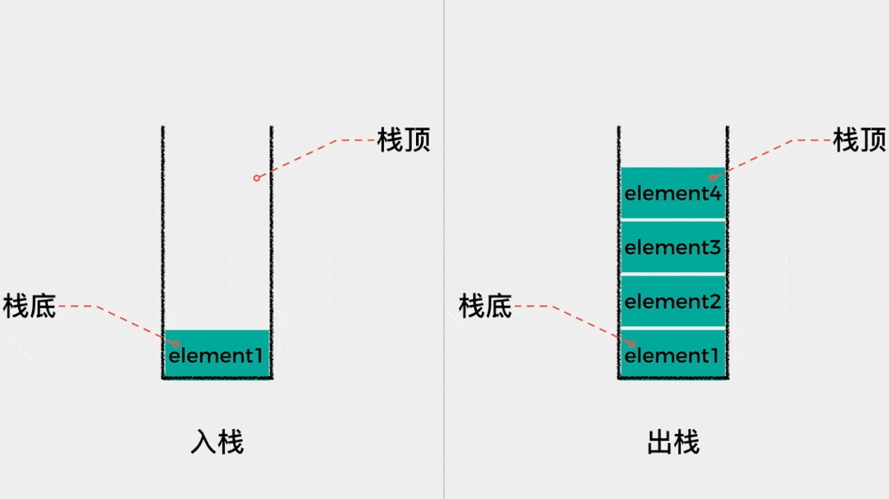
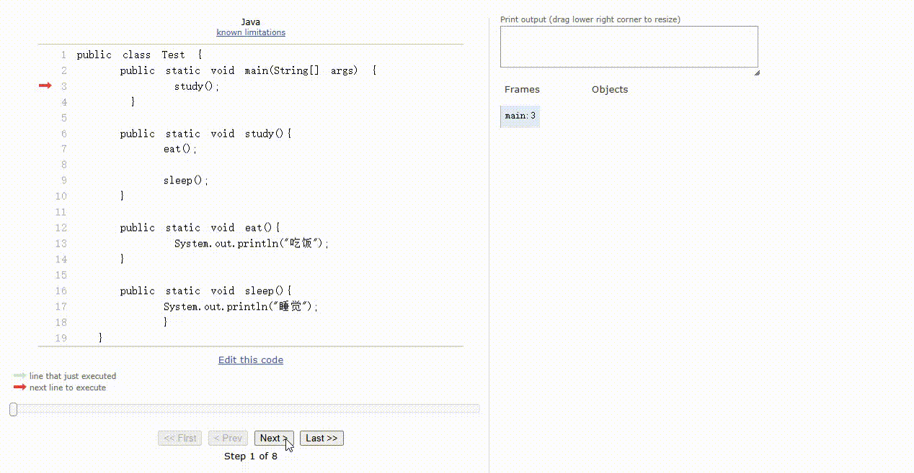
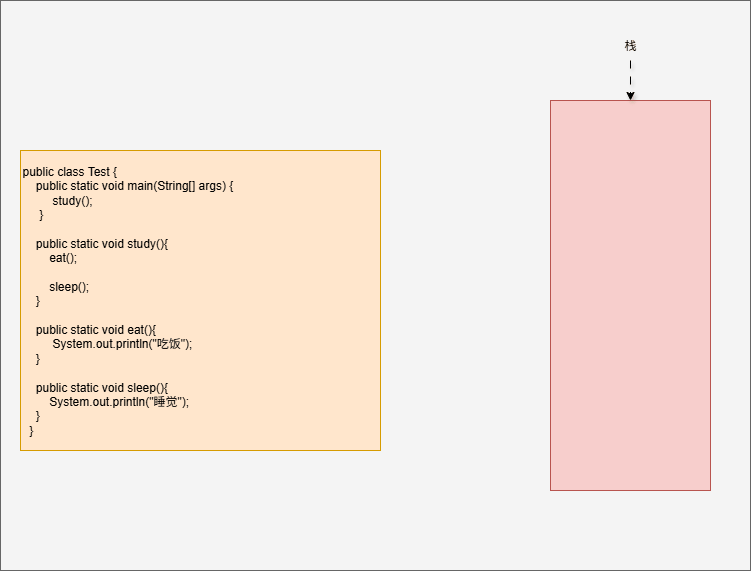
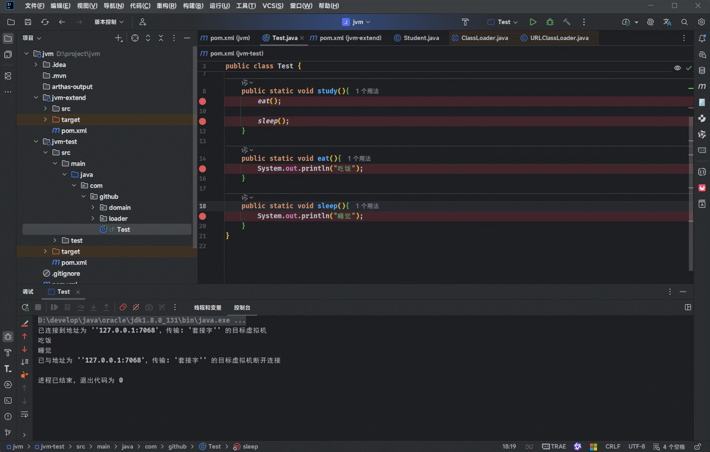
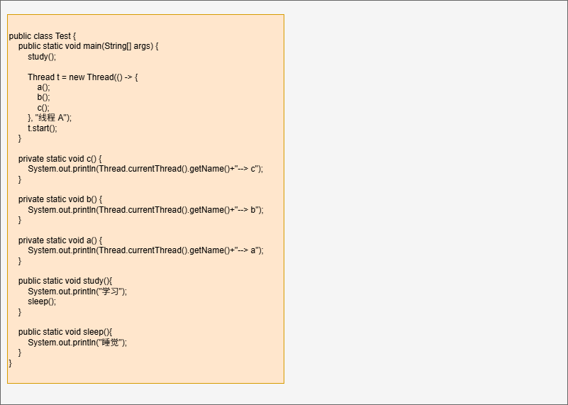
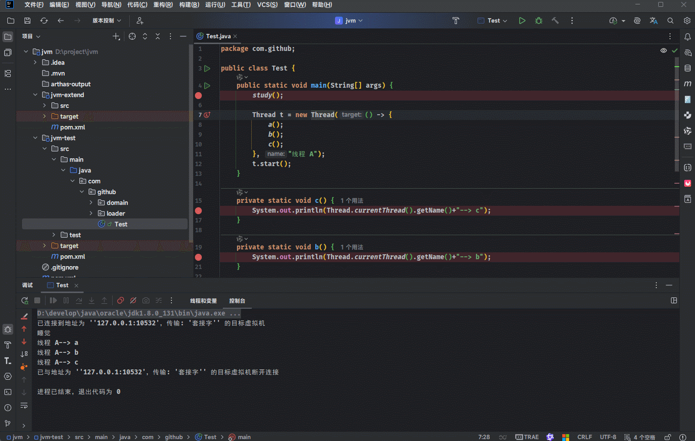
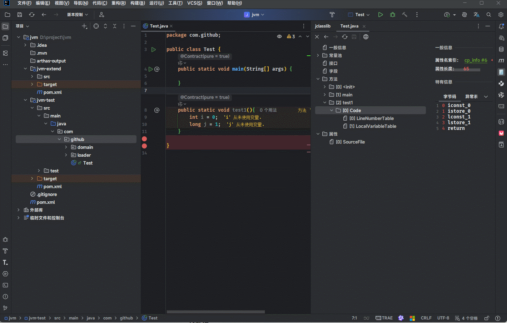
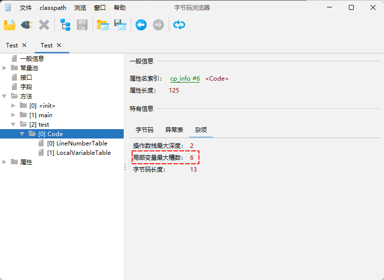
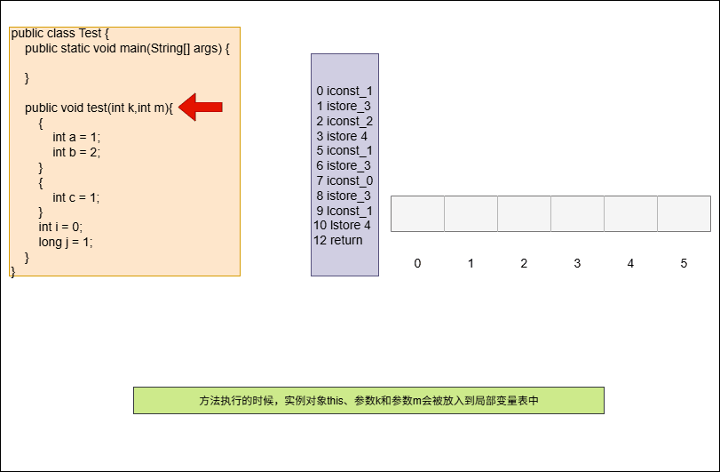

#  第一章：运行时数据区

## 1.1 概述

* 之前，我们就知道了，JVM 是通过`类加载器`将`字节码文件`加载到内存中，以便后续使用。在进行加载的时候，JVM 会使用到两块内存区域 --- `方法区`和`堆`。


* `方法区`和`堆`都属于 JVM 管理的内存区域；由于是 JVM 在运行过程中使用到的内存区域，我们也称之为`运行时数据区域`。

> [!NOTE]
>
> 作用：负责保存字节码信息、程序实例化的对象、方法的参数、返回值、局部变量和计算的中间结果。

## 1.2 运行时数据区域

* JVM 在运行 Java 程序过程中所管理的内存区域，称之为`运行时数据区域`。
* 《[JVM虚拟机规范](https://docs.oracle.com/javase/specs/jvms/se17/html/jvms-2.html#jvms-2.5)》中规定了每一部分的作用。

> [!NOTE]
>
> * ① 线程`不共享`的内存区域有：`程序计数器`、`Java 虚拟机栈`以及`本地方法栈`。
> * ② 线程`共享`的内存区域有：`方法区`和`堆区`。


> [!CAUTION]
>
> * ① 线程不共享指的就是每创建一个线程，JVM 就会帮助我们创建一份程序计数器、JVM 虚拟机栈以及本地方法栈。换言之，每个线程都维护自己的数据，别的线程不能去访问，数据没有办法进行共享；但是，安全性比较高（当线程的生命周期结束之后，线程对应的内存区域也会被释放掉）。
> * ② 线程共享就是只要我们向堆区或方法区中放入任何数据，每个线程都可以去获取并使用。虽然可以做到数据共享，但是会出现`线程安全`问题，使用的时候需要注意。

## 1.3 运行时数据区的应用场景

* ① 解决面试难题：

```txt
Java 中的内存区域分为哪几个部分？详细介绍一下。
```

```txt
Java 内存中的哪些部分会内存溢出（Out of Memory，OOM）？
```

```txt
JDK7 和 JDK8 的内存结构上有什么区别？
```

* ② 解决工作实际问题 --- 内存溢出。

> [!NOTE]
>
> * ① 内存溢出是指程序请求的内存超过了系统可用的内存资源，导致程序无法继续运行。
> * ② 这通常发生在程序尝试分配更多内存，而操作系统无法满足请求时。


## 1.4 内存调优学习路线（⭐）

* ① `了解运行时内存结构`：了解 JVM 运行过程中每一部分的内存结构以及哪些部分容易出现内存溢出。
* ② `掌握内存问题的产生原因`：学习代码中常见的几种内存泄漏、性能问题的常见原因。
* ③ `掌握内存调优的基本方法`：学习内存泄漏、性能问题等常见 JVM 问题的常规解决方案。


# 第二章：程序计数器

## 2.1 概述

* 程序计数器（Program Counter Register，PC 寄存器）：每个线程都有单独的 PC 寄存器，主要为了保存`当前执行指令`的地址。

> [!NOTE]
>
> 一旦指令被执行，PC 寄存器将`自动更新`为下一条指令。


## 2.2 回顾字节码指令的执行过程

* 假设代码是这样的，如下所示：

```java
public class Test {
    public static void main(String[] args) {
        int i = 0;
        if(i == 0){
            i--;
        }
        i++;
    }
}
```

* 其对应的字节码指令，如下所示：

```txt
 0 iconst_0
 1 istore_1
 2 iload_1
 3 ifne 9 (+6)
 6 iinc 1 by -1
 9 iinc 1 by 1
12 return
```

* 当字节码指令被加载到内存的时候，会在 Java 虚拟机栈中形成两个内存区域，即：`操作数栈`和`局部变量表`。


* 其执行流程，如下所示：


## 2.3 程序计数器

* 在加载阶段，JVM 将字节码文件中的指令读取到内存中，并将`源文件`中的`偏移量`替换成`内存地址`，每一条字节码指令都有一个内存地址。


* 在代码执行过程中，程序计数器会保存`当前执行指令`的地址。执行完当前指令之后，程序计数器将自动`更新`为下一条指令。

> [!NOTE]
>
> * ① 为了直观演示，使用`偏移量`来代替`内存地址`！！！
> * ② 程序计数器可以控制程序指令的执行，实现分支、跳转、异常等逻辑。


* 在多线程环境下，JVM 会对线程进行调度，切换正在运行的线程。当线程被挂起并切换时，当前线程的程序计数器值会被保存在其线程的上下文中。下次该线程被调度时，JVM 会从程序计数器保存的值恢复执行，从而使得线程能够继续从中断的地方执行。


## 2.4 细节

* 【问】程序计数器在运行的时候会出现内存溢出的？
* 【答】不会。内存溢出指的是程序在使用某一块内存区域时，存放的数据需要占用的内存大小超过了虚拟机能提供的内存上限。因为每个线程只存储一个固定长度的内存地址，程序计数器是不会发生内存溢出的。程序员无需对程序计数器做任何处理。


# 第三章：Java 虚拟机栈

## 3.1 概述

* 在《[JVM虚拟机规范](https://docs.oracle.com/javase/specs/jvms/se17/html/jvms-2.html#jvms-2.5)》中，`栈`被分为了`Java 虚拟机栈`以及`本地方法栈`。


* 它们本质上都属于`栈`结构，遵循`先进后出`原则。

> [!NOTE]
>
> * ① `Java 虚拟机栈`以及`本地方法栈`只是在《[JVM虚拟机规范](https://docs.oracle.com/javase/specs/jvms/se17/html/jvms-2.html#jvms-2.5)》中做了一个明确的划分而已。
> * ② `Java 虚拟机栈`是用来保存 Java 语言实现的方法，每次执行方法都会将该方法中的信息保存在这个栈中。
> * ③ `本地方法栈`是用来保存哪些使用`native`关键字修饰的方法，其底层是使用 C++ 语言来实现的方法。
> * ④ 在`HotSpot`中，JDK 的开发人员在实现过程中发现，不管是使用个 Java 语言实现的方法，还是使用 C++ 语言实现的本地方法，本质上都是方法；换言之，只使用了一种栈结构来保存这两种不同方法的信息，即：`Java 虚拟机栈`和`本地方法栈`进行了合并。



* 那么，`JVM 运行时数据区域`就是这样的，如下所示：


## 3.2 Java 虚拟机栈

* Java 虚拟机栈（Java Virtual Machine Stack）采用了`栈`的数据结构来管理方法调用中的基本信息。

> [!NOTE]
>
> * ① 遵循`先进后出`（First In Last Out，FILO）的原则。
> * ② 每一个方法的调用都会使用一个`栈帧`（Stack Frame）来保存。

* 那么，对应的代码和执行过程就是这样的，如下所示：

::: code-group

```java [Test.java]
public class Test {   
    public static void main(String[] args) {        
         study();    
     }

    public static void study(){
        eat();

        sleep();
    }   
    
    public static void eat(){       
         System.out.println("吃饭");   
    }    
    
    public static void sleep(){        
        System.out.println("睡觉");    
    }
  }
```

```md:img [cmd 控制台]

```

```md:img [cmd 控制台]

```

:::

* 其实，在 IDEA 中也可以看到对应的栈帧：

::: code-group

```java [Test.java]
public class Test {   
    public static void main(String[] args) {        
         study();    
     }

    public static void study(){
        eat();

        sleep();
    }   
    
    public static void eat(){       
         System.out.println("吃饭");   
    }    
    
    public static void sleep(){        
        System.out.println("睡觉");    
    }
  }
```

```md:img [cmd 控制台]

```

:::

* `Java 虚拟机栈`会随着线程的创建而创建，当线程销毁的时候也会回收对应的`Java 虚拟机栈`。

> [!NOTE]
>
> 由于方法可能会在不同的线程中执行，每个线程都会包含自己独立的`虚拟机栈`。

::: code-group

```java [Test.java]
package com.github;

public class Test {
    public static void main(String[] args) {
        study();

        Thread t = new Thread(() -> {
            a();
            b();
            c();
        }, "线程 A");
        t.start();
    }

    private static void c() {
        System.out.println(Thread.currentThread().getName()+"--> c");
    }

    private static void b() {
        System.out.println(Thread.currentThread().getName()+"--> b");
    }

    private static void a() {
        System.out.println(Thread.currentThread().getName()+"--> a");
    }

    public static void study(){
        System.out.println("学习");
        sleep();
    }

    public static void sleep(){
        System.out.println("睡觉");
    }
}
```

```md:img [cmd 控制台]

```

```md:img [cmd 控制台]

```

:::

## 3.3 栈帧

### 3.3.1 概述

* `Java 虚拟机栈`中的`栈帧`包含了`局部变量表`、`操作数栈`以及`帧数据`。

> [!NOTE]
>
> * ① `局部变量表`（Local Variables Table）：用于在运行过程中存放所有的局部变量。
> * ② `操作数栈`（Operand Stacks）：用于存放虚拟机在执行字节码指令过程中的临时数据。
> * ③ `帧数据`（Frame Datas）：包含动态链接、方法出口以及异常表的引用。


### 3.3.2 局部变量表

#### 3.3.2.1 概述

* `局部变量表`是用于方法执行过程中存放所有的局部变量。
* `局部变量表`有两种，如下所示：
  * ① 字节码文件中局部变量表。
  * ② 在栈帧中的局部变量表：栈帧中的局部变量表是根据字节码文件中的内容生成的。

#### 3.3.2.2 字节码文件中的局部变量表

* `当我们编译源代码形成字节码文件的时候，就已经确定了局部变量表中的内容`。

* 假设源码代码是这样的，其对应的局部变量表可以通过 Jclasslib 插件来查看：

::: code-group

```java [Test.java]
public class Test {
    public static void main(String[] args) {

    }

    public static void test1(){ // [!code highlight:4]
        int i = 0;
        long j = 1;
    }

}
```

```md:img [cmd 控制台]

```

:::

* 其过程就是这样的，如下所示：


* 其中，`局部变量表`中的`序号`指的是`源码`中`局部变量`的`编号`。

> [!NOTE]
>
> 在源码中，i 在前，j 在后；那么，i 在局部变量表中的编号就是 0，j 在局部变量表中的编号就是 1 。


* 其中，`起始程序计数器`和`长度`是用来`限制局部变量的生效范围`。

> [!NOTE]
>
> * ① `int i = 0;`对应的`字节码指令`是前两行；那么，`偏移量`就是 0 和 1 。
> * ② `long j = 1;`对应的`字节码指令`是后两行；那么，`偏移量`就是 2 和 3 。
> * ③ 对于`i`变量来说，必须经过偏移量`0`步骤和`1`步骤（初始化以及赋值）之后，才可以使用；那么，`i`的起始程序计数器就是`2`，`i`的长度是`3`，就意味着只有`2`、`3`、`4`三条指令才可以使用`i`变量。
> * ④ 对于`j`变量来说，必须经过偏移量`2`步骤和`3`步骤（初始化以及赋值）之后，才可以使用；那么，`j`的起始程序计数器就是`4`，`j`的长度是`1`，就意味着只有`4`三条指令才可以使用`j`变量。
> * ⑤ JVM 通过`局部变量表`来`控制`每一个`局部变量`能否访问`字节码指令`的范围。 换言之，如果在超过这个生效范围的字节码指令中去访问这个局部变量，该指令就会判断有问题，JVM 会拒绝执行，提高了一定的安全性。


> [!CAUTION]
>
> `栈帧`中的`局部变量表`并不是上述的样子，刚才看到的只是`字节码文件`中的`局部变量表`！！！

#### 3.3.2.3 栈帧中的局部变量表

* `栈帧`中的`局部变量表`是一个`数组`，数组中的每一个位置称之为槽（slot）：

> [!NOTE]
>
> * ① long 类型和 double 类型占用 2 个槽（slot）。
> * ② 其他数据类型，如：int 等（包含引用数据类型）占用 1 个槽（slot）。


* `实例方法`中的序号为`0`的位置存放的是`this`，指的是当前调用方法的对象，运行时会在内存中存放实例对象的地址。


* `方法参数`也会保存在`局部变量表`中，其顺序和方法中参数的定义顺序一致。

> [!NOTE]
>
> 局部变量表中保存的内容有：`实例方法的 this 对象`，`方法的参数`以及`方法体中声明的局部变量`。


#### 3.3.2.4 细节

* 需求：以下代码在局部变量表中会占用几个槽？

```java
package com.github;

public class Test {
    public static void main(String[] args) {
    }

    public void test(int k,int m){ // [!code highlight:11]
        {
            int a = 1;
            int b = 2;
        }
        {
            int c = 1;
        }
        int i = 0;
        long j = 1;
    }
}

```

> [!NOTE]
>
> ::: details 点我查看 具体详情
>
> * ① 为了节省空间，局部变量表中槽是可以复用的，即：某个局部变量不再生效，当前槽就可以再次利用。
> * ② 槽是 6 ，而不是 9 。
>
> 
>
> :::


* 示例：执行过程的动态图



### 3.3.3 操作数栈


### 3.3.4 帧数据


## 3.4 内存溢出


# 第四章：本地方法栈


# 第五章：堆内存


# 第六章：方法区


# 第七章：直接内存