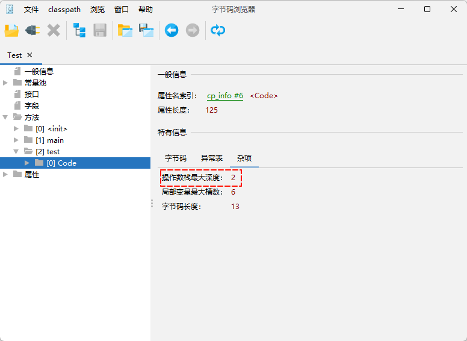
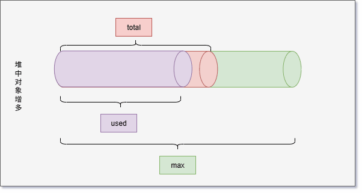
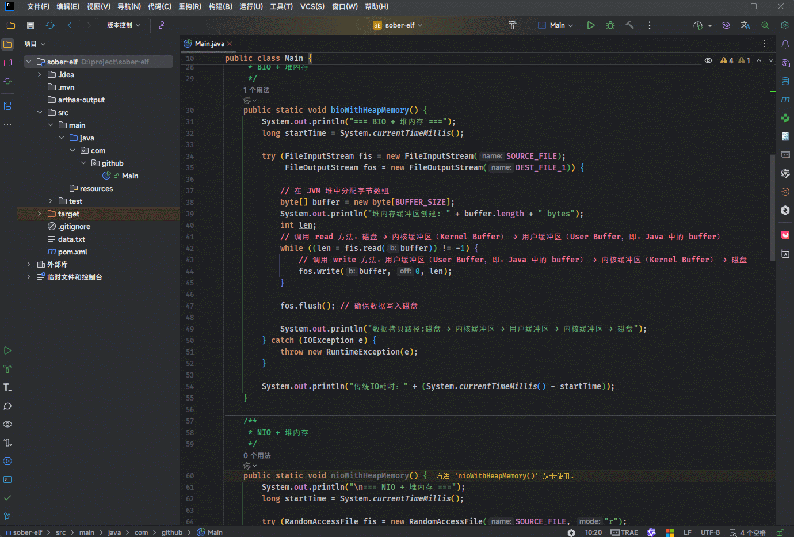

#  第一章：运行时数据区

## 1.1 概述

* 之前，我们就知道了，JVM 是通过`类加载器`将`字节码文件`加载到内存中，以便后续使用。在进行加载的时候，JVM 会使用到两块内存区域 --- `方法区`和`堆`。


* `方法区`和`堆`都属于 JVM 管理的内存区域；由于是 JVM 在运行过程中使用到的内存区域，我们也称之为`运行时数据区域`。

> [!NOTE]
>
> 作用：负责保存字节码信息、程序实例化的对象、方法的参数、返回值、局部变量和计算的中间结果。

## 1.2 运行时数据区域

* JVM 在运行 Java 程序过程中所管理的内存区域，称之为`运行时数据区域`。
* 《[JVM虚拟机规范](https://docs.oracle.com/javase/specs/jvms/se17/html/jvms-2.html#jvms-2.5)》中规定了每一部分的作用。

> [!NOTE]
>
> * ① 线程`不共享`的内存区域有：`程序计数器`、`Java 虚拟机栈`以及`本地方法栈`。
> * ② 线程`共享`的内存区域有：`方法区`和`堆区`。


> [!CAUTION]
>
> * ① 线程不共享指的就是每创建一个线程，JVM 就会帮助我们创建一份程序计数器、JVM 虚拟机栈以及本地方法栈。换言之，每个线程都维护自己的数据，别的线程不能去访问，数据没有办法进行共享；但是，安全性比较高（当线程的生命周期结束之后，线程对应的内存区域也会被释放掉）。
> * ② 线程共享就是只要我们向堆区或方法区中放入任何数据，每个线程都可以去获取并使用。虽然可以做到数据共享，但是会出现`线程安全`问题，使用的时候需要注意。

## 1.3 运行时数据区的应用场景

* ① 解决面试难题：

```txt
Java 中的内存区域分为哪几个部分？详细介绍一下。
```

```txt
Java 内存中的哪些部分会内存溢出（Out of Memory，OOM）？
```

```txt
JDK7 和 JDK8 的内存结构上有什么区别？
```

* ② 解决工作实际问题 --- 内存溢出。

> [!NOTE]
>
> * ① 内存溢出是指程序请求的内存超过了系统可用的内存资源，导致程序无法继续运行。
> * ② 这通常发生在程序尝试分配更多内存，而操作系统无法满足请求时。


## 1.4 内存调优学习路线（⭐）

* ① `了解运行时内存结构`：了解 JVM 运行过程中每一部分的内存结构以及哪些部分容易出现内存溢出。
* ② `掌握内存问题的产生原因`：学习代码中常见的几种内存泄漏、性能问题的常见原因。
* ③ `掌握内存调优的基本方法`：学习内存泄漏、性能问题等常见 JVM 问题的常规解决方案。


# 第二章：程序计数器

## 2.1 概述

* 程序计数器（Program Counter Register，PC 寄存器）：每个线程都有单独的 PC 寄存器，主要为了保存`当前执行指令`的地址。

> [!NOTE]
>
> 一旦指令被执行，PC 寄存器将`自动更新`为下一条指令。


## 2.2 回顾字节码指令的执行过程

* 假设代码是这样的，如下所示：

```java
public class Test {
    public static void main(String[] args) {
        int i = 0;
        if(i == 0){
            i--;
        }
        i++;
    }
}
```

* 其对应的字节码指令，如下所示：

```txt
 0 iconst_0
 1 istore_1
 2 iload_1
 3 ifne 9 (+6)
 6 iinc 1 by -1
 9 iinc 1 by 1
12 return
```

* 当字节码指令被加载到内存的时候，会在 Java 虚拟机栈中形成两个内存区域，即：`操作数栈`和`局部变量表`。


* 其执行流程，如下所示：


## 2.3 程序计数器

* 在加载阶段，JVM 将字节码文件中的指令读取到内存中，并将`源文件`中的`偏移量`替换成`内存地址`，每一条字节码指令都有一个内存地址。


* 在代码执行过程中，程序计数器会保存`当前执行指令`的地址。执行完当前指令之后，程序计数器将自动`更新`为下一条指令。

> [!NOTE]
>
> * ① 为了直观演示，使用`偏移量`来代替`内存地址`！！！
> * ② 程序计数器可以控制程序指令的执行，实现分支、跳转、异常等逻辑。


* 在多线程环境下，JVM 会对线程进行调度，切换正在运行的线程。

> [!NOTE]
>
> * ① 当线程被挂起并切换时，当前线程的程序计数器值会被保存在其线程的上下文中。
> * ② 下次该线程被调度时，JVM 会从程序计数器保存的值恢复执行，从而使得线程能够继续从中断的地方执行。


## 2.4 细节

* 【问】程序计数器在运行的时候会出现内存溢出的？
* 【答】不会。内存溢出指的是程序在使用某一块内存区域时，存放的数据需要占用的内存大小超过了虚拟机能提供的内存上限。因为每个线程只存储一个固定长度的内存地址，程序计数器是不会发生内存溢出的。程序员无需对程序计数器做任何处理。


# 第三章：Java 虚拟机栈

## 3.1 概述

* 在《[JVM虚拟机规范](https://docs.oracle.com/javase/specs/jvms/se17/html/jvms-2.html#jvms-2.5)》中，`栈`被分为了`Java 虚拟机栈`以及`本地方法栈`。


* 它们本质上都属于`栈`结构，遵循`先进后出`原则。

> [!NOTE]
>
> * ① `Java 虚拟机栈`以及`本地方法栈`只是在《[JVM虚拟机规范](https://docs.oracle.com/javase/specs/jvms/se17/html/jvms-2.html#jvms-2.5)》中做了一个明确的划分而已。
> * ② `Java 虚拟机栈`是用来保存 Java 语言实现的方法，每次执行方法都会将该方法中的信息保存在这个栈中。
> * ③ `本地方法栈`是用来保存哪些使用`native`关键字修饰的方法，其底层是使用 C++ 语言来实现的方法。
> * ④ 在`HotSpot`中，JDK 的开发人员在实现过程中发现，不管是使用个 Java 语言实现的方法，还是使用 C++ 语言实现的本地方法，本质上都是方法；换言之，只使用了一种栈结构来保存这两种不同方法的信息，即：`Java 虚拟机栈`和`本地方法栈`进行了合并。


* 那么，`JVM 运行时数据区域`就是这样的，如下所示：


## 3.2 Java 虚拟机栈

* Java 虚拟机栈（Java Virtual Machine Stack）采用了`栈`的数据结构来管理方法调用中的基本信息。

> [!NOTE]
>
> * ① 遵循`先进后出`（First In Last Out，FILO）的原则。
> * ② 每一个方法的调用都会使用一个`栈帧`（Stack Frame）来保存。

* 那么，对应的代码和执行过程就是这样的，如下所示：

::: code-group

```java [Test.java]
public class Test {   
    public static void main(String[] args) {        
         study();    
     }

    public static void study(){
        eat();

        sleep();
    }   
    
    public static void eat(){       
         System.out.println("吃饭");   
    }    
    
    public static void sleep(){        
        System.out.println("睡觉");    
    }
  }
```

```md:img [cmd 控制台]

```

```md:img [cmd 控制台]

```

:::

* 其实，在 IDEA 中也可以看到对应的栈帧：

::: code-group

```java [Test.java]
public class Test {   
    public static void main(String[] args) {        
         study();    
     }

    public static void study(){
        eat();

        sleep();
    }   
    
    public static void eat(){       
         System.out.println("吃饭");   
    }    
    
    public static void sleep(){        
        System.out.println("睡觉");    
    }
  }
```

```md:img [cmd 控制台]

```

:::

* `Java 虚拟机栈`会随着线程的创建而创建，当线程销毁的时候也会回收对应的`Java 虚拟机栈`。

> [!NOTE]
>
> 由于方法可能会在不同的线程中执行，每个线程都会包含自己独立的`虚拟机栈`。

::: code-group

```java [Test.java]
package com.github;

public class Test {
    public static void main(String[] args) {
        study();

        Thread t = new Thread(() -> {
            a();
            b();
            c();
        }, "线程 A");
        t.start();
    }

    private static void c() {
        System.out.println(Thread.currentThread().getName()+"--> c");
    }

    private static void b() {
        System.out.println(Thread.currentThread().getName()+"--> b");
    }

    private static void a() {
        System.out.println(Thread.currentThread().getName()+"--> a");
    }

    public static void study(){
        System.out.println("学习");
        sleep();
    }

    public static void sleep(){
        System.out.println("睡觉");
    }
}
```

```md:img [cmd 控制台]

```

```md:img [cmd 控制台]

```

:::

## 3.3 栈帧

### 3.3.1 概述

* `Java 虚拟机栈`中的`栈帧`包含了`局部变量表`、`操作数栈`以及`帧数据`。

> [!NOTE]
>
> * ① `局部变量表`（Local Variables Table）：用于在运行过程中存放所有的局部变量。
> * ② `操作数栈`（Operand Stacks）：用于存放虚拟机在执行字节码指令过程中的临时数据。
> * ③ `帧数据`（Frame Datas）：主要包含动态链接、方法出口以及异常表的引用。


### 3.3.2 局部变量表

#### 3.3.2.1 概述

* `局部变量表`是用于方法执行过程中存放所有的局部变量。
* `局部变量表`有两种，如下所示：
  * ① 字节码文件中局部变量表。
  * ② 在栈帧中的局部变量表：栈帧中的局部变量表是根据字节码文件中的内容生成的。

#### 3.3.2.2 字节码文件中的局部变量表

* `当我们编译源代码形成字节码文件的时候，就已经确定了局部变量表中的内容`。

* 假设源码代码是这样的，其对应的局部变量表可以通过 Jclasslib 插件来查看：

::: code-group

```java [Test.java]
public class Test {
    public static void main(String[] args) {

    }

    public static void test1(){ // [!code highlight:4]
        int i = 0;
        long j = 1;
    }

}
```

```md:img [cmd 控制台]

```

:::

* 其过程就是这样的，如下所示：


* 其中，`局部变量表`中的`序号`指的是`源码`中`局部变量`的`编号`。

> [!NOTE]
>
> 在源码中，i 在前，j 在后；那么，i 在局部变量表中的编号就是 0，j 在局部变量表中的编号就是 1 。


* 其中，`起始程序计数器`和`长度`是用来`限制局部变量的生效范围`。

> [!NOTE]
>
> * ① `int i = 0;`对应的`字节码指令`是前两行；那么，`偏移量`就是 0 和 1 。
> * ② `long j = 1;`对应的`字节码指令`是后两行；那么，`偏移量`就是 2 和 3 。
> * ③ 对于`i`变量来说，必须经过偏移量`0`步骤和`1`步骤（初始化以及赋值）之后，才可以使用；那么，`i`的起始程序计数器就是`2`，`i`的长度是`3`，就意味着只有`2`、`3`、`4`三条指令才可以使用`i`变量。
> * ④ 对于`j`变量来说，必须经过偏移量`2`步骤和`3`步骤（初始化以及赋值）之后，才可以使用；那么，`j`的起始程序计数器就是`4`，`j`的长度是`1`，就意味着只有`4`三条指令才可以使用`j`变量。
> * ⑤ JVM 通过`局部变量表`来`控制`每一个`局部变量`能否访问`字节码指令`的范围。 换言之，如果在超过这个生效范围的字节码指令中去访问这个局部变量，该指令就会判断有问题，JVM 会拒绝执行，提高了一定的安全性。


> [!CAUTION]
>
> `栈帧`中的`局部变量表`并不是上述的样子，刚才看到的只是`字节码文件`中的`局部变量表`！！！

#### 3.3.2.3 栈帧中的局部变量表

* `栈帧`中的`局部变量表`是一个`数组`，数组中的每一个位置称之为槽（slot）：

> [!NOTE]
>
> * ① long 类型和 double 类型占用 2 个槽（slot）。
> * ② 其他数据类型，如：int 等（包含引用数据类型）占用 1 个槽（slot）。


* `实例方法`中的序号为`0`的位置存放的是`this`，指的是当前调用方法的对象，运行时会在内存中存放实例对象的地址。


* `方法参数`也会保存在`局部变量表`中，其顺序和方法中参数的定义顺序一致。

> [!NOTE]
>
> 局部变量表中保存的内容有：`实例方法的 this 对象`，`方法的参数`以及`方法体中声明的局部变量`。


#### 3.3.2.4 细节

* 需求：以下代码在局部变量表中会占用几个槽？

```java
package com.github;

public class Test {
    public static void main(String[] args) {
    }

    public void test(int k,int m){ // [!code highlight:11]
        {
            int a = 1;
            int b = 2;
        }
        {
            int c = 1;
        }
        int i = 0;
        long j = 1;
    }
}

```

> [!NOTE]
>
> ::: details 点我查看 具体详情
>
> * ① 为了节省空间，局部变量表中槽是可以复用的，即：某个局部变量不再生效，当前槽就可以再次利用。
> * ② 槽是 6 ，而不是 9 。
>
> 
>
> :::


* 示例：执行过程的动态图


### 3.3.3 操作数栈

#### 3.3.3.1 概述

* `操作数栈`是`栈帧`中虚拟机在执行`字节码指令`过程中用来存放`临时数据`的一块内存区域。
* 操作数栈也是一种栈式的数据结构。

> [!NOTE]
>
> 如果一条指令将一个值压入到操作数栈中，则后面的指令可以弹出并使用该值。

#### 3.3.3.2 特点

* `编译期就可以确定操作数栈的最大深度，从而在执行的时候正确地分配内存大小`。




* 示例：演示操作数栈的最大深度

::: code-group

```txt [faq 计算过程]
iconst_1    // 栈深度: 0→1, 最大深度: 1
istore_1    // 栈深度: 1→0, 最大深度: 1
iconst_2    // 栈深度: 0→1, 最大深度: 1  
istore_2    // 栈深度: 1→0, 最大深度: 1
iload_1     // 栈深度: 0→1, 最大深度: 1
iload_2     // 栈深度: 1→2, 最大深度: 2
iadd        // 栈深度: 2→1, 最大深度: 2
istore_3    // 栈深度: 1→0, 最大深度: 2
```

```md:img [cmd 控制台]

```

:::

### 3.3.4 帧数据

#### 3.3.4.1 概述

* `操作数栈`和`局部变量表`，对于每个 Java 虚拟机，都是按照 《[Java虚拟机规范](https://docs.oracle.com/javase/specs/jvms/se17/html/jvms-2.html#jvms-2.5)》实现的。
* `栈数据`主要包含`动态链接`、`方法出口`以及`异常表`；但是，不同的 Java 虚拟机有不同的扩展。

#### 3.3.4.2 动态链接

##### 3.3.4.2.1 概述

* `符号引用`就是在字节码文件中使用`编号`来访问常量池中的内容。


* 在`类加载`生命周期中的`链接`阶段（解析阶段）是将常量池中的`符号引用`替换为`直接引用`。

> [!NOTE]
>
> 不使用编号，而是使用内存地址来进行具体数据的访问，就是为了性能（后续可以直接通过内存地址从内存中获取数据）。


* 但是，Java 并不能将所有的`符号引用`都替换为`直接引用`，如：虚方法调用（多态）。

> [!NOTE]
>
> * ① 静态链接（Static Linking）：在编译期就把`符号引用`变成`直接引用`，如： C/C++ 编译后的二进制。
> * ② 动态链接（Dynamic Linking）：在运行时才把`符号引用`解析成`直接引用`，即：允许方法调用的 `延迟绑定`（Java 中的多态）。

> [!CAUTION]
>
> * ① 如果`字节码指令`中引用了`其他类的属性或者方法`的时候，需要将`符号引用`转换为对应的`运行时常量池`中的`内存地址`。
> * ② 换言之，动态链接就保存了`编号`到`运行时常量池`的内存地址的映射关系。


##### 3.3.4.2.2 为什么需要动态链接？

* 虽然在`解析阶段`能处理一部分`静态可确定`的符号引用；但是，在运行时仍有大量调用`动态链接`。

> [!NOTE]
>
> 解析阶段并不能将所有的`符号引用`一次性的`全部替换`为`直接引用`的原因有两点，如下所示：
>
> * ① `延迟解析`（Lazy Resolution）：JVM 规范允许在真正使用某个符号引用时才解析，而不是类加载时全部解析。
> * ② `多态与动态绑定`（Polymorphism & Dynamic Binding）：有些调用在编译期根本无法确定目标（ `invokevirtual`），只能在运行时动态决定。

* 动态链接的典型例子 --- 虚方法调用（Virtual Method Call）：

::: code-group

```java [Test.java]
abstract class Animal {

    public abstract void eat();
}

class Dog extends Animal {
    @Override
    public void eat() {
        System.out.println("狗吃饭");
    }
}

public class Test {
    public static void main(String[] args) {
        Animal animal = new Dog();
        /*
        编译期只知道 eat() 是个符号引用；
        在运行时，需要通过对象实际类型去查找vtable(虚方法表），跳转到对应的方法实现
        */
        animal.eat();
    }
}
```

```cmd [字节码指令]{6}
 0 new #2 <com/github/Dog>
 3 dup
 4 invokespecial #3 <com/github/Dog.<init> : ()V>
 7 astore_1
 8 aload_1
 9 invokevirtual #4 <com/github/Animal.eat : ()V> 
12 return
```

:::

* 动态链接的典型例子 --- 接口方法调用（invokeinterface）：

::: code-group

```java [Test.java]
// 接口
interface Fly {

    void fly();
}

// 实现类
class Bird implements Fly {
    @Override
    public void fly() {
        System.out.println("鸟飞");
    }
}

// 实现类
class Plane implements Fly {
    @Override
    public void fly() {
        System.out.println("飞机飞");
    }
}

// 实现类
class Ship implements Fly {
    @Override
    public void fly() {
        System.out.println("船飞");
    }
}

public class Test {
    public static void main(String[] args) {
       Fly fly = new Bird();
       // 接口的实现类很多，只有在运行的时候才能确定真正调用那个实现类的方法
       fly.fly();
    }
}
```

```cmd [字节码指令] {6}
 0 new #2 <com/github/Bird>
 3 dup
 4 invokespecial #3 <com/github/Bird.<init> : ()V>
 7 astore_1
 8 aload_1
 9 invokeinterface #4 <com/github/Fly.fly : ()V> count 1 
14 return
```

:::

* 动态链接的典型例子 --- 反射调用：

::: code-group

```java [Test.java]
package com.github;

// 接口
interface Fly {

    void fly();
}

// 实现类
class Bird implements Fly {
    @Override
    public void fly() {
        System.out.println("鸟飞");
    }
}

// 实现类
class Plane implements Fly {
    @Override
    public void fly() {
        System.out.println("飞机飞");
    }
}

// 实现类
class Ship implements Fly {
    @Override
    public void fly() {
        System.out.println("船飞");
    }
}

public class Test {
    public static void main(String[] args) {
       Class<?> clazz = Class.forName("com.github.Bird");
       // 反射在编译期压根不知道调用哪个方法
       // 反射只有在运行期才知道调用哪个方法
       Method fly = clazz.getMethod("fly");
       fly.invoke(clazz.newInstance());
    }
}
```

```cmd [字节码指令] {8}
0 ldc #2 <com.github.Bird>
 2 invokestatic #3 <java/lang/Class.forName : (Ljava/lang/String;)Ljava/lang/Class;>
 5 astore_1
 6 aload_1
 7 ldc #4 <fly>
 9 iconst_0
10 anewarray #5 <java/lang/Class>
13 invokevirtual #6 <java/lang/Class.getMethod : (Ljava/lang/String;[Ljava/lang/Class;)Ljava/lang/reflect/Method;>
16 astore_2
17 aload_2
18 aload_1
19 invokevirtual #7 <java/lang/Class.newInstance : ()Ljava/lang/Object;>
22 iconst_0
23 anewarray #8 <java/lang/Object>
26 invokevirtual #9 <java/lang/reflect/Method.invoke : (Ljava/lang/Object;[Ljava/lang/Object;)Ljava/lang/Object;>
29 pop
30 return
```

:::

* 动态链接的典型例子 --- 动态语言支持：

::: code-group

```java [Test.java]
public class Test {
    public static void main(String[] args) {
        /*
        invokedynamic 指令是为支持 JVM 上的动态语言引入的，如：Lambda 表达式。
        方法绑定完全延迟到运行时。
        */            
        Thread thread = new Thread(() -> System.out.println("线程运行"));
        thread.start();
    }
}
```

```cmd [字节码指令] {3}
 0 new #2 <java/lang/Thread>
 3 dup
 4 invokedynamic #3 <run, BootstrapMethods #0>
 9 invokespecial #4 <java/lang/Thread.<init> : (Ljava/lang/Runnable;)V>
12 astore_1
13 aload_1
14 invokevirtual #5 <java/lang/Thread.start : ()V>
17 return
```

:::

##### 3.3.4.2.3 总结

* 类加载解析 VS 动态链接：

| 对比点   | 解析阶段（Resolution）           | 动态链接（Dynamic Linking）                 |
| -------- | -------------------------------- | ------------------------------------------- |
| 时间点   | 类加载时（或第一次使用时）       | 方法调用的运行时                            |
| 解析范围 | 能静态确定的符号引用             | 需要运行时才能确定的调用                    |
| 特点     | 一次性完成或延迟完成             | 每次调用时都可能发生                        |
| 适用场景 | 静态方法、私有方法、final 方法等 | 虚方法、接口方法、多态、反射、invokedynamic |

* `类加载`的`解析阶段`是 `能静态确定的先解析好`。
* `动态链接`是`运行时根据实际对象和上下文动态解析`，尤其是支持`多态`和`延迟绑定`的核心机制。

#### 3.3.4.3 返回地址

* 在多线程环境下，JVM 会对线程进行调度，切换正在运行的线程。

> [!NOTE]
>
> * ① 当线程被挂起并切换时，当前线程的程序计数器值会被保存在其线程的上下文中。
> * ② 下次该线程被调度时，JVM 会从程序计数器保存的值恢复执行，从而使得线程能够继续从中断的地方执行。


* 程序计数器是怎么知道上一个栈帧中下一个指令的地址的？答案是`返回地址`（Return Address）。

> [!NOTE]
>
> * ① 当调用一个方法时，调用指令（`invokestatic`, `invokevirtual` 等）不仅会创建新栈帧，还会在调用者的栈帧里保存`调用点的下一条字节码指令地址`。
> * ② 被调用方法执行完后，JVM 会弹出当前栈帧，把控制权交回调用者，并`跳转到这个保存的地址`继续执行。


#### 3.3.4.4 异常表

* 异常表存放是代码中的异常处理信息。

> [!NOTE]
>
> 异常表的信息有：`异常捕获的生效范围`以及`异常发生后跳转的字节码指令位置`。


## 3.4 内存溢出（Java虚拟机栈）

### 3.4.1 概述

* `Java虚拟机栈`中的`栈帧`过多，占用内存超过`栈内存`可以分配的最大大小就会出现`内存溢出`。


* `JVM`给`虚拟机栈`分配内存有一个上限，如果超过了这个上限，就会出现`内存溢出`。

> [!NOTE]
>
> * ① 当出现`内存溢出`的时候，JVM 会抛出 StackOverflowError 的错误，并且线程也会停止执行。
> * ② 如果我们不指定栈空间的大小，JVM 将会创建一个`默认大小`的栈，该值取决于操作系统。
>
> | 平台（操作系统） | 默认栈分配的内存空间大小 |
> | ---------------- | ------------------------ |
> | Linux            | 1 MB                     |
> | Windows          | 基于操作系统的默认值     |


### 3.4.2 模拟栈内存溢出

* 需求：使用递归让方法自身调用自己，无需设置退出条件。

> [!NOTE]
>
> * ① 定义调用次数的变量，每调用一次让变量 +1 。
> * ② 查看错误发生时的总调用次数。


* 示例：

::: code-group

```java [Test.java]
package com.github;


public class Test {
    private static int count = 0;

    public static void main(String[] args) {
        recursion();
    }

    /**
     * 递归
     */
    public static void recursion(){
        System.out.println(++count);
        recursion();
    }
}
```

```md:img [cmd 控制台]

```

:::

### 3.4.3 手动设置大小

* 可以通过修改 JVM 参数，达到修改`Java虚拟机栈`大小的目的。
* 语法：

```java
-Xss栈大小
```

> [!NOTE]
>
> * ① 单位：字节（默认，必须是 1024 的整数倍）、k或者K(KB)、m或者M(MB)、g或者G(GB) 。
> * ② 和`-Xss`类似，也可以使用`-XX:ThreadStackSize`来配置堆栈大小，如：`-XX:ThreadStackSize=1024`。
> * ③ HotSpot JVM 对栈大小的最大值和最小值有要求：
> 
> | 操作系统 | JDK 版本 | 位数 | 测试最小值 | 测试最大值 |
> | -------- | -------- | ---- | ---------- | ---------- |
>| Windows  | JDK 8    | 64位 | 180 KB     | 1024 MB    |
> 
> * ④ 局部变量过多、操作数栈深度过大也会影响栈内存的大小。

> [!TIP]
>
> * ① 一般情况下，工作中即便使用了递归进行操作，栈的深度最多也只能到几百，不会出现栈的溢出。
> * ② 参数可以手动指定为 -Xss256k 节省内存（通常不需要设置）。


* 示例：IDEA 配置 JVM 参数来调整栈大小

::: code-group

```bash
-Xss1024m
```

```java [Test.java]
package com.github;


public class Test {
    private static int count = 0;

    public static void main(String[] args) {
        recursion();
    }

    /**
     * 递归
     */
    public static void recursion(){
        System.out.println(++count);
        recursion();
    }
}
```

```md:img [cmd 控制台]

```

:::


# 第四章：本地方法栈

## 4.1 概述

* `Java虚拟机栈`存储了 Java 方法调用时的栈帧，而`本地方法栈`存储的是 native 本地方法的栈帧。

> [!NOTE]
>
> * ① 在 Hotspot 虚拟机中，`Java虚拟机栈`和`本地方法栈`实现上使用了同一个栈空间。
>
> * ② `本地方法栈`会在栈内存上生成一个栈帧，包含了`局部变量表`、`操作数栈`以及`帧数据`。


## 4.2 演示

* 只要使用了 native 关键字修饰的方法就是本地方法，在调用的时候，就会创建本地方法栈。

> [!NOTE]
>
> 在 Hotspot 虚拟机中，`Java虚拟机栈`和`本地方法栈`实现上使用了同一个栈空间。


* 示例：

::: code-group

```java [Test.java]
package com.github;

import java.io.FileNotFoundException;
import java.io.FileOutputStream;
import java.io.IOException;

public class Test {
    public static void main(String[] args){
        try {
            FileOutputStream fileOutputStream = new FileOutputStream("H:\\123.txt");
            fileOutputStream.write(1);
        } catch (FileNotFoundException e) {
            e.printStackTrace();
        } catch (IOException e) {
            e.printStackTrace();
        }
    }

}
```

```md:img [cmd 控制台]

```

:::


# 第五章：堆内存

## 5.1 概述

* 我们已经学习了`运行时数据区`中的`程序计数器`、`栈`，下面将学习`堆`、`方法区`和`直接内存`。

> [!NOTE]
>
> * ① 线程`不共享`的内存区域有：`程序计数器`、`Java 虚拟机栈`以及`本地方法栈`。
> * ② 线程`共享`的内存区域有：`方法区`、`堆区`以及`直接内存`。


## 5.2 堆内存

* Java 程序中`堆内存`是`内存空间`中最大的一块内存区域，创建出来的对象都是位于`堆内存`中。

> [!NOTE]
>
> * ① `栈`中的`局部变量表`中，可以存放`堆`中`对象`的`引用`。
> * ② `静态变量`也可以存放`堆对象`的`引用`，通过`静态变量`就可以实现对象在线程之间共享。

::: code-group

```java [Student.java]
public class Student {
    String name;
    int age;
    static String teacherName;
    
    public void show() {
        System.out.println("Student{"
                + "name='" + name
                + '\'' + ", age=" + age
                + '\'' + ", teacherName='" + teacherName 
                + '\'' + '}');
    }
}
```

```java [StudentTest.java]
public class StudentTest {
    public static void main(String[] args) {
        Student.teacherName = "苍老师";  

        // 创建第一个对象
        Student s1 = new Student();
        s1.name = "张三";
        s1.age = 18;
        s1.show();

        // 创建第二个对象
        Student s2 = new Student();
        s2.name = "李四";
        s2.age = 20;
        s2.show();
    }
}
```

```md:img [cmd 控制台]

```

:::

## 5.3 内存溢出（堆内存） 

### 5.3.1 模拟堆内存溢出

* 需求：通过 new 关键字不同的创建对象，放入到集合中，观察堆溢出之后的异常信息。

> [!NOTE]
>
> 堆内存大小是有上限的，当一直向堆中放入对象达到上限之后，就会抛出 OutOfMemoryError 错误。


* 示例：

::: code-group

```java [Test.java]
package com.github;

import java.util.ArrayList;
import java.util.List;

public class Test {
    public static void main(String[] args) throws InterruptedException {
        List<Object> objList = new ArrayList<>();
        while (true) {
            objList.add(new byte[1024 * 1024 * 100]);
        }

    }

}
```

```md:img [cmd 控制台]

```

:::

### 5.3.2 相关值

* 堆空间有三个需要关注的值，即：used、total 和 max 。

| 堆空间相关值 | 描述                            |
| ------------ | ------------------------------- |
| used         | 当前已经使用的堆内存。          |
| total        | Java 虚拟机分配的可用的堆内存。 |
| max          | Java 虚拟机分配的最大堆内存。   |


* 我们可以通过 Arthas 来查看这三个值：

::: code-group

```java [Test.java]
package com.github;

import java.io.IOException;
import java.util.ArrayList;
import java.util.List;

public class Test {
    public static void main(String[] args) throws IOException {
        List<Object> objList = new ArrayList<>();
        for (int i = 0; i < 10; i++) {
            objList.add(new byte[1024 * 1024 * 100]);
        }

        System.in.read();
    }

}
```

```bash [Arthas]
# 类似于 Linux 中的 free 命令
memory

 # 类似于 top 或 glances 命令
dashboard -i
```

```md:img [cmd 控制台]

```

:::

* 随着堆中对象的增多，used 会越来越接近于 total ，如下所示：

::: code-group

```java [Test.java]
import java.io.IOException;
import java.util.ArrayList;
import java.util.List;

public class Test {
    public static void main(String[] args) throws IOException {
        List<Object> objList = new ArrayList<>();
        while(true) {
            // 阻塞，直到键盘输入字符为止
            System.in.read();
            objList.add(new byte[1024 * 1024 * 100]);
        }
    }

}
```

```md:img [faq 动态图]

```

```bash [Arthas]
# 类似于 Linux 中的 free 命令
memory

 # 类似于 top 或 glances 命令
dashboard -i
```

```md:img [cmd 控制台]

```

:::

* 如果 used 和 total 非常接近，JVM 将继续分配内存给 total，这样就可以继续向堆中增加对象。

::: code-group

```java [Test.java]
import java.io.IOException;
import java.util.ArrayList;
import java.util.List;

public class Test {
    public static void main(String[] args) throws IOException {
        List<Object> objList = new ArrayList<>();
        while(true) {
            // 阻塞，直到键盘输入字符为止
            System.in.read();
            objList.add(new byte[1024 * 1024 * 100]);
        }
    }

}
```

```md:img [faq 动态图]

```

```bash [Arthas]
# 类似于 Linux 中的 free 命令
memory

 # 类似于 top 或 glances 命令
dashboard -i
```

```md:img [cmd 控制台]

```

:::

* 但是，JVM 并不会一直给 total 分配内存，极限情况就是 used = total = max 。

::: code-group

```java [Test.java]
import java.io.IOException;
import java.util.ArrayList;
import java.util.List;

public class Test {
    public static void main(String[] args) throws IOException {
        List<Object> objList = new ArrayList<>();
        while(true) {
            // 阻塞，直到键盘输入字符为止
            System.in.read();
            objList.add(new byte[1024 * 1024 * 10]);
        }
    }

}
```

```md:img [faq 动态图]

```

```bash [Arthas]
# 类似于 Linux 中的 free 命令
memory

 # 类似于 top 或 glances 命令
dashboard -i
```

```md:img [cmd 控制台]

```

:::

### 5.3.3 细节

* 【问】如果 used = total = max 的时候，堆内存就开始内存溢出？
* 【答】不是，`堆内存`出现`内存溢出`的判断条件比较复杂，在《垃圾回收》中有详细的介绍。

### 5.3.4 细节

* 【问】为什么 Arthas 中显示的 heap 堆大小和设置的值不一样？
* 【答】Arthas 中的 heap 堆内存使用了 JMX 技术来获取的，这种方式和垃圾回收器有关，计算的是可以分配对象的内存，而不是总内存。

### 5.3.5 默认堆内存大小

* 默认情况下，max 是系统内存的 1/4，total 是系统内存的 1/64 。

> [!NOTE]
>
> * ① [文档地址](https://docs.oracle.com/javase/8/docs/technotes/guides/vm/gctuning/ergonomics.html)。
> * ② 在实际应用中一般都需要设置 total 和 max 的值。


* 示例：

::: code-group

```bash
java -XX:+PrintFlagsFinal -version | grep -i HeapSize
```

```md:img [cmd 控制台]

```

:::

### 5.3.6 手动设置大小

* 可以使用 JVM 参数来修改堆内存大小。
* 语法：

```java
// 初始 total
-Xms值 
// max 最大值    
-Xmx值
```

> [!NOTE]
>
> * ① 单位：字节（默认，必须是 1024 的整数倍）、k或者K(KB)、m或者M(MB)、g或者G(GB) 。
> * ② 和`-Xms`类似，也可以使用`-XX:InitalHeapSize`来配置堆大小，如：`-XX:InitalHeapSize=1024`。
> * ③ 和`-Xmx`类似，也可以使用`-XX:MaxHeapSize`来配置堆大小，如：`-XX:MaxHeapSize=1024`。
> * ④ -Xms 必须大于 1MB；而 -Xms 必须大于 2 MB。
>

> [!TIP]
>
> * ① Java 服务端程序开发时，建议将 `-Xmx` 和 `-Xms` 设置为相同的值，这样在程序启动之后可使用的总内存就是最大内存，而无需向 JVM 再次申请，减少了申请并分配内存时间上的开销，同时也不会出现内存过剩之后堆收缩的情况。
> * ② `-Xmx` 具体设置的值与实际的应用程序运行环境有关，在《实战篇》中会给出设置方案。


* 示例：IDEA 配置 JVM 参数来调整堆大小

::: code-group

```bash
-Xms1g -Xmx1g
```

```java [Test.java]
package com.github;

import java.io.IOException;
import java.util.ArrayList;
import java.util.List;

public class Test {
    public static void main(String[] args) throws IOException {
        List<Object> objList = new ArrayList<>();
        while (true){
            System.in.read();
            objList.add(new byte[1024 * 1024 * 100]);
        }
    }

}
```

```md:img [cmd 控制台]

```

:::


# 第六章：方法区

## 6.1 概述

* 我们已经学习了`运行时数据区`中的`程序计数器`、`栈`，下面将学习`堆`、`方法区`和`直接内存`。

> [!NOTE]
>
> * ① 线程`不共享`的内存区域有：`程序计数器`、`Java 虚拟机栈`以及`本地方法栈`。
> * ② 线程`共享`的内存区域有：`方法区`、`堆区`以及`直接内存`。


* 方法区中存放了`类的元信息`、`运行时常量池`以及`字符串常量池`：

| 方法区中的内容 | 描述                             |
| -------------- | -------------------------------- |
| ① 类的元信息   | 保存了所有类的基本信息。         |
| ② 运行时常量池 | 保存了字节码文件中的常量池内容。 |
| ③ 字符串常量池 | 保存了字符串常量。               |

## 6.2 保存类的元信息

* 方法区可以用来保存每个类的`基本信息`（元信息），通常称之为`Instanceklass`对象。

> [!NOTE]
>
> * ① 在类加载阶段，`JVM`通过`类加载器`将类字节码信息读取到内存中，并创建名为`Instanceklass`的对象。
> * ② 字节码信息中的基本信息，常量池、字段、属性、虚方法表全部保存在`Instanceklass`对象中。

> [!CAUTION]
>
> * ① 像常量池、方法等信息在虚拟机实现中，并不是存放在`Instanceklass`对象中。
> * ② 在虚拟机底层实现中，会使用单独的一块内存区域去存放，即：在`Instanceklass`对象中只是存放了它们的引用。


## 6.3 运行时常量池

* 字节码文件中通过`编号`表的的方式找到常量（符号引用），这种常量池称为`静态常量池`。


* 当静态常量池加载到内存之后，可以通过内存地址快速的定位到常量池中的内容，这种常量池称为`运行时常量池`。

> [!NOTE]
>
> * ① 其实，就是在`加载`和`链接`阶段，将`符号引用`替换为`直接引用`（内存地址），以便提高程序的性能。
>
> * ② 方法区中除了存放类的元信息之外，还存放了运行时常量池，其主要用来提升性能。


## 6.4 方法区的具体表现

### 6.4.1 概述

* 方法区是《[JVM虚拟机规范](https://docs.oracle.com/javase/specs/jvms/se17/html/jvms-2.html#jvms-2.5)》中设计的虚拟概念，不同的 JVM 在实现上各有不同。

> [!NOTE]
>
> 不同版本的 Hotspot （默认的 JVM）的实现也是不一样！！！

| JDK 版本         | 描述                                                         | 备注                                                   |
| ---------------- | ------------------------------------------------------------ | ------------------------------------------------------ |
| 1.7 以及之前版本 | `方法区`存放在堆区中的`永久代`空间。                         | 堆的大小由虚拟机参数来空间。                           |
| 1.8 以及之后版本 | `方法区`是存放在`元空间`中的，元空间使用的是本地内存（Native Memory），不受对堆空间大小限制。 | 默认情况下只要不超过操作系统承受的上限，可以一直分配。 |

* 其实`方法区`和`永久代`或者`元空间`相当于 Java 中的`类`和接口的关系，即：


* 那么，JDK7 中的方法区就是这样的，如下所示：


* 那么，JDK8 中的方法区就是这样的，如下所示：


### 6.4.2 Arthas 中查看方法区

* 可以使用 Arthas 中的 `memory` 命令查看方法区的具体实现。

> [!NOTE]
>
> * ① 本人已经将对应版本的 JDK 和 Arthas 通过 Docker 封装到一起并推送到 Docker Hub 中。
> * ② 我们只需要运行 Dokcer 容器就可以查看到结果。


* 示例：JDK 7 的永久代

::: code-group

```txt [结果] {9}
[arthas@40]$ memory | plaintext
Memory                            used        total      max         usage
heap                              38M         246M       455M        8.57%
ps_eden_space                     17M         64M        150M        11.94%
ps_survivor_space                 10M         10M        10M         99.87%
ps_old_gen                        10M         171M       341M        3.10%
nonheap                           17M         23M        130M        13.75%
code_cache                        718K        2496K      49152K      1.46%
ps_perm_gen                       17M         21M        82M(有上限)  20.94%
direct                            0K          0K         -           0.00%
mapped                            0K          0K         -           0.00%
```

```bash
docker run --rm aurorxa/jdk7-jvm:latest
```

```md:img [cmd 控制台]

```

:::


* 示例：JDK8 的元空间

::: code-group

```txt [结果] {9}
[arthas@50]$ memory | plaintext
Memory                            used        total      max         usage
heap                              52M         245M       455M        11.52%
ps_eden_space                     33M         64M        149M        22.62%
ps_survivor_space                 0K          10752K     10752K      0.00%
ps_old_gen                        18M         171M       341M        5.46%
nonheap                           34M         35M        -1          97.63%
code_cache                        7M          7M         240M        2.93%
metaspace                         24M         25M        -1(无上限)   97.54%
compressed_class_space            2M          3M         1024M       0.28%
direct                            0K          0K         -           0.00%
mapped                            0K          0K         -           0.00%
```

```bash
docker run --rm aurorxa/jdk8-jvm:latest
```

```md:img [cmd 控制台]

```

:::

### 6.4.3 模拟方法区溢出

* 需求：通过 ByteBuddy 框架，动态生成字节码数据，并通过死循环加载到方法区中，观察方法区中是否有内存溢出。

> [!NOTE]
>
> ::: details 点我查看 ByteBuddy 的使用
>
> * ① 导入依赖坐标：
>
> ```xml
> <dependency>
>     <groupId>net.bytebuddy</groupId>
>     <artifactId>byte-buddy</artifactId>
>     <version>1.17.6</version>
> </dependency>
> ```
>
> * ② 创建 ClassWriter 对象：
>
> ```java
> ClassWriter classWriter = new ClassWriter(0);
> ```
>
> * ③ 调用 visit 方法，创建字节码数据：
>
> ```java
> classWriter.visit(Opcodes.V1_7, Opcodes.ACC_PUBLIC, "类的全限定名",
>         null, "java/lang/Object", null);
> byte[] byteArray = classWriter.toByteArray();
> ```
>
> :::


* 示例：JDK7 的测试

::: code-group

```java [Main.java]
package com.github;

import net.bytebuddy.jar.asm.ClassWriter;
import net.bytebuddy.jar.asm.Opcodes;

public class Main {
    // 自定义类加载器
    static class ByteClassLoader extends ClassLoader {
        public Class<?> defineClass(String name, byte[] b) {
            return defineClass(name, b, 0, b.length);
        }
    }
    public static void main(String[] args) throws Exception {
        int count = 0;
        ByteClassLoader loader = new ByteClassLoader();
        while (true) {
            String name = "Class" + count;
            ClassWriter classWriter = new ClassWriter(0);
            classWriter.visit(Opcodes.V1_7, Opcodes.ACC_PUBLIC, name,
                    null, "java/lang/Object", null);
            byte[] byteArray = classWriter.toByteArray();
            loader.defineClass(name.replace("/", "."), byteArray);
            System.out.println(++count);
        }
    }
}
```

```md:img [cmd 控制台]

```

:::


* 示例：JDK8 的测试

::: code-group

```java [Main.java]
package com.github;

import net.bytebuddy.jar.asm.ClassWriter;
import net.bytebuddy.jar.asm.Opcodes;

public class Main {
    // 自定义类加载器
    static class ByteClassLoader extends ClassLoader {
        public Class<?> defineClass(String name, byte[] b) {
            return defineClass(name, b, 0, b.length);
        }
    }
    public static void main(String[] args) {
        int count = 0;
        ByteClassLoader loader = new ByteClassLoader();
        while (true) {
            String name = "Class" + count;
            ClassWriter classWriter = new ClassWriter(0);
            classWriter.visit(Opcodes.V1_8, Opcodes.ACC_PUBLIC, name,
                    null, "java/lang/Object", null);
            byte[] byteArray = classWriter.toByteArray();
            loader.defineClass(name.replace("/", "."), byteArray);
            System.out.println(++count);
        }
    }
}
```

```md:img [cmd 控制台]

```

:::

### 6.4.4 方法区溢出总结

* 通过实验，我们不难发现这样的结果：
  * ① JDK7 上在方法区中短时间加载 11 万个字节码信息，就出现了永久代错误。
  * ② JDK8 上在方法区中短时间加载百万次个字节码信息，程序也没有出现错误；但是，内存会直线升高。

* JDK7 是将`方法区`存放在`堆区中的永久代空间`，堆的大小可以通过虚拟机参数`-XX:maxPermsize=值`来控制。


* JDK8 是将`方法区`存放在`元空间`中，元空间是在进程地址空间中，默认情况下只要不超过操作系统的上限，可以一致分配，并且可以使用`-XX:MaxMetaspaceSize=值`来限制元空间的大小。

> [!NOTE]
>
> * ① 在实际开发中，一台服务器上可能会部署多个程序，如：Java 进程、MySQL 服务以及 Redis 服务等。
> * ② 如果 Java 程序在`方法区`处理上出现了问题，如：不停地将字节码信息加载到方法区，将会导致 Java 进程的内存逐渐升高，当到达操作系统内存上限的时候，将使得其他程序出现内存不足而停止工作。


## 6.5 字符串常量池

### 6.5.1 概述

* 方法区中除了类的元信息、运行时常量池之外，还有一块区域叫做`字符串常量池`。
* `字符串常量池` 是 JVM 为了提升性能和减少内存消耗针对字符串（String 类）专门开辟的一块区域，主要目的是为了避免字符串的重复创建。

### 6.5.2 演示

* `字符串常量池`中存储的是代码中定义的常量字符串，如下所示：

::: code-group

```java [Test.java]
public class Test {
    public static void main(String[] args) {
        String str = "aaa"; // "aaa" 就是常量字符串
        String str2 = "aaa";
        System.out.println(str == str2);
    }
}
```

```md:img [cmd 控制台]

```

:::

* 但是，如果使用了 new 关键字，还会在堆中保存一份，如下所示：

::: code-group

```java [Test.java]
public class Test {
    public static void main(String[] args) {
        String str = new String("aaa"); // 会在堆中和字符串常量池中各保存一份
        String str2 = "aaa";
        System.out.println(str == str2);
    }
}
```

```md:img [cmd 控制台]

```

:::

### 6.5.3 字符串常量池的演变

* 在 JDK6 中，`字符串常量池`、`运行时常量池`、`静态变量`和`JIT 缓存`等在`方法区`中，而`方法区`中是在`堆`中的`永久代`。


* 在 JDK7 中，`静态变量`和`字符串常量池`从`永久代`中移除，迁移到`堆`中。


* 在 JDK8 中，将`方法区`的实现由`永久代`改为`元空间`，`静态变量`和`字符串常量池`还在`堆`中。


# 第七章：直接内存

## 7.1 概述

* 众所周知，当今世界上绝大部多数操作系统（Win、Linux 等）都是使用 C/C++ 语言编写的。


* 目前的操作系统都是`多用户`、`多任务`、`图形化`、`网络化`的操作系统。

> [!NOTE]
>
> 所谓的`多任务`就是支持运行多个应用程序（进程）。


* 如果你学习过 C 程序，那么一定知道可以通过`&`运算符来获取变量的内存地址，如下所示：

```java
#include <stdio.h>

// 全局变量
int a = 10;
int b = 20;

int main() {

    // 禁用 stdout 缓冲区
    setbuf(stdout, nullptr);

    printf("a = %p\n", &a); // a = 0x55fda7351010
    printf("b = %p\n", &b); // b = 0x55fda7351014

    return 0;
}
```

* 其实上述的内存地址都不是真实的物理地址，而是虚拟的地址（虚地址）。

> [!NOTE]
>
> * ① 虚拟地址（虚地址）需要通过 CPU 内部的 MMU（Memory Management Unit，内存管理单元）来将这些虚拟地址（虚地址）转换为物理地址（实地址）。
> * ② 如果没有虚拟地址，将会带来以下的问题：
>   * 进程间隔离实现困难。
>   * 不利于程序员管理内存。
>   * 内存碎片化无可避免、导致内存利用率低下。
>   * 无法共享内存。
>   * 复杂性很高，难以实现。
> * ③ 如果存在虚拟地址，那么`站在一个进程的角度来说`，它所“看到”的是操作系统为其分配的一片连续的虚拟内存空间，进程获取的内存地址不是真实的物理内存地址（实地址），而是虚拟内存空间的地址（虚地址）。换言之，对于每个进程，它都认为自己完全拥有了整台计算机，并使用了整台计算机的资源，这样的设计使得内存管理的复杂性大大的降低（对程序员来说是降低）。


* 为了更好的管理程序，操作系统将虚拟地址空间分为了不同的内存区域，这些内存区域存放的数据、用途、特点等皆有不同。

> [!NOTE]
>
> `存储式程序`中的`程序`分为`指令`和`数据`；其中，`代码段`中保存的是`指令`，`数据段`中保存的是`数据`。


* Java 程序运行在 JVM 之上，JVM 是使用 C++ 来编写的，即：`运行时数据区域`就在 JVM 的堆中。


* 其实，从操作系统的视角，JVM 进程的虚拟地址空间的内容就是这样的：


* 但是，Java 中的线程是通过 JNI 调用的 C++ 层实现的，即：本地线程栈，如下所示：

> [!NOTE]
>
> * ① 所谓的本地内存（Native Memory）就是 Java 进程占用的内存，即：JVM 向操作系统申请的内存，包括：方法区、Java 堆内存、线程栈、JVM 代码段、JVM 数据段等。 
> * ② JVM 通过 malloc 等申请的堆内存也被称为本地堆（Native Heap）和 Java 对象运行的堆内存（Java Heap）是不一样的。


* 当我们在 Arthas 中通过 `memory` 命令查看内存时，会出现如下的结果：


* 这是因为对于 Java 程序而言，除了 JVM 内存还有非 JVM 内存，如下所示：


## 7.2 直接内存

### 7.2.1 概述

* 在 JDK1.4 中引入了 NIO 机制，就是使用了直接内存（Direct Memory），如下所示：


* 其主要解决了以下两个问题：
  * :one: Java 堆中的对象，如果不再使用会被 GC 回收，如果此时用户正在使用系统，正好出现 JVM 去回收堆中不再使用的对象，整个回收的过程，可能会导致用户在使用的过程中，感觉卡顿，影响用户的体验。而直接内存的出现，就可以实现在回收这部分内存的时候，不会影响到堆上对象的创建和使用，这样就不会对用户的使用产生影响了。
  * :two: 直接内存的出现可以提升 IO 的效率，即：避免 JVM 堆与操作系统内核之间的数据拷贝，提升 I/O 性能。

### 7.2.2 传统的 BIO 模型

* 传统的 BIO ，需要在`内核缓冲区`和`用户缓冲区`中不停地复制，效率较低。


* 传统 BIO 模型需要进行 4 次数据拷贝：

```txt
磁盘 → 内核缓冲区 → 用户缓冲区 → 内核缓冲区 → 磁盘
```

* 传统 BIOS 模型的特点：
  * :one: 4 次上下文切换（用户态 <--> 内核态）。
  * :two: 4 次数据拷贝（其中 2 次是用户空间和内核空间之间的复制）。
  * :three: 需要使用堆内存（Java Heap Memory），GC 管理。
  * :four: 简单易用，适合小文件和低并发场景。
  * :five: 性能较低，尤其是在大文件传输的时候，CPU 和内存开销很大。


* 示例：测试 BIO 的效率

::: code-group

```java [Test.java]
package com.github;

import java.io.FileInputStream;
import java.io.FileOutputStream;
import java.io.IOException;
import java.io.RandomAccessFile;
import java.nio.ByteBuffer;
import java.nio.channels.FileChannel;

public class Test {

    private static final int BUFFER_SIZE = 8192; // 8KB 缓冲区
    private static final String SOURCE_FILE = "D:\\test.zip";
    private static final String DEST_FILE_1 = "D:\\test-copy1.zip";
    private static final String DEST_FILE_2 = "D:\\test-copy2.zip";
    private static final String DEST_FILE_3 = "D:\\test-copy3.zip";
    private static final String DEST_FILE_4 = "D:\\test-copy4.zip";

    public static void main(String[] args) throws IOException {
        bioWithHeapMemory();
    }


    /**
     * BIO + 堆内存
     */
    public static void bioWithHeapMemory() {
        System.out.println("=== BIO + 堆内存 ===");
        long startTime = System.currentTimeMillis();

        try (FileInputStream fis = new FileInputStream(SOURCE_FILE);
             FileOutputStream fos = new FileOutputStream(DEST_FILE_1)) {

            // 在 JVM 堆中分配字节数组
            byte[] buffer = new byte[BUFFER_SIZE];
            System.out.println("堆内存缓冲区创建: " + buffer.length + " bytes");
            int len;
            // 调用 read 方法：磁盘 → 内核缓冲区（Kernel Buffer） → 用户缓冲区（User Buffer，即：Java 中的 buffer）
            while ((len = fis.read(buffer)) != -1) {
                // 调用 write 方法：用户缓冲区（User Buffer，即：Java 中的 buffer） → 内核缓冲区（Kernel Buffer） → 磁盘
                fos.write(buffer, 0, len);
            }

            fos.flush(); // 确保数据写入磁盘

            System.out.println("数据拷贝路径:磁盘 → 内核缓冲区 → 用户缓冲区 → 内核缓冲区 → 磁盘");
        } catch (IOException e) {
            throw new RuntimeException(e);
        }

        System.out.println("传统IO耗时：" + (System.currentTimeMillis() - startTime));
    }

}
```

```md:img [cmd 控制台]

```

:::

### 7.2.3 NIO 模型

* NIO 模型，也需要在`内核缓冲区`和`用户缓冲区`中不停地复制，其原理是将数据复制到`直接内存`（Direct Memory）中。

> [!NOTE]
>
> 和传统的 BIO 相对，`直接内存`（Direct Memory）是分配在堆外的，不受 GC 管理，适合长期复用，性能相对 BIO 要高一点。


* `直接内存`（Direct Memory）在`用户地址空间`中是这样的，如下所示：


* NIO 模型需要进行 4 次数据拷贝：

```txt
磁盘 → 内核缓冲区 → 直接内存（Direct Memory） → 内核缓冲区 → 磁盘
```

* NIO 模型中使用`直接内存`的特点：
  * :one: 4 次上下文切换（用户态 <--> 内核态）。
  * :two: 4 次数据拷贝（其中 2 次是用户空间和内核空间之间的复制）。
  * :three: 缓冲区是在直接内存（Direct Memory）中，不受 JVM GC 频繁回收影响，适合高频率 IO。
  * :four: 减少 GC 压力，性能略优于BIO，但本质仍是“全路径拷贝”。
  * :five: 虽然叫“直接内存”，但它不是`零拷贝`，数据仍需经过用户空间（只是在堆外）。


* 示例：测试 BIO 和 NIO（直接内存） 的效率

::: code-group

```java [Test.java]
package com.github;

import java.io.FileInputStream;
import java.io.FileOutputStream;
import java.io.IOException;
import java.io.RandomAccessFile;
import java.nio.ByteBuffer;
import java.nio.channels.FileChannel;
import java.time.Instant;
import java.time.temporal.ChronoUnit;

public class Test {

    private static final int BUFFER_SIZE = 8192; // 8KB 缓冲区
    private static final String SOURCE_FILE = "D:\\test.zip";
    private static final String DEST_FILE_1 = "D:\\test-copy1.zip";
    private static final String DEST_FILE_2 = "D:\\test-copy2.zip";
    private static final String DEST_FILE_3 = "D:\\test-copy3.zip";
    private static final String DEST_FILE_4 = "D:\\test-copy4.zip";

    public static void main(String[] args) throws IOException {
        bioWithHeapMemory();
        nioWithHeapMemory();
        nioWithDirectMemory();
    }


    /**
     * BIO + 堆内存
     */
    public static void bioWithHeapMemory() {
        System.out.println("=== BIO + 堆内存 ===");
        Instant start = Instant.now();

        try (FileInputStream fis = new FileInputStream(SOURCE_FILE);
             FileOutputStream fos = new FileOutputStream(DEST_FILE_1)) {

            // 在 JVM 堆中分配字节数组
            byte[] buffer = new byte[BUFFER_SIZE];
            System.out.println("堆内存缓冲区创建: " + buffer.length + " bytes");
            int len;
            // 调用 read 方法：磁盘 → 内核缓冲区（Kernel Buffer） → 用户缓冲区（User Buffer，即：Java 中的 buffer）
            while ((len = fis.read(buffer)) != -1) {
                // 调用 write 方法：用户缓冲区（User Buffer，即：Java 中的 buffer） → 内核缓冲区（Kernel Buffer） → 磁盘
                fos.write(buffer, 0, len);
            }

            fos.flush(); // 确保数据写入磁盘

            System.out.println("数据拷贝路径:磁盘 → 内核缓冲区 → 用户缓冲区 → 内核缓冲区 → 磁盘");
        } catch (IOException e) {
            throw new RuntimeException(e);
        }

        System.out.println("BIO + 堆内存 ==> 耗时：" + 
                           ChronoUnit.MILLIS.between(start, Instant.now()));
    }

    /**
     * NIO + 堆内存
     */
    public static void nioWithHeapMemory() {
        System.out.println("\n=== NIO + 堆内存 ===");
        Instant start = Instant.now();

        try (RandomAccessFile fis = new RandomAccessFile(SOURCE_FILE, "r");
             RandomAccessFile fos = new RandomAccessFile(DEST_FILE_2, "rw");
             FileChannel inChannel = fis.getChannel();
             FileChannel outChannel = fos.getChannel()) {

            // NIO 中使用堆内存缓冲区
            ByteBuffer buffer = ByteBuffer.allocate(BUFFER_SIZE);
            System.out.println("NIO 堆内存缓冲区: " + buffer.capacity() + " bytes");
            System.out.println("是否为直接内存: " + buffer.isDirect());

            while (inChannel.read(buffer) != -1) {
                // 切换到读模式
                buffer.flip();
                // 写入目标文件
                outChannel.write(buffer);
                // 清空缓冲区，准备下次读取
                buffer.clear();
            }

            outChannel.force(true); // 确保数据写入磁盘

            System.out.println("数据拷贝路径: 磁盘 → 内核缓冲区 → 用户缓冲区 → 内核缓冲区 → 磁盘");
        } catch (IOException e) {
            throw new RuntimeException(e);
        }

        System.out.println("NIO + 堆内存 ==> 耗时：" + 
                           ChronoUnit.MILLIS.between(start, Instant.now()));

    }

    /**
     * NIO + 直接内存
     */
    public static void nioWithDirectMemory() {
        System.out.println("\n=== NIO + 直接内存 ===");
        Instant start = Instant.now();

        try (RandomAccessFile sourceFile = new RandomAccessFile(SOURCE_FILE, "r");
             RandomAccessFile destFile = new RandomAccessFile(DEST_FILE_3, "rw");
             FileChannel inChannel = sourceFile.getChannel();
             FileChannel outChannel = destFile.getChannel()) {

            // 分配直接内存缓冲区（堆外内存）
            ByteBuffer directBuffer = ByteBuffer.allocateDirect(BUFFER_SIZE);
            System.out.println("直接内存缓冲区: " + directBuffer.capacity() + " bytes");
            System.out.println("是否为直接内存: " + directBuffer.isDirect());

            // 读取数据：磁盘 → 内核缓冲区 → 直接缓冲区（堆外内存）
            while (inChannel.read(directBuffer) != -1) { // buffer接收数据（写模式）
                // 切换到读模式
                directBuffer.flip();
                // 写入数据：直接缓冲区（堆外内存） → 内核缓冲区 → 磁盘
                outChannel.write(directBuffer); // buffer 提供数据（读模式）
                // 重置为写模式
                directBuffer.clear();
            }

            outChannel.force(true); // 确保数据写入磁盘

            System.out.println("数据拷贝路径: 磁盘 → 内核缓冲区 → 堆外内存（直接内存） → 内核缓冲区 → 磁盘");

        } catch (IOException e) {
            throw new RuntimeException(e);
        }

        System.out.println("NIO + 直接内存 ==> 耗时：" + 
                           ChronoUnit.MILLIS.between(start, Instant.now()));

    }
    
}
```

```md:img [cmd 控制台]

```

:::

### 7.2.4 直接内存的限制

* 可以通过如下的命令查看直接内存相关参数：

```bash
java -XX:+PrintFlagsFinal -version | grep MaxDirectMemorySize
```

> [!NOTE]
>
> * ① `MaxDirectMemorySize=0`表示未显示设置，JVM 将使用默认策略：
>   * :one: 默认值 = `-Xmx` 的值。
>   * :two: 如果 `-Xmx` 也没有设置，则使用 JVM 默认堆大小。
> * ② 可以通过 JVM 参数`-XX:MaxDirectMemorySize=值`来手动调整直接内存大小。


* 示例：查询直接内存大小

::: code-group

```bash
java -XX:+PrintFlagsFinal -version | grep MaxDirectMemorySize
```

```md:img [cmd 控制台]

```

:::


* 示例：测试直接内存溢出

::: code-group

```bash
# 虚拟机参数
-XX:MaxDirectMemorySize=2g -Xmx1g
```

```java [Test.java]
package com.github;

import java.nio.ByteBuffer;
import java.util.ArrayList;
import java.util.List;

public class Test {

    private static final List<ByteBuffer> bufferList = new ArrayList<>();

    public static void main(String[] args) {
        System.out.println("尝试分配直接内存...");
        long count = 0;
        while (true) {
            // 分配 100MB 的 DirectBuffer
            ByteBuffer buffer = ByteBuffer.allocateDirect(1024 * 1024 );
            bufferList.add(buffer);
            count++;
            System.out.println("已分配: " + count  + " MB");
        }
    }
}
```

```md:img [cmd 控制台]

```

:::

## 7.3 零拷贝

* JDK 在 NIO 中也引入了`零拷贝`技术，其核心原理就是通过`虚拟内存映射`来达到数据`不经过用户空间`。


* NIO 模型（零拷贝）需要进行 2 次数据拷贝：

```txt
磁盘 → 内核缓冲区 -(虚拟映射)→ 目标文件缓冲区 → 磁盘
```

* NIO 模型（零拷贝）的特点：
  * :one: 数据始终在内核空间，不进入用户空间。
  * :two: 第 2 步是虚拟地址映射（VMA），不是物理拷贝，不需要 CPU 的参与。
  * :three: 2次上下文切换，比 BIO 少了一半。
  * :four: 减少 GC 压力，性能略优于BIO，但本质仍是“全路径拷贝”。
  * :five: 虽然叫“直接内存”，但它不是`零拷贝`，数据仍需经过用户空间（只是在堆外）。


* 示例：测试 BIO 、NIO（直接内存）以及 NIO（零拷贝）的效率

::: code-group

```java [Test.java]
package com.github;

import java.io.FileInputStream;
import java.io.FileOutputStream;
import java.io.IOException;
import java.io.RandomAccessFile;
import java.nio.ByteBuffer;
import java.nio.channels.FileChannel;
import java.time.Instant;
import java.time.temporal.ChronoUnit;

public class Test {

    private static final int BUFFER_SIZE = 8192; // 8KB 缓冲区
    private static final String SOURCE_FILE = "D:\\test.zip";
    private static final String DEST_FILE_1 = "D:\\test-copy1.zip";
    private static final String DEST_FILE_2 = "D:\\test-copy2.zip";
    private static final String DEST_FILE_3 = "D:\\test-copy3.zip";
    private static final String DEST_FILE_4 = "D:\\test-copy4.zip";

    public static void main(String[] args) throws IOException {
        bioWithHeapMemory();
        nioWithHeapMemory();
        nioWithDirectMemory();
        zeroCopy();
    }


    /**
     * BIO + 堆内存
     */
    public static void bioWithHeapMemory() {
        System.out.println("=== BIO + 堆内存 ===");
        Instant start = Instant.now();

        try (FileInputStream fis = new FileInputStream(SOURCE_FILE);
             FileOutputStream fos = new FileOutputStream(DEST_FILE_1)) {

            // 在 JVM 堆中分配字节数组
            byte[] buffer = new byte[BUFFER_SIZE];
            System.out.println("堆内存缓冲区创建: " + buffer.length + " bytes");
            int len;
            // 调用 read 方法：磁盘 → 内核缓冲区（Kernel Buffer） → 用户缓冲区（User Buffer，即：Java 中的 buffer）
            while ((len = fis.read(buffer)) != -1) {
                // 调用 write 方法：用户缓冲区（User Buffer，即：Java 中的 buffer） → 内核缓冲区（Kernel Buffer） → 磁盘
                fos.write(buffer, 0, len);
            }

            fos.flush(); // 确保数据写入磁盘

            System.out.println("数据拷贝路径:磁盘 → 内核缓冲区 → 用户缓冲区 → 内核缓冲区 → 磁盘");
        } catch (IOException e) {
            throw new RuntimeException(e);
        }

        System.out.println("BIO + 堆内存 ==> 耗时：" + ChronoUnit.MILLIS.between(start, Instant.now()));
    }

    /**
     * NIO + 堆内存
     */
    public static void nioWithHeapMemory() {
        System.out.println("\n=== NIO + 堆内存 ===");
        Instant start = Instant.now();

        try (RandomAccessFile fis = new RandomAccessFile(SOURCE_FILE, "r");
             RandomAccessFile fos = new RandomAccessFile(DEST_FILE_2, "rw");
             FileChannel inChannel = fis.getChannel();
             FileChannel outChannel = fos.getChannel()) {

            // NIO 中使用堆内存缓冲区
            ByteBuffer buffer = ByteBuffer.allocate(BUFFER_SIZE);
            System.out.println("NIO 堆内存缓冲区: " + buffer.capacity() + " bytes");
            System.out.println("是否为直接内存: " + buffer.isDirect());

            while (inChannel.read(buffer) != -1) {
                // 切换到读模式
                buffer.flip();
                // 写入目标文件
                outChannel.write(buffer);
                // 清空缓冲区，准备下次读取
                buffer.clear();
            }

            outChannel.force(true); // 确保数据写入磁盘

            System.out.println("数据拷贝路径: 磁盘 → 内核缓冲区 → 用户缓冲区 → 内核缓冲区 → 磁盘");
        } catch (IOException e) {
            throw new RuntimeException(e);
        }

        System.out.println("NIO + 堆内存 ==> 耗时：" + ChronoUnit.MILLIS.between(start, Instant.now()));

    }

    /**
     * NIO + 直接内存
     */
    public static void nioWithDirectMemory() {
        System.out.println("\n=== NIO + 直接内存 ===");
        Instant start = Instant.now();

        try (RandomAccessFile sourceFile = new RandomAccessFile(SOURCE_FILE, "r");
             RandomAccessFile destFile = new RandomAccessFile(DEST_FILE_3, "rw");
             FileChannel inChannel = sourceFile.getChannel();
             FileChannel outChannel = destFile.getChannel()) {

            // 分配直接内存缓冲区（堆外内存）
            ByteBuffer directBuffer = ByteBuffer.allocateDirect(BUFFER_SIZE);
            System.out.println("直接内存缓冲区: " + directBuffer.capacity() + " bytes");
            System.out.println("是否为直接内存: " + directBuffer.isDirect());

            // 读取数据：磁盘 → 内核缓冲区 → 直接缓冲区（堆外内存）
            while (inChannel.read(directBuffer) != -1) { // buffer接收数据（写模式）
                // 切换到读模式
                directBuffer.flip();
                // 写入数据：直接缓冲区（堆外内存） → 内核缓冲区 → 磁盘
                outChannel.write(directBuffer); // buffer 提供数据（读模式）
                // 重置为写模式
                directBuffer.clear();
            }

            outChannel.force(true); // 确保数据写入磁盘

            System.out.println("数据拷贝路径: 磁盘 → 内核缓冲区 → 堆外内存（直接内存） → 内核缓冲区 → 磁盘");

        } catch (IOException e) {
            throw new RuntimeException(e);
        }

        System.out.println("NIO + 直接内存 ==> 耗时：" + ChronoUnit.MILLIS.between(start, Instant.now()));

    }

    /**
     * 零拷贝
     */
    public static void zeroCopy() {
        System.out.println("\n=== 零拷贝 ===");
        Instant start = Instant.now();

        try (RandomAccessFile sourceFile = new RandomAccessFile(SOURCE_FILE, "r");
             RandomAccessFile destFile = new RandomAccessFile(DEST_FILE_4, "rw");
             FileChannel sourceChannel = sourceFile.getChannel();
             FileChannel destChannel = destFile.getChannel()) {

            // 使用 transferTo 实现零拷贝
            long size = sourceChannel.size();
            long transferred = 0;
            while (transferred < size) {
                transferred += sourceChannel.transferTo(transferred, size - transferred, destChannel);
            }

            destChannel.force(true);

            System.out.println("数据拷贝路径: 磁盘 → 内核缓冲区 -(虚拟映射)→ 目标文件缓冲区 → 磁盘");

        } catch (IOException e) {
            throw new RuntimeException(e);
        }

        System.out.println("零拷贝 ==> 耗时：" + ChronoUnit.MILLIS.between(start, Instant.now()));
    }
}

```

```md:img [cmd 控制台]

```

:::
