#  第一章：垃圾回收

## 1.1 概述

* 之前，我们已经学习过了JVM 组成中的很多部分，如：类加载器、运行时数据区域等。

> [!NOTE]
>
> * ① Java 程序开始运行的时候，首先会通过`类加载器`将`字节码文件`加载进来并保存到`运行时数据区域`中的`方法区`中，接下来`执行引擎`中的`解释器`就开始工作，其会对`字节码信息`中的`字节码指令`进行解释执行，这些`字节码指令`可以将一些对象创建出来，并运行在`运行时数据区域`中的`堆`中。
> * ② 那么，如果`堆`中的这些`对象`，将来不再使用，JVM 就需要帮助我们去将这些对象进行销毁；换言之，这个销毁的工作就需要`执行引擎`中的`垃圾回收器`来完成。
> * ③ 在 JVM 中，通过`垃圾回收器`来回收对象的方式，就称为`自动垃圾回收`。


## 1.2 内存泄漏和内存溢出

### 1.2.1 内存泄漏（Memory Leak）

* `内存泄漏`（Memory Leak）指的是程序在动态分配内存后，`未能正确释放不再使用的内存，导致这部分内存无法被再次利用`。随着时间推移，泄漏的内存越来越多，最终可能耗尽可用内存。 

> [!NOTE]
>
> 📌 通俗理解：借了很多书但从不归还，图书馆的书越来越少（图书馆中的书泄漏了），别人就没法借了。

* `内存泄漏`的`常见原因`，如下所示：

| 常见原因                      | 描述                                                         |
| ----------------------------- | ------------------------------------------------------------ |
| :one: 未释放动态内存          | 在 C/C++ 中，使用 `malloc`、`new` 等分配内存后，未调用 `free()` 或 `delete` 进行释放。 |
| :two: 长期持有对象引用        | Java、Python 等语言中，静态集合（如 `static List`、`static Map`）持续持有对象引用，导致垃圾回收器无法回收。 |
| :three: 未注销事件监听器/回调 | 注册的事件监听器、定时器（`setInterval`）、回调函数在不再需要时未注销，导致对象被意外引用。 |
| :four: 循环引用               | 在使用引用计数机制的语言（ Python、JavaScript）中，对象之间相互引用形成闭环，引用计数无法归零，导致无法释放内存。 |

* `内存泄漏`的`常见影响`，如下所示：

| 常见影响                         | 描述                                                         |
| -------------------------------- | ------------------------------------------------------------ |
| :one: 内存占用持续增长           | 程序运行过程中，已分配但未释放的内存不断累积，导致内存使用量持续上升。 |
| :two: 系统性能下降或崩溃         | 长时间运行后，内存资源耗尽，系统变慢、响应延迟，严重时导致程序或系统崩溃（OOM）。 |
| :three: 程序在内存耗尽前仍可运行 | 内存泄漏初期表现不明显，程序看似正常，直到内存耗尽才暴露问题。 |

* `如何检测和避免`，如下所示：

| 如何检测         | 描述                                                         |
| ---------------- | ------------------------------------------------------------ |
| :one: 如何检测？ | - C/C++: 使用 `Valgrind`、`AddressSanitizer`、Visual Studio 调试器分析内存使用。<br/>- Java: 使用 `JProfiler`、`jvisualvm`、`Eclipse MAT` 分析堆内存和对象引用。<br/>- JavaScript: 使用 Chrome DevTools 的 Memory 面板进行堆快照和内存录制。<br/>- Python: 使用 `tracemalloc`、`memory_profiler`、`objgraph` 检测对象引用和内存分配。 |
| :two: 如何避免？ | - 及时释放资源：确保 `malloc`/`new` 有对应 `free`/`delete`。<br/>- 使用自动资源管理机制：C++ 的 RAII 和智能指针（`unique_ptr`、`shared_ptr`），Java 的 `try-with-resources`。<br/>- 使用弱引用（`WeakReference`、`weakref`）避免长期持有对象。<br/>- 组件销毁时注销事件监听器、清除定时器（`removeEventListener`、`clearInterval`）。<br/>- 打破循环引用，合理设计对象关系。<br/>- 加强代码审查，结合自动化工具在 CI/CD 中检测内存问题。 |

### 1.2.2 内存溢出（Memory Overflow）

* `内存溢出`是指程序在申请内存时，`系统没有足够的可用内存分配给它`，导致分配失败，程序崩溃或抛出异常。

> [!NOTE]
>
> 📌 通俗理解：想借一本书，但图书馆已经没书可借了。

* `内存溢出`的`常见原因`，如下所示：

| 常见原因                  | 描述                                                         |
| ------------------------- | ------------------------------------------------------------ |
| :one: 内存泄漏累积        | - 长期未释放内存导致可用内存逐渐减少，最终在内存耗尽时引发溢出。<br>-  内存泄漏是导致内存溢出的常见间接原因。 |
| :two: 处理大量数据        | 程序需要加载超大文件、创建巨型数组或缓存大量对象，如：一次性读取 GB 级文件到内存。 |
| :three: 内存配置过小      | JVM 堆内存设置不足，如： `-Xmx512m` 但实际需求更大，导致 `java.lang.OutOfMemoryError: Java heap space`。 |
| :four: 递归过深导致栈溢出 | 深层递归或无限递归耗尽调用栈空间，引发 `StackOverflowError`（属于内存溢出的特殊形式）。 |

* `内存溢出`的`常见影响`，如下所示：

| 常见影响                 | 描述                                                         |
| ------------------------ | ------------------------------------------------------------ |
| :one: 程序崩溃或抛出异常 | 直接抛出内存溢出异常，如：Java 中的 `java.lang.OutOfMemoryError` 或 `StackOverflowError`，程序终止运行。 |
| :two: 系统不稳定         | 内存耗尽可能导致操作系统强制终止进程，或影响其他进程运行，系统整体响应变慢甚至宕机。 |

* `如何避免`：

| 如何避免                   | 描述                                                         |
| -------------------------- | ------------------------------------------------------------ |
| :one: 合理设置内存限制     | Java 中通过 `-Xmx`（最大堆内存）和 `-Xms`（初始堆内存）合理配置 JVM 内存。 |
| :two: 优化算法与数据处理   | 避免一次性加载大量数据，采用增量处理、懒加载等策略。         |
| :three: 使用流式处理与分页 | 对大文件使用 I/O 流逐块读取；数据库查询使用分页（pagination）避免全量加载。 |
| :four: 引入缓存控制机制    | 使用 LRU、TTL 等策略限制缓存大小，防止缓存无限增长。         |
| :five: 监控内存使用情况    | 利用监控工具，如：Prometheus + Grafana、JConsole、VisualVM，实时观察内存使用趋势，及时预警。 |

### 1.2.3 总结

* 如果我们写了一个服务器程序，那么：

| 应用场景 | 描述                                                         |
| -------- | ------------------------------------------------------------ |
| 内存泄漏 | 每次处理请求都创建一个缓存对象，但从未清理旧对象 → 内存占用越来越高。 |
| 内存溢出 | 某次请求试图加载一个 10GB 的文件，而系统只有 8GB 可用内存 → 直接崩溃。 |

> [!NOTE]
>
> 📌 通俗理解： 
>
> * ① `内存泄漏`是“慢性病”**，**`内存溢出`是“急性发作”，有时慢性病最终引发了急性发作。
> * ② `内存泄漏`：该还的内存没还 → 资源浪费。
> * ③ `内存溢出`：想借的内存借不到 → 分配失败。
> * ④ `内存泄漏`可能最终导致`内存溢出`；但是，`内存溢出`不一定是因为`内存泄漏`。

* 内存泄漏 VS 内存溢出：

| 特性         | 内存泄漏（Memory Leak）                | 内存溢出（Memory Overflow） |
| ------------ | -------------------------------------- | --------------------------- |
| 本质         | 内存未释放，被“浪费”                   | 内存不够用，申请失败        |
| 是否一定崩溃 | 不一定，可能缓慢恶化                   | 通常导致程序崩溃            |
| 因果关系     | 可能导致内存溢出                       | 是结果，可能由泄漏引起      |
| 常见语言     | C/C++ 更严重；但是，Java/JS 也可能发生 | 所有语言都可能发生          |
| 典型表现     | 内存使用持续上升                       | 突然报错 “Out of Memory”    |

## 1.3 垃圾回收

### 1.3.1 手动垃圾回收

* 对于 C/C++ 这类没有自动垃圾回收机制的语言中，如果一个对象不再使用，就需要手动释放，否则就会出现`内存泄漏`。


* 这种释放对象的过程为`垃圾回收`，而需要程序员编写代码进行回收的方式称为`手动回收`。


* 示例：内存泄漏

::: code-group

```c [main.c]
#include <stdbool.h>
#include <stdlib.h>

int main() {
    
    // 死循环
    while (true) {    
        // 在堆区一直不停地创建 1024 个 int 大小的内存
        // 并且不释放，就会产生内存泄漏
        int* ptr = (int*) malloc(sizeof(int) * 1024); 
    }
    
    return 0;
}
```

```md:img [cmd 控制台]
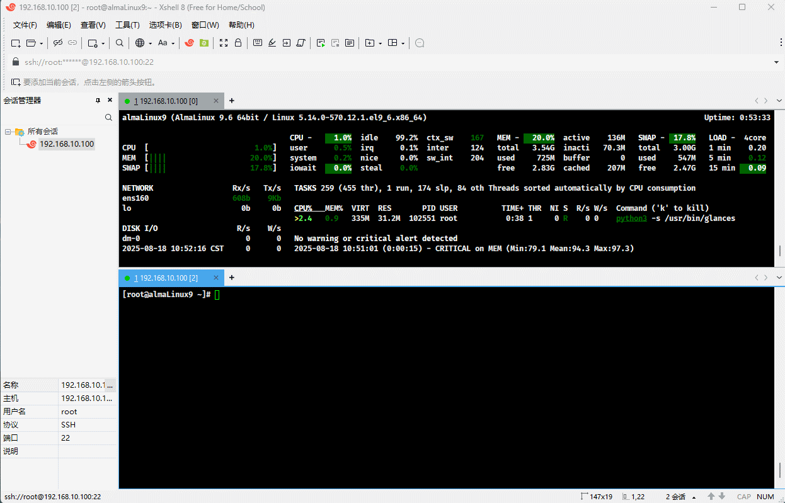
```

:::


* 示例：无内存泄漏

::: code-group

```c [main.c]
#include <stdbool.h>
#include <stdlib.h>
#include <stdio.h>

int main() {
    
    // 死循环
    while (true) {    
        // 在堆区一直不停地创建 1024 个 int 大小的内存
        // 并且不释放，就会产生内存泄漏
        int* ptr = (int*) malloc(sizeof(int) * 1024); 
        
        // 手动释放内存
        if (ptr != NULL) {
            printf("Allocated memory for %d integers.\n", 1024);
            free(ptr);
    	}
    }
    
    return 0;
}
```

```md:img [cmd 控制台]
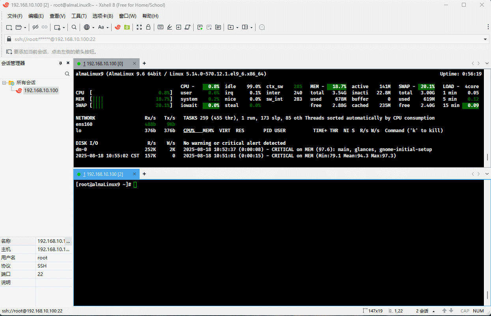
```

:::

### 1.3.2 自动垃圾回收

* Java 为了简化对象的释放，引入了自动的`垃圾回收`（Grabage Collection，简称 GC）机制，即：通过垃圾回收器对不再使用的对象完成自动回收。

> [!NOTE]
>
> * ① 垃圾回收器主要负责回收`堆`上不再使用的对象。
> * ② 很多现代化的编程语言，如：C#、Go 以及 Python 等都有自己的垃圾回收器。


* 垃圾回收器如果发现某个对象不再使用，就可以自动回收该对象。

> [!NOTE]
>
> 自动垃圾回收 ≠ 不会内存泄漏。不恰当地使用静态引用、缓存、监听器等仍可能导致“逻辑泄漏”。 


* 示例：

::: code-group

```java [Test.java]
import java.util.Date;

import java.util.ArrayList;
import java.util.List;

public class Test {
    static final int MB = 1024 * 1024;
    public static void main(String[] args) throws InterruptedException {
        // 阶段 1：制造大量短命对象，触发多次 Young GC
        for (int i = 0; i < 60; i++) {
            for (int j = 0; j < 50_000; j++) {
                byte[] tmp = new byte[4 * 1024]; // 4KB 短命对象
            }
            Thread.sleep(200);
        }

        // 阶段 2：占住一批内存，让堆明显增大
        List<byte[]> holder = new ArrayList<>();
        for (int i = 0; i < 160; i++) {  // 约 160MB
            holder.add(new byte[MB]);
            Thread.sleep(50);
        }

        // 阶段 3：释放引用，观察 GC 回收
        holder.clear();
        System.out.println("holder cleared; wait and observe...");
        // 保持进程存活，便于观察
        Thread.sleep(300_000);

    }
}
```

```md:img [cmd 控制台]
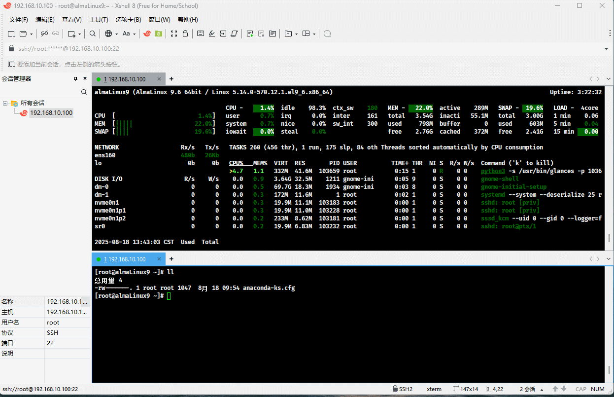
```

:::

### 1.3.3 手动垃圾回收 VS 自动垃圾回收

* 以下是`手动垃圾回收`与`自动垃圾回收`的对比表格：

| 对比维度     | 手动垃圾回收                                                 | 自动垃圾回收                                                 |
| ------------ | ------------------------------------------------------------ | ------------------------------------------------------------ |
| 定义         | 程序员显式分配和释放内存（如调用 `malloc`/`free`）。         | 由运行时系统自动检测并回收不再使用的内存。                   |
| 控制权       | 程序员完全控制内存生命周期。                                 | 运行时（GC）自动管理内存，程序员无需干预。                   |
| 典型语言     | C、C++                                                       | Java、Python、JavaScript、C#、Go、Ruby、Swift                |
| 内存分配函数 | `malloc`, `calloc`, `new`                                    | `new`（语言内置，无需手动释放）                              |
| 内存释放方式 | 必须显式调用 `free()` 或 `delete`                            | 无需手动释放，GC 自动回收不可达对象                          |
| 优点         | - 性能高，无 GC 开销<br>- 内存使用精确可控<br>- 适合实时系统 | - 减少内存泄漏风险<br>- 编程更安全、简洁<br>- 降低开发难度   |
| 缺点         | - 容易导致内存泄漏或悬空指针<br>- 编程复杂度高<br>- 易出错（如 double free） | - 存在 GC 停顿（影响实时性）<br>- 内存占用可能更高<br>- 不可预测的性能波动 |
| 常见问题     | 内存泄漏、野指针、重复释放、缓冲区溢出                       | GC 暂停（Stop-the-world）、内存占用高、延迟波动              |
| 性能特点     | 高效、低延迟、可预测                                         | 可能有停顿，吞吐量高但延迟不可控                             |
| 适用场景     | 嵌入式系统、操作系统、游戏引擎、高性能计算                   | Web 应用、企业级应用、移动开发、脚本语言                     |
| 资源管理机制 | RAII（C++）、智能指针（辅助）                                | 引用计数、标记-清除、分代收集、增量 GC 等                    |
| 调试工具     | Valgrind、AddressSanitizer、GDB                              | JVM Profiler、Chrome DevTools、Python tracemalloc            |
| 学习成本     | 较高，需理解内存模型                                         | 较低，开发者更关注业务逻辑                                   |

* 如果追求极致性能、低延迟或精细控制资源（操作系统、驱动、游戏引擎），选择`手动回收`。
* 如果追求开发效率、代码安全和可维护性（`Web`后端、`App`开发、脚本），选择`自动回收`。

### 1.3.4 应用场景

* ① 解决系统僵死的问题：大厂系统出现的许多僵死问题都和频繁的垃圾回收有关。

> [!NOTE]
>
> * ① 系统僵死就是程序还在运行中；但是，已经失去响应、无法操作、仿佛“死掉”了一样的状态。
> * ② JVM 忙于垃圾回收，导致用户的请求不能正常的处理有可能会导致系统出现僵死问题。

* ② 性能优化：对垃圾回收器的合理设置可以有效地提升程序的执行性能。
  * :one: 程序性能如果出现问题，可以对程序进行性能优化。
  * :two: 性能优化里面的重要手段（环节）就是对垃圾回收器的优化。
* ③ 高频面试题：
  * :one: 常见的垃圾回收器。
  * :two: 常见的垃圾回收算法。
  * :three: 四种引用。
  * :four: 项目中使用了哪一种垃圾回收器。


# 第二章：方法区的回收

## 2.1 概述

* 之前，我们已经学习过`运行时数据区域`了，如下所示：


* 对于线程不共享的区域，如：程序计数器、JVM 虚拟机栈以及本地方法栈，是不需要 JVM 进行垃圾回收的。因为这些区域的生命周期都是伴随着线程的创建而创建，线程的销毁而销毁。

## 2.2 方法区的回收

### 2.2.1 概述

* 对于方法区的回收，我们最主要关注的是`方法区中的类信息到底是怎么回收的`。
* 首先，回顾下类的生命周期，如下所示：

| 类的生命周期主要阶段       | 描述                                                         |
| :------------------------- | :----------------------------------------------------------- |
| ① 加载（Loading）          | 类的字节码或定义被读入内存，但还未进行初始化。 这通常发生在程序首次引用该类时。 |
| ② 链接（Linking）          | 验证（Verification）、准备（Preparation）和解析（Resolution）。 <br>验证就是用来验证内容释放满足《Java 虚拟机规范》。<br>准备就是给静态变量赋初始化值。<br>解析就是将常量池中的符号引用替换成指向内存的直接引用。 |
| ③ 初始化（Initialization） | 执行类的静态初始化代码，如：静态变量赋值、静态代码块等。 这个阶段确保类在首次使用前处于正确状态。 |
| ④ 使用（Using）            | 类被实例化创建对象，或者直接访问静态成员。 这是类发挥实际作用的阶段。 |
| ⑤ 卸载（Unloading）        | 当类不再被引用且满足特定条件时，垃圾回收器可能会卸载该类，释放相关内存。 |

* 所谓的`卸载`指的就是`方法区中的类到底是怎么回收的`。

### 2.2.2 方法区中类的回收

* 判断一个类是否可以被卸载，需要同时满足以下三个条件：
  * ① 此类所有实例对象都已经被回收，即：在堆上不存在任何该类的实例对象以及子类对象。
  * ② 加载该类的类加载器已经被回收。
  * ③ 该类对应的 java.lang.Class 对象在任何地方都没有被引用。

> [!NOTE]
>
> * ① 在实际开发中，类卸载的场景一般很少使用，主要应用于 OSGI、JSP 等热部署的应用场景中。
> * ② 每个 JSP 文件对应一个唯一的类加载器，当一个 JSP 文件修改了，就直接卸载这个 JSP 类加载器，重新创建类加载器，以便重新加载 JSP 文件。
> * ③ JSP 已经过时了，前端早已进入 MVVM 的时代，如：Angular、Vue 和 React 等。


* 示例：条件 ①

```java 
package com.github;

import java.lang.reflect.InvocationTargetException;

public class Test {
    public static void main(String[] args) throws Exception {
        Class<?> clazz = Class.forName("com.github.domain.Student");

        Object obj = clazz
                .getDeclaredConstructor()
                .newInstance();
        // 将局部变量对堆上实例对象的引用去除了，所以对象就可以被回收
        obj = null;

    }
}
```


* 示例：条件 ②

```java
package com.github;

import java.net.URL;
import java.net.URLClassLoader;

public class Test {
    public static void main(String[] args) throws Exception  {
        URLClassLoader classLoader =
                new URLClassLoader(new URL[]{new URL("file:D:\\lib\\")});

        // 让局部变量对类加载器的引用去除，类加载器就可以被回收
        classLoader = null;
    }
}
```


* 示例：条件 ③

```java
package com.github;

public class Test {
    public static void main(String[] args) throws Exception {
        Class<?> clazz = Class.forName("com.github.domain.Student");

        // 该类对应的 java.lang.Class 对象没有在任何地方被引用
        clazz = null;

    }
}
```

### 2.2.3 类生命周期相关 JVM 参数

- JDK9 之前：

| 类生命周期阶段 | 对应日志参数                | 输出时机           | 信息内容                 |
| :------------- | :-------------------------- | :----------------- | :----------------------- |
| 加载           | `-XX:+TraceClassLoading`    | 字节码读入内存时   | 类名、来源路径、加载器   |
| 链接-验证      | `-XX:+TraceClassResolution` | 符号引用解析时     | 被解析的类和引用关系     |
| 链接-准备      | 无专门参数                  | -                  | 需要通过内存监控工具观察 |
| 链接-解析      | `-XX:+TraceClassResolution` | 符号引用转直接引用 | 解析的符号引用详情       |
| 初始化         | 无专门参数                  | 执行`<clinit>()`时 | 初始化开始和完成         |
| 使用           | 无专门参数                  | -                  | 通过其他运行时日志观察   |
| 卸载           | `-XX:+TraceClassUnloading`  | GC 回收类时        | 被卸载的类和加载器       |

- JDK9 之后：

| 类生命周期阶段 | 对应日志标签          | 输出时机           | 信息内容                 |
| :------------- | :-------------------- | :----------------- | :----------------------- |
| 加载           | `-Xlog:class+load`    | 字节码读入内存时   | 类名、来源路径、加载器   |
| 链接-验证      | `-Xlog:class+resolve` | 符号引用解析时     | 被解析的类和引用关系     |
| 链接-准备      | 无专门标签            | -                  | 需要通过内存监控工具观察 |
| 链接-解析      | `-Xlog:class+resolve` | 符号引用转直接引用 | 解析的符号引用详情       |
| 初始化         | `-Xlog:class+init`    | 执行`<clinit>()`时 | 初始化开始和完成         |
| 使用           | 无专门标签            | -                  | 通过其他运行时日志观察   |
| 卸载           | `-Xlog:class+unload`  | GC 回收类时        | 被卸载的类和加载器       |

### 2.2.4 演示

* 我们可以通过 JVM 参数来演示类加载和类卸载的过程。

> [!NOTE]
>
> JDK 9 之后的类加载和类卸载的 JVM 参数是 `-Xlog:class+load` 以及 `-Xlog:class+unload`。


* 示例：

::: code-group

```bash
# JVM 参数
-Xlog:class+load -Xlog:class+unload
```

```java [Test.java]
package com.github;

import java.net.URL;
import java.net.URLClassLoader;

public class Test {
    public static void main(String[] args) throws Exception {

        for (int i = 0; i < 20; i++) {

            // 创建独立的类加载器
            Class<?> clazz;
            try (URLClassLoader loader = new URLClassLoader(
                    new URL[]{new URL("file:D:/lib/")},
                    null  // 父加载器设为 null ，确保隔离
            )) {

                // 加载类并实例化
                clazz = loader.loadClass("com.github.domain.Student");
            }
            Object obj = clazz
                    .getDeclaredConstructor()
                    .newInstance();

            // 触发GC
            if (i % 5 == 0) {
                System.gc();
                Thread.sleep(100);
            }
        }

    }
}
```

```md:img [cmd 控制台]
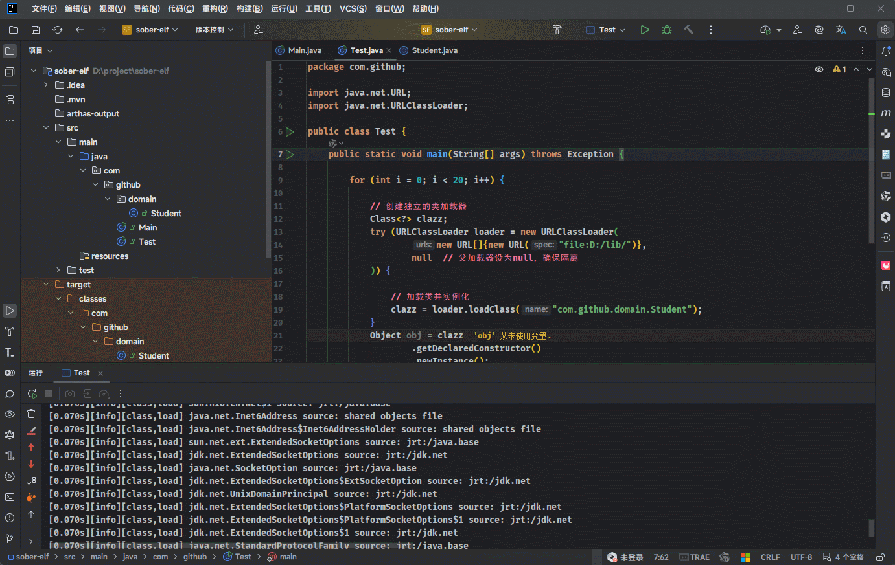
```

:::


# 第三章：堆回收

## 3.1 概述

* `堆`是`运行时数据区域`中最大的部分，里面包含了很多对象，如下所示：

 


* 垃圾回收器回收对象，首选需要判断堆上哪些对象可以被回收，哪些对象不可以被回收。

## 3.2 如何判断堆上的对象能否被回收？

* Java 中的对象能否被回收，是根据对象是否被`引用`来决定。

> [!NOTE]
>
> * ① 如果该对象被引用了（局部变量保存有该对象的地址），则说明该对象还在使用，就不允许被回收。
> * ② 上述的说法不是很精准，后文会逐渐进行修正！！！


* 示例：局部变量对堆上对象的引用

::: code-group

```java [Student.java]
public class Student {
    
    private String name;
    
    private Integer age;
    
    ...
}
```

```java [Test.java]
public class Test {
    public static void main(String[] args) throws Exception {

        Student stu = new Student();

        // 将 stu 设置为 null
        // 就意味着将堆上对象的引用去除掉，即：对象可以被 GC 回收
        stu = null; // [!code highlight]

    }
}
```

```md:img [cmd 控制台]
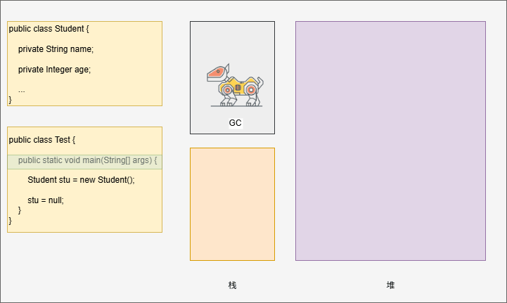
```

:::


* 示例：对象中包含对象引用

::: code-group

```java [Test.java]
class A {
    B b;
}

class B {
    A a;
}

public class Test {
    public static void main(String[] args) throws Exception {
        A a1 = new A();
        B b1 = new B();
        a1.b = b1;
        b1.a = a1;
        
        // 将 A 实例对象回收，有两个引用要去除。
        // ① 栈中 a1 变量到 A 对象的引用。
        // ② B 对象到 A 对象的引用。
        a1 = null; // [!code highlight:2]
        b1.a = null;
    }
}
```

```md:img [cmd 控制台]
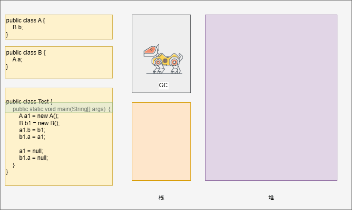
```

::: 


* 示例：对象中包含对象引用

::: code-group

```java [Test.java]
class A {
    B b;
}

class B {
    A a;
}

public class Test {
    public static void main(String[] args) throws Exception {
        A a1 = new A();
        B b1 = new B();
        a1.b = b1;
        b1.a = a1;
        
        // 因为局部变量都没引用这两个对象，即：没有任何方式去访问这两个对象。
        // 所以这两个对象可以被回收。
        // 换言之，即使堆上对象之间相互有引用关系，也不影响对象的回收。
        a1 = null; // [!code highlight:2]
        b1 = null;
    }
}
```

```md:img [cmd 控制台]

```

::: 

## 3.3 如何判断对象是否被引用？

### 3.3.1 概述

* Java 虚拟机底层主要通过以下两种方式，去判断该对象是否能被引用（是否能被回收）。
  * :one: 引用计数法。
  * :two: 可达性分析法。

### 3.3.2 引用计数法

#### 3.3.2.1 概述

* `引用计数法`会为每个对象维护一个引用计数器，当对象被引用时`+1`，取消引用时`-1` 。


* 示例：引用计数法清理垃圾

::: code-group

```java [Test.java]
class A {
    B b;
}

class B {
   
}

public class Test {
    public static void main(String[] args)  {
        A a1 = new A();
        B b1 = new B();
        a1.b = b1;
        
        a1.b = null;        
        a1 = null;
    }
}
```

```md:img [cmd 控制台]
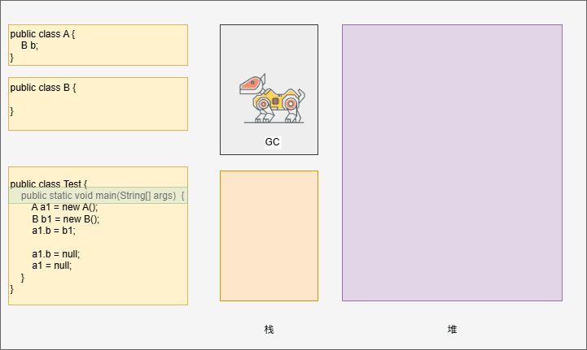
```

::: 

#### 3.3.2.2 优缺点

* 引用计数法的优点是`实现简单`，如：C++ 中的智能指针就是采用了引用计数法。
* 引用计数法有如下的缺点：
  * :one: 每次引用和取消引用都需要维护计数器，对系统性能有一定的影响。
  * :two: 存在循环引用问题，即：A 引用 B，B 引用 A ，会出现对象无法回收的问题。

> [!NOTE]
>
> * ① 由于引用计数器的循环引用问题，导致对象不能回收，就是内存泄漏问题；C++ 和 OC 等编程语言压根不处理，而是完全依赖开发者主动识别并自行解决。
> * ② Java 并没有采取`引用计数法`，而是采取了`可达性分析算法`来解决，即：即使有循环引用的对象也可以回收。


* 示例：演示循环引用问题

::: code-group

```java [Test.java]
class A {
    B b;
}

class B {
   A a;
}

public class Test {
    public static void main(String[] args)  {
        A a1 = new A();
        B b1 = new B();
        
        // 循环引用
        a1.b = b1; // [!code highlight:2]
        b1.a = a1;
        
        a1 = null;        
        b1 = null;
    }
}
```

```md:img [cmd 控制台]
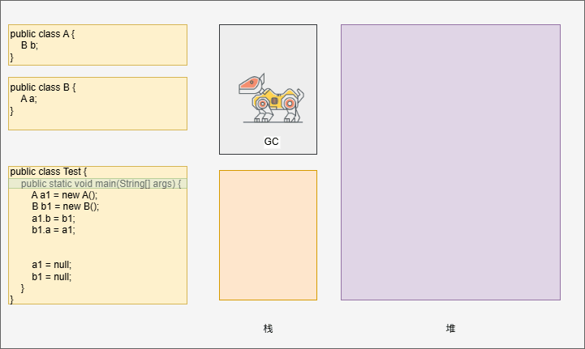
```

::: 

#### 3.3.2.3 Java 对于循环引用是否会出现内存泄漏？

* 我们可以通过查看垃圾回收信息，来判断如果需要循环引用，Java 是否会出现内存泄漏？

> [!NOTE]
>
> * ① 可以使用 `-verbose:gc` 参数来查看垃圾回收信息。
> * ② 日志信息，如下所示：
>
> 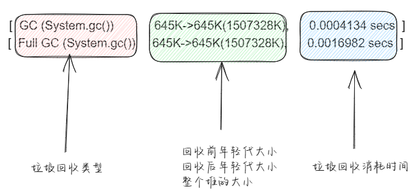


* 示例：

::: code-group

```java [Test.java]
class A {
    B b;
}

class B {
   A a;
}

public class Test {
    public static void main(String[] args)  {
        while (true){
            A a1 = new A();
            B b1 = new B();

            // 循环引用
            a1.b = b1;
            b1.a = a1;

            a1 = null;
            b1 = null;

            System.gc();
        }
    }
}
```

```md:img [cmd 控制台]

```

```bash [日志]
# 通过死循环创建对象，内存并没有上升，一直维持在 644k 左右
# 说明每轮循环创建的对象都被垃圾回收器进行回收了。

[GC (System.gc())  644K->644K(1507328K), 0.0003783 secs]
[Full GC (System.gc())  644K->644K(1507328K), 0.0017401 secs]
[GC (System.gc())  644K->644K(1507328K), 0.0004623 secs]
[Full GC (System.gc())  644K->644K(1507328K), 0.0016572 secs]
[GC (System.gc())  644K->644K(1507328K), 0.0005047 secs]
[Full GC (System.gc())  644K->644K(1507328K), 0.0016296 secs]
[GC (System.gc())  644K->644K(1507328K), 0.0004049 secs]
[Full GC (System.gc())  644K->644K(1507328K), 0.0021300 secs]
[GC (System.gc())  644K->644K(1507328K), 0.0004555 secs]
[Full GC (System.gc())  644K->644K(1507328K), 0.0019811 secs]
[GC (System.gc())  644K->644K(1507328K), 0.0005147 secs]
[Full GC (System.gc())  644K->644K(1507328K), 0.0018901 secs]
```

::: 

### 3.3.3 可达性分析法

#### 3.3.3.1 概述

* 可达性分析算法（Reachability Algorithm）是 JVM 中垃圾回收（GC）的核心机制。

> [!NOTE]
>
> 可达性分析算法用于判断哪些对象是“存活的”（程序仍在使用，不能被回收）；哪些是“垃圾”（不可达，可以被安全回收）。

* 可达性分析算法的核心思想是：从一组固定的`根对象`（GC Roots），通过对象之间的引用链，追踪所有可达（reachable）的对象；如果未必追踪到的对象就是不可达的，将会被回收。

> [!NOTE]
>
> * ① 可达（Reachable）：一个对象能从 GC Roots 通过引用链被访问到，如：Root --> A --> B （A 和 B 都是可达的）。
> * ② 不可达（Unreachable）：一个对象无法从任何 GC Roots 通过引用链被访问到，即：程序无法再访问它，就认为是垃圾，可以被安全回收。


* 可达性分析算法是 JVM 垃圾回收的基础，解决了早期垃圾回收方法（引用计数器）的缺陷（循环引用问题）。

#### 3.3.3.2 可达性算法的工作原理

* 可达性算法主要分为两个阶段：标记和回收。

* ① 确定 GC  Roots（根对象）：GC Roots 是算法的起点，它们是始终存活的对象，包括：

> [!NOTE]
>
> GC Roots 是 JVM 能直接访问的“源头”对象，它们永远不会被回收！！！

| GC Roots 对象                                                | 描述                                                         |
| ------------------------------------------------------------ | ------------------------------------------------------------ |
| :one: 线程 Thread 对象（栈帧中的局部变量）                   | 当前运行方法中，方法参数、局部变量引用的对象，如：`Object obj = new Object();` 中的 `obj`。 |
| :two: 系统类加载器加载的 java.lang.Class 对象，引用类中的静态变量 | 类中 `static` 修饰的变量引用的对象，如：`public static User user = new User();` 中的 `user`。 |
| :three: JNI 引用（本地方法调用的全局对象）                   | 本地方法（Native Code）中通过 JNI 传递的对象引用（Java 程序员无需了解，属于 JVM 底层细节） |
| :four: 监视器对象                                            | 用来保存同步锁 synchronized 关键字持有的对象                 |

* ② 遍历引用链，用于标记存活对象。
  * JVM 从所有的 GC Roots 出发，递归遍历所有的引用链。
    * Root --> A --> B --> C，则 A、B、C 都是可达的。
    * 使用 DFS 或 BFS 遍历对象图（Object Graph），标记所有可达对象。
  * 关键特性：
    * 解决循环引用：即使 A 和 B 互相引用（`A ↔ B`），但如果它们无法从 GC Roots 到达（ `Root → A` 但 `B` 无其他引用），则 A 和 B 都会被回收。
    * STW（Stop-The-World）：标记阶段通常需要暂停所有应用线程（现代 GC 器如 ZGC 通过并发标记减少停顿）。

* ③ 回收不可达对象：标记完成后，回收器根据策略清理不可达的对象。

| 回收器策略   | 描述                                     |
| ------------ | ---------------------------------------- |
| Mark-Sweep   | 直接清除不可达对象（可能产生内存碎片）。 |
| Mark-Compact | 清除后压缩内存，减少碎片。               |
| Copying      | 将存活对象复制到新区域。                 |

#### 3.3.3.3 证明 GC Roots 

* 可以通过 Arthas 或 IDEA 以及 [MAT](https://eclipse.dev/mat/)（Eclipse Memory Analyzer）工具来查看 GC Roots。

> [!NOTE]
>
> * ① 使用 Arthas 的 heapdump 命令将`堆内存快照`保存到本地磁盘中，以 `*.hprof` 命名（IDEA 也支持）。
> * ② 使用 MAT 工具打开堆内存快照文件。
> * ③ 选择 GC Roots 功能查看所有的 GC Roots 。


* 示例：准备代码

```java
package com.github;

import java.io.IOException;

class A {
    B b;
}

class B {
    A a;
}

public class Test {
    public static void main(String[] args) throws IOException {
        A a1 = new A();
        B b1 = new B();

        // 循环引用
        a1.b = b1;
        b1.a = a1;

        System.in.read();

    }
}
```


* 示例：使用 IDEA 导出堆内存快照

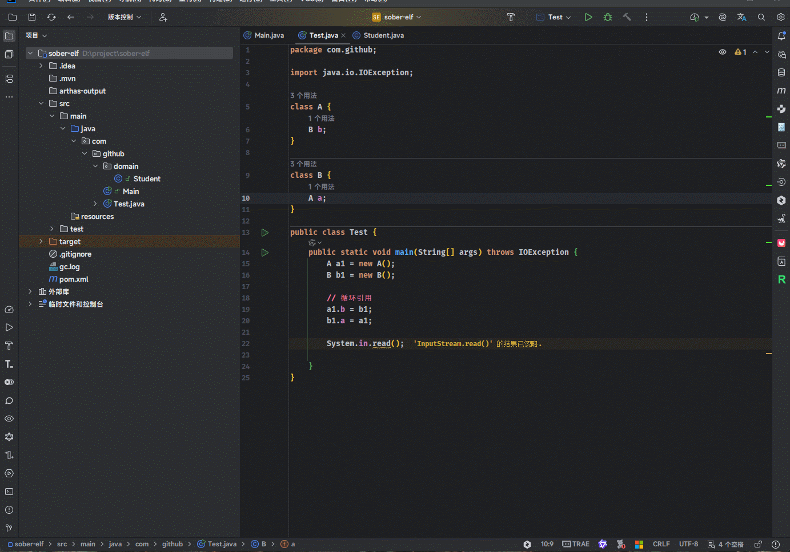


* 示例：MAT 导入堆内存快照文件，并查看 GC Roots

::: code-group

```bash
System Class # 系统类加载器加载的 java.lang.Class 对象，引用类中的静态变量
JNI  Global # JNI 引用（本地方法调用的全局对象）
Thread # 线程 Thread 对象（栈帧中的局部变量）
Busy Monitor # 监视器对象
```

```md:img [cmd 控制台]
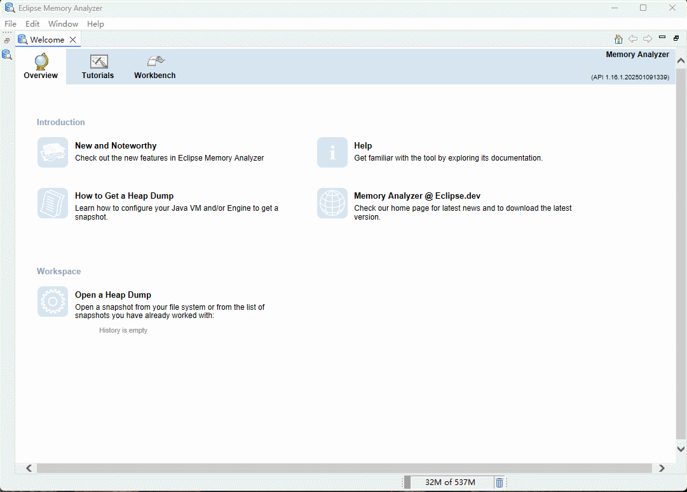
```

:::

#### 3.3.3.4 可达性算法分析

* 需求：分析 A 实例对象和 B 实例对象，是如何通过可达性算法来判断是否可被回收的？


* 示例：

::: code-group

```java [Test.java]
class A {
    B b;
}

class B {
    A a;
}

public class Test {
    public static void main(String[] args) throws IOException {
        A a1 = new A();
        B b1 = new B();

        // 循环引用
        a1.b = b1;
        b1.a = a1;

        a1 = null;
        b1 = null;

    }
}
```

```md:img [cmd 控制台]

```

:::

#### 3.3.3.5 GC Roots 对象详解

* ① 线程 Thread 对象（栈帧中的局部变量），即：当前运行方法中，方法参数、局部变量引用的对象。


* ② 系统类加载器加载的 java.lang.Class 对象，引用类中的静态变量：


* ③ 监视器对象，用来保存同步锁 synchronized 关键字持有的对象。


* ④ JNI 引用（本地方法调用的全局对象），本地方法（Native Code）中通过 JNI 传递的对象引用。

> [!NOTE]
>
> Java 程序员无需了解，属于 JVM 底层细节！！！

#### 3.3.3.6 查看 GC Root 底层细节

* 可以通过 Arthas 或 IDEA 以及 [MAT](https://eclipse.dev/mat/)（Eclipse Memory Analyzer）工具来查看 GC Roots。

> [!NOTE]
>
> * ① 使用 Arthas 的 heapdump 命令将`堆内存快照`保存到本地磁盘中，以 `*.hprof` 命名（IDEA 也支持）。
> * ② 使用 MAT 工具打开堆内存快照文件。
> * ③ 选择 GC Roots 功能查看所有的 GC Roots 。


* 示例：准备代码

```java
package com.github;

import java.io.IOException;

class A {
    B b;
}

class B {
    A a;
}

public class Test {
    // 静态变量 a
    public static A a = new A();

    public static void main(String[] args) throws IOException {

        // 局部变量
        A a1 = new A();
        B b1 = new B();

        // 循环引用
        a1.b = b1;
        b1.a = a1;

        // 静态变量 a 赋值为局部变量 a1
        a = a1;

        System.in.read();

    }
}
```


* 示例：使用 IDEA 导出堆内存快照

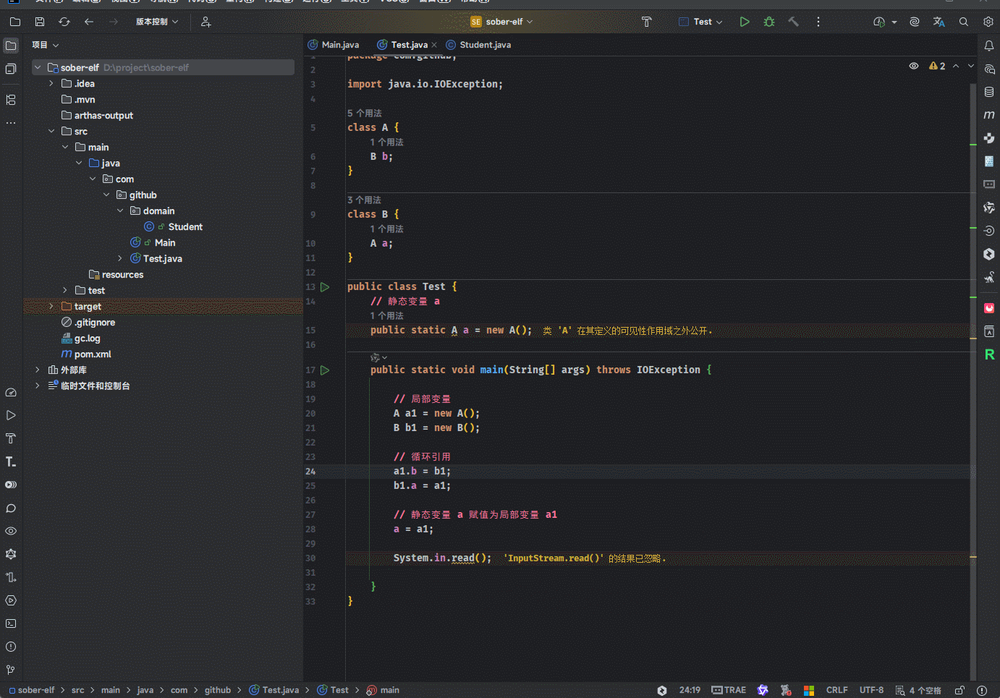


* 示例：MAT 导入堆内存快照文件

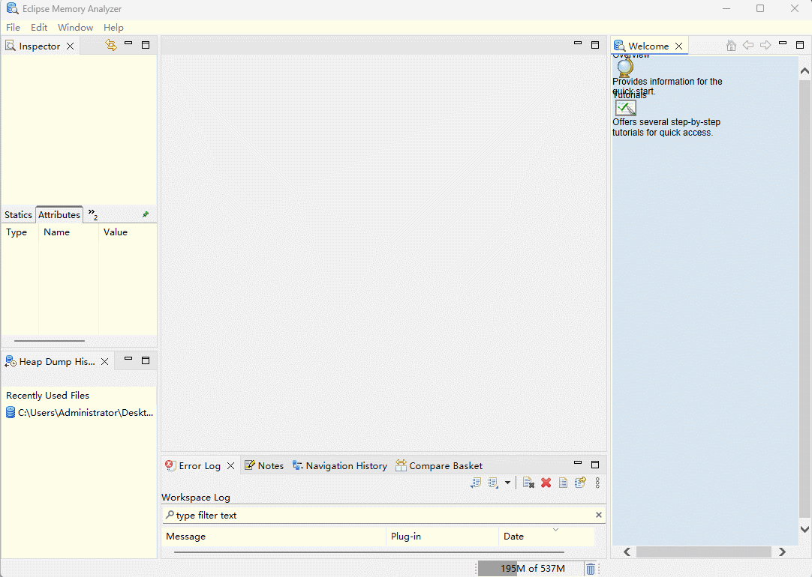


* 示例：MAT 查看局部变量

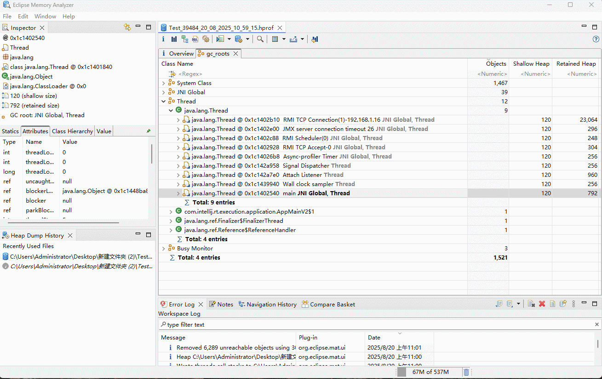


* 示例：MAT 查看静态变量

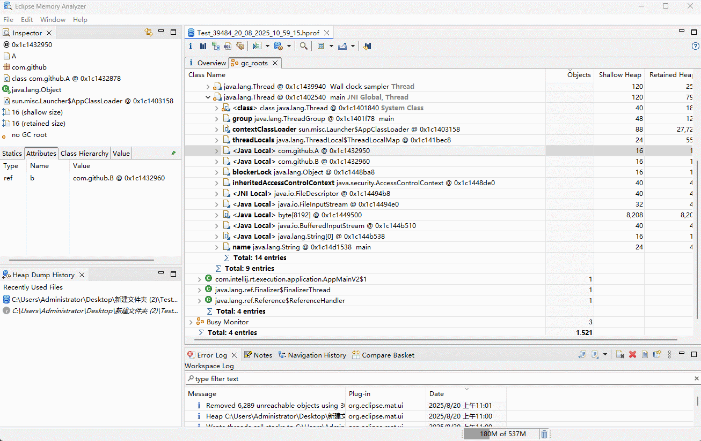

## 3.4 常见的引用对象

### 3.4.1 概述

* `可达性分许算法`中描述的`对象引用`，一般指的是`强引用`，即：通过 GC Root 对象对普通对象有引用关系，只要有这层关系，普通对象就不会被回收。
* 其实，除了`强引用`之外，Java 中还设计了几种`其他形式的引用`，如下所示：
  * :one: 软引用。
  * :two: 弱引用。
  * :three: 虚引用。
  * :four: 终结器引用。

### 3.4.2 软引用

#### 3.4.2.1 概述

* `软引用`相对于`强引用`是一种比较`弱`的引用关系，即：`如果一个对象只有软引用关联到它，当程序内存不足的时候，就会将软应用中的数据进行回收`。

> [!NOTE]
>
> * ① 当程序的内存出现不足的时候，通过``强引用引用的普通对象会被保留。`
> * ② 当程序的内存出现不足的时候，通过`弱引用引用的普通对象会被回收` ，这样可以帮我们去释放掉一定的堆内存，保证程序的正常运行。

* JDK 1.2 之后提供了 `SoftReference` 类实现`软引用`，并且`软引用`常用于`缓存`中。

> [!NOTE]
>
> * ① `软引用`包含的对象，一定不可能是程序必须要使用到的数据。
> * ② 假设在`软引用`中存放了一些重要的数据，当内存出现不足的时候，这部分数据就会被回收掉，这样有可能会导致程序无法正常的运行。
> * ③ `软引用`通常用于缓存中，因为`缓存`一般来说就是为了提高程序的访问性能；换言之，即使缓存中的数据不能再使用，程序也应该可以通过访问真实的数据，让其继续运行小区。


### 3.4.3 弱引用


### 3.4.4 虚引用


### 3.4.5 终结器引用


## 3.5 垃圾回收算法


## 3.6 垃圾回收器


