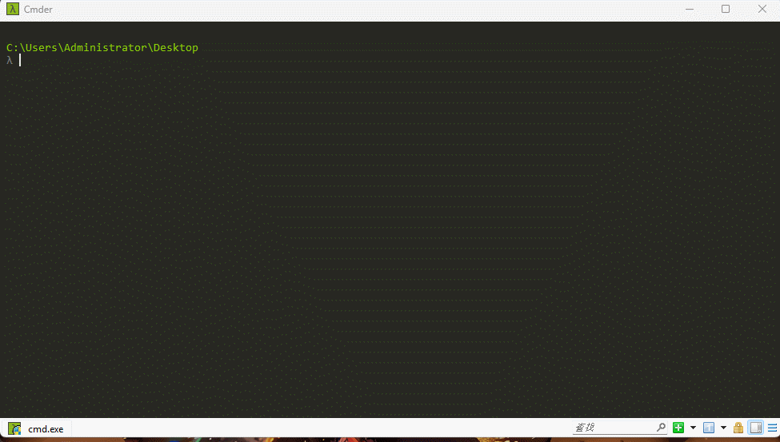
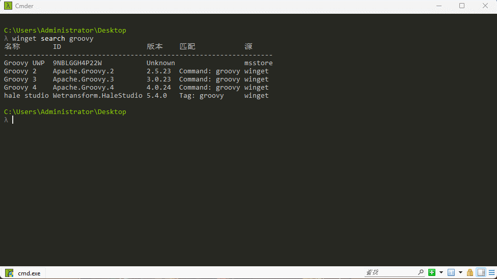
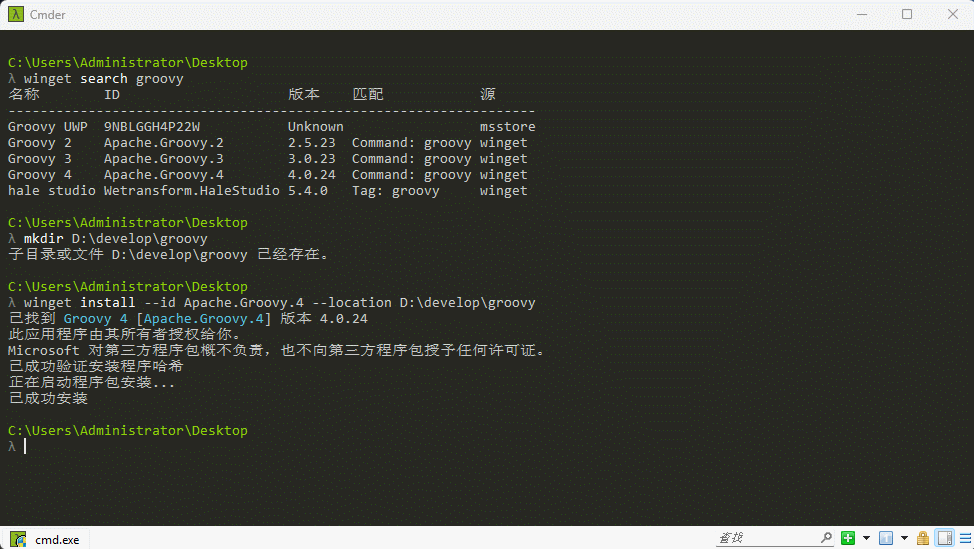
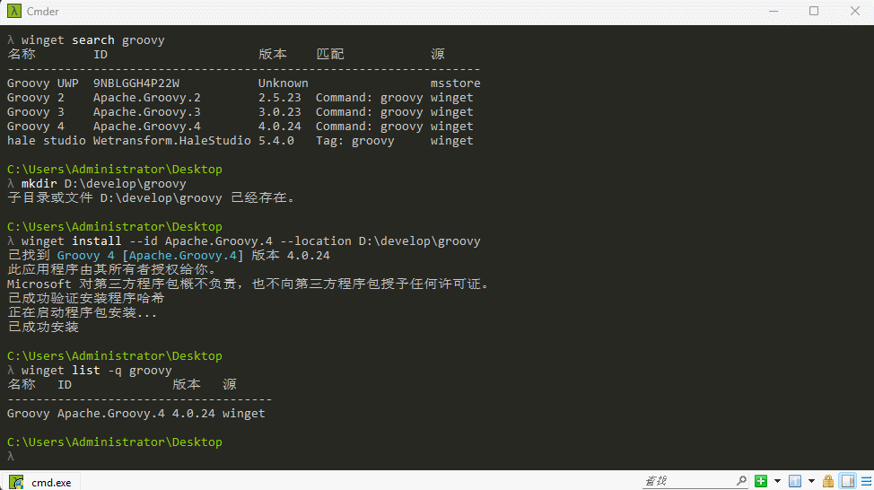

> [!IMPORTANT]
>
> * ① 本人计算机的操作系统是 Win11 。
> * ② 在 Windows 11、 Windows 10 1709（版本 16299）或更高版本上以及 Windows Server 2025 中，Windows 开箱支持 WinGet 程序包管理器。
> * ③ 如果在上述版本的操作系统中，发现 winget 命令不可用，在 PowerShell 中执行 `Add-AppxPackage -RegisterByFamilyName -MainPackage Microsoft.DesktopAppInstaller_8wekyb3d8bbwe` 命令。
> * ④ WinGet 程序包管理器所管理的程序包可能会托管到 GitHub 中，因此需要你进行科学上网。


# 第一章：Gradle 简介


# 第二章：Groovy 安装

## 1.1 手动安装


## 1.2 winget 命令安装

* 查询 Groovy 版本：

```shell
winget search groovy
```



* 创建目录并安装到指定位置：

```shell
# 创建目录
mkdir D:\develop\groovy
# 安装到指定目录
winget install --id Apache.Groovy.4 --location D:\develop\groovy
```



* 查询是否安装成功：

```shell
winget list -q groovy
```



* 卸载 Groovy（可选）：

```shell
winget uninstall groovy
```


